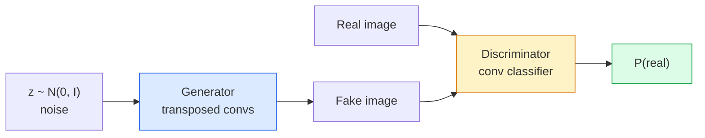
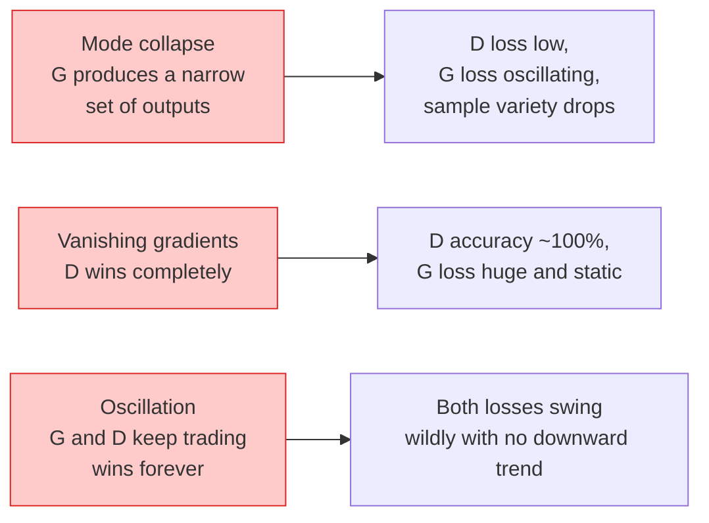

# Génération d'images  GAN

> Le GAN est un réseau neural entre deux réseaux. Un responsable du dessin et un responsable de l'évaluation.

**Type:** Build
**Languages:** Python
**Prerequisites:** Phase 4 Lesson 03 (CNNs), Phase 3 Lesson 06 (Optimizers), Phase 3 Lesson 07 (Regularization)
**Time:** ~75 分钟

## Objectif de l'apprentissage
- Expliquer le minimum entre générateur et discriminateur, ainsi que pourquoi l'équilibre correspond au modèle = données
- Dans PyTorch, mettez DCGAN en place et faites en sorte qu'il génère des images 32x32 synthétisées en continu en 60 pages
- Utilisation de trois critères techniques de stabilisation de la GAN  entraînement: perte non saturante, norme spectrale, Règlement de mise à jour à deux échelles
- 读取训练曲线,区分健康收与模式崩,oscillation, discriminateur-gains-completement

##  problématique
Classification Le réseau de l'Église va cartographier les images vers les étiquettes. La génération a inversé ce problème: le prélèvement ressemble à une nouvelle image de la même distribution.

標準 Loss Function (MSE、cross-entropie) ne peut pas mesurer si ce modèle provient de la réelle distribution── minimisation par image de l'erreur produira un résultat moyen flou, plutôt que de l'échantillon de la réelle sensation──突破点 lies in learning Loss: train un second réseau, faire sa tâche est de distinguer le vrai du faux, et de l'utiliser pour juger pour stimuler le générateur──

Les GAN (Goodfellow et coll., 2014) ont défini ce cadre. En 2018, les StyleGAN ont déjà pu générer des photos difficiles à distinguer entre 1024x1024 personnes.

## 概念
### Les deux réseaux



**generator**G 接收一个噪音 Vecteur `z`Il a fait une image.**discriminator**D 接收一张图像并输出单个标量: 图像为真的概率──

### Le jeu

G 希望 D 犯错――D 希望自己判断正确――形式化地说:

```
min_G max_D  E_x[log D(x)] + E_z[log(1 - D(G(z)))]
```

De droite à gauche:D est en train de le maximiser en réalité`log D(real)`) et faux`log (1 - D(fake))`) la précision de l'image. G est en train de minimiser D dans la fausse précision de la hauteur  il veut `D(G(z))`Très haut.

Bon compagnon, il a prouvé que le minimum existe dans l'équilibre général.`p_G = p_data`,D dans toutes les positions sont des sorties de 0,5, et génèrent une distribution et une divergence Jensen-Shannon entre la réelle distribution est à zéro.

### Perte non saturante

La forme de la figure ci-dessus est instable sur la valeur numérique.`D(G(z))`Pour chaque faux, c'est presque nul.`log(1 - D(G(z)))`Pour G's Gradient 会消失──修复方法:翻转 G's Loss──

```
L_D = -E_x[log D(x)] - E_z[log(1 - D(G(z)))]
L_G = -E_z[log D(G(z))]                          # non-saturating
```

Je suis là.`D(G(z))`接近零时,G 的损失 很大,Gradient 也有信息量──每现代GAN都使用这个变体进行训练──

### Règles d'architecture DCGAN

Radford、Metz、Chintala (2015) va transformer les expériences de nombreuses années de défaillance en cinq règles, ce qui rendra les entraînements GAN plus stables:

1. Utilisez des convex à pas en pas pour le regroupement.
2. Dans le générateur et le discriminateur, tous utilisent la norme de lot, mais G's output et D's input sont exclus.
3. Dans les structures plus profondes, le déplacement des couches entièrement connectées.
4. G 在除输出层外所有层使用 ReLU(输出层用 tanh,将输出限制在 [-1, 1])
5. D 在所有层使用LeakyReLU(negative_slope=0.2)。

Chaque GAN moderne basé sur des conventions (StyleGAN, BigGAN, GigaGAN) est toujours issu de ces règles et a été remplacé une fois par une partie de celles-ci.

### Mode d'échec  et caractéristiques



- **Mode collapse**:G 找到一张能骗过 D 的图像, puis seulement générer elle──修复:加入迷你批次歧视、光谱规范,或标签条件──
- **Discriminator wins**:D 变强太快,G 的 Gradient 消失──修复:减小 D、降低 D learning rate,或对真实标签 应用标签滑滑──
- **Oscillation**Les deux réseaux continuent de s'enrichir, mais ne se rapprochent pas de l'équilibre.

### Évaluation

Les GAN n'ont pas de vérité, alors comment savez-vous qu'ils fonctionnent ?

- **Sample inspection** chaque époque 结时直接查看 64 个样本──不可妥协──
- **FID (Fréchet Inception Distance)** réelle collection et génération de collections  Distribution entre les caractéristiques de l'Inception-v3  distance 越低越好──社区标准──
- **Inception Score**较旧,也更脆弱; priorité utiliser FID。
- **Precision/Recall for generative models**分别衡量质量 (precision)和覆盖度 (recall) ∼比单独使用FID 更有信息量∼

Pour les petites données synthétiques, l'inspection de l'échantillon est suffisante.


```figure
cv-gan-image
```

## - Je le construis.
### 步骤 1: Générateur

Un petit générateur DCGAN, reçoit 64 dimensions de bruit et génère une image 32x32.

```python
import torch
import torch.nn as nn

class Generator(nn.Module):
    def __init__(self, z_dim=64, img_channels=3, feat=64):
        super().__init__()
        self.net = nn.Sequential(
            nn.ConvTranspose2d(z_dim, feat * 4, kernel_size=4, stride=1, padding=0, bias=False),
            nn.BatchNorm2d(feat * 4),
            nn.ReLU(inplace=True),
            nn.ConvTranspose2d(feat * 4, feat * 2, kernel_size=4, stride=2, padding=1, bias=False),
            nn.BatchNorm2d(feat * 2),
            nn.ReLU(inplace=True),
            nn.ConvTranspose2d(feat * 2, feat, kernel_size=4, stride=2, padding=1, bias=False),
            nn.BatchNorm2d(feat),
            nn.ReLU(inplace=True),
            nn.ConvTranspose2d(feat, img_channels, kernel_size=4, stride=2, padding=1, bias=False),
            nn.Tanh(),
        )

    def forward(self, z):
        return self.net(z.view(z.size(0), -1, 1, 1))
```

Quatre convois transposés, chacun utilisé.`kernel_size=4, stride=2, padding=1`Ainsi, ils peuvent nettoyer le volume de l'espace à deux fois.

### 步骤 2: Discriminateur

Les réactions de l'émetteur sont en train de se produire.

```python
class Discriminator(nn.Module):
    def __init__(self, img_channels=3, feat=64):
        super().__init__()
        self.net = nn.Sequential(
            nn.Conv2d(img_channels, feat, kernel_size=4, stride=2, padding=1),
            nn.LeakyReLU(0.2, inplace=True),
            nn.Conv2d(feat, feat * 2, kernel_size=4, stride=2, padding=1, bias=False),
            nn.BatchNorm2d(feat * 2),
            nn.LeakyReLU(0.2, inplace=True),
            nn.Conv2d(feat * 2, feat * 4, kernel_size=4, stride=2, padding=1, bias=False),
            nn.BatchNorm2d(feat * 4),
            nn.LeakyReLU(0.2, inplace=True),
            nn.Conv2d(feat * 4, 1, kernel_size=4, stride=1, padding=0),
        )

    def forward(self, x):
        return self.net(x).view(-1)
```

Le dernier convaincre`4x4`carte de caractéristiques 降到 `1x1`◊输出是每张图像一个标量; seulement pendant la période de calcul de la perte 应用 sigmoid。

### 步骤 3: étape de formation

交替执行: chaque lot, avant de mettre à jour une fois D, après de mettre à jour une fois G.

```python
import torch.nn.functional as F

def train_step(G, D, real, z, opt_g, opt_d, device):
    real = real.to(device)
    bs = real.size(0)

    # D step
    opt_d.zero_grad()
    d_real = D(real)
    d_fake = D(G(z).detach())
    loss_d = (F.binary_cross_entropy_with_logits(d_real, torch.ones_like(d_real))
              + F.binary_cross_entropy_with_logits(d_fake, torch.zeros_like(d_fake)))
    loss_d.backward()
    opt_d.step()

    # G step
    opt_g.zero_grad()
    d_fake = D(G(z))
    loss_g = F.binary_cross_entropy_with_logits(d_fake, torch.ones_like(d_fake))
    loss_g.backward()
    opt_g.step()

    return loss_d.item(), loss_g.item()
```

D étape en milieu `G(z).detach()`Pour ce qui est de la mise à jour de la D 时 Gradient 流入 G ⋅ oublier que c'est un bug classique des débutants ⋅

### 步骤 4: dans des formes synthétiques 上运行完整训练循环

```python
from torch.utils.data import DataLoader, TensorDataset
import numpy as np

def synthetic_images(num=2000, size=32, seed=0):
    rng = np.random.default_rng(seed)
    imgs = np.zeros((num, 3, size, size), dtype=np.float32) - 1.0
    for i in range(num):
        r = rng.uniform(6, 12)
        cx, cy = rng.uniform(r, size - r, size=2)
        yy, xx = np.meshgrid(np.arange(size), np.arange(size), indexing="ij")
        mask = (xx - cx) ** 2 + (yy - cy) ** 2 < r ** 2
        color = rng.uniform(-0.5, 1.0, size=3)
        for c in range(3):
            imgs[i, c][mask] = color[c]
    return torch.from_numpy(imgs)

device = "cuda" if torch.cuda.is_available() else "cpu"
data = synthetic_images()
loader = DataLoader(TensorDataset(data), batch_size=64, shuffle=True)

G = Generator(z_dim=64, img_channels=3, feat=32).to(device)
D = Discriminator(img_channels=3, feat=32).to(device)
opt_g = torch.optim.Adam(G.parameters(), lr=2e-4, betas=(0.5, 0.999))
opt_d = torch.optim.Adam(D.parameters(), lr=2e-4, betas=(0.5, 0.999))

for epoch in range(10):
    for (batch,) in loader:
        z = torch.randn(batch.size(0), 64, device=device)
        ld, lg = train_step(G, D, batch, z, opt_g, opt_d, device)
    print(f"epoch {epoch}  D {ld:.3f}  G {lg:.3f}")
```

`Adam(lr=2e-4, betas=(0.5, 0.999))`Il est préférable de ne pas utiliser les données de l'opposant.

### 步骤 5: Prise d'échantillons

```python
@torch.no_grad()
def sample(G, n=16, z_dim=64, device="cpu"):
    G.eval()
    z = torch.randn(n, z_dim, device=device)
    imgs = G(z)
    imgs = (imgs + 1) / 2
    return imgs.clamp(0, 1)
```

采样前始终切换到 eval mode── Pour DCGAN, c'est important, car la norme de lot utilisera des statistiques en cours d'exécution, plutôt que des statistiques de lot actuels──

### 步骤 6: Normalisation spectrale

Le système de discrimination de la BN est un système de substitution, assurant que le réseau est un système de 1 Lippschitz.

```python
from torch.nn.utils import spectral_norm

def build_sn_discriminator(img_channels=3, feat=64):
    return nn.Sequential(
        spectral_norm(nn.Conv2d(img_channels, feat, 4, 2, 1)),
        nn.LeakyReLU(0.2, inplace=True),
        spectral_norm(nn.Conv2d(feat, feat * 2, 4, 2, 1)),
        nn.LeakyReLU(0.2, inplace=True),
        spectral_norm(nn.Conv2d(feat * 2, feat * 4, 4, 2, 1)),
        nn.LeakyReLU(0.2, inplace=True),
        spectral_norm(nn.Conv2d(feat * 4, 1, 4, 1, 0)),
    )
```

Il va`Discriminator`替换为 `build_sn_discriminator()`后, vous n'avez généralement plus besoin de techniques de TTUR.

## Utilisez-le
Pour la génération stricte, l'utilisation de poids prétraînés ou de changement à la diffusion:

- `torch_fidelity`Vous pouvez calculer le code de votre générateur sans avoir à écrire un code d'évaluation.
- `pytorch-gan-zoo`(héritage)`StudioGAN`提供经过测试的DCGAN、WGAN-GP、SN-GAN、StyleGAN 和 BigGAN 实现──

Jusqu'en 2026, les GAN sont toujours la meilleure option de ces scénarios: réelle image génération (la latence < 10 ms) ‧transfert de style、 avec un contrôle précis de la traduction image-à-image ‧Pix2Pix、CycleGAN) ‧ Diffusion dans le photoréalisme et le conditionnement texte 上胜出──

## Je le livre.
Le programme de formation

- `outputs/prompt-gan-training-triage.md` un prompt, pour le lire, pour le lire, pour le lire, pour le lire, pour le lire, pour le lire, pour le lire, pour le lire, pour le lire, pour le lire, pour le lire, pour le lire, pour le lire, pour le lire, pour le lire, pour le lire, pour le lire, pour le lire, pour le lire, pour le lire, pour le lire, pour le lire, pour le lire, pour le lire, pour le lire, pour le lire, pour le lire, pour le lire, pour le lire, pour le lire, pour le lire, pour le lire, pour le lire, pour le lire, pour le lire, pour le lire, pour le lire, pour le lire, pour le lire, pour le lire, pour le lire, pour le lire, pour le lire, pour le lire, pour le lire, pour le lire, pour le lire, pour le lire, pour le lire, pour le lire, pour le lire, pour le lire, pour le lire, pour le lire, pour le lire, pour le lire, pour le lire, pour le lire, pour le lire, pour le lire, pour le lire, pour le lire, pour le lire, pour le lire, pour le lire, pour le lire, pour le lire, pour le lire, pour le lire, pour le lire, pour le lire, pour le lire, pour le lire, pour le lire, en anglais, pour le lire, en anglais, en anglais,
- `outputs/skill-dcgan-scaffold.md`Une compétence, selon moi.`z_dim`Objectif`image_size`et `num_channels`编写DCGAN échafaudage, y compris la boucle d'entraînement et échantillon économiseur.

## 练习
1. **(Easy)**Dans le jeu de données de cercle synthétique, le DCGAN est utilisé à la fin de chaque ère pour enregistrer 16 échantillons de réseau.
2. **(Medium)**Utilisez la norme spectrale  remplacez la norme de lot de discriminateur 并排训练两个版本 哪个收更快?哪个在三个种子中上方差更低?
3. **(Hard)**实现 conditionnelle DCGAN:将类标签 输入 G 和 D(在 G 中将 one-hot 拼接到噪音,在 D 中拼接一个类嵌入频道) ⋅在课7的合成"circles vs squares"数据集 上训练,并通过使用指定标签 采样来展示类调节 有效──

## 关键术语
| Term | What people say | What it actually means |
|------|----------------|----------------------|
| Generator (G) | “负责画东西的网络” | 将 noise 映射到图像；训练目标是骗过 discriminator |
| Discriminator (D) | “评判者” | Binary classifier；训练目标是区分真实图像与生成图像 |
| Minimax | “这个博弈” | 在 adversarial loss 上对 G 取 min、对 D 取 max；均衡是 p_G = p_data |
| Non-saturating loss | “数值上合理的版本” | G 的 Loss 是 -log(D(G(z)))，而不是 log(1 - D(G(z)))，以避免训练早期 Gradient 消失 |
| Mode collapse | “Generator 只生成一种东西” | G 只生成数据分布中的一小部分；用 SN、minibatch discrimination 或更大的 batch 修复 |
| TTUR | “两个 learning rates” | D 比 G 学得更快，通常快 2-4 倍；稳定训练 |
| Spectral norm | “1-Lipschitz layer” | 一种 weight-normalisation，用来限制每层的 Lipschitz constant；防止 D 变得任意陡峭 |
| FID | “Fréchet Inception Distance” | 真实集合与生成集合的 Inception-v3 feature distributions 之间的距离；标准评估指标 |

## 延伸阅读
- [Generative Adversarial Networks (Goodfellow et al., 2014)](https://arxiv.org/abs/1406.2661) ouverture de l'article
- [DCGAN (Radford, Metz, Chintala, 2015)](https://arxiv.org/abs/1511.06434) faire des GAN entraînement de règles d'architecture
- [Spectral Normalization for GANs (Miyato et al., 2018)](https://arxiv.org/abs/1802.05957) Les techniques de stabilisation les plus utiles
- [StyleGAN3 (Karras et al., 2021)](https://arxiv.org/abs/2106.12423)SOTA GAN; lire comme si c'était un sélectionnement de tous les techniques de la dernière décennie
