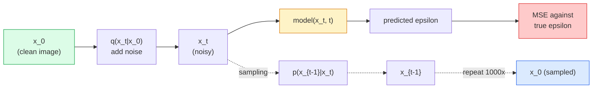

# 图像生成  Modèles de diffusion

> Le modèle de diffusion est d'apprendre à dénoncer. Il est entraîné à éliminer un petit morceau de bruit de l'image contenant du bruit.

**Type:** Build
**Languages:** Python
**Prerequisites:** Phase 4 Lesson 07 (U-Net), Phase 1 Lesson 06 (Probability), Phase 3 Lesson 06 (Optimizers)
**Time:** ~75 分钟

## Objectif de l'apprentissage

- 推导 processus de bruit à l' avance `x_0 -> x_1 -> ... -> x_T`, et expliquer pourquoi il est fermé .`q(x_t | x_0)`Pour tout ce qui est possible
- 实现 un objectif de formation de style DDPM, pour revenir à chaque étape du bruit ajouté, et réaliser un échantillon de bruit pur  étape par étape de retour image
- Construire un U-Net conditionné dans le temps(小到可以在CPU上训练), utilisé pour prévoir le bruit de chaque étape du temps
- Expliquer les différences entre le prélèvement DDPM et le prélèvement DDIM, ainsi que les scénarios de leur application (leçon 23)

##  problématique

Les GAN sont une génération unique: bruit, entrée, sortie, image, besoin d'une seule fois de passer en avant. Ils sont rapides, mais très difficiles à entraîner. Les Modèles de diffusion sont générationnelle: de pur bruit, démarrer, passer par un petit déni, l'image apparaît progressivement. Ils sont rapides, mais faciles à entraîner.

Outre la formation de la stabilité, la structure de la diffusion débloque également toutes les capacités de la génération d'images moderne: conditionnement de texte, peinture, édition d'image, super-résolution, style contrôlable. Chaque étape de la boucle d'échantillonnage est une entrée dans un nouveau groupe. C'est ce crochet qui rend la diffusion stable, l'image, le DALL-E 3 Midjourney, ainsi que tous les modèles d'images contrôlables que vous utiliserez, sont basés sur la diffusion.

Le cours de la formation de la formation de la formation de la formation de la formation de la formation de la formation de la formation de la formation de la formation de la formation de la formation de la formation de la formation de la formation de la formation de la formation de la formation de la formation de la formation de la formation de la formation de la formation de la formation de la formation de la formation de la formation de la formation de la formation de la formation de la formation de la formation de la formation de la formation de la formation de la formation de la formation de la formation de la formation de la formation de la formation de la formation de la formation de la formation de la formation de la formation de la formation de la formation de la formation de la formation de la formation de la formation de la formation de la formation de la formation de la formation de la formation de la formation de la formation de la formation de la formation de la formation de la formation de la formation de la formation de la formation de la formation de la formation de la formation de la formation de la formation de la formation de la formation de la formation de la formation de la formation de la formation de la formation de la formation de la formation de la formation de la formation de la formation de la formation de la formation de la formation de la formation de la formation de la formation de la formation de la formation de la formation de la formation de la formation de la formation de la formation de la formation de la formation de la formation de la formation de la formation de la formation de la formation de la formation de la formation de la formation de la formation de la formation de la formation de la formation de la formation de la formation de la formation de la formation de la formation de la formation de la formation de la formation de la formation de la formation de la formation de la formation de la formation de la formation de la formation de la formation de la formation de la formation de la formation de la formation de la formation de la formation de la formation de la formation de la formation de la formation de la formation de la formation de la formation de la formation de la formation de la formation de la formation de la formation de la formation de la formation de la formation de la formation.

## 核心概念

### processus à long terme

取一张图像  Je suis en train de faire une photo`x_0` Ajouter un peu de bruit gaussien  get `x_1`◊ Rejoindre moins de bruit  get `x_2` Continuer à faire des progrès jusqu'à`x_T`Il est presque impossible de comparer le bruit gaussien pur.

```
q(x_t | x_{t-1}) = N(x_t; sqrt(1 - beta_t) * x_{t-1},  beta_t * I)
```

`beta_t`C'est un programme de variance plus petit, généralement en T=1000 étapes, passant de 0,0001 à 0,02 ∞.

### 闭式跳转

Le bruit est une chaîne de Markov, mais on peut le plier mathématiquement.`x_0`échantillon `x_t`Il y a une autre.

```
Define alpha_t = 1 - beta_t
Define alpha_bar_t = prod_{s=1..t} alpha_s

Then:
  q(x_t | x_0) = N(x_t; sqrt(alpha_bar_t) * x_0,  (1 - alpha_bar_t) * I)

Equivalently:
  x_t = sqrt(alpha_bar_t) * x_0 + sqrt(1 - alpha_bar_t) * epsilon
  where epsilon ~ N(0, I)
```

Cette seule méthode est la diffusion, et c'est la raison pour laquelle elle peut être mise en pratique.`t`, directement de`x_0`échantillon `x_t`,并一步完成训练, pas besoin de simuler la chaîne Markov complète.

### processus inverse

Le processus à l'avant est fixe.`p(x_{t-1} | x_t)`Il est nécessaire d'apprendre le contenu du réseau neuronal.`x_{t-1}`Ils prédisent le bruit de l'entrée dans la phase suivante.`epsilon`, puis par des formules mathématiques`x_{t-1}`Il y a une autre.



### 訓練 Perte

Pour chaque étape de formation:

1. échantillon 一张真实图像 `x_0`Il y a une autre.
2. De [1, T] en moyenne échantillon un pas en temps `t`Il y a une autre.
3. le bruit de l'échantillon `epsilon ~ N(0, I)`Il y a une autre.
4. 计算 `x_t = sqrt(alpha_bar_t) * x_0 + sqrt(1 - alpha_bar_t) * epsilon`Il y a une autre.
5. Utilisez le réseau`epsilon_theta(x_t, t)`Il y a une autre.
6. La plus petite`|| epsilon - epsilon_theta(x_t, t) ||^2`Il y a une autre.

C'est ainsi. Le réseau neural apprend à chaque étape de la vie.

### échantillonneur (DDPM)

生成时: depuis `x_T ~ N(0, I)`- Je vais commencer.

```
for t = T, T-1, ..., 1:
    eps = model(x_t, t)
    x_{t-1} = (1 / sqrt(alpha_t)) * (x_t - (beta_t / sqrt(1 - alpha_bar_t)) * eps) + sqrt(beta_t) * z
    where z ~ N(0, I) if t > 1, else 0
return x_0
```

Le principal est que, bien que les conditions inverses généralement ne soient pas connues sous forme fermée, pour ce processus avancé gaussien spécifique, il est clos.

### Pourquoi 1000 pas ?

Le choix du programme de bruit à l'avant est de faire en sorte que chaque étape soit suffisamment bruyante, de sorte que l'étape inverse soit proche de Gaussia.

### DDIM: rapide 20 fois de l'échantillonnage

訓練相同,樣本化改變──DDIM(Song et al., 2020) définit un processus inverse déterminant, qui peut être sauté à travers les étapes dans le cas d'un non-reentraînement── utiliser le DDIM à 50 étapes, obtenir près de 1000 étapes de DDPM de la qualité── chaque système de production utilise le DDIM ou des variants plus rapides──DPM-Solver、Euler ancêtre)──

### Conditionnement du temps

réseau `epsilon_theta(x_t, t)`需要知道它正在指明 哪个时间步骤──现代 Diffusion Models 通过阴道时间嵌入 注入 `t`(c'est la même idée de codage positionnel dans les transformateurs), et à chaque niveau U-Net, il l'ajoute aux cartes fonctionnalités ci-dessus.

```
t_embedding = sinusoidal(t)
feature_map += MLP(t_embedding)
```

Il n'y a pas de conditionnement du temps, le réseau doit deviner le niveau de bruit de l'image elle-même, ça peut aussi fonctionner, mais l'efficacité de l'échantillon sera beaucoup plus faible.


```figure
cv-diffusion-image
```

## - Je le construis.

### 步骤 1: Calendrier du bruit

```python
import torch

def linear_beta_schedule(T=1000, beta_start=1e-4, beta_end=2e-2):
    return torch.linspace(beta_start, beta_end, T)


def precompute_schedule(betas):
    alphas = 1.0 - betas
    alphas_cumprod = torch.cumprod(alphas, dim=0)
    return {
        "betas": betas,
        "alphas": alphas,
        "alphas_cumprod": alphas_cumprod,
        "sqrt_alphas_cumprod": torch.sqrt(alphas_cumprod),
        "sqrt_one_minus_alphas_cumprod": torch.sqrt(1.0 - alphas_cumprod),
        "sqrt_recip_alphas": torch.sqrt(1.0 / alphas),
    }

schedule = precompute_schedule(linear_beta_schedule(T=1000))
```

预先计算一次, lors de l'entraînement et du prélèvement 时按指数收集──

### 步骤 2: Diffusion à l'avant (échantillon)

```python
def q_sample(x0, t, noise, schedule):
    sqrt_a = schedule["sqrt_alphas_cumprod"][t].view(-1, 1, 1, 1)
    sqrt_one_minus_a = schedule["sqrt_one_minus_alphas_cumprod"][t].view(-1, 1, 1, 1)
    return sqrt_a * x0 + sqrt_one_minus_a * noise
```

Une ligne fermée`t`C'est un groupe de temps, lots en lots.

### 步骤 3: Un petit réseau U-Net à temps conditionné

```python
import torch.nn as nn
import torch.nn.functional as F
import math

def timestep_embedding(t, dim=64):
    half = dim // 2
    freqs = torch.exp(-math.log(10000) * torch.arange(half, device=t.device) / half)
    args = t[:, None].float() * freqs[None]
    emb = torch.cat([args.sin(), args.cos()], dim=-1)
    return emb


class TinyUNet(nn.Module):
    def __init__(self, img_channels=3, base=32, t_dim=64):
        super().__init__()
        self.t_mlp = nn.Sequential(
            nn.Linear(t_dim, base * 4),
            nn.SiLU(),
            nn.Linear(base * 4, base * 4),
        )
        self.t_dim = t_dim
        self.enc1 = nn.Conv2d(img_channels, base, 3, padding=1)
        self.enc2 = nn.Conv2d(base, base * 2, 4, stride=2, padding=1)
        self.mid = nn.Conv2d(base * 2, base * 2, 3, padding=1)
        self.dec1 = nn.ConvTranspose2d(base * 2, base, 4, stride=2, padding=1)
        self.dec2 = nn.Conv2d(base * 2, img_channels, 3, padding=1)
        self.time_proj = nn.Linear(base * 4, base * 2)

    def forward(self, x, t):
        t_emb = timestep_embedding(t, self.t_dim)
        t_emb = self.t_mlp(t_emb)
        t_proj = self.time_proj(t_emb)[:, :, None, None]

        h1 = F.silu(self.enc1(x))
        h2 = F.silu(self.enc2(h1)) + t_proj
        h3 = F.silu(self.mid(h2))
        d1 = F.silu(self.dec1(h3))
        d2 = torch.cat([d1, h1], dim=1)
        return self.dec2(d2)
```

两层 U-Net, et dans le col de bouteille, insérer le conditionnement du temps. Pour être utilisé en images réelles, il faut élargir la profondeur et la largeur.

### 步骤 4: cycle de formation

```python
def train_step(model, x0, schedule, optimizer, device, T=1000):
    model.train()
    x0 = x0.to(device)
    bs = x0.size(0)
    t = torch.randint(0, T, (bs,), device=device)
    noise = torch.randn_like(x0)
    x_t = q_sample(x0, t, noise, schedule)
    pred = model(x_t, t)
    loss = F.mse_loss(pred, noise)
    optimizer.zero_grad()
    loss.backward()
    optimizer.step()
    return loss.item()
```

C'est un cycle d'entraînement complet. Pas de jeu GAN, pas de perte spéciale.

### 步骤 5: Prélèvement d'échantillons (DDPM)

```python
@torch.no_grad()
def sample(model, schedule, shape, T=1000, device="cpu"):
    model.eval()
    x = torch.randn(shape, device=device)
    betas = schedule["betas"].to(device)
    sqrt_one_minus_a = schedule["sqrt_one_minus_alphas_cumprod"].to(device)
    sqrt_recip_alphas = schedule["sqrt_recip_alphas"].to(device)

    for t in reversed(range(T)):
        t_batch = torch.full((shape[0],), t, dtype=torch.long, device=device)
        eps = model(x, t_batch)
        coef = betas[t] / sqrt_one_minus_a[t]
        mean = sqrt_recip_alphas[t] * (x - coef * eps)
        if t > 0:
            x = mean + torch.sqrt(betas[t]) * torch.randn_like(x)
        else:
            x = mean
    return x
```

Pour créer un échantillon, il faut passer 1000 fois en avant. Dans le code réel, vous le remplacerez par un échantillon DDIM à 50 étapes.

### 步骤 6: échantillonnage DDIM (definition, environ 20 fois)

```python
@torch.no_grad()
def sample_ddim(model, schedule, shape, steps=50, T=1000, device="cpu", eta=0.0):
    model.eval()
    x = torch.randn(shape, device=device)
    alphas_cumprod = schedule["alphas_cumprod"].to(device)

    ts = torch.linspace(T - 1, 0, steps + 1).long()
    for i in range(steps):
        t = ts[i]
        t_prev = ts[i + 1]
        t_batch = torch.full((shape[0],), t, dtype=torch.long, device=device)
        eps = model(x, t_batch)
        a_t = alphas_cumprod[t]
        a_prev = alphas_cumprod[t_prev] if t_prev >= 0 else torch.tensor(1.0, device=device)
        x0_pred = (x - torch.sqrt(1 - a_t) * eps) / torch.sqrt(a_t)
        sigma = eta * torch.sqrt((1 - a_prev) / (1 - a_t) * (1 - a_t / a_prev))
        dir_xt = torch.sqrt(1 - a_prev - sigma ** 2) * eps
        noise = sigma * torch.randn_like(x) if eta > 0 else 0
        x = torch.sqrt(a_prev) * x0_pred + dir_xt + noise
    return x
```

`eta=0`Il est parfaitement certain que le même bruit produit le même sortie.`eta=1`La DDPM sera rétablie.

## Utilisez-le

Produit et usage `diffusers`- Le numéro de la liste:

```python
from diffusers import DDPMScheduler, UNet2DModel

unet = UNet2DModel(sample_size=32, in_channels=3, out_channels=3, layers_per_block=2)
scheduler = DDPMScheduler(num_train_timesteps=1000)
```

Cette bibliothèque fournit des calendriers existants (DDPM、DDIM、DPM-Solver、Euler、Heun)、 U-Nets configurables、text-to-image 和 image-to-image pipelines, ainsi que des aides à l'ajustement de LoRA。

Dans le cadre de l'étude,`k-diffusion`(Katherine Crowson) Il y a les plus fidèles références et les meilleures variantes d'échantillonnage.

## Je le livre.

Le cours est ouvert à:

- `outputs/prompt-diffusion-sampler-picker.md` Un prompt, sera basé sur l'objectif de qualité 延迟预算和条件 类型选择 DDPM / DDIM / DPM-Solver / Euler。
- `outputs/skill-noise-schedule-designer.md` Une compétence, en fonction du niveau de corruption T 和 objectif 生成線性、cosine 或 sigmoid beta schedule,并附带信号-噪音比 随着时间变化的诊断图――

## 练习

1. **（简单）**可视化前进过程:取一张图像,并绘制 `t in [0, 100, 250, 500, 750, 1000]`时的 `x_t` vérification `x_1000`On dirait un bruit gaussien.
2. **（中等）**Dans le jeu de données de cercles synthétiques, TinyUNet a été utilisé pendant 20 périodes, et a testé 16 cercles.
3. **（困难）**实现 cosine noise schedule ((Nichol & Dhariwal, 2021):`alpha_bar_t = cos^2((t/T + s) / (1 + s) * pi / 2)` Utiliser des calendriers linéaires et cosines  entraîner le même modèle,并 montrer que le cosine dans un nombre de pas inférieur peut produire un meilleur échantillon 

## 关键术语

| Term | 人们通常怎么说 | 实际含义 |
|------|----------------|----------------------|
| Forward process | “随时间加入 noise” | 一个固定的 Markov chain，会在 T 步内把图像破坏成 Gaussian noise |
| Reverse process | “一步步 denoise” | 学到的分布，会从 noise 逐步走回图像 |
| Epsilon prediction | “预测 noise” | 训练目标：`epsilon_theta(x_t, t)` 预测在第 t 步加入的 noise |
| Beta schedule | “noise 大小” | T 个小 variance 组成的序列，定义每一步进入多少 noise |
| alpha_bar_t | “累计保留因子” | 到时间 t 为止的 (1 - beta_s) 乘积；t 越大，剩余信号越少 |
| DDPM sampler | “Ancestral，随机” | 从每个 x_{t-1} 的 conditional Gaussian 中 sample；1000 步 |
| DDIM sampler | “确定性，快速” | 将 sampling 重写为确定性 ODE；20-100 步即可得到相似质量 |
| Time conditioning | “告诉 model 当前是哪个 t” | 注入 U-Net 的 t 的 sinusoidal embedding，让它知道 noise level |

## 延伸阅读

- [Denoising Diffusion Probabilistic Models (Ho et al., 2020)](https://arxiv.org/abs/2006.11239) 让 Diffusion 变得实用和 FID 上击败GANs 论文
- [Improved DDPM (Nichol & Dhariwal, 2021)](https://arxiv.org/abs/2102.09672) schéma cosine et paramétrisation v
- [DDIM (Song, Meng, Ermon, 2020)](https://arxiv.org/abs/2010.02502) 让实时推论 成为可能的确定性样本
- [Elucidating the Design Space of Diffusion (Karras et al., 2022)](https://arxiv.org/abs/2206.00364) Pour chaque Diffusion  设计选择的统一视角;
