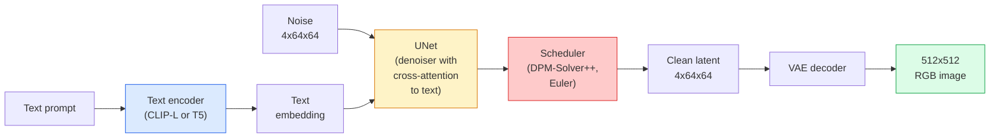

# Diffusion stable  架构与细调

> La diffusion stable est une sorte de DDPM, elle fonctionne dans l'espace latent de la VAE, en utilisant une attention croisée et une orientation sans classifiateur.

**Type:** Learn + Use
**Languages:** Python
**Prerequisites:** Phase 4 Lesson 10 (Diffusion), Phase 7 Lesson 02 (Self-Attention)
**Time:** ~75 分钟

## Objectif de l'apprentissage
-  suivre le pipeline de diffusion stable de cinq composantes: VAE, codeur de texte, U-Net, planificateur, vérificateur de sécurité, et comprendre ce qu'ils font réellement
- Expliquer la diffusion latente, ainsi que pourquoi entraîner dans l'espace latent 4x64x64 (au lieu de l'entraîner sur l'image 3x512x512) peut être réduit 48x en cas de perte de qualité
- Utilisation `diffusers`生成图像,运行image-to-image、inpainting 和 ControlNet 引导的生成
- Dans un petit ensemble de données à définition personnelle, ajustez la diffusion stable de l'adaptateur LoRA en utilisant l'adaptateur LoRA

##  problématique
直接在 512x512 RGB 图像上训练 DDPM 成本很高. 每个训练步骤都需要通过一个U-Net做 Backpropagation,而这个U-Net 看到的是3x512x512 = 786,432 个输入值;采样还需要通过同一个U-Net 进行50+次前进通过. 通过一个U-Net 进行50+次前进通过. 通过一个U-Net 通过一个U-Net 通过一个U-Net 通过一个U-Net 通过一个U-Net 通过一个U-Net 通过一个U-Net 通过一个U-Net 通过一个U-Net 通过一个U-Net 通过一个U-Net 通过一个U-Net 通过一个U-Net 通过一个U-Net 通过一个U-Net 通过一个U-Net 通过一个U-Net 通过一个U-Net 通过一个U-Net 通过一个U-Net 通过一个U-Net 通过一个U-Net 通过一个U-Net 通过一个U-Net 通过一个U-Net 通过一个U-Net 通过一个U-Net 通过一个U-Net 通过一个U-Net 通过一个U-Net 通过一个U-Net 通过一个U-Net 通过一个U-Net 通过一个U-Net 通过一个U-U-Net 通过一个-U-Net 通过一个-U-Net 通过一个-U-Net 通过一个-U-Net 通过一个-U-U-Net 通过一个-U-U-Net 通过-的-的-U-U-Net 通过-的-的-的-U-U-U-Net 通过-的-的-的-U-的-U-U-Net 通过-的-的-的-U-U-的-U-U-的-U-U-Net 通过-的-的-U的-U的-U的-U的-U的-U的-U的-U的-U的-U的-U的-U的-U的-U的-U的-U的-U的-U的-U的-U的-U的-U的-U的-U

让开放权重文字图像 变得实用技巧是 **latent diffusion**(Rombach et coll., CVPR 2022)  entraîner une VAE, va 3x512x512 image cartographiée à 4x64x64 tensor latent Re cartographiée à nouveau, puis dans cet espace latent faire Diffusion  calculer la quantité de descente `(3*512*512)/(4*64*64) = 48x`Sur le même bloc de GPU, le temps de prise de données est passé de quelques secondes à deux secondes.

La diffusion stable, vous avez déjà appris ce modèle.

## 概念
### Le pipeline



- **VAE** 结的自动编码器──Encoder va convertir l'image en latences(pour être utilisé dans l'img2img 和训练)──Decoder va convertir les latences 转回图像──
- **Text encoder** Codificateur de texte CLIP(SD 1.x/2.x)、CLIP-L + CLIP-G(SDXL) ou T5-XXL(SD3/FLUX)。
- **U-Net** dénoiser── contenant des niveaux d'attention croisée, à chaque niveau de résolution, des attentes latences à l'intégration de texte──
- **Scheduler** 采样算法(DDIM、Euler、DPM-Solver++)。
- **Safety checker**                                                                                                                                                                                                                                                              

### Les orientations sans classifiant (CFG)

Les conditions de texte ordinaires seront pour chaque demande.`c`Apprendre à apprendre`epsilon_theta(x_t, t, c)` CFG  entraînement du même réseau, mais 10% du temps sera perdu `c`(en remplacement pour l'embedding vide), afin d'obtenir un modèle unique de sonorités conditionnelles et inconditionnelles en même temps:

```
eps = eps_uncond + w * (eps_cond - eps_uncond)
```

`w`C'est une échelle de référence.`w=0`C'est inconditionnel.`w=1`C'est une condition normale,`w>1`La production est en baisse, le prix est en baisse.`w=7.5`Il y a une autre.

Le CFG est un système de texte à image qui peut atteindre la qualité de production.

### Géométrie de l'espace latent

Le latent à 4 canaux de VAE n'est pas seulement une image compressée. Il s'agit d'un manifold, dont l'algorithme fonctionne à la manière suivante.

两个结果:

1. **Img2img**= Pour encoder l'image comme latente, ajouter une partie de bruit, utiliser un dénonciateur, décoder à nouveau.
2. **Inpainting**= Comparable à img2img, mais dénonciateur ne fait que mettre à jour le masque 区域; non masque 区域 retenue pour le latence codée。

### L'architecture U-Net

SD U-Net est une version de TinyUNet de grande envergure dans le cours 10, et a augmenté trois points:

- À chaque résolution spatiale.**Transformer blocks**, contient une attention personnelle + une attention croisée à l'intégration du texte.
-                                                                                                                                                                                                                                                                                                                                                                                                                                                                                                                              **Time embedding**Il y a une autre.
- encodeur et décodeur dans la correspondance entre résolution **Skip connections**Il y a une autre.

Le nombre total de paramètres SD 1.5 est d'environ 860M. SDXL: environ 2.6B. FLUX: environ 12B.

### L'ajustement fin de la LORA

Pour une diffusion stable faire un réglage complet  nécessite 20+ GB de VRAM,并更新 860M 个参数。LoRA(Low-Rank Adaptation) maintenir le modèle de base 结,并向 Attention 层注入小型级分解矩阵。 utilisé pour l'adaptateur LoRA SD est généralement de 10-50 MB, entraîne 10-60 minutes en GPU de consommation en bloc, et en inférence 时作为降入修改 加载。

```
Original: W_q : (d_in, d_out)   frozen
LoRA:     W_q + alpha * (A @ B)   where A : (d_in, r), B : (r, d_out)

r is typically 4-32.
```

La LoRA est la méthode de mise en forme de la musique de presque tous les quartiers.

### Les horaires que vous verrez

- **DDIM** 确定性, environ 50 étapes, simple
- **Euler ancestral** 随机性,30-50 étapes, modèle un peu plus créatif.
- **DPM-Solver++ 2M Karras** 确定性, 20 à 30 étapes, production默认选择──
- **LCM / TCD / Turbo** modèles de consistance et variantes distillées; 1 à 4 étapes, mais en sacrifiant une partie de la qualité:

Dans le`diffusers`Le changement de calendrier ne nécessite qu'un changement, parfois sans aucune reformation.


```figure
cv3-latent-compression
```

## - Je le construis.
本课端到端使用 `diffusers`, au lieu de reconstruire à partir de zéro, la diffusion stable, vous avez besoin de reconstruire la partie de la formation (VAE, codeur de texte, U-Net, planificateur) sont eux-mêmes des sujets de cours respectifs; l'objectif est de connaître l'API de production.

### 步骤 1: texte à image

```python
import torch
from diffusers import StableDiffusionPipeline

pipe = StableDiffusionPipeline.from_pretrained(
    "runwayml/stable-diffusion-v1-5",
    torch_dtype=torch.float16,
).to("cuda")

image = pipe(
    prompt="a dog riding a skateboard in tokyo, studio ghibli style",
    guidance_scale=7.5,
    num_inference_steps=25,
    generator=torch.Generator("cuda").manual_seed(42),
).images[0]
image.save("dog.png")
```

`float16`Dans le cas d'une perte de qualité visible, le VRAM sera réduit de moitié.`num_inference_steps=25`Les effets sont équivalents à ceux de l'utilisation du DDIM.`num_inference_steps=50`Il y a une autre.

### 步骤 2: Changer le planificateur

```python
from diffusers import DPMSolverMultistepScheduler, EulerAncestralDiscreteScheduler

pipe.scheduler = DPMSolverMultistepScheduler.from_config(pipe.scheduler.config)
pipe.scheduler = EulerAncestralDiscreteScheduler.from_config(pipe.scheduler.config)
```

Vous pouvez vous entraîner à la DDPM, puis utiliser un planificateur.

### 步骤 3: Image à image

```python
from diffusers import StableDiffusionImg2ImgPipeline
from PIL import Image

img2img = StableDiffusionImg2ImgPipeline.from_pretrained(
    "runwayml/stable-diffusion-v1-5",
    torch_dtype=torch.float16,
).to("cuda")

init_image = Image.open("dog.png").convert("RGB").resize((512, 512))
out = img2img(
    prompt="a dog riding a skateboard, oil painting",
    image=init_image,
    strength=0.6,
    guidance_scale=7.5,
).images[0]
```

`strength`Indiquer le nombre de bruits à ajouter avant de dénoncer: 0,0 = 不变, 1.0 = 完全重新生成) ・0,5-0,7 est la portée standard du transfert de style.

### 步骤 4: Peinture

```python
from diffusers import StableDiffusionInpaintPipeline

inpaint = StableDiffusionInpaintPipeline.from_pretrained(
    "runwayml/stable-diffusion-inpainting",
    torch_dtype=torch.float16,
).to("cuda")

image = Image.open("dog.png").convert("RGB").resize((512, 512))
mask = Image.open("dog_mask.png").convert("L").resize((512, 512))

out = inpaint(
    prompt="a cat",
    image=image,
    mask_image=mask,
    guidance_scale=7.5,
).images[0]
```

Les images blanches du masque sont à reproduire dans la région.

### 步骤 5: Chargement de la charge de charge

```python
pipe.load_lora_weights("sayakpaul/sd-lora-ghibli")
pipe.fuse_lora(lora_scale=0.8)

image = pipe(prompt="a village square in ghibli style").images[0]
```

`lora_scale`控制强度;0.0 = 无效,1.0 = 完整效果──`fuse_lora`L'adaptateur sera chargé avec des charges de poids, mais il ne sera pas chargé.`pipe.unfuse_lora()`Il y a une autre.

### 步骤 6: Formation du LRA (boîtier)

Une véritable formation en LRA`peft`Ou `diffusers.training`Le tableau suivant est le suivant:

```python
# Pseudocode
for step, batch in enumerate(dataloader):
    images, prompts = batch
    latents = vae.encode(images).latent_dist.sample() * 0.18215

    t = torch.randint(0, num_train_timesteps, (batch_size,))
    noise = torch.randn_like(latents)
    noisy_latents = scheduler.add_noise(latents, noise, t)

    text_emb = text_encoder(tokenizer(prompts))

    pred_noise = unet(noisy_latents, t, text_emb)  # LoRA weights injected here

    loss = F.mse_loss(pred_noise, noise)
    loss.backward()
    optimizer.step()
```

只有LoRA matrices 会接收 Gradient;base U-Net、VAE 和 text encoder都被结──使用批量为 1 和梯度检查点时,这可以适应8GBVRAM──

## Utilisez-le
En production, vous devez prendre des décisions:

- **Model family**SD 1.5 utilise des techniques de pointe et des exigences strictes de licence.
- **Scheduler**:20-30 étapes Utilisation de DPM-Solver++ 2M Karras; lorsque la latence est inférieure à 1s 时使用 LCM-LoRA。
- **Precision**Réponse:`float16`,A100 及 mettre à jour les appareils`bfloat16`,VRAM 紧张时使用 `int8`(par le biais de `bitsandbytes`Ou `compel`)。
- **Conditioning**: ordinar文本可用; si vous avez besoin de plus de contrôle, rejoignez le ControlNet dans le pipeline de base.

pour la production en série,`AUTO1111`- Je suis là .`ComfyUI`                                                                                                                                                                                                                                                                                                                                                                                                                                                                                                                             `diffusers`+ `accelerate`, ou utiliser avec la compilation TensorRT `optimum-nvidia`Il y a une autre.

## Je le livre.
Le programme de formation

- `outputs/prompt-sd-pipeline-planner.md` Un prompt, en fonction du budget de latence, du but de fidélité et des contraintes de licence, choisissez SD 1.5 / SDXL / SD3 / FLUX, ainsi que le planificateur et la précision.
- `outputs/skill-lora-training-setup.md` Une compétence, utilisée pour la définition de données complète de la configuration de formation LoRA, y compris les sous-titres, le classement, la taille du lot et le taux d'apprentissage.

## 练习
1. **(Easy)**Utilisation `[1, 3, 5, 7.5, 10, 15]`Le centre`guidance_scale`生成同一个提示──description de la façon dont l'image change── Où les objets commencent-ils à apparaître ?
2. **(Medium)**選取任意真实照片, dans `[0.2, 0.4, 0.6, 0.8, 1.0]``strength`Je suis là.`StableDiffusionImg2ImgPipeline`Quelles forces peuvent conserver la structure tout en modifiant le style ? Pourquoi 1.0 va-t-il complètement ignorer l'entrée ?
3. **(Hard)**Utiliser un seul sujet (物、logo、角色) de 10-20 张 image entraîner un LoRA, et générer contenant le nouveau scénario du sujet.

## 关键术语
| Term | What people say | What it actually means |
|------|----------------|----------------------|
| Latent diffusion | “在 latents 中 diffuse” | 在 VAE latent space（4x64x64）而不是 pixel space（3x512x512）中运行整个 DDPM；节省 48x 计算量 |
| VAE scale factor | “0.18215” | 将 VAE 的原始 latent 重新缩放到大致 unit variance 的常数；硬编码在每个 SD pipeline 中 |
| Classifier-free guidance | “CFG” | 混合 conditional 和 unconditional noise predictions；影响最大的 inference knob |
| Scheduler | “Sampler” | 将 noise + model predictions 转换为 denoised latent trajectory 的算法 |
| LoRA | “Low-rank adapter” | 小型 rank-decomposition matrices，可在不触碰 base weights 的情况下 fine-tune Attention 层 |
| Cross-attention | “Text-image attention” | 从 latent tokens 到 text tokens 的 Attention；在每个 U-Net 层级注入 prompt 信息 |
| ControlNet | “Structure conditioning” | 一个单独训练的 adapter，用额外输入（canny、depth、pose、segmentation）引导 SD |
| DPM-Solver++ | “默认 scheduler” | 二阶确定性 ODE solver；在低 step counts（20-30）下拥有最佳质量（2026 年） |

## 延伸阅读
- [High-Resolution Image Synthesis with Latent Diffusion (Rombach et al., 2022)](https://arxiv.org/abs/2112.10752) Dissolution stable 论文; contenant la preuve de la rationalité de chaque ablation
- [Classifier-Free Diffusion Guidance (Ho & Salimans, 2022)](https://arxiv.org/abs/2207.12598) CFG 论文
- [LoRA: Low-Rank Adaptation of Large Language Models (Hu et al., 2021)](https://arxiv.org/abs/2106.09685) LoRA a été utilisé à l'origine en PNL; il a presque pas besoin de modification pour se déplacer vers SD
- [diffusers documentation](https://huggingface.co/docs/diffusers) Reference de chaque pipeline SD / SDXL / SD3 / FLUX
