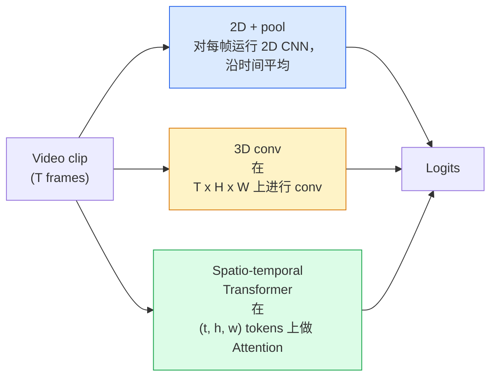

# Vidéo Compréhension  时间建模

> 视频 est une série d'images, en plus de les connecter à la loi physique. Chaque modèle vidéo doit soit considérer le temps comme un axe supplémentaire, soit considérer le temps comme un ensemble de processus de transformation, soit considérer le temps comme un ensemble de processus de collecte et de collecte.

**类型：**apprendre + construire
**语言：**Python
**先修要求：**La phase 4 Leçon 03(CNN),La phase 4 Leçon 04(Classification des images)
**时间：**- 45 minutes

## Objectif de l'apprentissage

- 区分三种主要视频建模方法(2D+pool、3D conv、spatio-temporal Transformer), et prévoir leur prise sur le coût et le taux de précision
- Dans PyTorch, il est possible de réaliser un échantillonnage de cadres, un regroupement temporel, ainsi qu'un classifiateur de base 2D+pool
- 解释为什么I3D的膨胀3D内核 能很好从 ImageNet weights 迁移, ainsi que les différences entre les convex facteurisés (2+1)D
- Comprendre les ensembles de données standard d'action-récognition avec les mesures:Kinetics-400/600、UCF101、Something-Something V2; niveau de clips et niveau vidéo de précision top-1

##  problématique

Une vidéo de 30 secondes 、30 fps contient 900 张图像── simple vue, classification vidéo consiste à effectuer 900 fois la classification d'images, puis faire une sorte de regroupement── lorsque l'action est pratiquement visible dans chaque vidéo, cette méthode est efficace 🏻🏻🏻🏻🏻🏻🏻🏻🏻🏻🏻🏻🏻🏻🏻🏻🏻🏻🏻🏻🏻🏻🏻🏻🏻🏻🏻🏻🏻🏻🏻🏻🏻🏻🏻🏻🏻🏻🏻🏻🏻🏻🏻🏻🏻🏻🏻🏻🏻🏻🏻🏻🏻🏻🏻🏻🏻🏻🏻🏻🏻🏻🏻🏻🏻🏻🏻🏻🏻🏻🏻🏻🏻🏻🏻🏻🏻🏻🏻🏻🏻🏻🏻🏻🏻🏻🏻🏻🏻🏻🏻🏻🏻🏻🏻🏻🏻🏻🏻🏻🏻🏻🏻🏻🏻🏻🏻🏻🏻🏻🏻🏻🏻🏻🏻🏻🏻🏻🏻🏻🏻🏻🏻🏻🏻🏻🏻🏻🏻🏻🏻🏻🏻🏻🏻🏻🏻🏻🏻🏻🏻🏻🏻🏻🏻🏻🏻🏻🏻🏻🏻🏻🏻🏻🏻🏻🏻🏻🏻🏻🏻🏻🏻🏻🏻🏻🏻🏻🏻🏻🏻🏻🏻🏻🏻🏻🏻🏻🏻🏻🏻🏻🏻🏻🏻🏻🏻🏻🏻🏻🏻🏻🏻🏻🏻🏻🏻🏻🏻🏻🏻🏻🏻🏻🏻🏻🏻🏻🏻🏻🏻🏻🏻🏻🏻🏻🏻🏻🏻🏻🏻🏻🏻🏻🏻🏻🏻🏻🏻🏻🏻🏻🏻🏻🏻🏻🏻🏻🏻🏻🏻🏻🏻🏻🏻🏻🏻🏻🏻🏻🏻🏻🏻🏻🏻🏻🏻🏻🏻🏻🏻🏻🏻🏻🏻🏻🏻🏻🏻🏻🏻🏻🏻🏻🏻🏻🏻🏻🏻🏻🏻🏻🏻🏻🏻🏻🏻🏻🏻🏻🏻🏻🏻🏻🏻🏻🏻🏻🏻🏻🏻🏻🏻🏻🏻🏻🏻🏻🏻🏻🏻🏻🏻🏻🏻🏻🏻🏻🏻🏻🏻🏻🏻🏻🏻🏻🏻🏻🏻🏻🏻🏻🏻🏻🏻🏻🏻🏻🏻🏻🏻🏻🏻🏻🏻🏻🏻🏻🏻🏻🏻🏻🏻🏻🏻🏻🏻🏻🏻🏻🏻🏻🏻🏻🏻🏻🏻🏻🏻🏻🏻🏻🏻🏻🏻🏻🏻🏻🏻🏻🏻🏻🏻🏻🏻🏻🏻🏻🏻🏻🏻🏻🏻🏻🏻🏻🏻🏻🏻🏻🏻🏻🏻🏻🏻🏻🏻🏻🏻🏻🏻🏻🏻🏻🏻🏻🏻🏻🏻🏻🏻🏻🏻🏻🏻🏻🏻🏻🏻🏻🏻🏻🏻🏻🏻🏻🏻🏻🏻🏻🏻🏻

La structure temporelle, à quel moment et de quelle manière est-elle construite ? La réponse décide de tout le reste, y compris le coût de calcul, la stratégie de prétrainage, si les poids d'ImageNet peuvent être utilisés à nouveau, ainsi que les données sur lesquelles le modèle s'entraîne.

Le mécanisme de base de l'image est déjà en place, tandis que la compréhension vidéo est principalement axée sur le temps dimension de l'histoire: échantillonnage, modélisation et agrégation.

## 核心概念

### 3 catégories de familles



### 2D + piscine

取一个2D CNN(ResNet、EfficientNet、ViT) ⋅在每个采样上独立运行它──对每的嵌入做平均(或最大池,或注意池)──将聚向量输入分类器──

优点:
- La pré-entraînement de l'imageNet peut être directement déplacé.
- 实现最简单──
- 便宜:T  * 单张图像推理成本──

缺点:
- 无法建模运动──action = accumulation des apparences──
- Le regroupement temporel est insensé au ordre; la porte ouverte et la porte fermée semblent identiques.

适用场景: à l'apparence comme tâche principale 小视频数据集上的转移学习 初始基线――

### Les convolutions 3D

Pour les noyaux 2D (H, W)  pour les noyaux 3D (T, H, W) ⋅ en même temps dans l'espace et le temps ⋅ en convection ⋅ en début de génération ⋅ en début de génération ⋅ en début de génération ⋅ en début de génération ⋅ en début de génération ⋅ en fin de génération ⋅ en fin de génération ⋅ en fin de génération ⋅ en fin de génération ⋅ en fin de génération ⋅ en fin de génération ⋅ en fin de génération ⋅ en fin de génération ⋅ en fin de génération ⋅ en fin de génération ⋅ en fin de génération ⋅ en fin de génération ⋅ en fin de génération ⋅ en fin de génération ⋅ en fin de génération ⋅ en fin de génération ⋅ en fin de génération ⋅ en fin de génération ⋅ en fin de génération ⋅ en fin de génération ⋅ en fin de génération ⋅ en fin de génération ⋅ en fin de génération ⋅ en fin de génération ⋅ en fin de génération ⋅ en

I3D 技巧: Prenez un modèle 2D ImageNet prétrainé, allez chaque noyau 2D 沿新时间轴复制, afin de 膨胀──a un 3x3 2D conv 变成 un 3x3x3 3D conv── ceci permet au modèle 3D 拥有强大的预训练重量,而不是从零开始训练──

优点:
- 直接建模 motion:
- L'inflation I3D  offre un apprentissage de transfert gratuit.

缺点:
- Les FLOP de plusieurs modèles T/8 à l'égard du noyau temporel sont 3 fois complétées.
- Les noyaux temporels 很小;长程 motion 需要 pyramide ou double flux 方法。

适用场景:motion est la reconnaissance de l'action du signal (Quelque chose-Quelque chose V2 、 contient une grande quantité de classes de kinétique lourdes en mouvement) 

### 时空 Transformateurs

Pour les autres, il faut utiliser les images de la vidéo.

importants Modèles d'attention:
- **Joint** 在 (t, h, w) 上做一次大注意──对 `T*H*W`La complexité est très importante.
- **Divided** Chaque bloc faire deux fois Attention: une fois au long du temps, une fois au long de l'espace―
- **Factorised** attention dans le temps et l'espace  attention dans les blocs 交换──

优点:
- Dans tous les principaux critères de référence, la précision du SOTA est atteinte.
-                                                                                                                                                                                                                                                               
- 通过稀疏关注 支持长文段视频──

缺点:
- 計算需求高──
- Il faut choisir avec prudence le modèle d'attention, sinon le temps de course va s'élargir.

适用场景:大数据集、高保真 vidéo compréhension、vidéo+texte multi-modaux tas­ques。

### Prise d'échantillons de cadres

Un clip de 10 secondes 、30 fps a 300 ; mettre toutes les 300  dans n'importe quel modèle est très gaspillé.

- **Uniform sampling** Dans le clip, le choix est fait par T ──2D+pool
- **Dense sampling** 随机连续 T-frame window──3D convs 中常见,因为 motion 需要相邻──
- **Multi-clip** De la même vidéo, plusieurs fenêtres de T-frame,分别分类, et des prédictions moyennes lors de la mise à l'essai.

T est généralement 8、16、32 ou 64。 T supérieur = plus de signal temporel, signifie également plus de calcul。

### Évaluation

Deux niveaux:
- **Clip-level accuracy** 模型 voir un clip T-frame, rapport top-k。
- **Video-level accuracy** Les prévisions de niveau de clips pour chaque vidéo sont plus élevées et plus stables.

始终报告两者──一个分为78% clip / 82% video的模型高度依赖测试时间平均;一个分为80% / 81%的模型在每片上更强──

### Les données que vous rencontrerez

- **Kinetics-400 / 600 / 700** Général de données d'action ⋅ 400 000 clips; URL YouTube ⋅ ⋅ ⋅ ⋅ ⋅ ⋅ ⋅ ⋅ ⋅ ⋅ ⋅ ⋅ ⋅ ⋅ ⋅ ⋅ ⋅ ⋅ ⋅ ⋅ ⋅ ⋅ ⋅ ⋅ ⋅ ⋅ ⋅ ⋅ ⋅ ⋅ ⋅ ⋅ ⋅ ⋅ ⋅ ⋅ ⋅ ⋅ ⋅ ⋅ ⋅ ⋅ ⋅ ⋅ ⋅ ⋅ ⋅ ⋅ ⋅ ⋅ ⋅ ⋅ ⋅ ⋅ ⋅ ⋅ ⋅ ⋅ ⋅ ⋅ ⋅ ⋅ ⋅ ⋅ ⋅ ⋅ ⋅ ⋅ ⋅ ⋅ ⋅ ⋅ ⋅ ⋅ ⋅ ⋅ ⋅ ⋅ ⋅ ⋅ ⋅ ⋅ ⋅ ⋅ ⋅ ⋅ ⋅ ⋅ ⋅ ⋅ ⋅ ⋅ ⋅ ⋅ ⋅ ⋅ ⋅ ⋅ ⋅ ⋅ ⋅ ⋅ ⋅ ⋅ ⋅ ⋅ ⋅ ⋅ ⋅ ⋅ ⋅ ⋅ ⋅ ⋅ ⋅ ⋅ ⋅ ⋅ ⋅ ⋅ ⋅ ⋅ ⋅ ⋅ ⋅ ⋅    ⋅ ⋅                                                                                                                                                                                                                                         
- **Something-Something V2**                                                                                                                                                                                                                                                              
- **UCF-101**- Je suis là.**HMDB-51** 更老、更小, mais encore rapporté
- **AVA** Dans l'espace et dans le temps, l'action *localisation*;


```figure
v4-video-temporal
```

## - Je le construis.

### 步骤 1: échantillonneur de cadre

适用于列表或视频 Tensor) 和 denses échantillonnageurs uniques

```python
import numpy as np

def sample_uniform(num_frames_total, T):
    if num_frames_total <= T:
        return list(range(num_frames_total)) + [num_frames_total - 1] * (T - num_frames_total)
    step = num_frames_total / T
    return [int(i * step) for i in range(T)]


def sample_dense(num_frames_total, T, rng=None):
    rng = rng or np.random.default_rng()
    if num_frames_total <= T:
        return list(range(num_frames_total)) + [num_frames_total - 1] * (T - num_frames_total)
    start = int(rng.integers(0, num_frames_total - T + 1))
    return list(range(start, start + T))
```

Ils sont de retour.`T`个 indices, pour le tenseur vidéo de coupes

### 步骤 2: une base de base 2D + pool

Dans chaque fonctionnement 2D ResNet-18, les fonctionnalités de pool moyen, puis la classe.

```python
import torch
import torch.nn as nn
from torchvision.models import resnet18, ResNet18_Weights

class FramePool(nn.Module):
    def __init__(self, num_classes=400, pretrained=True):
        super().__init__()
        weights = ResNet18_Weights.IMAGENET1K_V1 if pretrained else None
        backbone = resnet18(weights=weights)
        self.features = nn.Sequential(*(list(backbone.children())[:-1]))  # global avg pool kept
        self.head = nn.Linear(512, num_classes)

    def forward(self, x):
        # x: (N, T, 3, H, W)
        N, T = x.shape[:2]
        x = x.view(N * T, *x.shape[2:])
        feats = self.features(x).view(N, T, -1)
        pooled = feats.mean(dim=1)
        return self.head(pooled)

model = FramePool(num_classes=10)
x = torch.randn(2, 8, 3, 224, 224)
print(f"output: {model(x).shape}")
print(f"params: {sum(p.numel() for p in model.parameters()):,}")
```

Une base de données est généralement inférieure à 5 à 10 points par rapport aux modèles 3D réels, parfois même mieux, car elle utilise une colonne vertébrale d'ImageNet plus forte.

### 步骤 3: Converse 3D gonflé à l'aide de l'I3D

通過新時間軸重复重重重重重重重重重重重重重重重重重重重重重重重重重重重重重重重重重重重重重重重重重重重重重重重重重重重重重重重重重重重重重重重重重重重重重重重重重重重重重重重重重重重重重重重重重重重重重重重重重重重重重重重重重重重重重重重重重重重重重重重重重重重重重重重重重重重重重重重重重重重重重重重重重重重重重重重重重重重重重重重重重重重重重重重重重重重重重重重重重重重重重重重重重重重重重重重重重重重重重重重重重重重重重重重重重重重重重重重重重重重重重重重重重重重重重重重重重重重重重重重重重重重重重重重重重重重重重重重重重重重重重重重重重重重重重重重重重重重重重重重重重重重重重重重重重重重重重重重重重重重重重重重重重重重重重重重重重重重重重重重重重重重重重重重重重重重重重重重重重重重重重重重重重重重重重重重重重重重重重重重重重重重重重重重重重重重重重重重重重重重重重重重重重重重重重重重重重重重重重重重重重重重重重重重重重重重重重重重重重重重重重重重重重重重重重重重重重重重重重重重重重重重重重重重重重重重重重重重重重重重重重重重重重重重重重重重重重重重重重重重重重重重重重重重重重重重重重重重重重重重重重重重

```python
def inflate_2d_to_3d(conv2d, time_kernel=3):
    out_c, in_c, kh, kw = conv2d.weight.shape
    weight_3d = conv2d.weight.data.unsqueeze(2)  # (out, in, 1, kh, kw)
    weight_3d = weight_3d.repeat(1, 1, time_kernel, 1, 1) / time_kernel
    conv3d = nn.Conv3d(in_c, out_c, kernel_size=(time_kernel, kh, kw),
                        padding=(time_kernel // 2, conv2d.padding[0], conv2d.padding[1]),
                        stride=(1, conv2d.stride[0], conv2d.stride[1]),
                        bias=False)
    conv3d.weight.data = weight_3d
    return conv3d

conv2d = nn.Conv2d(3, 64, kernel_size=3, padding=1, bias=False)
conv3d = inflate_2d_to_3d(conv2d, time_kernel=3)
print(f"2D weight shape:  {tuple(conv2d.weight.shape)}")
print(f"3D weight shape:  {tuple(conv3d.weight.shape)}")
x = torch.randn(1, 3, 8, 56, 56)
print(f"3D output shape:  {tuple(conv3d(x).shape)}")
```

À l' exception de`time_kernel`L'activité de la grandeur de la grandeur de la grandeur de la grandeur de la grandeur de la grandeur de la grandeur de la grandeur de la grandeur de la grandeur de la grandeur de la grandeur de la grandeur de la grandeur de la grandeur de la grandeur de la grandeur de la grandeur de la grandeur de la grandeur de la grandeur de la grandeur de la grandeur de la grandeur de la grandeur de la grandeur de la grandeur de la grandeur de la grandeur de la grandeur de la grandeur de la grandeur de la grandeur de la grandeur de la grandeur de la grandeur de la grandeur de la grandeur de la grandeur de la grandeur de la grandeur de la grandeur de la grandeur de la grandeur de la grandeur de la grandeur de la grandeur de la grandeur de la grandeur de la grandeur de la grandeur de la grandeur de la grandeur de la grandeur de la grandeur de la grandeur de la grandeur de la grandeur de la grandeur de la grandeur de la grandeur de la grandeur de la grandeur de la grandeur de la grandeur de la grandeur de la grandeur de la grandeur de la grandeur de la grandeur de la grandeur de la grandeur de la grandeur de la grandeur de la grandeur de la grandeur de la grandeur de la grandeur de la grandeur de la grandeur de la grandeur de la grandeur de la grandeur de la grandeur de la grandeur de la grandeur de la grandeur de la grandeur de la grandeur de la grandeur de la grandeur de la grandeur de la grandeur de la grandeur de la grandeur de la grandeur de la grandeur de la grandeur de la grandeur de la grandeur de la grandeur de la grandeur de la grandeur de la grandeur de la grandeur de la grandeur de la grandeur de la grandeur de la grandeur de la grandeur de la grandeur de la grandeur de la grandeur de la grandeur de laur de la grandeur de laur de la grandeur de la grandeur de la grandeur de la grandeur de la grandeur de laur de la grandeur de laur de laur de la grandeur de la grandeur

### 步骤 4: Factorisé (2+1) D con

Pour les récepteurs, les taux de précision sont supérieurs à ceux de la même valeur.

```python
class Conv2Plus1D(nn.Module):
    def __init__(self, in_c, out_c, kernel_size=3):
        super().__init__()
        mid_c = (in_c * out_c * kernel_size * kernel_size * kernel_size) \
                // (in_c * kernel_size * kernel_size + out_c * kernel_size)
        self.spatial = nn.Conv3d(in_c, mid_c, kernel_size=(1, kernel_size, kernel_size),
                                 padding=(0, kernel_size // 2, kernel_size // 2), bias=False)
        self.bn = nn.BatchNorm3d(mid_c)
        self.act = nn.ReLU(inplace=True)
        self.temporal = nn.Conv3d(mid_c, out_c, kernel_size=(kernel_size, 1, 1),
                                  padding=(kernel_size // 2, 0, 0), bias=False)

    def forward(self, x):
        return self.temporal(self.act(self.bn(self.spatial(x))))

c = Conv2Plus1D(3, 64)
x = torch.randn(1, 3, 8, 56, 56)
print(f"(2+1)D output: {tuple(c(x).shape)}")
```

Un réseau R2+1D complet est comme un réseau ResNet-18, il suffit de remplacer chaque 3x3 en`Conv2Plus1D`Il y a une autre.

## Utilisez-le

Deux bibliothèques couvrent les activités de production vidéo:

- `torchvision.models.video` R(2+1) D、MViT、Swin3D, avec des poids de kinétique prétrainés──API et modèles d'image 相同──
- `pytorchvideo`(Meta)  modèle zoo 、 utilisé pour les chargeurs de données Kinétique / SSv2 / AVA 、 transformations standards ⋅

对于视频模型视频类型视频类型视频类型视频类型视频类型视频类型视频类型视频类型视频类型视频类型视频类型视频类型视频类型视频类型视频类型视频类型视频类型视频类型视频类型视频类型视频类型视频类型视频类型视频类型视频类型视频类型视频类型视频类型视频类型视频类型视频类型视频类型视频类型视频类型视频类型视频类型视频类型视频类型视频类型视频类型`transformers`(le secteur de l'énergie)`VideoMAE`- Je suis là.`VideoLLaMA`- Je suis là.`InternVideo`)。

## Je le livre.

Le cours est ouvert à:

- `outputs/prompt-video-architecture-picker.md` Un prompt, selon l'apparence-contre-mouvement, la taille du jeu de données et le budget de calcul selectionner 2D+pool / I3D / (2+1)D / Transformer。
- `outputs/skill-frame-sampler-auditor.md` Une compétence, utilisée pour vérifier l'échantillonnage du pipeline vidéo,并标记常见错误:off-by-one index,`num_frames < T`时采样 不均、缺少 aspect conservant la culture et ainsi de suite

## 练习

1. **（简单）**计算 FramePool 在 T=8 时的FLOPs(近似值),并与 T=8 的I3D-style 3D ResNet对比──说明为什么2D+pool 便宜 3-5 倍──
2. **（中等）**生成一个合成视频数据集:随机小球朝随机方向移动,并按运动方向标注(左到右、右到左、斜面上) ⋅ ⋅ ⋅ ⋅ ⋅ ⋅ ⋅ ⋅ ⋅ ⋅ ⋅ ⋅ ⋅ ⋅ ⋅ ⋅ ⋅ ⋅ ⋅ ⋅ ⋅ ⋅ ⋅ ⋅ ⋅ ⋅ ⋅ ⋅ ⋅ ⋅ ⋅ ⋅ ⋅ ⋅ ⋅ ⋅ ⋅ ⋅ ⋅ ⋅ ⋅ ⋅ ⋅ ⋅ ⋅ ⋅ ⋅ ⋅ ⋅ ⋅ ⋅ ⋅ ⋅ ⋅ ⋅ ⋅ ⋅ ⋅ ⋅ ⋅ ⋅ ⋅ ⋅ ⋅ ⋅ ⋅ ⋅ ⋅ ⋅ ⋅ ⋅ ⋅ ⋅ ⋅ ⋅ ⋅ ⋅ ⋅ ⋅ ⋅ ⋅ ⋅ ⋅ ⋅ ⋅ ⋅ ⋅ ⋅ ⋅ ⋅ ⋅ ⋅ ⋅ ⋅ ⋅ ⋅ ⋅ ⋅ ⋅ ⋅ ⋅ ⋅ ⋅ ⋅ ⋅ ⋅ ⋅ ⋅ ⋅ ⋅ ⋅ ⋅ ⋅ ⋅ ⋅ ⋅ ⋅ ⋅ ⋅ ⋅ ⋅ ⋅ ⋅ ⋅ ⋅ ⋅ ⋅ ⋅ ⋅ ⋅ ⋅ ⋅ ⋅ ⋅ ⋅ ⋅ ⋅ ⋅ ⋅ ⋅ ⋅ ⋅ ⋅ ⋅ ⋅ ⋅ ⋅ ⋅  ⋅ ⋅                                                                                                                                                                   
3. **（困难）**通过将 ResNet-18 中的每个 Conv2d 替换为 `Conv2Plus1D`, construire un R(2+1) D-18── utiliser le ResNet-18 pré-entraîné ImageNet infler le premier con des poids──

## 关键术语

| Term | 人们常说 | 实际含义 |
|------|----------------|----------------------|
| 2D + pool | “Per-frame classifier” | 在每个采样帧上运行 2D CNN，跨时间 average-pool features，然后分类 |
| 3D convolution | “Spatio-temporal kernel” | 在 (T, H, W) 上进行 conv 的 kernel；可以原生建模 motion |
| Inflation | “Lift 2D weights to 3D” | 通过沿新的时间轴重复 2D conv 的 weights 来初始化 3D conv weights，然后除以 kernel_T 以保持 activation scale |
| (2+1)D | “Factorised conv” | 将 3D 拆成 2D spatial + 1D temporal；参数更少，中间多一个非线性 |
| Divided attention | “Time then space” | 每层有两次 Attention 的 Transformer block：一次在同一帧的 tokens 上，一次在同一位置的 tokens 上 |
| Clip | “T-frame window” | T 帧的采样子序列；video model 消费的单位 |
| Clip vs video accuracy | “Two eval settings” | Clip = 每个视频一个 sample，video = 对多个 sampled clips 取平均 |
| Kinetics | “The ImageNet of video” | 400-700 个 action classes，300k+ YouTube clips，标准 video pretraining corpus |

## 延伸阅读

- [I3D: Quo Vadis, Action Recognition (Carreira & Zisserman, 2017)](https://arxiv.org/abs/1705.07750)   propose l'inflation et le jeu de données Kinétique
- [R(2+1)D: A Closer Look at Spatiotemporal Convolutions (Tran et al., 2018)](https://arxiv.org/abs/1711.11248) confactueuses, jusqu'à présent encore forte référence
- [TimeSformer: Is Space-Time Attention All You Need? (Bertasius et al., 2021)](https://arxiv.org/abs/2102.05095) La première vidéo transformateur puissante
- [VideoMAE (Tong et al., 2022)](https://arxiv.org/abs/2203.12602) Utilisé pour la pré-entraînement en autocode masqué de la vidéo; réception de pré-entraînement actuelle de la majorité
