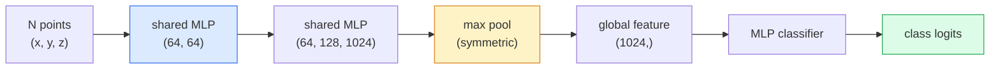

# Vue 3D  Nuages de point et NeRF

> La vision 3D a deux formes. Le nuage de point est la sortie initiale du capteur. NeRF est le champ volumétrique que l'on apprend.

**类型：**Apprendre + construire
**语言：**Python
**先修：**Phase 4 Leçon 03 (CNN), phase 1 Leçon 12 (opérations de tenseur)
**时间：**- 45 minutes

## Objectif de l'apprentissage
- 区分显式(point cloud、mesh、voxel) 和隐式(signé distance field、NeRF) 3D représentations,并理解各自适用场景
- Comprendre la fonction symétrique de PointNet 技巧: comment il permet au réseau neural de disposer d'un ensemble de points invariables par permutation
-  suivre le passage de la NRF: casting de rayons  rendement volumétrique  codage de position  densité MLP + tête de couleur
- Utilisation `nerfstudio`Ou `instant-ngp`Basé sur des images de pose avec un peu de poids, réaliser une reconstruction 3D prétrainée

##  problématique
La caméra  produit une image 2D。LIDAR  produit un groupe de points 3D sans ordre。La structure-à-motion du pipeline  produit un nuage de points clés 3D rares。NeRF peut être utilisé à partir d'une petite quantité d'images avec des poses pour reconstruire une scène 3D complète。Ces éléments appartiennent à la vision, mais ils ne ressemblent pas au tenseur dense que CNN veut。

La vision 3D est importante, car presque toutes les tâches de robots de haute valeur sont en 3D: saisir, éviter les obstacles, naviguer, occlusion de la réalité virtuelle, capturer le contenu en 3D.

Les nuages de point sont des capteurs 免费给你东西──NeRFs 及其后者(3D Gaussian splatting、neural SDFs) sont vous demandez réseau neural apprendre une scène 时得到的东西──

## 概念
### Nuages de pointe

Le nuage de point est un ensemble sans ordre de points N, chaque point est sélectionné avec des caractéristiques (color, intensité, normalité).

```
cloud = [
  (x1, y1, z1, r1, g1, b1),
  (x2, y2, z2, r2, g2, b2),
  ...
  (xN, yN, zN, rN, gN, bN),
]
```

Il n'y a pas de réseau, pas de connectivité.

- **Permutation invariance** 输出 ne peut pas dépendre de l'ordre de la production.
- **Variable N** Un seul modèle  doit être capable de traiter des nuages de différentes tailles 

PointNet (Qi et al., 2017) utilise une idée pour résoudre deux choses: pour chaque application de point partagé MLP, puis avec une fonction symétrique ((max pool)聚合── le résultat est un vecteur de taille fixe, et ne dépend pas de l'ordre──

```
f(P) = max_{p in P} MLP(p)
```

C'est le cœur de PointNet. Les variantes plus profondes de PointNet++ ∞ Point Transformer) ont été ajoutées à l'échantillonnage hiérarchique et à l'agrégation locale, mais la fonction symétrique ∞ technique reste inchangée.

### L'architecture de PointNet



MLP partagé indique le même MLP 独立地运行在每个点上──为了效率, généralement réalisé pour la dimension du point 1x1 − − − − − − − − − − − − − − − − − − − − − − − − − − − − − − − − − − − − − − − − − − − − − − − − − − − − − − − − − − − − − − − − − − − − − − − − − − − − − − − − − − − − − − − − − − − − − − − − − − − − − − − − − − − − − − − − − − − − − − − − − − − − − − − − − − − − − − − − − − − − − − − − − − − − − − − − − − − − − − − − − − − − − − − − − − − − − − − − − − − − − − − − − − − − − − − − − − − − − − − − − − − − − − − − − − − − − − − − − − − − − − − − − − − − − − − − − − − − − − − − − − − − − − − − − − − − − − − − − − − − − − − − − − − − − − − − − − − − − − − − − − − − − − − − − − − − − − − − − − − − − − − − − − − − − − − − − − − − − − − − − − − − − − − − − − − − − − − − − − − − − − − − − − − − − − − − − − − − − − − − − − − − − − − − − − − − − − − − − − − − − − − − − − − − − − − − − − − − − − − − − − − − − − − − − − − − − − − − − − − − − − − − − − − − − − − − − − − − − − − − − − − − − − − − − − − − − − − − − − − − − − − − − − − − − −

### Les champs de radiance neurale (NeRF)

NeRFs (Mildenhall et coll., 2020)  poser la question: 我们能否从 N 张照片重建一个3D场景?它的答案是:`(x, y, z, viewing_direction)`映射到 `(density, colour)`染新视角 是 un cycle de rayonnement autour du réseau 

```
NeRF MLP:  (x, y, z, theta, phi) -> (sigma, r, g, b)

To render a pixel (u, v) of a new view:
  1. Cast a ray from the camera through pixel (u, v)
  2. Sample points along the ray at distances t_1, t_2, ..., t_N
  3. Query the MLP at each point
  4. Composite the colours weighted by (1 - exp(-sigma * dt))
  5. The sum is the rendered pixel colour
```

Loss 会将染出像素与训练照片中的地面真相像素 进行比较──通过转载步骤做 Backprop 来更新 MLP──没有3D ground truth,没有显式几何学场景 存储在MLP权重中──

### Encodage de position au sein de NeRF

作用在 `(x, y, z)`Le MLP de vanille de la première génération ne peut pas indiquer de fréquence élevée, car les MLP de la dernière génération sont orientés vers la basse génération.

```
gamma(p) = (sin(2^0 pi p), cos(2^0 pi p), sin(2^1 pi p), cos(2^1 pi p), ...)
```

Le maximum à L=10 niveaux de fréquence. Ceci est le même que les transformateurs utilisant les mêmes techniques de position, aussi apparaîtra à nouveau dans le temps de diffusion.

### Rendering volumétrique

```
C(r) = sum_i T_i * (1 - exp(-sigma_i * delta_i)) * c_i

T_i  = exp(- sum_{j<i} sigma_j * delta_j)
delta_i = t_{i+1} - t_i
```

`T_i`C'est la transmission, c'est aussi le nombre de luminaires qui peuvent atteindre le point d'accès.`(1 - exp(-sigma_i * delta_i))`Il y a une opacité.`c_i`Le pixel final est le rayonnement de la couleur.

### Ce qui a remplacé les NERF

純 NeRFs 訓練慢(数小时), 染也慢(每张图数秒)

- **Instant-NGP**(2022)  codification de la grille de hachage 替代 MLP's position input;数秒内完成训练──
- **Mip-NeRF 360** 处理 unlimited scenes 和 anti-aliasing。
- **3D Gaussian Splatting**(2023)  Avec des millions de Gaussiens 3D  remplacement du champ volumétrique; 数分钟训练,实时染──当前生产环境的默认选择──

En 2026 presque tous les produits de la NERF sont en réalité des splatts gaussiens en 3D.

### Ensembles de données et indicateurs de référence

- **ShapeNet** utiliser les modèles 3D CAD  comme nuages de points  effectuer la classification et la segmentation。
- **ScanNet** Utilisé pour les scans de segmentation en salle réelle.
- **KITTI** Utilisé pour la conduite autonome de l'extérieur des nuages de points LIDAR。
- **NeRF Synthetic**- Je suis là .**Blended MVS** Utilisé pour la synthèse de vue des ensembles de données posées de l'image 
- **Mip-NeRF 360**ensemble de données  scènes réelles illimitées。


```figure
nerf-rays
```

## - Je le construis.
### 步骤 1: Classifiateur PointNet

```python
import torch
import torch.nn as nn

class PointNet(nn.Module):
    def __init__(self, num_classes=10):
        super().__init__()
        self.mlp1 = nn.Sequential(
            nn.Conv1d(3, 64, 1),    nn.BatchNorm1d(64),   nn.ReLU(inplace=True),
            nn.Conv1d(64, 64, 1),   nn.BatchNorm1d(64),   nn.ReLU(inplace=True),
        )
        self.mlp2 = nn.Sequential(
            nn.Conv1d(64, 128, 1),  nn.BatchNorm1d(128),  nn.ReLU(inplace=True),
            nn.Conv1d(128, 1024, 1), nn.BatchNorm1d(1024), nn.ReLU(inplace=True),
        )
        self.head = nn.Sequential(
            nn.Linear(1024, 512),   nn.BatchNorm1d(512),  nn.ReLU(inplace=True),
            nn.Dropout(0.3),
            nn.Linear(512, 256),    nn.BatchNorm1d(256),  nn.ReLU(inplace=True),
            nn.Dropout(0.3),
            nn.Linear(256, num_classes),
        )

    def forward(self, x):
        # x: (N, 3, num_points) — transposed for Conv1d
        x = self.mlp1(x)
        x = self.mlp2(x)
        x = torch.max(x, dim=-1)[0]       # (N, 1024)
        return self.head(x)

pts = torch.randn(4, 3, 1024)
net = PointNet(num_classes=10)
print(f"output: {net(pts).shape}")
print(f"params: {sum(p.numel() for p in net.parameters()):,}")
```

Environ 1,6 M de paramètres. Chaque nuage fonctionne à 1 024 points.

### 步骤 2: Codification de position

```python
def positional_encoding(x, L=10):
    """
    x: (..., D) -> (..., D * 2 * L)
    """
    freqs = 2.0 ** torch.arange(L, dtype=x.dtype, device=x.device)
    args = x.unsqueeze(-1) * freqs * 3.141592653589793
    sinc = torch.cat([args.sin(), args.cos()], dim=-1)
    return sinc.reshape(*x.shape[:-1], -1)

x = torch.randn(5, 3)
y = positional_encoding(x, L=10)
print(f"input:  {x.shape}")
print(f"encoded: {y.shape}     # (5, 60)")
```

- Je suis là .`2^l * pi`J'obtiendrai des fréquences plus élevées.

### 步骤 3: Petit NRF MLP

```python
class TinyNeRF(nn.Module):
    def __init__(self, L_pos=10, L_dir=4, hidden=128):
        super().__init__()
        self.L_pos = L_pos
        self.L_dir = L_dir
        pos_dim = 3 * 2 * L_pos
        dir_dim = 3 * 2 * L_dir
        self.trunk = nn.Sequential(
            nn.Linear(pos_dim, hidden), nn.ReLU(inplace=True),
            nn.Linear(hidden, hidden),  nn.ReLU(inplace=True),
            nn.Linear(hidden, hidden),  nn.ReLU(inplace=True),
            nn.Linear(hidden, hidden),  nn.ReLU(inplace=True),
        )
        self.sigma = nn.Linear(hidden, 1)
        self.color = nn.Sequential(
            nn.Linear(hidden + dir_dim, hidden // 2), nn.ReLU(inplace=True),
            nn.Linear(hidden // 2, 3), nn.Sigmoid(),
        )

    def forward(self, x, d):
        x_enc = positional_encoding(x, self.L_pos)
        d_enc = positional_encoding(d, self.L_dir)
        h = self.trunk(x_enc)
        sigma = torch.relu(self.sigma(h)).squeeze(-1)
        rgb = self.color(torch.cat([h, d_enc], dim=-1))
        return sigma, rgb

nerf = TinyNeRF()
x = torch.randn(128, 3)
d = torch.randn(128, 3)
s, c = nerf(x, d)
print(f"sigma: {s.shape}   rgb: {c.shape}")
```

Avec les neRF originaux, il y a 2 troncs de MLP de 8 profondeurs.

### 步骤 4: Rendering volumétrique le long d'un rayon

```python
def volumetric_render(sigma, rgb, t_vals):
    """
    sigma: (..., N_samples)
    rgb:   (..., N_samples, 3)
    t_vals: (N_samples,) distances along the ray
    """
    delta = torch.cat([t_vals[1:] - t_vals[:-1], torch.full_like(t_vals[:1], 1e10)])
    alpha = 1.0 - torch.exp(-sigma * delta)
    trans = torch.cumprod(torch.cat([torch.ones_like(alpha[..., :1]), 1.0 - alpha + 1e-10], dim=-1), dim=-1)[..., :-1]
    weights = alpha * trans
    rendered = (weights.unsqueeze(-1) * rgb).sum(dim=-2)
    depth = (weights * t_vals).sum(dim=-1)
    return rendered, depth, weights


N = 64
t_vals = torch.linspace(2.0, 6.0, N)
sigma = torch.rand(N) * 0.5
rgb = torch.rand(N, 3)
rendered, depth, weights = volumetric_render(sigma, rgb, t_vals)
print(f"rendered colour: {rendered.tolist()}")
print(f"depth:           {depth.item():.2f}")
```

Un rayon, 64 échantillons, ensemble pour devenir un pixel RGB et une profondeur.

## Utilisez-le
Pour le vrai travail:

- `nerfstudio`(Tancik et coll.)  当前用于 NeRF / Instant-NGP / Gaussian Splatting 的参考图书馆──命令行加网观看器──
- `pytorch3d`(Meta)  rendrage différenciable  utilitaires point-cloud  opérations de filet 
- `open3d` traitement en nuage de point, enregistrement, visualisation.

La mise en place de la splatation gaussienne en 3D a fondamentalement remplacé les NeRF pures, car elle se propageait à une vitesse rapide de 100 fois.

## Je le livre.
Le programme de formation

- `outputs/prompt-3d-task-router.md` Un prompt, sera basé sur la tâche et les données d'entrée 路由到合适的3D représentation  point cloud、mesh、voxel、NeRF、Gaussian splat) 
- `outputs/skill-point-cloud-loader.md`Une compétence pour écrire PyTorch.`Dataset`,load .ply / .pcd / .xyz 文件,并进行正确的正常化、中心和点样本──

## 练习
1. **（Easy）**证明PointNet est permutation-invariante: va faire le même nuage 运行两次,一次保持原顺序,一次打乱点――验证输出除了浮点噪音 之外完全相同――
2. **（Medium）**实现 une fonction de génération de rayons minimales: donner une position et une intrinsèque de la caméra, pour chaque pixel d'image H x W 生成 ray origines 和 directions。
3. **（Hard）**Dans les images rendues de cube couleur  synthétiser un ensemble de données 上训练 TinyNeRF(可通过可分化 rendering或简单射线追踪生成) ⋅报告时代 1、10 和 100 的 rendering loss──Model 在哪个时代 产生可识别的视图?

## 关键术语
| Term | 人们常说 | 实际含义 |
|------|----------------|----------------------|
| Point cloud | “来自 LIDAR 的 3D points” | 无序的 (x, y, z) 集合 + 每个点可选的 features |
| PointNet | “第一个用于 point clouds 的 neural net” | 每个点一个 shared MLP + symmetric (max) pool；结构上天然 permutation-invariant |
| NeRF | “本身就是 scene 的 MLP” | 将 (x, y, z, dir) 映射到 (density, colour) 的 network；通过 ray casting 渲染 |
| Positional encoding | “Fourier features” | 将每个 coordinate 编码为多个 frequencies 下的 sin/cos，以克服 MLP 的低频偏置 |
| Volumetric rendering | “Ray integration” | 使用 transmittance 和 alpha 将 ray 上的 samples 合成为单个 pixel |
| Instant-NGP | “Hash-grid NeRF” | 用 multi-resolution hash grid 替换 NeRF 的 coordinate MLP；快 100-1000 倍 |
| 3D Gaussian splatting | “数百万个 Gaussians” | Scene = 3D Gaussians 的集合；实时渲染，数分钟训练 |
| SDF | “Signed distance field” | 返回到最近 surface 的 signed distance 的 function；另一种 implicit representation |

## 延伸阅读
- [PointNet (Qi et al., 2017)](https://arxiv.org/abs/1612.00593) Classificateur de permutation-invariante
- [NeRF (Mildenhall et al., 2020)](https://arxiv.org/abs/2003.08934) 让从照片进行3D reconstruction 成为神经网络问题 的论文
- [Instant-NGP (Müller et al., 2022)](https://arxiv.org/abs/2201.05989) réseaux de hachage,1000 倍加速
- [3D Gaussian Splatting (Kerbl et al., 2023)](https://arxiv.org/abs/2308.04079) Dans la production remplacer l'architecture des NRF
