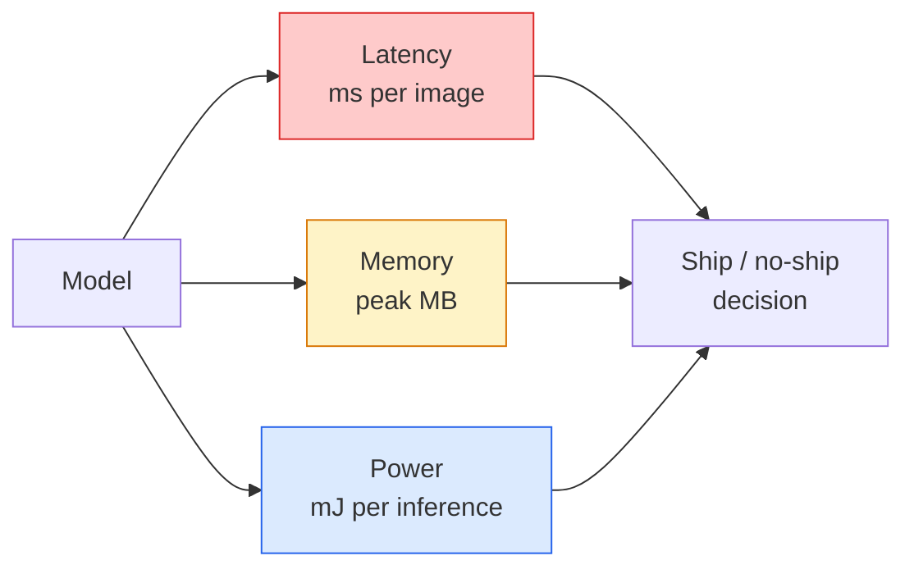

# Vue en temps réel  边缘部署

> L'inférence de bord est de permettre à un modèle de 90 degrés de précision de fonctionner à 30 fps sur un appareil de 2 Go de RAM.

**Type:** Learn + Build
**Languages:** Python
**Prerequisites:** Phase 4 Lesson 04 (Image Classification), Phase 10 Lesson 11 (Quantization)
**Time:** ~75 minutes

## Objectif de l'apprentissage
- 测量任意 PyTorch model 的推理延迟、峰值内存 和吞吐量,并读懂 FLOPs / params / latency 之间的权衡
- Utilisation de PyTorch de la quantification post-entraînement va le modèle de vision  quantifier pour INT8,并验证 la perte de précision < 1%
- 导出到ONNX,并使用ONNX Runtime或TensorRT 编译;说出三种最常见的导出失败原因及其修复方式
- 解释在边缘 约束下何时选择 MobileNetV3、EfficientNet-Lite、ConvNeXt-Tiny ou MobileViT

##  problématique
Le modèle de vision de la phase d'entraînement est généralement un point flottant 巨兽──100M paramètres、 par passage à l'avant 10 GFLOPs、2 GB VRAM── tous ces éléments ne peuvent être installés dans les appareils mobiles、 les unités d'info-entretenement automobiles、 les appareils industriels ou les drones── livrer un système de vision, ce qui signifie mettre la même capacité de prédiction dans un budget de moins de 100 fois celui de la même taille.

La sélection de modèle est effectuée par trois cycles: la sélection de modèle est effectuée avec la même recette de plus petite architecture) √ quantification √ utilisation de l'INT8  remplacement du FP32) et l'inference runtime √ ONNX Runtime √ TensorRT、 Core ML、 TFLite) √ Les modifier, décider que vous avez fait un seul démo qui peut être déployé sur la station de travail √ 上 running, il y a aussi un produit capable de déployer jusqu'à 30 $ module de caméra √ √

Le but n'est pas d'apprendre à terminer chaque cycle de bord, mais de savoir quelles sont les levier et comment vérifier que chaque levier a réellement fait ce que vous pensiez qu'il faisait.

## 概念
### 3 budgets



- **Latency**:p50、p95、p99¬                                                                                                                                                                                                                                                          
- **Peak memory**La valeur maximale de l'appareil a déjà été observée, et non la moyenne à l'état stable.
- **Power / energy**Les milliers de journées de déduction sur les appareils électriques de la batterie sont généralement utilisées avec l'utilisation de la CPU/GPU * temps 近似。

l'extrémité  décision dépendant est une unité (modèle, latence, mémoire, précision) 表── chaque élément doit être mesuré sur le périphérique cible, et non sur le poste de travail 上──

### Discipline de mesure

Chaque fois que le profil de bord doit respecter trois règles:

1. En utilisant la passe de 5 à 10 fois**Warm up**modèle── cold cache­shing et compilation JIT 会产生不代表性的 première valeur−
2. Dans le bloc de temps avant usage`torch.cuda.synchronize()` **Synchronise**Les charges de travail de la GPU sont les dépêches du noyau, et non l'exécution du noyau.
3. Les tailles d'entrée **Fix**La latence de production 224x224 n'est pas 512x512

### FLOPs  en tant que proxy

FLOPs (en anglais: FLOPs) est un proxy de latence peu coûteux, sans lien avec les appareils. Il convient à la comparaison architecturale, mais en tant qu'horloge murale absolue, il se produit une erreur.

规则: faire des recherches d'architecture avec des FLOP, faire des décisions de déploiement avec une latence sur l'appareil.

### Quantification 一段话说明

Utilisation de l'INT8  remplacement des poids FP32 和 activations。 taille du modèle  diminution de 4x, bande passante de mémoire  diminution de 4x, en tenant compte du matériel des noyaux INT8  diminution de 2-4x ( tous les systèmes de commande mobiles modernes ✓所有带 Tensor Cores 的 NVIDIA GPU) ⋅ tâches de vision  perte de précision de la mise en page est généralement de 0,1-1 个百分点, en utilisant la quantification statique post-entraînement 即可达到──

类型:

- **Dynamic** Vaux 量化  INT8, activations 以 FP 计算──简单,速度提升较小──
- **Static (post-training)** 量化 weights, et en petits réglages d'étalonnage 校准激活范围──比动态 快得多──
- **Quantisation-aware training (QAT)** Pendant l'entraînement, la quantification est imitée, la modélisation s'adapte à elle.

Pour la vision, la quantification statique post-entraînement avec 5% de travail obtient 95% de bénéfices.

### Pruning et distillation

- **Pruning** 移除不重要 weights (en fonction de la taille) ou des canaux (en fonction de la structure)    移除不重要重量 (en fonction de la taille)    移除不重要重量 (en fonction de la taille)      移除不重要重量 (en fonction de la taille)                                                                                                                                                                                                                  
- **Distillation** 訓練一個小學生 去模仿大師的logits──通常能恢复缩小模型 后损失的大部分精度──生产边缘模型的标准做法──

### Temps de fonctionnement de l'inference

- **PyTorch eager** 慢,不适合部署──pour le développement seulement──
- **TorchScript** héritage── déjà été `torch.compile`Et les exportations sont en cours.
- **ONNX Runtime** Encore runtime──CPU、CUDA、CoreML、TensorRT、OpenVINO ont tous des fournisseurs ONNX──de là à commencer──
- **TensorRT** Compileur de NVIDIA── sur les GPU de NVIDIA(station de travail et Jetson)
- **Core ML** Temps d'exécution d'iOS/macOS d'Apple.`.mlmodel`Ou `.mlpackage`Il y a une autre.
- **TFLite** Le temps d'exécution Android/ARM de Google.`.tflite`Il y a une autre.
- **OpenVINO** Temps de fonctionnement du processeur / VPU d'Intel.`.xml`+ `.bin`Il y a une autre.

实践中:export PyTorch -> ONNX -> 为目标 选择 runtime。ONNX est la langue française。

### Prise en charge de l'architecture de bord

| Budget | Model | Why |
|--------|-------|-----|
| < 3M params | MobileNetV3-Small | 到处都能编译，是很好的 baseline |
| 3-10M | EfficientNet-Lite-B0 | TFLite 上每 param 的 accuracy 最好 |
| 10-20M | ConvNeXt-Tiny | accuracy-per-param 最好，且 CPU-friendly |
| 20-30M | MobileViT-S or EfficientViT | 具备 ImageNet accuracy 的 Transformer |
| 30-80M | Swin-V2-Tiny | 如果 stack 支持 window attention |

À moins qu'il n'y ait une raison claire de ne pas le faire, alors mesurez-les tous en INT8*.


```figure
cnn-param-count
```

## - Je le construis.
### 步骤 1: Mesurer correctement la latence

```python
import time
import torch

def measure_latency(model, input_shape, device="cpu", warmup=10, iters=50):
    model = model.to(device).eval()
    x = torch.randn(input_shape, device=device)
    with torch.no_grad():
        for _ in range(warmup):
            model(x)
        if device == "cuda":
            torch.cuda.synchronize()
        times = []
        for _ in range(iters):
            if device == "cuda":
                torch.cuda.synchronize()
            t0 = time.perf_counter()
            model(x)
            if device == "cuda":
                torch.cuda.synchronize()
            times.append((time.perf_counter() - t0) * 1000)
    times.sort()
    return {
        "p50_ms": times[len(times) // 2],
        "p95_ms": times[int(len(times) * 0.95)],
        "p99_ms": times[int(len(times) * 0.99)],
        "mean_ms": sum(times) / len(times),
    }
```

Réchauffement, synchronisation, usage `time.perf_counter()` Rapporter des pourcentages, et non seulement signifier

### 步骤 2: Paramètre et FLOP compte

```python
def parameter_count(model):
    return sum(p.numel() for p in model.parameters())

def flops_estimate(model, input_shape):
    """
    Rough FLOP count for a conv/linear-only model. For production use `fvcore` or `ptflops`.
    """
    total = 0
    def conv_hook(m, inp, out):
        nonlocal total
        c_out, c_in, kh, kw = m.weight.shape
        h, w = out.shape[-2:]
        total += 2 * c_in * c_out * kh * kw * h * w
    def linear_hook(m, inp, out):
        nonlocal total
        total += 2 * m.in_features * m.out_features
    hooks = []
    for m in model.modules():
        if isinstance(m, torch.nn.Conv2d):
            hooks.append(m.register_forward_hook(conv_hook))
        elif isinstance(m, torch.nn.Linear):
            hooks.append(m.register_forward_hook(linear_hook))
    model.eval()
    with torch.no_grad():
        model(torch.randn(input_shape))
    for h in hooks:
        h.remove()
    return total
```

                                                                                                                                                                                                                                                                                                                                                                                                                                                                                                                             `fvcore.nn.FlopCountAnalysis`Ou `ptflops`Ils peuvent correctement traiter chaque type de module.

### 步骤 3: Quantification statique après l'entraînement

```python
def quantise_ptq(model, calibration_loader, backend="x86"):
    import torch.ao.quantization as tq
    model = model.eval().cpu()
    model.qconfig = tq.get_default_qconfig(backend)
    tq.prepare(model, inplace=True)
    with torch.no_grad():
        for x, _ in calibration_loader:
            model(x)
    tq.convert(model, inplace=True)
    return model
```

3 étapes:configurer, préparer, mettre en place des observateurs, calibrer, convertir, utiliser des données réelles, fusionner et quantifier`Conv -> BN -> ReLU`- Je suis là.`ConvBnReLU`), pouvant être`torch.ao.quantization.fuse_modules`- Je suis désolé.

### 步骤 4: 导出到ONNX

```python
def export_onnx(model, sample_input, path="model.onnx"):
    model = model.eval()
    torch.onnx.export(
        model,
        sample_input,
        path,
        input_names=["input"],
        output_names=["output"],
        dynamic_axes={"input": {0: "batch"}, "output": {0: "batch"}},
        opset_version=17,
    )
    return path
```

`opset_version=17`C'est la sécurité de l'année 2026:`dynamic_axes`让你可以使用任意批量 运行ONNX modèle。

### 步骤 5: Indice de référence et comparaison des différents régimes

```python
import torch.nn as nn
from torchvision.models import mobilenet_v3_small

def compare_regimes():
    model = mobilenet_v3_small(weights=None, num_classes=10)
    params = parameter_count(model)
    flops = flops_estimate(model, (1, 3, 224, 224))
    lat_fp32 = measure_latency(model, (1, 3, 224, 224), device="cpu")
    print(f"FP32 MobileNetV3-Small: {params:,} params  {flops/1e9:.2f} GFLOPs  "
          f"p50={lat_fp32['p50_ms']:.2f}ms  p95={lat_fp32['p95_ms']:.2f}ms")
```

Pour le`resnet50`- Je suis là.`efficientnet_v2_s`et `convnext_tiny`运行同函数, vous pouvez obtenir la table de comparaison nécessaire pour déployer la décision.

## Utilisez-le
Les piles de production sont généralement rece到三条路径之一:

- **Web / serverless**Le plus simple, pour la plupart des scénarios, assez bon.
- **NVIDIA edge (Jetson, GPU server)**Le plus grand effort d'ingénierie
- **Mobile**:PyTorch -> ONNX -> Core ML (iOS) ou TFLite (Android)

测量方面,`torch-tb-profiler`- Je suis là.`nvprof`- Je suis là .`nsys`, ainsi que les instruments de macOS peuvent donner une décomposition couche par couche.`benchmark_app`(OpenVINO)`trtexec`(TensorRT) Je peux donner un CLI de numéros indépendants.

## Je le livre.
Le cours est ouvert à:

- `outputs/prompt-edge-deployment-planner.md` Une mise à jour, en fonction du dispositif cible 和 latence SLA 选择脊柱、量化策略 和运行时间──
- `outputs/skill-latency-profiler.md` Une compétence, pour écrire un script complet de marquage de latence, comprenant le réchauffement, la synchronisation, les pourcentages et le suivi de la mémoire.

## 练习
1. **(Easy)**La CPU est en mesure de mesurer 224x224`resnet18`- Je suis là.`mobilenet_v3_small`- Je suis là.`efficientnet_v2_s`et `convnext_tiny`La latence de p50 ⋅ rapport, ⋅ notation de l'architecture de précision par ms ⋅
2. **(Medium)**Pour le`mobilenet_v3_small` appliquer la quantification statique post-entraînement― rapport CIFAR-10 ou similaire données collecte détenue sous-ensemble 上的 FP32 vs INT8 latence 和 précision perte―
3. **(Hard)**Il va`convnext_tiny`导出到ONNX,用 `CPUExecutionProvider`- Je suis là.`onnxruntime`运行,并将延迟与 PyTorch eager baseline比较──找出ONNX Runtime 第一个更快的层,并解释原因──

## 关键术语
| Term | What people say | What it actually means |
|------|----------------|----------------------|
| Latency | “有多快” | 从 input 到 output 的时间；看 p50/p95/p99 percentiles，而不是 mean |
| FLOPs | “Model size” | 每次 forward pass 的 floating-point ops；compute cost 的粗略 proxy |
| INT8 quantisation | “8-bit” | 用 8-bit integers 替代 FP32 weights/activations；体积约小 4x，速度快 2-4x |
| PTQ | “Post-training quantisation” | 在不 retraining 的情况下量化 trained model；简单，通常足够 |
| QAT | “Quantisation-aware training” | 训练期间模拟 quantisation；accuracy 最好，需要 labelled data |
| ONNX | “中立格式” | 每个主流 inference runtime 都支持的 model exchange format |
| TensorRT | “NVIDIA compiler” | 将 ONNX 编译为面向 NVIDIA GPUs 的 optimised engine |
| Distillation | “Teacher -> student” | 训练 small model 去模仿 big model 的 logits；恢复大部分损失的 accuracy |

## 延伸阅读
- [EfficientNet (Tan & Le, 2019)](https://arxiv.org/abs/1905.11946) Écalement des composés de haute efficacité
- [MobileNetV3 (Howard et al., 2019)](https://arxiv.org/abs/1905.02244) architecture mobile-first, contenant h-swish et squeeze-excite
- [A Practical Guide to TensorRT Optimization (NVIDIA)](https://developer.nvidia.com/blog/accelerating-model-inference-with-tensorrt-tips-and-best-practices-for-pytorch-users/) 如何真正获得论文中的 débit numéros
- [ONNX Runtime docs](https://onnxruntime.ai/docs/) quantification, optimisation des graphiques, sélection des fournisseurs
