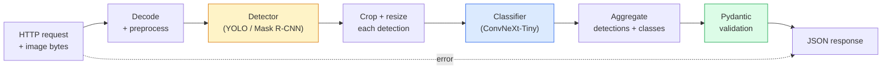

# Construire un pipeline vision complet Capstone

> Le système de vision de la phase de production est constitué de chaînes composées de modèles et de règles, et par le contrat de données 串联起来── les composants de cette phase sont prêts; cette pierre angulaire les mettra fin à fin de la connexion──

**Type:** Build
**Languages:** Python
**Prerequisites:** Phase 4 Lessons 01-15
**Time:** ~120 minutes

## Objectif de l'apprentissage
-  Concevoir un pipeline de vision de production, utilisé pour tester des objets, des catégories, et produire des JSON structurés, en même temps que traiter tous les chemins qui ont échoué
- Il est possible de détecter les données de la société de détection de données de la société de détection de données de la société de détection de données de la société de détection de données de la société de détection de données de la société de détection de données de la société de détection de données de la société de détection de données de la société de détection de données de la société de détection de données de la société de détection de données de la société de détection de données de la société de détection de données de la société de détection de données de la société de détection de données de la société de détection de données de détection de données de la société de détection de détection de données de détection de données de détection de données de données de détection de données de données de données de données de données de données de données de données de données de données de données de données de données de données de données de données de données de données de données de données de données de données de données de données de données de données de données de données de données de données de données de données de données de données de données de données de données de données de données de données de données de données de données de données de données de données de données de données de données de données de données de données de données de données de données de données de données de données de données de données de données de données de données de données de données de données de données de données de données de données de données de données de données de données de données de données de données de données de données de données de données de données de données de données de données de données de données de données de données de données de données de données de données de données de données de données de données de données de données de données de données de données de données de données de données de données.
- Pour le pipeline de bout en bout  effectuer un benchmark,并识别第一个瓶️ généralement d'abord le pré-traitement, puis le détecteur)
-  publier un service FastAPI minimum, accepter le téléchargement d'images, fonctionner le pipeline, et retourner avec la classification de la détection  résultat

##  problématique
单个视觉模型 很有用;视觉产品是由它们组成的链条──零售货架审计是检测仪 加产品分类器 再加价格-OCR管道──自动驾驶是2D检测仪 加3D检测仪加段机加跟踪仪加规划仪──医疗预查是分类器加地区分类器加临床医师 UI──

Pour mettre ces chaînes en relation, il est nécessaire de distinguer le prototype ML et la partie clé du produit. Chaque interface entre les modèles est une nouvelle source de bugs. Chaque transformation de coordonnées, chaque normalisation, chaque taille de masque peut devenir un point de défaillance silencieuse.

Cette pierre angulaire construire le pipeline le plus petit possible: détection + classification + sortie structurée + couche de service。La phase 4 contient tout le contenu qui peut être inséré dans ce schéma: 把 Mask R-CNN 换成 YOLOv8, 添加 OCR head, 添加 分分分支部, 添加跟踪器。L'architecture est stable; le composé est éluctables。

## 概念
### Le pipeline



七个阶段──两个 modèle de phase 开销很大;另五个阶段则是 bug 最常出现的地方──

### 使用 Pydantic 定义 Contrat de données

Chaque modèle de frontière est transformé en un objet de typographie.

```
Detection(
    box: tuple[float, float, float, float],   # (x1, y1, x2, y2), absolute pixels
    score: float,                              # [0, 1]
    class_id: int,                             # from detector's label map
    mask: Optional[list[list[int]]],           # RLE-encoded if present
)

PipelineResult(
    image_id: str,
    detections: list[Detection],
    classifications: list[Classification],
    inference_ms: float,
)
```

Quand le détecteur est revenu`(cx, cy, w, h)`Au lieu de`(x1, y1, x2, y2)`Lorsque la validation de Pydantic échoue, vous trouverez immédiatement le problème, au lieu de tester une récolte en bas, il ne fait que revenir silencieusement dans la région vide.

### 延迟花在哪里

La plupart des projets de développement sont réalisés en ligne.

1. **Preprocessing 通常是最大的单个模块。**解码 JPEG、转换颜色空间、尺寸, tout cela est lié au processeur, et facilement négligé.
2. **Detector 主导 GPU 时间。**70-90% du temps passé sur la GPU est passé à l'avant.
3. **Postprocessing（NMS、RLE encode/decode）在 GPU 上便宜，在 CPU 上昂贵。**Il faut utiliser un environnement objectif réel pour faire un profil.

Comprendre la distribution, pour transformer l'optimisation en une liste prioritaire.

### Mode d'échec

- **Empty detections**Retournez à la liste, ne vous effondrez pas.
- **Out-of-bounds boxes** coupage de pré-clampe à la taille de l'image.
- **Tiny crops** Pour le classifiateur, la boîte de la plus petite taille de l'entrée  saute la classification。
- **Corrupt upload** 返回带有具体错误代码 的 400 réponse, et non pas 500。
- **Model load failure** Dans le démarrage du service 失败, plutôt que dans la première demande 时失败。

Le pipeline de production traitera chaque situation, plutôt que d'écrire une généralisation.`try/except`Pour chaque défaite, il y a un code de nom et une réponse.

### Les lots

Service de niveau de production 会服务多个客户──跨请求对检测和分类 进行批发可成倍提升吞吐量──代价是: attendre le lot 填满会带来额外延迟──典型设置:最多收集 20ms 请求,合并成批发,处理,再分发回应──`torchserve`et `triton`Le service de charge prévisible de petite taille se réalise généralement lui-même en micro-batcher.


```figure
v4-vision-pipeline
```

## - Je le construis.
### 步骤 1: Contrats de données

```python
from pydantic import BaseModel, Field
from typing import List, Optional, Tuple

class Detection(BaseModel):
    box: Tuple[float, float, float, float]
    score: float = Field(ge=0, le=1)
    class_id: int = Field(ge=0)
    mask_rle: Optional[str] = None


class Classification(BaseModel):
    detection_index: int
    class_id: int
    class_name: str
    score: float = Field(ge=0, le=1)


class PipelineResult(BaseModel):
    image_id: str
    detections: List[Detection]
    classifications: List[Classification]
    inference_ms: float
```

Le code de 5 secondes, peut être utilisé pour tout pipeline strict.

### 步骤 2: Un type de pipeline le plus petit

```python
import time
import numpy as np
import torch
from PIL import Image

class VisionPipeline:
    def __init__(self, detector, classifier, class_names,
                 device="cpu", min_crop=32):
        self.detector = detector.to(device).eval()
        self.classifier = classifier.to(device).eval()
        self.class_names = class_names
        self.device = device
        self.min_crop = min_crop

    def preprocess(self, image):
        """
        image: PIL.Image or np.ndarray (H, W, 3) uint8
        returns: CHW float tensor on device
        """
        if isinstance(image, Image.Image):
            image = np.asarray(image.convert("RGB"))
        tensor = torch.from_numpy(image).permute(2, 0, 1).float() / 255.0
        return tensor.to(self.device)

    @torch.no_grad()
    def detect(self, image_tensor):
        return self.detector([image_tensor])[0]

    @torch.no_grad()
    def classify(self, crops):
        if len(crops) == 0:
            return []
        batch = torch.stack(crops).to(self.device)
        logits = self.classifier(batch)
        probs = logits.softmax(-1)
        scores, cls = probs.max(-1)
        return list(zip(cls.tolist(), scores.tolist()))

    def run(self, image, image_id="anonymous"):
        t0 = time.perf_counter()
        tensor = self.preprocess(image)
        det = self.detect(tensor)

        crops = []
        detections = []
        valid_indices = []
        for i, (box, score, cls) in enumerate(zip(det["boxes"], det["scores"], det["labels"])):
            x1, y1, x2, y2 = [max(0, int(b)) for b in box.tolist()]
            x2 = min(x2, tensor.shape[-1])
            y2 = min(y2, tensor.shape[-2])
            detections.append(Detection(
                box=(x1, y1, x2, y2),
                score=float(score),
                class_id=int(cls),
            ))
            if (x2 - x1) < self.min_crop or (y2 - y1) < self.min_crop:
                continue
            crop = tensor[:, y1:y2, x1:x2]
            crop = torch.nn.functional.interpolate(
                crop.unsqueeze(0),
                size=(224, 224),
                mode="bilinear",
                align_corners=False,
            )[0]
            crops.append(crop)
            valid_indices.append(i)

        class_preds = self.classify(crops)

        classifications = []
        for valid_idx, (cls_id, cls_score) in zip(valid_indices, class_preds):
            classifications.append(Classification(
                detection_index=valid_idx,
                class_id=int(cls_id),
                class_name=self.class_names[cls_id],
                score=float(cls_score),
            ))

        return PipelineResult(
            image_id=image_id,
            detections=detections,
            classifications=classifications,
            inference_ms=(time.perf_counter() - t0) * 1000,
        )
```

Chaque interface est classée. Chaque voie d'échec a une décision de traitement claire.

### 步骤 3: Connecter un détecteur et un classifiateur

```python
from torchvision.models.detection import maskrcnn_resnet50_fpn_v2
from torchvision.models import convnext_tiny

# Use ImageNet-pretrained weights for a realistic pipeline without training
detector = maskrcnn_resnet50_fpn_v2(weights="DEFAULT")
classifier = convnext_tiny(weights="DEFAULT")
class_names = [f"imagenet_class_{i}" for i in range(1000)]

pipe = VisionPipeline(detector, classifier, class_names)

# Smoke test with a synthetic image
test_image = (np.random.rand(400, 600, 3) * 255).astype(np.uint8)
result = pipe.run(test_image, image_id="demo")
print(result.model_dump_json(indent=2)[:500])
```

### 步骤 4: service FastAPI

```python
from fastapi import FastAPI, UploadFile, HTTPException
from io import BytesIO

app = FastAPI()
pipe = None  # initialised on startup

@app.on_event("startup")
def load():
    global pipe
    detector = maskrcnn_resnet50_fpn_v2(weights="DEFAULT").eval()
    classifier = convnext_tiny(weights="DEFAULT").eval()
    pipe = VisionPipeline(detector, classifier, class_names=[f"c{i}" for i in range(1000)])

@app.post("/detect")
async def detect_endpoint(file: UploadFile):
    if file.content_type not in {"image/jpeg", "image/png", "image/webp"}:
        raise HTTPException(status_code=400, detail="unsupported image type")
    data = await file.read()
    try:
        img = Image.open(BytesIO(data)).convert("RGB")
    except Exception:
        raise HTTPException(status_code=400, detail="cannot decode image")
    result = pipe.run(img, image_id=file.filename or "upload")
    return result.model_dump()
```

Utilisation `uvicorn main:app --host 0.0.0.0 --port 8000`运行。 usage `curl -F 'file=@dog.jpg' http://localhost:8000/detect`Je suis en train de faire une expérience.

### 步骤 5: Benchmark Ce pipeline

```python
import time

def benchmark(pipe, num_runs=20, image_size=(400, 600)):
    img = (np.random.rand(*image_size, 3) * 255).astype(np.uint8)
    pipe.run(img)  # warm up

    stages = {"preprocess": [], "detect": [], "classify": [], "total": []}
    for _ in range(num_runs):
        t0 = time.perf_counter()
        tensor = pipe.preprocess(img)
        t1 = time.perf_counter()
        det = pipe.detect(tensor)
        t2 = time.perf_counter()
        crops = []
        for box in det["boxes"]:
            x1, y1, x2, y2 = [max(0, int(b)) for b in box.tolist()]
            x2 = min(x2, tensor.shape[-1])
            y2 = min(y2, tensor.shape[-2])
            if (x2 - x1) >= pipe.min_crop and (y2 - y1) >= pipe.min_crop:
                crop = tensor[:, y1:y2, x1:x2]
                crop = torch.nn.functional.interpolate(
                    crop.unsqueeze(0), size=(224, 224), mode="bilinear", align_corners=False
                )[0]
                crops.append(crop)
        pipe.classify(crops)
        t3 = time.perf_counter()
        stages["preprocess"].append((t1 - t0) * 1000)
        stages["detect"].append((t2 - t1) * 1000)
        stages["classify"].append((t3 - t2) * 1000)
        stages["total"].append((t3 - t0) * 1000)

    for stage, times in stages.items():
        times.sort()
        print(f"{stage:12s}  p50={times[len(times)//2]:7.1f} ms  p95={times[int(len(times)*0.95)]:7.1f} ms")
```

Résultats typiques du processeur: préprocessus ~3 ms, détecter 300-500 ms, classer 20-40 ms, total 350-550 ms.

## Utilisez-le
Le modèle de production est finalement reçu à la même structure, en plus:

- **Model versioning** 始终在回应 中记录模型名 和重量哈希──
- **Per-request trace IDs** 记录 chaque étape de chaque demande, afin de pouvoir mettre la réponse lente et étape 关联起来.
- **Fallback path** Si le temps de résiliation du classifiateur, retournez pas avec la détection de la classification, plutôt que de faire toute la demande 失败。
- **Safety filters** Filtre NSFW / PII dans la classification 之后、response 离开 service 之前运行。
- **Batch endpoint**Une seule .`/detect_batch`, accepter l'URL de l'image 列表 pour le traitement en masse。

 pour la production de serveur,`torchserve`- Je suis là.`Triton Inference Server`et `BentoML`开箱即可处理批发,version,metrics 和健康检查.`FastAPI`适合原型 和小规模产品──

## Je le livre.
Le cours est ouvert à:

- `outputs/prompt-vision-service-shape-reviewer.md` Une demande de réponse, pour vérifier le service de vision 代码中的 contrat/réponse forme 违规,并指出第一个破裂 bug──
- `outputs/skill-pipeline-budget-planner.md` Une compétence, une latence et un débit de données, pour chaque étape du pipeline, un budget de temps partagé, et une marque de la phase qui dépassera le budget le plus tôt.

## 练习
1. **(Easy)**Dans un ensemble de données volontairement ouvertes, 10 images sont diffusées sur le pipeline de fonctionnement.
2. **(Medium)**Je vous en donne .`Detection`添加面膜输出字段,并将其编码为 RLE──验证 Même si l'image est de 10 objets, JSON reste également à 1MB 以下──
3. **(Hard)**Dans le classifiateur, pré-ajouter un micro-batcher: recueillir le plus de 10 ms de récolte, utiliser une seule appel GPU pour les classer tous, puis à la demande  retourne le résultat―mesure en 5 secondes par requête concurrente  下 的吞吐量增长和延迟增加──

## 关键术语
| Term | What people say | What it actually means |
|------|----------------|----------------------|
| Pipeline | “系统” | 由 preprocessing、inference 和 postprocessing step 组成的有序链条，每一对 step 之间都有类型化 interface |
| Data contract | “schema” | 每个 stage 的 input 和 output 都必须符合的 Pydantic / dataclass 定义；在边界处捕获 integration bug |
| Preprocessing | “model 之前” | 解码、颜色转换、resizing、normalising；通常是最大的 CPU 时间消耗点 |
| Postprocessing | “model 之后” | NMS、mask resize、threshold、RLE encode；在 GPU 上便宜，在 CPU 上昂贵 |
| Microbatcher | “先收集再 forward” | 在固定窗口内等待多个 request，然后运行一次 batched forward pass 的 aggregator |
| Trace ID | “Request id” | 每个 request 的标识符，会在每个 stage 记录，因此 slow request 可以端到端追踪 |
| Failure code | “命名错误” | 每类 failure 都有具体 error code，而不是泛化的 500；支持 client retry logic |
| Health check | “Readiness probe” | 一个低成本 endpoint，用于报告 service 是否可以响应；loadbalancer 依赖它 |

## 延伸阅读
- [Full Stack Deep Learning — Deploying Models](https://fullstackdeeplearning.com/course/2022/lecture-5-deployment/) Déploiement classique de ML au niveau de la production
- [BentoML docs](https://docs.bentoml.com) 支持批发,版本和测量服务框架
- [torchserve docs](https://pytorch.org/serve/) PyTorch 官方 bibliothèque de service
- [NVIDIA Triton Inference Server](https://developer.nvidia.com/triton-inference-server) 支持批发和多型的高吞吐量服务
