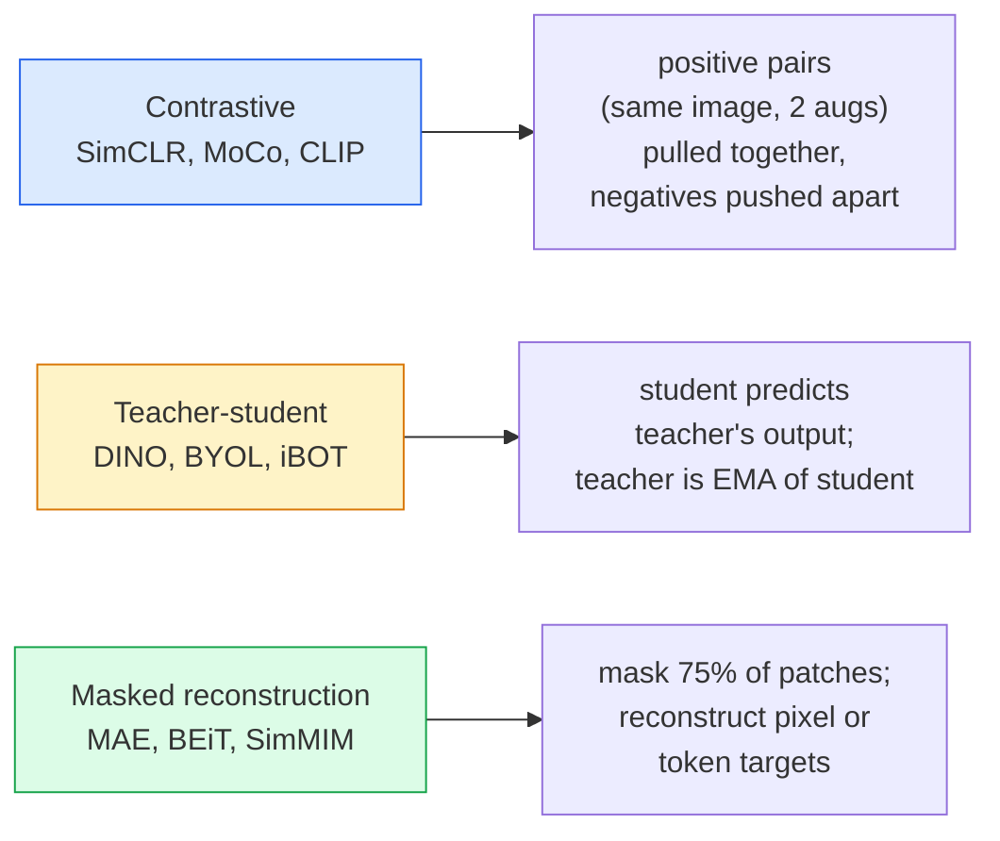

# Vue autonome  SimCLR, DINO, MAE

> Les étiquettes sont des boîtes de vision supervisée. Les pré-entraînements auto-supervisés sont supprimés: de 100M 张无标记图像中学习视觉特征, encore une fois dans 10k 张有标记图像上细调.

**类型：**apprendre + construire
**语言：**Python
**先修要求：**La phase 4 Leçon 04(Classification des images),La phase 4 Leçon 14(ViT)
**时间：**À environ 75 minutes.

## Objectif de l'apprentissage

- 理三大 家庭  contraste  SimCLR) 、enseignant-élève  DINO) 、 reconstruction masquée  MAE)  并说明每种在优化什么
- De la réalisation de la perte d'InfoNCE,并 expliquer pourquoi la taille du lot est de 512 pouvant être effectuée, tandis que la taille du lot est de 32
- Expliquer pourquoi le taux de masquage de 75% de MAE n'est pas déterminé, ainsi que les différences entre celui-ci et celui de 15% du texte BERT
- Utilisation des points de contrôle DINOv2 ou MAE ImageNet  pour effectuer une sonde linéaire et une récupération à tir zéro

##  problématique

Surveillé ImageNet, il y a 1,3 M de 张 avec des images marquées, selon les estimations, le coût de marquage est de 10 M$. Médical et industriel données collections plus petites, le coût de marquage aussi plus élevé. Chaque vision  équipe tous se demandent: pouvons-nous d'abord pré-trainer sur des données non marquées bon marché  YouTube     web crawls  webcam footage  par satellite  puis à petite échelle il y a des marquages collections à la fine-tune ?

L'apprentissage autonome est la réponse. Une ViT moderne autonome supervisée dans la formation de LAION ou JFT, dans la mise à jour fine 后可以达到或超过监督的ImageNet 准确率── elle est également comparable à la pré-entraînement supervisé 更好地迁移到下游任务 (détection, segmentation, profondeur)──DINOv2 (Meta,2023) et MAE (Meta,2022) ⋅ est une sélection par défaut de production de caractéristiques visuelles actuellement utilisées pour la délocalisation.

La transformation conceptuelle est: tâche de prétestation  模型 est entraîné à accomplir des tâches  Ne doit pas être une tâche en aval. Le principal est de savoir si elle impose l'apprentissage des caractéristiques utiles du modèle.

## 概念

### Trois familles



### Apprentissage contrasté

取一张图像,应用两次随机增强,获得两次视图――将二者送进同一个编码加投影头――最小化一个损失,含义是 两种嵌入式 应该接近,并且 这个嵌入式 应该远离批量中的所有其他图像的嵌入式──

```
Loss for positive pair (z_i, z_j) among 2N views per batch:

   L_ij = -log( exp(sim(z_i, z_j) / tau) / sum_k in batch \ {i} exp(sim(z_i, z_k) / tau) )

sim = cosine similarity
tau = temperature (0.1 standard)
```

C'est la perte d'InfoNCE. Il faut que chaque partie soit positive, il y a beaucoup de négatifs, donc la taille du lot est importante. SimCLR a besoin de 512-8192.

### Professeur-étudiant (DINO)

两个 architectures similaires:étudiant et enseignant;. enseignant est l'étudiant 权重的指数动平均(EMA)。二者都看到同一图像的增强视图──学生的输出被训练为匹配的教师的输出 没有明显的负面──

```
loss = CE( student_output(view_1),  teacher_output(view_2) )
     + CE( student_output(view_2),  teacher_output(view_1) )

teacher_weights = m * teacher_weights + (1 - m) * student_weights   (m ≈ 0.996)
```

Pourquoi ne s'effondre pas 成预测一个常量:l'enseignement des enseignants est centré sur la concentration des émissions (en diminuant la valeur moyenne de chaque dimension) et n'est pas affiné (en diminuant la température)

DINO est la base de la dimensionnement de DINOv2, DINOv2 en 142M 张 images curatées 上训练──

### Reconstruction masquée (MAE)

Masque un ViT  75% des patchs de l'entrée  seulement 25%  envoi en encodeur  un petit décodeur  receveur d'encodeur  sortie ainsi que les jetons de masque des positions masquées, et est entraîné à reconstruire les pixels des patchs masqués

```
Encoder:  visible 25% of patches -> features
Decoder:  features + mask tokens at masked positions -> reconstructed pixels
Loss:     MSE between reconstructed and original pixels on masked patches only
```

让 MAE 有效的关键设计选择:

- **75% mask ratio** 很高──迫使编码学习语义特征; reconstruire 25% 会接近微不足道(相邻像素的相关性太强,以至于CNN都能轻松完成)。
- **Asymmetric encoder/decoder** Grand type de codeur ViT voir seulement des patchs; petit décodeur(8 couches,512-dim) traitement de reconstruction。比朴素 BEiT pré-entraînement 快3 倍。
- **Pixel-space reconstruction target** Le but symbolisé de BEIT est plus simple, et l'effet est meilleur en ViT.

Après l'entraînement, j'ai abandonné le décodeur.

### Pourquoi 75% et non 15% ?

Les données de la marque de la marque de la marque de la marque de la marque de la marque de la marque de la marque de la marque de la marque de la marque de la marque de la marque de la marque de la marque de la marque de la marque de la marque de la marque de la marque de la marque de la marque de la marque de la marque de la marque de la marque de la marque de la marque de la marque de la marque de la marque de la marque de la marque de la marque de la marque de la marque de la marque de la marque de la marque de la marque de la marque de la marque de la marque de la marque de la marque de la marque de la marque de la marque de la marque de la marque de la marque de la marque de la marque de la marque de la marque de la marque de la marque de la marque de la marque de la marque de la marque de la marque de la marque de la marque de la marque de la marque de la marque de la marque de la marque de la marque de la marque de la marque de la marque de la marque de la marque de la marque de la marque de la marque de la marque de la marque de la marque de la marque de la marque de la marque de la marque de la marque de la marque de la marque de la marque de la marque de la marque de la marque de la marque de la marque de la marque de la marque de la marque de la marque de la marque de la marque de la marque de la marque de la marque de la marque de la marque de la marque de la marque de la marque de la marque de la marque de la marque de la marque de la marque de la marque de la marque de la marque de la marque de la marque de la marque de la marque de la marque de la marque de la marque de la marque de la marque de la marque de la marque

- Le langage naturel de chaque jeton 很高──预测 15% des jetons 仍然很难,因为每个面膜位置都有许多可信的完成──
- Les images de patch  très faible  Un voisinage de patch non masqué peut généralement décider avec précision des pixels de patch masqué── pour que la prédiction nécessite une compréhension linguistique, il faut activer le masque──

75% suffisamment élevé, pour rendre l'extraction de l'espace simple impossible à résoudre; l'encodeur doit afficher le contenu de l'image.

### Évaluation par sonde linéaire

Après l'auto-supervision de la pré-entraînement, l'évaluation standard est**linear probe**:结 encodeur, sur lequel basé les étiquettes ImageNet 训练一个单层线性分类器──报告 top-1 précision──

- SimCLR ResNet-50: environ 71%(2020)
- DINO ViT-S/16: environ 77%
- MAE ViT-L/16: environ 76%
- DINOv2 ViT-g/14: environ 86%

La sonde linéaire est une mesure pure de la qualité des caractéristiques; l'ajustement fin augmente généralement de 2 à 5 points, mais entraîne également l'effet de la réentraînement de la tête.


```figure
data-augmentation
```

## - Je le construis.

### 步骤 1: Pipeline d'augmentation à deux vues

```python
import torch
import torchvision.transforms as T

two_view_train = lambda: T.Compose([
    T.RandomResizedCrop(96, scale=(0.2, 1.0)),
    T.RandomHorizontalFlip(),
    T.ColorJitter(0.4, 0.4, 0.4, 0.1),
    T.RandomGrayscale(p=0.2),
    T.ToTensor(),
])


class TwoViewDataset(torch.utils.data.Dataset):
    def __init__(self, base):
        self.base = base
        self.aug = two_view_train()

    def __len__(self):
        return len(self.base)

    def __getitem__(self, i):
        img, _ = self.base[i]
        v1 = self.aug(img)
        v2 = self.aug(img)
        return v1, v2
```

Chaque .__getitem__Retournez à deux vues augmentées de la même image; pas besoin d'étiquettes。

### 步骤 2: Perte d'informations

```python
import torch.nn.functional as F

def info_nce(z1, z2, tau=0.1):
    """
    z1, z2: (N, D) L2-normalised embeddings of paired views
    """
    N, D = z1.shape
    z = torch.cat([z1, z2], dim=0)  # (2N, D)
    sim = z @ z.T / tau              # (2N, 2N)

    mask = torch.eye(2 * N, dtype=torch.bool, device=z.device)
    sim = sim.masked_fill(mask, float("-inf"))

    targets = torch.cat([torch.arange(N, 2 * N), torch.arange(0, N)]).to(z.device)
    return F.cross_entropy(sim, targets)
```

调用前先对 Embedding  effectuer la normalisation de l2`tau=0.1`C'est la valeur par défaut de SimCLR; la valeur inférieure fera perdre plus de points, et elle aura besoin de plus de négatifs.

### 步骤 3: Vérifie l'hygiène de l'eau

```python
z1 = F.normalize(torch.randn(16, 32), dim=-1)
z2 = z1.clone()
loss_same = info_nce(z1, z2, tau=0.1).item()
z2_random = F.normalize(torch.randn(16, 32), dim=-1)
loss_random = info_nce(z1, z2_random, tau=0.1).item()
print(f"InfoNCE with identical pairs:  {loss_same:.3f}")
print(f"InfoNCE with random pairs:     {loss_random:.3f}")
```

Les paires de même type  devraient obtenir une perte plus faible( dans le lot et à basse température, sous la pression de 0)。 les paires de même type  devraient obtenir un log(2N-1) = ~log(31) = ~3.4, pour les paires de 16 par lots。

### 步骤 4: Masquage à la mode MAE

```python
def random_mask_indices(num_patches, mask_ratio=0.75, seed=0):
    g = torch.Generator().manual_seed(seed)
    n_keep = int(num_patches * (1 - mask_ratio))
    perm = torch.randperm(num_patches, generator=g)
    visible = perm[:n_keep]
    masked = perm[n_keep:]
    return visible.sort().values, masked.sort().values


num_patches = 196
visible, masked = random_mask_indices(num_patches, mask_ratio=0.75)
print(f"visible: {len(visible)} / {num_patches}")
print(f"masked:  {len(masked)} / {num_patches}")
```

简单、快速, et pour une semence déterminée est déterministe.

## Utilisez-le

DINOv2 est le standard de production de 2026:

```python
import torch
from transformers import AutoImageProcessor, AutoModel

processor = AutoImageProcessor.from_pretrained("facebook/dinov2-base")
model = AutoModel.from_pretrained("facebook/dinov2-base")
model.eval()

# Per-image embeddings for zero-shot retrieval
with torch.no_grad():
    inputs = processor(images=[pil_image], return_tensors="pt")
    outputs = model(**inputs)
    embedding = outputs.last_hidden_state[:, 0]  # CLS token
```

Le 768-dim Embedding est une méthode moderne de récupération d'images, de correspondance dense et de transfert de céréales à tir zéro.

 pour les emplacements de texte d'image, SigLIP ou OpenCLIP  pour les solutions de traitement; pour les ajustements fin de style MAE,`timm`Le repo a fourni tous les points de contrôle de l'AEM.

## Je le livre.

Le cours est ouvert à:

- `outputs/prompt-ssl-pretraining-picker.md` Une requête, selon la taille du jeu de données, calculer et effectuer une tâche en aval selectionner SimCLR / MAE / DINOv2。
- `outputs/skill-linear-probe-runner.md` Une compétence, pour un encodeur gelé + un ensemble de données étiqueté 编写线性探测评估──

## 练习

1. **（Easy）**验证: Pour les emplacements bien conformes, une température réduite entraînera une perte d'InfoNCE, une perte de la température réduite entraînera une perte de la température.`tau in [0.05, 0.1, 0.2, 0.5]`Les résultats de l'enquête
2. **（Medium）**实现 un tampon de centre de style DINO  展示                                                                                                                                                                                                                                                        
3. **（Hard）**Utilisation de la petite unité de l'étude 10 en tant que colonne vertébrale, dans le CIFAR-100 en train MAE。 rapport 10、50 et 200 époques ⋅ précision de la sonde linéaire.

## 关键术语

| Term | 人们的说法 | 实际含义 |
|------|----------------|----------------------|
| Self-supervised | “Label-free” | 一种 pretext task，用于从无标注数据中产生有用 representations |
| Pretext task | “假任务” | SSL 期间使用的 objective（reconstruct patches、match views）；pretraining 后会被丢弃 |
| Linear probe | “Frozen encoder + linear head” | 标准 SSL 评估：只在 frozen features 之上训练一个 linear classifier |
| InfoNCE | “Contrastive loss” | 对 cosine similarities 做 softmax；positive pair 是目标类别，所有其他项都是 negatives |
| EMA teacher | “Moving-average teacher” | 权重是 student 的 exponential moving average 的 teacher；BYOL、MoCo、DINO 使用它 |
| Mask ratio | “隐藏的 patches 百分比” | MAE 期间被 mask 的 patches 比例；vision 为 75%，text 为 15% |
| Representation collapse | “Constant output” | SSL 失败模式：encoder 对所有输入输出一个常量 Vector；通过 centring、sharpening 或 negatives 防止 |
| DINOv2 | “生产级 SSL backbone” | Meta 2023 年的 self-supervised ViT；2026 年最强的通用 image features |

## 延伸阅读

- [SimCLR (Chen et al., 2020)](https://arxiv.org/abs/2002.05709) apprentissage contrasté 参考
- [DINO (Caron et al., 2021)](https://arxiv.org/abs/2104.14294) 带动·centring·sharpening of teacher-student
- [MAE (He et al., 2022)](https://arxiv.org/abs/2111.06377) 面向 ViT' s masqué autocodeur pré-entraînement
- [DINOv2 (Oquab et al., 2023)](https://arxiv.org/abs/2304.07193) L' autonomie de la VT  étendre à la qualité de production
