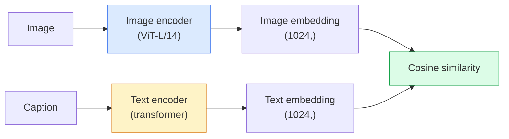

# Vision de vocabulaire ouvert  CLIP

> C'est la technique de la mise en place d'un codeur d'image et d'un codeur de texte.

**Type:** Build + Use
**Languages:** Python
**Prerequisites:** Phase 4 Lesson 14 (ViT), Phase 4 Lesson 17 (Self-Supervised)
**Time:** ~45 分钟

## Objectif de l'apprentissage

-  Explication de l'architecture à deux tours du CLIP et de l'objectif de formation contrasté
- Utiliser un CLIP prétrainé (ou SigLIP) pour effectuer une classification à zéro tir, sans avoir besoin de formation spécifique à une tâche
- De la réalisation de la classification à tir zéro: les demandes de classe de code, calcul de la similitude cosine,
- 区分 CLIP、SigLIP、OpenCLIP 和 LLaVA/LLaMA-vision modèles ils sont chacun utilisés en 2026

##  problématique

Les classifiants traditionnels sont un vocabulaire fermé: un modèle ImageNet de 1000 classes, il suffit de prévoir 1000 étiquettes. Chaque nouvelle catégorie a besoin de données étiquetées et de nouvelles techniques.

CLIP(Radford et al., OpenAI 2021) indiquent que, dans 400 millions de paires de photos et de sous-titres tirées du web, on peut obtenir un modèle qui peut être déduit de toutes les catégories de collections, mais ces catégories doivent être décrites en langage naturel.

Cette capacité de transfert à zéro coup 就是 chaque système de vision moderne  都从CLIP-family checkpoint 开始的原因──Detection Grunding DINO、OWL-ViT) Segmentation CLIPSeg、SAM) ‧Récupération、modération de contenu、VLMs 和 text-to-image generation  都建立在CLIP-style joint embeddings 之上──

## 概念

### Deux tours



两个 encoders 最后都会通过线性投影 投影到相同的嵌入维度 ((CLIP-B/32 为 512,CLIP-L/14 为 1024) ⋅ effectuer L2-normalization 并计算共弦相似性──

###  objectif

给定一个包含 N 个 (image, sous-titre) paires de lot, construire une matrice de similitude NxN。 entraîner deux encoders, rendre diagonale(pares correspondantes) avec une grande similitude, tandis que hors-diagonales(non correspondant) avec une faible similitude。

```
sim_matrix = image_embeddings @ text_embeddings.T / tau

loss_i2t = cross_entropy(sim_matrix,       targets=arange(N))
loss_t2i = cross_entropy(sim_matrix.T,     targets=arange(N))
loss = (loss_i2t + loss_t2i) / 2
```

C'est symétrique, car la récupération d'image à texte et de texte à image devraient être possibles.`tau`(température) habituellement comme paramètre scalaire, la mise en place est de 0,07

### Une perte plus grande .

SigLIP(Zhai et al., 2023) avec sigmoïde par paire substitua softmax:

```
loss = mean over pairs of log(1 + exp(-y_ij * sim_ij))
y_ij = +1 if matching, -1 otherwise
```

Per-pair Loss 移除 CLIP requis normalisation au niveau du lot。SigLIP dans les petites batches.

### Classification à tir zéro

Donne-moi un bon CLIP pour l'entraînement.

1. Pour chaque classe, 组合一个提示:"une photo d'une {class}"
2. Utiliser un codeur de texte pour encoder toutes les demandes de classe -> `T`forme (C, d)
3. Image de test de codage -> `I`forme (1, d)
4. La similitude = `I @ T.T`forme (1, C)
5. Argmax -> classe prévue。

L'ingénierie rapide est très importante. OpenAI pour ImageNet a publié 80 modèles de prompt. Une photo d'une {}. Une photo floue d'une {}. Une esquisse d'une {}.

### 2026 année de modèle CLIP

- **Zero-shot classification**直接使用。
- **Image retrieval** Encore une fois de code toutes les images, en inférence 时 embed query。
- **Text-conditioned detection**Grounding DINO、OWL-ViT va cliper la tour de texte 包装在探测器 周围──
- **Text-conditioned segmentation**CLIPSeg;SAM 通过 CLIP 使用 text-prompt inputs。
- **VLMs**L'internaute va intégrer le codeur de vision CLIP-famille à l'LLM.
- **Text-to-image gen**Difusion stable DALL-E 3 以 CLIP text embedments 为条件──

Une fois que vous avez un espace de mise en place partagé, chaque tâche de vision + langage devient une tâche de distance calculée.


```figure
clip-contrastive
```

## - Je le construis.

### 步骤 1: un modèle à deux tours très petit

Le véritable CLIP est un transformateur ViT +. Dans ce cours, les tours sont basées sur des petites MLP de fonctionnalités de pré-alimentation, de sorte que le signal de formation peut également être vu sur le CPU.

```python
import torch
import torch.nn as nn
import torch.nn.functional as F


class TwoTower(nn.Module):
    def __init__(self, img_in=128, txt_in=64, emb=64):
        super().__init__()
        self.image_proj = nn.Sequential(nn.Linear(img_in, 128), nn.ReLU(), nn.Linear(128, emb))
        self.text_proj = nn.Sequential(nn.Linear(txt_in, 128), nn.ReLU(), nn.Linear(128, emb))
        self.logit_scale = nn.Parameter(torch.ones([]) * 2.6592)  # ln(1/0.07)

    def forward(self, img_feats, txt_feats):
        i = F.normalize(self.image_proj(img_feats), dim=-1)
        t = F.normalize(self.text_proj(txt_feats), dim=-1)
        return i, t, self.logit_scale.exp()
```

两个 projections partagé-dim outputapprend la température

### 步骤 2: Perte de contrepartie

```python
def clip_loss(image_emb, text_emb, logit_scale):
    N = image_emb.size(0)
    sim = logit_scale * image_emb @ text_emb.T
    targets = torch.arange(N, device=sim.device)
    l_i = F.cross_entropy(sim, targets)
    l_t = F.cross_entropy(sim.T, targets)
    return (l_i + l_t) / 2
```

Symétrique, plus haute échelle de logite = plus haute douceur max = plus confiante, mais avec un risque instable.

### 步骤 3: Classificateur à tir zéro

```python
@torch.no_grad()
def zero_shot_classify(model, image_feats, class_text_feats, class_names):
    """
    image_feats:      (N, img_in)
    class_text_feats: (C, txt_in)   one averaged embedding per class
    """
    i = F.normalize(model.image_proj(image_feats), dim=-1)
    t = F.normalize(model.text_proj(class_text_feats), dim=-1)
    sim = i @ t.T
    pred = sim.argmax(dim=-1)
    return [class_names[p] for p in pred.tolist()]
```

C'est la procédure de tir zéro précise utilisée dans le point de contrôle CLIP de production.

### 步骤 4: Vérifie l'hygiène

```python
torch.manual_seed(0)
model = TwoTower()

img = torch.randn(8, 128)
txt = torch.randn(8, 64)
i, t, scale = model(img, txt)
loss = clip_loss(i, t, scale)
print(f"batch size: {i.size(0)}   loss: {loss.item():.3f}")
```

Pour le modèle de démarrage, la perte devrait approcher.`log(N) = log(8) = 2.08` c'est encore un objectif de l'entropie croisée symétrique de la structure 

## Utilisez-le

OpenCLIP est une option communautaire de 2026:

```python
import open_clip
import torch
from PIL import Image

model, _, preprocess = open_clip.create_model_and_transforms("ViT-B-32", pretrained="laion2b_s34b_b79k")
tokenizer = open_clip.get_tokenizer("ViT-B-32")

image = preprocess(Image.open("dog.jpg")).unsqueeze(0)
text = tokenizer(["a photo of a dog", "a photo of a cat", "a photo of a car"])

with torch.no_grad():
    image_features = model.encode_image(image)
    text_features = model.encode_text(text)
    image_features = image_features / image_features.norm(dim=-1, keepdim=True)
    text_features = text_features / text_features.norm(dim=-1, keepdim=True)
    probs = (100.0 * image_features @ text_features.T).softmax(dim=-1)

print(probs)
```

SigLIP 更新, en petite échelle entraînement mieux, et plus adapté à de nouveaux travaux:`google/siglip-base-patch16-224`✿ Face en éclats ✿

## Je le livre.

Le cours est ouvert à:

- `outputs/prompt-zero-shot-class-picker.md` Un prompt, utilisé dans des classes données 列表和域 时, pour des modèles de classe de conception CLIP à tir zéro ⋅
- `outputs/skill-image-text-retriever.md` Une compétence, avec n'importe quel point de contrôle CLIP  Construire un index d'intégration d'image, soutenir la requête par texte 和 la requête par image。

## 练习

1. **（Easy）**Utilisez un OpenCLIP ViT-B/32 prétrainé et utilisez un ensemble de prompts de modèle 80 CIFAR-10 上 faire une classification à tir zéro.
2. **（Medium）**Dans la même tâche CIFAR-10, comparez "une photo d'un {}") avec des emblèmes moyens de 80 modèles.
3. **（Hard）**Construire un index de récupération d'images à tirage zéro: avec CLIP, embellez 1000 张 d'images, construisez un index FAISS, utilisez la description de la langue naturelle pour effectuer une requête.

## 关键术语

| Term | 人们怎么说 | 它实际意味着什么 |
|------|----------------|----------------------|
| Two-tower | "Dual encoder" | 独立的 image 和 text encoders，末端是 shared-dim projection head |
| Zero-shot | "No task-specific training" | 在 inference 时分类到仅由文本描述的 classes；不接触 labels |
| Temperature / logit_scale | "tau" | 在 softmax 前缩放 similarity matrix 的 learned scalar |
| Prompt template | "A photo of a {}" | 包裹 class names 的自然语言包装器；平均多个 templates 会提升 zero-shot accuracy |
| CLIP | "Image+text model" | 2021 年的 OpenAI model；2026 年该领域的通用语汇 |
| SigLIP | "Sigmoid CLIP" | 将 softmax 替换为 per-pair sigmoid；在小 batch 下训练更好 |
| OpenCLIP | "Open reproduction" | 社区在 LAION 上训练的 CLIP variants；open-source pipelines 的 production default |
| VLM | "Vision-language model" | CLIP-family encoder 加上 LLM，训练用来回答关于 images 的问题 |

## 延伸阅读

- [CLIP：从自然语言监督中学习可迁移视觉模型（Radford et al., 2021）](https://arxiv.org/abs/2103.00020)
- [SigLIP：用于 Language-Image Pre-Training 的 Sigmoid Loss（Zhai et al., 2023）](https://arxiv.org/abs/2303.15343)
- [OpenCLIP](https://github.com/mlfoundations/open_clip) base de code communautaire
- [DINOv2 vs CLIP vs MAE：features comparison](https://huggingface.co/blog/dinov2)包含并排 cas d'utilisation du guide de la FH
