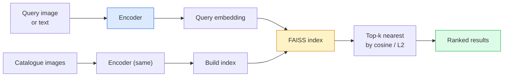

# Récupération d'image et apprentissage métrique

> Le système de récupération sera selon l'espace de mise en place de la distance entre les séries de candidats. L'apprentissage métrique est une discipline qui forme cet espace, permettant à la distance d'exprimer le sens que vous voulez.

**Type:** Build
**Languages:** Python
**Prerequisites:** Phase 4 Lesson 14 (ViT), Phase 4 Lesson 18 (CLIP)
**Time:** ~45 minutes

## Objectif de l'apprentissage
-  explication de la perte d'apprentissage de la métrique à trois niveaux, à la différence et à la base de proxy,并为给定数据集选择合适的方法
- L'analyse de la différence entre la normalisation de L2 et la comparaison cosine, et l'audit de "même élément" et la récupération de "même classe"
- Construire un index FAISS, en utilisant du texte et des images pour le consulter,并为持久查询集 报告 recall@K
- Pour les autres, il faut les mettre en place.

##  problématique
Retrieval dans le système de production de visualisation:déclaration de duplication, recherche d'images réversibles, recherche visuelle, "trouver des produits similaires"), réidentification de visage, réidentification de personne utilisée pour le contrôle, correspondance au niveau de l'exemple du commerce électronique, etc.

L'embedding, c'est par quoi le modèle génère le vecteur. L'index, c'est comment trouver le voisinage le plus proche dans le scénario de dimensionnement. D'ici 2026, les deux sont déjà commercialisés.

Cette forme est l'apprentissage métrique.

## 概念
### Récupération à un coup d'œil



### Les quatre familles de perdants

| Loss | Requires | Pros | Cons |
|------|----------|------|------|
| **Contrastive** | (anchor, positive) + negatives | 简单，可用于任何 pair label | 没有大量 negatives 时收敛较慢 |
| **Triplet** | (anchor, positive, negative) | 直观；可直接控制 margin | Hard-triplet mining 成本高 |
| **NT-Xent / InfoNCE** | Pairs + batch-mined negatives | 可扩展到大 batch | 需要大 batch 或 momentum queue |
| **Proxy-based (ProxyNCA)** | 仅 class labels | 快速、稳定、无需 mining | 在小数据集上可能 overfit 到 proxies |

Pour la plupart des cas de production, commencez par la colonne vertébrale prétrainée; seulement lorsque les emblèmes hors de l'étagère ne sont pas performants sur votre ensemble de tests, rejoignez la mise à jour de l'apprentissage métrique.

### Perte de triplets officiellement

```
L = max(0, ||f(a) - f(p)||^2 - ||f(a) - f(n)||^2 + margin)
```

- Je vais vous dire .`a`拉近 positif `p`, le faire sortir négatif `n`,并使用 `margin`确保间隔──三图结构可以泛化到任何相似度排序──

Mining 很重要: facile triplets`n`- Je suis parti .`a`很远) Contribution零 Perte; seulement des triplés dures 才能教会模型──Minière semi-dur`n`- Je ne sais pas .`p`Plus loin mais encore en marge, il s'agit de la stratégie de FaceNet de 2016 et il est toujours le principal.

### Similation de cosine par rapport à L2

Il y a deux types de mesures:

- **Cosine**:Véctor 之间的角── nécessite des embellissements normalisés L2-
- **L2**:Distance euclidienne: utilisable en matière première ou en intégration normalisée, mais habituellement avec L2 normalisé + L2 à carré

Pour la plupart des réseaux modernes, les deux sont équivalents:`||a|| = ||b|| = 1`时,`||a - b||^2 = 2 - 2 cos(a, b)`◊选择与你的嵌入 训练一致的约定;混用会改变 "proche" 的含义──

### Rappel@K

标准 métrique de récupération:

```
recall@K = fraction of queries where at least one correct match is in the top K results
```

Il est possible de modifier le format de l'espace de référence en utilisant les paramètres de l'espace de référence.

Pour la détection de duplicates, la précision@K est plus importante, car chaque faux positif sont des erreurs visibles par l'utilisateur.

### FAISS dans un seul paragraphe

Facebook AI Similarity Search──factsstandard的近邻搜索 库──三种索引 选择:

- `IndexFlatIP`- Je suis là .`IndexFlatL2` force brute 精确 无需训练──可用到约1Mvecteurs──
- `IndexIVFFlat` 划分为K个细胞, seulement rechercher les quelques cellules les plus proches 近似、快速、需要训练数据──
- `IndexHNSW` sur la base de graphiques, à la plupart des demandes, la taille de l'indice est plus grande

Pour 100K vecteurs, vous pouvez penser en similitude cosine 上使用 `IndexFlatIP`Pour 10 M, utilisation`IndexIVFFlat`◊ Pour 100M+,结合 la quantification du produit`IndexIVFPQ`)。

### Récupération au niveau de l'instance par rapport au niveau de la catégorie

Deux problèmes identiques mais très différents:

- **Category-level** " Dans mon catalogue, je cherche des chats ": " Classe-condition similaire; hors étagère CLIP / DINOv2 Embeddings 效果很好──
- **Instance-level** " Dans mon catalogue, trouver* ce produit*── " 需要在同一类内视觉相似对象之间做细粒度区分; Off-the-shelf Embeddings

Avant de choisir un modèle, demandez-vous toujours lequel de ces modèles vous avez résolu.


```figure
metric-embedding
```

## - Je le construis.
### 步骤 1: Perte de triple

```python
import torch
import torch.nn.functional as F

def triplet_loss(anchor, positive, negative, margin=0.2):
    d_ap = F.pairwise_distance(anchor, positive, p=2)
    d_an = F.pairwise_distance(anchor, negative, p=2)
    return F.relu(d_ap - d_an + margin).mean()
```

Il est applicable à des embellissements L2 normalisés ou crus.

### 步骤 2: Mining semi-difficile

给定一批嵌和标签, pour chaque ancre 找到最难的半硬负面──

```python
def semi_hard_negatives(emb, labels, margin=0.2):
    dist = torch.cdist(emb, emb)
    same_class = labels[:, None] == labels[None, :]
    diff_class = ~same_class
    N = emb.size(0)

    positives = dist.clone()
    positives[~same_class] = float("-inf")
    positives.fill_diagonal_(float("-inf"))
    pos_idx = positives.argmax(dim=1)

    semi_hard = dist.clone()
    semi_hard[same_class] = float("inf")
    d_ap = dist[torch.arange(N), pos_idx].unsqueeze(1)
    semi_hard[dist <= d_ap] = float("inf")
    neg_idx = semi_hard.argmin(dim=1)

    fallback_mask = semi_hard[torch.arange(N), neg_idx] == float("inf")
    if fallback_mask.any():
        hardest = dist.clone()
        hardest[same_class] = float("inf")
        neg_idx = torch.where(fallback_mask, hardest.argmin(dim=1), neg_idx)
    return pos_idx, neg_idx
```

Chaque ancre obtient le plus difficile de la classe, ainsi qu'un négatif semi-dur, plus loin que positif, mais en marge.

### 步骤 3: Rappel

```python
def recall_at_k(query_emb, gallery_emb, query_labels, gallery_labels, k=1):
    sim = query_emb @ gallery_emb.T
    _, top_k = sim.topk(k, dim=-1)
    matches = (gallery_labels[top_k] == query_labels[:, None]).any(dim=-1)
    return matches.float().mean().item()
```

En L2 normalisés Embeddings 上按内产量 取 top-k, égal à 取 cosine 取 top-k.

### 步骤 4: Le mettre en place

```python
import torch
import torch.nn as nn
from torch.optim import Adam

class Encoder(nn.Module):
    def __init__(self, in_dim=128, emb_dim=64):
        super().__init__()
        self.net = nn.Sequential(
            nn.Linear(in_dim, 128), nn.ReLU(),
            nn.Linear(128, emb_dim),
        )

    def forward(self, x):
        return F.normalize(self.net(x), dim=-1)

torch.manual_seed(0)
num_classes = 6
protos = F.normalize(torch.randn(num_classes, 128), dim=-1)

def sample_batch(bs=32):
    labels = torch.randint(0, num_classes, (bs,))
    x = protos[labels] + 0.15 * torch.randn(bs, 128)
    return x, labels

enc = Encoder()
opt = Adam(enc.parameters(), lr=3e-3)

for step in range(200):
    x, y = sample_batch(32)
    emb = enc(x)
    pos_idx, neg_idx = semi_hard_negatives(emb, y)
    loss = triplet_loss(emb, emb[pos_idx], emb[neg_idx])
    opt.zero_grad(); loss.backward(); opt.step()
```

Après quelques centaines de étapes, les clusters d'embedding formeront chaque classe en un cluster.

## Utilisez-le
Production de 2026:

- **DINOv2 + FAISS** 通用 récupération visuelle──可 hors de l'étagère
- **CLIP + FAISS** Lorsque la requête est en cours de lecture.
- **Fine-tuned DINOv2 + FAISS** Retrieval à niveau d'instance, ré-identification de visage, mode, commerce électronique.
- **Milvus / Weaviate / Qdrant**  Environnements d'emballages DB de vecteurs gérés de FAISS ou HNSW。

Pour la récupération d'instance SOTA, la méthode est:DINOv2 spine, ajouter tête d'embedding, en paires étiquetées par instance 上用 triplet或 InfoNCE Loss fine-tune, et créer un index dans FAISS。

## Je le livre.
Le programme de formation

- `outputs/prompt-retrieval-loss-picker.md` Une requête, utilisée pour la récupération déterminée  problématique de sélection triplete / InfoNCE / ProxyNCA。
- `outputs/skill-recall-at-k-runner.md` Une compétence, pour écrire un harnais d'évaluation de rappel net, contenant des fractions de train/val/galerie et des données correctes.

## 练习
1. **(Easy)**运行上述玩具例──使用PCA 绘制训练前后的嵌入,观察六个集群 如何形成──
2. **(Medium)**添加 ProxyNCA Loss 实现: chaque classe un "proxy" appris, dans la similitude cosine 上做标准 cross-entropy── comparer avec la perte de triplet dans les données de jouets 上的收速度──
3. **(Hard)**取 1,000 张 ImageNet validation images, via HuggingFace avec DINOv2 生成 Embeddings, construire FAISS indice plat,并报告以同一批图像为查询 时的回忆@{1, 5, 10}(应为 1.0),以及以持久的分和 ImageNet 作为 ground truth 时的结果──

## 关键术语
| Term | What people say | What it actually means |
|------|----------------|----------------------|
| Metric learning | "Shape the space" | 训练一个 encoder，使其输出空间中的距离反映目标相似度 |
| Triplet loss | "Pull and push" | L = max(0, d(a, p) - d(a, n) + margin)；经典的 metric-learning Loss |
| Semi-hard mining | "Useful negatives" | 比 positive 更远但仍在 margin 内的 negatives；经验上信息量最大 |
| Proxy-based loss | "Class prototypes" | 每个 class 一个 learned proxy；对 similarity-to-proxies 做 cross-entropy；无需 pair mining |
| Recall@K | "Top-K hit rate" | top K 中至少有一个正确结果的查询比例 |
| Instance retrieval | "Find this exact thing" | 细粒度匹配；off-the-shelf features 通常表现不足 |
| FAISS | "The NN library" | Facebook 的 nearest-neighbour 库；支持精确和近似 indexes |
| HNSW | "Graph index" | Hierarchical navigable small world；内存开销小的快速近似 NN |

## 延伸阅读
- [FaceNet: A Unified Embedding for Face Recognition (Schroff et al., 2015)](https://arxiv.org/abs/1503.03832) Perte de triplets / minière semi-difficile 论文
- [In Defense of the Triplet Loss for Person Re-Identification (Hermans et al., 2017)](https://arxiv.org/abs/1703.07737) réglage de la triple fine 实践指南
- [FAISS documentation](https://github.com/facebookresearch/faiss/wiki) Chaque indice, chaque compromis
- [SMoT: Metric Learning Taxonomy (Kim et al., 2021)](https://arxiv.org/abs/2010.06927) 现代 pertes  et ses liens
