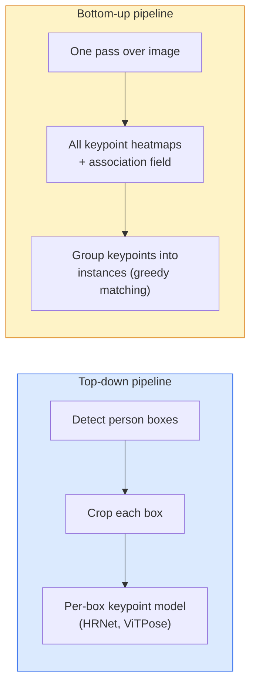

# Détection et estimation de la position des points clés

> Une pose est un groupe de points clés. Un détecteur de points clés est un régresseur de la carte thermique.

**Type:** Build
**Languages:** Python
**Prerequisites:** Phase 4 Lesson 06 (Detection), Phase 4 Lesson 07 (U-Net)
**Time:** ~45 分钟

## Objectif de l'apprentissage
- 区分 top-down et bottom-up pose estimation,并说明各自何时使用
- Utiliser les objectifs Gaussian-par-keypoint pour K 个 points clés cartes de chaleur de régression, et en déduire 时提取 les coordonnées de points clés
- 解释 Partie champs d'affinité (PAFs), ainsi que les pipelines vers le bas  comment mettre les points clés 关联成 instances
- Utilisez MediaPipe Pose ou MMPose pour faire une estimation de niveau de production de points clés, et comprendre leur format de sortie

##  problématique
Les tâches clés ont beaucoup de noms: pose humaine ((17 articulations du corps) 、marqueurs faciaux ((68 ou 478 个点) 、main ((21 个点) 、position animale、position d'objet robotisée、marqueurs d'anatomie médicale。 elles sont toutes en commun avec une même structure:

L'estimation de la pose est la capture de mouvement, les applications de fitness, l'analyse sportive, le contrôle des gestes, l'animation, l'essai AR et la prise en charge robotique.

工程问题在于尺度──单图、单人 Pose 是一个20ms 问题──人群中的多人 Pose 需要在30fps 下运行,则是一个完全不同的结构问题──

## 概念
### En bas vers le bas



- **Top-down** Pré-examen des personnes, ré-examen de chaque culture 运行 par personne modèle de point clé―;
- **Bottom-up** Un passage à l'avant 预测 tous les points clés 加一个协会场;再把它们分组── peu importe la taille de la foule 如何,耗时恒定──

Le réseau de haute résistance (HRNet, ViTPose) est le premier programme; le réseau de haute résistance (OpenPose, HigherHRNet) est le premier programme au milieu des scènes bondées.

### Régression de la carte thermique

Ne pas régresser directement`(x, y)`, mais pour chaque point clé  prédiction un `H x W`Carte thermique, au centre de la vraie position, il y a une tache gaussienne.

```
target[k, y, x] = exp(-((x - cx_k)^2 + (y - cy_k)^2) / (2 sigma^2))
```

En inférence, l'argmax de chaque carte thermique est la localisation du point clé de prédiction.

Pourquoi les cartes thermiques sont-elles plus efficaces que la régression directe ?

### Localisation sous-pixel

Argmax  donne un nombre intégral                                                                                                                                                                                                                                                                                                                                                                                                                                                                                                                      `(dx, dy) = 0.25 * (heatmap[y, x+1] - heatmap[y, x-1], ...)`La direction

### Les champs d'affinité de partie (PAF)

OpenPose utilise des techniques d'association de bas en haut pour chaque couple de points clés connectés (par exemple, épaule gauche à coude gauche), prévoir un champ à 2 canaux, coder un vecteur unitaire d'un point indiquant vers un autre point.

```
For each connection (limb):
  PAF channels: 2 (unit vector x, y)
  Line integral: sum over sample points of (PAF . line_direction)
  Higher integral = stronger match
```

Cette méthode est très agréable et il n'y a pas besoin de cultures par personne pour pouvoir se développer à n'importe quelle taille de foule.

### Points clés COCO

标准的 body-pose dataset: pour chaque personne 17 个关键点, utilisant PCK (%) Procentuel de points clés corrects) et OKS (%) Object Keypoint Similarity (%) 作为指标──OKS是 IoU's keypoint analogue,也是COCO mAP@OKS 报告的指标──

### 2D contre 3D

- **2D pose** coordonnées d'image; déjà atteint la qualité de production (MediaPipe, HRNet, ViTPose) 
- **3D pose** coordonnées du monde / caméra; encore en activité.
  - Avec un petit MLP, les prédictions 2D vont passer à 3D.
  - directement de l'image faire régression 3D PyMAF, MHFormer)
  - Les configurations multi-visuelles de CMU Panoptic sont utilisées pour la vérité au sol.


```figure
cv3-pose-heatmap
```

## - Je le construis.
### 步骤 1: cible de la carte thermique gaussienne

```python
import numpy as np
import torch

def gaussian_heatmap(size, cx, cy, sigma=2.0):
    yy, xx = np.meshgrid(np.arange(size), np.arange(size), indexing="ij")
    return np.exp(-((xx - cx) ** 2 + (yy - cy) ** 2) / (2 * sigma ** 2)).astype(np.float32)

hm = gaussian_heatmap(64, 32, 32, sigma=2.0)
print(f"peak: {hm.max():.3f} at ({hm.argmax() % 64}, {hm.argmax() // 64})")
```

À l'extrémité de l'axe du canal \\\\\\\\\\\\\\\\\\\\\\\\\\\\\\\\\\\\\\\\\\\\\\\\\\\\\\\\\\\\\\\\\\\\\\\\\\\\\\\\\\\\\\\\\\\\\\\\\\\\\\\\\\\\\\\\\\\\\\\\\\\\\\\\\\\\\\\\\\\\\\\\\\\\\\\\\\\\\\\\\\\\\\\\\\\\\\\\\\\\\\\\\\\\\\\\\\\\\\\\\\\\\\\\\\\\\\\\\\\\\\\\\\\\\\\\\\\\\\\\\\\\\\\\\\\\\\\\\\\\\\\\\\\\\\\\\\\\\\\\\\\\\\\\\\\\\\\\\\\\\\\\\\\\\\\\\\\\\\\\\\\\\\\\\\\\\\\\\\\\\\\\\\\\\\\\\\\\\\\\\\\\\\\\\\\\\\\\\\\\\\\\\\\\\\\\\\\\\\\\\\\\\\\\\\\\\\\\\\\\\\\\\\\\\\\\\\\\\\\\\\\\\\\\\\\\\\\\\\\\\\\\\\\\\\\\\\\\\\\\\\\\\\\\\\\\\\

### 步骤 2: Petite tête de point de touche

Un modèle de style U-Net, en sortant K 个 chauffage des canaux.

```python
import torch.nn as nn
import torch.nn.functional as F

class TinyKeypointNet(nn.Module):
    def __init__(self, num_keypoints=4, base=16):
        super().__init__()
        self.down1 = nn.Sequential(nn.Conv2d(3, base, 3, 2, 1), nn.ReLU(inplace=True))
        self.down2 = nn.Sequential(nn.Conv2d(base, base * 2, 3, 2, 1), nn.ReLU(inplace=True))
        self.mid = nn.Sequential(nn.Conv2d(base * 2, base * 2, 3, 1, 1), nn.ReLU(inplace=True))
        self.up1 = nn.ConvTranspose2d(base * 2, base, 2, 2)
        self.up2 = nn.ConvTranspose2d(base, num_keypoints, 2, 2)

    def forward(self, x):
        h1 = self.down1(x)
        h2 = self.down2(h1)
        h3 = self.mid(h2)
        u1 = self.up1(h3)
        return self.up2(u1)
```

输入 `(N, 3, H, W)`, en sortant`(N, K, H, W)`Les pertes sont les MSE par pixel des cibles gaussiennes.

### 步骤 3: Inference  extraire les coordonnées des points clés

```python
def heatmap_to_coords(heatmaps):
    """
    heatmaps: (N, K, H, W)
    returns:  (N, K, 2) float coordinates in image pixels
    """
    N, K, H, W = heatmaps.shape
    hm = heatmaps.reshape(N, K, -1)
    idx = hm.argmax(dim=-1)
    ys = (idx // W).float()
    xs = (idx % W).float()
    return torch.stack([xs, ys], dim=-1)

coords = heatmap_to_coords(torch.randn(2, 4, 32, 32))
print(f"coords: {coords.shape}")  # (2, 4, 2)
```

Pour le raffinement des sous-pixels, la valeur de l'interférence est de

### 步骤 4: Ensemble de données synthétique de points clés

很简单: sur toile blanche 上画四个点,并学习预测它们──

```python
def make_synthetic_sample(size=64):
    img = np.ones((3, size, size), dtype=np.float32)
    rng = np.random.default_rng()
    kps = rng.integers(8, size - 8, size=(4, 2))
    for cx, cy in kps:
        img[:, cy - 2:cy + 2, cx - 2:cx + 2] = 0.0
    hms = np.stack([gaussian_heatmap(size, cx, cy) for cx, cy in kps])
    return img, hms, kps
```

Cette tâche est assez simple, petit modèle, en une minute on peut apprendre.

### 步骤 5: Formation

```python
model = TinyKeypointNet(num_keypoints=4)
opt = torch.optim.Adam(model.parameters(), lr=3e-3)

for step in range(200):
    batch = [make_synthetic_sample() for _ in range(16)]
    imgs = torch.from_numpy(np.stack([b[0] for b in batch]))
    hms = torch.from_numpy(np.stack([b[1] for b in batch]))
    pred = model(imgs)
    # Upsample pred to full resolution
    pred = F.interpolate(pred, size=hms.shape[-2:], mode="bilinear", align_corners=False)
    loss = F.mse_loss(pred, hms)
    opt.zero_grad(); loss.backward(); opt.step()
```

## Utilisez-le
- **MediaPipe Pose** Estimateur de pose de la production de Google; fournit des temps d'exécution WebGL + mobiles, retard inférieur à 10ms。
- **MMPose**(OpenMMLab)   全面的研究代码库;包含每种SOTA architecture 及预训练的权重──
- **YOLOv8-pose** La pose multi-personne en temps réel la plus rapide, en utilisant un seul passe à l'avant.
- **transformers HumanDPT / PoseAnything** Utilisation de nouvelles approches du langage de vision avec une pose de vocabulaire ouvert (à l'aide de l'ensemble des objets et des points clés)

## Je le livre.
Le programme de formation

- `outputs/prompt-pose-stack-picker.md` Un prompt, en fonction de la latence, de la taille de la foule, ainsi que 2D vs 3D 需求选择 MediaPipe / YOLOv8-pose / HRNet / ViTPose。
- `outputs/skill-heatmap-to-coords.md` Une compétence, pour écrire chaque modèle de pose de production utilisée jusqu'à la routine de coordonnées de la feuille de chaleur sous-pixel.

## 练习
1. **(Easy)**Dans un ensemble de données synthétique de 4 points, il faut apprendre à utiliser un modèle de point clé minuscule.
2. **(Medium)**添加子像素精炼:给定 argmax position,沿 x 和 y 方向使用邻近像素 拟合1D parabola。报告对整数 argmax的精度增──
3. **(Hard)**Construire un ensemble de données synthétiques de 2 personnes, dont chaque image  Montrer deux instances de modèle de 4 points clés  entraîner un pipeline vers le bas avec PAFs, prévoir quel point clé  appartient à quelle instance,并评估 OKS。

## 关键术语
| Term | 人们怎么说 | 它实际是什么意思 |
|------|----------------|----------------------|
| Keypoint | "一个 landmark" | object 上的一个特定有序点（joint、corner、feature） |
| Pose | "skeleton" | 属于一个 instance 的一组有序 keypoints |
| Top-down | "先 detect，再 pose" | Two-stage pipeline：person detector + per-crop keypoint model；准确率最高 |
| Bottom-up | "先 pose，后 group" | Single-pass all-keypoint prediction + grouping；在 crowd size 上耗时恒定 |
| Heatmap | "Gaussian target" | 每个 keypoint 一个 H x W tensor，峰值位于真实位置；首选的 Regression target |
| PAF | "Part Affinity Field" | 编码 limb directions 的 2-channel unit vector field；用于把 keypoints 分组为 instances |
| OKS | "Keypoint IoU" | Object Keypoint Similarity；COCO 的 pose metric |
| HRNet | "High-Resolution Net" | 主流 top-down keypoint architecture；全程保留 high-res features |

## 延伸阅读
- [OpenPose (Cao et al., 2017)](https://arxiv.org/abs/1812.08008) Utiliser des PAF en bas vers le haut; est toujours le meilleur matériel illustratif de cette méthode
- [HRNet (Sun et al., 2019)](https://arxiv.org/abs/1902.09212) de haut en bas  référence
- [ViTPose (Xu et al., 2022)](https://arxiv.org/abs/2204.12484) Utilisation simple ViT 作为姿势脊柱;在许多基准上是当前SOTA
- [MediaPipe Pose](https://developers.google.com/mediapipe/solutions/vision/pose_landmarker) La pose en temps réel de la production de niveau; 2026
