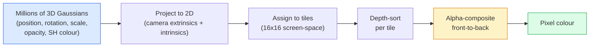

# De la réalisation de 3D Gauss Splatting

> Une scène est un groupe de plusieurs millions de Gaussiens 3D. Chaque Gaussienne a une position, une orientation, une échelle, une opacité, ainsi qu'une couleur qui dépend de la direction de vision.

**类型：**Construction
**语言：**Python
**先修要求：**Phase 4 Leçon 13 (3D Vision & NeRF) Phase 1 Leçon 12 (Opérations de tenseur) Phase 4 Leçon 10 (Basics de diffusion facultatives)
**时间：**À environ 90 minutes.

## Objectif de l'apprentissage

-  expliquer pourquoi jusqu'en 2026 , le Gaussian Splating  a remplacé le NeRF, devenant un schéma de production standard de reconstruction 3D photoréaliste
- Pour chaque Gauss, il y a six catégories de paramètres: position, quaternion de rotation, échelle, opacité, harmonie sphérique, couleur, fonctionnalité optionnelle, ainsi que le nombre de flottes.
- From零 réaliser une utilisation `alpha`Composition de 2D Gaussian splatting rasterizer, puis expliquer comment la situation 3D  projeter dans le même cycle
- Utilisation `nerfstudio`- Je suis là.`gsplat`Ou `SuperSplat`De 20-50 张照片 reconstruire une scène,并导出为 `KHR_gaussian_splatting`L'extension de glTF ou OpenUSD 26.03 `UsdVolParticleField3DGaussianSplat`schéma

##  problématique

NeRF stockera le scénario en un seul poids de MLP. Chaque pixel de l'écran doit être effectué à travers un rayon.

Le 3D Gaussian Splating (Kerbl、Kopanas、Leimkühler、Drettakis,SIGGRAPH 2023) a remplacé tout cela. Un scénario est un ensemble de Gaussian 3D évident. La rasterisation est effectuée sur le GPU à plus de 100 fps. La formation ne prend que quelques minutes. L'édition est directe:

Le modèle de cœur est simple, mais il y a assez de pièces d'activité mathématiques, de sorte que la plupart des présentations vont commencer par la rasterisation, puis passer par la projection et les harmoniques sphériques.

## 核心概念

### Un Gaussien qui ne peut pas être

Un gaussien 3D est une tache paramétrisée dans l'espace, avec ces propriétés:

```
position         mu         (3,)    centre in world coordinates
rotation         q          (4,)    unit quaternion encoding orientation
scale            s          (3,)    log-scales per axis (exponentiated at render time)
opacity          alpha      (1,)    post-sigmoid opacity [0, 1]
SH coefficients  c_lm       (3 * (L+1)^2,)   view-dependent colour
```

Rotation + échelle 会构建一个3x3covariance:`Sigma = R S S^T R^T`, c'est la forme gaussienne en 3D., les harmoniques sphériques , la couleur  peut suivre la direction de la vue , la variation: les points forts spéciaux , les éclairs, la luminosité dépendant de la vue, sans avoir besoin de stocker les textures par vue, chaque canal de couleur a 16 coefficients, y compris chaque couleur gaussienne , qui nécessite 48 floats.

Un scénario Gaussienne est généralement de 1 à 5 millions de Gaussiens. Chaque scénario de Gaussiens est de 60 floats.

### C'est la rasterisation, pas le rayon marchant



五个步骤,全都对 GPU 友好──没有每像素的 MLP查询──一张RTX 3080 Ti peut être coloré à 147 fps 600.000 spots──

### projection 步骤

                                                                                                                                                                                                                                                                                                                                                                                                                                                                                                                             `mu`、 ont une covariance en 3D `Sigma`Le 3D Gaussian, sera projeté pour la position de l'écran `mu'`、 ont une covariance en 2D `Sigma'`Le Gausséen 2D:

```
mu' = project(mu)
Sigma' = J W Sigma W^T J^T          (2 x 2)

W = viewing transform (rotation + translation of camera)
J = Jacobian of the perspective projection at mu'
```

L'empreinte gaussienne 2D est une ellipse, son axe est `Sigma'`Les vecteurs propres de cette ellipse ⋅ chaque pixel ⋅ ⋅ ⋅ ⋅ ⋅ ⋅ ⋅ ⋅ ⋅ ⋅ ⋅ ⋅ ⋅ ⋅ ⋅ ⋅ ⋅ ⋅ ⋅ ⋅ ⋅ ⋅ ⋅ ⋅ ⋅ ⋅ ⋅ ⋅ ⋅ ⋅ ⋅ ⋅ ⋅ ⋅ ⋅ ⋅ ⋅ ⋅ ⋅ ⋅ ⋅ ⋅ ⋅ ⋅ ⋅ ⋅ ⋅ ⋅ ⋅ ⋅ ⋅ ⋅ ⋅ ⋅ ⋅ ⋅ ⋅ ⋅ ⋅ ⋅ ⋅ ⋅ ⋅ ⋅ ⋅ ⋅ ⋅ ⋅ ⋅ ⋅ ⋅ ⋅ ⋅ ⋅ ⋅ ⋅ ⋅ ⋅ ⋅ ⋅ ⋅ ⋅ ⋅ ⋅ ⋅ ⋅ ⋅ ⋅ ⋅ ⋅ ⋅ ⋅ ⋅ ⋅ ⋅ ⋅ ⋅ ⋅ ⋅ ⋅ ⋅           `exp(-0.5 * (p - mu')^T Sigma'^-1 (p - mu'))`Il y a une autre.

### Règles de composition alpha

Pour un pixel, couvrir ses gaussiens seront en revanche 排序(((ou等价地, avec une inverse formule en revanche 排序) ▽Color utilisé depuis les années 1980 tous les rasterisateurs semi-transparents sont en cours d'utilisation pour composer le même équation:

```
C_pixel = sum_i alpha_i * T_i * c_i

T_i = prod_{j < i} (1 - alpha_j)       transmittance up to i
alpha_i = opacity_i * exp(-0.5 * d^T Sigma'^-1 d)   local contribution
c_i = eval_SH(SH_i, view_direction)    view-dependent colour
```

Ceci avec**NeRF 的 volumetric render 是同一个方程**, mais ici on calcule sur un ensemble de Gaussiens rares, et non sur des échantillons denses au-dessus du rayon.

### Pourquoi est-ce différenciable de

Chaque étape: projection, assignation de type, composition alpha, évaluation SH, du tout par rapport au Gaussian 参数 est différenciable ⋅ données ⋅ image de base-vérité, calculée perte de pixel rendue, par rasteriser  effectuer backprop, avec Gradient Descent 更新所有 `(mu, q, s, alpha, c_lm)`Après 30 000 répétitions, les Gaussiens trouveront la position, la taille et la couleur correctes.

### Densation et taille

Le nombre fixe de Gaussiens ne peut pas couvrir les complexes scénarios.

- **Clone**La grandeur du gradient de Gauss est très élevée mais la taille est très petite, il faut plus de détails pour la reconstruire.
- **Split**: Quand un Gaussian de grande échelle est un gradient très élevé, il va être décomposé en deux Gaussian plus petits.
- **Prune**: supprimer l'opacité des Gaussins de valeur inférieure à 

Densité Chaque N fois d'itération 运行一次── un scénario s'étend généralement d'environ 100 000 个初始高西人 (environ 1-5M) à la fin de l'entraînement.

### Uzal一段话 comprendre les harmoniques sphériques

La couleur dépendante de la vue est la fonction de l'unité de la surface de l' épaule`c(direction)`Les harmoniques sphériques sont basées sur Fourier sur la surface de la planche.`L`Chaque canal sera reçu .`(L+1)^2`个基因函数──为一个新视角评估颜色,就是将学到的SH系数与在观看方向上求值的基础做点产品──Degree 0 = 一个系数 = 不变色──Degree 3 = 16 个系数 = 足以捕捉兰伯特色,特殊和轻微反射──3D Gaussian Splating 论文默认使用级 3──

### Technologie de production en 2026

```
1. Capture         smartphone / DJI drone / handheld scanner
2. SfM / MVS       COLMAP or GLOMAP derives camera poses + sparse points
3. Train 3DGS      nerfstudio / gsplat / inria official / PostShot (~10-30 min on RTX 4090)
4. Edit            SuperSplat / SplatForge (clean floaters, segment)
5. Export          .ply -> glTF KHR_gaussian_splatting or .usd (OpenUSD 26.03)
6. View            Cesium / Unreal / Babylon.js / Three.js / Vision Pro
```

### 4D avec génératif 变体

- **4D Gaussian Splatting**Gaussians est une fonction de temps; utilisé pour la vidéo volumétrique de Superman 2026, "Helicopter" de A$AP Rocky.
- **Generative splats**Les modèles de texte à plates-formes de World Labs en marbre, peuvent halluciner sur une scène complète.
- **3D Gaussian Unscented Transform**:NVIDIA NuRec utilisé pour la simulation de conduite autonome


```figure
cv3-gaussian-splat
```

## - Je le construis.

### 步骤 1: un Gaussie en 2D

Nous avons d'abord construit un rasteriser 2D. La situation dans la projection se résume à ce qu'elle est.

```python
import torch
import torch.nn as nn
import torch.nn.functional as F


def eval_2d_gaussian(means, covs, points):
    """
    means:  (G, 2)      centres
    covs:   (G, 2, 2)   covariance matrices
    points: (H, W, 2)   pixel coordinates
    returns: (G, H, W)  density at every pixel for every Gaussian
    """
    G = means.size(0)
    H, W, _ = points.shape
    flat = points.view(-1, 2)
    inv = torch.linalg.inv(covs)
    diff = flat[None, :, :] - means[:, None, :]
    d = torch.einsum("gpi,gij,gpj->gp", diff, inv, diff)
    density = torch.exp(-0.5 * d)
    return density.view(G, H, W)
```

`einsum`会对每个 (Gaussian, pixel) paire  calculer la forme quadratique `diff^T Sigma^-1 diff`Il y a une autre.

### 步骤 2:2D éclaboussure rasteriser

La composition alpha-frontale vers l'arrière. Dans la profondeur 2D, il n'y a pas de sens, donc nous utilisons un échelle gaussienne apprise pour indiquer le ordre.

```python
def rasterise_2d(means, covs, colours, opacities, depths, image_size):
    """
    means:     (G, 2)
    covs:      (G, 2, 2)
    colours:   (G, 3)
    opacities: (G,)     in [0, 1]
    depths:    (G,)     per-Gaussian scalar used for ordering
    image_size: (H, W)
    returns:   (H, W, 3) rendered image
    """
    H, W = image_size
    yy, xx = torch.meshgrid(
        torch.arange(H, dtype=torch.float32, device=means.device),
        torch.arange(W, dtype=torch.float32, device=means.device),
        indexing="ij",
    )
    points = torch.stack([xx, yy], dim=-1)

    densities = eval_2d_gaussian(means, covs, points)
    alphas = opacities[:, None, None] * densities
    alphas = alphas.clamp(0.0, 0.99)

    order = torch.argsort(depths)
    alphas = alphas[order]
    colours_sorted = colours[order]

    T = torch.ones(H, W, device=means.device)
    out = torch.zeros(H, W, 3, device=means.device)
    for i in range(means.size(0)):
        a = alphas[i]
        out += (T * a)[..., None] * colours_sorted[i][None, None, :]
        T = T * (1.0 - a)
    return out
```

Il n'est pas rapide, vraiment réalisé, utiliser des noyaux CUDA à base de carreaux, mais les mathématiques sont complètement correctes, et entièrement différenciables.

### Étape 3: une scène de splat 2D entraînable

```python
class Splats2D(nn.Module):
    def __init__(self, num_splats=128, image_size=64, seed=0):
        super().__init__()
        g = torch.Generator().manual_seed(seed)
        H, W = image_size, image_size
        self.means = nn.Parameter(torch.rand(num_splats, 2, generator=g) * torch.tensor([W, H]))
        self.log_scale = nn.Parameter(torch.ones(num_splats, 2) * math.log(2.0))
        self.rot = nn.Parameter(torch.zeros(num_splats))  # single angle in 2D
        self.colour_logits = nn.Parameter(torch.randn(num_splats, 3, generator=g) * 0.5)
        self.opacity_logit = nn.Parameter(torch.zeros(num_splats))
        self.depth = nn.Parameter(torch.rand(num_splats, generator=g))

    def covs(self):
        s = torch.exp(self.log_scale)
        c, si = torch.cos(self.rot), torch.sin(self.rot)
        R = torch.stack([
            torch.stack([c, -si], dim=-1),
            torch.stack([si, c], dim=-1),
        ], dim=-2)
        S = torch.diag_embed(s ** 2)
        return R @ S @ R.transpose(-1, -2)

    def forward(self, image_size):
        covs = self.covs()
        colours = torch.sigmoid(self.colour_logits)
        opacities = torch.sigmoid(self.opacity_logit)
        return rasterise_2d(self.means, covs, colours, opacities, self.depth, image_size)
```

`log_scale`- Je suis là.`opacity_logit`et `colour_logits`Toutes les données sont des paramètres sans restriction, en temps de rendu 通过合适的激活 映射──这是每个3DGS 实现的标准模式──

### Étape 4: Les Gaussiens 2D s'adaptent à l'image cible

```python
import math
import numpy as np

def make_target(size=64):
    yy, xx = np.meshgrid(np.arange(size), np.arange(size), indexing="ij")
    img = np.zeros((size, size, 3), dtype=np.float32)
    # Red circle
    mask = (xx - 20) ** 2 + (yy - 20) ** 2 < 10 ** 2
    img[mask] = [1.0, 0.2, 0.2]
    # Blue square
    mask = (np.abs(xx - 45) < 8) & (np.abs(yy - 40) < 8)
    img[mask] = [0.2, 0.3, 1.0]
    return torch.from_numpy(img)


target = make_target(64)
model = Splats2D(num_splats=64, image_size=64)
opt = torch.optim.Adam(model.parameters(), lr=0.05)

for step in range(200):
    pred = model((64, 64))
    loss = F.mse_loss(pred, target)
    opt.zero_grad(); loss.backward(); opt.step()
    if step % 40 == 0:
        print(f"step {step:3d}  mse {loss.item():.4f}")
```

经过 200 步,64 个高西人会收收到这两个形状中──这是整个思路:在显式几何原始上做渐进下降──

### Étape 5: de 2D à 3D

3D 扩展保留同一个循环──新增部分包括:

1. Chaque rotation gaussienne est un quaternion, et non un angle.
2. La co-variance est`R S S^T R^T`, parmi lesquels `R`Il est construit par le quaternion.`S = diag(exp(log_scale))`Il y a une autre.
3. La projection `(mu, Sigma) -> (mu', Sigma')`Utilisation de l'extérieur de la caméra, ainsi que dans`mu`处的视角投影 处的视角投影 处的视角投影 处的视角投影 处的视角投影 处的视角投影 处的视角投影 处的视角投影 处的视角投影 处的视角投影 处的视角投影 处的视角投影 处的视角投影 处的视角投影 处的视角投影
4. La couleur devient une expansion sphérique-harmonique; en direction de vision, elle est évaluée.
5. Le type de profondeur provient du vrai espace-caméra z, plutôt que de l'apprentissage de la balance.

Chaque production est réalisée`gsplat`- Je suis là.`inria/gaussian-splatting`- Je suis là.`nerfstudio`) Tout est fait avec des noyaux CUDA à base de carreaux sur GPU.

### 步骤 6: Évaluation des harmoniques sphériques

La base SH de la plus haute fréquence de 3°C. Chaque canal a 16 points.

```python
def eval_sh_degree_3(sh_coeffs, dirs):
    """
    sh_coeffs: (..., 16, 3)   last dim is RGB channels
    dirs:      (..., 3)       unit vectors
    returns:   (..., 3)
    """
    C0 = 0.282094791773878
    C1 = 0.488602511902920
    C2 = [1.092548430592079, 1.092548430592079,
          0.315391565252520, 1.092548430592079,
          0.546274215296039]
    x, y, z = dirs[..., 0], dirs[..., 1], dirs[..., 2]
    x2, y2, z2 = x * x, y * y, z * z
    xy, yz, xz = x * y, y * z, x * z

    result = C0 * sh_coeffs[..., 0, :]
    result = result - C1 * y[..., None] * sh_coeffs[..., 1, :]
    result = result + C1 * z[..., None] * sh_coeffs[..., 2, :]
    result = result - C1 * x[..., None] * sh_coeffs[..., 3, :]

    result = result + C2[0] * xy[..., None] * sh_coeffs[..., 4, :]
    result = result + C2[1] * yz[..., None] * sh_coeffs[..., 5, :]
    result = result + C2[2] * (2.0 * z2 - x2 - y2)[..., None] * sh_coeffs[..., 6, :]
    result = result + C2[3] * xz[..., None] * sh_coeffs[..., 7, :]
    result = result + C2[4] * (x2 - y2)[..., None] * sh_coeffs[..., 8, :]

    # degree 3 terms omitted here for brevity; full 16-coefficient version in the code file
    return result
```

Je suis en train de le faire.`sh_coeffs`存储该高斯的在每个方向上的颜色──在转载时间,将其与当前视图方向求值,就得到一个3向量RGB──

## Utilisez-le

Réelle 3DGS 工作请使用 `gsplat`(Meta) ou `nerfstudio`- Le numéro de la liste:

```bash
pip install nerfstudio gsplat
ns-download-data example
ns-train splatfacto --data path/to/data
```

`splatfacto`Pour un cas typique, la première fois que vous utilisez RTX 4090 vous avez besoin de 10 à 30 minutes.

Les principales options de transport à prévoir pour l'année 2026:

- `.ply`Il est aussi le plus grand de tous les pays.
- `.splat`:PlayCanvas / SuperSplat quantifié 格式。
- glTF `KHR_gaussian_splatting`Le programme de l'année 2020 est en cours de réalisation.
- Ouvrez USD `UsdVolParticleField3DGaussianSplat`:USD-native, utilisé dans les pipelines NVIDIA Omniverse et Vision Pro

Pour les scènes 4D / dynamiques,`4DGS`et `Deformable-3DGS`Utilisation des moyens à varier dans le temps et avec les opacités  élargir le même mécanisme。

## Je le livre.

Le cours est ouvert à:

- `outputs/prompt-3dgs-capture-planner.md`Une demande, utilisée pour une séance de capture de scénarios déterminés (numéro de photos, chemin de caméra, éclairage)
- `outputs/skill-3dgs-export-router.md`: une compétence, utilisée selon le spectateur ou le moteur 选择合适的出口格式(`.ply`- Je suis là .`.splat`/ glTF / USD)

## 练习

1. **（简单）**Dans une autre image synthétique, le traîneur 2D de splat est en train de fonctionner.`num_splats`Dans le`[16, 64, 256]`Le taux de change est le taux de change de la valeur de la valeur de la valeur de la valeur de la valeur de la valeur de la valeur de la valeur de la valeur de la valeur de la valeur de la valeur de la valeur de la valeur de la valeur de la valeur de la valeur de la valeur de la valeur de la valeur de la valeur de la valeur de la valeur de la valeur de la valeur de la valeur de la valeur de la valeur de la valeur de la valeur de la valeur de la valeur de la valeur de la valeur de la valeur de la valeur de la valeur de la valeur de la valeur de la valeur de la valeur de la valeur de la valeur de la valeur de la valeur de la valeur de la valeur de la valeur de la valeur de la valeur de la valeur de la valeur de la valeur de la valeur de la valeur de la valeur de la valeur de la valeur de la valeur de la valeur de la valeur de la valeur de la valeur de la valeur de la valeur de la valeur de la valeur de la valeur de la valeur de la valeur de la valeur de la valeur de la valeur de la valeur de la valeur de la valeur de la valeur de la valeur de la valeur de la valeur de la valeur de la valeur de la valeur de la valeur de la valeur de la valeur de la valeur de la valeur de la valeur de la valeur de la valeur de la valeur de la valeur de la valeur de la valeur de la valeur de la valeur de la valeur de la valeur de la valeur de la valeur de la valeur de la valeur de la valeur de la valeur de la valeur de la valeur de la valeur de la valeur de la valeur de la valeur de la valeur de la valeur de la valeur de la valeur de la valeur de la valeur de la valeur de la valeur de la valeur de la valeur de la valeur de la valeur de la valeur de la valeur de la valeur de la valeur de la valeur de la valeur de la valeur de la valeur de la valeur de la valeur de la valeur de la valeur de la valeur de la valeur de la valeur de la valeur de la valeur de la valeur de la valeur de la valeur de la valeur de la valeur de la valeur de la valeur de la valeur de la valeur de la valeur de la valeur de la valeur de la valeur de la valeur de la valeur de la valeur de la valeur de la valeur de la valeur de la valeur de la valeur de la valeur de la valeur de la valeur de la valeur de la valeur de la valeur
2. **（中等）**扩展2D rasteriser, en le rendant compatible par Gaussian RGB couleurs, ces couleurs 通过-2 degré harmonic 依赖一个标量 view angle──在一组目标图像对上训练,并验证模型能重建二者──
3. **（困难）**Le clone`nerfstudio`, avec votre propre scène de capture de 20 张照片`splatfacto` Exportation vers le glTF `KHR_gaussian_splatting`, et le spectateur ((Three.js `GaussianSplats3D`、SuperSplat、Babylon.js V9) 中打开──rapport entraînement temps、Gaussians nombre et fréquence fps──

## 关键术语

| Term | 人们通常怎么说 | 它实际意味着什么 |
|------|----------------|----------------------|
| 3DGS | "Gaussian splats" | 将场景显式表示为数百万个 3D Gaussians，每个 Gaussian 带有 position、rotation、scale、opacity、SH colour |
| Covariance | "Shape of the Gaussian" | `Sigma = R S S^T R^T`；一个 Gaussian 的 orientation 与 anisotropic scale |
| Alpha compositing | "Back-to-front blend" | 与 NeRF 的 volumetric render 相同的方程，但现在作用在显式稀疏集合上 |
| Densification | "Clone and split" | 在 reconstruction under-fit 的位置自适应添加新 Gaussians |
| Pruning | "Delete low-opacity" | 移除训练过程中 opacity 已塌缩到接近零的 Gaussians |
| Spherical harmonics | "View-dependent colour" | 球面上的 Fourier basis；将 colour 存储为 viewing direction 的函数 |
| Splatfacto | "nerfstudio's 3DGS" | 2026 年训练 3DGS 最简单的路径 |
| `KHR_gaussian_splatting` | "glTF standard" | Khronos 2026 extension，使 3DGS 能在 viewers 和 engines 之间移植 |

## 延伸阅读

- [3D Gaussian Splatting for Real-Time Radiance Field Rendering (Kerbl et al., SIGGRAPH 2023)](https://repo-sam.inria.fr/fungraph/3d-gaussian-splatting/) Originaires
- [gsplat (Meta/nerfstudio)](https://github.com/nerfstudio-project/gsplat) Rastériseur CUDA de classe de production
- [nerfstudio Splatfacto](https://docs.nerf.studio/nerfology/methods/splat.html) 参考 entraînement
- [Khronos KHR_gaussian_splatting extension](https://github.com/KhronosGroup/glTF/blob/main/extensions/2.0/Khronos/KHR_gaussian_splatting/README.md) Formats de transfert de 2026
- [OpenUSD 26.03 release notes](https://openusd.org/release/) `UsdVolParticleField3DGaussianSplat`schéma
- [THE FUTURE 3D State of Gaussian Splatting 2026](https://www.thefuture3d.com/blog-0/2026/4/4/state-of-gaussian-splatting-2026) 行业概览
