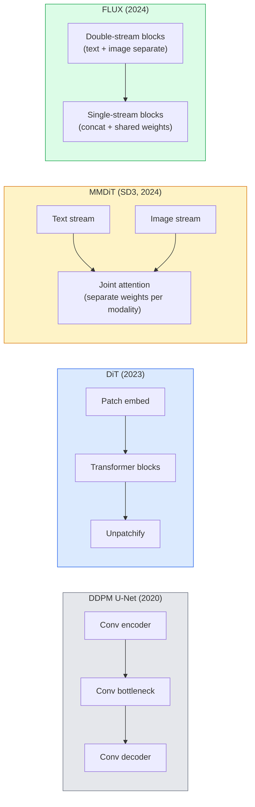

# Transformateurs de diffusion et flux rectifié

> U-Net n'est pas le secret de la diffusion. Si vous le remplacez par Transformer, si vous changez le calendrier sonore en flux de la voie directe, vous obtenez soudainement SD3 、 FLUX, ainsi que chaque modèle texte-image de 2026

**类型：**apprendre + construire
**语言：**Python
**前置要求：**Leur capacité à s'adapter à la situation actuelle est de 10 à 10 (DDPM de diffusion), de 14 à 14 (ViT), de 7 à 02 (auto-attention)
**时间：**À environ 75 minutes.

## Objectif de l'apprentissage

-  Suivre le développement du DDPM U-Net (Léction 10) à la Transformateur de Diffusion (DiT) 、MMDiT (SD3), ainsi que du DiT à courant unique+double (FLUX)
- Expliquer le flux rectifié: pourquoi le bruit et les données  direct line trajectory peuvent faire le modèle avec 20 étapes au lieu de 1000 étapes pour terminer la prise de vue
- ¢Utilité d'un petit bloc de DiT et d'une boucle d'entraînement de flux rectifié, tous les deux contrôlés en 100 ligne
- accordez-vous à l'architecture, au nombre de paramètres et à la licence des variantes de modèle (SD3、FLUX.1-dev、FLUX.1-schnell、Z-Image、Qwen-Image)

##  problématique

Leçon 10 U-Net dénonciateur construit un DDPM. Cette combinaison a guidé 2020-2023: U-Net + beta schéma + perte de prédiction de bruit.

Chaque modèle de texte à image le plus avancé de 2026 l'a déjà dépassé. La diffusion stable 3、FLUX、SD4、Z-Image、Qwen-Image、Hunyuan-Image n'utilise pas un U-Net. Ils utilisent des transformateurs de diffusion (DiT)。SD3 和 FLUX. Ils utilisent également le programme de bruit DDPM en flux rectifié, ce qui transforme le chemin du bruit vers les données en direct, en passant par la cohérence ou les variantes distillées.

Cette transformation est importante, car elle est en train de générer des images basées sur la diffusion, de devenir contrôlable, de devenir rapide et précis (SD3/SD4 a résolu la texture) et de devenir assez rapide pour la production.

## 核心概念

### De l' U-Net à la Transformer



- **DiT**(Peebles & Xie, 2023)  U-Net remplacé par un transformateur similaire à ViT, dans des patchs latents 上运行── via la norme de couche adaptative (AdaLN) conditionnement──
- **MMDiT**(SD3, Esser et al., 2024) 为文标和图像标 使用两个拥有独立权重的流,并共享一个共同关注――
- **FLUX**(Black Forest Labs, 2024) 前 N 个块 像 SD3 一样采用双流,后续块将代币连锁并共享重量(单流),以提高更深层结构的效率──
- **Z-Image**(2025)  un système de transmission à courant unique à haute efficacité de 6B, a défié  sans préjugé  tout le coût de l'expansion  de la pensée 

### Uzal一段话解释 Le flux rectifié

Le DDPM va définir le processus de mise en avant comme un SDE bruyant, parmi lesquels`x_t`Le revers de l'apprentissage est le second SDE, il faut utiliser 1000 petits pas pour trouver une solution.

Flux rectifié  définit entre les données propres et le bruit pur **直线**插值:

```
x_t = (1 - t) * x_0 + t * epsilon,     t in [0, 1]
```

 entraîner un réseau pour prédire la vitesse `v_theta(x_t, t) = epsilon - x_0`也就是沿着从清洁数据到噪音的直线路径的前进方向(`dx_t/dt`)¬, vous allez à la vitesse de l'arrière du bruit, progressivement vers les données¬, vous obtenez un ODE plus proche de la ligne droite, donc les étapes d'intégration nécessaires à la recherche doivent être beaucoup moins nombreuses¬.

SD3 sera appelé **Rectified Flow Matching** FLUX、Z-Image 和 la plupart du modèle 2026 Using the same objective──typique inférence:20-30 个 Euler steps(deterministic),相比旧DDPM 体系中的 50+ DDIM steps──Distilled / turbo / schnell / LCM variantes peuvent le réduire à 1 à 4 步──

### Conditionnement AdaLN

- Je suis désolé .**adaptive layer norm**Dans le temps et dans la classe / texte, le conditionnement est effectué par le vecteur de conditionnement.`scale`et `shift`Il est également utilisé par chaque moderne DiT en comparaison avec la modulation de style FiLM dans les U-Nets.

```
cond -> MLP -> (scale, shift, gate)
norm(x) * (1 + scale) + shift, then residual add * gate
```

### Les encoders de texte SD3 et FLUX

- **SD3**Utilisation de trois encoders de texte: deux modèles CLIP + T5-XXL。 Les emblèmes sont concaténés 后作为文本调节 送入图像流。
- **FLUX**Utilisez un CLIP-L + T5-XXL
- **Qwen-Image / Z-Image**Les variantes utilisent des LLM de base pour les encoders de texte auto-développés.

Le codeur de texte est donc plus important que le SD1.5 pour comprendre les commandes.

### Une orientation sans classifiateur 仍然成立

Le flux rectifié  modifier est l'échantillonnage, et non le conditionnement. Les instructions sans classifiateur  entraînement  formation  formation  formation  formation  formation  formation  formation  formation  formation  formation  formation  formation  formation  formation  formation  formation  formation  formation  formation  formation  formation  formation  formation  formation  formation  formation  formation  formation  formation  formation  formation  formation  formation  formation  formation  formation  formation  formation  formation  formation  formation  formation  formation  formation  formation  formation  formation  formation  formation  formation  formation  formation  formation  formation  formation  formation  formation  formation  formation  formation  formation  formation  formation  formation  formation  formation  formation  formation  formation  formation  formation  formation  formation  formation  formation  formation  formation  formation  formation  formation  formation  formation  formation  formation  formation  formation  formation  formation  formation  formation  formation  formation  formation  formation  formation  formation  formation  formation  formation  formation  formation  formation  formation  formation  formation  formation  formation  formation  formation  formation  formation  formation  formation  formation  formation  formation  formation  formation  formation  formation  formation  formation  formation  formation  formation  formation  formation  formation  formation  formation  formation  formation  formation  formation  formation  formation  formation  formation  formation  formation  formation  formation  formation  formation  formation  formation  formation  formation  formation  formation  formation  formation  formation  formation  formation  formation  formation  formation     formation  formation            formation              formation                                                                                                                                 

### La répartition des données

Quatre noms indiquent le même concept: mettre un modèle à plusieurs étapes à un rythme rapide à quelques étapes à un rythme rapide à plusieurs étapes.

- **LCM (Latent Consistency Model)** entraîner un étudiant, le rendre capable de l'intermédiaire. `x_t`Un premier préavis`x_0`Il y a une autre.
- **SDXL Turbo / FLUX schnell** utiliser des modèles de 1 à 4 étapes de distillation à diffusion adverse 
- **SD Turbo**将 OpenAI-style Modèles de cohérence 适配到潜伏传播──

Le service de production de tout nouveau modèle est généralement lancé en même temps un point de contrôle de qualité complet et une variante turbo/fast.

### Paysage modèle de 2026

| Model | Size | Architecture | License |
|-------|------|--------------|---------|
| Stable Diffusion 3 Medium | 2B | MMDiT | SAI Community |
| Stable Diffusion 3.5 Large | 8B | MMDiT | SAI Community |
| FLUX.1-dev | 12B | Double + Single Stream DiT | non-commercial |
| FLUX.1-schnell | 12B | same, distilled | Apache 2.0 |
| FLUX.2 | — | iterated FLUX.1 | mixed |
| Z-Image | 6B | S3-DiT (Scalable Single-Stream) | permissive |
| Qwen-Image | ~20B | DiT + Qwen text tower | Apache 2.0 |
| Hunyuan-Image-3.0 | ~80B | DiT | research |
| SD4 Turbo | 3B | DiT + distillation | SAI Commercial |

FLUX.1-schnell est le modèle de 2026 en open source 默认选择──Z-Image est le leader de l'efficacité──FLUX.2 和 SD4 est le modèle le plus fiable en matière de qualité actuelle──

### Pourquoi cette phase de transformation est importante

DDPM + U-Net 能工作──DiT + flux rectifié 工作得**更好、更快，并且扩展得更干净** Ce changement est similaire à celui de la PNL: de RNN à transformateurs: deux architectures  résolvent le même problème, mais les transformateurs sont plus susceptibles de se développer et de prendre le plus de place.


```figure
cv3-rectified-flow
```

## - Je le construis.

### 步骤 1: avec le blocage de la DiT AdaLN

```python
import torch
import torch.nn as nn


class AdaLNZero(nn.Module):
    """
    Adaptive LayerNorm with a gate. Predicts (scale, shift, gate) from the conditioning.
    Init such that the whole block starts as identity ("zero init").
    """

    def __init__(self, dim, cond_dim):
        super().__init__()
        self.norm = nn.LayerNorm(dim, elementwise_affine=False)
        self.mlp = nn.Linear(cond_dim, dim * 3)
        nn.init.zeros_(self.mlp.weight)
        nn.init.zeros_(self.mlp.bias)

    def forward(self, x, cond):
        scale, shift, gate = self.mlp(cond).chunk(3, dim=-1)
        h = self.norm(x) * (1 + scale.unsqueeze(1)) + shift.unsqueeze(1)
        return h, gate.unsqueeze(1)


class DiTBlock(nn.Module):
    def __init__(self, dim=192, heads=3, mlp_ratio=4, cond_dim=192):
        super().__init__()
        self.adaln1 = AdaLNZero(dim, cond_dim)
        self.attn = nn.MultiheadAttention(dim, heads, batch_first=True)
        self.adaln2 = AdaLNZero(dim, cond_dim)
        self.mlp = nn.Sequential(
            nn.Linear(dim, dim * mlp_ratio),
            nn.GELU(),
            nn.Linear(dim * mlp_ratio, dim),
        )

    def forward(self, x, cond):
        h, gate1 = self.adaln1(x, cond)
        a, _ = self.attn(h, h, h, need_weights=False)
        x = x + gate1 * a
        h, gate2 = self.adaln2(x, cond)
        x = x + gate2 * self.mlp(h)
        return x
```

`AdaLNZero`Un démarrage est une cartographie d'identité, car ses poids MLP sont initialement classés en zéro.

### Pas 2: une petite diète

```python
def timestep_embedding(t, dim):
    import math
    half = dim // 2
    freqs = torch.exp(-math.log(10000) * torch.arange(half, device=t.device) / half)
    args = t[:, None].float() * freqs[None]
    return torch.cat([args.sin(), args.cos()], dim=-1)


class TinyDiT(nn.Module):
    def __init__(self, image_size=16, patch_size=2, in_channels=3, dim=96, depth=4, heads=3):
        super().__init__()
        self.patch_size = patch_size
        self.num_patches = (image_size // patch_size) ** 2
        self.patch = nn.Conv2d(in_channels, dim, kernel_size=patch_size, stride=patch_size)
        self.pos = nn.Parameter(torch.zeros(1, self.num_patches, dim))
        self.time_mlp = nn.Sequential(
            nn.Linear(dim, dim * 2),
            nn.SiLU(),
            nn.Linear(dim * 2, dim),
        )
        self.blocks = nn.ModuleList([DiTBlock(dim, heads, cond_dim=dim) for _ in range(depth)])
        self.norm_out = nn.LayerNorm(dim, elementwise_affine=False)
        self.head = nn.Linear(dim, patch_size * patch_size * in_channels)

    def forward(self, x, t):
        n = x.size(0)
        x = self.patch(x)
        x = x.flatten(2).transpose(1, 2) + self.pos
        t_emb = self.time_mlp(timestep_embedding(t, self.pos.size(-1)))
        for blk in self.blocks:
            x = blk(x, t_emb)
        x = self.norm_out(x)
        x = self.head(x)
        return self._unpatchify(x, n)

    def _unpatchify(self, x, n):
        p = self.patch_size
        h = w = int(self.num_patches ** 0.5)
        x = x.view(n, h, w, p, p, -1).permute(0, 5, 1, 3, 2, 4).reshape(n, -1, h * p, w * p)
        return x
```

### 步骤 3: Formation en flux rectifiée

```python
import torch.nn.functional as F

def rectified_flow_train_step(model, x0, optimizer, device):
    model.train()
    x0 = x0.to(device)
    n = x0.size(0)
    t = torch.rand(n, device=device)
    epsilon = torch.randn_like(x0)
    x_t = (1 - t[:, None, None, None]) * x0 + t[:, None, None, None] * epsilon

    target_velocity = epsilon - x0
    pred_velocity = model(x_t, t)

    loss = F.mse_loss(pred_velocity, target_velocity)
    optimizer.zero_grad()
    loss.backward()
    optimizer.step()
    return loss.item()
```

La perte de prédiction du bruit de la DDPM est différente.`epsilon`, plutôt prédiction **velocity** `epsilon - x_0`, il est en direct à partir des données vers le bruit.

### 步骤 4: échantillonneur d'Euler

Le flux rectifié est une méthode ODE. La méthode d'Euler est la méthode la plus simple, et pour un modèle de flux rectifié bien entraîné, il est pratiquement le même avec les résolveurs de plus haut ordre en 20 étapes.

```python
@torch.no_grad()
def rectified_flow_sample(model, shape, steps=20, device="cpu"):
    model.eval()
    x = torch.randn(shape, device=device)
    dt = 1.0 / steps
    t = torch.ones(shape[0], device=device)
    for _ in range(steps):
        v = model(x, t)
        x = x - dt * v
        t = t - dt
    return x
```

20 étapes. Dans un modèle bien entraîné, cela produira des échantillons comparables à ceux du DDPM à 1000 étapes.

### Étape 5: Test de fumée de bout en bout

```python
import numpy as np

def synthetic_blobs(num=200, size=16, seed=0):
    rng = np.random.default_rng(seed)
    out = np.zeros((num, 3, size, size), dtype=np.float32)
    yy, xx = np.meshgrid(np.arange(size), np.arange(size), indexing="ij")
    for i in range(num):
        cx, cy = rng.uniform(4, size - 4, size=2)
        r = rng.uniform(2, 4)
        mask = (xx - cx) ** 2 + (yy - cy) ** 2 < r ** 2
        colour = rng.uniform(-1, 1, size=3)
        for c in range(3):
            out[i, c][mask] = colour[c]
    return torch.from_numpy(out)
```

Utilisez le flux rectifié dans cette base de données`TinyDiT`Après 500 étapes, les résultats échantillonnés devraient ressembler à des taches de couleur fraîches.

## Utilisez-le

Pour utiliser la génération d'images réelles de FLUX / SD3 / Z-Image,`diffusers`Pour chaque modèle, fournissez une API unique:

```python
from diffusers import FluxPipeline, StableDiffusion3Pipeline
import torch

pipe = FluxPipeline.from_pretrained(
    "black-forest-labs/FLUX.1-schnell",
    torch_dtype=torch.bfloat16,
).to("cuda")

out = pipe(
    prompt="a golden retriever surfing a tsunami, hyperrealistic, studio lighting",
    guidance_scale=0.0,           # schnell was trained without CFG
    num_inference_steps=4,
    max_sequence_length=256,
).images[0]
out.save("surf.png")
```

Je suis là.`FLUX.1-schnell`Quatre étapes de réalisation:`black-forest-labs/FLUX.1-dev`Il est possible de prendre 20 à 30 étapes avec le CFG pour obtenir une meilleure qualité.

Pour SD3:

```python
pipe = StableDiffusion3Pipeline.from_pretrained(
    "stabilityai/stable-diffusion-3.5-large",
    torch_dtype=torch.bfloat16,
).to("cuda")
out = pipe(prompt, guidance_scale=3.5, num_inference_steps=28).images[0]
```

## Je le livre.

Le cours est ouvert à:

- `outputs/prompt-dit-model-picker.md` dans la définition de la qualité 、延迟和许可 约束时, dans le SD3、FLUX.1-dev、FLUX.1-schnell、Z-Image、SD4 Turbo ∼
- `outputs/skill-rectified-flow-trainer.md` éditer un cycle complet de formation de flux rectifié, comprenant l'échantillonnage AdaLN DiT et Euler

## 练习

1. **（简单）**Dans le ensemble de données de blob synthétique, la formation de la série TinyDiT 500 étapes est effectuée.
2. **（中等）**通過把一個學習級 拼接到時間 拼接上,加入文字調節 (→ 級) ▽分別用級 0、5 和 9 采样,并验证颜色匹配──)
3. **（困难）**计算在同样大小的网络、同样数据、同样训练步数下, rectified-flow与DDPM 版本生成样品 之间的 Fréchet distance (FID proxy) ;;报告哪一个收更快──

## 关键术语

| Term | 人们常说 | 实际含义 |
|------|----------------|----------------------|
| DiT | “Diffusion transformer” | 替代 U-Net 作为 diffusion denoiser 的 Transformer；在 patchified latents 上运行 |
| AdaLN | “Adaptive layer norm” | 通过学习到的 scale、shift、gate 进行 timestep/text conditioning，并在 LayerNorm 之后应用；每个现代 DiT 的标准做法 |
| MMDiT | “Multi-modal DiT (SD3)” | 为 text tokens 和 image tokens 使用独立 weight streams，并共享一个 joint self-attention |
| Single-stream / double-stream | “FLUX trick” | 前 N 个 blocks 为 double-stream（每种 modality 使用独立 weights），后续 blocks 为 single-stream（concat + shared weights），以提升效率 |
| Rectified flow | “Straight-line noise-to-data” | data 与 noise 之间的线性插值；网络预测 velocity；inference 所需 ODE steps 更少 |
| Velocity target | “epsilon - x_0” | rectified flow 中的 Regression target；从 clean data 指向 noise |
| CFG guidance | “classifier-free guidance” | 混合 conditional 与 unconditional predictions；rectified-flow models 中仍然使用 |
| Schnell / turbo / LCM | “1-4 step distillation” | 从 full-quality models distill 得到的小步数 variants；用于生产实时场景 |

## 延伸阅读

- [Scalable Diffusion Models with Transformers (Peebles & Xie, 2023)](https://arxiv.org/abs/2212.09748)DiT 论文
- [Scaling Rectified Flow Transformers (Esser et al., SD3 paper)](https://arxiv.org/abs/2403.03206) MMDiT de grande taille et flux rectifié
- [FLUX.1 model card and technical report (Black Forest Labs)](https://huggingface.co/black-forest-labs/FLUX.1-dev)double + courant unique 细节
- [Z-Image: Efficient Image Generation Foundation Model (2025)](https://arxiv.org/html/2511.22699v1)6B DiT à courant unique
- [Elucidating the Design Space of Diffusion (Karras et al., 2022)](https://arxiv.org/abs/2206.00364) chaque diffusion  conception de l'échange
- [Latent Consistency Models (Luo et al., 2023)](https://arxiv.org/abs/2310.04378)LCM-LoRA  comment réaliser l'inférence en 4 étapes
