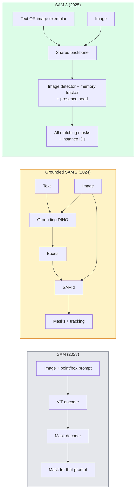

# SAM 3 et segmentation du vocabulaire ouvert

> 给模型一个文提示 和一张图片,即可获得每个匹配对象的面具──SAM 3 让它变成一个单独的前进通道──

**类型：**Utilisation + 构建
**语言：**Python
**先修要求：**Les résultats de la phase 4 (U-Net), de la phase 4 (Mask R-CNN), de la phase 4 (CLIP)
**时间：**- 60 minutes

## Objectif de l'apprentissage

- 区分 SAM(seules les instructions visuelles)、Grounded SAM / SAM 2(detecteur + SAM) et SAM 3(à travers la segmentation de concepts de la demande originale
- 解释 SAM 3 架构:réseau partagé + détecteur d'image + détecteur vidéo basé sur la mémoire + tête de présence + conception déconnectée de détecteur-detecteur
- Utilisez le visage en train de s' embrasser`transformers`SAM 3 集成 effectuer la détection par SMS, la segmentation et le suivi vidéo
- ∆en fonction de la latence ∆en complexe de concept ∆en objectif de déploiement, entre SAM 3 ∆en SAM 2 ∆en YOLO-World ∆en SAM-MI ∆en faire le choix

##  problématique

SAM de 2023 est un modèle qui ne supporte que le prompt visuel: vous cliquez sur un point ou dessinez un cadre, il retourne à un masque. Pour trouver tout ce qui se trouve dans cette photo, vous avez besoin d'un détecteur.

SAM 3(Meta,2025年11月,ICLR 2026) a comprimé ce niveau. Il accepte un court nom de mot短语或一个图像示范 作为提示, et une fois à l'avant passe dans le retour de tous les masques et ID d'instance correspondants.**Promptable Concept Segmentation (PCS)**◊结合 2026 年 3 月的 Object Multiplex 更新(SAM 3.1), il peut être très efficace dans la vidéo pour suivre plusieurs instances du même concept。

Ce cours se concentre sur le changement structurel qu'il représente. La séparation 2D, la détection et la mise à terre des images textuelles sont déjà intégrées à un modèle.

## 概念

### 3ème modèle



### Segmentation de concepts

concept prompt 是一个简短的名词短语`"yellow school bus"`- Je suis là.`"striped red umbrella"`- Je suis là.`"hand holding a mug"`) ou un exemple d'image. Le modèle sera utilisé pour chaque instance de l'image correspondant au concept.

Il y a trois différences avec le SAM visuel classique:

1. Il n'est pas nécessaire de fournir une instance de texte pour répondre à toutes les correspondances.
2. Vocabulary ouvert:concept peuvent être tout ce qui peut être décrit en langage naturel.
3. Une fois de retour plusieurs instances, plutôt que chaque prompt retourner un masque.

### 关键架构组件

- **Shared backbone**Une image de traitement de ViT, une tête de détecteur et un tracker basé sur la mémoire.
- **Presence head**Le concept de prédiction existe-t-il dans l'image ?
- **Decoupled detector-tracker**:détection au niveau de l'image et suivi au niveau vidéo Utilisez des têtes indépendantes, évitez de vous déranger mutuellement
- **Memory bank**: à travers des cadres  stockage de fonctionnalités de chaque instance, pour le suivi vidéo( avec SAM 2 utilisations du même mécanisme)

### Formation à grande échelle

SAM 3 est en train de**400 万个 unique concepts**Les concepts sont développés par un moteur de données, qui a été développé par l'IA + l'audit de l'homme.**SA-CO benchmark**Il contient 270 000 concepts uniques, 50 fois plus grands que les benchmarks précédents.

### SAM 3.1 Objet multiplex

2026 年 3 月更新:**Object Multiplex** Introduction d'un mécanisme de mémoire partagée, utilisé pour suivre simultanément plusieurs instances du même concept . . . . . . . . . . . .. .. .. ... ....................................................................................................................................................................................................................

### 2026 Année de SAM fondée  encore un scénario important

- Quand vous avez besoin de remplacer un détecteur de vocabulaire ouvert spécifique
- Quand la licence SAM 3 est fermée, ça devient un obstacle.
- Quand vous avez besoin de plus de contrôle que le seuil du détecteur SAM 3 ∙
- Utilisé pour la recherche / travail d'ablation de composants détecteurs.

Les pipelines modulaires  ont toujours une valeur  Pour la plupart des travaux de production, SAM 3 est la réponse la plus simple 

### YOLO-World contre SAM 3

- **YOLO-World**:Simplement détecteur de vocabulaire ouvert (( sans masque)―En temps réel―
- **SAM 3**: segmentation complète + suivi.

生产场景划分:YOLO-World 适合快速检测-only pipelines(robotics navigation、dashboards rapides),SAM 3 适合任何需要面具或跟踪的场景──

### Efficience SAM-MI

SAM-MI(2025-2026) résoudre le gouffre du décodeur SAM──

- **Sparse point prompting**: utiliser peu de points de sélection, plutôt que des invites denses; décoder appelle  réduire 96%。
- **Shallow mask aggregation**Les prédictions de la masque seront plus claires.
- **Decoupled mask injection**: décodeur 接收预计算的面具功能,而不是重新运行──

结果: dans les références de vocabulaire ouvert, la vitesse de la mise à niveau est d'environ 1,6× par rapport à la vitesse de la mise à niveau de la base.

### Format de sortie de trois modèles

它们都回归相同的一般结构(盒子+标签+分数+面具+ID), c'est très utile: votre sous-sol ne nécessite pas de fonctionnement selon quel modèle pour se démarquer。


```figure
cv3-open-vocab
```

## Construction

### 步骤 1: Construction rapide

构建一个助手,将用户句转换为 SAM 3 concept prompts 列表──这是用户输入的内容和模型消费的内容之间的边界──

```python
def split_concepts(sentence):
    """
    Heuristic splitter for multi-concept prompts.
    Returns list of short noun phrases.
    """
    for sep in [",", ";", "and", "or", "&"]:
        if sep in sentence:
            parts = [p.strip() for p in sentence.replace("and ", ",").split(",")]
            return [p for p in parts if p]
    return [sentence.strip()]

print(split_concepts("cats, dogs and balloons"))
```

SAM 3 Chaque fois que vous passez à l'avant, acceptez un concept; pour les requêtes multiconceptives, faites un cycle ou un traitement en série.

### 步骤 2:Aideurs de post-traitement

Pour les résultats de SAM 3, la liste des résultats de SAM 3 sera transférée en résultats de détection propres, en fonction du contrat de pipeline de la phase 4.

```python
from dataclasses import dataclass
from typing import List

@dataclass
class ConceptDetection:
    concept: str
    instance_id: int
    box: tuple          # (x1, y1, x2, y2)
    score: float
    mask_rle: str       # run-length encoded


def rle_encode(binary_mask):
    flat = binary_mask.flatten().astype("uint8")
    runs = []
    prev, count = flat[0], 0
    for v in flat:
        if v == prev:
            count += 1
        else:
            runs.append((int(prev), count))
            prev, count = v, 1
    runs.append((int(prev), count))
    return ";".join(f"{v}x{c}" for v, c in runs)
```

Même si il y a beaucoup de masques à haute résolution, RLE peut également permettre de répondre à des charges utiles 保持较小──

### 步骤 3: Uni一的 interface de segmentation de vocabulaire ouvert

Vous avez un backend de type SAM 3 √√√√√√√√√√√√√√√√√√√√√√√√√√√√√√√√√√√√√√√√√√√√√√√√√√√√√√√√√√√√√√√√√√√√√√√√√√√√√√√√√√√√√√√√√√√√√√√√√√√√√√√√√√√√√√√√√√√√√√√√√√√√√√√√√√√√√√√√√√√√√√√√√√√√√√√√√√√√√√√√√√√√√√√√√√√√√√√√√√√√√√√√√√√√√√√√√√√√√√√√√√√√√√√√√√√√√√√√√√√√√√√√√√√√√√√√√√√√√√√√√√√√√√√√√√√√√√√√√√√√√√√√√√√√√√√√√√√√√√√√√√√√√√√√√√√√√√√√√√√√√√√√√√√√√√√√√√√√√√√√√√√√√√√√√√√√√√√√√√√√√√√√√√√√√√√√√√√√√√√√√√√√√√√√√√√√√√√√√√√√√√√√√√√√√√√√√√√√√√√√√√√√√√√√√√√√√√√√√√√√√√√√√√√√√√√√√√√√√√√√√√√√√√√√√√√√√√√√√√√√√√√√√√√√√√√√√√√√√√√√√√√√√√√√√√√√√√√√√√√√

```python
from abc import ABC, abstractmethod
import numpy as np

class OpenVocabSeg(ABC):
    @abstractmethod
    def detect(self, image: np.ndarray, concept: str) -> List[ConceptDetection]:
        ...


class StubOpenVocabSeg(OpenVocabSeg):
    """
    Deterministic stub used for pipeline testing when real models are not loaded.
    """
    def detect(self, image, concept):
        h, w = image.shape[:2]
        return [
            ConceptDetection(
                concept=concept,
                instance_id=0,
                box=(w * 0.2, h * 0.3, w * 0.5, h * 0.8),
                score=0.89,
                mask_rle="0x100;1x50;0x200",
            ),
            ConceptDetection(
                concept=concept,
                instance_id=1,
                box=(w * 0.55, h * 0.25, w * 0.85, h * 0.75),
                score=0.74,
                mask_rle="0x80;1x40;0x220",
            ),
        ]
```

Réelle .`SAM3OpenVocabSeg`sous-classe 会封装 `transformers.Sam3Model`et `Sam3Processor`Il y a une autre.

### 步骤 4: Couper le visage SAM 3 用法(reference)

 réel modèle `transformers`集成:

```python
from transformers import Sam3Processor, Sam3Model
import torch

processor = Sam3Processor.from_pretrained("facebook/sam3")
model = Sam3Model.from_pretrained("facebook/sam3").eval()

inputs = processor(images=pil_image, return_tensors="pt")
inputs = processor.set_text_prompt(inputs, "yellow school bus")

with torch.no_grad():
    outputs = model(**inputs)

masks = processor.post_process_masks(
    outputs.masks, inputs.original_sizes, inputs.reshaped_input_sizes
)
boxes = outputs.boxes
scores = outputs.scores
```

Une seule fois, une seule fois, un seul coup de fil.

### Étape 5: Mesurer le SAM 2

Un réel point de référence: dans le pipeline réel, en utilisant SAM 3 pour remplacer le SAM 2 au sol, que se passe-t-il ?

- La latence:SAM 3 省掉一次前传 (pas de détecteur indépendant), mais le modèle lui-même est plus lourd; généralement, le système est plus rapide ou légèrement plus rapide.
- Accuracité:SAM 3 dans les concepts rares ou compositionnels`"striped red umbrella"`) sur les concepts de mots de la plupart des gens.
- Flexibilité: SAM 2 à terre vous permet de remplacer les détecteurs ((DINO-X、Florence-2、DINO à terre 1.5); SAM 3 est monolithique。

结论:SAM 3 est une option préconisée de la segmente de vocabulaire ouvert de 2026 ⋅ lorsque vous avez besoin de flexibilité de détecteur ou de différentes conditions de licence 时, Grounded SAM 2 ⋅ encore ⋅ 正确答案──

## Utilisation

Mode de déploiement de la production:

- **Real-time annotation**:SAM 3 + CVAT                                                                                                                                                                                                                                                                                                                                                                                                                                                                                                                       
- **Video analytics**:SAM 3.1 Object Multiplex utilisé pour le suivi de plusieurs objets;将 frames 输入 memory-based tracker。
- **Robotics**:SAM 3 utilise la manipulation de la parole ouverte (pick up the red cup); comme planification primitive 运行。
- **Medical imaging**Dans les concepts médicaux, il faut avoir accès à la SAM 3 finement ajustée.

Ultralytics dans son paquet Python enveloppé dans SAM 3:

```python
from ultralytics import SAM

model = SAM("sam3.pt")
results = model(image_path, prompts="yellow school bus")
```

Avec YOLO 和 SAM 2 Utilisez la même interface.

## 交付

Le cours est ouvert à:

- `outputs/prompt-open-vocab-stack-picker.md`Une en fonction de la latence, de la complexité du concept et de la licence, choisissez SAM 3 / SAM 2 / YOLO-World / SAM-MI.
- `outputs/skill-concept-prompt-designer.md`: un将用户话语转换为格式良好的 SAM 3 concept prompts  skill de séparation, désambiguation, rechute)

## 练习

1. **（Easy）**Dans les 10 images, le SAM 3 est utilisé, et les concepts de votre choix sont utilisés.
2. **（Medium）**Dans SAM 3 之之之构建一个 点击-to-include / click-to-exclure UI:text prompt 返回候选实例; user点击保留哪些算作 positive──将最终概念集合 输出为 JSON──
3. **（Hard）**Dans un ensemble de concepts auto-définies (par exemple, 5 composants électroniques) on peut affiner le SAM 3, chaque type d'images étiquetées à 20 张, avec le même ensemble de tests, le SAM 3 à tir zéro, en comparaison avec le SAM 3 de mise à niveau, en mesure de l'amélioration de la capacité de mise en valeur du masque, en utilisant les mêmes techniques.

## 关键术语

| Term | 人们通常怎么说 | 实际含义 |
|------|----------------|----------------------|
| Open-vocabulary segmentation | “Segment by text” | 为自然语言描述的 objects 生成 masks，而不是使用固定 label set |
| PCS | “Promptable Concept Segmentation” | SAM 3 的核心任务：给定一个 noun-phrase 或 image exemplar，segment 所有匹配 instances |
| Concept prompt | “The text input” | 简短名词短语或 image exemplar；不是完整句子 |
| Presence head | “Is it here?” | SAM 3 中的模块，用于在 localisation 之前判断 concept 是否存在于 image 中 |
| SA-CO | “SAM 3 benchmark” | 包含 270K concepts 的 open-vocabulary segmentation benchmark；比以往 open-vocab benchmarks 大 50 倍 |
| Object Multiplex | “SAM 3.1 update” | Shared-memory multi-object tracking；快速联合跟踪多个 instances |
| Grounded SAM 2 | “Modular pipeline” | Detector + SAM 2 级联；当 detector 替换很重要时仍然相关 |
| SAM-MI | “Efficient SAM variant” | Mask Injection，相比 Grounded-SAM 实现 1.6x speedup |

## 延伸阅读

- [SAM 3: Segment Anything with Concepts (arXiv 2511.16719)](https://arxiv.org/abs/2511.16719)
- [SAM 3.1 Object Multiplex (Meta AI, March 2026)](https://ai.meta.com/blog/segment-anything-model-3/)
- [SAM 3 model page on Hugging Face](https://huggingface.co/facebook/sam3)
- [Grounded SAM 2 tutorial (PyImageSearch)](https://pyimagesearch.com/2026/01/19/grounded-sam-2-from-open-set-detection-to-segmentation-and-tracking/)
- [Ultralytics SAM 3 docs](https://docs.ultralytics.com/models/sam-3/)
- [SAM3-I: Instruction-aware SAM (arXiv 2512.04585)](https://arxiv.org/abs/2512.04585)
