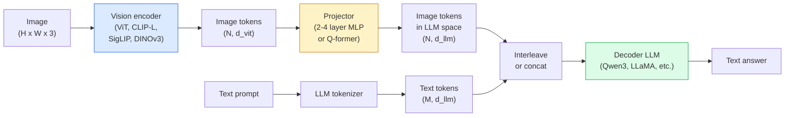

# Modèles de langage de vision  ViT-MLP-LLM 模式

> Le codeur de vision transformera les images en jetons. Le projecteur MLP va les cartographier dans l'espace d'intégration de la LLM. Le modèle de langage va réaliser le reste du travail.

**类型：**学习 + 使用
**语言：**Python
**前置要求：**Leur objectif est de fournir des informations sur les différents types de services et de leur fonctionnement.
**时间：**- 75 minutes

## Objectif de l'apprentissage

- Il explique les trois composants contribuant à ce que
- À partir de la quantité de paramètres, de la longueur de contexte et des performances de référence, comparer Qwen3-VL, InternVL3.5 LLaVA-Next et GLM-4.6V
- Expliquer DeepStack: pourquoi les fonctionnalités de ViT de plusieurs niveaux sont plus étroites que les fonctionnalités de dernière couche
- Dans un environnement de production, le taux d'erreur croisée (CMER) est utilisé pour mesurer les hallucinations de VLM, et il est basé sur ce signal pour agir.

##  problématique

CLIP (L'étape 4 Leçon 18) pour les images et le texte fournissent un espace d'intégration partagé, ce qui suffit à soutenir la classification et la récupération à zéro coupes. Il ne peut pas répondre à cette question.

Les modèles de vision-langue (VLM)  Qwen3-VL、InternVL3.5、LLaVA-Next、GLM-4.6V  vont utiliser le codeur d'image CLIP-famille 接到一个完整语言模型 上。模型看一张图像加一个问题,然后生成答案──到2026年, les VLM open source dans les benchmarks multimodaux (MMMU, MMBench, DocVQA, ChartQA, MathVista, OSWorld) 已可以比肩甚至超过GPT-5 和 Gemini-2.5-Pro──

Le modèle est un modèle de conception de l'alignement, et une fois que vous avez compris ce modèle, vous pouvez remplacer n'importe quel composant par un travail mécanique.

## 概念

### L'établissement de l'établissement



1. **Vision encoder** 预训练 ViT(CLIP-L/14、SigLIP、DINOv3, ou variante finement réglée)
2. **Projector** 一个小模块(2-4 层 MLP, ou Q-former),将视觉代币映射到LLM的嵌入维度──大多细调节──发生在这里──
3. **LLM** modèle de langage à décodeur seulement ((Qwen3、Llama、Mistral、GLM、InternLM) ・・・ selon le processus de lecture de la vision + des jetons de texte,并生成文本。

En pratique, le codeur de vision et le MLL sont souvent congelés, mais seulement un projecteur, afin de pouvoir recevoir des milliards de signaux à faible coût.

### Le dépôt

La projection normale ne fait que l'utilisation de la dernière couche de la couche de ViT. Le DeepStack Qwen3-VL consiste à extraire de plusieurs caractéristiques de la couche de profondeur de ViT et à les mettre en pile.

### 3 étapes de formation

现代 VLMs 分阶段训练:

1. **Alignment** congeler ViT 和 LLM── seulement dans les paires d'images-captions 上訓練投影機──教会投影機 将视野空間 映射到语言空間──
2. **Pre-training** 解所有部分──大规模交错图像文数据(500M+ paires) 上训练──构建模型的视觉知识──
3. **Instruction tuning** 在精选的(image, question, réponse) 三元组上细调──教会对话行为 和任务格式──

La plupart des lo-tunes de l'ORL seront réalisées avec des données de marquage à petite échelle pour la 3ème phase.

### 模型家族比较(2026 年初)

| Model | Params | Vision encoder | LLM | Context | Strengths |
|-------|--------|----------------|-----|---------|-----------|
| Qwen3-VL-235B-A22B (MoE) | 235B (22B active) | custom ViT + DeepStack | Qwen3 | 256K | 综合 SOTA，GUI agent |
| Qwen3-VL-30B-A3B (MoE) | 30B (3B active) | custom ViT + DeepStack | Qwen3 | 256K | 更小的 MoE 替代方案 |
| Qwen3-VL-8B (dense) | 8B | custom ViT | Qwen3 | 128K | 生产环境 dense 默认选择 |
| InternVL3.5-38B | 38B | InternViT-6B | Qwen3 + GPT-OSS | 128K | MMBench / MMVet 表现强 |
| InternVL3.5-241B-A28B | 241B (28B active) | InternViT-6B | Qwen3 | 128K | 可与 GPT-4o 竞争 |
| LLaVA-Next 72B | 72B | SigLIP | Llama-3 | 32K | 开放，易于 fine-tune |
| GLM-4.6V | ~70B | custom | GLM | 64K | Open-source，OCR 强 |
| MiniCPM-V-2.6 | 8B | SigLIP | MiniCPM | 32K | 适合边缘部署 |

### Agents visuels

Qwen3-VL-235B dans OSWorld atteint le sommet de la performance mondiale, OSWorld est en voie de développement**visual agents**Le modèle est utilisé pour évaluer les fonctionnalités de l'interface graphique utilisée sur la table, les fonctionnalités de l'interface utilisée sur le Web, les fonctionnalités de l'interface utilisée et les fonctionnalités de l'interface utilisée.

### Agentique 能力 + RoPE 变体

Les VLM ont besoin de savoir ce qui se passe dans la vidéo.**什么时候**◊ Qwen3-VL de T-RoPE (implantations de position rotative temporelle)**基于文本的时间 alignment**,也就是将显式时刻文字代币与视频框架 交错――模型看`<timestamp 00:32>`Le cadre, le prompt, on peut penser à la relation.

### L'alignement 问题

12% des paires d'images et de texte du cluster de données 爬取包含并未完全由图像支的描述── avec cette formation de données VLM 会学会幻觉化, c'est-à-dire créer des objets、误读数字、虚构关系── dans un environnement de production, c'est le mode de défaillance le plus important──

Skywork.ai est entré .**Cross-Modal Error Rate (CMER)**Pour le suivre:

```
CMER = fraction of outputs where the text confidence is high but the image-text similarity (via a CLIP-family checker) is low
```

Le CMER élevé signifie que le modèle affirme avec confiance qu'il n'a pas été supporté par l'image. La surveillance du CMER, et le considérer comme un KPI de production, réduit le taux d'hallucination d'environ 35% dans leur déploiement.

### Utilisation de LoRA / QLoRA  pour effectuer un ajustement fin

Pour 70B VLM faire un ajustement complet  dépasse la plupart des équipes de la capacité de la gamme ∞.$100-$5000  calcul du coût, 2 à 10 heures de formation.

### Le raisonnement spatial est encore faible

Les VLM sont utilisés dans les critères de réflexion spatiale (en haut-en bas, à gauche, à droite, à compter, à distance) et le score est de 50-60%. Si votre cas d'utilisation dépend de l'objet sur un autre objet, vous devez vérifier en grande quantité, les performances génériques de VLM sont inférieures à celles des humains. Pour les tâches spatiales pures, un meilleur alternative que VLM comprend: point clé spécial / estimateur de pose, modèle de profondeur ou modèle de détection, plus la géométrie des boîtes.


```figure
v4-vlm-projector
```

## - Je le construis.

### 步骤 1: projecteur

C'est la partie de votre entraînement la plus courante.

```python
import torch
import torch.nn as nn


class Projector(nn.Module):
    def __init__(self, vit_dim=768, llm_dim=4096, hidden=4096):
        super().__init__()
        self.net = nn.Sequential(
            nn.Linear(vit_dim, hidden),
            nn.GELU(),
            nn.Linear(hidden, llm_dim),
        )

    def forward(self, x):
        return self.net(x)
```

输入 est une `(N_patches, d_vit)`Le tenseur symbolique.`(N_patches, d_llm)`L'équipe de l'équipe de l'équipe de l'équipe de l'équipe de l'équipe de l'équipe de l'équipe de l'équipe de l'équipe de l'équipe de l'équipe de l'équipe de l'équipe de l'équipe de l'équipe de l'équipe de l'équipe de l'équipe de l'équipe de l'équipe de l'équipe de l'équipe de l'équipe de l'équipe de l'équipe de l'équipe de l'équipe de l'équipe de l'équipe de l'équipe de l'équipe de l'équipe de l'équipe de l'équipe de l'équipe de l'équipe de l'équipe de l'équipe de l'équipe de l'équipe de l'équipe de l'équipe de l'équipe de l'équipe de l'équipe de l'équipe de l'équipe de l'équipe de l'équipe de l'équipe de l'équipe de l'équipe de l'équipe de l'équipe de l'équipe de l'équipe de l'équipe de l'équipe de l'équipe de l'équipe de l'équipe de l'équipe de l'équipe de l'équipe de l'équipe de l'équipe de l'équipe de l'équipe de l'équipe de l'équipe de l'équipe de l'équipe

### 步骤 2: 端到端组装 ViT-MLP-LLM

Voici le minimum de VLM pour passer en avant.`transformers`Il y a ici une conception de la structure.

```python
class MinimalVLM(nn.Module):
    def __init__(self, vit, projector, llm, image_token_id):
        super().__init__()
        self.vit = vit
        self.projector = projector
        self.llm = llm
        self.image_token_id = image_token_id  # placeholder token in text prompt

    def forward(self, image, input_ids, attention_mask):
        # 1. vision features
        vision_tokens = self.vit(image)                     # (B, N_patches, d_vit)
        vision_embeds = self.projector(vision_tokens)       # (B, N_patches, d_llm)

        # 2. text embeddings
        text_embeds = self.llm.get_input_embeddings()(input_ids)  # (B, M, d_llm)

        # 3. replace image placeholder tokens with vision embeds
        merged = self._merge(text_embeds, vision_embeds, input_ids)

        # 4. run LLM
        return self.llm(inputs_embeds=merged, attention_mask=attention_mask)

    def _merge(self, text_embeds, vision_embeds, input_ids):
        out = text_embeds.clone()
        expected = vision_embeds.size(1)
        for b in range(input_ids.size(0)):
            positions = (input_ids[b] == self.image_token_id).nonzero(as_tuple=True)[0]
            if len(positions) != expected:
                raise ValueError(
                    f"batch item {b} has {len(positions)} image tokens but vision_embeds has {expected} patches."
                    " Every sample in the batch must be pre-padded to the same number of image placeholder tokens.")
            out[b, positions] = vision_embeds[b]
        return out
```

文本中  dans le texte`<image>`Les jetons de place seront remplacés par des emblèmes d'images réelles, LLaVA、Qwen-VL 和 InternVL utilisés sont tous de la même manière.

### 步骤 3: CMER 计算

Une petite quantité de transport

```python
import torch.nn.functional as F


def cross_modal_error_rate(image_emb, text_emb, text_confidence, sim_threshold=0.25, conf_threshold=0.8):
    """
    image_emb, text_emb: embeddings of image and generated text (normalised internally)
    text_confidence:     mean per-token probability in [0, 1]
    Returns:             fraction of high-confidence outputs with low image-text alignment
    """
    image_emb = F.normalize(image_emb, dim=-1)
    text_emb = F.normalize(text_emb, dim=-1)
    sim = (image_emb * text_emb).sum(dim=-1)        # cosine similarity
    high_conf_low_sim = (text_confidence > conf_threshold) & (sim < sim_threshold)
    return high_conf_low_sim.float().mean().item()
```

Pour utiliser CMER comme KPI de production, le client se démarque en fonction du type de demande, il est possible de suivre le modèle en fonction du type de demande.

### 步骤 4: Classifiateur VLM jouets (可运行)

演示投影机是可以训练的──伪造的ViT features输入; un minuscule jeton de style LLM 预测类别──

```python
class ToyVLM(nn.Module):
    def __init__(self, vit_dim=32, llm_dim=64, num_classes=5):
        super().__init__()
        self.projector = Projector(vit_dim, llm_dim, hidden=64)
        self.head = nn.Linear(llm_dim, num_classes)

    def forward(self, vision_tokens):
        projected = self.projector(vision_tokens)
        pooled = projected.mean(dim=1)
        return self.head(pooled)
```

Vous pouvez utiliser des paires synthétiques avec des caractéristiques, des classes et des étapes.

## Utilisez-le

Les trois modes d'utilisation des VLM par les équipes de production de 2026:

- **Hosted API** OpenAI Vision、Anthropic Claude Vision、Google Gemini Vision──零 infrastructures, il existe un risque pour les fournisseurs──
- **Open-source self-host**- Je suis là.`transformers`et `vllm`Utilisation Qwen3-VL ou InternVL3.5── contrôle total, pré-période de mise en service
- **在领域数据上 fine-tune** Charger Qwen2.5-VL-7B ou LLaVA-1.6-7B, en 5k-50k`vllm`Ou `TGI`Le service

```python
from transformers import AutoProcessor, AutoModelForVision2Seq
import torch
from PIL import Image

model_id = "Qwen/Qwen3-VL-8B-Instruct"
processor = AutoProcessor.from_pretrained(model_id)
model = AutoModelForVision2Seq.from_pretrained(model_id, torch_dtype=torch.bfloat16, device_map="auto")

messages = [{
    "role": "user",
    "content": [
        {"type": "image", "image": Image.open("plot.png")},
        {"type": "text", "text": "What does this chart show?"},
    ],
}]
inputs = processor.apply_chat_template(messages, add_generation_prompt=True, tokenize=True, return_dict=True, return_tensors="pt").to("cuda")
generated = model.generate(**inputs, max_new_tokens=256)
answer = processor.decode(generated[0][inputs["input_ids"].shape[1]:], skip_special_tokens=True)
```

`apply_chat_template`Il est caché .`<image>`Les données sont à l'origine de la fusion de données.

## Je le livre.

Le cours est ouvert à:

- `outputs/prompt-vlm-selector.md` Dans un contexte de précision, de latence, de longueur de contexte et de budget, choisissez Qwen3-VL / InternVL3.5 / LLaVA-Next / API。
- `outputs/skill-cmer-monitor.md` 生成代码, avec un taux d'erreur cross-modal pour la production de points d'extrémité VLM de classe plus instrumentation 、 selon les tableaux de bord des points d'extrémité, ainsi que les seuils d'alerte。

## 练习

1. **（简单）**Dans le tableau, utilisez trois instructions VLM ouvertes à volonté.
2. **（中等）**Dans le domaine de l'objectif, 500 张带字幕 图像上, avec LoRA(ranking 16) précision de type MMBench à réglage fin Qwen2.5-VL-3B ou LLaVA-1.6-7B──comparé à zéro-shot et à réglage fin―
3. **（困难）**Pour le projet de projet de DINOv3── seulement reentraîner le projet de DINOv3− (LLM + DINOv3) − mesurer les tâches de prédiction dense − calcul, raisonnement spatial −

## 关键术语

| Term | 人们常说 | 实际含义 |
|------|----------------|----------------------|
| ViT-MLP-LLM | “VLM pattern” | Vision encoder + projector + language model；每个 2026 年 VLM 都如此 |
| Projector | “桥梁” | 2-4 层 MLP（或 Q-former），将 vision tokens 映射到 LLM embedding space |
| DeepStack | “Qwen3-VL feature trick” | stack 多层级 ViT features，而不是只使用最后一层 |
| Image token | “<image> placeholder” | text stream 中的 special token，会被 projected vision embeddings 替换 |
| CMER | “Hallucination KPI” | Cross-Modal Error Rate；当 text confidence 高但 image-text similarity 低时，该值较高 |
| Visual agent | “会点击的 VLM” | 通过 tool calls 操作 GUI（OSWorld、mobile、web）的 VLM |
| Q-former | “固定数量的 token bridge” | BLIP-2 风格的 projector，产出固定数量的 visual query tokens |
| Alignment / pre-training / instruction tuning | “三个阶段” | 标准 VLM 训练 pipeline |

## 延伸阅读

- [Qwen3-VL Technical Report (arXiv 2511.21631)](https://arxiv.org/abs/2511.21631)
- [InternVL3.5 Advancing Open-Source Multimodal Models (arXiv 2508.18265)](https://arxiv.org/html/2508.18265v1)
- [LLaVA-Next series](https://llava-vl.github.io/blog/2024-05-10-llava-next-stronger-llms/)
- [BentoML: Best Open-Source VLMs 2026](https://www.bentoml.com/blog/multimodal-ai-a-guide-to-open-source-vision-language-models)
- [MMMU: Multi-discipline Multimodal Understanding benchmark](https://mmmu-benchmark.github.io/)
- [VLMs in manufacturing (Robotics Tomorrow, March 2026)](https://www.roboticstomorrow.com/story/2026/03/when-machines-learn-to-see-like-experts-the-rise-of-vision-language-models-in-manufacturing/26335/)
