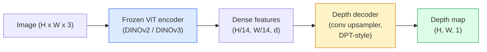

# Profondeur monoculaire et estimation géométrique

> La carte de profondeur est une image à travers une seule voie, dont chaque pixel indique la distance de la caméra. Dans le passé, si aucun stéréo ou LiDAR ne se produit, il est considéré comme impossible de le faire.

**类型：**构建 + 使用
**语言：**Python
**前置要求：**Leur capacité de vision est de 14 heures, la phase 4 est de 17 heures (vision auto-supervisée), la phase 4 est de 07 heures (U-Net).
**时间：**À environ 60 minutes.

## Objectif de l'apprentissage

- 区分 relative depth 和 metric depth,并说明每个生产级模型(MiDaS, Marigold, Depth Anything V3, ZoeDepth) résoudre est quel type
- Utilisation de la profondeur Quelque chose V3(DINOv2 colonne vertébrale) dans le cas de l'étalonnage sans besoin, pour une profondeur prévisionnelle de l'image
- 解释为什么单张图像中形成的单张图像从单张图像中成立的视角线索,纹理梯度,先验学历),以及它无法恢复什么,以及它无法恢复什么,以及它无法恢复什么,以及它无法恢复什么,以及它无法恢复什么,以及它无法恢复什么,以及它无法恢复什么,以及它不能恢复什么,以及它不能恢复什么,以及它不能恢复什么,以及它不能恢复什么,以及它不能恢复什么,以及它不能恢复什么,以及它不能恢复什么,它不能恢复什么,它不能恢复什么,它不能恢复什么,它不能恢复什么,它不能恢复什么,它不能恢复什么,它不能恢复什么,它不能恢复什么,它不能恢复什么,它不能改变什么,它不能改变什么,它不能改变它,它不能改变它,它不能改变它,它不能改变它,它不能改变它不能改变它,它不能改变它,它不能改变它不能改变它,它不能改变它不能改变它.
- Utiliser une carte de profondeur et des intrinsèques de la caméra à pinhole pour détecter en 2D

##  problématique

La profondeur est l'axe de la vision informatique 2D. Donnée RGB, vous savez où les objets apparaissent dans le plan d'image; mais vous ne savez pas combien de distance ils sont. Les capteurs de profondeur peuvent résoudre directement ce problème, mais ils sont chers, fragiles et la portée est limitée.

L'estimation de la profondeur monoculaire, à savoir de la seule pièce de cadre RGB  prédiction de la profondeur, a été habituellement produite模糊且不可靠的输出──到2026年, les encoders pré-entraînés ont modifié ce point: la profondeur de tout V3 使用结的DINOv2 spine,并生成能够泛化到室内、室外、医学和卫星域的深度地图──Marigold va重新表述为条件扩散问题──ZoeDepth 回归真实的米特里距离──

La profondeur est aussi le pont entre la détection 2D et la compréhension 3D: les pixels de la boîte détectée seront multipliés par la profondeur, vous pouvez faire de l'objet 2D un nuage de points 3D.

## 概念

### Profondeur relative par rapport à la métrique

- **Relative depth** 没有真世界单位的序列 `z`Les valeurs A sont plus proches que celles de B, mais le rapport de distance n'est pas déterminé à l'intérieur de la longueur de mètre.
- **Metric depth** Événement ≈ Métrages de distance absolue ≈ Requête modèle  Apprendre à comprendre les indices d'image et la relation statistique entre la distance réelle ≈

MiDaS 和 Depth Anything V3 生成 relatifs profondeur。Marigold 生成 relatifs profondeur。ZoeDepth、UniDepth 和 Metric3D 生成 métriques profondeur。Models métriques à l'intérieur de la caméra 敏感;relative models 则不敏感。

### Enchanteur- décodeur 模式



Depth Anything V3 结 encodeur, seulement entraîner DPT-style décodeur。encodeur  fournir de riches fonctionnalités; décodeur va ces fonctionnalités 插值回图像分辨率,并回归深度。

### Pourquoi une seule image peut-elle produire de la profondeur ?

Une image 2D contient de nombreux indices monoculaires liés à la profondeur:

- **Perspective** 3D en milieu de ligne en milieu de 2D
- **Texture gradient**La surface de la région est plus petite et plus dense.
- **Occlusion order**Les objets les plus proches couvriraient les plus éloignés.
- **Size constancy** 已知物体 (autos, humains) fournir une échelle proche de la même.
- **Atmospheric perspective**Dans les scènes extérieures, les objets éloignés semblent plus...

Les données suffisamment nombreuses, la colonne vertébrale suffisamment forte, la profondeur monoculaire, même sans surveillance 3D évidente, peuvent également atteindre une précision raisonnable.

### La profondeur monoculaire ne peut rien faire

- 时无内在或场景中的已知物体 时, impossible à obtenir **absolute metric scale** réseau peut prévoir cup  distance est deux fois la cuillère , mais ne savez pas si la coupe est 1 m ou 10 m 
- **Occluded geometry**Le dos de la chaise est invisible, impossible à déterminer.
- **真正无 texture / reflective surfaces** miroirs, verre, murs uniformes, réseau, rapports qui semblent raisonnables mais à tort profonds.

### 2026 année de profondeur tout V3

- Utilisation de l'encodeur DINOv2 ViT-L/14
- Décoder DPT
- En plus de la cohérence photométrique, il n'y a pas besoin de surveillance de profondeur évidente)
- 能够从 **任意数量的 visual inputs 中预测空间一致的 geometry，无论是否已知 camera poses**Il y a une autre.
- Dans la profondeur monoculaire, la géométrie de toute vue, le rendu visuel, l'estimation de la pose de la caméra, on atteint le SOTA.

C'est un modèle de dépôt en 2026 qui doit être utilisé en profondeur.

### Marigold  utilise la profondeur de la diffusion

Marigold(Ke et al., CVPR 2024) va évaluer la profondeur 重新表述为条件图像-to-image diffusion。Conditioning:RGB。Target:depth map。Utilisation de cartes de profondeur pré-entraînées Stable Diffusion 2 U-Net 作为骨干──输出深度maps 在对象边界 处格外清晰──权衡:inference比 feed-forward models 更慢(10-50 个 个指责步骤)。

### L'intrinsèque et la caméra à pinhole

Il faut que ça soit profond.`d`      `(u, v)`提升为摄像机坐标 中的3D点 `(X, Y, Z)`- Le numéro de la liste:

```
fx, fy, cx, cy = camera intrinsics
X = (u - cx) * d / fx
Y = (v - cy) * d / fy
Z = d
```

Intrinsèques provenant des métadonnées EXIF, des modèles de calibration, ou des estimateurs intrinsèques monoculaires ((Perspective Fields, UniDepth) .

### Évaluation

∆ Deux critères métriques:

- **AbsRel**(erreur relative absolue):`mean(|d_pred - d_gt| / d_gt)` Les modèles de production sont généralement de 0,05-0,1 ⋅
- **delta < 1.25**(exactitude du seuil): satisfaction `max(d_pred/d_gt, d_gt/d_pred) < 1.25`Les pixels sont généralement de 0,9+.

Pour la profondeur relative de la mesure, utilisez la version invariante de l'échelle et du changement de ces deux mesures.


```figure
depth-sweep
```

## Construction

### 步骤 1: Mesures de profondeur

```python
import torch

def abs_rel_error(pred, target, mask=None):
    if mask is not None:
        pred = pred[mask]
        target = target[mask]
    return (torch.abs(pred - target) / target.clamp(min=1e-6)).mean().item()


def delta_accuracy(pred, target, threshold=1.25, mask=None):
    if mask is not None:
        pred = pred[mask]
        target = target[mask]
    ratio = torch.maximum(pred / target.clamp(min=1e-6), target / pred.clamp(min=1e-6))
    return (ratio < threshold).float().mean().item()
```

Dans l'évaluation, il est toujours possible de trouver des pixels de profondeur non efficaces.

### 步骤 2: alignement de l'échelle et du changement

Pour les modèles de profondeur relative, les métriques de calcul prévoient la vérité à la base.`a * pred + b = target`Faire les cadres les plus petits:

```python
def align_scale_shift(pred, target, mask=None):
    if mask is not None:
        p = pred[mask]
        t = target[mask]
    else:
        p = pred.flatten()
        t = target.flatten()
    A = torch.stack([p, torch.ones_like(p)], dim=1)
    coeffs, *_ = torch.linalg.lstsq(A, t.unsqueeze(-1))
    a, b = coeffs[:2, 0]
    return a * pred + b
```

Dans le cadre de l'évaluation de la mi-da-s / profondeur de tout`align_scale_shift`, re运行 `abs_rel_error`Il y a une autre.

### Étape 3: Élever la profondeur à la nuée de points

```python
import numpy as np

def depth_to_point_cloud(depth, intrinsics):
    H, W = depth.shape
    fx, fy, cx, cy = intrinsics
    v, u = np.meshgrid(np.arange(H), np.arange(W), indexing="ij")
    z = depth
    x = (u - cx) * z / fx
    y = (v - cy) * z / fy
    return np.stack([x, y, z], axis=-1)


depth = np.random.uniform(0.5, 4.0, (240, 320))
intr = (320.0, 320.0, 160.0, 120.0)
pc = depth_to_point_cloud(depth, intr)
print(f"point cloud shape: {pc.shape}  (H, W, 3)")
```

Une fonction, applicable à toutes les applications 3D-lifted。`.ply`, et ouvrir dans MeshLab ou CloudCompare.

### Étape 4: Utilisez une scène de profondeur synthétique pour faire un test de fumée

```python
def synthetic_depth(size=96):
    yy, xx = np.meshgrid(np.arange(size), np.arange(size), indexing="ij")
    # Floor: linear gradient from near (top) to far (bottom)
    depth = 1.0 + (yy / size) * 4.0
    # Box in the middle: closer
    mask = (np.abs(xx - size / 2) < size / 6) & (np.abs(yy - size * 0.6) < size / 6)
    depth[mask] = 2.0
    return depth.astype(np.float32)


gt = torch.from_numpy(synthetic_depth(96))
pred = gt + 0.3 * torch.randn_like(gt)  # simulated prediction
aligned = align_scale_shift(pred, gt)
print(f"before align  absRel = {abs_rel_error(pred, gt):.3f}")
print(f"after align   absRel = {abs_rel_error(aligned, gt):.3f}")
```

### 步骤 5: Depth Anything V3 使用方式(référence)

```python
import torch
from transformers import pipeline
from PIL import Image

pipe = pipeline(task="depth-estimation", model="LiheYoung/depth-anything-v2-large")

image = Image.open("street.jpg").convert("RGB")
out = pipe(image)
depth_np = np.array(out["depth"])
```

Je suis là.`out["depth"]`Pour la profondeur de tout V3, publié après remplacement du modèle id 即可;API 保持不变──

## Utilisation

- **Depth Anything V3**(Meta AI / ByteDance, 2024-2026)  détail de la profondeur relative de la production de la plus rapide modèle de vie à grande taille de l'épine dorsale 
- **Marigold**(ETH, 2024)  La meilleure qualité visuelle, l'inférence 慢。
- **UniDepth**(ETH, 2024) profondeur métrique,并带 caméra intrinsèques estimation。
- **ZoeDepth**(Intel, 2023)  profondeur métrique; plus ancienne, mais toujours fiable 
- **MiDaS v3.1** héritage mais stable;适合作为比较基线──

Le modèle d'intégration typique:

1. Le cadre RGB est arrivé.
2. Modèle de profondeur 生成 carte de profondeur
3. Le détecteur est une boîte.
4.  À travers la profondeur  boîte centroid 升升到3D; si il y a un nuage de point, 与其合并
5. L'occlusion de la RA, la planification du parcours, l'estimation de la taille de l'objet, le remplacement de la stéréo.

Pour l'utilisation en temps réel, la profondeur de tout V2 petit ((INT8 quantifié) sur le GPU de consommation à hauteur de 518x518 peut atteindre environ 30 fps.

## 交付

Le cours se déroule en:

- `outputs/prompt-depth-model-picker.md`                                                                                                                                                                                                                                                              
- `outputs/skill-depth-to-pointcloud.md` Une maps de profondeur  Construire des nuages de points  aptitude à traiter correctement l'intrinsèque `.ply`Il y a une autre.

## 练习

1. **（Easy）**Dans votre tableau, 10 张图像上运行 Depth Anything V2──将深度 保存为灰度 PNGs并检查──找到一个预测深度 看起来错误的对象,并解释为什么单光线线索失败──
2. **（Medium）**给定 Depth Anything V2 RGB + depth, sera amélioré en nuage point et pas utilisé `open3d`染──比较两个场景(室内/室外),并记录哪个看起来更可信──
3. **（Hard）**拍摄五对图像, chaque对只改变一个已知对象的位置 (例如, bouteille向近处移动 30 cm) ⋅ Utiliser UniDepth 在两张图像上预测的米特里深度──报告预测的距离与真实30 cm的差异──

## 关键术语

| Term | 人们常说 | 实际含义 |
|------|----------------|----------------------|
| Monocular depth | "Single-image depth" | 从一帧 RGB 进行 depth estimation，不使用 stereo 或 LiDAR |
| Relative depth | "Ordered depth" | 没有真实世界单位的有序 z-values |
| Metric depth | "Absolute distance" | 以 metres 表示的 depth；需要 calibration 或使用 metric supervision 训练的 model |
| AbsRel | "Absolute relative error" | |d_pred - d_gt| / d_gt 的平均值；标准 depth metric |
| Delta accuracy | "delta < 1.25" | prediction 位于 ground truth 25% 以内的 pixels 占比 |
| Pinhole camera | "fx, fy, cx, cy" | 用于将 (u, v, d) 提升到 (X, Y, Z) 的 camera model |
| DPT | "Dense Prediction Transformer" | 位于冻结 ViT encoders 之上的 conv-based decoder，用于 depth |
| DINOv2 backbone | "The reason it works" | 无需 depth labels 即可跨 domains 泛化的 self-supervised features |

## 延伸阅读

- [Depth Anything V3 paper page](https://depth-anything.github.io/) Utiliser le codage DINOv2 de profondeur monoculaire SOTA
- [Marigold (Ke et al., CVPR 2024)](https://marigoldmonodepth.github.io/)  Estimation de profondeur basée sur la diffusion
- [UniDepth (Piccinelli et al., 2024)](https://arxiv.org/abs/2403.18913) 带 intrinsèques de profondeur métrique
- [MiDaS v3.1 (Intel ISL)](https://github.com/isl-org/MiDaS) baseline canonique de profondeur relative
- [DINOv3 blog post (Meta)](https://ai.meta.com/blog/dinov3-self-supervised-vision-model/) 提升 la précision de profondeur de la famille des encoders
