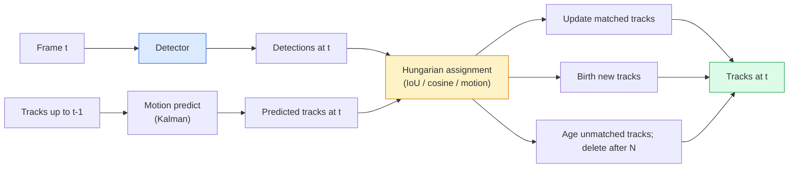

# Suivi multi-objets et mémoire vidéo

> Le suivi est la détection, la connexion, l'identification, la détection, la correspondance, la trace, la trace.

**Type:** Build
**Languages:** Python
**Prerequisites:** Phase 4 Lesson 06 (YOLO Detection), Phase 4 Lesson 08 (Mask R-CNN), Phase 4 Lesson 24 (SAM 3)
**Time:** ~60 分钟

## Objectif de l'apprentissage

- 区分 tracking-by-detection 与 query-based tracking,并说出算法家族名称(SORT, DeepSORT, ByteTrack, BoT-SORT, SAM 2 mémoire de suivi, SAM 3.1 Object Multiplex)
- De la réalisation de l'UIO + mission hongroise, pour le suivi par détection classique
- Expliquer la banque de mémoire SAM 2 et pourquoi elle est plus capable de traiter l'occlusion que l'association basée sur l'IoU
- 读懂三种跟踪指标(MOTA, IDF1, HOTA),并为给定使用案例 选择最重要的一项

##  problématique

Le détecteur vous dira où sont les objets.`t`Le centre de détection et le cadre`t-1`Une détection intermédiaire est le même objet. Sans cela, vous ne pouvez pas compter le nombre d'objets qui traversent une ligne, ne pouvez pas continuer à suivre une boule dans l'occlusion, vous ne pouvez pas non plus savoir que la voiture n° 4 est déjà en route.

Le suivi de chaque produit vidéo est essentiel: analyse sportive, surveillance, conduite autonome, analyse vidéo médicale, surveillance de la faune, comptage de mots.

L'année 2026 a apporté deux nouveaux modèles:**SAM 2 memory-based tracking**(Uz caractéristique-mémoire 替代 motion-model association)**SAM 3.1 Object Multiplex**(pour plusieurs instances du même concept de mémoire commune)

## 核心概念

### Tracking par détection



Chaque tracker que vous rencontrerez en 2026 est une variante de ce cycle.

- **SORT**(2016): Filtre Kalman + IoU Hongrois。简单、快速, aucun modèle d'apparence。
- **DeepSORT**(2017): SORT + chaque piste Une fonctionnalité d'apparence basée sur CNN (ReID Embedding)
- **ByteTrack**(2021): la détection de faible confiance est associée à la deuxième phase; elle n'a pas besoin de caractéristiques d'apparence, mais elle est la première à avoir fait ses preuves dans le MOT17.
- **BoT-SORT**(2022): Byte + compensation du mouvement de la caméra + ReID。
- **StrongSORT / OC-SORT** Le mode de suivi de ByteTrack, avec un meilleur mouvement et une meilleure apparence―

### Un mot pour comprendre Kalman filtre

Filtre Kalman pour chaque piste  Maintenir un état de covariance `(x, y, w, h, dx, dy, dw, dh)`Il utilise d'abord un modèle à vitesse constante.**predict**- Alors, avec la détection correspondante.**update** L'incertitude de la prédiction est plus élevée, la détection actuelle apparaît.

Chaque traceur classique est en phase de prévision de mouvement. Utilisez le filtre Kalman.

### Algoritme hongrois

Je vous en donne une .`M x N`Matrice de coûts (traces x détections), chercher faire le total coût, la plus petite tâche à faire, le coût est généralement`1 - IoU(track_bbox, detection_bbox)`, ou des caractéristiques d'apparence de la similitude cosine négative. Le temps de fonctionnement est O(((M+N) ^3);`scipy.optimize.linear_sum_assignment`Dans Python, assez rapide.

### Les principaux aspects de ByteTrack

标准trackers 会丢弃低置信度 détections(< 0.5)。ByteTrack 会保留它们作为 **second-stage candidates**Les traces seront d'abord adaptées aux détections de haute confiance, puis les traces non correspondantes seront utilisées avec un seuil de l'UIO légèrement plus large.

### SAM 2 suivi basé sur la mémoire

SAM 2                                                                                                                                                                                                                                                                                                                                                                                                                                                                                                                            **memory bank**Pour traiter le vidéo, il est donné un prompt sur une certaine image, puis il va encoder l'instance dans la mémoire.

没有 Kalman filter,也没有匈牙利任务──Association 隐含在记忆-注意中──

优点:
- Pour les occlusions de grande portée 鲁棒(mémoire 会跨多携带实例身份)
- Avec SAM 3 des textes de demande 结合时支持开放词库──
- 无需单独的运动模型──

缺点:
- Pour le suivi de plusieurs objets, plus lent que le ByteTrack.
- Banque de mémoire 会增长; fenêtre de contexte 受限──

### SAM 3.1 Objet multiplex

Le suivi SAM 2 / SAM 3 de chaque instance contient 50 objets, et ce sont 50 objets.**per-instance query tokens**Le coût de la mémoire partagée augmente en fonction des cas.

Le complexe est le nouveau choix du suivi de la foule en 2026: les foules de concert, les travailleurs des entrepôts, les intersections de la circulation.

### 需要掌握的三种计量

- **MOTA (Multi-Object Tracking Accuracy)** 1 - (FN + FP + ID switches) / GT。 selon le type d'erreur 加权; il s'agit d'une seule métrique 混合的将检测和关联失误──
- **IDF1 (ID F1)** La précision de l'ID et la moyenne harmonieuse du rappel.  Focus mesurer chaque piste de vérité de base dans le temps pour maintenir son ID.
- **HOTA (Higher Order Tracking Accuracy)** 分解为检测精度 (DetA) et association accuracy (AssA) ⋅ depuis 2020 ⋅社区标准;最全面⋅

对于监视(qui est qui):报告 IDF1──对体育分析(counting passes):HOTA──对一般学术比较:HOTA──


```figure
cv3-track-assoc
```

## - Je le construis.

### Étape 1: Matrice de coûts basée sur l'UIO

```python
import numpy as np


def bbox_iou(a, b):
    """
    a, b: [x1, y1, x2, y2] 的 (N, 4) arrays。
    返回 (N_a, N_b) IoU matrix。
    """
    ax1, ay1, ax2, ay2 = a[:, 0], a[:, 1], a[:, 2], a[:, 3]
    bx1, by1, bx2, by2 = b[:, 0], b[:, 1], b[:, 2], b[:, 3]
    inter_x1 = np.maximum(ax1[:, None], bx1[None, :])
    inter_y1 = np.maximum(ay1[:, None], by1[None, :])
    inter_x2 = np.minimum(ax2[:, None], bx2[None, :])
    inter_y2 = np.minimum(ay2[:, None], by2[None, :])
    inter = np.clip(inter_x2 - inter_x1, 0, None) * np.clip(inter_y2 - inter_y1, 0, None)
    area_a = (ax2 - ax1) * (ay2 - ay1)
    area_b = (bx2 - bx1) * (by2 - by1)
    union = area_a[:, None] + area_b[None, :] - inter
    return inter / np.clip(union, 1e-8, None)
```

### 步骤 2: le dernier type de suivi

Pour simplifier, Kalman prévoit une vitesse constante; ici utilise une association simple avec l'UIO; dans un environnement de production, Kalman prévoit un élément indispensable.`sort`Le paquet Python fournit une version complète.

```python
from scipy.optimize import linear_sum_assignment


class Track:
    def __init__(self, tid, bbox, frame):
        self.id = tid
        self.bbox = bbox
        self.last_frame = frame
        self.hits = 1

    def update(self, bbox, frame):
        self.bbox = bbox
        self.last_frame = frame
        self.hits += 1


class SimpleTracker:
    def __init__(self, iou_threshold=0.3, max_age=5):
        self.tracks = []
        self.next_id = 1
        self.iou_threshold = iou_threshold
        self.max_age = max_age

    def step(self, detections, frame):
        if not self.tracks:
            for d in detections:
                self.tracks.append(Track(self.next_id, d, frame))
                self.next_id += 1
            return [(t.id, t.bbox) for t in self.tracks]

        track_boxes = np.array([t.bbox for t in self.tracks])
        det_boxes = np.array(detections) if len(detections) else np.empty((0, 4))

        iou = bbox_iou(track_boxes, det_boxes) if len(det_boxes) else np.zeros((len(track_boxes), 0))
        cost = 1 - iou
        cost[iou < self.iou_threshold] = 1e6

        matched_track = set()
        matched_det = set()
        if cost.size > 0:
            row, col = linear_sum_assignment(cost)
            for r, c in zip(row, col):
                if cost[r, c] < 1.0:
                    self.tracks[r].update(det_boxes[c], frame)
                    matched_track.add(r); matched_det.add(c)

        for i, d in enumerate(det_boxes):
            if i not in matched_det:
                self.tracks.append(Track(self.next_id, d, frame))
                self.next_id += 1

        self.tracks = [t for t in self.tracks if frame - t.last_frame <= self.max_age]
        return [(t.id, t.bbox) for t in self.tracks]
```

60 行──Reception de détections par cadre, retour par cadre de piste ID──真实系统还会加入Kalman predict、ByteTrack de la deuxième étape de re-match, ainsi que les caractéristiques d'apparence──

### 步骤 3: Test de trajectoire synthétique

```python
def synthetic_frames(num_frames=20, num_objects=3, H=240, W=320, seed=0):
    rng = np.random.default_rng(seed)
    starts = rng.uniform(20, 200, size=(num_objects, 2))
    velocities = rng.uniform(-5, 5, size=(num_objects, 2))
    frames = []
    for f in range(num_frames):
        dets = []
        for i in range(num_objects):
            cx, cy = starts[i] + f * velocities[i]
            dets.append([cx - 10, cy - 10, cx + 10, cy + 10])
        frames.append(dets)
    return frames


tracker = SimpleTracker()
for f, dets in enumerate(synthetic_frames()):
    tracks = tracker.step(dets, f)
```

Trois objets situés dans un mouvement direct devraient pouvoir conserver leur identité dans l'ensemble des 20 .

### 步骤 4: métrique de commutateur d'identification

```python
def count_id_switches(tracks_per_frame, gt_per_frame):
    """
    tracks_per_frame:  list of list of (track_id, bbox)
    gt_per_frame:      list of list of (gt_id, bbox)
    返回 ID switches 的数量。
    """
    prev_assignment = {}
    switches = 0
    for tracks, gts in zip(tracks_per_frame, gt_per_frame):
        if not tracks or not gts:
            continue
        t_boxes = np.array([b for _, b in tracks])
        g_boxes = np.array([b for _, b in gts])
        iou = bbox_iou(g_boxes, t_boxes)
        for g_idx, (gt_id, _) in enumerate(gts):
            j = iou[g_idx].argmax()
            if iou[g_idx, j] > 0.5:
                t_id = tracks[j][0]
                if gt_id in prev_assignment and prev_assignment[gt_id] != t_id:
                    switches += 1
                prev_assignment[gt_id] = t_id
    return switches
```

Ceci est une méthode simplifiée, proche de la IDF1: statistique d'un objet de vérité de base en changeant le nombre de fois de piste prévue attribuée.`py-motmetrics`et `TrackEval`Dans le centre.

## Utilisez-le

Traqueurs de production de 2026:

- `ultralytics` YOLOv8 + 内置 ByteTrack / BoT-SORT`results = model.track(source, tracker="bytetrack.yaml")`Il est très important de savoir ce que vous voulez.
- `supervision`(Roboflow)  Enveloppes ByteTrack plus les outils d'annotation。
- SAM 2 / SAM 3.1  通过 `processor.track()` effectuer un suivi basé sur la mémoire。
- Stack personnalisé: détecteur (YOLOv8 / RT-DETR) + `sort-tracker`- Je suis là .`OC-SORT`- Je suis là .`StrongSORT`Il y a une autre.

选择方式:

- 30+ fps. Les piétons / voitures / boîtes:**ByteTrack with ultralytics**Il y a une autre.
- Un grand nombre d'exemples de la population:**SAM 3.1 Object Multiplex**Il y a une autre.
- Des occlusions lourdes avec une apparence reconnaissable:**DeepSORT / StrongSORT**(Faches de réidentification)
- Sports / interactions complexes:**BoT-SORT**Ou des traqueurs apprentis

## Je le livre.

Le cours est ouvert à:

- `outputs/prompt-tracker-picker.md`   selon le type de scène、les modèles d'occlusion 和 le budget de latence 选择 SORT / ByteTrack / BoT-SORT / SAM 2 / SAM 3.1。
- `outputs/skill-mot-evaluator.md` 编写一个完整的评估带,用于针对地面真相轨迹 评估MOTA / IDF1 / HOTA。

## 练习

1. **(Easy)**Utilisez le tracker synthétique ci-dessus pour séparer les 3、10 et 30 objets. Rapporte le nombre de commutateurs d'identification dans chaque cas.
2. **(Medium)**Dans l'association 之前加入常速 Kalman prédiction step──展示短暂(2-3 )
3. **(Hard)**集成 SAM 2 ' un tracker basé sur la mémoire`transformers`) comme backend de suivi alternatif. On peut utiliser le simple tracker et le SAM 2 en même temps.

## 关键术语

| Term | 常见说法 | 实际含义 |
|------|----------------|----------------------|
| Tracking-by-detection | “先 detect 再 associate” | Per-frame detector + 基于 IoU / appearance 的 Hungarian assignment |
| Kalman filter | “Motion predict” | Linear dynamics + covariance，用于平滑 track predictions 和处理 occlusion |
| Hungarian algorithm | “Optimal assignment” | 求解 minimum-cost bipartite matching 问题；`scipy.optimize.linear_sum_assignment` |
| ByteTrack | “低置信度 second pass” | 将未匹配 tracks 重新匹配到低置信度 detections，以恢复短暂 occlusions |
| DeepSORT | “SORT + appearance” | 添加 ReID feature 用于跨帧匹配；更利于保持 ID |
| Memory bank | “SAM 2 trick” | 跨帧存储的 per-instance spatio-temporal features；cross-attention 替代显式 association |
| Object Multiplex | “SAM 3.1 shared memory” | 使用带 per-instance queries 的单一 shared memory，实现快速 many-object tracking |
| HOTA | “现代 tracking metric” | 分解为 detection 和 association accuracy；社区标准 |

## 延伸阅读

- [SORT (Bewley et al., 2016)](https://arxiv.org/abs/1602.00763)  最小 suivi par détection 论文
- [DeepSORT (Wojke et al., 2017)](https://arxiv.org/abs/1703.07402) 添加 fonctionnalité d'apparence
- [ByteTrack (Zhang et al., 2022)](https://arxiv.org/abs/2110.06864) 低置信度 deuxième passe
- [BoT-SORT (Aharon et al., 2022)](https://arxiv.org/abs/2206.14651) compensation du mouvement de la caméra
- [HOTA (Luiten et al., 2020)](https://arxiv.org/abs/2009.07736) 分解式 métrique de suivi
- [SAM 2 video segmentation (Meta, 2024)](https://ai.meta.com/sam2/) Tracker basé sur la mémoire
- [SAM 3.1 Object Multiplex (Meta, March 2026)](https://ai.meta.com/blog/segment-anything-model-3/)
