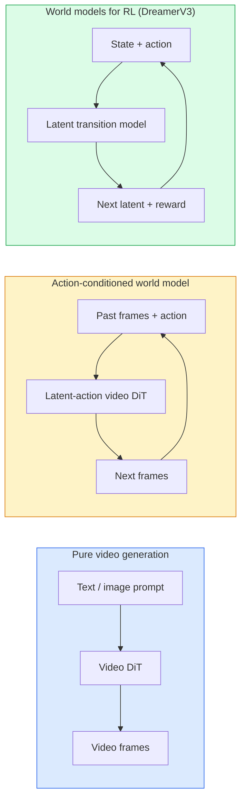

# Modèles mondiaux et diffusion vidéo

> Un modèle vidéo capable de prédire des scènes de quelques secondes à venir, c'est un simulateur de monde.

**Type:** Learn + Build
**Languages:** Python
**Prerequisites:** Phase 4 Lesson 10 (Diffusion), Phase 4 Lesson 12 (Video Understanding), Phase 4 Lesson 23 (DiT + Rectified Flow)
**Time:** ~75 分钟

## Objectif de l'apprentissage
- 解释纯视频生成模型(Sora 2) et le modèle mondial conditionné à l'action(Genie 3, DreamerV3)
-  description vidéo DiT: patchs spatio-temporaux  3D de position de codage 跨 `(T, H, W)`les jetons de l'attention commune
- 追踪 World Model 如何接入机器人:VLM 规划 → modèle vidéo 模拟 → dynamique inverse 输出动作
- 针对给定使用案例 ((creative video、interactive sim、autonome-driving synthesis) 在 Sora 2、Genie 3、Runway GWM-1 Worlds、Wan-Video 和 HunyuanVideo 之间做选择

##  problématique
视频生成和世界模型在2026年走向融合──一个能够生成连连连一分钟视频的模型, dans un certain sens, a déjà appris comment le monde se déplace: la permanence de l'objet, la gravité, la causalité, le style── si vous mettez cette prédiction en conditionnement dans l'action, le modèle vidéo deviendra un simulateur appréciable, peut remplacer le moteur de jeu, le simulateur de conduite ou l'environnement robotique──

Son impact est très spécifique. Genie 3 peut être utilisé à partir d'une seule image générant un environnement jouable. Runway GWM-1 Worlds  Synthèse sans limite  Scénarios explorables. Sora 2 生成带有同步音频和建模物理效果一分钟视频. NVIDIA Cosmos-Drive、Wayve Gaia-2 和 Tesla DrivingWorld 作为自动驾驶车训练数据 生成真实驾驶视频.

Ce cours est le cours de la phase 4 de la formation en images, vidéo et logique agencée, lié à la recherche principale sur les modèles d'architecture en cours de transition.

## 概念
### Le modèle mondial des trois classes



- **Sora 2**Il n'y a pas de connexion vidéo. Vous ne pouvez pas la contrôler en cours de déploiement.
- **Genie 3**- Je suis là.**GWM-1 Worlds**- Je suis là.**Mirage / Magica**Les modèles de monde sont conditionnés par l'action. Ils se basent sur des actions latentes dans les vidéos d'observation, puis se prévoient à l'action.
- **DreamerV3**和经典 RL World Model 家族 effectuer une prédiction dans l'espace latent,并带有显式行动条件, basé sur le signal de récompense 训练――视觉性较弱; mais pour RL plus efficace échantillon更有用――

### Architcture vidéo

```
Video latent:          (C, T, H, W)
Patchify (spatial):    grid of P_h x P_w patches per frame
Patchify (temporal):   group P_t frames into a temporal patch
Resulting tokens:      (T / P_t) * (H / P_h) * (W / P_w) tokens
```

Le codage positionnel est 3D: pour chaque personne`(t, h, w)`坐标使用 rotary 或 learning embedding──Attention peut être:

- **Full joint** Tous les jetons attendent tous les jetons。 Pour N 个 token ≠ O(N^2)。 Pour长视频来说代价过高。
- **Divided** 交替执行 temporal attention  la même position spatiale 跨时间:`(H*W) * T^2`) et l'attention spatiale( le même temps 、 traverses espaces:`T * (H*W)^2`La plupart des artistes utilisent cette méthode.
- **Window**- Je suis là.`(t, h, w)`Dans les fenêtres de la salle de bain, les vidéos sont utilisées de cette façon.

Chaque modèle de diffusion vidéo de 2026 utilisera l'un de ces trois modes, en plus du conditionnement AdaLN (leçon 23) et du flux rectifié (réctifié).

### 基于动作的 Conditionnement:modèles d'action latents

Génie 通过判别式地预测一对连续之间的动作,为每一学习一个 **latent action** puis le décodeur du modèle est conditionné par l'action latente de la conclusion, plutôt que par le clavier de la clé.

Sora a complètement sauté l'interface de décodeur de l'espace-temps passé. Prédire l'espace-temps suivant.

### Plausibilité physique

Sora 2 a été publié en 2026 .**physical plausibility**: pesage, équilibre, permanence de l'objet, cause et effet, évaluation des scores de plausibilité de l'équipe par l'évaluation artificielle, comparable à Sora 1, le modèle a connu des améliorations évidentes dans les scènes de chute d'objet, de collision de rôle et de défaillance intentionnelle (une fois sans succès).

La plausibilité est toujours un modèle défaillant. Les vidéos de 2024-2025 exposent le problème du manque de représentation d'objets durables. Les vidéos de 2024-2025 ont réduit ces problèmes, mais n'ont pas été éliminées.

### Modèles mondiaux autonomes

Les modèles de conduite mondial seront générés sur la base de trajectoires, de boîtes de bord ou de cartes de navigation, en termes de conditions.

- **Cosmos-Drive-Dreams**(NVIDIA)  Pour l'entraînement RL 生成数分钟驾驶视频。
- **Gaia-2**(Wayve)  Utilisé pour la synthèse de scènes conditionnées par la trajectoire de l'évaluation des politiques。
- **DrivingWorld**(Tesla)  模拟多样气, heure de la journée 和交通条件──
- **Vista**(ByteDance)  响应式驾驶场景合成──

Ils ont remplacé la collecte de données du monde réel coûteuse, pour couvrir les cas de coin, par exemple les types de véhicules rares ou les types de véhicules rares; sinon, ces situations nécessitent des millions de miles de conduite pour les collecter.

### 机器人技术:VLM + modèle vidéo + dynamique inverse

Trois composants de la boucle robotique sont en cours d'émergence:

1. **VLM**解析目标(拿起红色杯子), planifier une séquence d'action de haut niveau。
2. **Video generation model**模拟执行每个动作会是什么样子,预测未来 N observations。
3. **Inverse dynamics model**提取会产生 these observations de commandes motrices spécifiques.

Ceci a remplacé la récompense et la RL lourde en échantillons. Le modèle mondial est responsable de l'imagination; la dynamique inverse est en train d'être mise en œuvre à un niveau clos.

### Évaluation

- **Visual quality** FVD (Fréchet Video Distance) 、étude utilisateur。
- **Prompt alignment** Chaque évaluation de CLIPScore  VQA
- **Physical plausibility** Dans la suite de benchmarks 上人工评分(Sora 2's internal benchmark、VBench)
- **Controllability**(à l'intention de modèles de monde interactifs)  action → cohérence d'observation;

### Modèle de l'année 2026

| Model | Use | Parameters | Output | License |
|-------|-----|------------|--------|---------|
| Sora 2 | text-to-video, audio | — | 1-min 1080p + audio | API only |
| Runway Gen-5 | text/image-to-video | — | 10s clips | API |
| Runway GWM-1 Worlds | interactive world | — | infinite 3D rollout | API |
| Genie 3 | interactive world from image | 11B+ | playable frames | research preview |
| Wan-Video 2.1 | open text-to-video | 14B | high-quality clips | non-commercial |
| HunyuanVideo | open text-to-video | 13B | 10s clips | permissive |
| Cosmos / Cosmos-Drive | autonomous driving sim | 7-14B | driving scenes | NVIDIA open |
| Magica / Mirage 2 | AI-native game engine | — | modifiable worlds | product |


```figure
v4-world-rollout
```

## - Je le construis.
### 步骤 1: patch vidéo en 3D

```python
import torch
import torch.nn as nn


class VideoPatch3D(nn.Module):
    def __init__(self, in_channels=4, dim=64, patch_t=2, patch_h=2, patch_w=2):
        super().__init__()
        self.proj = nn.Conv3d(
            in_channels, dim,
            kernel_size=(patch_t, patch_h, patch_w),
            stride=(patch_t, patch_h, patch_w),
        )
        self.patch_t = patch_t
        self.patch_h = patch_h
        self.patch_w = patch_w

    def forward(self, x):
        # x: (N, C, T, H, W)
        x = self.proj(x)
        n, c, t, h, w = x.shape
        tokens = x.reshape(n, c, t * h * w).transpose(1, 2)
        return tokens, (t, h, w)
```

Une étape ressemble à la conve 3D du noyau.`(T, H, W) -> (T/2, H/2, W/2)`Les jetons sont en ligne.

### 步骤 2: Codification de position rotative en 3D

Embeddings de position rotative (RoPE) 分别沿 `t`- Je suis là.`h`- Je suis là.`w`轴应用:

```python
def rope_3d(tokens, t_dim, h_dim, w_dim, grid):
    """
    tokens: (N, T*H*W, D)
    grid: (T, H, W) sizes
    t_dim + h_dim + w_dim == D
    """
    T, H, W = grid
    n, seq, d = tokens.shape
    if t_dim + h_dim + w_dim != d:
        raise ValueError(f"t_dim+h_dim+w_dim ({t_dim}+{h_dim}+{w_dim}) must equal D={d}")
    assert seq == T * H * W
    t_idx = torch.arange(T, device=tokens.device).repeat_interleave(H * W)
    h_idx = torch.arange(H, device=tokens.device).repeat_interleave(W).repeat(T)
    w_idx = torch.arange(W, device=tokens.device).repeat(T * H)
    # Simplified: just scale channels by frequencies. Real RoPE rotates pairs.
    freqs_t = torch.exp(-torch.log(torch.tensor(10000.0)) * torch.arange(t_dim // 2, device=tokens.device) / (t_dim // 2))
    freqs_h = torch.exp(-torch.log(torch.tensor(10000.0)) * torch.arange(h_dim // 2, device=tokens.device) / (h_dim // 2))
    freqs_w = torch.exp(-torch.log(torch.tensor(10000.0)) * torch.arange(w_dim // 2, device=tokens.device) / (w_dim // 2))
    emb_t = torch.cat([torch.sin(t_idx[:, None] * freqs_t), torch.cos(t_idx[:, None] * freqs_t)], dim=-1)
    emb_h = torch.cat([torch.sin(h_idx[:, None] * freqs_h), torch.cos(h_idx[:, None] * freqs_h)], dim=-1)
    emb_w = torch.cat([torch.sin(w_idx[:, None] * freqs_w), torch.cos(w_idx[:, None] * freqs_w)], dim=-1)
    return tokens + torch.cat([emb_t, emb_h, emb_w], dim=-1)
```

Ceci est une forme additive simplifiée.

### 步骤 3: Bloc d'attention divisé

```python
class DividedAttentionBlock(nn.Module):
    def __init__(self, dim=64, heads=2):
        super().__init__()
        self.time_attn = nn.MultiheadAttention(dim, heads, batch_first=True)
        self.space_attn = nn.MultiheadAttention(dim, heads, batch_first=True)
        self.ln1 = nn.LayerNorm(dim)
        self.ln2 = nn.LayerNorm(dim)
        self.ln3 = nn.LayerNorm(dim)
        self.mlp = nn.Sequential(nn.Linear(dim, 4 * dim), nn.GELU(), nn.Linear(4 * dim, dim))

    def forward(self, x, grid):
        T, H, W = grid
        n, seq, d = x.shape
        # time attention: same (h, w), across t
        xt = x.view(n, T, H * W, d).permute(0, 2, 1, 3).reshape(n * H * W, T, d)
        a, _ = self.time_attn(self.ln1(xt), self.ln1(xt), self.ln1(xt), need_weights=False)
        xt = (xt + a).reshape(n, H * W, T, d).permute(0, 2, 1, 3).reshape(n, seq, d)
        # space attention: same t, across (h, w)
        xs = xt.view(n, T, H * W, d).reshape(n * T, H * W, d)
        a, _ = self.space_attn(self.ln2(xs), self.ln2(xs), self.ln2(xs), need_weights=False)
        xs = (xs + a).reshape(n, T, H * W, d).reshape(n, seq, d)
        xs = xs + self.mlp(self.ln3(xs))
        return xs
```

L'attention dans le temps est une fonction de temps et d'espace.

### 步骤 4: 组合一个小视频 DiT

```python
class TinyVideoDiT(nn.Module):
    def __init__(self, in_channels=4, dim=64, depth=2, heads=2):
        super().__init__()
        self.patch = VideoPatch3D(in_channels=in_channels, dim=dim, patch_t=2, patch_h=2, patch_w=2)
        self.blocks = nn.ModuleList([DividedAttentionBlock(dim, heads) for _ in range(depth)])
        self.out = nn.Linear(dim, in_channels * 2 * 2 * 2)

    def forward(self, x):
        tokens, grid = self.patch(x)
        for blk in self.blocks:
            tokens = blk(tokens, grid)
        return self.out(tokens), grid
```

Ce n'est pas un générateur vidéo fonctionnel; c'est une démonstration structurelle, prouvant que chaque partie est en forme.

### 步骤 5: 检查 formes

```python
vid = torch.randn(1, 4, 8, 16, 16)  # (N, C, T, H, W)
model = TinyVideoDiT()
out, grid = model(vid)
print(f"input  {tuple(vid.shape)}")
print(f"tokens grid {grid}")
print(f"output {tuple(out.shape)}")
```

patching 后预期 `grid = (4, 8, 8)`且 `out = (1, 256, 32)`; tête ▌ Ensuite projeter à chaque jeton pour les patchs spatiaux-temporaux correspondants, préparer à non-patchage  回视频。

## Utilisez-le
Modèle de production de 2026:

- **Sora 2 API**(OpenAI)  texte à vidéo 同步音频── Prix de prime──
- **Runway Gen-5 / GWM-1**(Runway)  images à vidéo  mondes interactifs 
- **Wan-Video 2.1 / HunyuanVideo**                                                                                                                                                                                                                                                              
- **Cosmos / Cosmos-Drive**(NVIDIA)  Simulation de conduite avec des poids ouverts 
- **Genie 3** prévisualisation de la recherche, besoin de présenter une demande de visite

Construire une démo interactive de modèle mondial: de Wan-Video  commencer à obtenir la qualité, re-supposer un adaptateur d'action latente pour réaliser l'interaction ⋅ Pour la simulation de conduite autonome: Cosmos-Drive est une référence ouverte de 2026 ⋅

现实中的 piles de robotique:

1. Objectif de langue -> VLM (Qwen3-VL) -> plan de haut niveau。
2. Plan -> modèle vidéo d'action latente -> déploiement imaginé―
3. Rollout -> modèle de dynamique inverse -> actions à faible niveau。
4. 执行 Actions -> observations réintégrées à l'étape 1。

## Je le livre.
Le programme de formation

- `outputs/prompt-video-model-picker.md`                                                                                                                                                                                                                                                              
- `outputs/skill-physical-plausibility-checks.md` Une compétence de contrôle automatique définie (la permanence de l'objet, la gravité, la continuité) pour le contrôle de tout produit vidéo.

## 练习
1. **(Easy)**計算一个 5 秒 360p 视频在补丁-t=2、补丁-h=8、补丁-w=8 时的代币数――推理这个规模下关注的内存需求――
2. **(Medium)**Prenez le bloc d'attention divisé ci-dessus  pour le remplacer par un bloc d'attention joint complet,并测量形和参数数── expliquez pourquoi les vrais modèles vidéo 必须使用分注意──
3. **(Hard)**构建一个最小潜伏视频模型:使用 `(frame_t, action_t, frame_{t+1})`Triple numéros de données (en anglais: Triple Numbers)

## 关键术语
| Term | What people say | What it actually means |
|------|----------------|----------------------|
| World model | “Learned simulator” | 一个在给定 state 和 action 时预测未来 observations 的模型 |
| Video DiT | “Spacetime transformer” | 使用 3D patchification 和 divided attention 的 Diffusion transformer |
| Latent action | “Inferred control” | 从帧对中推断出的离散或连续 action latent；用于条件化 next-frame generation |
| Divided attention | “Time then space” | 每个 block 中的两个 attention 操作：先跨时间，再跨空间，用来让 O(N^2) 保持可控 |
| Object permanence | “Things stay real” | video models 必须学会的场景属性；在食物、玻璃器皿上的经典失败模式 |
| FVD | “Fréchet Video Distance” | FID 的视频等价物；主要 visual quality metric |
| Inverse dynamics model | “Observations to actions” | 给定 `(state, next state)`，输出连接二者的 action；闭合 robotics loop |
| Cosmos-Drive | “NVIDIA driving sim” | 用于 RL 和 evaluation 的 open-weights autonomous-driving world model |

## 延伸阅读
- [Sora technical report (OpenAI)](https://openai.com/index/video-generation-models-as-world-simulators/)
- [Genie: Generative Interactive Environments (Bruce et al., 2024)](https://arxiv.org/abs/2402.15391) Modèles de monde d'action latents
- [TimeSformer (Bertasius et al., 2021)](https://arxiv.org/abs/2102.05095) L'attention partagée des transformateurs vidéo
- [DreamerV3 (Hafner et al., 2023)](https://arxiv.org/abs/2301.04104) Utilisé sur les modèles mondiaux de RL
- [Cosmos-Drive-Dreams (NVIDIA, 2025)](https://research.nvidia.com/labs/toronto-ai/cosmos-drive-dreams/) modèle mondial de conduite
- [Top 10 Video Generation Models 2026 (DataCamp)](https://www.datacamp.com/blog/top-video-generation-models)
- [From Video Generation to World Model — survey repo](https://github.com/ziqihuangg/Awesome-From-Video-Generation-to-World-Model/)
