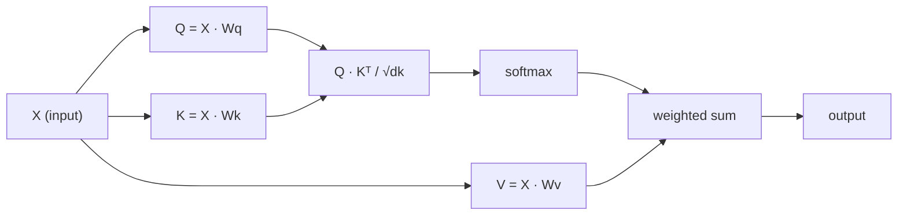

# De la réalisation de l'Autonomie

> L'attention est une feuille de questionnaire, dont chacun des mots pose la question:

**类型：**Construction
**语言：**Python
**先修要求：**Phase 3 (centre d'apprentissage profond), phase 5 leçon 10 (sequence à séquence)
**时间：**- 90 minutes

## Objectif de l'apprentissage

- 仅使用 NumPy 从零实现 la prise en compte de produit à l'échelle de la dot, y compris la requête/clés/valeur 投影和 softmax 加权求和
- Construire des couches d'attention multi-têtes, pour décomposer la tête 計算并行注意,并拼接结果
-  suivre la matrice d'attention  comment capturer Token  relation,并解释为什么除以 sqrt(d_k) peut empêcher softmax 和
-  appliquer le masquage causal,将 attention bidirectionnelle 转换为 autorégressive(décodage style) attention

##  problématique

RNNs une fois traité un Token. Lorsque vous atteignez la 50e Token, les informations provenant de la 1e Token ont été compressées 50 fois.

L'article de Bahdanau attention de 2014 présente une question plus étroite: si l'attention est le seul mécanisme ? sans récurrence ? sans convection ?

L'auto-attention  Laissez chaque position de la séquence être attendue dans chaque étape de la même ligne à chaque autre position  C'est la raison pour laquelle les transformateurs  rapides  élargibles  occupent la position dominante

## 概念

### Les données de base de données

Arrêtez-vous et imaginez une requête de base de données:

```
Traditional database:
  Query: "capital of France"  -->  exact match  -->  "Paris"

Attention:
  Query: "capital of France"  -->  similarity to ALL keys  -->  weighted blend of ALL values
```

Chaque jeton générera trois vecteurs:
- **Query (Q)**Je suis à la recherche de quoi ?
- **Key (K)**Qu'est-ce que je contiens ?
- **Value (V)**Si on est élu, que vous donnerai-je ?

Une requête avec tous les produits dot des clés aura des scores d'attention.

### Q、K、V 计算

Chaque jeton intégré sera utilisé par trois matrices de poids obtenues pour effectuer des projections:

```
Input embeddings (sequence of n tokens, each d-dimensional):

  X = [x1, x2, x3, ..., xn]       shape: (n, d)

Three weight matrices:

  Wq  shape: (d, dk)
  Wk  shape: (d, dk)
  Wv  shape: (d, dv)

Projections:

  Q = X @ Wq    shape: (n, dk)      each token's query
  K = X @ Wk    shape: (n, dk)      each token's key
  V = X @ Wv    shape: (n, dv)      each token's value
```

Pour un jeton:

```
             Wq
  x_i ------[*]------> q_i    "What am I looking for?"
       |
       |     Wk
       +----[*]------> k_i    "What do I contain?"
       |
       |     Wv
       +----[*]------> v_i    "What do I offer?"
```

### Matrice d'attention

Une fois que vous avez obtenu tous les jetons Q K V, points d'attention, vous formez une matrice:

```
Scores = Q @ K^T    shape: (n, n)

              k1    k2    k3    k4    k5
        +-----+-----+-----+-----+-----+
   q1   | 2.1 | 0.3 | 0.1 | 0.8 | 0.2 |   <- how much q1 attends to each key
        +-----+-----+-----+-----+-----+
   q2   | 0.4 | 1.9 | 0.7 | 0.1 | 0.3 |
        +-----+-----+-----+-----+-----+
   q3   | 0.2 | 0.6 | 2.3 | 0.5 | 0.1 |
        +-----+-----+-----+-----+-----+
   q4   | 0.9 | 0.1 | 0.4 | 1.7 | 0.6 |
        +-----+-----+-----+-----+-----+
   q5   | 0.1 | 0.3 | 0.2 | 0.5 | 2.0 |
        +-----+-----+-----+-----+-----+

Each row: one token's attention over the entire sequence
```

Une fois, regardez une requête Comment parcourir toutes les touches: chaque ligne donne à chaque jeton 打分,softmax, Placez les scores  en poids, tandis que le vecteur de contexte est la combinaison de valeurs 加权.

```figure
attention-matrix
```

### Pourquoi vous en voulez ?

Les produits dotés augmentent avec la dimension dk                                                                                                                                                                                                                                                          

```
Scaled scores = (Q @ K^T) / sqrt(dk)
```

Cela permettra de maintenir la valeur numérique dans la limite de la douceur maximale de pouvoir produire des gradients utiles.

### Softmax va transformer les scores en poids

Softmax 会将原始分分 转换为每一行概率分布:

```
Raw scores for q1:   [2.1, 0.3, 0.1, 0.8, 0.2]
                            |
                         softmax
                            |
Attention weights:   [0.52, 0.09, 0.07, 0.14, 0.08]   (sums to ~1.0)
```

Maintenant, chaque jeton a un groupe de poids, indiquant qu'il devrait dans une large mesure assister à chaque autre jeton.

### Value des actifs

Le résultat final de chaque jeton est l'ajout de tous les vecteurs de valeur:

```
output_i = sum( attention_weight[i][j] * v_j  for all j )

For token 1:
  output_1 = 0.52 * v1 + 0.09 * v2 + 0.07 * v3 + 0.14 * v4 + 0.08 * v5
```

### 完整流程



Une seule formule:

```
Attention(Q, K, V) = softmax( Q @ K^T / sqrt(dk) ) @ V
```

```figure
softmax-attention-scaling
```

## - Je le construis.

### 步骤 1: réaliser Softmax à partir de zéro

Softmax 会将原始logits 转换为概率──为了数值稳定性,首先减去最大值──

```python
import numpy as np

def softmax(x):
    shifted = x - np.max(x, axis=-1, keepdims=True)
    exp_x = np.exp(shifted)
    return exp_x / np.sum(exp_x, axis=-1, keepdims=True)

logits = np.array([2.0, 1.0, 0.1])
print(f"logits:  {logits}")
print(f"softmax: {softmax(logits)}")
print(f"sum:     {softmax(logits).sum():.4f}")
```

### 步骤 2:Attention à l'échelle du produit

核心函数──接收 Q、K、V matrices,并返回注意输出 和重量矩阵──

```python
def scaled_dot_product_attention(Q, K, V):
    dk = Q.shape[-1]
    scores = Q @ K.T / np.sqrt(dk)
    weights = softmax(scores)
    output = weights @ V
    return output, weights
```

### 步骤 3: avec le cours de l'auto-attention

Un module complet d'auto-attention, comprenant l'utilisation de matrices de poids Wq、Wk、Wv de dimensionnement Xavier-like initiale

```python
class SelfAttention:
    def __init__(self, d_model, dk, dv, seed=42):
        rng = np.random.default_rng(seed)
        scale = np.sqrt(2.0 / (d_model + dk))
        self.Wq = rng.normal(0, scale, (d_model, dk))
        self.Wk = rng.normal(0, scale, (d_model, dk))
        scale_v = np.sqrt(2.0 / (d_model + dv))
        self.Wv = rng.normal(0, scale_v, (d_model, dv))
        self.dk = dk

    def forward(self, X):
        Q = X @ self.Wq
        K = X @ self.Wk
        V = X @ self.Wv
        output, weights = scaled_dot_product_attention(Q, K, V)
        return output, weights
```

### 步骤 4: dans une phrase

Pour créer des faux emblèmes,并观察注意重量──

```python
sentence = ["The", "cat", "sat", "on", "the", "mat"]
n_tokens = len(sentence)
d_model = 8
dk = 4
dv = 4

rng = np.random.default_rng(42)
X = rng.normal(0, 1, (n_tokens, d_model))

attn = SelfAttention(d_model, dk, dv, seed=42)
output, weights = attn.forward(X)

print("Attention weights (each row: where that token looks):\n")
print(f"{'':>6}", end="")
for token in sentence:
    print(f"{token:>6}", end="")
print()

for i, token in enumerate(sentence):
    print(f"{token:>6}", end="")
    for j in range(n_tokens):
        w = weights[i][j]
        print(f"{w:6.3f}", end="")
    print()
```

### 步骤 5: utiliser la carte thermique ASCII 可视化 Attention

Pour obtenir des résultats visuels, vous devez être prêt à prendre en compte les poids de l'attention.

```python
def ascii_heatmap(weights, tokens, chars=" ░▒▓█"):
    n = len(tokens)
    print(f"\n{'':>6}", end="")
    for t in tokens:
        print(f"{t:>6}", end="")
    print()

    for i in range(n):
        print(f"{tokens[i]:>6}", end="")
        for j in range(n):
            level = int(weights[i][j] * (len(chars) - 1) / weights.max())
            level = min(level, len(chars) - 1)
            print(f"{'  ' + chars[level] + '   '}", end="")
        print()

ascii_heatmap(weights, sentence)
```

## Utilisez-le

PyTorch de `nn.MultiheadAttention`Ce que nous avons juste construit, en plus de cela, c'est la division multi-tête et la projection de sortie:

```python
import torch
import torch.nn as nn

d_model = 8
n_heads = 2
seq_len = 6

mha = nn.MultiheadAttention(embed_dim=d_model, num_heads=n_heads, batch_first=True)

X_torch = torch.randn(1, seq_len, d_model)

output, attn_weights = mha(X_torch, X_torch, X_torch)

print(f"Input shape:            {X_torch.shape}")
print(f"Output shape:           {output.shape}")
print(f"Attention weight shape: {attn_weights.shape}")
print(f"\nAttn weights (averaged over heads):")
print(attn_weights[0].detach().numpy().round(3))
```

关键区别:attention multi-tête 会并行运行多个注意功能, chacun a ses propres projections Q、K、V,大小为 dk = d_model / n_heads, puis拼接结果──这让模型能够同时参加到不同类型的关系──

## Je le livre.

Le cours est ouvert à:
- `outputs/prompt-attention-explainer.md`- Une requête de base de données pour expliquer Attention prompt

## 练习

1. 修改 `scaled_dot_product_attention`, laissez-le accepter une matrice de masque optionnelle, avant softmax  certain position sera définie comme négative infinie ((c'est le mode de travail du masquage de la cause / décodeur)
2. De la réalisation de l'attention multi-têtes:将 Q、K、V 拆分为 `n_heads`个块, dans chaque bloc sur le train attention,拼接,并通过最终重量矩阵 Wo 投影
3. Prenez deux phrases de la même longueur, les introduisez dans la même instance d'attention à soi, et comparez leurs modèles d'attention.

## 关键术语

| Term | 人们常说 | 实际含义 |
|------|----------------|----------------------|
| Query (Q) | “问题 Vector” | 输入的一个学习投影，表示这个 Token 正在寻找什么信息 |
| Key (K) | “标签 Vector” | 一个学习投影，表示这个 Token 包含什么信息，并会与 queries 进行匹配 |
| Value (V) | “内容 Vector” | 一个学习投影，携带会基于 attention scores 被聚合的实际信息 |
| Scaled dot-product attention | “Attention 公式” | softmax(QK^T / sqrt(dk)) @ V - 缩放可以防止高维中的 softmax 饱和 |
| Self-attention | “Token 看自己和其他 Token” | Q、K、V 都来自同一序列的 Attention，让每个位置都能 attend 到其他每个位置 |
| Attention weights | “关注程度” | 位置上的概率分布，由 scaled dot products 上的 softmax 产生 |
| Multi-head attention | “并行 Attention” | 使用不同 projections 运行多个 attention functions，然后拼接结果，以获得更丰富的 representations |

## 延伸阅读

- [Attention Is All You Need (Vaswani et al., 2017)](https://arxiv.org/abs/1706.03762)- Transformateur de première génération
- [The Illustrated Transformer (Jay Alammar)](https://jalammar.github.io/illustrated-transformer/)- La meilleure explication visuelle de l'architecture complète
- [The Annotated Transformer (Harvard NLP)](https://nlp.seas.harvard.edu/annotated-transformer/)- 带解释的逐行 PyTorch 实现
