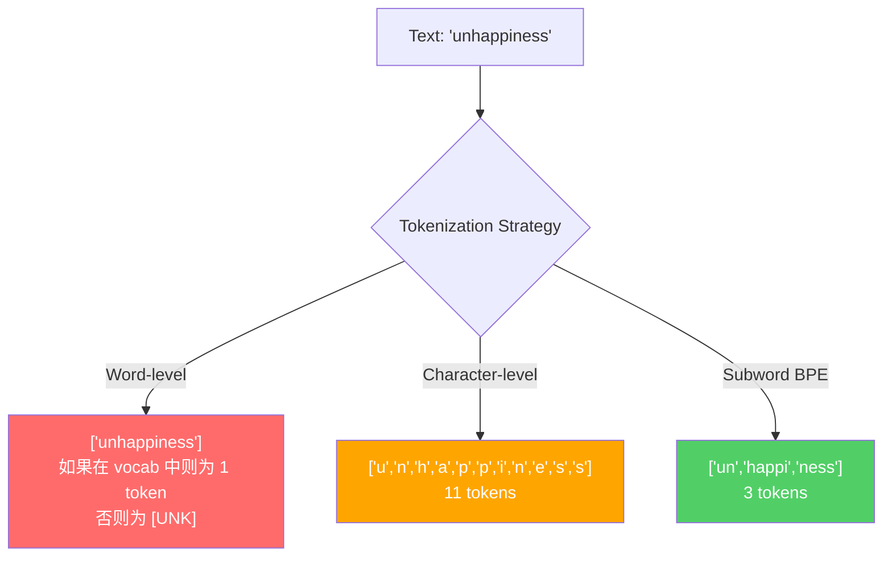
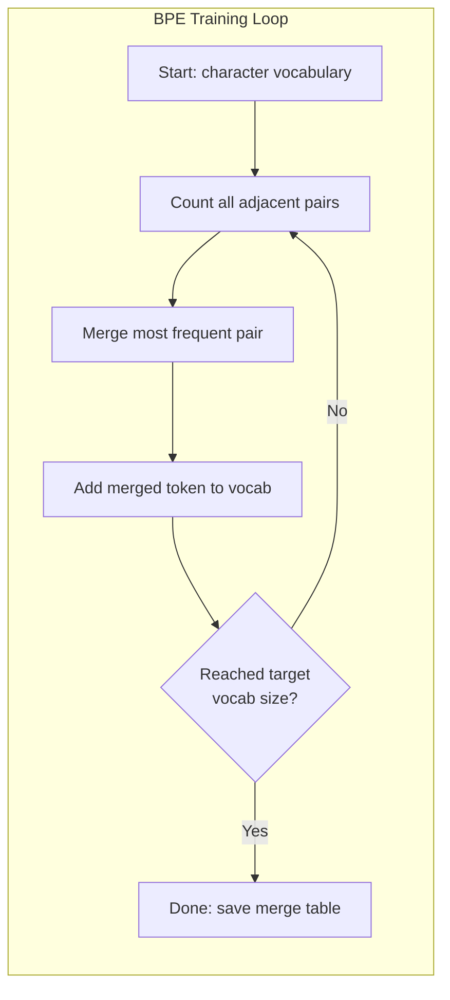
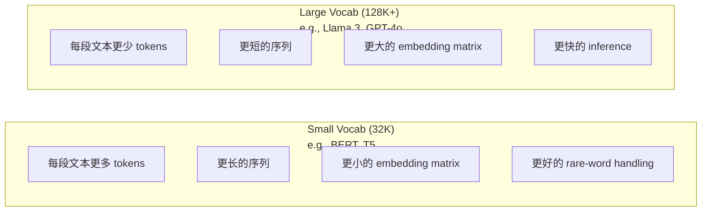

# Les symboles: BPE, WordPiece, SentencePiece

> Le Tokenizer décide que ces nombres entiers sont significatifs ou non.

**Type:** Build
**Languages:** Python
**Prerequisites:** Phase 05 (NLP Foundations)
**Time:** ~90 minutes

## Objectif de l'apprentissage
- De la réalisation de BPE, WordPiece et Unigram des algorithmes de symbolisation, et comparer leurs stratégies de fusion
- 解释词汇大小会产生长序列, 过大会浪费嵌入参数 如何影响模型效率:过小会产生长序列,过大会浪费嵌入参数
- 分析不同语言和代码中的 Tokenization artefacts, identifier des Tokenizers spécifiques Où sont-ils en panne
- Utilisez des tokens et des bibliothèques de phrases pour sélectionner des tokens et vérifier les identifiants de jetons générés

##  problématique
Votre LLM ne se lit pas en anglais.

De "Hello, world!" à [15496, 11, 995, 0] la différence entre les deux est le Tokenizer. Chaque mot, chaque espace, chaque marque doit d'abord être transformé en entier, le modèle doit le traiter. Ce changement n'est pas secondaire. Il met des hypothèses dans le modèle, mais ces hypothèses ne peuvent pas être annulées.

Si ici faire l'erreur, le modèle va gaspiller de la capacité, en utilisant plusieurs Tokens pour coder les termes habituels. "Malheureusement" deviendra quatre Tokens, et non un seul. Pour le texte densément composé de plusieurs sons, votre fenêtre de contexte 128K est en fait très réduite de 75%.

Vous avez besoin de GPT-4 ou de Claude pour chaque appel API, c'est en fonction du Token 定价―― chaque Token généré par le modèle sera consommé en calcul―.

## 概念
### 3 méthodes de défaite et 1 méthode de victoire)

Pour transformer le texte en numérique, il existe trois méthodes évidentes:

**Word-level tokenization**Le chat s'est assis et s'est assis. Il a besoin d'un énorme vocabulaire pour couvrir chaque mot de chaque langue.`[UNK]`token -- é é é é é é é é é é é é é é é é é é é é é é é é é é é é é é é é é é é é é é é é é é é é é é é é é é é é é é é é é é é é é é é é é é é é é é é é é é é é é é é é é é é é é é é é é é é é é é é é é é é é é é é é é é é é é é é é é é é é é é é é é é é é é é é é é é é é é é é é é é é é é é é é é é é é é é é é é é é é é é é é é é é é é é é é é é é é é é é é é é é é é é é é é é é é é é é é é é é é é é é é é é é é é é é é é é é é é é é é é é é é é é é é é é é é é é é é é é é é é é é é é é é é é é é é é é é é é é é é é é é é é é é é é é é é é é é é é é é é é é é é é é é é é é é é é é é é é é é é é é é é é é é é é é é é é é é é é é é é é é é é é é é é é é é é é é é é é é é é é é é é é é é é é é é é é é é é é é é é é é é é é é é é é é é é é é é é é é é é é é é é é é é é é é é é é é é é é é é é é é é é é é é é é é é é é é é é é é é é é é é é é é é é é é é é é é é é é é é é é é é é é é é é é é é é é é é é é é é é é é é é é é é é é é é é é é é é é é é é é é é é é é é é é é é é é é é é é é é é é é é é é é é é é é é é

**Character-level tokenization**走向另一个方向──"hello"会变成 ["h", "e", "l", "l", "o"]──Vocabulary 很小(几百个字符)──永远不会有未知代币──但序列会变极长──一个本来是10个字级代币的句子,会变成50个字符级代币──模型必须学会"t",、"h",、"e" 放在一起表示"the" -- 放注意能力消耗在一个人类三岁就能学会的东西上──

**Subword tokenization**找到了平衡点──常见词保持完整:"the" 是一个代币──罕见词会分解成有意义的片段:"unhappiness" 变成 ["un", "happy", "ness"]──词典 保持可控(30K到128K tokens)──序列保持较短──未知代币 基本消失,因为任何词都可以由子词组成出来──

Chaque LLM moderne utilise des sous-parts de la tokénisation.



### BPE: Codage par paire de octets

BPE est un algorithme de compression de l'esprit, utilisé plus tard pour la tokenization.

De simples caractères à partir de la formation statistique de chaque paire de mots à proximité de la langue, la paire la plus fréquente est fusionnée en un nouveau Token.

Le BPE qui fonctionne en haut est un très petit corpus, qui contient "inférieur""",inférieur" et "nouveau":

```
Corpus（带 word frequencies）:
  "lower"  x5
  "lowest" x2
  "newest" x6

Step 0 -- 从字符开始:
  l o w e r       (x5)
  l o w e s t     (x2)
  n e w e s t     (x6)

Step 1 -- 统计相邻 pairs:
  (e,s): 8    (s,t): 8    (l,o): 7    (o,w): 7
  (w,e): 13   (e,r): 5    (n,e): 6    ...

Step 2 -- Merge 最高频 pair (w,e) -> "we":
  l o we r        (x5)
  l o we s t      (x2)
  n e we s t      (x6)

Step 3 -- 重新统计并 merge (e,s) -> "es":
  l o we r        (x5)
  l o we s t      (x2)    <- 'es' 只由 'e'+'s' 形成，不是 'we'+'s'
  n e we s t      (x6)    <- 等等，'we' 前面有 'e'，'we' 后面有 's'

实际精确跟踪如下:
  在 "we" merge 之后，剩余 pairs:
  (l,o): 7   (o,we): 7   (we,r): 5   (we,s): 8
  (s,t): 8   (n,e): 6    (e,we): 6

Step 3 -- Merge (we,s) -> "wes" 或 (s,t) -> "st"（同为 8，选第一个）:
  Merge (we,s) -> "wes":
  l o we r        (x5)
  l o wes t       (x2)
  n e wes t       (x6)

Step 4 -- Merge (wes,t) -> "west":
  l o we r        (x5)
  l o west        (x2)
  n e west        (x6)

...继续，直到达到目标 vocab size。
```

La table de fusion est un Tokenizer. Il faut encoder le nouveau texte, selon l'ordre de l'application des fusions.



### BPE de niveau octal (GPT-2, GPT-3, GPT-4)

標準 BPE 在 Unicode characters 上运行──BPE de niveau octet 在原始字节(0-255) 上运行── ceci vous donnera un bon vocabulaire de base de 256 qui pourra traiter n'importe quelle langue ou codage, et ne générera jamais de jetons inconnus──

GPT-2 introduit cette méthode. Le vocabulaire de base couvre chaque type de octet possible.

- GPT-2: 50 257 jetons
- GPT-3.5/GPT-4: ~100,256 jetons (encoding cl100k_base)
- GPT-4o: 200 019 jetons (encoding de base de 200 k)

### Le code de référence

WordPiece ressemble à BPE, mais la méthode de fusion de sélection est différente. Il n'utilise pas la fréquence initiale, mais maximiser la probabilité de formation des données:

```
BPE merge criterion:      count(A, B)
WordPiece merge criterion: count(AB) / (count(A) * count(B))
```

La question de la BPE est: quel couple est le plus fréquent ? La question de la WordPiece est: quel couple a une fréquence de survenance plus élevée que prévu dans des cas aléatoires ? Cette petite différence génère différents vocabulaires.

WordPiece utilise également le préfixe "##" pour indiquer les sous-parts de la suite:

```
"unhappiness" -> ["un", "##happi", "##ness"]
"embedding"   -> ["em", "##bed", "##ding"]
```

Le préfixe "##"  tell you this piece 延续前一个 Token──BERT Utilisez WordPiece, vocabulaire pour 30,522 jetons── chaque variante de BERT -- DistilBERT, RoBERTa's Tokenizer  en fait est BPE, mais BERT lui-même est WordPiece──

### La phrase "Piece" (Llama, T5)

SentencePiece Place l'entrée en tant que caractères Unicode originaux 流, dont le code est utilisé dans les langues chinoises, japonaises, japonaises, japonaises et autres langues non utilisées.

SentencePiece 支持两种算法:
- **BPE mode**: Logique de fusion similaire à la norme BPE, appliquée à la séquence de caractères originaux
- **Unigram mode**: D'un vocabulaire de grande taille  commencer, puis 代移除对整体概率 影响最小的代币──它是BPE的反向过程--不是合并,而是剪裁──

Llama 2 utilise la phrasePiece BPE, le vocabulaire est de 32 000 jetons。T5 utilise la phrasePiece Unigram, le vocabulaire est de 32 000 jetons。 note: Llama 3 切换到了基于TikToken的字节级BPE Tokenizer,包含128,256 jetons。

### Comptes de taille du vocabulaire

C'est une décision de projet réelle, et il y a des conséquences mesurables.



Pour un vocabulaire de 128K et 4.096 dimensions, la matrice d'intégration est de 128.000 x 4.096 = 5.24 milliards de paramètres. Pour un vocabulaire de 32K, il y a 1.31 milliards de paramètres.

Mais les vocabulaires plus grands seront plus intensifs et comprimés. Avec un vocabulaire de 32K, il faudra peut-être 100 jetons, avec un vocabulaire de 128K, il faudra peut-être seulement 70 jetons. Cela signifie que les passages à l'avance pendant la génération seront réduits de 30%.

趋势很明确:volume du vocabulaire 正在增长──GPT-2 使用 50,257──GPT-4 使用 ~100K──Llama 3 使用 128K──GPT-4o 使用 200K──

| Model | Vocab Size | Tokenizer Type | Avg Tokens per English Word |
|-------|-----------|----------------|---------------------------|
| BERT | 30,522 | WordPiece | ~1.4 |
| GPT-2 | 50,257 | Byte-level BPE | ~1.3 |
| Llama 2 | 32,000 | SentencePiece BPE | ~1.4 |
| GPT-4 | ~100,256 | Byte-level BPE | ~1.2 |
| Llama 3 | 128,256 | Byte-level BPE (tiktoken) | ~1.1 |
| GPT-4o | 200,019 | Byte-level BPE | ~1.0 |

### La taxe multilingue

Les Tokenizers basés principalement sur l'anglais sont très cruels pour les autres langues. Le Tokenizer GPT-2 a besoin de 2 à 3 tokens. Cela signifie que la fenêtre de contexte de l'utilisateur de la langue coréenne est en réalité la moitié seulement de l'utilisateur de la langue coréenne.

C'est la raison pour laquelle Llama 3 va augmenter le vocabulaire de 32K à 128K.


```figure
tokenizer-bpe
```

```figure
tokenizer-tradeoff
```

## - Je le construis.
### 步骤 1: Le Tokenizer au niveau des caractères

Depuis la base de démarrage, le Tokenizer au niveau des caractères va cartographier chaque caractère à son point de code Unicode.

```python
class CharTokenizer:
    def encode(self, text):
        return [ord(c) for c in text]

    def decode(self, tokens):
        return "".join(chr(t) for t in tokens)
```

"Hello" se transforme en [104, 101, 108, 108, 111]. Chaque caractère est son propre jeton.

### 步骤 2: Tokenizer BPE à partir de zéro

Nous sommes dans les octets originaux 上训练(像GPT-2 一样), paires statistiques, fusionner la paire la plus fréquente,并按顺序记录每一次合并──Merge table 就是 Tokenizer──

```python
from collections import Counter

class BPETokenizer:
    def __init__(self):
        self.merges = {}
        self.vocab = {}

    def _get_pairs(self, tokens):
        pairs = Counter()
        for i in range(len(tokens) - 1):
            pairs[(tokens[i], tokens[i + 1])] += 1
        return pairs

    def _merge_pair(self, tokens, pair, new_token):
        merged = []
        i = 0
        while i < len(tokens):
            if i < len(tokens) - 1 and tokens[i] == pair[0] and tokens[i + 1] == pair[1]:
                merged.append(new_token)
                i += 2
            else:
                merged.append(tokens[i])
                i += 1
        return merged

    def train(self, text, num_merges):
        tokens = list(text.encode("utf-8"))
        self.vocab = {i: bytes([i]) for i in range(256)}

        for i in range(num_merges):
            pairs = self._get_pairs(tokens)
            if not pairs:
                break
            best_pair = max(pairs, key=pairs.get)
            new_token = 256 + i
            tokens = self._merge_pair(tokens, best_pair, new_token)
            self.merges[best_pair] = new_token
            self.vocab[new_token] = self.vocab[best_pair[0]] + self.vocab[best_pair[1]]

        return self

    def encode(self, text):
        tokens = list(text.encode("utf-8"))
        for pair, new_token in self.merges.items():
            tokens = self._merge_pair(tokens, pair, new_token)
        return tokens

    def decode(self, tokens):
        byte_sequence = b"".join(self.vocab[t] for t in tokens)
        return byte_sequence.decode("utf-8", errors="replace")
```

Le cycle de formation est au cœur du BPE: statistiques des paires, fusion des paires de victoires, récapitulation.`num_merges`Après, le vocabulaire passe de 256 octets de base à 256 + numéros de fusion.

Le codage sera selon le cours de l'ordre précis de l'application de la fusion. Ceci est important. Si la fusion 1 crée le "th", la fusion 5 crée le "the", alors le codage doit d'abord appliquer la fusion 1, de sorte que le "the" 才能在 merge 5 中由"th" + "e" 形成──

Le décoding est un processus inversé: dans le vocabulaire, rechercher chaque identifiant de jeton, connecter des octets, puis décoder pour UTF-8。

### 步骤 3: Encode et décodeur de tournée

```python
corpus = (
    "The cat sat on the mat. The cat ate the rat. "
    "The dog sat on the log. The dog ate the frog. "
    "Natural language processing is the study of how computers "
    "understand and generate human language. "
    "Tokenization is the first step in any NLP pipeline."
)

tokenizer = BPETokenizer()
tokenizer.train(corpus, num_merges=40)

test_sentences = [
    "The cat sat on the mat.",
    "Natural language processing",
    "tokenization pipeline",
    "unhappiness",
]

for sentence in test_sentences:
    encoded = tokenizer.encode(sentence)
    decoded = tokenizer.decode(encoded)
    raw_bytes = len(sentence.encode("utf-8"))
    ratio = len(encoded) / raw_bytes
    print(f"'{sentence}'")
    print(f"  Tokens: {len(encoded)} (from {raw_bytes} bytes) -- ratio: {ratio:.2f}")
    print(f"  Roundtrip: {'PASS' if decoded == sentence else 'FAIL'}")
```

Le ratio de compression  tell you Tokenizer has more effective── ratio 为 0.50  表示 Tokenizer 将文本压缩到原始字节 一半数量的 Tokens──越低越好── 在训练 corpus上,ratio 会很好── 在"unhappy" 这种外分布文本上,ratio 会更差 -- Tokenizer 会对未见的模式回归到字符级编码──

### 步骤 4: Comparer avec le tiktoken

```python
import tiktoken

enc = tiktoken.get_encoding("cl100k_base")

texts = [
    "The cat sat on the mat.",
    "unhappiness",
    "Hello, world!",
    "def fibonacci(n): return n if n < 2 else fibonacci(n-1) + fibonacci(n-2)",
    "Geschwindigkeitsbegrenzung",
]

for text in texts:
    our_tokens = tokenizer.encode(text)
    tiktoken_tokens = enc.encode(text)
    tiktoken_pieces = [enc.decode([t]) for t in tiktoken_tokens]
    print(f"'{text}'")
    print(f"  Our BPE:   {len(our_tokens)} tokens")
    print(f"  tiktoken:  {len(tiktoken_tokens)} tokens -> {tiktoken_pieces}")
```

Tiktoken utilise le même algorithme, mais il est formé sur des centaines de Go de texte, et contient 100 000 fusions. L'algorithme est le même. La différence réside dans le fait de former des données et de fusion des quantités. Votre Tokenizer ne s'entraîne que sur un seul passage, et avec seulement 40 fusions, il est impossible de faire des fusions de 100 000 avec Tiktoken.

### 步骤 5: Analyse du vocabulaire

```python
def analyze_vocabulary(tokenizer, test_texts):
    total_tokens = 0
    total_chars = 0
    token_usage = Counter()

    for text in test_texts:
        encoded = tokenizer.encode(text)
        total_tokens += len(encoded)
        total_chars += len(text)
        for t in encoded:
            token_usage[t] += 1

    print(f"Vocabulary size: {len(tokenizer.vocab)}")
    print(f"Total tokens across all texts: {total_tokens}")
    print(f"Total characters: {total_chars}")
    print(f"Avg tokens per character: {total_tokens / total_chars:.2f}")

    print(f"\nMost used tokens:")
    for token_id, count in token_usage.most_common(10):
        token_bytes = tokenizer.vocab[token_id]
        display = token_bytes.decode("utf-8", errors="replace")
        print(f"  Token {token_id:4d}: '{display}' (used {count} times)")

    unused = [t for t in tokenizer.vocab if t not in token_usage]
    print(f"\nUnused tokens: {len(unused)} out of {len(tokenizer.vocab)}")
```

Ceci révélera la distribution de votre vocabulaire Zipf. Les Tokens sont peu nombreux. La plupart des Tokens sont peu utilisés. Les Tokenizers de la production vont optimiser cette distribution.

## Utilisez-le
Votre BPE peut fonctionner. Regardez comment fonctionne le produit.

### Tickets (OpenAI)

```python
import tiktoken

enc = tiktoken.get_encoding("cl100k_base")

text = "Tokenizers convert text to integers"
tokens = enc.encode(text)
print(f"Tokens: {tokens}")
print(f"Pieces: {[enc.decode([t]) for t in tokens]}")
print(f"Roundtrip: {enc.decode(tokens)}")
```

Tiktoken utilise Rust 编写,并提供Python liaisons──它每秒可以编码数百万代币──同样BPE算法,工业级实现──

### Les symboles de visage

```python
from tokenizers import Tokenizer
from tokenizers.models import BPE
from tokenizers.trainers import BpeTrainer
from tokenizers.pre_tokenizers import ByteLevel

tokenizer = Tokenizer(BPE())
tokenizer.pre_tokenizer = ByteLevel()

trainer = BpeTrainer(vocab_size=1000, special_tokens=["<pad>", "<eos>", "<unk>"])
tokenizer.train(["corpus.txt"], trainer)

output = tokenizer.encode("The cat sat on the mat.")
print(f"Tokens: {output.tokens}")
print(f"IDs: {output.ids}")
```

Embracer la bibliothèque de jetons de visage est la même que Rust. Il peut être utilisé en quelques secondes en fonction de la classe GB.

### Chargement du jeton de Llama

```python
from transformers import AutoTokenizer

tokenizer = AutoTokenizer.from_pretrained("meta-llama/Llama-3.1-8B")

text = "Tokenizers are the unsung heroes of LLMs"
tokens = tokenizer.encode(text)
print(f"Token IDs: {tokens}")
print(f"Tokens: {tokenizer.convert_ids_to_tokens(tokens)}")
print(f"Vocab size: {tokenizer.vocab_size}")

multilingual = ["Hello world", "Hola mundo", "Bonjour le monde"]
for text in multilingual:
    ids = tokenizer.encode(text)
    print(f"'{text}' -> {len(ids)} tokens")
```

Le vocabulaire 128K de Llama 3 est nettement supérieur au vocabulaire 50K de GPT-2 pour la compression de texte non anglais. Vous pouvez vérifier cela vous-même.

## Je le livre.
本课会产出 `outputs/prompt-tokenizer-analyzer.md`-- Une requête réutilisable, pour analyser l'efficacité de la tokenization de tout texte et de tout ensemble de modèles.

## 练习
1. Modifier le Tokenizer BPE, le faire dans chaque étape de fusion imprimer le vocabulaire, observer comment "t" + "h" devient "th", puis "th" + "e" devient "the"

2. 向 BPE Tokenizer 添加 des jetons spéciaux(`<pad>`- Je suis là.`<eos>`- Je suis là.`<unk>`)── leur donner des identifiants 0、1、2,并相应地移动所有其他 Tokens── réaliser une étape de pré-tokenization, en fonction de l'espace blanc 切分──

3. 实现 WordPiece merge criterion(Utiliser le ratio de probabilité et non la fréquence) ―― dans le même corpus, utiliser le même nombre de combinaisons de formation BPE et WordPiece── comparer les vocabulaires générés -- 哪个产生的子词在语言学上更有意义?

4. Construire un benchmark d'efficacité du Tokenizer multilingue.  Choisir 10 phrases de chaque langue.  Utiliser un token (cl100k_base) pour chaque phrase.

5. Dans un corpus plus grand, vous pouvez utiliser un Tokenizer BPE pour vous aider à comprendre la relation entre la taille du corpus, le nombre de fusions et la qualité de compression.

## 关键术语
| Term | What people say | What it actually means |
|------|----------------|----------------------|
| Token | “一个词” | 模型 vocabulary 中的一个单元 -- 可以是字符、subword、word，或 multi-word chunk |
| BPE | “某种压缩东西” | Byte Pair Encoding -- 迭代 merge 出现最频繁的相邻 token pair，直到达到目标 vocabulary size |
| WordPiece | “BERT 的 Tokenizer” | 类似 BPE，但 merges 最大化 likelihood ratio count(AB)/(count(A)*count(B))，而不是原始 frequency |
| SentencePiece | “一个 Tokenizer library” | 一种 language-agnostic Tokenizer，在没有 pre-tokenization 的情况下直接处理原始 Unicode，并支持 BPE 和 Unigram algorithms |
| Vocabulary size | “它知道多少词” | 唯一 Tokens 的总数：GPT-2 有 50,257，BERT 有 30,522，Llama 3 有 128,256 |
| Fertility | “不是 Tokenizer 术语” | 每个词的平均 Tokens 数 -- 衡量 Tokenizer 在不同语言上的效率（1.0 是理想值，3.0 表示模型要多工作三倍） |
| Byte-level BPE | “GPT 的 Tokenizer” | 在原始 bytes（0-255）而不是 Unicode characters 上运行的 BPE，保证任何输入都不会产生 unknown tokens |
| Merge table | “Tokenizer 文件” | 训练期间学习到的有序 pair merges 列表 -- 这就是 Tokenizer 本身，而且顺序很重要 |
| Pre-tokenization | “按空格切分” | 在 subword tokenization 之前应用的规则：whitespace splitting、digit separation、punctuation handling |
| Compression ratio | “Tokenizer 有多高效” | 生成的 Tokens 数除以输入 bytes 数 -- 越低表示压缩越好，inference 越快 |

## 延伸阅读
- [Sennrich et al., 2016 -- "Neural Machine Translation of Rare Words with Subword Units"](https://arxiv.org/abs/1508.07909)-- Cet article introduira le BPE dans la PNL, transformant un algorithme de compression de 1994 en la base de la tokenization moderne
- [Kudo & Richardson, 2018 -- "SentencePiece: A simple and language independent subword tokenizer"](https://arxiv.org/abs/1808.06226)- la symbolisation linguistique-agnostique, rendant les modèles multilingues
- [OpenAI tiktoken repository](https://github.com/openai/tiktoken)-- 用 Rust 编写并带有Python bonds 实现, par GPT-3.5/4/4o
- [Hugging Face Tokenizers documentation](https://huggingface.co/docs/tokenizers)-- formation en Tokenizer de niveau de production de la Rust Sex
