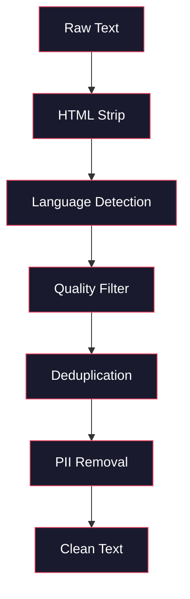
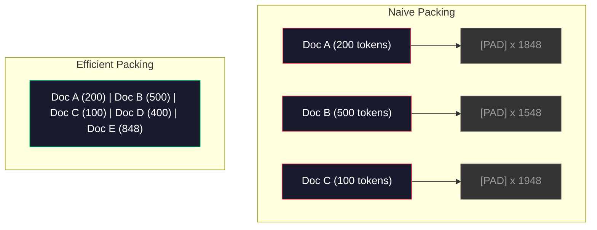

# Les données préalables à la formation

> Le modèle est un miroir. Il reflète tout ce que vous lui donnez.

**Type:** Build
**Languages:** Python
**Prerequisites:** Phase 10, Lessons 01-02 (Tokenizers, Building a Tokenizer)
**Time:** ~90 minutes

## Objectif de l'apprentissage

- Construire un pipeline de données en streaming, en cas de non-chargement de toutes les données dans l'inventaire, pour effectuer la Tokenization, le blocage, le mélange et le lot de textes de la catégorie TB
- 实现真实预训管道 中使用的数据质量过器(déduction, détection du langage, filtration du contenu)
- Créer un ensemble de formations de longueur fixe,并正确处理注意力面具和文档边界
- Le débit de pipeline de profil, assurez-vous que le chargement de données peut suivre le GPU

##  problématique

Vous avez déjà un Tokenizer.

Non un ensemble de données, mais pas un fichier CSV, mais une série de données de type TB qui ne doivent pas attendre le prochain lot.

La plupart des gens pensaient que le cœur d'un LLM était l'architecture du modèle. Il n'y a pas de modèle. Llama 3 utilisait 15,6 milliards de tokens. GPT-3 utilisait 300 milliards. DeepSeek-V2 utilisait 8,1 milliards.

Le document de Chinchilla de DeepMind l'explique avec précision. Pour un budget de calcul donné, il existe un ratio optimal entre le nombre de jetons de modèle et le nombre de jetons de formation. Chinchilla montre que la majorité des modèles de 2022 sont gravement sous-trainés: par rapport à la quantité de données qu'ils voient, leurs paramètres sont trop nombreux. Un modèle de 70B de formation sur 1,4 milliard de jetons (Chinchilla-optimal) est meilleur qu'un modèle 280B de formation sur 300 milliards de jetons (Gopher) [2].

Votre pipeline de données décide si votre modèle apprend le langage ou le bruit.

## 核心概念

### Les données proviennent de

Chaque modèle de langage grand est formé sur des données mixtes de plusieurs sources. Pour la plupart des laboratoires, la composition exacte des données est strictement confidentielle, mais nous en savons déjà assez pour comprendre ces catégories.

| Source | Size | Quality | Used By |
|--------|------|---------|---------|
| Common Crawl | ~250 TB raw | 低（需要大量过滤） | GPT-3, Llama, most open models |
| Wikipedia | ~20 GB | 高 | Every major LLM |
| GitHub code | ~1 TB+ | 中等（大量重复、废弃代码） | StarCoder, CodeLlama, DeepSeek-Coder |
| Books (BookCorpus, Pile) | ~100 GB | 高 | GPT-2, GPT-3, early models |
| Academic papers (arXiv, S2ORC) | ~100 GB | STEM 领域质量高 | Llama, Galactica |
| StackOverflow, Reddit | ~100 GB | 中等 | Llama, Falcon |
| Curated web (C4, RefinedWeb) | ~5 TB | 中高（已预过滤） | T5, Falcon |

Llama 3 a révélé son ratio de données mixtes: environ 50% de données Web, 25% de code, 13% de livres et de documents académiques, 8% de données mathématiques, ainsi que 4% de données Web multilingues.

Le code est trop petit, il est trop petit, il est trop petit, il est trop petit, il est trop petit, il est trop petit, il est trop petit, il est trop petit, il est trop petit, il est trop petit, il est trop petit, il est trop petit, il est trop petit, il est trop petit, il est trop petit, il est trop petit, il est trop petit, il est trop petit, il est trop petit, il est trop petit, il est trop petit, il est trop petit, il est trop petit, il est trop petit, il est trop petit, il est trop petit, il est trop petit, il est trop petit, il est trop petit, il est trop petit, il est trop petit, il est trop petit, il est trop petit, il est trop petit, il faut faire des expériences et évaluer.

### Numéro de nettoyage

Les données web primitives 很脏── un type de dépôt de crawls communs 包含:

- Étiquettes HTML et JavaScript
- 模板化 tête de page 脚 导航 menus
- Récapitulatif (récapitulatif)
- Spam généré par ordinateur
- Les informations personnelles (PII)
- 低质量文本(关键词列表、SEO spam)
- Écriture en format de code de contenu non écrit

Le nettoyage n'est pas une option. Il décide si le modèle est généré en continu ou en sortant des balises HTML mélangées dans la liste des produits.



Chaque étape élimine le bruit.

**HTML stripping:**移除所有标记──只保留可见文本内容──像 `trafilatura`Ou `readability`Cette bibliothèque élève le contenu de l'article, tout en abandonnant la navigation, les publicités et la modélisation du contenu.

**Language detection:**Utilisez le modèle de reconnaissance de langage FastText pour chaque document. Si un document est classé en anglais, mais avec une confiance inférieure à 0,8, il est très probable qu'il ne soit pas en anglais propre.

**Quality filtering:**Ici commence à devenir intéressant. Le "RefineedWeb" utilise un filtre basé sur la perplexité: d'abord, entraînez un petit modèle de langue sur Wikipédia, puis donnez à chaque document un partage.

**Deduplication:**单个最有影响力的清洗步骤――Common Crawl 包含海量重复页面:法律免责声明、cookie notifications、服务条款――

**PII removal:**姓名、电子邮件地址、电话号码、社会安全号码──对结构化 PII 使用基于regex的检测,对上下文中的姓名使用NER模型──

### Utiliser MinHash faire déduplication

精确扣抄 很容易:对每文档做哈希,移除重复项──但真正的问题是近似重复──两份相同新闻文章的复制,周围广告略有不同,就是近似重复──内容 95% identique,但按字节比较不一致──

MinHash + Hashing localisé (LSH) peut être efficace pour résoudre ce problème.


Je pense que c'est comme ça:

1. **Shingling:**Pour chaque document, il faut utiliser le mot "rapid brown fox" pour le traduire en "rapid brown fox".

2. **MinHash:**Pour chaque ensemble de bardeaux de documents, calculer la valeur de hachage de chaque hash est une fonction de hachage différente.

3. **LSH:**Selon la bande de signature de MinHash, le document est divisé en bouquets.

4. **Verify:**Pour chaque paire de candidats, calculer la similitude de Jaccard. Si la similitude dépasse la valeur de 0,8 (en général), on en supprime une copie.

Llama 团队 a rapporté qu'ils ont supprimé environ 38% des données Web par déduplication. Ce n'est pas un petit chiffre.

### L'emballage de séquences

Votre modèle s'attend à ce que la longueur de votre fichier soit fixe.

Pratique simple: mettre chaque paquet de documents à la plus grande longueur de séquence.

Mieux vaut mettre plusieurs documents dans une séquence, et utiliser des jetons de fin de séquence séparés. Une séquence de 2048-tokens peut contenir trois documents courts, et utiliser [EOS] en milieu.



Le masque d'attention 必须正确设置──同一个包装序列 中,Document A 的标记 不应关注文件 B 的标记──这需要一个区块横线的注意口罩──

长文档会在序列边界处被切断或拆分成块――分分点很重要:在句子中分会迫使模型看到不完整的思路――有些管道会尽可能把分分分对齐到段落或句子边界――

### Loi de l'échelle de Chinchilla

对于固定计算预算 C(以 FLOPs 衡量),最优模型大小 N 和数据集 大小 D 遵循:

```
N_opt ~ C^0.5
D_opt ~ C^0.5
```

En pratique, cela signifie que vous devriez être grossière et égale proportion de modèle de taille et de jeu de données de taille.

| Model | Parameters | Training Tokens | Chinchilla-Optimal? |
|-------|-----------|----------------|-------------------|
| GPT-3 | 175B | 300B | 否（undertrained 3-4x） |
| Chinchilla | 70B | 1.4T | 是（按设计） |
| Llama 2 | 70B | 2T | Overtrained（有意为之） |
| Llama 3 | 70B | 15T | 严重 overtrained |

Llama 3 a délibérément violé la loi de Chinchilla. Meta a découvert que, sur plus de données, la surentraînement, le rapport de calcul-optimal, produirait un modèle plus adapté à l'inférence. Les coûts de formation supplémentaire ne sont payés qu'une seule fois, mais les coûts de service à long terme de plus petits sont plus faibles.


```figure
l5-data-pipeline
```

## - Je le construis.

### 步骤 1: Nettoyage du texte

剥离 HTML、规范化白空间、移除文本内容──我们将使用公共域文本(Project Gutenberg) comme un petit corpus──

```python
import re

def clean_text(text):
    text = re.sub(r"<[^>]+>", "", text)
    text = re.sub(r"http\S+", "", text)
    text = re.sub(r"[^\x20-\x7E\n]", "", text)
    text = re.sub(r"\n{3,}", "\n\n", text)
    text = re.sub(r" {2,}", " ", text)
    return text.strip()

def quality_filter(text, min_words=50, max_ratio_caps=0.3, max_ratio_special=0.1):
    words = text.split()
    if len(words) < min_words:
        return False
    caps_ratio = sum(1 for w in words if w.isupper()) / len(words)
    if caps_ratio > max_ratio_caps:
        return False
    special_chars = sum(1 for c in text if not c.isalnum() and not c.isspace())
    if special_chars / max(len(text), 1) > max_ratio_special:
        return False
    return True
```

Ce filtre de qualité capturera le spam SEO (tous les CAPS) ✓ générateur de bruit (environ 50%) et les pages de stub (environ 50%).

### 步骤 2: Déduplication de MinHash

De la réalisation de MinHash.`hashlib`Il y a une autre.

```python
import hashlib
from collections import defaultdict

def get_shingles(text, k=5):
    words = text.lower().split()
    if len(words) < k:
        return set()
    return {" ".join(words[i:i+k]) for i in range(len(words) - k + 1)}

def minhash_signature(shingles, num_hashes=128):
    signature = []
    for i in range(num_hashes):
        min_hash = float("inf")
        for shingle in shingles:
            h = int(hashlib.sha256(f"{i}:{shingle}".encode()).hexdigest(), 16)
            min_hash = min(min_hash, h)
        signature.append(min_hash)
    return signature

def lsh_buckets(signature, bands=16):
    rows_per_band = len(signature) // bands
    buckets = []
    for b in range(bands):
        start = b * rows_per_band
        band_data = tuple(signature[start:start + rows_per_band])
        bucket_hash = hashlib.md5(str(band_data).encode()).hexdigest()
        buckets.append((b, bucket_hash))
    return buckets

def deduplicate(documents, threshold=0.8, num_hashes=128, bands=16):
    signatures = []
    shingle_sets = []
    for doc in documents:
        shingles = get_shingles(doc)
        shingle_sets.append(shingles)
        signatures.append(minhash_signature(shingles, num_hashes))

    bucket_map = defaultdict(list)
    for doc_idx, sig in enumerate(signatures):
        for band_id, bucket_hash in lsh_buckets(sig, bands):
            bucket_map[(band_id, bucket_hash)].append(doc_idx)

    duplicate_pairs = set()
    for bucket_docs in bucket_map.values():
        if len(bucket_docs) < 2:
            continue
        for i in range(len(bucket_docs)):
            for j in range(i + 1, len(bucket_docs)):
                duplicate_pairs.add((bucket_docs[i], bucket_docs[j]))

    removed = set()
    for i, j in duplicate_pairs:
        if i in removed or j in removed:
            continue
        s1, s2 = shingle_sets[i], shingle_sets[j]
        if not s1 or not s2:
            continue
        jaccard = len(s1 & s2) / len(s1 | s2)
        if jaccard >= threshold:
            removed.add(j)

    return [doc for idx, doc in enumerate(documents) if idx not in removed], len(removed)
```

`num_hashes=128`et `bands=16`参数控制精度回忆 tradeoff──更多哈希会给出更准确的相似性──估计──更多频段会提高回忆──捕捉更多重复项),代价是更多虚假积极──这些值对典型的网页文本 效果很好──

### 步骤 3: Tokenize et de mettre en ligne les séquences

¢tâ€TMatteindre le texte net et déduplicé, effectuer une Tokenization sur lui, et de l'emballer pour l'entraînement de séquences de longueur fixe.

```python
def tokenize_corpus(documents, tokenizer):
    all_tokens = []
    for doc in documents:
        tokens = tokenizer.encode(doc)
        all_tokens.extend(tokens)
        all_tokens.append(tokenizer.eos_id)
    return all_tokens

def pack_sequences(token_ids, seq_length, pad_id=0):
    sequences = []
    attention_masks = []
    for i in range(0, len(token_ids), seq_length):
        seq = token_ids[i:i + seq_length]
        mask = [1] * len(seq)
        if len(seq) < seq_length:
            pad_count = seq_length - len(seq)
            seq = seq + [pad_id] * pad_count
            mask = mask + [0] * pad_count
        sequences.append(seq)
        attention_masks.append(mask)
    return sequences, attention_masks
```

### Étape 4: Utilisez le DataLoader de formation

产出包装序列的随机批量──这是训练循环的内容──

```python
import random

class PreTrainingDataLoader:
    def __init__(self, sequences, attention_masks, batch_size, shuffle=True):
        self.sequences = sequences
        self.attention_masks = attention_masks
        self.batch_size = batch_size
        self.shuffle = shuffle

    def __len__(self):
        return (len(self.sequences) + self.batch_size - 1) // self.batch_size

    def __iter__(self):
        indices = list(range(len(self.sequences)))
        if self.shuffle:
            random.shuffle(indices)
        for start in range(0, len(indices), self.batch_size):
            batch_idx = indices[start:start + self.batch_size]
            batch_seqs = [self.sequences[i] for i in batch_idx]
            batch_masks = [self.attention_masks[i] for i in batch_idx]
            yield batch_seqs, batch_masks
```

### 步骤 5: Statistiques du jeu de données

計算重要数字:总 Token 数、唯一 Token 数、 compression ratio、文档长度分布──

```python
from collections import Counter

def compute_statistics(documents, token_ids, sequences, tokenizer_vocab_size):
    total_chars = sum(len(d) for d in documents)
    total_tokens = len(token_ids)
    unique_tokens = len(set(token_ids))
    compression_ratio = total_chars / total_tokens

    doc_lengths = [len(d.split()) for d in documents]
    avg_doc_length = sum(doc_lengths) / max(len(doc_lengths), 1)
    max_doc_length = max(doc_lengths) if doc_lengths else 0
    min_doc_length = min(doc_lengths) if doc_lengths else 0

    token_counts = Counter(token_ids)
    top_tokens = token_counts.most_common(10)

    non_pad_tokens = sum(sum(1 for t in seq if t != 0) for seq in sequences)
    total_positions = sum(len(seq) for seq in sequences)
    utilization = non_pad_tokens / max(total_positions, 1)

    stats = {
        "total_documents": len(documents),
        "total_characters": total_chars,
        "total_tokens": total_tokens,
        "unique_tokens": unique_tokens,
        "vocab_utilization": unique_tokens / tokenizer_vocab_size,
        "compression_ratio": compression_ratio,
        "avg_doc_length_words": avg_doc_length,
        "max_doc_length_words": max_doc_length,
        "min_doc_length_words": min_doc_length,
        "num_sequences": len(sequences),
        "sequence_utilization": utilization,
        "top_10_tokens": top_tokens,
    }
    return stats
```

Le ratio de compression  vous dit que le Tokenizer est très efficace dans ce corpus ⇒ Le texte en anglais est généralement comprimé à environ 3 à 4 caractères par jeton ⇒ Si vous voyez chaque jeton de 1,5 caractères, indiquez que votre Tokenizer est trop actif ⇒ Si vous voyez 8+, indiquez qu'il a acquis une fusion dans un domaine très spécifique ⇒

Utilisation de la séquence  vous dire que beaucoup de séquences emballées ont de vrais données, et non pas de rembourrage.

## Utilisez-le

### Comparativement avec les ensembles de données HuggingFace

通过 HuggingFace's datasets library 加载同一个体,并比较管道速度

```python
from datasets import load_dataset
from transformers import AutoTokenizer

ds = load_dataset("wikitext", "wikitext-2-raw-v1", split="train")
tokenizer = AutoTokenizer.from_pretrained("meta-llama/Meta-Llama-3-8B")

import time

start = time.time()
tokenized = ds.map(
    lambda x: tokenizer(x["text"], truncation=True, max_length=2048),
    batched=True,
    num_proc=4,
)
hf_time = time.time() - start
total_tokens = sum(len(t) for t in tokenized["input_ids"])
print(f"HuggingFace: {total_tokens:,} tokens in {hf_time:.2f}s ({total_tokens/hf_time:,.0f} tokens/sec)")
```

HuggingFace pipeline utilise des tokenizers Rust à la base et effectue des échanges de fournisseurs de fournisseurs de services de base.

## Je le livre.

Le cours a été créé pour une analyse rapide et rapide des données de la formation en LLM.`outputs/prompt-data-quality-checker.md`Il y a une autre.

## 练习

1. **Easy:**Utilisez une méthode simple pour nettoyer le pipeline de détection de langage.
2. **Medium:**En dehors de la déduplication de MinHash, utilisez des haches SHA-256 pour réaliser une déduplication exacte.
3. **Hard:**Construire un filtre de qualité basé sur la perplexité ⋅ dans le texte de Wikipédia ⋅ entraîne un modèle de langage bigrammétrique, selon la perplexité ⋅ donne à chaque document un score,并移除底部20%── comparer avec les données filtrées et non filtrées ⋅ dans le texte de formation ⋅ dans le modèle de production de qualité

## 关键术语

| Term | 人们通常怎么说 | 它真正的含义 |
|------|----------------|----------------------|
| Common Crawl | “互联网” | 一个每月抓取 web 的非营利组织：约 250TB 原始数据，是大多数 LLM 训练数据的起点 |
| MinHash | “某种 hashing trick” | 一种使用固定大小 signature 来估计集合间 Jaccard similarity 的技术：支持大规模 near-duplicate detection |
| LSH | “Locality-Sensitive Hashing” | 一种把相似项分到同一 bucket 的方法：将 pairwise comparisons 从 O(n^2) 降到接近线性 |
| Sequence packing | “拼接文档” | 用正确的 attention masks 把多个文档放入固定长度序列：消除 padding 浪费 |
| Chinchilla scaling | “在更多数据上训练” | 对于固定计算预算，最优性能要求模型大小和训练 Token 数大致等比例扩展 |
| Fertility | “Tokens per word” | 每个词平均对应的 Token 数：GPT-4 中英文约为 1.3，非拉丁文字系统更高 |
| Data mixing | “选择训练数据” | code、text、math、multilingual data 之间的比例：没有公式，需要实验 |
| Perplexity filter | “质量打分” | 使用小型语言模型给文档打分：高 perplexity 意味着文本不像干净的 reference data |
| Deduplication | “移除副本” | 消除完全重复和近似重复文档：通常会移除 30-40% 的原始 web data |
| Attention mask | “要看哪些 Token” | 一种 binary mask，用于阻止 packed sequences 中跨文档边界的 Attention |

## 延伸阅读

- [Hoffmann et al., 2022 -- Training Compute-Optimal Large Language Models (Chinchilla)](https://arxiv.org/abs/2203.15556)--  modifier notre compréhension de la façon dont les données sont dimensionnées
- [Penedo et al., 2023 -- The RefinedWeb Dataset for Falcon LLM](https://arxiv.org/abs/2306.01116)-- Comment transformer le crawling commun en données de haute qualité
- [Touvron et al., 2023 -- Llama 2: Open Foundation and Fine-Tuned Chat Models](https://arxiv.org/abs/2307.09288)-- Llama 2 du pipeline de données 细节
- [Lee et al., 2022 -- Deduplicating Training Data Makes Language Models Better](https://arxiv.org/abs/2107.06499)- Pourquoi la déduplication est plus importante que vous ne le pensez ?
- [Broder, 1997 -- On the Resemblance and Containment of Documents](https://ieeexplore.ieee.org/document/666900)- Le premier papier MinHash
- [Meta, 2024 -- Llama 3 Technical Report](https://arxiv.org/abs/2407.21783)-- 15,6T Token ∆ données de mélange ∆ filtrage du pipeline
