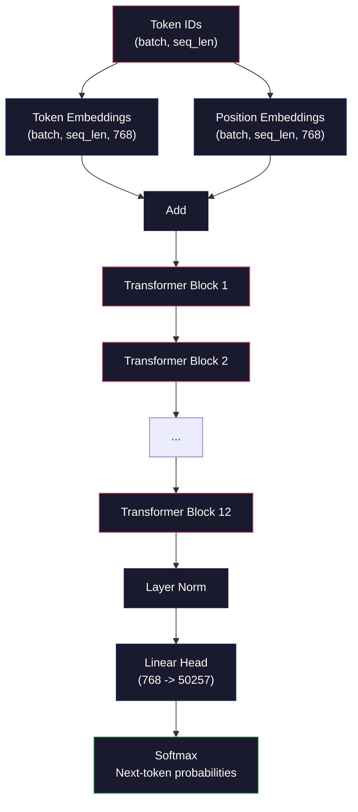
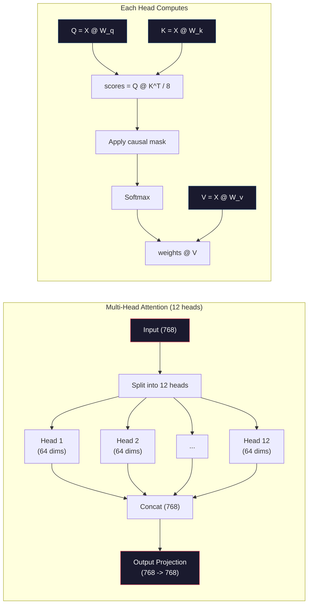
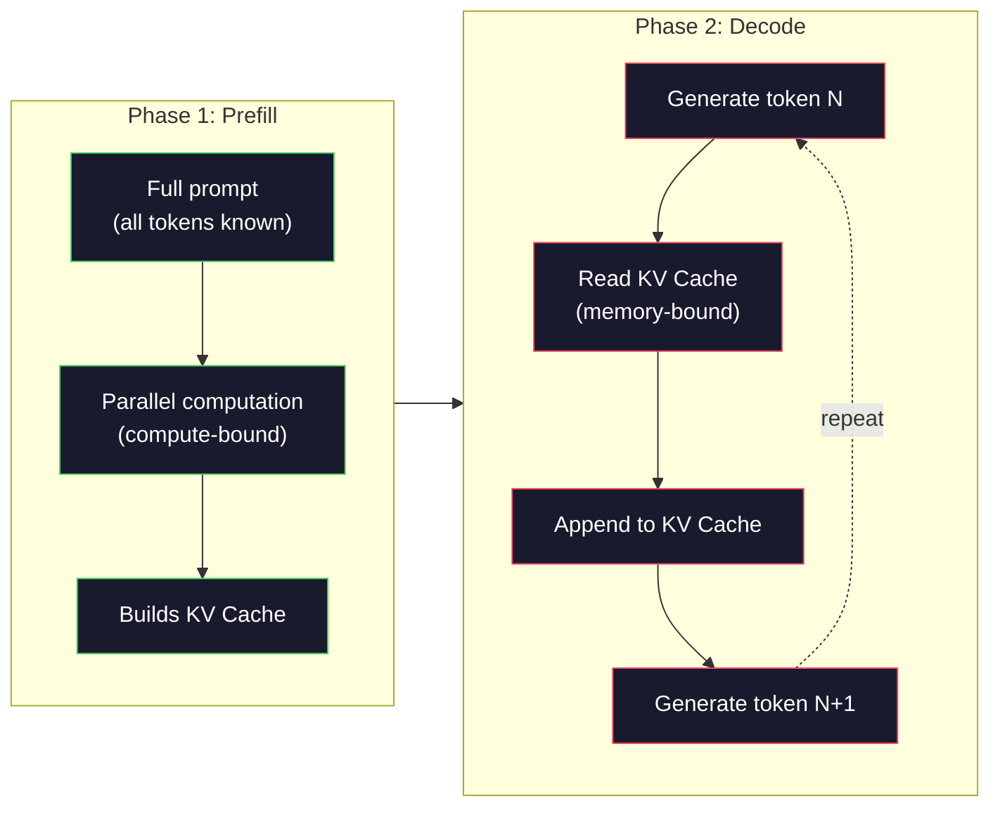

# De zéro Pré-entraînement Une Mini GPT ((124M 参数)

> GPT-2 Small a 1,24 milliards de paramètres. Il y a 12 couches de transformateur, 12 têtes d'attention, ainsi que 768 dimensions d'embedding. Vous pouvez l'entraîner à zéro en quelques heures sur un seul bloc de GPU. La plupart des gens ne le font jamais. Ils utilisent un point de contrôle prétrainé. Mais si vous n'en avez pas personnellement entraîné un, vous ne comprenez pas vraiment ce qui se passe à l'intérieur du modèle sur lequel vous construisez les produits.

**类型：**Construire
**语言：**Python avec numpy)
**前置要求：**Phase 10,Léctions 01-03(Tokenizers, Construire un Tokenizer, Pipelines de données)
**时间：**- 120 minutes

## Objectif de l'apprentissage
- De la réalisation à zéro de l'ensemble de la GPT-2 架构(124M 参数):Inpégements de jetons、Inpégements de position、blocs transformateurs, ainsi que tête de modèle de langage
- Utilisation de la prédiction de jetons suivants et de perte d'entropie croisée, dans le texte de l'article
- 实现带 température de prélèvement avec le filtrage top-k/top-p autorégressive 文本生成
-  Monitoring training loss curves,并验证模型学到了连贯的语言模式

##  problématique
Tu sais que Transformer est quoi ? Tu as déjà vu ces images. Tu peux te faire remarquer.

Cela ne signifie pas que vous comprenez ce qui s'est passé lorsque le modèle génère du texte.

GPT-2 Petit (avec un lien de poids) avec 124,438,272 个参数── chaque paramètre est configuré à travers une boucle de formation: passer en avant, calculer la perte, passer en arrière, mettre à jour le poids. 12 blocs de transformateur. Chaque bloc a 12 têtes d'attention. Un espace d'embedding de 768 dimensions. Un espace contient le vocabulaire de 50257 个接收令.

Si vous n'avez jamais construit tout cela à la main, vous êtes en train d'utiliser une boîte noire. Vous pouvez utiliser une API. Vous pouvez la régler. Mais quand vous avez un problème, vous vous hallucinez.

Ce cours va de zéro à la construction de GPT-2 Small── pas avec PyTorch── avec numpy── chaque fois que la multiplication de la matrice sont visibles── chaque gradient est calculé par votre code── vous verrez avec précision comment 1,24 milliards de chiffres fonctionnent ensemble pour prédire le prochain mot──

## 概念
### L'architecture du GPT

GPT est un modèle de langage autorégressif. Autogressif, c'est-à-dire qu'il génère une seule fois un Token, chaque Token est basé sur tous les Token. Cette structure est un ensemble de blocs de décodeur Transformer.

Voici le graphique de calcul complet de l'identifiant de jeton à la probabilité de jeton suivant:

1. Identification de jeton 输入。Forme: (taille de lot, séq_len)。
2. Embedding de jeton recherche。 chaque ID 映射到一个 768 维 Vector。Forme: (batch_size, seq_len, 768)。
3. Position Embedding lookup── chaque position(0, 1, 2, ...)映射到一个768 维矢量──Forme 相同──
4. 将 Embeddings de jeton + emblèmes de position 相加──
5. - Il y a 12 blocs de transformateurs.
6. La dernière normalisation de couche.
7. La projection linéaire à la taille du vocabulaire.
8. Le softmax est le plus probable.

Voilà tout le modèle. Pas de convulsions. Pas de récurrence.



### Le bloc de transformateur

12 blocs au milieu de chacun suivent le même modèle.

1. LayerNorm
2. Une attention personnelle à plusieurs têtes
3. Connexion résiduelle ((把 input 加回来)
4. LayerNorm
5. Réseau de flux de données (MLP)
6. Connexion résiduelle ((把 input 加回来)

Les connexions résiduelles 至关重要──没有它们,在后扩散过程中,Gradient到达区块 1 时会消失──有它们,Gradient peut passer par le chemin skip从损失 直接流向任意层──这就是为什么你可以堆叠12、32,甚至96区块(GPT-4传闻使用120个)──

### Attention: 核心机制

Attention à soi 让每个代币 查看前面所有代币,并决定应该关注每个代币 多少──下面是数学形式──

Pour chaque position de jeton, à partir de l'entrée 计算三个 vektors:
- **Query (Q)**Je suis à la recherche de quoi ?
- **Key (K)**Qu'est-ce que je contiens ?
- **Value (V)**Qu'est-ce que je peux vous dire ?

```
Q = input @ W_q    (768 -> 768)
K = input @ W_k    (768 -> 768)
V = input @ W_v    (768 -> 768)

attention_scores = Q @ K^T / sqrt(d_k)
attention_scores = mask(attention_scores)   # causal mask: -inf for future positions
attention_weights = softmax(attention_scores)
output = attention_weights @ V
```

Le masque causal est de faire en sorte que le GPT possède un mécanisme de caractère autorégressif. La position 5 peut être assise aux positions 0-5, mais ne peut pas être assise aux positions 6、7、8, selon ce type de suggestion. Cela empêchera le modèle de se former en passant par le jeton de voir l'avenir.

**Multi-head attention**Pour chaque tête, on peut apprendre un modèle d'attention différent. Une tête peut suivre une phrase de relation. Un autre peut suivre une position proche.



À part dans le quadrille (d_k) sqrt (d_k) sqrt) 64) = 8 est l'échelle. Sans elle, le produit de point du vecteur de haute dimension sera très grand, et la sourde max sera déduite à la zone de gradient presque à zéro.

### KV Cache: 推理为什么快

训练时,你会一次处理整个序列――Inference时,你会一次生成一个代币――如果没有优化,生成代币 N 需要为前面所有N-1 个代币 重新计算注意――对于每个生成代币,这是O(N),对长度为N的序列,总体是O(N^2) 的注意分 计算,并且还会重复执行大量输入侧矩阵乘点――

KV Cache  résolu le problème. Pour chaque jeton  calculé K 和 V 后, les mettre en stock. Lorsque vous générez un jeton N + 1 时, vous n'avez besoin que de nouveau jeton 计算 Q,并查找所有之前的 token 缓存的 K 和 V ;; ceci va faire K 和 V 计算的每代币成本从 O(N) 降至 O(1);; Attention score calculation 仍然是 O(N, car vous devez assister à la position précédente, mais vous évitez d'avoir à effectuer des entrées 冗余矩阵乘法;;

Pour une séquence de 1024-tokens, qui se trouve en FP32 en bas, il est d'environ 75 Mo. Pour une séquence de 128 couches de Llama 3 405B, une seule séquence de cache de KV peut dépasser 10 Go.

### Pré-remplissage vs Décode: 推理的两个阶段

Lorsque vous envoyez une demande de formation à la LLM, l'inference sera divisée en deux étapes différentes.

**Prefill**L'attention de tout le modèle est en phase de compute. La GPU est en train d'exécuter des multiplications de matrice à plein débit.

**Decode**Cette phase est un gouffre de mémoire lié à la mémoire de la GPU 读取模型权重和KV cache, et non les cœurs de calcul de Matrix math 本身──GPU. La plupart du temps, nous attendons la lecture de la mémoire. Pour GPT-2, chaque étape de décodeur, le temps est presque égal à la matmuls.

Cette différence est importante pour le système de production. Le débit de précharge est important. Avec le calcul de la GPU, le débit de décode est plus rapide.



### Le cycle de formation

訓練 LLM 就是下一个代币预测──给定代币 [0, 1, 2, ..., N-1],预测代币 [1, 2, 3, ..., N]──Loss Function 是模型预测概率分布与真实下一个代币 之间的交叉──

Une étape d'entraînement:

1. **Forward pass**: faire passer le lot à travers tous les 12 blocs.
2. **Compute loss**:logits et des jetons cibles ((entrée 向后平移一位) entre entropie croisée
3. **Backward pass**: utiliser la répartition pour l'ensemble de 124M 参数计算 Gradient。
4. **Optimizer step**Le réchauffement et la dégradation du cosine.

Le taux d'apprentissage est plus important que vous ne le pensez. Le GPT-2 est le premier des 2 000 étapes du processus de réchauffement à la vitesse d'apprentissage maximale, puis selon la courbe cosine de déclin.

### GPT-2 Petit: les chiffres

| Component | Shape | Parameters |
|-----------|-------|------------|
| Token embeddings | (50257, 768) | 38,597,376 |
| Position embeddings | (1024, 768) | 786,432 |
| Per-block attention (W_q, W_k, W_v, W_out) | 4 x (768, 768) | 2,359,296 |
| Per-block FFN (up + down) | (768, 3072) + (3072, 768) | 4,718,592 |
| Per-block LayerNorms (2x) | 2 x 768 x 2 | 3,072 |
| Final LayerNorm | 768 x 2 | 1,536 |
| **Total per block** | | **7,080,960** |
| **Total (12 blocks)** | | **85,054,464 + 39,383,808 = 124,438,272** |

La projection de sortie ((logits head) avec la matrice d'embedding de jetons 共享权重── Ceci est appelé liage de poids


```figure
sampling-decoder
```

## - Je le construis.
### 步骤 1: Embedding Layer

Les emplacements de jetons seront 50 257 个可能 Token de chaque enregistreur dans un vecteur 768 维──Position emplacements 添加关于每个 Token 在序列中位置的信息──两者相加──

```python
import numpy as np

class Embedding:
    def __init__(self, vocab_size, embed_dim, max_seq_len):
        self.token_embed = np.random.randn(vocab_size, embed_dim) * 0.02
        self.pos_embed = np.random.randn(max_seq_len, embed_dim) * 0.02

    def forward(self, token_ids):
        seq_len = token_ids.shape[-1]
        tok_emb = self.token_embed[token_ids]
        pos_emb = self.pos_embed[:seq_len]
        return tok_emb + pos_emb
```

La déviation standard de 0.02 est utilisée pour la déviation initiale, dérivée du papier GPT-2.

### 步骤 2: 带 Causal Mask 带 Causal Mask 带 Causal Mask 带 Causal Mask 带 Causal Mask 带 Causal Mask 带 Causal Mask 带 Causal Mask 带 Causal Mask 带 Causal Mask 带 Causal Mask 带 带 Causal Mask 带 带 带 带 带 带 带 带 带 带 带 带 带 带 带 带 带 带 带 带 带 带 带 带 带 带 带 带 带 带 带 带 带 带 带 带 带 带 带 带 带 带 带 带 带 带 带 带 带 带 带 带 带 带 带 带 带 带 带 带 带 带 带 带 带 带 带 带 带 带 带 带 带 带 带 带 带 带 带 带 带 带 带 带 带 带 带 带 带 带 带 带 带 带 带 带 带 带 带 带 带 带 带 带 带 带 带 带 带 带 带 带 带 带 带 带 带 带 带 带 带 带 带 带 带 带 带 带 带 带 带 带 带 带 带 带 带 带 带 带 带 带 带 带 带 带 带 带 带 带 带 带 带 带 带 带 带 带 带 带 带 带 带 带 带 带 带 带 带 带 带 带 带 带 带 带 带 带 带 带 带 带 带 带 带 带 带 带 带 带 带 带 带 带 带 带 带 带 带 带 带 带 带 带 带 带 带 带 带 带 带 带 带 带 带 带 带 带 带 带 带 带

Avant de réaliser l'attention à tête unique, le masque causale, la position future, la position à l'infini négatif, assurez-vous que chaque position ne peut que prendre en charge la position de soi et plus tôt.

```python
def attention(Q, K, V, mask=None):
    d_k = Q.shape[-1]
    scores = Q @ K.transpose(0, -1, -2 if Q.ndim == 4 else 1) / np.sqrt(d_k)
    if mask is not None:
        scores = scores + mask
    weights = np.exp(scores - scores.max(axis=-1, keepdims=True))
    weights = weights / weights.sum(axis=-1, keepdims=True)
    return weights @ V
```

softmax 实现会在指数化前减去最大值──否则,exp(large_number) 会溢出成无限──这是一个数值稳定性技巧,并不会改变输出,因为对于任意常数 c,softmax(x - c) = softmax(x)──

### 步骤 3: Attention à plusieurs têtes

Pour les résultats de l'analyse, le projet de répartition de 768 dimensions est de 12 têtes, chacune de 64 dimensions.

```python
class MultiHeadAttention:
    def __init__(self, embed_dim, num_heads):
        self.num_heads = num_heads
        self.head_dim = embed_dim // num_heads
        self.W_q = np.random.randn(embed_dim, embed_dim) * 0.02
        self.W_k = np.random.randn(embed_dim, embed_dim) * 0.02
        self.W_v = np.random.randn(embed_dim, embed_dim) * 0.02
        self.W_out = np.random.randn(embed_dim, embed_dim) * 0.02

    def forward(self, x, mask=None):
        batch, seq_len, d = x.shape
        Q = (x @ self.W_q).reshape(batch, seq_len, self.num_heads, self.head_dim).transpose(0, 2, 1, 3)
        K = (x @ self.W_k).reshape(batch, seq_len, self.num_heads, self.head_dim).transpose(0, 2, 1, 3)
        V = (x @ self.W_v).reshape(batch, seq_len, self.num_heads, self.head_dim).transpose(0, 2, 1, 3)

        scores = Q @ K.transpose(0, 1, 3, 2) / np.sqrt(self.head_dim)
        if mask is not None:
            scores = scores + mask
        weights = np.exp(scores - scores.max(axis=-1, keepdims=True))
        weights = weights / weights.sum(axis=-1, keepdims=True)
        attn_out = weights @ V

        attn_out = attn_out.transpose(0, 2, 1, 3).reshape(batch, seq_len, d)
        return attn_out @ self.W_out
```

Cette opération est une partie de l'attention multi-tête. Elle se produit en forme de tensor: forme: transformé (batch, seq_len, 12, 64), re-turné (batch, 12, seq_len, 64)

### 步骤 4: Bloc de transformateur

Un bloc transformateur complet:LayerNorm, avec l'attention multi-tête du résidual, avec le flux de flux du résidual,

```python
class LayerNorm:
    def __init__(self, dim, eps=1e-5):
        self.gamma = np.ones(dim)
        self.beta = np.zeros(dim)
        self.eps = eps

    def forward(self, x):
        mean = x.mean(axis=-1, keepdims=True)
        var = x.var(axis=-1, keepdims=True)
        return self.gamma * (x - mean) / np.sqrt(var + self.eps) + self.beta


class FeedForward:
    def __init__(self, embed_dim, ff_dim):
        self.W1 = np.random.randn(embed_dim, ff_dim) * 0.02
        self.b1 = np.zeros(ff_dim)
        self.W2 = np.random.randn(ff_dim, embed_dim) * 0.02
        self.b2 = np.zeros(embed_dim)

    def forward(self, x):
        h = x @ self.W1 + self.b1
        h = np.maximum(0, h)  # GELU approximation: ReLU for simplicity
        return h @ self.W2 + self.b2


class TransformerBlock:
    def __init__(self, embed_dim, num_heads, ff_dim):
        self.ln1 = LayerNorm(embed_dim)
        self.attn = MultiHeadAttention(embed_dim, num_heads)
        self.ln2 = LayerNorm(embed_dim)
        self.ffn = FeedForward(embed_dim, ff_dim)

    def forward(self, x, mask=None):
        x = x + self.attn.forward(self.ln1.forward(x), mask)
        x = x + self.ffn.forward(self.ln2.forward(x))
        return x
```

Le réseau feedforward va mettre en place 768 维 input  étendre à 3,072 维(4x), appliquer une non-linéarité, puis projeter 回 768 维。 ce modèle d'expansion-contrition 让模型在每位置上都有一个更宽的内部表示可使用──GPT-2 Utilisez l'activation GELU, mais ici pour simplement utiliser ReLU对理解架构来说差别不大──

### 步骤 5: Modèle GPT complet

堆叠 12 个 Transformer blocs──在前面加入嵌入层,在后面加入输出投影──

```python
class MiniGPT:
    def __init__(self, vocab_size=50257, embed_dim=768, num_heads=12,
                 num_layers=12, max_seq_len=1024, ff_dim=3072):
        self.embedding = Embedding(vocab_size, embed_dim, max_seq_len)
        self.blocks = [
            TransformerBlock(embed_dim, num_heads, ff_dim)
            for _ in range(num_layers)
        ]
        self.ln_f = LayerNorm(embed_dim)
        self.vocab_size = vocab_size
        self.embed_dim = embed_dim

    def forward(self, token_ids):
        seq_len = token_ids.shape[-1]
        mask = np.triu(np.full((seq_len, seq_len), -1e9), k=1)

        x = self.embedding.forward(token_ids)
        for block in self.blocks:
            x = block.forward(x, mask)
        x = self.ln_f.forward(x)

        logits = x @ self.embedding.token_embed.T
        return logits

    def count_parameters(self):
        total = 0
        total += self.embedding.token_embed.size
        total += self.embedding.pos_embed.size
        for block in self.blocks:
            total += block.attn.W_q.size + block.attn.W_k.size
            total += block.attn.W_v.size + block.attn.W_out.size
            total += block.ffn.W1.size + block.ffn.b1.size
            total += block.ffn.W2.size + block.ffn.b2.size
            total += block.ln1.gamma.size + block.ln1.beta.size
            total += block.ln2.gamma.size + block.ln2.beta.size
        total += self.ln_f.gamma.size + self.ln_f.beta.size
        return total
```

Attention à la liaison de poids:`logits = x @ self.embedding.token_embed.T`⋅ projection de sortie ⋅ répétition de la matrice d'embedding des jetons (en) ⋅ transfert (en) ⋅ Ceci n'est pas seulement un saveur de paramètres techniques── il signifie que le modèle utilise le même espace vectoriel pour comprendre les jetons (en) ⋅ emplacements (en) ⋅ et prévoir les jetons (en) ⋅ sortie (en) ⋅

### 步骤 6: cycle d'entraînement

Pour une véritable formation de 124M, vous avez besoin de GPU et PyTorch. Cette boucle de formation est dans un petit modèle qui peut être utilisé avec pure numpy.

```python
def cross_entropy_loss(logits, targets):
    batch, seq_len, vocab_size = logits.shape
    logits_flat = logits.reshape(-1, vocab_size)
    targets_flat = targets.reshape(-1)

    max_logits = logits_flat.max(axis=-1, keepdims=True)
    log_softmax = logits_flat - max_logits - np.log(
        np.exp(logits_flat - max_logits).sum(axis=-1, keepdims=True)
    )

    loss = -log_softmax[np.arange(len(targets_flat)), targets_flat].mean()
    return loss


def train_mini_gpt(text, vocab_size=256, embed_dim=128, num_heads=4,
                   num_layers=4, seq_len=64, num_steps=200, lr=3e-4):
    tokens = np.array(list(text.encode("utf-8")[:2048]))
    model = MiniGPT(
        vocab_size=vocab_size, embed_dim=embed_dim, num_heads=num_heads,
        num_layers=num_layers, max_seq_len=seq_len, ff_dim=embed_dim * 4
    )

    print(f"Model parameters: {model.count_parameters():,}")
    print(f"Training tokens: {len(tokens):,}")
    print(f"Config: {num_layers} layers, {num_heads} heads, {embed_dim} dims")
    print()

    for step in range(num_steps):
        start_idx = np.random.randint(0, max(1, len(tokens) - seq_len - 1))
        batch_tokens = tokens[start_idx:start_idx + seq_len + 1]

        input_ids = batch_tokens[:-1].reshape(1, -1)
        target_ids = batch_tokens[1:].reshape(1, -1)

        logits = model.forward(input_ids)
        loss = cross_entropy_loss(logits, target_ids)

        if step % 20 == 0:
            print(f"Step {step:4d} | Loss: {loss:.4f}")

    return model
```

La perte commence à se rapprocher de la taille du mot (vocab)  Pour le vocabulaire de niveau octet de 256-Token, c'est-à-dire que l'in  256) = 5.55。

Dans la production, vous utiliserez Adam Optimizer, associé à l'accumulation de gradients, au réchauffement du taux d'apprentissage et au couplage de gradients.

### 步骤 7: Génération de texte

Génération utilise un bon modèle une fois prédiction un Token。 chaque prédiction est tirée de l'échantillon de la distribution de sortie (en anglais) ⋅ ou de la plus grande quantité de arguments (en anglais) ⋅

```python
def generate(model, prompt_tokens, max_new_tokens=100, temperature=0.8):
    tokens = list(prompt_tokens)
    seq_len = model.embedding.pos_embed.shape[0]

    for _ in range(max_new_tokens):
        context = np.array(tokens[-seq_len:]).reshape(1, -1)
        logits = model.forward(context)
        next_logits = logits[0, -1, :]

        next_logits = next_logits / temperature
        probs = np.exp(next_logits - next_logits.max())
        probs = probs / probs.sum()

        next_token = np.random.choice(len(probs), p=probs)
        tokens.append(next_token)

    return tokens
```

Température  contrôle随机性──Temperature 1.0 使用原始分布──Temperature 0.5 会让分布更尖(更确定模型更经常选择顶级选择)──Temperature 1.5 会让分布更平坦(更随机低概率代币 获得更大的机会)──Temperature 0.0 est un décoding avide(总是选择最高概率代币)──

`tokens[-seq_len:]`Cette fenêtre est nécessaire, car le modèle a la longueur de contexte maximale ((GPT-2 = 1024) ⋅ une fois qu'il est dépassé, il faut perdre le plus ancien Token ⋅ c'est la fenêtre de contexte ⋅ tout le monde en discussion ⋅ ⋅

## Utilisez-le
### 完整训练与生成 Demo

```python
corpus = """The transformer architecture has revolutionized natural language processing.
Attention mechanisms allow the model to focus on relevant parts of the input.
Self-attention computes relationships between all pairs of positions in a sequence.
Multi-head attention splits the representation into multiple subspaces.
Each attention head can learn different types of relationships.
The feedforward network provides nonlinear transformations at each position.
Residual connections enable gradient flow through deep networks.
Layer normalization stabilizes training by normalizing activations.
Position embeddings give the model information about token ordering.
The causal mask ensures autoregressive generation during training.
Pre-training on large text corpora teaches the model general language understanding.
Fine-tuning adapts the pre-trained model to specific downstream tasks."""

model = train_mini_gpt(corpus, num_steps=200)

prompt = list("The transformer".encode("utf-8"))
output_tokens = generate(model, prompt, max_new_tokens=100, temperature=0.8)
generated_text = bytes(output_tokens).decode("utf-8", errors="replace")
print(f"\nGenerated: {generated_text}")
```

Sur les petits modèles et les petits modèles, la génération de texte peut être la plus grande partie du processus. Elle peut être apprise à partir de la formation de texte à un certain niveau de octets, mais ne peut pas être généralisée à l'aide de GPT-2 à l'aide de 40 Go de données de formation et d'une architecture complète de 124 M.

## Je le livre.
本课会产出 `outputs/prompt-gpt-architecture-analyzer.md` Un modèle à utiliser pour analyser un modèle de style GPT 架构选择的提示──把模型卡或技术报告 交给它, il décompose l'allocation de paramètres、Attention design和规模决策──

## 练习
1. Le modèle sera modifié pour utiliser 24 couches et 16 têtes, au lieu de 12/12[6].

2. 实现 GELU activation fonction(GELU(x) = x * 0.5 * (1 + erf(x / sqrt(2)))),并替换 feedforward network 中的 ReLU──分别使用两种激活 训练500步,并比较最终损失──

3. 给生成函数 添加 KV cache──在第一次前传后,存储每层的 K 和 V紧缩器,并后续代币中复用它们──测量加快:分别在有缓存和没有缓存的情况下生成200个代币,并比较墙钟时间──

4. 实现 top-k sampling(conseillez seulement considérer la probabilité maximale de k 个 Token) et top-p sampling(nucleus sampling:考虑累计概率超过 p 的最小 Token 集合) ⋅ à température de 0,8 下比较 top-k=50 与 top-p=0,95 的输出质量──

5. 构建一个训练损失曲线图案设计者──训练模型 1000 steps,并绘制损失 vs step──识别三个阶段:快速初始下降(学习常见字节)、较慢的中间阶段(学习字节模式) 以及平面(在小语料上过)──无论你训练的是128-dimensional model 还是GPT-4,这条曲线的形状都是一样的──

## 关键术语
| Term | What people say | What it actually means |
|------|----------------|----------------------|
| Autoregressive | “它一次生成一个词” | 每个输出 Token 都基于所有之前的 Token——模型预测 P(token_n \| token_0, ..., token_{n-1}) |
| Causal mask | “它看不到未来” | 一个由 -infinity 值组成的 upper-triangular Matrix，用于在训练期间阻止 Attention 指向未来 position |
| Multi-head attention | “多种 Attention pattern” | 将 Q、K、V 拆成并行 heads（例如 GPT-2 中 12 个 head，每个 64 dims），让每个 head 学习不同的关系类型 |
| KV Cache | “用于提速的缓存” | 存储来自之前 Token 的已计算 Key 和 Value tensors，以避免 autoregressive generation 期间的冗余计算 |
| Prefill | “处理 prompt” | 第一个 inference 阶段，所有 prompt Token 并行处理——在 GPU FLOPS 上 compute-bound |
| Decode | “生成 Token” | 第二个 inference 阶段，Token 一次生成一个——在 GPU bandwidth 上 memory-bound |
| Weight tying | “共享 embeddings” | 对 input Token embeddings 和 output projection head 使用同一个 Matrix——在 GPT-2 中节省 38M 参数 |
| Residual connection | “Skip connection” | 将 input 直接加到 sublayer 的 output 上（x + sublayer(x)）——支持 deep networks 中的 Gradient flow |
| Layer normalization | “规范化 activations” | 沿 feature dimension 规范化到 mean 0 和 variance 1，并带有可学习的 scale 与 bias 参数 |
| Cross-entropy loss | “预测错得有多离谱” | -log(分配给正确 next Token 的概率)，在所有 position 上取平均——标准 LLM 训练目标 |

## 延伸阅读
- [Radford et al., 2019 -- "Language Models are Unsupervised Multitask Learners" (GPT-2)](https://cdn.openai.com/better-language-models/language_models_are_unsupervised_multitask_learners.pdf)-- 介绍 124M à 1,5B 参数家族的GPT-2 papier
- [Vaswani et al., 2017 -- "Attention Is All You Need"](https://arxiv.org/abs/1706.03762)--  proposer une attention de produit à l' échelle et une attention à plusieurs têtes
- [Llama 3 Technical Report](https://arxiv.org/abs/2407.21783)-- Meta  comment utiliser les GPU 16K générer l'architecture GPT  étendre à 405B 参数
- [Pope et al., 2022 -- "Efficiently Scaling Transformer Inference"](https://arxiv.org/abs/2211.05102)-- va pré-remplir vs décoder avec KV cache analyse  papier formalisé
