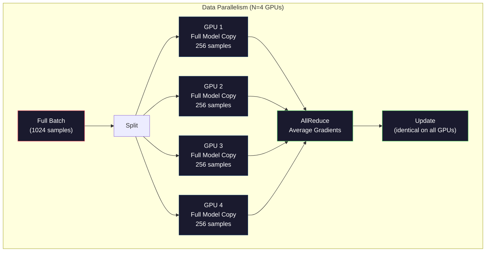
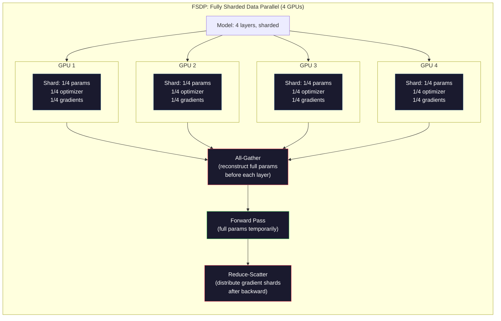
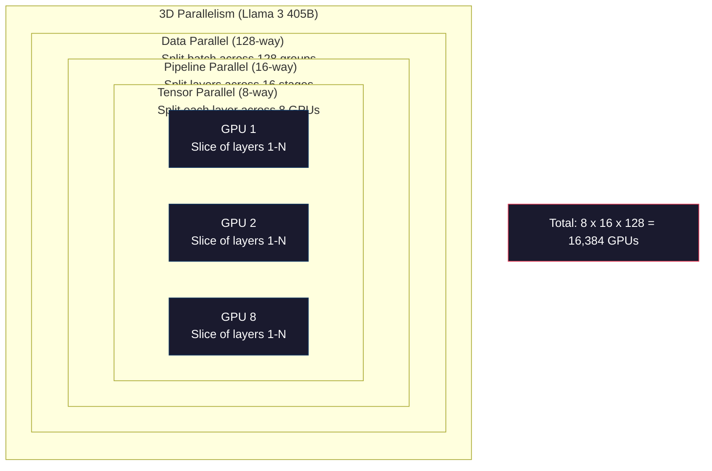

# Équivalence: Formation distribuée, FSDP, Rapidité profonde

> Votre modèle 124M est déjà formé sur un seul GPU. Il est maintenant en train de tenter 70 milliards de paramètres.

**Type:** Build
**Languages:** Python
**Prerequisites:** Phase 10, Lesson 04 (Pre-Training a Mini GPT)
**Time:** ~120 minutes

## Objectif de l'apprentissage
- 解释三种平行性 (Data、Tensor、Pipeline), ainsi que le temps nécessaire pour les utiliser en fonction de la taille du modèle et de la taille du groupe
- Utiliser PyTorch DDP  Réaliser l'entraînement parallèle des données, et synchroniser entre plusieurs blocs de GPU  Gradient
- 计算给定模型规模的显存预算(poids + états d'optimisation + gradients + activations), afin de déterminer le besoin minimum de matériel
- Configurer les étapes FSDP ou DeepSpeed ZeRO, séparer l'état du modèle en plusieurs blocs de GPU, permettant ainsi de contenir plus d'un seul modèle de carte de stockage

##  problématique
Un modèle de paramètres 7B utilise FP16 时, seulement des poids nécessitent 14GB──Adam Optimizer 会为每个参数额外存储两副本(第一时和第二时估计)──这也需要28GB──Réprotagé 期间 Gradients 再增加14GB──还没有存储任何激活,你已经用掉56GB──

Un bloc NVIDIA A100 avec 80 Go de stockage.

Pour les séquences 2048-tokens et les modèles 4096 dimensions, les activations à couche unique utilisent environ 64 MB──32 couches environ. Chaque échantillon a besoin de 2 GB── taille de lot.

现在试试 70B 参数――仅重量:FP16 下 140GB――单块GPU 放不下――你至少需要2块A100(2 x 80GB = 160GB)才能只放下重量――加上优化状态和梯度,需要的GPU 远不止这些:最低3+块,实际通常取决于碎片化策略,需要8-16块――

Llama 3 405B Utilisez 16 384 blocs de GPU NVIDIA H100  entraînement。 Cette entraînement fonctionne avec une estimation de coût d'environ 1 milliard de dollars de calcul 成本。DeepSeek V3 通过更巧妙的架构(Mixure of Experts signifie chaque jeton 只有激活一小部分参数) et l'efficacité de la formation, avec environ 560 millions de dollars de formation d'un modèle comparable。

Le cours présente quatre stratégies possibles pour faire un entraînement à grande échelle: le parallélisme des données, le parallélisme des tensions, le parallélisme des pipelines et le parallélisme des données entièrement fragmentées.

## 概念
### Pourquoi avoir besoin de distribué

Voici le calcul de la résistance du modèle réel. Chaque chiffre est calculé, pas une estimation.

| Model | Params | Weights (FP16) | Adam States | Gradients (FP16) | Total (no activations) |
|-------|--------|----------------|-------------|------------------|----------------------|
| GPT-2 Small | 124M | 248 MB | 992 MB | 248 MB | 1.5 GB |
| Llama 3 8B | 8B | 16 GB | 64 GB | 16 GB | 96 GB |
| Llama 3 70B | 70B | 140 GB | 560 GB | 140 GB | 840 GB |
| Llama 3 405B | 405B | 810 GB | 3,240 GB | 810 GB | 4,860 GB |

Adam States 这一列才是真正的显存杀手──Adam 会为每个参数存储运行平均 (m) 和运行变量 (v),两者都是FP32──对于70B 模型,这就是70B x 4 bytes x 2 = 560GB──只有优化器就需要七块A100──

单块H100 有80GB──Llama 3 405B 至少需要61块H100 才能容纳权重、优化和梯度──加上激活,数量也将继续增加──Meta 使用 16,384块GPU 不是因为他们想这样,而是因为他们必须这样──

### Parallélisme des données

Le plus simple est la stratégie distribuée. Il faut copier le modèle complet en N blocs de GPU. Il faut décomposer chaque lot de formation en N 个相等部分. Chaque bloc de GPU se déploie dans son propre shard de données. Il passe ensuite en avant et en arrière.

**优点：**Le débit de N 块 GPU à chaque étape  traiter N 倍数据── la communication est limitée à la moyenne de gradient, et peut être complétée par des calculs.

**缺点：**Chaque GPU possède un modèle complet, des états d'optimisation et des gradients. Pour les modèles 70B, chaque GPU nécessite 840 Go. Le parallélisme des données ne réduira pas la capacité de stockage d'un seul GPU.

**计算：**La taille de lot efficace = par_gpu_batch_size x N。 pour N=64 blocs de GPU 且 par lots de GPU 为 16, le lot efficace 为 1,024。Llama 3 Utilisation de la taille de lot efficace est de 16000000 tokens par étape。



### Parallélisme des tensors

Mettre une seule couche de GPU en plusieurs blocs de GPU 上―― une fois la multiplication de matrice est divisée en plusieurs blocs de GPU, chaque bloc de GPU en fait partie du résultat de calcul―

考虑 feedforward layer 中一个形 为 (8192, 8192) 的权力矩阵――使用四方向 tensor parallelism 时,每块 GPU 拥有一个 (8192, 2048) 碎片――每块 GPU 用输入乘以自己的碎片,产生一个部分结果――部分结果会被组合――通过全减或全集)生成完整输出――

**优点：**Réduire les poids des modèles de chaque GPU supérieur 显存占用──un modèle 70B 拆分到8块 GPU上, signifie que chaque GPU 持约8.75B 参数规模的重量──

**缺点：**Chaque couche nécessite une GPU à grande vitesse 间通信。 chaque couche 后的全减会增加延迟。 ce qui est très bon dans NVLink(((((((((((((((((((((((((((((((((((((((((((((((((((((((((((((((((((((((((((((((((((((((((((((((((((((((((((((((((((((((((((((((((((((((((((((((((((((((((((((((((((((((((((((((((((((((((((((((((((((((((((((((((((((((((((((((((((((((((((((((((((((((((((((((((((((((((((((((((((((((((((((((((((((((((((((((((((((((((((((((((((((((((((((((((((((((((((((((((((((((((((((((((((((((((((((((((((((((((((((((((((((((((((((((((((((((((((((((((((((((((((((((((((((((((((((((((((((((((

**真实用法：**Megatron-LM a créé un parallélisme tensoriel. Llama 3 405B utilise un parallélisme tensoriel à huit voies à chaque point.

### Parallélisme du pipeline

按层 拆分模型。GPU 1 运行层 1-8。GPU 2 运行层 9-16。GPU 3 运行层 17-24。GPU 4 运行层 25-32。Data流经管道:GPU 1 计算自己的层并把激活 发送给GPU 2,GPU 2 计算自己的层 后发送给GPU 3,依此类推──

**优点：**La GPU 间通信极少, seulement transmettre des activations de couches 边界处;相比梯度或重量, ces données sont très petites.

**缺点：**Les bulles de pipeline ⋅ lorsque la GPU 4 est en train de calculer le passage à l'avant du micro-batch 1 ⋅ GPU 1、2、3 sont dans un état vide ⋅ elles ont déjà terminé leur passage à l'avant ⋅ par rapport à l'arrière ⋅ pendant ce temps, le mode inversé ⋅ utilise le pipeline naïf ⋅ N ⋅ N ⋅ N ⋅ N ⋅ N ⋅ N ⋅ N ⋅ N ⋅ N ⋅ N ⋅ N ⋅ N ⋅ N ⋅ N ⋅ N ⋅ N ⋅ N ⋅ N ⋅ N ⋅ N

**GPipe and PipeDream**通過把批發 拆分成微批發 来解決泡泡 问题──GPU 1 一完成微批發 1 的前进,就开始处理微批發 2──这让不同的管道阶段的计算发生重叠──使用M 个微批发 和 N 个阶段 时,泡泡分数 降为 (N-1) /M──N=4阶段、M=16 micro批发 时,泡泡为 3/16 = 18.75% de temps par jour──

### FSDP: données parallèles entièrement fragmentées

Le FSDP combine l'expansion et l'efficacité de la mise en cache du parallélisme des données.

Avant le passage de la première couche, le FSDP se déroulera.**all-gather**, rassembler tous les paramètres complets du GPU  rassembler à chaque bloc de GPU  par le passé  par le passé, chaque bloc de GPU  par le passé  par le passé  par le passé  par le passé  par le passé  par le passé  par le passé  par le passé  par le passé  par le passé  par le passé  par le passé  par le passé  par le passé  par le passé  par le passé  par le passé  par le passé  par le passé  par le passé  par le passé  par le passé  par le passé  par le passé  par le passé  par le passé  par le passé  par le passé  par le passé  par le passé  par le passé  par le passé  par le passé  par le passé  par le passé  par le passé  par le passé  par le passé  par le passé  par le passé  par le passé  par le passé  par le passé  par le passé  par le passé  par le passé  par le passé  par le passé  par le passé  par le passé  par le passé  par le passé  par le passé  par le passé  par le passé  par le passé  par le passé  par le passé  par le passé  par le passé  par le  par le passé  par le  par le passé  par le  par le passé  par le  par le  par le passé  par le  par le  par le  par par par le  par le  par par par le  par par par le  par par le passé  par par le  par par par le  par par par le  par le  par par par le  par par par le  par par par par le  par par le  par par le  par par par par le  par par par le  par par par par le  par par par le  par le  par par par par par par le  par par**reduce-scatter**Partagez les fragments de gradients, laissez chaque bloc de GPU seulement stocker des gradients 1/N.

**70B 模型在 8 块 GPU 上的计算：**

| Component | Without FSDP | With FSDP |
|-----------|-------------|-----------|
| Weights (FP16) | 140 GB per GPU | 17.5 GB per GPU |
| Adam States (FP32) | 560 GB per GPU | 70 GB per GPU |
| Gradients (FP16) | 140 GB per GPU | 17.5 GB per GPU |
| **Total** | **840 GB per GPU** | **105 GB per GPU** |

没有FSDP 时,你无法把70B 模型放进单块80GB GPU. 后使用8块 GPU的FSDP,每块 GPU使用105GB,等等,这仍然放不下. 您需要至少16块 GPU 才能让每块 GPU 低于80GB,或者把FSDP与激活检查点结合使用(后期重新计算激活,而不是存储它们) ⋅

Le coût de la communication est plus élevé que le parallélisme des données vanille, car chaque couche a besoin de tout rassembler.



### ZERO à haute vitesse

ZeRO de DeepSpeed (Zero Redundancy Optimizer) est conceptuellement similaire à FSDP, mais développé indépendamment par Microsoft. Il définit trois étapes, chaque étape de fragmentation et de renforcement:

| Stage | Shards | Memory Savings | Communication |
|-------|--------|---------------|---------------|
| ZeRO-1 | 仅 Optimizer states | ~4x reduction | 与 data parallel 相同 |
| ZeRO-2 | + Gradients | ~8x reduction | 略多 |
| ZeRO-3 | + Parameters | ~Nx reduction (N GPUs) | 每层 All-gather |

ZeRO-3 est un modèle de déploiement de la même technologie.

DeepSpeed a également introduit ZeRO-Offload (en anglais seulement) et ZeRO-Infinity (en anglais seulement). Ces solutions utilisent des vitesses de calcul pour changer la capacité de stockage: les opérations déchargées sont plus lentes, mais peuvent libérer la GPU.

### Formation à la précision mixte

现代训练会同时使用多种浮点格式:

- **Forward pass**Le stockage est la moitié du FP32.
- **Master weights**:FP32(32 bits)。 par optimisateur 维护, utilisé pendant les mises à jour de poids 保持数值精度。
- **Loss scaling**: en arrière passage, la perte de pré-répartition est multipliée par un grand nombre de fréquences, pour éviter les gradients FP16

BF16(Brain Float 16) a une gamme d'exponents similaire à FP32 ((8 bits d'exponents), mais une précision plus faible ((7 bits de mantissa, tandis que FP32 est 23)。 Il a très peu besoin d'une mise à l'échelle de perte, car il peut représenter la même gamme de valeurs。FP16 a 5 bits d'exponents et 10 bits de mantissa, peut représenter une valeur de plus de détails, mais dans le niveau de la taille extrême, il y a un débordement/desbordement。

Les TPU de Google utilisent à l'origine BF16[6]. Les A100 et H100 de NVIDIA sont également pris en charge par FP16 et BF16[6]. L'industrie est fondamentalement passée vers BF16, car elle élimine les problèmes liés à l'échelle des pertes.

**7B 模型的显存对比：**

| Precision | Weights | Optimizer | Gradients | Total |
|-----------|---------|-----------|-----------|-------|
| FP32 everywhere | 28 GB | 56 GB | 28 GB | 112 GB |
| Mixed (BF16 + FP32 master) | 14 GB | 56 GB | 14 GB | 84 GB |

Dans ce modèle, la précision mixte économise 28 Go. L'optimisateur est toujours en phase FP32, ce qui représente la majeure partie de la consommation de stockage.

### Megatron-LM et parallélisme 3D

La formation à grande échelle réelle regroupe trois types de parallèles:

- **Data parallelism**跨节点组(扩展 taille du lot)
- **Tensor parallelism**Dans le cadre de la mise en œuvre de la GPU,
- **Pipeline parallelism**跨节点(把 groupes de couches 拆到多台机器)

Llama 3 405B dans 16,384 blocs H100 上:
- Chaque élément est un parallèle de 8 voies de tensor
- 跨节点 parallélisme de pipeline à 16 voies(16 étapes du pipeline)
- 余余维度上 128 directions de parallélisation des données ((16,384 / 8 / 16 = 128)

Cette décomposition 3D ((8 x 16 x 128 = 16,384) = méthode de la GPU pour se développer à plusieurs milliers de blocs.

DeepSeek V3 a adopté différentes méthodes. Leur architecture de mélange d'experts a activé 671B seulement sur chaque jeton. 37B. Cela signifie que chaque bloc de GPU a besoin de calculer et d'activations de stockage.




```figure
paged-kv-cache
```

## - Je le construis.
### 步骤 1: Simuler le parallélisme des données

Mettez un lot  démolir en GPU similaire ⋅ par GPU en même temps ⋅ par GPU en même temps ⋅ calculer le passage en avant ⋅ par gradients ⋅ par gradients ⋅ par gradients ⋅ par gradients ⋅ par gradients ⋅ par GPU en même temps ⋅ par GPU en même temps ⋅ par GPU en même temps ⋅ par GPU en même temps ⋅ par GPU en même temps ⋅ par GPU en même temps ⋅ par GPU en même temps ⋅ par GPU en même temps ⋅ par GPU en même temps ⋅ par GPU en même temps ⋅ par GPU en même temps ⋅ par GPU en même temps ⋅ par GPU en même temps ⋅ par GPU en même temps ⋅ par GPU en même temps ⋅ par GPU en même temps ⋅ par GPU en même temps ⋅ par GPU en même temps ⋅ par GPU en même temps ⋅ par GPU en même temps ⋅ par GPU en même temps ⋅ par GPU en même temps ⋅ par GPU en même temps ⋅ par GPU en même temps ⋅ par GPU en même temps ⋅ par GPU en même temps ⋅ par GPU en même temps ⋅ par GPU en même temps ⋅ par GPU en même temps ⋅ par GPU en même par GPU en même temps ⋅ par par par par par par par par GPU en même par par par par par par par par par par par par par par par par par par par par par par par par par par par par par par par par par par par par par par par par par par par par par par par par par par par par par par par par par par par par par par par par par par par par par par par par par par par par par par par par par par par par par par par par par par par par par par par par par par par par par par par par par par par par par par par par par par par par par par par par par par par par par par par par par par par par par par par par par par par par par par par par par par par par par par par par par par par par par par par par par par par par par par par par par par par par par par par par par par par par par par par par par par par par par par par par par par par par par par par par par par par par par par par par par par par par par par par par par par par par par par par

```python
import numpy as np

def simulate_data_parallelism(data, num_gpus, model_fn):
    batch_size = len(data)
    shard_size = batch_size // num_gpus
    remainder = batch_size % num_gpus

    gpu_losses = []
    gpu_gradients = []

    offset = 0
    for gpu_id in range(num_gpus):
        extra = 1 if gpu_id < remainder else 0
        shard = data[offset:offset + shard_size + extra]
        offset += shard_size + extra

        loss, grad = model_fn(shard)
        gpu_losses.append(loss)
        gpu_gradients.append(grad)

    avg_loss = np.mean(gpu_losses)
    avg_gradient = np.mean(gpu_gradients, axis=0)

    return avg_loss, avg_gradient
```

En pratique, NVIDIA GPU 上会使用NCCL library, il a réalisé un ring all-reduce: chaque bloc de GPU Placez vous-même des gradients 1/N 发送给相邻 GPU, de l'autre côté相邻 GPU 接收 1/N, traversé N-1 步后, chaque bloc de GPU 都拥有完整的平均──总通信量:2 x gradient_size x (N-1) /N,当 N 很大时接近 gradient size 的 2 倍──

### 步骤 2: Simuler le parallélisme de la tension

Remplir la matrice de poids en plusieurs blocs de GPUs

```python
def simulate_tensor_parallelism(input_data, weight_matrix, num_gpus):
    d_in, d_out = weight_matrix.shape
    assert d_out % num_gpus == 0, f"d_out {d_out} not divisible by num_gpus {num_gpus}"
    shard_size = d_out // num_gpus

    partial_results = []
    for gpu_id in range(num_gpus):
        start = gpu_id * shard_size
        end = start + shard_size
        weight_shard = weight_matrix[:, start:end]

        partial = input_data @ weight_shard
        partial_results.append(partial)

    full_output = np.concatenate(partial_results, axis=-1)

    direct_output = input_data @ weight_matrix
    error = np.abs(full_output - direct_output).max()

    return full_output, error
```

L'erreur  devrait être strictement pour zéro (ou epsilon machine) ⋅ Parallélisme de tenseur est précis dans la mathématiques, il produit des résultats avec un matmul complet calculé sur un bloc de GPU parallèlement à un débit de la dimension de sortie ⋅ parallèle, donc chaque bloc de GPU produit différentes colonnes de morceau, concaténation 会重建完整的结果──

Pour les couches linéaires colonne-parallèle (partition de sortie), vous pouvez exécuter le concatenat. Pour les couches de sortie de colonne-parallèle (partition de sortie), vous pouvez exécuter la somme.

### 步骤 3: Simuler le parallélisme du pipeline

Mettre les couches de modèle  démolir en GPU virtuelle 上。 montrer le problème de la bulle: étapes précoces 会在后续阶段 计算时处于空──

```python
def simulate_pipeline_parallelism(num_layers, num_stages, num_microbatches):
    layers_per_stage = num_layers // num_stages

    timeline = {}
    clock = 0

    for mb in range(num_microbatches):
        for stage in range(num_stages):
            start_time = max(
                timeline.get((stage, mb - 1, "fwd"), (0, 0))[1] if mb > 0 else 0,
                timeline.get((stage - 1, mb, "fwd"), (0, 0))[1] if stage > 0 else 0,
            )
            end_time = start_time + layers_per_stage
            timeline[(stage, mb, "fwd")] = (start_time, end_time)

    last_fwd_end = max(v[1] for v in timeline.values())

    for mb in range(num_microbatches - 1, -1, -1):
        for stage in range(num_stages - 1, -1, -1):
            deps = [last_fwd_end]
            if mb < num_microbatches - 1 and (stage, mb + 1, "bwd") in timeline:
                deps.append(timeline[(stage, mb + 1, "bwd")][1])
            if stage < num_stages - 1 and (stage + 1, mb, "bwd") in timeline:
                deps.append(timeline[(stage + 1, mb, "bwd")][1])
            start_time = max(deps)
            end_time = start_time + layers_per_stage
            timeline[(stage, mb, "bwd")] = (start_time, end_time)

    total_time = max(v[1] for v in timeline.values())
    compute_time = num_microbatches * num_stages * layers_per_stage * 2
    bubble_fraction = 1.0 - compute_time / (total_time * num_stages)

    return timeline, total_time, bubble_fraction
```

Utilisation de 4 étapes et 1 micro-batch, la fraction de la bulle est de 75%, c'est-à-dire que, à tout moment, il y a trois blocs vides dans le GPU à quatre blocs. Utilisation de 16 micro-batches, il va baisser à environ 19%.

### 步骤 4: Calculateur de mémoire

計算任意模型规模訓練時的精确显存需求──

```python
def memory_calculator(
    params_billions,
    precision_bytes=2,
    optimizer="adam",
    num_gpus=1,
    sharding="none",
    sequence_length=2048,
    batch_size_per_gpu=1,
    hidden_dim=None,
    num_layers=None,
):
    params = params_billions * 1e9

    weight_memory = params * precision_bytes

    if optimizer == "adam":
        optimizer_memory = params * 4 * 2
    elif optimizer == "sgd":
        optimizer_memory = params * 4
    else:
        optimizer_memory = 0

    gradient_memory = params * precision_bytes

    total_no_activation = weight_memory + optimizer_memory + gradient_memory

    if hidden_dim and num_layers:
        activation_per_layer = (
            sequence_length * batch_size_per_gpu * hidden_dim * precision_bytes * 4
        )
        activation_memory = activation_per_layer * num_layers
    else:
        activation_memory = params * precision_bytes * 0.5

    if sharding == "fsdp" or sharding == "zero3":
        weight_memory /= num_gpus
        optimizer_memory /= num_gpus
        gradient_memory /= num_gpus
    elif sharding == "zero2":
        optimizer_memory /= num_gpus
        gradient_memory /= num_gpus
    elif sharding == "zero1":
        optimizer_memory /= num_gpus

    per_gpu_total = weight_memory + optimizer_memory + gradient_memory + activation_memory

    return {
        "params_billions": params_billions,
        "weights_gb": weight_memory / 1e9,
        "optimizer_gb": optimizer_memory / 1e9,
        "gradients_gb": gradient_memory / 1e9,
        "activations_gb": activation_memory / 1e9,
        "per_gpu_total_gb": per_gpu_total / 1e9,
        "total_across_gpus_gb": per_gpu_total * num_gpus / 1e9,
        "fits_on_80gb": per_gpu_total / 1e9 <= 80,
        "num_gpus": num_gpus,
        "sharding": sharding,
    }
```

Cette calculatrice répond à chaque question posée par les ingénieurs de l'industrie du matériel de calcul: I need how many blocks of GPU? input model size, see see if you put it down―

### 步骤 5: Simulation de précision mixte

Comparer les utilisations de la formation de précision mixte avec la formation de précision mixte avec la formation de précision mixte.

```python
def mixed_precision_comparison(params_billions):
    params = params_billions * 1e9

    fp32_weights = params * 4
    fp32_optimizer = params * 4 * 2
    fp32_gradients = params * 4
    fp32_total = fp32_weights + fp32_optimizer + fp32_gradients

    fp16_weights = params * 2
    fp16_master = params * 4
    fp16_optimizer = params * 4 * 2
    fp16_gradients = params * 2
    fp16_total = fp16_weights + fp16_master + fp16_optimizer + fp16_gradients

    mixed_weights = params * 2
    mixed_optimizer = params * 4 * 2
    mixed_gradients = params * 2
    mixed_total = mixed_weights + mixed_optimizer + mixed_gradients

    return {
        "fp32_total_gb": fp32_total / 1e9,
        "fp16_with_master_gb": fp16_total / 1e9,
        "mixed_bf16_gb": mixed_total / 1e9,
        "savings_vs_fp32": 1 - mixed_total / fp32_total,
    }
```

Pour la plupart des gens, la plus grande surprise est: la précision mixte ne réduira pas la moitié de la survie.

## Utilisez-le
### Exécutez toutes les simulations

```python
def run_all_demos():
    print("=" * 70)
    print("DATA PARALLELISM SIMULATION")
    print("=" * 70)

    np.random.seed(42)
    data = np.random.randn(64, 32)
    weight = np.random.randn(32, 16)

    def model_fn(batch):
        output = batch @ weight
        loss = np.mean(output ** 2)
        grad = 2 * batch.T @ (batch @ weight) / len(batch)
        return loss, grad

    for n_gpus in [1, 2, 4, 8]:
        loss, grad = simulate_data_parallelism(data, n_gpus, model_fn)
        print(f"  {n_gpus} GPUs: loss={loss:.4f}, grad_norm={np.linalg.norm(grad):.4f}")

    print()
    print("=" * 70)
    print("TENSOR PARALLELISM SIMULATION")
    print("=" * 70)

    x = np.random.randn(4, 8192)
    W = np.random.randn(8192, 8192)

    for n_gpus in [1, 2, 4, 8]:
        output, error = simulate_tensor_parallelism(x, W, n_gpus)
        print(f"  {n_gpus} GPUs: output_shape={output.shape}, max_error={error:.2e}")

    print()
    print("=" * 70)
    print("PIPELINE PARALLELISM SIMULATION")
    print("=" * 70)

    for n_mb in [1, 4, 8, 16, 32]:
        _, total_t, bubble = simulate_pipeline_parallelism(32, 4, n_mb)
        print(f"  {n_mb:2d} micro-batches: total_time={total_t:4d}, bubble={bubble:.1%}")

    print()
    print("=" * 70)
    print("MEMORY CALCULATOR")
    print("=" * 70)

    configs = [
        (7, "none", 1),
        (7, "fsdp", 8),
        (70, "none", 1),
        (70, "fsdp", 8),
        (70, "fsdp", 16),
        (405, "fsdp", 64),
        (405, "fsdp", 128),
    ]

    print(f"  {'Model':>8} {'Sharding':>8} {'GPUs':>5} {'Per-GPU':>10} {'Fits 80GB':>10}")
    print("  " + "-" * 50)
    for params, shard, gpus in configs:
        result = memory_calculator(params, num_gpus=gpus, sharding=shard)
        fits = "Yes" if result["fits_on_80gb"] else "No"
        print(f"  {params:>6}B {shard:>8} {gpus:>5} {result['per_gpu_total_gb']:>8.1f}GB {fits:>10}")

    print()
    print("=" * 70)
    print("MIXED PRECISION COMPARISON")
    print("=" * 70)

    for params_b in [7, 13, 70, 405]:
        result = mixed_precision_comparison(params_b)
        print(f"  {params_b}B: FP32={result['fp32_total_gb']:.0f}GB, "
              f"Mixed BF16={result['mixed_bf16_gb']:.0f}GB, "
              f"Savings={result['savings_vs_fp32']:.0%}")
```

## Je le livre.
本课会产出 `outputs/prompt-distributed-training-planner.md`Un prompt, il reçoit la taille du modèle et le matériel disponible, puis génère un plan de formation distribué complet: stratégie de parallélisme, budget de mémoire, frais généraux de communication et débit attendu.

## 练习
1. Modifier le calculateur de mémoire, ajouter le checkpointing d'activation. Utiliser le checkpointing.

2. 扩展管道平行模拟,实现 PipeDream 使用的 1F1B(un avant, un arrière)schedule。对4 phases 和8 micro-batches, compare-le à la fraction de la bulle du schéma naïf。1F1B schéma 应该具有更低的峰值内存,因为它更早开始后退的传递。

3.  réaliser un simulateur d'accumulation de gradients  ne pas réduire tout dans chaque micro-batch , mais accumuler K 步 gradients, puis tout réduire  démontrer comment réduire la communication K 倍, en produisant simultanément des gradients finaux complètement identiques  donc entraîner également complètement identique)

4. Construire un estimateur de coûts― donne une taille de modèle ∞ nombre de jetons cibles ∞ type de GPU ∞$2/hr，H100 at $3,50/h) et stratégie de parallélisme, estimation totale des coûts de formation (USD)$100M，DeepSeek V3 成本约 $5,6 M.

5. Dans la mémoire calculateur, rejoindre ZeRO-Offload. Supposons que chaque module a 512 Go de RAM CPU et 2 Go de NVMe.

## 关键术语
| Term | What people say | What it actually means |
|------|----------------|----------------------|
| Data parallelism | “把模型复制到每块 GPU” | 每块 GPU 处理不同的 data shard；每一步之后通过 all-reduce 平均 gradients |
| Tensor parallelism | “把一层拆到多块 GPU 上” | 切分 weight matrices，让每块 GPU 计算 matmul 的一部分；需要高速 NVLink interconnect |
| Pipeline parallelism | “把 layers 拆到多块 GPU 上” | 每块 GPU 运行不同的一组 layers；数据通过 pipeline 流动，并使用 micro-batches 减少 bubbles |
| FSDP | “Shard everything” | Fully Sharded Data Parallel：每块 GPU 持有 1/N 的 weights、gradients 和 optimizer states；计算前执行 all-gather |
| ZeRO | “DeepSpeed 版本的 FSDP” | Zero Redundancy Optimizer，包含 3 个 stages：shard optimizer（Stage 1）、+ gradients（Stage 2）、+ parameters（Stage 3） |
| All-reduce | “在 GPU 之间求平均” | collective operation，让每块 GPU 最终都拥有所有 GPU 输入的 sum（或 average），通常实现为 ring all-reduce |
| All-gather | “从所有 GPU 收集” | collective operation，让每块 GPU 最终都拥有所有 GPU 数据的 concatenation；FSDP 中用于重建完整 parameters |
| Reduce-scatter | “求和并分发” | collective operation，对数据进行 reduce（sum）并把不同 chunks scatter 到不同 GPU；FSDP 中用于 gradient sharding |
| Mixed precision | “用 half precision 训练” | forward/backward 使用 FP16/BF16，optimizer states 使用 FP32；节省约 25% 显存，而不是 50%，因为 optimizer 占主导 |
| Pipeline bubble | “pipeline 中的 idle time” | GPU 等待上一 stage 数据时处于空闲的时间比例；可通过使用更多 micro-batches 降低 |

## 延伸阅读
- [Rajbhandari et al., 2020 -- "ZeRO: Memory Optimizations Toward Training Trillion Parameter Models"](https://arxiv.org/abs/1910.02054)-- definier les trois étapes de déchiquetage du papier ZeRO DeepSpeed
- [Shoeybi et al., 2020 -- "Megatron-LM: Training Multi-Billion Parameter Language Models Using Model Parallelism"](https://arxiv.org/abs/1909.08053)-- NVIDIA 面向变压器 的 tensor parallelism
- [Narayanan et al., 2021 -- "Efficient Large-Scale Language Model Training on GPU Clusters Using Megatron-LM"](https://arxiv.org/abs/2104.04473)-- 结合数据、tensor 和管道的3D平行性
- [Zhao et al., 2023 -- "PyTorch FSDP: Experiences on Scaling Fully Sharded Data Parallel"](https://arxiv.org/abs/2304.11277)-- Réalisation du FSDP de PyTorch
- [Llama 3 Technical Report](https://arxiv.org/abs/2407.21783)-- 16,384 GPU de formation parallèle 3D 细节
- [DeepSeek-V3 Technical Report](https://arxiv.org/abs/2412.19437)-- L'architecture du MoE  comment réduire les coûts de formation à un niveau quantitatif
