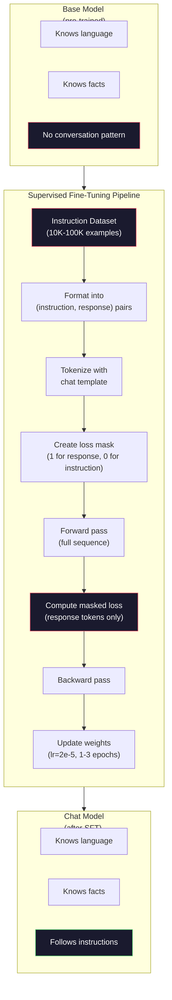

# Réglage des instructions (RGF)

> Le modèle de base 会预测下一个 Token──仅此而已── il ne suivra pas les instructions, répondra aux questions, ni refusera les demandes nocives──SFT est le pont entre le Token 预测器和有用助手──

**类型：**Construire
**语言：**Python (avec numpy)
**前置要求：**Phase 10, leçon 04 (Préentraînement d'un mini-GPT)
**时间：**- 90 minutes

## Objectif de l'apprentissage

- 实现 supervisé fine-tuning (SFT),将 base modèle de langue 转换为遵循指令的助手
- Utilisation contenant le système, l'utilisateur et l'assistant des modèles de chat du rôle Formation de formation données, et non-assistant Token Protection Perte
- Expliquer pourquoi la FSS est nécessaire: les modèles de base continueront à écrire, plutôt que de répondre aux questions
- 通过在保留的指令集 上比较基模型与细调模型的回复,评估SFT质量

##  problématique

Vous avez entraîné un modèle dans la leçon 04 . Donnez-lui une séquence, il peut prévoir le prochain jeton . Il peut ensuite entrer "L'architecture du transformateur", il peut ensuite sortir "a révolutionné le traitement du langage naturel". Pour un prédicteur de jeton suivant, c'est très fort.

现在试试这个:向它输入 "Qu'est-ce que la capitale de la France?" modèle de base ne répond pas "Paris". Il continuera ce modèle. Il peut générer "Qu'est-ce que la capitale de l'Allemagne? Quelle est la capitale de l'Espagne?", parce qu'il est parti de contenir des problèmes de liste de documents.

C'est la différence entre le modèle de base GPT-3 (en anglais) et le modèle de base ChatGPT (en anglais) (en anglais) (en anglais) (en anglais) (en anglais) (en anglais) (en anglais) (en anglais) (en anglais) (en anglais) (en anglais) (en anglais) (en anglais) (en anglais) (en anglais) (en anglais) (en anglais) (en anglais) (en anglais) (en anglais) (en anglais) (en anglais) (en anglais) (en anglais) (en anglais) (en anglais) (en anglais) (en anglais) (en anglais) (en anglais) (en anglais) (en anglais) (en anglais) (en anglais) (en anglais) (en anglais) (en anglais) (en anglais) (en anglais) (en anglais) (en anglais) (en anglais) (en anglais) (en anglais) (en anglais) (en anglais) (en anglais) (en anglais) (en anglais) (en anglais) (en anglais) (en anglais) (en anglais) (en anglais) (en anglais) (en anglais) (en anglais) (en anglais) (en anglais) (en anglais) (en anglais) (en anglais)).

Stanford Alpaca  prouve que vous n'avez pas besoin de plusieurs millions d'exemples. En 2023, ils ont effectué une mise à jour fine de 52,000 instructions-réponse de GPT-3.5 à l'égard de Llama 7B. Le résultat est un chatbot capable de suivre les instructions, de répondre aux questions et de mener un dialogue.

Meta's Llama 2 Chat a utilisé environ 27 000 exemples de haute qualité à la première phase de la SFT.

## 概念

### SFT  réellement fait quoi

Supervisé Fine-Tuning 延续了预训练中相同的训练循环--前过,计算损失,后过,更新权重--但使用的是另一类数据──你训练的不是原始文本,而是结构化对话:

```json
{
  "system": "You are a helpful assistant.",
  "user": "What is the capital of France?",
  "assistant": "The capital of France is Paris."
}
```

Le modèle  déjà sait que Paris est la capitale de la France. Il a appris cela sur Wikipédia, les matières et les pages Web.

Il faut comprendre ceci:

### Format de données

Il existe trois types de formats dans l'industrie. Chaque type de formats code le même message.

**Alpaca Format**(Stanford, mars 2023):

```json
{
  "instruction": "Summarize the following article in 3 sentences.",
  "input": "The European Central Bank raised interest rates...",
  "output": "The ECB increased rates by 25 basis points..."
}
```

简单且被广泛使用──`input`字段是可选的-- 许多指令不需要额外上下文──Stanford 发布了52,000 个这样的格式的例子,由GPT-3.5 以 600 美元的成本产生──这开启了开源指令调节运动──

**ShareGPT Format**(communauté, 2023):

```json
{
  "conversations": [
    {"from": "system", "value": "You are a helpful assistant."},
    {"from": "human", "value": "What causes tides?"},
    {"from": "gpt", "value": "Tides are caused by the gravitational pull of the Moon..."},
    {"from": "human", "value": "How often do they occur?"},
    {"from": "gpt", "value": "Most coastal areas experience two high tides and two low tides per day..."}
  ]
}
```

支持多轮对话──按照惯例, "from" 字段使用"human" 和 "gpt",不管实际模型是什么──Vicuna 使用从用户共享的ChatGPT转录中抓取的70,000条 ShareGPT 对话进行训练──

**ChatML Format**(OpenAI, utilisé par de nombreux modèles open source):

```
<|im_start|>system
You are a helpful assistant.<|im_end|>
<|im_start|>user
What is the capital of France?<|im_end|>
<|im_start|>assistant
The capital of France is Paris.<|im_end|>
```

Utilisation de jetons spéciaux`<|im_start|>`- Je suis là.`<|im_end|>`Ces Token seront ajoutés au vocabulaire du Tokenizer pendant la mise à jour.

Les trois formes réalisent la même chose: elles disent au modèle  c'est l'instruction, c'est la réponse, apprendre ce modèle

### Pourquoi ça marche ?

Le modèle  déjà utilisé depuis la pré-formation                                                                                                                                                                                                                                                                                                                                                                                                                                                                                                                    

SFT se concentrera sur ce potentiel. Le modèle n'a plus besoin de se juger du texte ci-dessus ou de continuer à répondre au problème.

C'est pourquoi 27 000 exemples suffisent. Vous n'enseignez pas un modèle de langue anglaise. Vous n'enseignez pas des faits sur le monde. Vous lui enseignez un comportement simple: une instruction de réponse.

### Perte masquée

C'est le plus important des détails techniques de la SFT, et la plupart des cours le sautent.

Pendant la période de pré-entraînement, vous allez voir chaque jeton calculer la perte de données. Pendant la période de SFT, vous allez voir seulement la réponse à la question.

Pourquoi? Parce que tu ne veux pas de modèle 学会*生成*指令──你希望它学会*响应*指令── Si tu as des instructions Token 计算 Loss, tu es en train de modèle 预测 "Qu'est la capitale de la France?", comme si c'était le seul questionnaire── Cela va gaspiller un signal graduel,并可能让模型产生混──

實踐中,你會创建一个损失面具:response Token 为 1,instruction Token 为 0──在取平均之前,将每个 Token 的损失 乘以这个面具──

```
Tokens:    [SYS] You are helpful [USER] What is the capital? [ASST] Paris is the capital [EOS]
Loss mask:   0    0    0     0      0     0   0  0     0       1     1    1   1     1      1
```

- Je ne sais pas .`[ASST]`后后的Token 会贡献 Loss──model 在前进传递期间会看到完整对话(它需要指令才能产生正确反应),但只根据它的预测反应的效果来更新重量──

### 训练 Hyperparametres

Les hyperparametres utilisés par les SFT sont nettement différents de ceux utilisés par les pré-entraînements.

| Parameter | Pre-Training (Llama 2 7B) | SFT (Llama 2 Chat) |
|-----------|---------------------------|---------------------|
| Learning rate | 3e-4 (peak) | 2e-5 |
| Epochs | 1（单次遍历数据） | 2 |
| Batch size | 4M tokens | 64 examples |
| Warmup steps | 2,000 | 0-100 |
| Weight decay | 0.1 | 0.0-0.1 |
| Data size | 2T tokens | 27,000 examples |

Le taux d'apprentissage de la SFT est inférieur à 15 fois. Ce point est très important. Le taux d'apprentissage trop élevé pendant le réglage de la mise à jour va détruire les connaissances prétrainées.

两个时代意味着模型会看到每个训练示例两次――在小数据集上超过3时代会导致记忆化 - modèle 开始逐字复现训练示例,而不是泛化――

### L'oubli catastrophique

Le réglage peut nuire à la capacité générale de formation sur les données après instruction trop longtemps, le modèle peut perdre la capacité d'écrire du code, de faire des mathématiques ou de générer des textes créatifs.

3 modes de réparation:

1. **低 learning rate。**1e-5 à 5e-5,.. Les mises à jour plus petites signifient moins de dégâts aux caractéristiques prétrainées,..

2. **短训练。**1 à 3 époques:

3. **混入 pre-training 数据。**Llama 2 Chat 将一小部分(2-5%) original pré-entraînement 数据混入 SFT dataset──这样可以在学习新指令后行行为时,提醒模型 保持通用能力──

### Numéro réel

Dans 10 000 paires d'instructions de haute qualité, un modèle 7B est ajusté en utilisant un seul GPU NVIDIA A100 de 80 Go.

- 10 000 exemples x 平均 512 jetons = 5,12M jetons
- 2 époques = 总计 10,24M jetons
- A100 pour le modèle 7B de réglage de la résistance: ~ 3000 jetons/seconde
- 10,24M / 3000 = ~ 3,400 secondes = ~ 57 minutes

Pour notre mini GPT (à 4 couches, 128 dims), l'entraînement est presque instantané.




```figure
loss-masking
```

## Construction

### 步骤 1: Ensemble de données d'instructions

 Créer un ensemble de données d'instructions synthétiques ∙ Dans un environnement de production, des entreprises comme Scale AI et Anthropic emploient des marqueurs artificiels pour rédiger ces données ∙ Nous les créons de manière programmée, en format de démonstration ∙

```python
import numpy as np

INSTRUCTION_DATA = [
    {
        "instruction": "What is the capital of France?",
        "response": "The capital of France is Paris."
    },
    {
        "instruction": "Explain gravity in one sentence.",
        "response": "Gravity is the force that attracts objects with mass toward each other."
    },
    {
        "instruction": "Write a haiku about the ocean.",
        "response": "Waves crash on the shore, salt and foam beneath the sun, endless blue expanse."
    },
    {
        "instruction": "What is 15 multiplied by 7?",
        "response": "15 multiplied by 7 is 105."
    },
    {
        "instruction": "Name three programming languages.",
        "response": "Three programming languages are Python, Rust, and TypeScript."
    },
    {
        "instruction": "Summarize photosynthesis.",
        "response": "Photosynthesis converts sunlight, water, and carbon dioxide into glucose and oxygen."
    },
    {
        "instruction": "What year did World War II end?",
        "response": "World War II ended in 1945."
    },
    {
        "instruction": "Define machine learning.",
        "response": "Machine learning is a field where algorithms learn patterns from data to make predictions."
    },
]
```

8 exemples très rares. Stanford Alpaca a utilisé 52.000 ⋅ mais que vous en ayez 8 ou 52.000, le mécanisme est le même:

### 步骤 2: Utilise le modèle de chat  effectuer le jetonage

Pour les instructions, les paires de réponses sont transformées en des marqueurs de rôle spéciaux.

```python
SPECIAL_TOKENS = {
    "INST_START": 253,
    "INST_END": 254,
    "RESP_START": 255,
}


def tokenize_instruction_pair(instruction, response, vocab_size=256):
    inst_tokens = list(instruction.encode("utf-8"))
    resp_tokens = list(response.encode("utf-8"))

    inst_tokens = [min(t, vocab_size - 4) for t in inst_tokens]
    resp_tokens = [min(t, vocab_size - 4) for t in resp_tokens]

    tokens = (
        [SPECIAL_TOKENS["INST_START"]]
        + inst_tokens
        + [SPECIAL_TOKENS["INST_END"]]
        + [SPECIAL_TOKENS["RESP_START"]]
        + resp_tokens
    )

    return tokens


def create_loss_mask(tokens):
    mask = np.zeros(len(tokens), dtype=np.float32)
    in_response = False

    for i, token in enumerate(tokens):
        if token == SPECIAL_TOKENS["RESP_START"]:
            in_response = True
            continue
        if in_response:
            mask[i] = 1.0

    return mask
```

Masque de perte pour les instructions Token 全部为零, pour les réponses Token 全部为一。`RESP_START`Le masque du symbole est 0, car il est un séparateur, pas une partie du contenu de la réponse.

### 步骤 3: Perte de croisement masquée

標準 cross-entropie, mais乘以损失面具──只有响应代币 会贡献 Gradient──

```python
def masked_cross_entropy_loss(logits, targets, loss_mask):
    batch, seq_len, vocab_size = logits.shape
    logits_flat = logits.reshape(-1, vocab_size)
    targets_flat = targets.reshape(-1)
    mask_flat = loss_mask.reshape(-1)

    max_logits = logits_flat.max(axis=-1, keepdims=True)
    log_softmax = logits_flat - max_logits - np.log(
        np.exp(logits_flat - max_logits).sum(axis=-1, keepdims=True)
    )

    per_token_loss = -log_softmax[np.arange(len(targets_flat)), targets_flat]

    masked_loss = per_token_loss * mask_flat
    num_response_tokens = mask_flat.sum()
    if num_response_tokens == 0:
        return 0.0
    loss = masked_loss.sum() / num_response_tokens

    return loss
```

- Je suis là .`num_response_tokens`- Je ne suis pas ...`seq_len` Si les instructions sont déduites de la longueur de la séquence, les instructions sont plus longues.

### 步骤 4: cycle de formation de la FFT

Le cycle de formation miniGPT en leçon 04 ressemble presque à celui de la pré-entraînement, il s'agit simplement de la mise en forme des instructions et de la perte masquée.

```python
import sys
import os
sys.path.insert(0, os.path.join(os.path.dirname(__file__), "..", "..", "04-pre-training-mini-gpt", "code"))
from main import MiniGPT, LayerNorm, FeedForward, MultiHeadAttention, TransformerBlock, Embedding


def sft_train(model, dataset, num_epochs=2, lr=2e-5, seq_len=64):
    formatted_data = []
    for example in dataset:
        tokens = tokenize_instruction_pair(example["instruction"], example["response"])
        mask = create_loss_mask(tokens)
        formatted_data.append((tokens, mask))

    print(f"SFT Training: {len(formatted_data)} examples, {num_epochs} epochs, lr={lr}")
    print(f"Total tokens: {sum(len(t) for t, _ in formatted_data):,}")
    print()

    losses = []

    for epoch in range(num_epochs):
        epoch_loss = 0.0
        num_batches = 0

        indices = np.random.permutation(len(formatted_data))

        for idx in indices:
            tokens, mask = formatted_data[idx]

            if len(tokens) < 3:
                continue
            if len(tokens) > seq_len:
                tokens = tokens[:seq_len]
                mask = mask[:seq_len]

            input_ids = np.array(tokens[:-1]).reshape(1, -1)
            target_ids = np.array(tokens[1:]).reshape(1, -1)
            loss_mask = np.array(mask[1:]).reshape(1, -1)

            logits = model.forward(input_ids)
            loss = masked_cross_entropy_loss(logits, target_ids, loss_mask)

            batch_size, s_len, v_size = logits.shape
            probs = np.exp(logits - logits.max(axis=-1, keepdims=True))
            probs = probs / probs.sum(axis=-1, keepdims=True)
            dlogits = probs.copy()
            dlogits[np.arange(batch_size)[:, None], np.arange(s_len), target_ids] -= 1.0

            mask_expanded = loss_mask[:, :, np.newaxis]
            num_resp = loss_mask.sum()
            if num_resp > 0:
                dlogits = dlogits * mask_expanded / num_resp

            for block in model.blocks:
                block.ffn.W1 -= lr * np.random.randn(*block.ffn.W1.shape) * 0.01
                block.ffn.W2 -= lr * np.random.randn(*block.ffn.W2.shape) * 0.01
                block.ffn.b1 -= lr * np.random.randn(*block.ffn.b1.shape) * 0.01
                block.ffn.b2 -= lr * np.random.randn(*block.ffn.b2.shape) * 0.01

            epoch_loss += loss
            num_batches += 1
            losses.append(loss)

        avg_loss = epoch_loss / max(num_batches, 1)
        print(f"Epoch {epoch + 1}/{num_epochs} | Avg Loss: {avg_loss:.4f}")

    return model, losses
```

Le taux d'apprentissage est de 2e-5, avec Llama 2 Chat 匹配──将它与预训中使用的 3e-4对比── 小 15 倍── Gradient 被面具:指示令令令令令令令令令令令令令令令令令令令令令令令令令令令令令令令令令令令令令令令令令令令令令令令令令令令令令令令令令令令令令令令令令令令令令令令令令令令令令令令令令令令令令令令令令令令令令令令令令令令令令令令令令令令令令令令令令令令令令令令令令令令令令令令令令令令令令令令令令令令令令令令令令令令令令令令令令令令令令令令令令令令令令令令令令令令令令令令令令令令令令令令令令令令令令令令令令令令令令令令令令令令令令令令令令令令令令令令令令令令令令令令令令令令令令令令令令令令令令令令令令令令令令令令令令令令令令令令令令令令令令令令令令令令令令令令令令令令令令令令令令令令令令令令令令令令令令令令令令令令令令令令令令令令令令令令令令令令令令令令令令令令令令令令令令令令令令令令令令令令令令令令令令令令令令令令令令令令令令令令令令令令令令令令令令令令令令令令令令令令令令令令令令令令令令令令令令令令令令令令令令令令令令令令令令令令令令令令令令令令令令令令令令令令令令令令令令令令令令令令令令令令令令令令令令令令令令令令令令令令令令

### étape 5: Comparer le modèle de base à celui de la SFT

Tout le sens de la SFT réside dans le changement de comportement.

```python
def generate_response(model, prompt_tokens, max_new_tokens=50, temperature=0.8):
    tokens = list(prompt_tokens)
    seq_len = model.embedding.pos_embed.shape[0]

    for _ in range(max_new_tokens):
        context = np.array(tokens[-seq_len:]).reshape(1, -1)
        logits = model.forward(context)
        next_logits = logits[0, -1, :]

        next_logits = next_logits / max(temperature, 1e-8)
        probs = np.exp(next_logits - next_logits.max())
        probs = probs / probs.sum()
        probs = np.clip(probs, 1e-10, 1.0)
        probs = probs / probs.sum()

        next_token = np.random.choice(len(probs), p=probs)
        tokens.append(int(next_token))

    return tokens


def evaluate_instruction_following(model, instructions):
    print("Evaluating instruction following:")
    print("-" * 50)

    for instruction in instructions:
        tokens = (
            [SPECIAL_TOKENS["INST_START"]]
            + [min(t, 252) for t in list(instruction.encode("utf-8"))]
            + [SPECIAL_TOKENS["INST_END"]]
            + [SPECIAL_TOKENS["RESP_START"]]
        )

        output = generate_response(model, tokens, max_new_tokens=30, temperature=0.6)
        response_start = len(tokens)
        response_tokens = output[response_start:]
        response_bytes = bytes([t for t in response_tokens if t < 128])
        response_text = response_bytes.decode("utf-8", errors="replace")

        print(f"  Q: {instruction}")
        print(f"  A: {response_text[:80]}")
        print()
```

Dans seulement 8 exemples de modèles minuscules, le répétition n'aura pas de sens réel. C'est ce qui est prévu.

### 步骤 6: Mesurer l'oubli catastrophique

Comparer la capacité de prévision des prochains jetons du modèle précédent de SFT à la fin. Si le SFT perd la capacité de fonctionnement, la perte du texte brut sera plus élevée.

```python
def measure_forgetting(model, test_text, seq_len=64):
    tokens = np.array(list(test_text.encode("utf-8")[:512]))

    total_loss = 0.0
    num_windows = 0

    for start in range(0, len(tokens) - seq_len - 1, seq_len):
        input_ids = tokens[start:start + seq_len].reshape(1, -1)
        target_ids = tokens[start + 1:start + seq_len + 1].reshape(1, -1)

        logits = model.forward(input_ids)

        batch, s_len, vocab_size = logits.shape
        logits_flat = logits.reshape(-1, vocab_size)
        targets_flat = target_ids.reshape(-1)

        max_logits = logits_flat.max(axis=-1, keepdims=True)
        log_softmax = logits_flat - max_logits - np.log(
            np.exp(logits_flat - max_logits).sum(axis=-1, keepdims=True)
        )

        loss = -log_softmax[np.arange(len(targets_flat)), targets_flat].mean()
        total_loss += loss
        num_windows += 1

    return total_loss / max(num_windows, 1)
```

Dans la mise à jour réelle, vous suivrez cette métrique tout au long du processus d'entraînement. Si la perte de texte brut augmente de plus de 10 à 15%, indique que votre SFT est trop actif.

## Utilisation

### 完整 SFT Pipeline démo

```python
if __name__ == "__main__":
    np.random.seed(42)

    test_text = """The transformer architecture processes sequences through self-attention.
Each layer applies multi-head attention followed by a feedforward network.
Residual connections and layer normalization stabilize deep networks.
The model learns to predict the next token given all previous tokens."""

    print("=" * 70)
    print("INSTRUCTION TUNING (SFT) DEMO")
    print("=" * 70)
    print()

    model = MiniGPT(
        vocab_size=256, embed_dim=128, num_heads=4,
        num_layers=4, max_seq_len=128, ff_dim=512
    )
    print(f"Model: {model.count_parameters():,} parameters")
    print(f"Config: 4 layers, 4 heads, 128 dims (mini GPT from Lesson 04)")
    print()

    print("PRE-SFT: Measuring base model loss on raw text")
    base_loss = measure_forgetting(model, test_text)
    print(f"  Base model loss: {base_loss:.4f}")
    print()

    print("=" * 70)
    print("SFT TRAINING")
    print("=" * 70)

    model, losses = sft_train(
        model, INSTRUCTION_DATA, num_epochs=3, lr=2e-5, seq_len=128
    )

    print()
    print("POST-SFT: Measuring fine-tuned model loss on raw text")
    sft_loss = measure_forgetting(model, test_text)
    print(f"  SFT model loss: {sft_loss:.4f}")
    print(f"  Change: {((sft_loss - base_loss) / base_loss * 100):+.1f}%")
    if abs(sft_loss - base_loss) / base_loss < 0.15:
        print("  Minimal forgetting (< 15% change)")
    else:
        print("  Significant forgetting detected")
    print()

    print("=" * 70)
    print("INSTRUCTION FOLLOWING EVALUATION")
    print("=" * 70)
    print()

    test_instructions = [
        "What is the capital of France?",
        "Name a programming language.",
        "Define gravity.",
    ]
    evaluate_instruction_following(model, test_instructions)

    print("=" * 70)
    print("DATA FORMAT EXAMPLES")
    print("=" * 70)
    print()

    for i, example in enumerate(INSTRUCTION_DATA[:3]):
        tokens = tokenize_instruction_pair(example["instruction"], example["response"])
        mask = create_loss_mask(tokens)
        resp_count = int(mask.sum())
        total_count = len(tokens)
        print(f"  Example {i + 1}: {total_count} tokens, {resp_count} response tokens ({resp_count/total_count:.0%} of sequence)")
        print(f"    Instruction: {example['instruction']}")
        print(f"    Response: {example['response']}")
        print()

    print("=" * 70)
    print("TRAINING LOSS CURVE")
    print("=" * 70)
    print()

    if losses:
        window = max(1, len(losses) // 5)
        for i in range(0, len(losses), window):
            chunk = losses[i:i + window]
            avg = sum(chunk) / len(chunk)
            print(f"  Steps {i:3d}-{i + len(chunk) - 1:3d}: avg loss = {avg:.4f}")
```

## 交付

本课会产出 `outputs/prompt-sft-data-curator.md`-- Un prompt, qui vous aidera à concevoir et concevoir des ensembles de données d'instructions SFT.

## 练习

1. 添加 système prompt 支持──修改 `tokenize_instruction_pair`, faire accepter le message système,并将其放在指示之前──创建 5 个带有不同系统提示的例子:"Tu es un poète"",Tu es un professeur de mathématiques") ,并验证模型 在训练期间会看到不同的系统提示──

2. 实现 data mixing── créer une fonction, recevoir un ensemble de données SFT 和 un corpus de texte brut, puis générer des lots de formation, dont 5% des exemples sont du texte brut( sans masquage), 95% sont des paires d'instructions(masquées)──运行 3 个时代,并将忘记指标与纯SFT培训 进行比较──

3. 构建数据质量评分器──对每个命令-响应对,计算:(a) la durée de la réponse dans les jetons,(b) le rapport instruction-réponse,(c) diversité du vocabulaire(tokens uniques / jetons totaux)──过掉响应长度 < 10 jetons 或 diversité < 0.3 的示例──展示过如何影响最终 Loss──

4. 实现 multi-turn conversation training── élargir la tokenization, faire en sorte de traiter les conversations en 3 tours(utilisateur-assistant-utilisateur-assistant-utilisateur-assistant)──perte de masque 应覆盖全部三个助手转──通过打印一个示例的代币-masque alignement 来验证面具 是否正确──

5. Comparer les taux d'apprentissage. Avec lr=1e-4、lr=2e-5 和 lr=1e-6 分别训练同一个模型 三次──绘制损失曲线──1e-4 的运行应显示快速初始下降但最终 Loss 更高(overfitting)──1e-6 的运行应几乎没有变──2e-5 的运行应是最佳点──

## 关键术语

| Term | 常见说法 | 实际含义 |
|------|----------------|----------------------|
| SFT | “在对话上 fine-tuning” | Supervised Fine-Tuning：在 (instruction, response) pairs 上继续训练，并且只对 response Token 计算 Loss |
| Instruction tuning | “教 model 遵循指令” | 在显式 instruction-response pairs 上训练，使 base model 学会对话模式，而不是新知识 |
| Loss masking | “忽略 prompt” | 将 instruction Token 的 Loss 设为零，使 Gradient 只来自 response Token 预测 |
| ChatML | “Chat Markup Language” | 一种 Token 格式，使用 `<\|im_start\|>` 和 `<\|im_end\|>` 分隔符标记 conversation data 中的说话者角色 |
| Alpaca format | “Stanford 的格式” | 一种包含 instruction/input/output 字段的 JSON 格式，用于 52K 个由 GPT-3.5 生成、成本为 600 美元的示例 |
| Catastrophic forgetting | “model 变笨了” | Fine-tuning 会破坏 pre-trained capabilities，因为 Gradient 更新会用 task-specific patterns 覆盖 general knowledge |
| Weight tying | “共享 Embeddings” | 对 input Token Embeddings 和 output prediction head 使用同一个 Matrix，从而节省参数并提升一致性 |
| Chat template | “prompt 的格式化方式” | 用于为 model 结构化对话的特定 Token 序列（role markers、delimiters） |

## 延伸阅读

- [Ouyang et al., 2022 -- "Training language models to follow instructions with human feedback" (InstructGPT)](https://arxiv.org/abs/2203.02155)-- 在 OpenAI 引入 instruction tuning + RLHF 的论文
- [Taori et al., 2023 -- "Stanford Alpaca: An Instruction-following LLaMA Model"](https://github.com/tatsu-lab/stanford_alpaca)-- Basé sur des exemples d'instructions de 52K générés à 600 $, prouver que le SFT est également valable sur les petits fichiers
- [Touvron et al., 2023 -- "Llama 2: Open Foundation and Fine-Tuned Chat Models"](https://arxiv.org/abs/2307.09288)-- Meta utiliser 27K exemple de haute qualité du pipeline SFT + RLHF
- [Chiang et al., 2023 -- "Vicuna: An Open-Source Chatbot Impressing GPT-4"](https://lmsys.org/blog/2023-03-30-vicuna/)-- dans 70K ShareGPT conversations sur faire de l' entraînement
- [Zhou et al., 2023 -- "LIMA: Less Is More for Alignment"](https://arxiv.org/abs/2305.11206)--  prouver que 1000 exemples de planification minutieuse peuvent être adaptés à des SFT dans des données plus grandes
