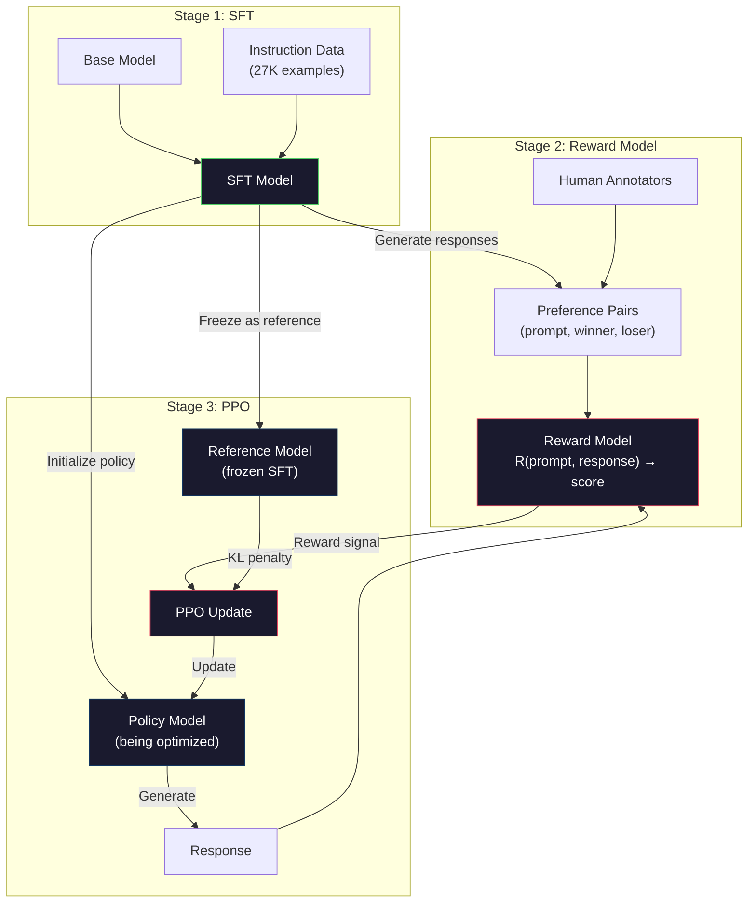
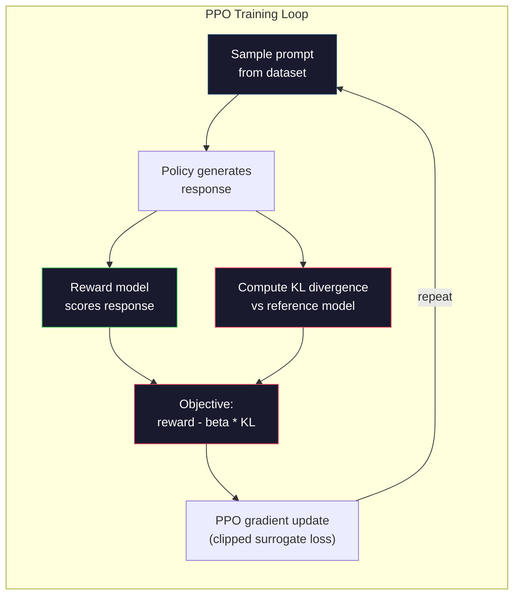

# RLHF: modèle de récompense + PPO

> Le modèle de l'Église SFT suit les instructions. Mais il ne donne pas à ce modèle une meilleure réponse. Les deux phrases correctes peuvent être très différentes en termes d'utilité.

**类型：**Construction
**语言：**Python avec numpy)
**前置要求：**Phase 10, leçon 06 ((Tuning des instructions / SFT)
**时间：**À environ 90 minutes.

## Objectif de l'apprentissage
- Construire un modèle de récompense, avec les préférences humaines à la récompense
-                                                                                                                                                                                                                                                                                                                                                                                                                                                                                                                              
-  expliquer pourquoi RLHF  besoin de trois modèles   SFT 、 récompense 、 politique), ainsi que la contrainte KL  comment prévenir le piratage de la récompense
- En comparant l'optimisation des préférences                                                                                                                                                                                                                                                        

##  problématique
À l'aide de l'exemple, vous pouvez obtenir:

**Response A:**Le calcul quantique utilise des qubits, ils peuvent être superposés, ce qui signifie qu'ils peuvent être 0/1, ou en même temps les deux. Cela permet aux ordinateurs quantiques de traiter certains calculs à une vitesse supérieure à celle des ordinateurs classiques. Les algorithmes clés comprennent l'algorithme de Shor utilisé pour décomposer des nombres massifs, ainsi que l'algorithme de Grover utilisé pour la recherche de bases de données non classées.

**Response B:**Le calcul quantique est une méthode de calcul utilisant les phénomènes de la quantité. Il a été proposé en 1980 par Richard Feynman. Il peut être utilisé comme un système quantique par ordinateur quantique.

Les deux réponses sont en fait toutes vraies. Les phrases sont toutes sans problème. Elles suivent toutes les instructions. Mais la réponse A est plus simple.

SFT ne peut pas saisir cette différence. Il existe un modèle de formation correctement répondant, mais aucun mécanisme n'exprime cette réponse mieux que celle-là. Il considère chaque modèle de formation comme étant le même.

RLHF  résolve ce problème. Il entraîne le modèle de récompense pour prédire quel type de réponse l'humanité préfère, puis utilise ce signal de récompense pour stimuler la production de langage.

## 概念
### Les trois étapes

La RLHF n'est pas une opération d'entraînement unique. Elle est un pipeline composé de trois étapes successives, chaque étape étant construite sur la première étape.

**Stage 1: SFT.**Dans les paires d'instructions-réponse, le modèle de base de formation est le modèle de base de l'instruction.

**Stage 2: Reward Model.**收集人类偏好数据:向标注者展示同一个提示的两个响应,并询问哪个更好?训练一个模型来预测这些偏好――奖励模型 以(快速,响应) 作为输入,并输出一个 skalar score――

**Stage 3: PPO.**Utilisation du modèle de récompense pour le modèle de langage 生成训练信号。Le modèle de langage 生成响应,Le modèle de récompense pour son打分,PPO 更新语言模型,使其产生分数更高的响应──KL divergence penalty 防止语言模型 偏离 SFT checkpoint 太远──



### Le modèle de récompense

Le modèle de récompense est modifié en mode langage de l'appareil de calcul. Il remplace le modèle de modèle de langage par un modèle de modèle de langage.

输入: un prompt avec réponse 拼接后后的序列──输出:单个 skalar reward score──

Pour chaque demande, le markant voit deux réponses et choisit la meilleure. Ceci crée une formation.

La fonction de perte utilise des préférences par paires du modèle Bradley-Terry:

```
loss = -log(sigmoid(reward(preferred) - reward(rejected)))
```

C'est une formule clé.`sigmoid(reward(A) - reward(B))` donner une réponse A par rapport à une réponse B plus de probabilité de recevoir une meilleure probabilité  Cette perte favorisera le modèle de récompense  donner une réponse préférée  分配更高分数

Pourquoi utiliser des comparaisons par paires plutôt que des scores absolus ? Parce que l'homme n'est pas très doué pour donner des fractions de qualité absolue  Cette réponse est 7,3 ou 7,5 ?), mais très doué pour comparer A par rapport à B mieux ?)  (Bradley-Terry modèle va transformer les comparaisons en un système de fractionnement absolue cohérent 

**InstructGPT numbers:**OpenAI a recueilli 33 000 paires de comparaisons auprès de 40 entrepreneurs.

### PPO: Optimisation des politiques proximales

Le PPO est un type d'algorithme d'apprentissage renforcé. Dans le RLHF, l'environnement est un modèle de récompense, l'agent est un modèle de langage, l'action est la génération d'un Token.

目标:

```
maximize: E[R(prompt, response)] - beta * KL(policy || reference)
```

Première étape: la réaction du modèle générant une grande récompense.

Pourquoi faut-il une pénalité KL? sans elle, le modèle trouvera une décomposition. Le modèle de récompense est dans un ensemble de données de préférences humaines limitées.

- Je suis si utile et inoffensive.
- Il est très bien fait pour les personnes qui ont des problèmes de santé.
- Utilisation des données de formation appropriée et des récompenses élevées

KL penalty express: vous pouvez améliorer, mais ne pouvez pas devenir un modèle complètement différent― il faut approcher la version SFT, car elle est déjà assez raisonnable―

**InstructGPT numbers:**Prise en charge de la formation de PPO Utilisez lr=1.5e-5、KL coefficient bêta=0.02、256K épisodes(pares de réponse rapide), et chaque lot effectue 4 个PPO époques。 l'ensemble du pipeline RLHF dans le cluster GPU 上需要数天时间。



### Objectif du PPO 详解

Le ratio entre la nouvelle politique et l'ancienne politique de probabilité sera réduit en [1 - epsilon, 1 + epsilon]                                                                                                                                                                                                                                                                                                                                                                                                                                                                                               

```
ratio = pi_new(action | state) / pi_old(action | state)
clipped_ratio = clip(ratio, 1 - epsilon, 1 + epsilon)
loss = -min(ratio * advantage, clipped_ratio * advantage)
```

Fonction avantageuse  estimation de la réponse actuelle par rapport à la qualité prévue beaucoup moins.

```
advantage = reward(prompt, response) - baseline
```

Le point de départ est généralement la récompense moyenne de la réponse à court terme. L'avantage positif indique que la réponse est supérieure à la moyenne; l'avantage négatif indique qu'elle est inférieure à la moyenne.

Le clippage empêche la mise à jour catastrophique. Si une seule réponse obtient une récompense exceptionnellement élevée, le ratio de non-coupage peut être très élevé, conduisant au modèle à se tourner considérablement vers la réponse.

### Les récompenses du piratage

C'est le modèle de la RLHF. Le modèle de langue est en train d'être orienté vers le modèle de récompense  optimisation, tandis que le modèle de récompense est un agent imparfait des préférences humaines.

常见失败模式:

| Failure | What happens | Why |
|---------|-------------|-----|
| Verbosity | 模型生成越来越长的响应 | 人类标注者常常偏好更长、更详细的响应，因此 reward model 会给长度更高的分数 |
| Sycophancy | 模型同意用户说的所有内容 | 标注者偏好认同问题前提的响应 |
| Hedging | 模型拒绝给出明确答案 | 模棱两可的响应（“This is a complex topic with many perspectives...”）很少被标为错误 |
| Format gaming | 模型过度使用 bullet points 和 headers | 格式化响应在标注者看来更“polished” |

缓解策略:更强的 KL penalty (prévenir le déviation du modèle jusqu'à suffire pour exploiter le degré de faiblesse)  dans les exemples d'adversité (上训练奖励模型)  modifier le mode de défaillance connu), ainsi que l'utilisation de plusieurs modèles de récompense de différentes architectures (更难同时攻破所有模型) 

### Les conduites de RLHF réelles

| Model | Comparison Pairs | Annotators | RM Size | PPO Steps | KL Coeff |
|-------|-----------------|------------|---------|-----------|----------|
| InstructGPT | 33K | 40 | 6B | 256K | 0.02 |
| Llama 2 Chat | ~1M | undisclosed | 70B | undisclosed | 0.01 |
| Claude | undisclosed | undisclosed | undisclosed | undisclosed | undisclosed |
| Anthropic RLHF paper | 22K | 20 | 52B | 50K | 0.001 |

Le rapport de l'Anthropic 2022 a comparé 22 000 modèles de récompense à 52B. Les modèles de récompense plus grands produisent des signaux plus fiables, ce qui permet à la formation de PPO de mieux se stabiliser.


```figure
rlhf-pipeline
```

## - Je le construis.
### 步骤 1: Données de préférence synthétiques

Dans la production, les étiquetteurs humains créent des données de préférence.

```python
import numpy as np

PREFERENCE_DATA = [
    {
        "prompt": "What is the capital of France?",
        "preferred": "The capital of France is Paris.",
        "rejected": "France is a country in Europe. It has many cities. The capital is Paris. Paris is known for the Eiffel Tower.",
    },
    {
        "prompt": "Explain gravity in one sentence.",
        "preferred": "Gravity is the force that attracts objects with mass toward each other.",
        "rejected": "Gravity is something that makes things fall down when you drop them.",
    },
    {
        "prompt": "What is 15 times 7?",
        "preferred": "15 times 7 is 105.",
        "rejected": "Let me think about this. 15 times 7. Well, 10 times 7 is 70, and 5 times 7 is 35, so the answer might be around 105.",
    },
    {
        "prompt": "Name three programming languages.",
        "preferred": "Python, Rust, and TypeScript.",
        "rejected": "There are many programming languages. Some popular ones include various languages like Python and others.",
    },
    {
        "prompt": "What year did World War II end?",
        "preferred": "World War II ended in 1945.",
        "rejected": "World War II was a major global conflict. It involved many countries. The war ended in the mid-1940s, specifically in 1945.",
    },
    {
        "prompt": "Define machine learning.",
        "preferred": "Machine learning is a field where algorithms learn patterns from data to make predictions without being explicitly programmed.",
        "rejected": "Machine learning is a type of AI. AI stands for artificial intelligence. Machine learning uses data to learn.",
    },
]
```

Les réponses préférées 简洁而直接── Réponses rejetées 展现了常见失败模式:不必要的填充、封闭、冗余解释和不精确── ceci est vrai que les SFT ne peuvent pas être capturées, mais les RLHF peuvent être captées différences──

### 步骤 2: Architecture de modèle de récompense

Modèle de récompense 复用 mini GPT 中的Transformer architecture, mais va remplacer le vocabulaire de taille tête de sortie 替换为单个 skalar projection。

```python
import sys
import os
sys.path.insert(0, os.path.join(os.path.dirname(__file__), "..", "..", "04-pre-training-mini-gpt", "code"))
from main import MiniGPT, LayerNorm, Embedding, TransformerBlock


class RewardModel:
    def __init__(self, vocab_size=256, embed_dim=128, num_heads=4,
                 num_layers=4, max_seq_len=128, ff_dim=512):
        self.embedding = Embedding(vocab_size, embed_dim, max_seq_len)
        self.blocks = [
            TransformerBlock(embed_dim, num_heads, ff_dim)
            for _ in range(num_layers)
        ]
        self.ln_f = LayerNorm(embed_dim)
        self.reward_head = np.random.randn(embed_dim) * 0.02

    def forward(self, token_ids):
        seq_len = token_ids.shape[-1]
        mask = np.triu(np.full((seq_len, seq_len), -1e9), k=1)

        x = self.embedding.forward(token_ids)
        for block in self.blocks:
            x = block.forward(x, mask)
        x = self.ln_f.forward(x)

        last_hidden = x[:, -1, :]
        reward = last_hidden @ self.reward_head

        return reward
```

Modèle de récompense prend l'état caché de chaque Token, et le projette en échelle. Pourquoi est-ce le dernier Token?

### 3e étape: Bradley-Terry Loss

Utilisez Bradley-Terry par défaut par défaut dans les paires de préférence

```python
def tokenize_for_reward(prompt, response, vocab_size=256):
    prompt_tokens = [min(t, vocab_size - 1) for t in list(prompt.encode("utf-8"))]
    response_tokens = [min(t, vocab_size - 1) for t in list(response.encode("utf-8"))]
    return prompt_tokens + [0] + response_tokens


def sigmoid(x):
    return np.where(
        x >= 0,
        1.0 / (1.0 + np.exp(-x)),
        np.exp(x) / (1.0 + np.exp(x))
    )


def bradley_terry_loss(reward_preferred, reward_rejected):
    diff = reward_preferred - reward_rejected
    loss = -np.log(sigmoid(diff) + 1e-8)
    return loss


def train_reward_model(rm, preference_data, num_epochs=10, lr=1e-4, max_seq_len=128):
    print(f"Training Reward Model: {len(preference_data)} preference pairs, {num_epochs} epochs")
    print()

    losses = []
    accuracies = []

    for epoch in range(num_epochs):
        epoch_loss = 0.0
        epoch_correct = 0
        num_pairs = 0

        indices = np.random.permutation(len(preference_data))

        for idx in indices:
            pair = preference_data[idx]

            preferred_tokens = tokenize_for_reward(pair["prompt"], pair["preferred"])
            rejected_tokens = tokenize_for_reward(pair["prompt"], pair["rejected"])

            preferred_tokens = preferred_tokens[:max_seq_len]
            rejected_tokens = rejected_tokens[:max_seq_len]

            preferred_ids = np.array(preferred_tokens).reshape(1, -1)
            rejected_ids = np.array(rejected_tokens).reshape(1, -1)

            r_preferred = rm.forward(preferred_ids)[0]
            r_rejected = rm.forward(rejected_ids)[0]

            loss = bradley_terry_loss(r_preferred, r_rejected)

            if r_preferred > r_rejected:
                epoch_correct += 1

            diff = r_preferred - r_rejected
            grad = sigmoid(diff) - 1.0

            rm.reward_head -= lr * grad * rm.ln_f.forward(
                rm.embedding.forward(preferred_ids)
            )[:, -1, :].flatten()

            epoch_loss += loss
            num_pairs += 1

        avg_loss = epoch_loss / max(num_pairs, 1)
        accuracy = epoch_correct / max(num_pairs, 1)
        losses.append(avg_loss)
        accuracies.append(accuracy)

        if epoch % 2 == 0:
            print(f"  Epoch {epoch + 1:3d} | Loss: {avg_loss:.4f} | Accuracy: {accuracy:.1%}")

    return rm, losses, accuracies
```

La précision des mesures est très directe: le modèle de récompense peut être correctement classé dans la proportion des paires de préférences ? Le modèle de récompense est de 50%.

### 步骤 4: boucle PPO simplifiée

L'ensemble du PPO est très complexe. Cette mise en œuvre a capturé le mécanisme central: générer des réactions, des frais, des avantages de calcul, et utiliser des pénalités KL.

```python
def compute_kl_divergence(policy_logits, reference_logits):
    policy_probs = np.exp(policy_logits - policy_logits.max(axis=-1, keepdims=True))
    policy_probs = policy_probs / policy_probs.sum(axis=-1, keepdims=True)
    policy_probs = np.clip(policy_probs, 1e-10, 1.0)

    ref_probs = np.exp(reference_logits - reference_logits.max(axis=-1, keepdims=True))
    ref_probs = ref_probs / ref_probs.sum(axis=-1, keepdims=True)
    ref_probs = np.clip(ref_probs, 1e-10, 1.0)

    kl = np.sum(policy_probs * np.log(policy_probs / ref_probs), axis=-1)
    return kl.mean()


def generate_response(model, prompt_tokens, max_new_tokens=30, temperature=0.8, max_seq_len=128):
    tokens = list(prompt_tokens)

    for _ in range(max_new_tokens):
        context = np.array(tokens[-max_seq_len:]).reshape(1, -1)
        logits = model.forward(context)
        next_logits = logits[0, -1, :]

        next_logits = next_logits / max(temperature, 1e-8)
        probs = np.exp(next_logits - next_logits.max())
        probs = probs / probs.sum()
        probs = np.clip(probs, 1e-10, 1.0)
        probs = probs / probs.sum()

        next_token = np.random.choice(len(probs), p=probs)
        tokens.append(int(next_token))

    return tokens


def copy_model_weights(source, target):
    target.embedding.token_embed = source.embedding.token_embed.copy()
    target.embedding.pos_embed = source.embedding.pos_embed.copy()
    target.ln_f.gamma = source.ln_f.gamma.copy()
    target.ln_f.beta = source.ln_f.beta.copy()
    for s_block, t_block in zip(source.blocks, target.blocks):
        t_block.attn.W_q = s_block.attn.W_q.copy()
        t_block.attn.W_k = s_block.attn.W_k.copy()
        t_block.attn.W_v = s_block.attn.W_v.copy()
        t_block.attn.W_out = s_block.attn.W_out.copy()
        t_block.ffn.W1 = s_block.ffn.W1.copy()
        t_block.ffn.W2 = s_block.ffn.W2.copy()
        t_block.ffn.b1 = s_block.ffn.b1.copy()
        t_block.ffn.b2 = s_block.ffn.b2.copy()
        t_block.ln1.gamma = s_block.ln1.gamma.copy()
        t_block.ln1.beta = s_block.ln1.beta.copy()
        t_block.ln2.gamma = s_block.ln2.gamma.copy()
        t_block.ln2.beta = s_block.ln2.beta.copy()


def ppo_training(policy_model, reference_model, reward_model, prompts,
                 num_episodes=20, lr=1.5e-5, kl_coeff=0.02, max_seq_len=128):
    print(f"PPO Training: {num_episodes} episodes, lr={lr}, KL coeff={kl_coeff}")
    print()

    rewards_history = []
    kl_history = []

    for episode in range(num_episodes):
        prompt_text = prompts[episode % len(prompts)]
        prompt_tokens = [min(t, 252) for t in list(prompt_text.encode("utf-8"))]

        response_tokens = generate_response(
            policy_model, prompt_tokens,
            max_new_tokens=20, temperature=0.8, max_seq_len=max_seq_len
        )

        response_ids = np.array(response_tokens[:max_seq_len]).reshape(1, -1)
        reward = reward_model.forward(response_ids)[0]

        policy_logits = policy_model.forward(response_ids)
        ref_logits = reference_model.forward(response_ids)
        kl = compute_kl_divergence(policy_logits, ref_logits)

        total_reward = reward - kl_coeff * kl

        rewards_history.append(float(reward))
        kl_history.append(float(kl))

        for block in policy_model.blocks:
            update_scale = lr * total_reward
            block.ffn.W1 += update_scale * np.random.randn(*block.ffn.W1.shape) * 0.01
            block.ffn.W2 += update_scale * np.random.randn(*block.ffn.W2.shape) * 0.01

        if episode % 5 == 0:
            avg_reward = np.mean(rewards_history[-5:]) if rewards_history else 0
            avg_kl = np.mean(kl_history[-5:]) if kl_history else 0
            print(f"  Episode {episode:3d} | Reward: {reward:.4f} | KL: {kl:.4f} | "
                  f"Avg Reward: {avg_reward:.4f}")

    return policy_model, rewards_history, kl_history
```

核心循环:(1)采样一个提示,(2)生成响应,(3) Utiliser le modèle de récompense 打分,(4) calculer la divergence de référence KL par rapport à 结,(5) calculer la récompense 减 KL penalty),(6) mettre à jour la politique。

### 步骤 5: Comparaison des scores de récompense

Après RLHF, la réponse du modèle de politique sur le modèle de récompense

```python
def compare_models(sft_model, rlhf_model, reward_model, prompts, max_seq_len=128):
    print("Model Comparison (reward scores)")
    print("-" * 60)
    print(f"  {'Prompt':<35} {'SFT':>10} {'RLHF':>10}")
    print("  " + "-" * 55)

    sft_total = 0.0
    rlhf_total = 0.0

    for prompt in prompts:
        prompt_tokens = [min(t, 252) for t in list(prompt.encode("utf-8"))]

        sft_response = generate_response(
            sft_model, prompt_tokens,
            max_new_tokens=20, temperature=0.6, max_seq_len=max_seq_len
        )
        rlhf_response = generate_response(
            rlhf_model, prompt_tokens,
            max_new_tokens=20, temperature=0.6, max_seq_len=max_seq_len
        )

        sft_ids = np.array(sft_response[:max_seq_len]).reshape(1, -1)
        rlhf_ids = np.array(rlhf_response[:max_seq_len]).reshape(1, -1)

        sft_reward = reward_model.forward(sft_ids)[0]
        rlhf_reward = reward_model.forward(rlhf_ids)[0]

        sft_total += sft_reward
        rlhf_total += rlhf_reward

        truncated_prompt = prompt[:33] + ".." if len(prompt) > 35 else prompt
        print(f"  {truncated_prompt:<35} {sft_reward:>10.4f} {rlhf_reward:>10.4f}")

    n = len(prompts)
    print("  " + "-" * 55)
    print(f"  {'Average':<35} {sft_total/n:>10.4f} {rlhf_total/n:>10.4f}")

    return sft_total / n, rlhf_total / n
```

## Utilisez-le
### Démo de l'oléoduc RLHF

```python
if __name__ == "__main__":
    np.random.seed(42)

    print("=" * 70)
    print("RLHF PIPELINE: REWARD MODEL + PPO")
    print("=" * 70)
    print()

    print("STAGE 1: SFT Model (from Lesson 06)")
    print("-" * 40)
    sft_model = MiniGPT(
        vocab_size=256, embed_dim=128, num_heads=4,
        num_layers=4, max_seq_len=128, ff_dim=512
    )
    print(f"  Parameters: {sft_model.count_parameters():,}")
    print()

    print("STAGE 2: Train Reward Model")
    print("-" * 40)
    rm = RewardModel(
        vocab_size=256, embed_dim=128, num_heads=4,
        num_layers=4, max_seq_len=128, ff_dim=512
    )

    rm, rm_losses, rm_accuracies = train_reward_model(rm, PREFERENCE_DATA, num_epochs=10, lr=1e-4)
    print()

    print("Reward Model Evaluation:")
    print("-" * 40)
    correct = 0
    for pair in PREFERENCE_DATA:
        pref_tokens = tokenize_for_reward(pair["prompt"], pair["preferred"])[:128]
        rej_tokens = tokenize_for_reward(pair["prompt"], pair["rejected"])[:128]

        r_pref = rm.forward(np.array(pref_tokens).reshape(1, -1))[0]
        r_rej = rm.forward(np.array(rej_tokens).reshape(1, -1))[0]

        if r_pref > r_rej:
            correct += 1
        print(f"  Preferred: {r_pref:+.4f} | Rejected: {r_rej:+.4f} | {'Correct' if r_pref > r_rej else 'Wrong'}")

    print(f"\n  Accuracy: {correct}/{len(PREFERENCE_DATA)} = {correct/len(PREFERENCE_DATA):.1%}")
    print()

    print("STAGE 3: PPO Training")
    print("-" * 40)

    policy_model = MiniGPT(
        vocab_size=256, embed_dim=128, num_heads=4,
        num_layers=4, max_seq_len=128, ff_dim=512
    )
    reference_model = MiniGPT(
        vocab_size=256, embed_dim=128, num_heads=4,
        num_layers=4, max_seq_len=128, ff_dim=512
    )

    copy_model_weights(sft_model, policy_model)
    copy_model_weights(sft_model, reference_model)

    train_prompts = [pair["prompt"] for pair in PREFERENCE_DATA]

    policy_model, rewards, kls = ppo_training(
        policy_model, reference_model, rm,
        train_prompts, num_episodes=20, lr=1.5e-5, kl_coeff=0.02
    )
    print()

    print("=" * 70)
    print("COMPARISON: SFT vs RLHF")
    print("=" * 70)
    print()

    eval_prompts = [
        "What is the capital of France?",
        "Explain gravity.",
        "Name three programming languages.",
    ]

    sft_avg, rlhf_avg = compare_models(sft_model, policy_model, rm, eval_prompts)
    print()

    print("=" * 70)
    print("KL DIVERGENCE ANALYSIS")
    print("=" * 70)
    print()

    if kls:
        print(f"  Initial KL: {kls[0]:.4f}")
        print(f"  Final KL:   {kls[-1]:.4f}")
        print(f"  Max KL:     {max(kls):.4f}")
        kl_threshold = 0.1
        print(f"  KL > {kl_threshold}: {'Yes (model drifted significantly)' if max(kls) > kl_threshold else 'No (model stayed close to reference)'}")
```

## Je le livre.
本课会产出 `outputs/prompt-reward-model-designer.md`, c'est une mise en œuvre pour concevoir des pipelines de formation de modèles de récompense.

## 练习
1. Modifier le modèle de récompense, en utilisant la moyenne de tous les états cachés, plutôt que d'utiliser uniquement la dernière position.

2. 实现奖励模型校准──训练后,让所有偏好对通过奖励模型,并计算:(a) la moyenne de la récompense des réponses préférées,(b) la moyenne de la récompense des réponses rejetées,(c) la marge de la récompense préférée moins rejetée)──校准良好的模型应该有明确的 margin──然后添加 4 个新的偏好对,检查边缘 是否能在未见的数据上保持──

3. 模拟奖励黑客──创建一个给长响应高分的奖励模型(奖励 = len(回应) / 100)──使用这个有缺陷的奖励模型 运行PPO,观察政策模型 生成越来越长、越来越重复的输出──然后添加 0.1 的 KL罚款,并显示它会防止这种退化行为──

4. 实现 multi-objectif récompense── entraîner deux modèles de récompense: un pour l'utilité, l'autre pour la concision── les combiner pour R = 0,7 * R_helpful + 0,3 * R_concise── présenter le groupe de objectifs produira des réponses aussi concises, éviter une seule récompense d'utilité 带来的 Verboselity Trap──

5. Comparez différents coefficients KL。分别用beta=0.001(过低,reward hacking)、beta=0.02(标准)和beta=0.5(过高,无法学习) pour effectuer la PPO。 dessiner chaque type de courbe de récompense et la courbe KL。beta=0.02 de la fonction devrait se produire une récompense stable 提升,并且 KL有界──

## 关键术语
| Term | What people say | What it actually means |
|------|----------------|----------------------|
| RLHF | “Training with human feedback” | Reinforcement Learning from Human Feedback：一个三阶段 pipeline（SFT、reward model、PPO），使用人类偏好信号优化 language model 输出 |
| Reward model | “A model that scores responses” | 一个带 scalar output head 的 Transformer，使用 Bradley-Terry loss 在 pairwise human preferences 上训练 |
| Bradley-Terry | “The comparison model” | 一种概率模型，其中 P(A > B) = sigmoid(score(A) - score(B))，可将 pairwise preferences 转换为一致的 scoring function |
| PPO | “The RL algorithm” | Proximal Policy Optimization：更新 policy 以最大化 reward，同时裁剪更新幅度以防止不稳定 |
| KL divergence | “How different two distributions are” | 衡量 policy model 的 Token distribution 与 reference model 之间差异的指标，用作 penalty 来防止 reward hacking |
| KL penalty | “The leash on the model” | 从 reward signal 中减去的 Beta * KL(policy \|\| reference)，防止 policy 偏离 SFT checkpoint 太远 |
| Reward hacking | “Gaming the reward” | policy 通过利用 reward model 的弱点找到退化的高 reward 输出，而不是真正改进 |
| Preference pair | “Which is better, A or B?” | 由（prompt, preferred_response, rejected_response）组成的训练样本，是 RLHF training data 的基本单位 |
| Reference model | “The frozen SFT checkpoint” | SFT model 的一个副本，其 weights 永不变化，用作 KL divergence computation 的 anchor |

## 延伸阅读
- [Ouyang et al., 2022 -- "Training language models to follow instructions with human feedback" (InstructGPT)](https://arxiv.org/abs/2203.02155)-- 让RLHF dans les grands modèles de langage 上变实用纸
- [Schulman et al., 2017 -- "Proximal Policy Optimization Algorithms"](https://arxiv.org/abs/1707.06347)-- Le papier PPO original d' OpenAI
- [Bai et al., 2022 -- "Training a Helpful and Harmless Assistant with Reinforcement Learning from Human Feedback"](https://arxiv.org/abs/2204.05862)-- Le papier de RLHF de l'Anthropic, analyse détaillée du piratage de la récompense et de la pénalité KL
- [Stiennon et al., 2020 -- "Learning to summarize with human feedback"](https://arxiv.org/abs/2009.01325)-- utiliser le RLHF pour la résumation, la démonstration de modèles de récompense pouvant être captés
- [Christiano et al., 2017 -- "Deep reinforcement learning from human preferences"](https://arxiv.org/abs/1706.03741)--  sur les fonctions de récompense de l'apprentissage par rapport à l'homme
