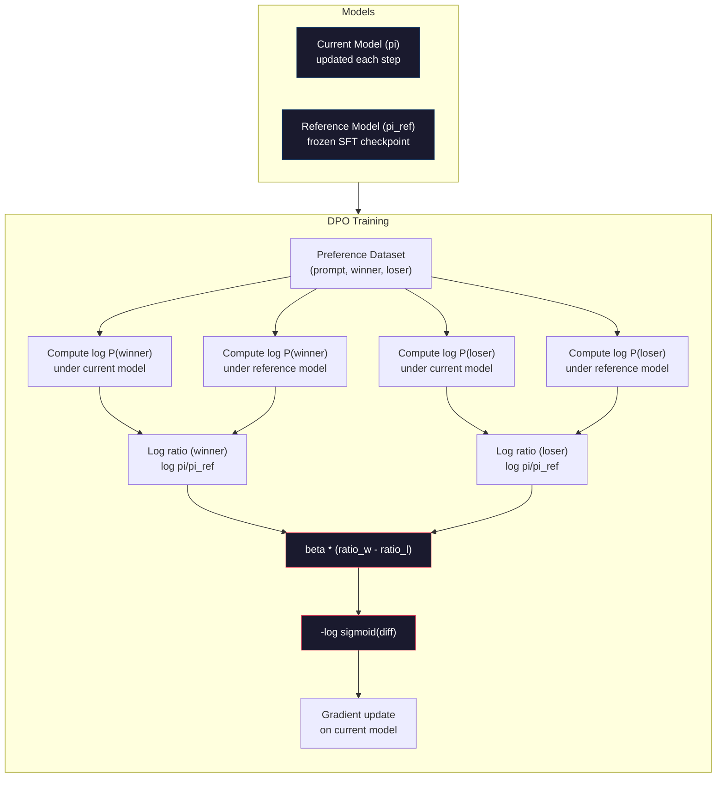

# DPO: Optimisation directe des préférences

> RLHF a un effet. Mais il a aussi besoin de former trois modèles (SFT, modèle de récompense, politique), gérer l'instabilité du PPO, et réguler la pénalité KL.

**Type:** Build
**Languages:** Python (with numpy)
**Prerequisites:** Phase 10, Lesson 07 (RLHF)
**Time:** ~90 分钟

## Objectif de l'apprentissage
- ¢ réaliser une formation en DPO, directement dans les paires de préférences 上优化语言模型, sans utiliser un modèle de récompense unique
- 推导 DPO Perte de fonction,并解释它如何通过政策的日志概率 隐式表示奖励模型
- En termes de stabilité de formation, de coûts de calcul et de quantité de modèles nécessaires, comparer le DPO à la RLHF
- 调节 beta 参数, contrôler la politique de formation 偏离参考模型 的程度

##  problématique
Vous avez construit un pipeline RLHF en 07 dans le cours. Trois phases.

En pratique, la formation de la police publique est un élément de la formation. Il y a un très petit hyperparamètre qui peut changer. Le modèle de récompense est un agent imparfait des préférences humaines.

Cette complexité explique pourquoi, dans les années qui ont suivi la publication d'InstructGPT, la plupart des modèles open source ont été difficiles à utiliser RLHF.

En mai 2023, Rafael Rafailov, de Stanford, Archit Sharma et ses collègues ont publié Direct Preference Optimization: Your Language Model is Secretly a Reward Model──核心洞见是:你不需要单独的奖励模型──最佳奖励功能 在数学上由语言模型自身的代币概率决定──你可以完全跳过奖励模型,直接在偏好对上优化语言模型──

Le DPO va simplifier le RLHF en un processus d'apprentissage supervisé 步骤──一个模型──一个损失功能──一个训练循环──没有强化学学习──Zephyr-7B est l'un des premiers modèles de DPO à grande échelle utilisés, dans plusieurs critères de référence, en suivant ou dépassant le modèle d'entraînement complet du RLHF──Meta a utilisé le DPO──Anthropic dans le pipeline d'alignement de Llama 3 et a également mentionné des méthodes de DPO dans ses recherches d'alignement──

## 概念
### Le point de vue clé

RLHF 优化这个目标:

```
maximize: E[R(x, y)] - beta * KL(pi || pi_ref)
```

Parmi eux, R est le modèle de récompense, pi est la politique, pi_ref est le modèle de référence, bêta est le coefficient KL。

Le document DPO prova, cet objectif existe fermement le meilleur. Pour une fonction de récompense R, la politique le mieux est:

```
pi*(y | x) = pi_ref(y | x) * exp(R(x, y) / beta) / Z(x)
```

Parmi eux, Z(x) est le nombre de références régulières.

```
R(x, y) = beta * log(pi*(y | x) / pi_ref(y | x)) + beta * log Z(x)
```

C'est le point de rupture. La récompense est entièrement exprimée par le modèle de politique de probabilité et le modèle de référence de probabilité.

Le modèle de préférence Bradley-Terry:

```
P(y_w > y_l | x) = sigmoid(R(x, y_w) - R(x, y_l))
                  = sigmoid(beta * (log pi(y_w|x)/pi_ref(y_w|x) - log pi(y_l|x)/pi_ref(y_l|x)))
```

Z(x) 项会抵消, parce que deux réponses sont toutes les mêmes x 为条件――剩下只是政策模型和参考模型 在优先和拒绝答案上的日志概率函数――

### La perte du DPO

```
L_DPO = -log(sigmoid(beta * (log pi(y_w|x)/pi_ref(y_w|x) - log pi(y_l|x)/pi_ref(y_l|x))))
```

Nous avons démantelé chaque partie:

- **y_w**= réponse préférée
- **y_l**= réfuté (perte) de réponse
- **x**= rapidement
- **pi**= 当前模型(正在训练)
- **pi_ref**= modèle de référence ((结的 SFT checkpoint)
- **beta**= 控制偏离 度温参数 参数(habituellement de 0,1 à 0,5)

比值 `log pi(y|x) / pi_ref(y|x)`Il s'agit du rapport de probabilité logée. Lorsque ce rapport est correct, la probabilité de réponse du modèle actuel est plus élevée que la référence.

La perte de DPO va favoriser le modèle pour augmenter le rapport de probabilité de log des réponses préférées, et réduire le rapport de probabilité de log des réponses rejetées.



### Pourquoi le DPO est plus simple

| Aspect | RLHF (PPO) | DPO |
|--------|-----------|-----|
| 需要训练的模型 | 3（SFT + reward + policy） | 1（仅 policy） |
| Training loops | 3（SFT、RM training、PPO） | 2（SFT、DPO） |
| Hyperparameters | lr、KL coeff、clip ratio、RM lr、epochs x3 | lr、beta、epochs |
| Reward model | 必需（单独训练） | 隐式存在于模型概率中 |
| RL algorithm | PPO（复杂、不稳定） | Supervised learning（稳定） |
| GPU memory | PPO 期间内存中有 3-4 个模型 | 2 个模型（current + reference） |
| 训练稳定性 | 对 hyperparameters 敏感 | 稳健，类似 SFT |

Pour les modèles 70B, chaque copie de FP16 a besoin de 140 Go. Le modèle de récompense est très perceptible.

### Quand le DPO bat le RLHF

**小数据集。**Dans une gamme de paires de préférences de 5 000 à 20 000 personnes, le modèle de récompense RLHF et RLHF est généralement équivalent ou supérieur à celui de RLHF. Le modèle de récompense RLHF nécessite suffisamment de données pour être généralisé; lorsque les données sont limitées, il est plus adapté et génère des signaux de récompense non fiables.

**计算资源有限。**DPO ne nécessite qu'une RLHF complète. Pour une équipe sans grands graphes graphiques, c'est la meilleure option.

**快速迭代。**想尝试10 sets de données de préférence différentes, voir lequel peut produire le meilleur modèle?DPO 让你能在几个小时内完成每一次实验──RLHF 则需要为每套数据重新训练奖励模型──

### Quand le RLHF bat le DPO

**大规模训练。**À l'échelle du GPT-4 ou de Claude, le modèle de récompense unique de la RLHF peut capturer des signaux de préférence plus détaillés.

**复杂 reward signals。**Lorsque l'on apprend à mieux évaluer les différents aspects de la récompense, on peut en tirer le modèle de récompense en calculant les différents objectifs.

**迭代式 alignment。**Les pipelines RLHF peuvent utiliser la politique actuelle pour générer de nouvelles réponses, faire des évaluations humaines, puis reentraîner le modèle de récompense dans le cycle en ligne.

### DPO 之外: KTO, ORPO, SimPO

Le DPO a lancé une série de méthodes d'alignement simplifiées.

**KTO (Kahneman-Tversky Optimization, 2024)：**Vous n'avez même pas besoin de faire face aux données. KTO utilise un défaut de contre: il suffit de marquer chaque réponse comme bonne ou mauvaise, sans avoir besoin de la comparer à une autre alternative. Ceci simplifie considérablement la collecte de données.

**ORPO (Odds Ratio Preference Optimization, 2024)：**Le SFT et l'alignement sont combinés à un train de étape. L'ORPO ne se fait pas avant le SFT et le DPO, mais modifie le SFT Loss, ce qui en fait le signal de préférence.

**SimPO (Simple Preference Optimization, 2024)：**完全取消引用模型──SIMPO 不再针对结的引用──计算日志概率比,而是使用响应的平均日志概率──按长度归结) 作为隐式回报──这省内存──不需要参考模型──并简化训练──长度归结防止模型偏好更短的响应──

| Method | Year | Models in Memory | Needs Pairs? | Needs Reference? | Training Loops |
|--------|------|-----------------|-------------|-----------------|----------------|
| RLHF | 2022 | 3-4 | Yes（用于 RM） | Yes | 3 |
| DPO | 2023 | 2 | Yes | Yes | 2 |
| KTO | 2024 | 2 | No（未配对） | Yes | 2 |
| ORPO | 2024 | 1 | Yes | No | 1 |
| SimPO | 2024 | 1 | Yes | No | 1 |

趋势很清楚: chaque méthode a éliminé une partie de la complexité. RLHF 需要奖励模型 和 PPO──DPO 消除二者──KTO 消除成对数据──ORPO 消除单独的SFT 阶段──SIMPO 消除参考模型──alignment tax,也就是从基模型到配合模型所需的计算和复杂性成本,正在持续下降──

### Réels déploiements de DPO

**Zephyr-7B (HuggingFace, October 2023)：**À la base de Mistral 7B, sur UltraChat (exemples 200K) faites SFT, puis sur UltraFeedback (parles de préférence 60K) faites DPO. Sur MT-Bench, le score de 6,47 est le plus élevé du modèle 7B à l'époque.

**Llama 3 (Meta, April 2024)：**Dans la première phase de RLHF, il est utilisé DPO. Cette combinaison indique que DPO et RLHF peuvent être complétés:

**Neural Magic / nm-chat (2024)：**Le DPO est appliqué à plusieurs modèles open source, et montre une amélioration de 5 à 15% par rapport à la base de référence de l'alignement.


```figure
dpo-loss
```

## - Je le construis.
### 步骤 1: Ensemble de données de préférence

Avec RLHF Utilisation similaire: ((prompte, préféré, rejeté) 三元组──DPO 直接消费这些数据,不需要中间的奖励模型──

```python
import numpy as np
import sys
import os
sys.path.insert(0, os.path.join(os.path.dirname(__file__), "..", "..", "04-pre-training-mini-gpt", "code"))
from main import MiniGPT, LayerNorm, Embedding, TransformerBlock

PREFERENCE_DATA = [
    {
        "prompt": "What is the capital of France?",
        "preferred": "The capital of France is Paris.",
        "rejected": "France is a country in Europe. It has many cities. The capital is Paris. Paris is known for the Eiffel Tower.",
    },
    {
        "prompt": "Explain gravity in one sentence.",
        "preferred": "Gravity is the force that attracts objects with mass toward each other.",
        "rejected": "Gravity is something that makes things fall down when you drop them.",
    },
    {
        "prompt": "What is 15 times 7?",
        "preferred": "15 times 7 is 105.",
        "rejected": "Let me think about this. 15 times 7. Well, 10 times 7 is 70, and 5 times 7 is 35, so the answer might be around 105.",
    },
    {
        "prompt": "Name three programming languages.",
        "preferred": "Python, Rust, and TypeScript.",
        "rejected": "There are many programming languages. Some popular ones include various languages like Python and others.",
    },
    {
        "prompt": "What year did World War II end?",
        "preferred": "World War II ended in 1945.",
        "rejected": "World War II was a major global conflict. It involved many countries. The war ended in the mid-1940s, specifically in 1945.",
    },
    {
        "prompt": "Define machine learning.",
        "preferred": "Machine learning is a field where algorithms learn patterns from data to make predictions without being explicitly programmed.",
        "rejected": "Machine learning is a type of AI. AI stands for artificial intelligence. Machine learning uses data to learn.",
    },
]
```

### 步骤 2: Probabilité du log de séquence

DPO Loss 需要计算给定提示时某个响应的总日记概率──这意味着要在完整的(快速+响应)序列上运行模型,并对每个响应代币的日记概率求和──

```python
def tokenize_sequence(text, vocab_size=256):
    return [min(t, vocab_size - 1) for t in list(text.encode("utf-8"))]


def compute_sequence_log_prob(model, prompt_tokens, response_tokens, max_seq_len=128):
    full_sequence = prompt_tokens + response_tokens
    if len(full_sequence) > max_seq_len:
        full_sequence = full_sequence[:max_seq_len]

    if len(full_sequence) < 2:
        return 0.0

    input_ids = np.array(full_sequence[:-1]).reshape(1, -1)
    target_ids = np.array(full_sequence[1:])

    logits = model.forward(input_ids)
    logits = logits[0]

    max_logits = logits.max(axis=-1, keepdims=True)
    log_probs = logits - max_logits - np.log(
        np.exp(logits - max_logits).sum(axis=-1, keepdims=True)
    )

    prompt_len = len(prompt_tokens)
    response_start = max(0, prompt_len - 1)
    response_end = len(target_ids)

    if response_start >= response_end:
        return 0.0

    response_log_probs = log_probs[response_start:response_end, :]
    response_targets = target_ids[response_start:response_end]

    total_log_prob = 0.0
    for i, target in enumerate(response_targets):
        total_log_prob += response_log_probs[i, target]

    return total_log_prob
```

Cette fonction est l'outil central du DPO. Pour chaque paire de préférences, elle fonctionne quatre fois: modèle 计算 réponse préférée, modèle 计算 réponse rejetée, référence 计算 réponse préférée, référence 计算 réponse rejetée.

### 步骤 3: La perte de la DPO

论文核心用代码表示──一个函数──一个 Loss──不需要奖励模型──

```python
def sigmoid(x):
    return np.where(
        x >= 0,
        1.0 / (1.0 + np.exp(-x)),
        np.exp(x) / (1.0 + np.exp(x))
    )


def dpo_loss(policy_logprob_preferred, policy_logprob_rejected,
             ref_logprob_preferred, ref_logprob_rejected, beta=0.1):
    preferred_ratio = policy_logprob_preferred - ref_logprob_preferred
    rejected_ratio = policy_logprob_rejected - ref_logprob_rejected

    logit = beta * (preferred_ratio - rejected_ratio)

    loss = -np.log(sigmoid(logit) + 1e-8)

    preferred_reward = beta * preferred_ratio
    rejected_reward = beta * rejected_ratio

    return loss, {
        "preferred_ratio": float(preferred_ratio),
        "rejected_ratio": float(rejected_ratio),
        "logit": float(logit),
        "implicit_preferred_reward": float(preferred_reward),
        "implicit_rejected_reward": float(rejected_reward),
        "reward_margin": float(preferred_reward - rejected_reward),
    }
```

`preferred_ratio`et `rejected_ratio`Il est vrai que les rapports de probabilité logistique de la DPO sont relativement élevés.

`implicit_preferred_reward`et `implicit_rejected_reward`Les récompenses de la DPO Loss sont répartis en termes cachés. Vous pouvez les extraire pour vérifier si la formation est efficace: la marge entre les récompenses préférées et rejetées devrait augmenter au cours du processus de formation.

### 步骤 4: cycle de formation du DPO

Un cycle de formation supervisé standard. Pas de PPO. Pas de modèle de récompense.

```python
def copy_model_weights(source, target):
    target.embedding.token_embed = source.embedding.token_embed.copy()
    target.embedding.pos_embed = source.embedding.pos_embed.copy()
    target.ln_f.gamma = source.ln_f.gamma.copy()
    target.ln_f.beta = source.ln_f.beta.copy()
    for s_block, t_block in zip(source.blocks, target.blocks):
        t_block.attn.W_q = s_block.attn.W_q.copy()
        t_block.attn.W_k = s_block.attn.W_k.copy()
        t_block.attn.W_v = s_block.attn.W_v.copy()
        t_block.attn.W_out = s_block.attn.W_out.copy()
        t_block.ffn.W1 = s_block.ffn.W1.copy()
        t_block.ffn.W2 = s_block.ffn.W2.copy()
        t_block.ffn.b1 = s_block.ffn.b1.copy()
        t_block.ffn.b2 = s_block.ffn.b2.copy()
        t_block.ln1.gamma = s_block.ln1.gamma.copy()
        t_block.ln1.beta = s_block.ln1.beta.copy()
        t_block.ln2.gamma = s_block.ln2.gamma.copy()
        t_block.ln2.beta = s_block.ln2.beta.copy()


def dpo_train(policy_model, reference_model, preference_data,
              num_epochs=5, lr=5e-6, beta=0.1, max_seq_len=128):
    print(f"DPO Training: {len(preference_data)} pairs, {num_epochs} epochs, "
          f"lr={lr}, beta={beta}")
    print()

    losses = []
    margins = []

    for epoch in range(num_epochs):
        epoch_loss = 0.0
        epoch_margin = 0.0
        num_examples = 0

        indices = np.random.permutation(len(preference_data))

        for idx in indices:
            pair = preference_data[idx]

            prompt_tokens = tokenize_sequence(pair["prompt"])
            preferred_tokens = tokenize_sequence(pair["preferred"])
            rejected_tokens = tokenize_sequence(pair["rejected"])

            pi_logprob_w = compute_sequence_log_prob(
                policy_model, prompt_tokens, preferred_tokens, max_seq_len
            )
            pi_logprob_l = compute_sequence_log_prob(
                policy_model, prompt_tokens, rejected_tokens, max_seq_len
            )
            ref_logprob_w = compute_sequence_log_prob(
                reference_model, prompt_tokens, preferred_tokens, max_seq_len
            )
            ref_logprob_l = compute_sequence_log_prob(
                reference_model, prompt_tokens, rejected_tokens, max_seq_len
            )

            loss, metrics = dpo_loss(
                pi_logprob_w, pi_logprob_l,
                ref_logprob_w, ref_logprob_l, beta
            )

            update_direction = 1.0 if metrics["logit"] < 0 else -0.1
            for block in policy_model.blocks:
                block.ffn.W1 += lr * update_direction * np.random.randn(*block.ffn.W1.shape) * 0.01
                block.ffn.W2 += lr * update_direction * np.random.randn(*block.ffn.W2.shape) * 0.01

            epoch_loss += loss
            epoch_margin += metrics["reward_margin"]
            num_examples += 1
            losses.append(float(loss))
            margins.append(metrics["reward_margin"])

        avg_loss = epoch_loss / max(num_examples, 1)
        avg_margin = epoch_margin / max(num_examples, 1)

        print(f"  Epoch {epoch + 1}/{num_epochs} | Loss: {avg_loss:.4f} | "
              f"Avg Margin: {avg_margin:.4f}")

    return policy_model, losses, margins
```

Comparativement à RLHF, cette boucle de formation est une nouvelle et simple formation. Pour chaque paire de préférences: calculer quatre log-probabilités (à la fois deux modèles et deux réponses), les intégrer dans la politique de perte de DPO, calculer un degré, mettre à jour une politique.

### 步骤 5: Comparer le DPO contre le RLHF

测量隐式奖励率和日志概率变化,将DPO与07课中的RLHF模型 进行比较──

```python
def evaluate_preference_accuracy(model, reference_model, preference_data, beta=0.1, max_seq_len=128):
    correct = 0
    total = 0

    for pair in preference_data:
        prompt_tokens = tokenize_sequence(pair["prompt"])
        preferred_tokens = tokenize_sequence(pair["preferred"])
        rejected_tokens = tokenize_sequence(pair["rejected"])

        pi_w = compute_sequence_log_prob(model, prompt_tokens, preferred_tokens, max_seq_len)
        pi_l = compute_sequence_log_prob(model, prompt_tokens, rejected_tokens, max_seq_len)
        ref_w = compute_sequence_log_prob(reference_model, prompt_tokens, preferred_tokens, max_seq_len)
        ref_l = compute_sequence_log_prob(reference_model, prompt_tokens, rejected_tokens, max_seq_len)

        preferred_reward = beta * (pi_w - ref_w)
        rejected_reward = beta * (pi_l - ref_l)

        if preferred_reward > rejected_reward:
            correct += 1
        total += 1

    return correct / max(total, 1)


def analyze_implicit_rewards(model, reference_model, preference_data, beta=0.1, max_seq_len=128):
    print("Implicit Reward Analysis:")
    print("-" * 65)
    print(f"  {'Prompt':<30} {'Pref Reward':>12} {'Rej Reward':>12} {'Margin':>10}")
    print("  " + "-" * 60)

    for pair in preference_data:
        prompt_tokens = tokenize_sequence(pair["prompt"])
        preferred_tokens = tokenize_sequence(pair["preferred"])
        rejected_tokens = tokenize_sequence(pair["rejected"])

        pi_w = compute_sequence_log_prob(model, prompt_tokens, preferred_tokens, max_seq_len)
        pi_l = compute_sequence_log_prob(model, prompt_tokens, rejected_tokens, max_seq_len)
        ref_w = compute_sequence_log_prob(reference_model, prompt_tokens, preferred_tokens, max_seq_len)
        ref_l = compute_sequence_log_prob(reference_model, prompt_tokens, rejected_tokens, max_seq_len)

        pref_reward = beta * (pi_w - ref_w)
        rej_reward = beta * (pi_l - ref_l)
        margin = pref_reward - rej_reward

        truncated = pair["prompt"][:28] + ".." if len(pair["prompt"]) > 30 else pair["prompt"]
        print(f"  {truncated:<30} {pref_reward:>12.4f} {rej_reward:>12.4f} {margin:>10.4f}")

    print()
```

### 步骤 6: Analyse de la sensibilité bêta

Le beta est le paramètre du coefficient de RLHF en KL. Il contrôle le modèle à un degré de déviation de référence.

```python
def beta_sensitivity_analysis(sft_model, preference_data, betas, max_seq_len=128):
    print("Beta Sensitivity Analysis")
    print("-" * 60)
    print(f"  {'Beta':>8} {'Final Loss':>12} {'Final Margin':>14} {'Accuracy':>10}")
    print("  " + "-" * 55)

    results = []

    for beta in betas:
        policy = MiniGPT(
            vocab_size=256, embed_dim=128, num_heads=4,
            num_layers=4, max_seq_len=max_seq_len, ff_dim=512
        )
        reference = MiniGPT(
            vocab_size=256, embed_dim=128, num_heads=4,
            num_layers=4, max_seq_len=max_seq_len, ff_dim=512
        )
        copy_model_weights(sft_model, policy)
        copy_model_weights(sft_model, reference)

        policy, losses, margins_list = dpo_train(
            policy, reference, preference_data,
            num_epochs=3, lr=5e-6, beta=beta, max_seq_len=max_seq_len
        )

        accuracy = evaluate_preference_accuracy(
            policy, reference, preference_data, beta, max_seq_len
        )

        final_loss = losses[-1] if losses else 0
        final_margin = margins_list[-1] if margins_list else 0

        print(f"  {beta:>8.3f} {final_loss:>12.4f} {final_margin:>14.4f} {accuracy:>10.1%}")
        results.append({
            "beta": beta,
            "final_loss": final_loss,
            "final_margin": final_margin,
            "accuracy": accuracy,
        })

        print()

    return results
```

La plus petite bêta (0.01) permet au modèle de se détourner de la référence: apprendre rapidement, mais avec un risque de détérioration.

## Utilisez-le
### Démo de l'oléoduc de la DPO

```python
if __name__ == "__main__":
    np.random.seed(42)

    print("=" * 70)
    print("DPO: DIRECT PREFERENCE OPTIMIZATION")
    print("=" * 70)
    print()

    print("STEP 1: Initialize SFT Model (from Lesson 06)")
    print("-" * 50)
    sft_model = MiniGPT(
        vocab_size=256, embed_dim=128, num_heads=4,
        num_layers=4, max_seq_len=128, ff_dim=512
    )
    print(f"  Parameters: {sft_model.count_parameters():,}")
    print()

    print("STEP 2: DPO Training")
    print("-" * 50)

    policy_model = MiniGPT(
        vocab_size=256, embed_dim=128, num_heads=4,
        num_layers=4, max_seq_len=128, ff_dim=512
    )
    reference_model = MiniGPT(
        vocab_size=256, embed_dim=128, num_heads=4,
        num_layers=4, max_seq_len=128, ff_dim=512
    )
    copy_model_weights(sft_model, policy_model)
    copy_model_weights(sft_model, reference_model)

    policy_model, losses, margins = dpo_train(
        policy_model, reference_model, PREFERENCE_DATA,
        num_epochs=5, lr=5e-6, beta=0.1
    )
    print()

    print("=" * 70)
    print("STEP 3: Evaluate")
    print("=" * 70)
    print()

    pre_accuracy = evaluate_preference_accuracy(
        sft_model, reference_model, PREFERENCE_DATA, beta=0.1
    )
    post_accuracy = evaluate_preference_accuracy(
        policy_model, reference_model, PREFERENCE_DATA, beta=0.1
    )

    print(f"  Preference accuracy (pre-DPO):  {pre_accuracy:.1%}")
    print(f"  Preference accuracy (post-DPO): {post_accuracy:.1%}")
    print()

    analyze_implicit_rewards(policy_model, reference_model, PREFERENCE_DATA, beta=0.1)

    print("=" * 70)
    print("STEP 4: Training Dynamics")
    print("=" * 70)
    print()

    if losses:
        print("  Loss curve:")
        window = max(1, len(losses) // 5)
        for i in range(0, len(losses), window):
            chunk = losses[i:i + window]
            avg = sum(chunk) / len(chunk)
            print(f"    Steps {i:3d}-{i + len(chunk) - 1:3d}: loss = {avg:.4f}")
        print()

    if margins:
        print("  Reward margin curve:")
        window = max(1, len(margins) // 5)
        for i in range(0, len(margins), window):
            chunk = margins[i:i + window]
            avg = sum(chunk) / len(chunk)
            print(f"    Steps {i:3d}-{i + len(chunk) - 1:3d}: margin = {avg:.4f}")
        print()

    print("=" * 70)
    print("STEP 5: Beta Sensitivity")
    print("=" * 70)
    print()

    beta_results = beta_sensitivity_analysis(
        sft_model, PREFERENCE_DATA, betas=[0.01, 0.1, 0.3, 1.0]
    )

    print("=" * 70)
    print("DPO vs RLHF COMPARISON")
    print("=" * 70)
    print()
    print("  DPO advantages:")
    print("    - 1 training loop (vs 3 for RLHF)")
    print("    - 2 models in memory (vs 3-4 for RLHF)")
    print("    - Supervised learning (vs RL, more stable)")
    print("    - No reward model to train or maintain")
    print()
    print("  RLHF advantages:")
    print("    - Separate reward model captures complex preferences")
    print("    - Online learning: generate, rate, retrain")
    print("    - Better for multi-objective alignment")
    print("    - Proven at largest scales (GPT-4, Claude)")
    print()
    print("  Practical guidance:")
    print("    - Start with DPO. It's simpler and often sufficient.")
    print("    - Switch to RLHF if DPO plateaus on your eval metrics.")
    print("    - Many production systems use both: RLHF first, DPO to refine.")
```

## Je le livre.
本课会产出 `outputs/prompt-alignment-method-selector.md`Une solution pour vous aider à choisir correctement l'alignement 方法 (SFT, RLHF, DPO, KTO, ORPO, SimPO)

## 练习
1.  réaliser KTO (Kahneman-Tversky Optimisation) ・ KTO n'a pas besoin de devenir un objet de données, il suffit de définir chaque réponse marquer pour good ou bad──perte de bonne réponse `-log(sigmoid(beta * log_ratio))`, mauvaise réponse de la perte est `-log(1 - sigmoid(beta * log_ratio))`,并对不良反应 Loss 使用损失厌恶乘数(habituellement de 1,5x) ・・・ dans la même portion de données 分别将优先 当作好、拒绝 当作坏),并与DPO比较精确性──

2. 实现 DPO-normalized de longueur── ne pas utiliser les probabilités de journaux originaux, mais déduire en nombre de jetons de réponse:`normalized_logprob = total_logprob / num_tokens` Cela peut empêcher les réponses préférentielles et plus courtes du modèle elles ont des marges de récompense cachées supérieures à la comparaison.

3. 构建一个ORPO 风格的组合损失──向DPO Loss 中添加首选响应 上的标准下一个代码预测损失:`L = L_sft(preferred) + alpha * L_dpo` essayer de 0.1、0.5 和 1.0 alpha 值──perte combinée 应产生一个既能遵循指令((来自SFT 项) 另偏好更好反应(来自DPO 项) 模型, afin d'éliminer la demande pour les SFT 阶段单独──

4.  réaliser un DPO itératif  exécuter un DPO à 3 époques, puis générer de nouveaux réponses à partir du modèle de formation postérieure, les associer à des réponses préférées originales  partager pour de nouvelles paires de préférences,  exécuter à nouveau un DPO  exécuter deux rounds de ce processus auto-jouer   comparer la précision des préférences de la première et de la deuxième rounds postérieures, voir si le raffinement de la première génération est utile 

5. Pour comparer les différents modèles de référence, ne pas utiliser le point de contrôle de la FDS comme référence, mais plutôt essayer: a) le modèle de base, b) le point de contrôle de la FDS dans la première période, c) la moyenne mobile exponentielle du modèle de politique, report which reference produces the highest precision of preference, et la plus stable curve de formation.

## 关键术语
| Term | What people say | What it actually means |
|------|----------------|----------------------|
| DPO | “没有 RL 的 RLHF” | Direct Preference Optimization：一种 supervised learning algorithm，直接在 preference pairs 上优化语言模型，绕过 reward model 和 PPO |
| Implicit reward | “reward 在模型里” | reward function 由 policy 与 reference models 之间的 log-probability ratio 决定，不需要单独的 reward model |
| Beta (DPO) | “temperature” | 控制 policy 可以偏离 reference model 的程度：小 beta 允许大偏离，大 beta 让模型保持接近 |
| Log-probability ratio | “模型变化了多少” | log pi(y\|x) - log pi_ref(y\|x)：正值表示当前模型分配的概率高于 reference |
| Reference model | “冻结的 checkpoint” | SFT model 的一个副本，其 weights 永不改变，用作计算概率比的锚点 |
| KTO | “没有成对数据的 DPO” | Kahneman-Tversky Optimization：使用未配对的“good”或“bad”labels，而不是要求 preference pairs |
| ORPO | “一步 alignment” | Odds Ratio Preference Optimization：通过向 SFT Loss 添加 preference term，将 SFT 和 alignment 合并到单个 training loop |
| SimPO | “不需要 reference” | Simple Preference Optimization：通过使用长度归一化的平均 log-probability 作为隐式 reward，消除 reference model |
| Alignment tax | “让模型安全的成本” | 从 base model 到 aligned model 所需的额外计算、数据和复杂性；DPO 显著降低了这一成本 |

## 延伸阅读
- [Rafailov et al., 2023 -- "Direct Preference Optimization: Your Language Model is Secretly a Reward Model"](https://arxiv.org/abs/2305.18290)-- L' alignement de la RLHF  simplification à l' apprentissage supervisé
- [Tunstall et al., 2023 -- "Zephyr: Direct Distillation of LM Alignment"](https://arxiv.org/abs/2310.16944)- Zephyr-7B, a montré le DPO ultra-réponse dans les benchmarks de suivi RLHF
- [Ethayarajh et al., 2024 -- "KTO: Model Alignment as Prospect Theoretic Optimization"](https://arxiv.org/abs/2402.01306)--                                                                                                                                                                                                                                                                                                                                                                                                                                                                                                                             
- [Hong et al., 2024 -- "ORPO: Monolithic Preference Optimization without Reference Model"](https://arxiv.org/abs/2403.07691)-- va SFT et alignement 合并为一步
- [Meng et al., 2024 -- "SimPO: Simple Preference Optimization with a Reference-Free Reward"](https://arxiv.org/abs/2405.14734)-- completement éliminer le modèle de référence
- [Llama 3 Technical Report](https://arxiv.org/abs/2407.21783)-- Meta 结合 RLHF et DPO de l' alignement du pipeline
