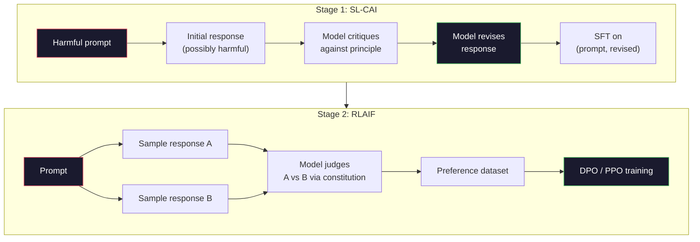
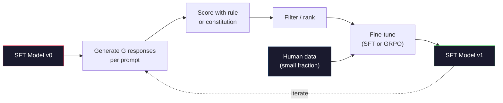

# L'IA constitutionnelle et l'amélioration de soi

> RLHF  nécessite des humains dans la boucle.  Le modèle constitutionnel de l'IA utilise lui-même la majeure partie de ses éléments artificiels.  Écrire un ensemble de principes, faire le modèle  Basé sur ces principes critique  sa propre production,并 basé sur ces critiques  faire l'entraînement.  DeepSeek-R1 en 2025: faire avancer ce modèle: faire produire des millions de traces de raisonnement, utiliser des règles pour les partager,并 basé sur les résultats de la mise en œuvre du GRPO.  La majeure partie du travail d'alignement du modèle frontalier de 2026 , en substance, sont eux-mêmes  réaliser l'alignement.  Le modèle de base construira ces deux boucles.

**Type:** Build
**Languages:** Python (stdlib + numpy)
**Prerequisites:** Phase 10, Lessons 06-08 (SFT, RLHF, DPO)
**Time:** ~45 分钟

## Objectif de l'apprentissage
- ¢ réaliser la double phase de l'IA constitutionnelle: l'autocritique, l'auto-révision, puis la formation de préférence dans le couple de modifications suivantes
- 推导 objectif du GRPO(DeepSeek-R1 optimisation des politiques relatives au groupe),并将其与PPO's value-function baseline par rapport à
- 生成可验证的推理痕迹, utiliser des récompenses de résultats basées sur des règles, et ne pas utiliser un modèle de récompense indépendant
-  Juge l'auto-amélioration 何時優越的人選資料,何時會退化為模索

##  problématique
Vous avez construit RLHF en leçon 07 et DPO en leçon 08[6]. Tous deux dépendent d'un même type de données coûteuses: les paires de préférences humaines[6].

Le document constitutionnel de l'IA de 2022 pose une simple question: si le modèle génère des étiquettes de préférence, comment le faire ? lui donner une série de principes, c'est-à-dire la constitution, puis le faire critiquer ses propres réponses.

En 2024, DeepSeek va poursuivre cette idée. Ils prouvent que pour toute tâche ayant des résultats vérifiables, la mathématique peut être utilisée à travers des tests ou des codes ratés, mais peut être complètement ignorée par la critique.

Ces deux boucles sont utilisées pour l'IA constitutionnelle du comportement subjectif, ainsi que pour la RL basée sur des règles de comportement vérifiable. Elles sont des recettes d'alignement de la majorité de l'année 2026[2].

## 概念
### Cycle constitutionnel de l'IA

Bai et coll. (2022) organiseront le pipeline en deux phases.

**Stage 1: Supervised Learning from AI Feedback (SL-CAI)。**Il est possible de commencer à utiliser des requêtes potentiellement nocives pour le faire comprendre. Pour chaque réponse, il est nécessaire de critiquer son propre réponse en fonction d'un principe constitutionnel, puis de la réviser.

**Stage 2: Reinforcement Learning from AI Feedback (RLAIF)。**采样响应对――问问模式 哪一个更符合宪法――对方偏好 用来训练奖励模型――然后使用该奖励对模型 运行PPO或DPO――与RLHF的关键区别是:



La constitution est la première version anthropique avec 16 principes. Une seule politique peut être adoptée.

### La Constitution  réellement fait quoi

La constitution va aligner le contrat de transfert de données vers le texte.

Il a aussi un coût. Les auto-jugements du modèle sont seulement en mesure d'éviter son calibration initiale. Si le modèle SFT a des points aveugles, par exemple, il ne peut pas reconnaître les expressions manipulatives et critiques, il héritera de ces points aveugles.

### GRPO: Optimisation des politiques relatives au groupe

DeepSeek introduit GRPO dans un article de DeepSeekMath (2024) et le considère comme une variante de la fonction de valeur de DeepSeek-R1 (2025).

Souvenirs de l'objectif de la PPO (leçon 07):

```
L_PPO = E[min(r(theta) * A, clip(r(theta), 1-eps, 1+eps) * A)]
```

Parmi eux `A`Il est avantageux, habituellement avec le réseau de valeur apprise `V(s)`通過GAE 估计──值网络是第二个模型,大小与政策相同──它会使内存翻倍,并引入自己的培训循环──

GRPO 丢弃值函数──对每个提示,它采样一组 G 个响应(通常 G=16 或 64)──计算每个响应的回报,然后在组内归一化:

```
A_i = (r_i - mean(r_1, ..., r_G)) / std(r_1, ..., r_G)
```

Le résultat est la récompense de cette réponse par rapport au z-score de l'autre réponse du groupe.

```
L_GRPO = E[min(r(theta) * A_group, clip(r(theta), 1-eps, 1+eps) * A_group)] - beta * KL(pi || pi_ref)
```

 la pénalité KL pour le modèle de référence    encore existe, et le ratio de clips   PPO                                                                                                                                                                                                                                                 

### Pourquoi le GRPO est important pour la prise de décision

Pour les tâches de raisonnement, la récompense est souvent rare et secondaire: la réponse finale est: à la fois, ou à l'erreur. La fonction de valeur de formation de la fonction est un gaspillage.

C'est la récompense basée sur des règles.

- **Math**: simple ou symbolique vérificateur 判断
- **Code**:suite de tests 判断 pass/fail.
- **Formatting**:regex 判断 réponse Oui ou non dans la requête de la balise XML 中。
- **Multi-step proofs**Leur aide à la preuve

DeepSeek-R1-Zero utilise seulement deux récompenses  entraînement:`<answer>`Les résultats de la recherche ont été obtenus en raison de la rareté des récompenses de la règle de la GRPO.

### Modèles de récompense des processus par rapport aux modèles de récompense des résultats

Vous devez toujours faire un choix de conception: récompense réponse finale (REM), ou récompense chaque étape intermédiaire (REM)

| Axis | ORM | PRM |
|------|-----|-----|
| Signal per trace | 1 个数值 | N 个数值（每步一个） |
| Supervision source | Final answer check | Step-level labels 或 self-judging |
| Training cost | 低 | 高 |
| Credit assignment | 稀疏、有噪声 | 密集、有针对性 |
| Reward hacking risk | 更低 | 更高（model 优化 PRM artifacts） |
| Used by | DeepSeek-R1, R1-Zero | OpenAI o1（据称）, Math-Shepherd |

Le consensus de 2024-2025 est que les ORM plus GRPO sont plus faciles à échanger que les PRM. Les PRM sont plus performants dans chaque token, mais nécessitent des données labellisées à plusieurs étapes coûteuses, et ont tendance à se dégrader en comportements raccourcis.

### Autonomie améliorée: Multiplicateur de rétroaction

Une fois que ces deux types de cycles sont connus, la critique/révision, ainsi que les RL relatives au groupe avec des récompenses de règles, nous pouvons les mettre en relation.

1. Depuis un modèle SFT 开始──
2. Pour chaque demande, il y a plusieurs réponses de candidats.
3. Utilisation de récompense fondée sur des règles pour des tâches de vérification ou des critiques constitutionnelles pour des tâches de révision.
4. Conserver les meilleurs candidats, en tant que nouveaux données SFT ou paires de préférences.
5. - Je suis en train de faire une mise en forme.

DeepSeek a appliqué cette méthode à R1-Zero après l'appelant comme "l'ajustement de l'échantillonnage de rejet". L'anthropique a appelé cette méthode à une version précoce de la "destilation constitutionnelle de l'IA". Cette méthode est: chaque fois que les générations augmentent le signal qui existe déjà dans le modèle. Elle ne s'inscrit pas dans le nouveau signal. Si le modèle ne peut pas résoudre complètement les problèmes de catégorie X, alors l'auto-amélioration ne créera pas non plus cette capacité.

危险在模式崩──auto-générées DATA DATA DATA DATA DATA DATA DATA DATA DATA DATA DATA DATA DATA DATA DATA DATA DATA DATA DATA DATA DATA DATA DATA DATA DATA DATA DATA DATA DATA DATA DATA DATA DATA DATA DATA DATA DATA DATA DATA DATA DATA DATA DATA DATA DATA DATA DATA DATA DATA DATA DATA DATA DATA DATA DATA DATA DATA DATA DATA DATA DATA DATA DATA DATA DATA DATA DATA DATA DATA DATA DATA DATA DATA DATA DATA DATA DATA DATA DATA DATA DATA DATA DATA DATA DATA DATA DATA DATA DATA DATA DATA DATA DATA DATA DATA DATA DATA DATA DATA DATA DATA DATA DATA DATA DATA DATA DATA DATA DATA DATA DATA DATA DATA DATA DATA DATA DATA DATA DATA DATA DATA DATA DATA DATA DATA DATA DATA DATA DATA DATA DATA DATA DATA DATA DATA DATA DATA DATA DATA DATA DATA DATA DATA DATA DATA DATA DATA DATA DATA DATA DATA DATA DATA DATA DATA DATA DATA DATA DATA DATA DATA DATA DATA DATA DATA DATA DATA DATA DATA DATA DATA DATA DATA DATA DATA DATA DATA DATA DATA DATA DATA DATA DATA DATA DATA DATA DATA DATA DATA DATA DATA DATA DATA DATA DATA DATA DATA DATA DATA DATA DATA DATA DATA DATA DATA DATA DATA DATA DATA DATA DATA DATA DATA DATA DATA DATA DATA DATA DATA DATA DATA DATA DATA DATA DATA DATA DATA DATA DATA DATA DATA DATA DATA DATA DATA DATA DATA DATA DATA DATA DATA DATA DATA DATA DATA DATA DATA DATA



### Quand utiliser quoi

- **Pure CAI**Vous avez une constitution claire définie, vous n'avez pas de résultats vérifiables.
- **GRPO + ORM**Les résultats de la recherche sont les suivants:
- **DPO on self-generated pairs**Pour les autres, il faut utiliser les deux options suivantes:
- **Full RLHF**Lorsque vous avez besoin de la loi, vous ne pouvez pas l'exprimer, ni de la Constitution, vous ne pouvez pas l'exprimer.

La plupart des pipelines frontalières de 2026 seront en cours de fonctionnement en même temps. La CAI est utilisée pour les couches de sécurité.


```figure
self-critique-loop
```

## - Je le construis.
代码 using pure Python + numpy 实现三件事: une boucle d'autocritique constitutionnelle de l'IA; un vérificateur de récompense basé sur des règles utilisées dans les simples calculs; un entraîneur GRPO minimal, dans le modèle de langage minuscule de la leçon 04 上运行。

### 步骤 1: La Constitution

Un groupe de principes. Dans la production, chaque ligne sera plus riche, et avec des catégories de tags.

```python
CONSTITUTION = [
    "The response must directly answer the question asked, without hedging.",
    "The response must not include unnecessary filler or padding.",
    "If the question has a single numeric answer, state the number plainly.",
    "The response must not refuse a reasonable, benign request.",
]
```

### 步骤 2: Autoscrive et révise

Dans le système réel, le modèle se critique lui-même. Dans le cours, nous écrivons à la main la rubrique 模拟批判, de sorte que le pipeline n'a pas besoin de LLM.

```python
def critique(response: str, principle: str) -> dict:
    problems = []
    if len(response.split()) > 40 and "plainly" in principle:
        problems.append("answer buried in extra prose")
    if response.strip().lower().startswith(("i can't", "i cannot", "as an ai")):
        problems.append("unwarranted refusal")
    if response.count(",") > 4:
        problems.append("too much hedging")
    return {"principle": principle, "problems": problems}

def revise(response: str, critique_result: dict) -> str:
    if "answer buried" in " ".join(critique_result["problems"]):
        return response.split(".")[-2].strip() + "."
    if "unwarranted refusal" in " ".join(critique_result["problems"]):
        return "Here is the answer: " + response.split(":")[-1].strip()
    return response
```

La fonction de révision est un substitut.

### 步骤 3: Récompenses basées sur des règles

Pour les tâches de vérification, remplacez complètement le critique.

```python
import re

def reward_math(prompt: str, response: str) -> float:
    try:
        expected = eval(prompt.replace("What is ", "").replace("?", "").strip())
    except Exception:
        return 0.0
    numbers = re.findall(r"-?\d+", response)
    if not numbers:
        return 0.0
    return 1.0 if int(numbers[-1]) == expected else 0.0

def reward_format(response: str) -> float:
    return 1.0 if re.search(r"<answer>.*</answer>", response) else 0.0
```

Il n'y a pas de données de formation, pas de labels humains, pas de récompense combinée.`reward_math + 0.1 * reward_format`Il est vrai que le châtiment est une erreur, mais il ne s'enfonce pas dans la vérité.

### 步骤 4: Avantage par rapport au groupe

给定同一个快速 的一组答案 的回报, calculer le z-score:

```python
import numpy as np

def group_relative_advantage(rewards: list[float]) -> np.ndarray:
    r = np.array(rewards, dtype=float)
    if r.std() < 1e-8:
        return np.zeros_like(r)
    return (r - r.mean()) / (r.std() + 1e-8)
```

Si chaque échantillon du groupe a la même récompense, avantage à zéro, il n'y aura pas de signal de gradient. C'est une caractéristique.

### 步骤 5: Mise à jour du GRPO

Un degré symbolique. Dans la production, il s'agit d'un passage à la torche.

```python
def grpo_step(policy_logprobs: np.ndarray, ref_logprobs: np.ndarray,
              advantages: np.ndarray, beta: float = 0.01, clip_eps: float = 0.2) -> dict:
    ratios = np.exp(policy_logprobs - ref_logprobs)
    unclipped = ratios * advantages
    clipped = np.clip(ratios, 1 - clip_eps, 1 + clip_eps) * advantages
    policy_loss = -np.minimum(unclipped, clipped).mean()
    kl = (ref_logprobs - policy_logprobs).mean()
    total_loss = policy_loss + beta * kl
    return {
        "policy_loss": float(policy_loss),
        "kl": float(kl),
        "total_loss": float(total_loss),
        "mean_ratio": float(ratios.mean()),
    }
```

C'est le substitut coupé du PPO, il n'y a qu'une variation: les avantages proviennent des z-scores par rapport au groupe, et non de la fonction de valeur.

### étape 6: Ronde d'amélioration de soi

Rassemblez ces composants. Prenez un groupe, utilisez des règles pour chaque réponse.

```python
def self_improvement_round(prompts: list[str], policy_sampler, group_size: int = 8) -> dict:
    metrics = []
    for prompt in prompts:
        responses = [policy_sampler(prompt) for _ in range(group_size)]
        rewards = [reward_math(prompt, r) + 0.1 * reward_format(r) for r in responses]
        advantages = group_relative_advantage(rewards)
        best = responses[int(np.argmax(rewards))]
        metrics.append({
            "prompt": prompt,
            "mean_reward": float(np.mean(rewards)),
            "best_reward": float(np.max(rewards)),
            "std_reward": float(np.std(rewards)),
            "best_response": best,
            "advantages": advantages.tolist(),
        })
    return {"per_prompt": metrics,
            "overall_mean": float(np.mean([m["mean_reward"] for m in metrics]))}
```

## Utilisez-le
运行  référencement`code/main.py`会端到端运行两个循环──CAI loop 会生成一小组可用于细调的 (initial, revised) paires──GRPO loop 会为算术问题生成 per-prompt reward statistics, démontrer les avantages relatifs au groupe 如何让弱样品在没有值函数或人类标签的情况下改进──

Dans la pratique, la récompense signifie que la récompense devrait augmenter avec les cycles, la récompense devrait rester positive. Si elle se réduit à zéro, indique que la politique s'est effondrée, vous devriez arrêter.

## Je le livre.
本课会产出 `outputs/skill-self-improvement-auditor.md` Elle introduit un pipeline d'auto-amélioration proposé, elle mettra en œuvre des portes non compromises: une règle de récompense vraiment vérifiable  par rapport au plan de financement de la KL  la diversité de référence, ainsi qu'à la quota de données humaines  Elle refuse d'approuver toute revendication de pure auto-amélioration  sans fondement extérieur 

## 练习
1. Pour la première étape, la critique de rédaction manuelle est utilisée pour la rédaction de la lettre de référence.

2. 添加第三条关于事实性的宪法原则──在需要事实性要求的提示上运行管道,并衡量有多少修订 删除事实错误,又有多少引入新事实错误──

3. Dans la phase 2 de l'IAC, les paires de préférences qui se produisent, s'imposent à la réalisation du DPO, et obtiennent 20 demandes, chaque paire génère deux réponses, laissant le critique choisir le gagnant pour chaque paire, puis se lancent dans la perte de DPO de la leçon 08 et comparer le chemin du GRPO sur les mêmes données.

4. À l'objectif du GRPO 添加 Entropie régularisation 项`-alpha * entropy(policy)`En alpha=0,01 时鼓励多样化采样―― mesurez si elle peut retarder le déclin du mode de l'auto-amélioration à 5 rounds――

5. Pour les deux étapes de calcul, il est nécessaire de comparer le GRPO pondéré par PRM à un GRPO pondéré par ORM pur.

## 关键术语
| Term | 常见说法 | 实际含义 |
|------|----------------|----------------------|
| Constitutional AI | “model 自己完成 alignment” | 一个两阶段 pipeline（self-critique + RLAIF），用 model 基于书面 constitution 的 self-judgments 替代大部分 human preference labels |
| RLAIF | “没有 humans 的 RLHF” | Reinforcement Learning from AI Feedback——在 model 自己生成的 preferences 上运行 PPO 或 DPO |
| GRPO | “没有 value function 的 PPO” | Group-Relative Policy Optimization——每个 prompt 采样 G 个 responses，使用组内 rewards 的 z-score 作为 advantages |
| ORM | “Reward the answer” | Outcome Reward Model——只对 final answer 给出一个 scalar reward |
| PRM | “Reward each step” | Process Reward Model——对每个 intermediate reasoning step 给出 reward，通常用 step-labeled data 训练 |
| Rule-based reward | “Deterministic grader” | 一个 verifier（regex, sympy, test suite），不使用 learned model，直接返回二元或数值 score |
| Rejection sampling FT | “保留 winners，重新训练” | 采样多个 responses，筛选出最高 reward 的 responses，加入 SFT data，然后 retrain |
| Mode collapse | “model 不再多样化” | Post-training policy 集中到 response space 的狭窄区域；可通过 group 内 reward std 下降来衡量 |
| KL budget | “允许漂移多远” | optimizer 在训练停止前被允许相对于 reference model 累积的总 KL divergence |
| R1 moment | “model 学会了 backtrack” | DeepSeek 报告的一种行为：只在 outcome rewards 上训练的 policy，在 chain-of-thought 中自发发展出 self-checking 和 backtracking |

## 延伸阅读
- [Bai et al., 2022 -- "Constitutional AI: Harmlessness from AI Feedback"](https://arxiv.org/abs/2212.08073)-- Le papier CAI originel anthropologique, comprenant deux étapes de pipeline SL-CAI + RLAIF
- [Shao et al., 2024 -- "DeepSeekMath: Pushing the Limits of Mathematical Reasoning in Open Language Models"](https://arxiv.org/abs/2402.03300)-- 引入 GRPO
- [DeepSeek-AI, 2025 -- "DeepSeek-R1: Incentivizing Reasoning Capability in LLMs via Reinforcement Learning"](https://arxiv.org/abs/2501.12948)-- R1 et R1 zéro, GRPO + récompense de règle à grande échelle
- [Lightman et al., 2023 -- "Let's Verify Step by Step"](https://arxiv.org/abs/2305.20050)-- Les résultats de l'OpenAI sur le PRM800K, ainsi que sur les modèles de récompense des processus
- [Wang et al., 2024 -- "Math-Shepherd: Verify and Reinforce LLMs Step-by-step without Human Annotations"](https://arxiv.org/abs/2312.08935)--  via le déploiement de Monte Carlo
- [Huang et al., 2024 -- "Large Language Models Cannot Self-Correct Reasoning Yet"](https://arxiv.org/abs/2310.01798)--                                                                                                                                                                                                                                                                                                                                                                                                                                                                                                                             
