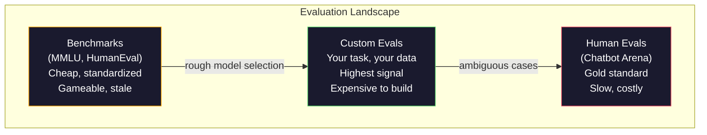
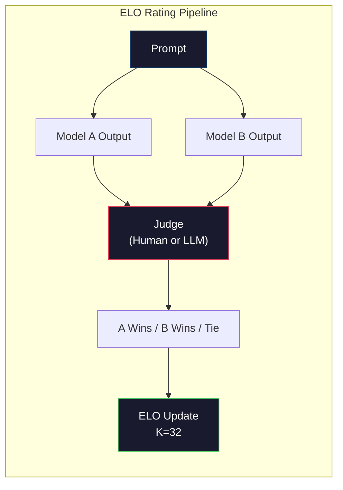

# Évaluation:Prévisions de référence,Evaluations,LM Harness

> La loi de Goodhart: lorsqu'un indicateur devient un objectif, il ne devient plus un bon indicateur. Chaque laboratoire frontalier se tourne vers des benchmarks pour optimiser.

**Type:** Build
**Languages:** Python
**前置要求:**Phase 10, cours 01-05 (LLM à partir de zéro)
**Time:** ~90 minutes

## Objectif de l'apprentissage
- construire un harnais d'évaluation autodéfinie, utilisé pour le modèle de langage 运行 multiple-choice 和 open-end benchmarks
- 解释为什么标准基准(MMLU、HumanEval) 会和, et ils ne peuvent pas distinguer les modèles frontaliers
- Utilisation de mesures adaptées pour réaliser des évaluations spécifiques à la tâche: correspondance exacte, F1、BLEU, LLM-as-judge
- design face à votre cas d'utilisation spécifique de la suite d'évaluation auto-définie, plutôt que de dépendre uniquement des classements publics

##  problématique
MMLU 发布于2020,包含 57 个学科的 15,908 道题──三年内, frontière modèles 就让它和了──GPT-4 得分 86.4%──Claude 3 Opus 得分 86.8%──Llama 3 405B 得分 88.6%──leaderboard a été comprimé à 3 分范围内, dont la différence n'est que du bruit statistique, et non des lacunes de capacité réelles──

En même temps, ces modèles échouent dans une tâche qu'un enfant de 10 ans n'a pas à penser à accomplir. Claude 3.5 Sonnet donne un score de 88.7% sur MMLU, mais au début, il ne peut pas compter le nombre de lettres dans "framboise". Cette tâche ne nécessite aucune connaissance du monde, ne nécessite pas de raisonnement, nécessite uniquement une itération au niveau des personnages. HumanEval utilise 164 problèmes de génération de code de test. Le modèle sur lequel il obtient plus de 90% de scores, mais génère toujours des codes qui se déroulent dans des situations de bordure, tandis que tout développeur primaire peut trouver ces frontières.

La différence entre les performances de référence et la fiabilité du monde réel est le problème central de l'évaluation de la LLM. Les critères de référence ne peuvent que vous dire comment le modèle se déplace sur le benchmark. Ils ne peuvent presque pas vous dire comment ce modèle se déplace dans vos tâches spécifiques, vos données spécifiques, vos modes d'échec spécifiques. Si vous construisez un bot de support client, MMLU n'a pas d'importance. Si vous construisez un assistant de code, HumanEval ne couvre que la génération de fonctionnement, il ne peut pas s'agir de débogage, de réfactorage ou de code d'explication à travers les fichiers.

Vous avez besoin d'évaluations personnalisées. Non pas parce que les critères de référence ne sont pas utilisés, les critères de référence pour choisir un modèle grossier sont très utiles, mais parce que l'évaluation finale doit être précise pour correspondre à vos conditions de déploiement.

## 概念
### Le paysage d'Eval

L'évaluation est divisée en trois catégories, chaque catégorie étant différente du coût et de la qualité du signal.

**Benchmarks**Il est préférable de faire fonctionner un modèle avec un nombre de tests, et de le comparer avec un modèle. Le défaut est que les données du modèle et de l'entraînement deviennent plus faciles à contaminer ces critères.

**Custom evals**Vous définissez les entrées, les sorties et les résultats attendus et la fonction de notation. Le résumé du document de loi doit être évalué dans le document de loi. Le générateur de SQL doit être évalué dans votre schéma de base de données. Ces évaluations coûtent beaucoup de coûts de création, mais elles sont les seules à pouvoir prédire la performance de la production.

**Human evals**Utilisation de l'annotateur de paiement, en fonction de l'utilité, de la précision, de la fluidité et de la sécurité, etc. Pour les tâches à but non lucratif automatisées, c'est la norme en or. Chatbot Arena a collecté plus de 200 millions de votes de préférence de 100 modèles.$0.10-$2,00) et la vitesse (((



### Pourquoi les critères de référence sont brisés

Les trois mécanismes entraînent une réduction du nombre de référence qui ne reflète plus la capacité réelle.

**Data contamination。**訓練语料会抓取互联网──Benchmark 问题也在互联网──模型在训练期间看到了答案──这不是传统意义上的骗局,实验室并非有意含基准数据──但网络规模抓取使其排除几乎不可能──

**Teaching to the test。**Les laboratoires vont cibler les performances de référence  Optimiser les entraînements mixtes de données. Si 5% des données mixtes de formation sont des choix multiples de style MMLU, le modèle se retrouve dans ce format et une distribution de réponses.

**Saturation。**Lorsque chaque modèle frontalier atteint 85 à 90% dans un même critère de référence, ce critère de référence cesse de faire la différenciation. Les 10 à 15% restants peuvent être ambiguës, ou nécessiter des connaissances sur le domaine du code.

### La perplexité: 快速健康检查

La perplexité est un indicateur de probabilité de logement négatif moyen.

```
PPL = exp(-1/N * sum(log P(token_i | context)))
```

La perplexité pour 10 montre le modèle en moyenne, comme dans chaque marque  position de 10 个选项中均选择一样不确定──越低越好──GPT-2 在 WikiText-103 上的 perplexity 约为 30──GPT-3 约为 20──Llama 3 8B 约为 7──

La perplexité est utile pour un modèle comparé dans le même ensemble de tests, mais elle a des points aveugles. Le modèle peut être utilisé pour prévoir un modèle commun et obtenir une faible perplexité, mais il est également très peu performant dans un modèle rare mais important. Il ne peut pas expliquer l'instruction suivant la raison ou l'exactitude factuelle.

### M.L. comme juge

Utiliser un modèle fort pour évaluer la qualité du modèle faible. L'idée est très simple: faire en sorte que GPT-4o ou Claude Sonnet  selon 1-5 分 évaluer la précision, l'utilité et la sécurité de la réponse.

Le prompt de notation est plus important que le modèle lui-même. Le prompt de modélisation ("Rate this response") génère un nombre de bruits.

Les modes d'échec: les modèles de juges vont exprimer des biais de position ((( dans les comparaisons parallèles 中偏好第一反应) ‧verbosity bias (((偏好更长的反应) 和自我偏好(GPT-4对GPT-4输出的评分高于等价的克劳德输出) ‧缓解方法:随机化顺序、按长度归归归化、使用不同于被评价的模型的评审──

###  Basé sur des évaluations ELO

C'est la méthode de Chatbot Arena. Pour chaque modèle, le classement ELO est calculé à plusieurs milliers de reprises.

ELO: classement relatif par rapport au score absolu plus fiable, capable de traiter les liens, et par rapport à chaque sortie de jeu nécessite moins de comparaisons, jusqu'au début de l'année 2026, Chatbot Arena montre la classification GPT-4o、Claude 3.5 Sonnet 和 Gemini 1.5 Pro en tête de liste entre eux par rapport à 20 points ELO。



### Cadres équivalents

**lm-evaluation-harness**(EleutherAI): standard de cadre d'évaluation open source. Soutenir 200+ points de référence.

**RAGAS**: spécialisé dans le cadre d'évaluation des pipelines RAG。 Mesurer la fidélité de la réponse                                                                                                                                                                                                                                                   

**promptfoo**Pour les tests de régression des demandes, veillez à ce que les changements rapides ne détruisent pas les cas de test déjà existants.

### Construire des évaux personnalisés

C'est la seule évaluation importante de la production.

1. **Define the task。**模型到底应该做什么?要精确──"Répondre aux questions" 太模糊──"En raison d'un courriel de plainte client, extraire le nom du produit, la catégorie de problème et le sentiment" 才是一个可以评估的任务──

2. **Create test cases。**Le prototype eval au moins 50 个, la production au moins 200 个. Chaque cas de test est un (entrée, expectable_sortie) pour.

3. **Define scoring。**Les résultats structurés Utilisation de correspondance exacte. Utilisation de la qualité BLEU/ROUGE. Utilisation de la qualité ouverte. Utilisation de la qualité LLM en tant que juge. Utilisation de la fonction d'extraction. Utilisation de la méthode F1. Utilisation de la méthode de calcul.

4. **Automate。**Chaque évaluation peut être effectuée à l'aide d'une seule commande.

5. **Track over time。**单独一个评分分 没有意义――你需要趋势线――上一次快速变化 后分数是否升升?切换模型后是否回归?把 eval与提示 一起版本――

| Eval Type | 每次 judgment 成本 | 与人类的一致性 | 最适合 |
|-----------|------------------|----------------------|----------|
| Exact match | ~$0 | 100%（适用时） | Structured output、classification |
| BLEU/ROUGE | ~$0 | ~60% | Translation、summarization |
| LLM-as-judge | ~$0.01 | ~80% | Open-ended generation |
| Human eval | $0.10-$2.00 | N/A（即 ground truth） | Ambiguous、high-stakes tasks |


```figure
perplexity-loss
```

## - Je le construis.
### 步骤 1: minimale Eval  cadre

定义核心抽象──一个 eval case 有输入、预期输出 和可选的元数据 dict──一个得分者 接收预测 和参考,并返回 0 到 1 之间的分数──

```python
import json
from collections import Counter

class EvalCase:
    def __init__(self, input_text, expected, metadata=None):
        self.input_text = input_text
        self.expected = expected
        self.metadata = metadata or {}

class EvalSuite:
    def __init__(self, name, cases, scorers):
        self.name = name
        self.cases = cases
        self.scorers = scorers

    def run(self, model_fn):
        results = []
        for case in self.cases:
            prediction = model_fn(case.input_text)
            scores = {}
            for scorer_name, scorer_fn in self.scorers.items():
                scores[scorer_name] = scorer_fn(prediction, case.expected)
            results.append({
                "input": case.input_text,
                "expected": case.expected,
                "prediction": prediction,
                "scores": scores,
            })
        return results
```

### 步骤 2: Fonctions de notation

- Je suis un juge.

```python
def exact_match(prediction, expected):
    return 1.0 if prediction.strip().lower() == expected.strip().lower() else 0.0

def token_f1(prediction, expected):
    pred_tokens = set(prediction.lower().split())
    exp_tokens = set(expected.lower().split())
    if not pred_tokens or not exp_tokens:
        return 0.0
    common = pred_tokens & exp_tokens
    precision = len(common) / len(pred_tokens)
    recall = len(common) / len(exp_tokens)
    if precision + recall == 0:
        return 0.0
    return 2 * (precision * recall) / (precision + recall)

def llm_judge_simulated(prediction, expected):
    pred_words = set(prediction.lower().split())
    exp_words = set(expected.lower().split())
    if not exp_words:
        return 0.0
    overlap = len(pred_words & exp_words) / len(exp_words)
    length_penalty = min(1.0, len(prediction) / max(len(expected), 1))
    return round(overlap * 0.7 + length_penalty * 0.3, 3)
```

### 步骤 3: Système de notation ELO

Utilisez les mises à jour ELO pour réaliser des comparaisons en paires.

```python
class ELOTracker:
    def __init__(self, k=32, initial_rating=1500):
        self.ratings = {}
        self.k = k
        self.initial_rating = initial_rating
        self.history = []

    def _ensure_player(self, name):
        if name not in self.ratings:
            self.ratings[name] = self.initial_rating

    def expected_score(self, rating_a, rating_b):
        return 1 / (1 + 10 ** ((rating_b - rating_a) / 400))

    def record_match(self, player_a, player_b, outcome):
        self._ensure_player(player_a)
        self._ensure_player(player_b)

        ea = self.expected_score(self.ratings[player_a], self.ratings[player_b])
        eb = 1 - ea

        if outcome == "a":
            sa, sb = 1.0, 0.0
        elif outcome == "b":
            sa, sb = 0.0, 1.0
        else:
            sa, sb = 0.5, 0.5

        self.ratings[player_a] += self.k * (sa - ea)
        self.ratings[player_b] += self.k * (sb - eb)

        self.history.append({
            "a": player_a, "b": player_b,
            "outcome": outcome,
            "rating_a": round(self.ratings[player_a], 1),
            "rating_b": round(self.ratings[player_b], 1),
        })

    def leaderboard(self):
        return sorted(self.ratings.items(), key=lambda x: -x[1])
```

### 步骤 4: Calcul de la complexité

Utilisez les probabilités de jeton  calculer la perplexité  Dans la pratique, vous obtiendrez ces valeurs de logits du modèle  ici nous utilisons la distribution de probabilité 

```python
import numpy as np

def perplexity(log_probs):
    if not log_probs:
        return float("inf")
    avg_neg_log_prob = -np.mean(log_probs)
    return float(np.exp(avg_neg_log_prob))

def token_log_probs_simulated(text, model_quality=0.8):
    np.random.seed(hash(text) % 2**31)
    tokens = text.split()
    log_probs = []
    for i, token in enumerate(tokens):
        base_prob = model_quality
        if len(token) > 8:
            base_prob *= 0.6
        if i == 0:
            base_prob *= 0.7
        prob = np.clip(base_prob + np.random.normal(0, 0.1), 0.01, 0.99)
        log_probs.append(float(np.log(prob)))
    return log_probs
```

### 步骤 5: Résultats agrégés

计算一次 eval run: moyenne, moyenne, seuil, taux de réussite, ainsi que des ventilations par métrique

```python
def summarize_results(results, threshold=0.8):
    all_scores = {}
    for r in results:
        for metric, score in r["scores"].items():
            all_scores.setdefault(metric, []).append(score)

    summary = {}
    for metric, scores in all_scores.items():
        arr = np.array(scores)
        summary[metric] = {
            "mean": round(float(np.mean(arr)), 3),
            "median": round(float(np.median(arr)), 3),
            "std": round(float(np.std(arr)), 3),
            "min": round(float(np.min(arr)), 3),
            "max": round(float(np.max(arr)), 3),
            "pass_rate": round(float(np.mean(arr >= threshold)), 3),
            "n": len(scores),
        }
    return summary

def print_summary(summary, suite_name="Eval"):
    print(f"\n{'=' * 60}")
    print(f"  {suite_name} Summary")
    print(f"{'=' * 60}")
    for metric, stats in summary.items():
        print(f"\n  {metric}:")
        print(f"    Mean:      {stats['mean']:.3f}")
        print(f"    Median:    {stats['median']:.3f}")
        print(f"    Std:       {stats['std']:.3f}")
        print(f"    Range:     [{stats['min']:.3f}, {stats['max']:.3f}]")
        print(f"    Pass rate: {stats['pass_rate']:.1%} (threshold >= 0.8)")
        print(f"    N:         {stats['n']}")
```

### 步骤 6: Exécuter le pipeline complet

Pour créer un test, créer des cas de test, simuler deux modèles, exécuter des évaluations, comparer des éléments par paires,

```python
def demo_model_good(prompt):
    responses = {
        "What is the capital of France?": "Paris",
        "What is 2 + 2?": "4",
        "Who wrote Hamlet?": "William Shakespeare",
        "What language is PyTorch written in?": "Python and C++",
        "What is the boiling point of water?": "100 degrees Celsius",
    }
    return responses.get(prompt, "I don't know")

def demo_model_bad(prompt):
    responses = {
        "What is the capital of France?": "Paris is the capital city of France",
        "What is 2 + 2?": "The answer is four",
        "Who wrote Hamlet?": "Shakespeare",
        "What language is PyTorch written in?": "Python",
        "What is the boiling point of water?": "212 Fahrenheit",
    }
    return responses.get(prompt, "Unknown")

cases = [
    EvalCase("What is the capital of France?", "Paris"),
    EvalCase("What is 2 + 2?", "4"),
    EvalCase("Who wrote Hamlet?", "William Shakespeare"),
    EvalCase("What language is PyTorch written in?", "Python and C++"),
    EvalCase("What is the boiling point of water?", "100 degrees Celsius"),
]

suite = EvalSuite(
    name="General Knowledge",
    cases=cases,
    scorers={
        "exact_match": exact_match,
        "token_f1": token_f1,
        "llm_judge": llm_judge_simulated,
    },
)

results_good = suite.run(demo_model_good)
results_bad = suite.run(demo_model_bad)

print_summary(summarize_results(results_good), "Model A (concise)")
print_summary(summarize_results(results_bad), "Model B (verbose)")
```

Le modèle "bon" donne une réponse précise. Le modèle "mauvais" donne des parafrases longues. Le match exact sera un châtiment grave.

### 步骤 7: Tournoi ELO

Dans plusieurs ronds, les comparaisons en paires entre les modèles de travail sont effectuées.

```python
elo = ELOTracker(k=32)

for case in cases:
    pred_a = demo_model_good(case.input_text)
    pred_b = demo_model_bad(case.input_text)

    score_a = token_f1(pred_a, case.expected)
    score_b = token_f1(pred_b, case.expected)

    if score_a > score_b:
        outcome = "a"
    elif score_b > score_a:
        outcome = "b"
    else:
        outcome = "tie"

    elo.record_match("model_a_concise", "model_b_verbose", outcome)

print("\nELO Leaderboard:")
for name, rating in elo.leaderboard():
    print(f"  {name}: {rating:.0f}")
```

### 步骤 8: Parallèle de la perplexité

La complexité du modèle par rapport à un niveau de qualité différent.

```python
test_text = "The quick brown fox jumps over the lazy dog in the garden"

for quality, label in [(0.9, "Strong model"), (0.7, "Medium model"), (0.4, "Weak model")]:
    log_probs = token_log_probs_simulated(test_text, model_quality=quality)
    ppl = perplexity(log_probs)
    print(f"  {label} (quality={quality}): perplexity = {ppl:.2f}")
```

## Utilisez-le
### L'équipement d'évaluation (EleutherAI)

Dans les modèles de référence, il existe des critères de référence.

```python
# pip install lm-eval
# Command line:
# lm_eval --model hf --model_args pretrained=meta-llama/Llama-3.1-8B --tasks mmlu --batch_size 8

# Python API:
# import lm_eval
# results = lm_eval.simple_evaluate(
#     model="hf",
#     model_args="pretrained=meta-llama/Llama-3.1-8B",
#     tasks=["mmlu", "hellaswag", "arc_easy"],
#     batch_size=8,
# )
# print(results["results"])
```

### promptfoo

Utilisé pour évaluer l'ingénierie rapide en fonction de la configuration.

```yaml
# promptfoo.yaml
providers:
  - openai:gpt-4o-mini
  - anthropic:claude-3-haiku

prompts:
  - "Answer in one word: {{question}}"

tests:
  - vars:
      question: "What is the capital of France?"
    assert:
      - type: contains
        value: "Paris"
  - vars:
      question: "What is 2 + 2?"
    assert:
      - type: equals
        value: "4"
```

### RAGAS pour l'évaluation des RAG

```python
# pip install ragas
# from ragas import evaluate
# from ragas.metrics import faithfulness, answer_relevancy, context_precision
#
# result = evaluate(
#     dataset,
#     metrics=[faithfulness, answer_relevancy, context_precision],
# )
# print(result)
```

RAGAS Méter les évaluations générales 会遗漏的内容: Model answer is based on retrieved context, not just in abstract sense  correct──

## Je le livre.
本课会产出 `outputs/prompt-eval-designer.md`, c'est une demande réutilisable, utilisée pour concevoir des suites d'évaluation personnalisées pour des tâches individuelles. Donnez-lui une description de tâche, elle générera des cas de test, des fonctions de notation et des seuils de réussite.

Il va se produire .`outputs/skill-llm-evaluation.md`, c'est un cadre de décision, utilisé en fonction de votre type de tâche, de votre budget et de vos exigences de latence, choisissez une stratégie d'évaluation adaptée.

## 练习
1. Ajouter un scoreur de "conformité": avec la même entrée 让模型运行 5 times,并衡量输出 匹配的频率──déterministiques entrées 上的不一致答案会暴露脆弱的提示或过高的温度设置──

2.  élargir le tracker ELO, en lui permettant de soutenir plusieurs fonctions de juge (exact match 、F1、LLM-as-judge) et de leur donner des droits à ajouter.

3. Pour une tâche spécifique, construire une suite d'évaluation: classifier les e-mails dans 5 catégories. Créer 100 cas de test, contenant plusieurs exemples et cas de bord.

4.  réaliser la détection de la contamination: donner un ensemble d'évaluations et un corpus de formation, examiner la proportion de questions d'évaluation (ou des parafrases approximatives) qui apparaissent dans les données de formation.

5. Construire un outil de "différence de modèle" ⋅ pour déterminer les résultats d'évaluation de deux versions de modèle, quelles sont les cas de test spécifiques ⋅ améliorés, lesquels sont revenus, lesquels restent inchangés ⋅ c'est le code de la version d'évaluation ⋅ diff, il est essentiel de comprendre si un changement est utile ou nuisible ⋅

## 关键术语
| Term | 人们的说法 | 它实际上的含义 |
|------|----------------|----------------------|
| MMLU | "The benchmark" | Massive Multitask Language Understanding，包含 57 个学科的 15,908 道 multiple choice questions，到 2025 年已在 88% 以上饱和 |
| HumanEval | "Code eval" | OpenAI 的 164 个 Python function-completion problems，只测试 isolated function generation |
| SWE-bench | "Real coding eval" | 来自 12 个 Python repos 的 2,294 个 GitHub issues，衡量包括 test generation 在内的 end-to-end bug fixing |
| Perplexity | "How confused the model is" | exp(-avg(log P(token_i given context)))，越低表示模型给实际 tokens 分配的概率越高 |
| ELO rating | "Chess ranking for models" | 根据 pairwise win/loss records 计算的 relative skill rating，Chatbot Arena 用它对 100+ models 排名 |
| LLM-as-judge | "Using AI to grade AI" | 强模型按照 rubric 评价弱模型 outputs，与人类 judges 约 80% agreement，成本约 $0.01/judgment |
| Data contamination | "The model saw the test" | Training data 包含 benchmark questions，在不提升真实 capability 的情况下抬高分数 |
| Eval suite | "A bunch of tests" | 一个 versioned collection，由 (input, expected_output, scorer) triples 组成，用于衡量特定 capability |
| Pass rate | "What percentage it gets right" | Eval cases 中得分超过阈值的比例，比 mean score 更可操作，因为它衡量 reliability |
| Chatbot Arena | "Model ranking website" | LMSYS 平台，拥有 2M+ human preference votes，并通过 ELO ratings 生成最可信的 LLM leaderboard |

## 延伸阅读
- [Hendrycks et al., 2021 -- "Measuring Massive Multitask Language Understanding"](https://arxiv.org/abs/2009.03300)-- Le document de l'AMLU, bien qu'il soit déjà publié, est toujours le point de référence le plus cité pour le LLM
- [Chen et al., 2021 -- "Evaluating Large Language Models Trained on Code"](https://arxiv.org/abs/2107.03374)-- Le document HumanEval d'OpenAI, a établi une méthodologie d'évaluation de la génération de code
- [Zheng et al., 2023 -- "Judging LLM-as-a-Judge"](https://arxiv.org/abs/2306.05685)-- pour l'utilisation de l'évaluation des LLM, analyse systémique des LLM, y compris le biais de position et le biais de verbosité
- [LMSYS Chatbot Arena](https://chat.lmsys.org/)-- plateforme de comparaison de modèles crowdsourced, avec plus de 2 millions de voix, est le classement le plus fiable de la réalité mondiale LLM
