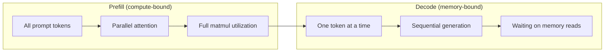
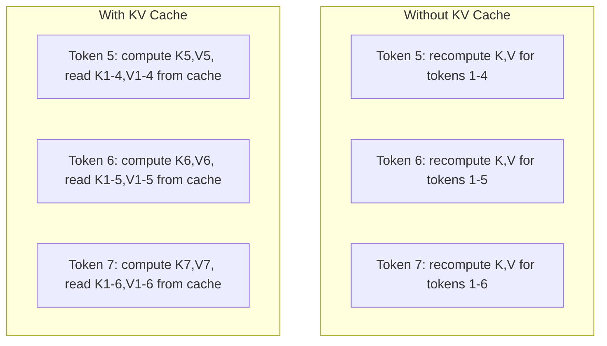
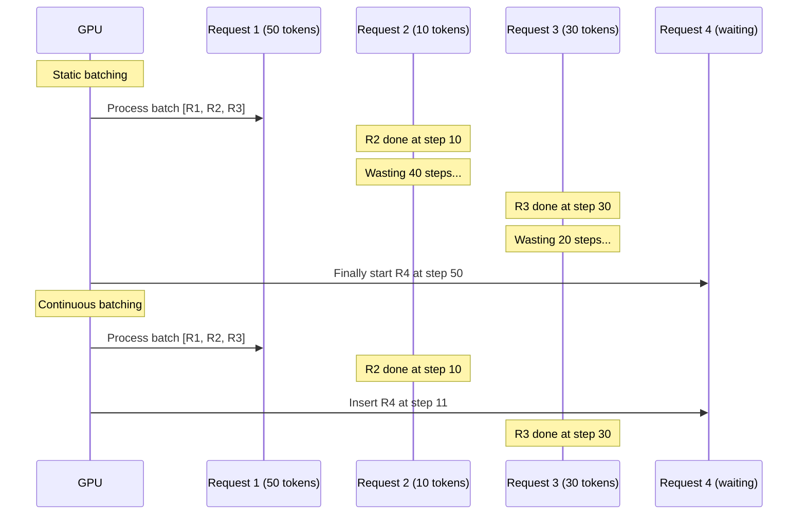
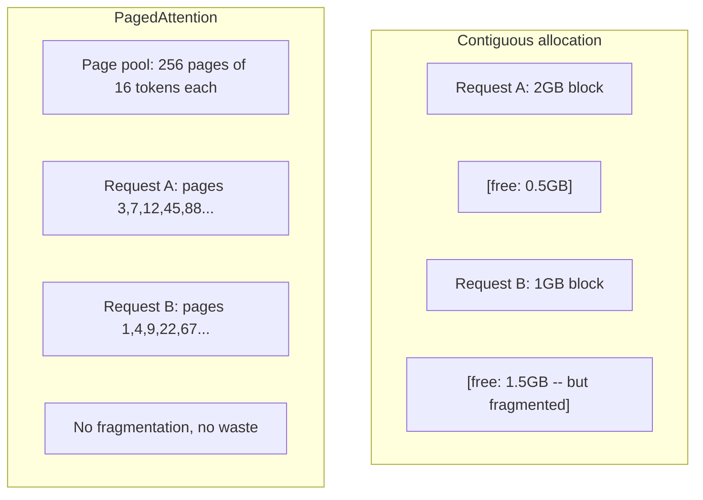
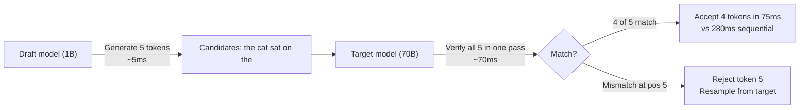

# Inference 优化

> 两个阶段定义了LLM inference──Préfill并行处理你的提示――计算-bound──Decode 一次生成一个代币――内存-bound──每种优化都针对其中一个或两个阶段──

**Type:** Build
**Languages:** Python
**Prerequisites:** Phase 10, Lessons 01-08 (Transformer architecture, attention)
**Time:** ~120 分钟

## Objectif de l'apprentissage

- réaliser KV-cache, afin d'éliminer les déductions de calcul pendant la période de production des jetons autorégressifs
-                                                                                                                                                                                                                                                                                                                                                                                                                                                                                                                              
- 实现 continu batching 和 PagedAttention 概念, afin de maximiser le taux d'utilisation de la GPU en cas de requête de mise à jour
- Concrètement de la mise en œuvre de la technologie de la mise en cache de KV, du décoding spéculatif, de l'attention flash) et de son débit/la latence

##  problématique

Vous êtes installé sur des GPU 4xA100 pour déployer Llama 3 70B. Un seul utilisateur peut obtenir environ 50 jetons par seconde.

Le modèle lui-même n'a pas changé entre 1 utilisateur et 100 utilisateurs. Les mêmes poids, la même architecture, les mêmes mathématiques. Le changement est la façon dont vous réglez le travail.

Ceci n'est pas une question de mise à l'échelle. Ceci est une question de planification. La technique de cette classe - KV caching, batchage continu, Attention payée, décoding spéculatif, préfixe de caching - est de faire des calculs mensuels de 25 000 $ par mois et 5 000 $ par mois, services, la même quantité de calculs.

vLLM en 4xA100-80GB en charge de Llama 3 70B 时, en bas并发下 atteint environ 50 tokens/seconde/utilisateur,并通过连续批发和 PagedAttention en 100 个并发请求维持 15-25 TPS/user──没有这些优化,同样硬件在该并发下只能提供5 TPS/user──同样的GPUs──同样的模型,吞吐量提升4倍──

## 概念

### Préchargement par rapport au décodeur

Chaque demande d'inference de LLM a deux étapes différentes.

**Prefill**处理整个输入提示──所有代币都已知,因此注意可以在完整序列上并行计算──这是一个大型矩阵乘法--GPU cores会保持忙碌──瓶是计算:你的硬件每秒能提供多少FLOPS──A100可达到 312 TFLOPS (BF16)──在单张 A100 上,70B 模型对 4,096-代币提示做做预填 约需要400ms──

**Decode**Une fois généré un jeton de sortie. Chaque nouveau jeton assiste à tous les jetons précédents, mais chaque fois passé en avant ne produit qu'un jeton. Les matrices de poids ont la même taille que les matrices de remplissage. Mais vous utilisez un seul vecteur et non une seule matrice pour les transporter. Les noyaux GPU sont terminés en micro-seconde, puis attendez la prochaine série de poids de la mémoire jusqu'à la capacité de décodage.



**ops:byte ratio**(également appelé intensité arithmétique) a dessiné ce type de prise.

```
ops:byte ratio = FLOPs per token / bytes read from memory
```

En effectuant un pré-remplissage de 4,096 jetons par lot, par charge, vous effectuerez environ 4,096 opérations de multiplication-accumulation. Ce ratio est très élevé.

核心洞察:*le décode est lié à la mémoire, car tu lis tout le modèle pour produire un seul jeton*。

### Cache KV

En attendant, chaque requête de jeton répondra à chaque vecteur de clé et de valeur précédent de jeton. Sans caching, générer des jetons N 需要重新计算前面 N-1 个 token的钥匙和值预测.

KV cache  stockage de toutes les jetons précédents de la clé et de la valeur des projections。 générer des jetons N 时, vous ne faites que calculer la clé et la valeur des jetons N, puis les mettre avec les jetons cachés K/V 1 à N-1 拼拼拼拼起来──



**KV cache 的 memory 公式：**

```
KV cache size = 2 * num_layers * num_kv_heads * head_dim * seq_len * bytes_per_param
```

Pour les lames 3 70B ((80 couches、8 têtes KV avec GQA、tête_dim=128、BF16):

```
per token: 2 * 80 * 8 * 128 * 2 bytes = 327,680 bytes = 320 KB
at 4,096 tokens: 320 KB * 4,096 = 1.28 GB
at 128K tokens: 320 KB * 131,072 = 40 GB
```

Une conversation de 128K dans le contexte d'un Llama 3 70B consommera 40 Go de cache KV -- 半张 A100 de mémoire──100 个并发用户、每人4K tokens 时, seulement KV cache nécessite 128 Go──这就是为什么 KV cache management est le défi central de l'optimisation des conclusions──

### Les lots continuels

Le batchage statique va attendre l'arrivée d'un lot de requêtes N, les traiter ensemble, et attendre jusqu'à ce que tout soit terminé pour accepter une nouvelle requête. Si une requête nécessite 500 jetons, une autre nécessite 10, la requête doit être terminée et mettre en place 490 étapes de décode.

Le batch continu (également appelé batch à niveau d'itération) sera immédiatement inséré dans le batch après la réalisation de toute demande.



La capacité de débit est variable en fonction du degré de variation de la longueur de sortie. La longueur correspond à celle du lot continu et du lot statique.

### PageAtention

Chaque requête de cache KV est un bloc de mémoire contiguë. Avec la requête de parvenir et de partir, la mémoire se fragmente - comme la fragmentaison de la RAM dans le système d'exploitation. Une requête de 4K-token nécessite 1,28 Go de mémoire contiguée. Même si le total de 2 Go est gratuit, vous ne pouvez pas avoir 1,28 Go de mémoire contiguée.

PagedAttention (en anglais: PagedAttention) est un logiciel de gestion de contenu (OS) qui utilise la mémoire virtuelle de type KV dans le cache. Il ne s'agit pas de répartir un bloc contigu à chaque requête, mais de répartir une "page" fixe de taille (en général, 16 tokens de page).



PagedAttention et les préfixes partagés **copy-on-write** Si 50 requêtes partagent le même système, cette page de cache KV de l'instruction du système est stockée une seule fois et est utilisée par 50 requêtes communes.

Le rapport vLLM  rapporte que, par le biais de PagedAttention, on peut réaliser près de zéro gaspillage de mémoire (environ 4%) alors que l'allocation naïve est d'environ 60-80%)

### Décodage spéculatif

Décoder lentement parce qu'il est séquentiel - vous générez un jeton, le retournez, le reproduisez dans le prochain. Mais si vous pouvez à bon marché deviner les 5 prochains jetons, puis les vérifier une fois pour toutes ?

Décodage spéculatif Utilisez un petit et rapide**draft model**生成 K 个 candidats des jetons.**target model**Il est ensuite utilisé pour traiter tous les K 个候选人 (en utilisant le même code que le code de référence) si le modèle cible est prévisible, vous acceptez tous les K 个代币.



Accélération 取决于 **acceptance rate**-- prédiction du modèle de projet avec la fréquence de correspondance cible―Utilisation de Llama 3 8B pour Llama 3 70B Pour la rédaction , dans la langue naturelle, les taux d'acceptation typiques sont de 70 à 85%―, ce qui se traduit par 2-3 fois la vitesse de décode¬¬¬¬¬¬¬¬¬¬¬¬¬¬¬¬¬¬¬¬¬¬¬¬¬¬¬¬¬¬¬¬¬

Décodage spéculatif de trois méthodes:

| Method | Draft source | Acceptance rate | Overhead |
|--------|-------------|-----------------|----------|
| Draft-target (Leviathan et al.) | 独立小模型 | 70-85% | Draft model memory |
| EAGLE (Li et al.) | Target 上的轻量 head | 75-90% | ~1% extra parameters |
| N-gram lookup | Token n-gram table | 40-60% | 可忽略 |

**EAGLE**Dans les états cachés du modèle cible 之上训练一个小型autoregressive head──它使用目标模型 倒数第二层功能来预测下一个代币的嵌入式──因为它操作的是目标模型 自身的表示(而不是独立模型的),所以能以极极少的额外内存 获得更高的接受率──EAGLE-2 增加了动态草案树,可根据背景调整候选人数──

**N-gram speculative decoding**维护来自当前文本或预构建 corpus的 n-gram continuations table──如果草案匹配同样的对话中此前出现的内容(重复模式、代码、结构化输出), il sera avec zéro N réseau neural overhead 触发──平均 acceptation taux encore plus bas, mais le coût de la spéculation par fois est fondamentalement zéro──

Le décoding spéculatif est mathématiquement précis * - 输出分布与目标模型的分布完全相同──────────────────────────────────────────────────────────────────────────────────────────────────────────────────────────────────────────────────────────────────────────────────────────────────────────────────────────────────────────────────────────────────────────────────────────────────────────────────────────────────────────────────────────────────────────────────────────────────────────────────────────────────────────────────────────────────────────────────────────────────────────────────────────────────────────────────────────────────────────────────────────────────────────────────────────────────────────────────────────────────────────────────────────────────────────────────────────────────────────────────────────────────────────────────────────────────────────────────────────────────────────────────────────────────────────────────────────────────────────────────────────────────────────────────────────────────────────────────────────────────────────

### Préfixe de mise en cache

许多请求共享相同前──Chatbot system prompt──RAG context block──Few-shot example set──没有前缓存 时,每个请求都会从头重新计算这些共享代币的KV缓存──

Préfixe de mise en cache  stockage de préfixes communs KV cache, et demande entre réponses.

Pour toutes les requêtes partagées, le système de 2,000 jetons est instantané, le préfixe de mise en cache élimine chaque requête d'environ 400 ms de pré-remplissage.

SGLang's RadixAttention Utilisez un arbre radix(trie) pour réaliser le caching de préfixes, selon le contenu des jetons indexation de préfixes。 tout correspondant préfixe stocké de la demande de tout être gratuitement obtenu son cache KV。 cet arbre support partiel préfixe correspondant -- Si vous partagez avec une entrée caché 2.000 个 préfixe de jetons parmi lesquels 1.500 个, reprenez cette 1.500 个, seulement recalculer 500 个。

### Moteurs à inférence

3 moteurs de production principale LLM servant:

| Engine | Key innovation | Best for |
|--------|---------------|----------|
| vLLM | PagedAttention、continuous batching | 通用 serving、最高兼容性 |
| SGLang | RadixAttention（prefix caching）、structured generation | Multi-turn chatbots、constrained decoding |
| TensorRT-LLM | NVIDIA kernel fusion、FP8 quantization | NVIDIA hardware 上的最大 single-GPU throughput |

**vLLM**Il prend en charge le plus large des modèles, peut être utilisé par tout fournisseur de GPU (NVIDIA, AMD, Intel) et via PagedAttention + continu batching pour obtenir un fort débit.

**SGLang**建立在与vLLM相似的基础之上, mais a augmenté RadixAttention utilisé pour le caching de préfixes, ainsi que pour le langage spécifique du domaine des programmes LLM structurés. Si votre charge de travail contient des conversations multi-tours, l'utilisation d'outils ou le décoding restreint (extrait JSON, génération guidée par régex), SGLang 往往能通过 prefixes reuse比vLLM 快 2-5 倍──

**TensorRT-LLM**Le modèle est compilé en un noyau GPU NVIDIA optimisé. Il fusionne des opérations de l'attention + linéaire + activation dans un noyau), utilise FP8 sur les GPU H100, et est intégré à NVIDIA Triton Inference Server pour le déploiement de production. Il est utilisé dans le matériel NVIDIA pour atteindre le débit le plus élevé de GPU unique, mais la configuration est plus grande et ne s'applique qu'aux GPU NVIDIA.

Llama 3 70B 的真实世界数字(4xA100-80GB,BF16):

| Metric | vLLM | SGLang | TensorRT-LLM |
|--------|------|--------|---------------|
| Throughput（1 user） | ~50 TPS | ~55 TPS | ~65 TPS |
| Throughput（100 users） | ~2,500 total TPS | ~3,200 total TPS | ~3,000 total TPS |
| Time to first token | ~400ms | ~300ms（prefix hit） | ~350ms |
| Max context | 128K | 128K | 128K |

### Ops:Byte 框架

Vous ne pouvez pas vous optimiser sans mesurer quelque chose. Oops: le ratio de cycles vous dira si la charge de travail est liée à l'informatique ou à la mémoire, et cela décide de l'optimisation qui est vraiment importante.

```
Compute roof: peak FLOPS of the GPU
Memory roof:  peak bandwidth * ops:byte ratio
```

Lorsque les opérations:byte 较低时(decode、小批), vous toucherez le toit de la bande passante de la mémoire。 augmenter davantage la computabilité(更高钟、更多核心) pas d'aide。 vous devez réduire les lectures de mémoire(quantisation、KV cache compression), ou augmenter la taille du lot, les lectures seront distribuées à plus de travail utile。

Lorsque les opérations de débit sont plus élevées, vous aurez besoin de GPU plus rapides, de fusion au noyau ou de précision réduite pour produire plus de FLOPS.

| Scenario | ops:byte | Bound | Optimize with |
|----------|----------|-------|---------------|
| Prefill, batch=1 | ~4,096 | Compute | Kernel fusion, FP8 |
| Decode, batch=1 | ~1 | Memory | Quantization, KV compression |
| Decode, batch=32 | ~32 | Memory | Larger batch, continuous batching |
| Decode, batch=256 | ~256 | Transitioning | 两者都重要 |
| Decode, batch=1024 | ~1,024 | Compute | Kernel fusion, tensor parallelism |

A100 上的交叉点 大约是 ops:byte = 156(312 TFLOPS / 2 TB/s) ⋅低于 156 时,你是内存绑定的.高于 156 时,你是计算绑定的.


```figure
context-window-slide
```

## - Je le construis.

### 步骤 1: réaliser le cache KV à partir de zéro

Nous avons construit un cache KV multi-tête, il est en couche, tête de clé de stockage et de projections de valeur, et afficher la mémoire mode de croissance.

```python
import numpy as np

class KVCache:
    def __init__(self, num_layers, num_heads, head_dim, max_seq_len, dtype=np.float16):
        self.num_layers = num_layers
        self.num_heads = num_heads
        self.head_dim = head_dim
        self.max_seq_len = max_seq_len
        self.dtype = dtype

        self.k_cache = np.zeros(
            (num_layers, num_heads, max_seq_len, head_dim), dtype=dtype
        )
        self.v_cache = np.zeros(
            (num_layers, num_heads, max_seq_len, head_dim), dtype=dtype
        )
        self.seq_len = 0

    def update(self, layer_idx, new_keys, new_values):
        num_new = new_keys.shape[1]
        end = self.seq_len + num_new
        self.k_cache[layer_idx, :, self.seq_len:end, :] = new_keys
        self.v_cache[layer_idx, :, self.seq_len:end, :] = new_values
        return (
            self.k_cache[layer_idx, :, :end, :],
            self.v_cache[layer_idx, :, :end, :]
        )

    def advance(self, num_tokens):
        self.seq_len += num_tokens

    def memory_bytes(self):
        return self.k_cache.nbytes + self.v_cache.nbytes

    def used_bytes(self):
        per_token = 2 * self.num_layers * self.num_heads * self.head_dim * np.dtype(self.dtype).itemsize
        return per_token * self.seq_len
```

### 步骤 2: Utiliser le cache KV Attention

Une attention multi-tête simplifiée, en utilisant le cache KV dans les étapes de décode.

```python
def scaled_dot_product_attention(query, keys, values):
    head_dim = query.shape[-1]
    scores = np.matmul(query, keys.transpose(0, 1, 3, 2)) / np.sqrt(head_dim)
    seq_len_q = scores.shape[-2]
    seq_len_k = scores.shape[-1]
    if seq_len_q > 1:
        mask = np.triu(np.ones((seq_len_q, seq_len_k), dtype=np.float32), k=seq_len_k - seq_len_q + 1)
        scores = scores + mask * (-1e9)
    max_scores = np.max(scores, axis=-1, keepdims=True)
    exp_scores = np.exp(scores - max_scores)
    attn_weights = exp_scores / np.sum(exp_scores, axis=-1, keepdims=True)
    return np.matmul(attn_weights, values)


class MultiHeadAttention:
    def __init__(self, d_model, num_heads):
        self.num_heads = num_heads
        self.head_dim = d_model // num_heads
        scale = np.sqrt(2.0 / d_model)
        self.W_q = np.random.randn(d_model, d_model).astype(np.float32) * scale
        self.W_k = np.random.randn(d_model, d_model).astype(np.float32) * scale
        self.W_v = np.random.randn(d_model, d_model).astype(np.float32) * scale
        self.W_o = np.random.randn(d_model, d_model).astype(np.float32) * scale

    def forward(self, x, kv_cache=None, layer_idx=0):
        batch, seq_len, d_model = x.shape
        Q = np.matmul(x, self.W_q).reshape(batch, seq_len, self.num_heads, self.head_dim).transpose(0, 2, 1, 3)
        K = np.matmul(x, self.W_k).reshape(batch, seq_len, self.num_heads, self.head_dim).transpose(0, 2, 1, 3)
        V = np.matmul(x, self.W_v).reshape(batch, seq_len, self.num_heads, self.head_dim).transpose(0, 2, 1, 3)

        if kv_cache is not None:
            K_full, V_full = kv_cache.update(layer_idx, K[0], V[0])
            K = K_full[np.newaxis, :, :, :]
            V = V_full[np.newaxis, :, :, :]
            if seq_len == 1:
                kv_cache.advance(1)

        attn_out = scaled_dot_product_attention(Q, K, V)
        attn_out = attn_out.transpose(0, 2, 1, 3).reshape(batch, -1, d_model)
        return np.matmul(attn_out, self.W_o)
```

### 步骤 3: Batchage continu 模拟器

Il ressemble à la différence de régulation entre le lotage statique et le lotage continu.

```python
import heapq

class Request:
    def __init__(self, request_id, prompt_tokens, output_tokens, arrival_step):
        self.request_id = request_id
        self.prompt_tokens = prompt_tokens
        self.output_tokens = output_tokens
        self.arrival_step = arrival_step
        self.tokens_generated = 0
        self.start_step = None
        self.end_step = None

    def is_done(self):
        return self.tokens_generated >= self.output_tokens


def simulate_static_batching(requests, batch_size):
    step = 0
    completed = []
    queue = list(requests)
    queue.sort(key=lambda r: r.arrival_step)

    while queue:
        batch = []
        while queue and len(batch) < batch_size:
            r = queue.pop(0)
            r.start_step = max(step, r.arrival_step)
            batch.append(r)

        if batch:
            step = max(step, max(r.start_step for r in batch))
            max_output = max(r.output_tokens for r in batch)
            for r in batch:
                r.tokens_generated = r.output_tokens
                r.end_step = step + max_output
            step += max_output
            completed.extend(batch)

    return completed


def simulate_continuous_batching(requests, batch_size):
    step = 0
    completed = []
    queue = sorted(requests, key=lambda r: r.arrival_step)
    queue_idx = 0
    active = []
    waiting = []

    while queue_idx < len(queue) or active or waiting:
        while queue_idx < len(queue) and queue[queue_idx].arrival_step <= step:
            waiting.append(queue[queue_idx])
            queue_idx += 1

        while waiting and len(active) < batch_size:
            r = waiting.pop(0)
            r.start_step = step
            active.append(r)

        if not active:
            if waiting:
                step += 1
                continue
            elif queue_idx < len(queue):
                step = queue[queue_idx].arrival_step
                continue
            else:
                break

        for r in active:
            r.tokens_generated += 1

        done = [r for r in active if r.is_done()]
        for r in done:
            r.end_step = step + 1
            completed.append(r)
        active = [r for r in active if not r.is_done()]

        step += 1

    return completed


def batching_stats(completed):
    latencies = [r.end_step - r.arrival_step for r in completed]
    total_time = max(r.end_step for r in completed) - min(r.arrival_step for r in completed)
    total_tokens = sum(r.output_tokens for r in completed)
    return {
        "avg_latency": np.mean(latencies),
        "p50_latency": np.median(latencies),
        "p99_latency": np.percentile(latencies, 99),
        "total_time": total_time,
        "throughput": total_tokens / total_time if total_time > 0 else 0,
    }
```

### 步骤 4: préfixe cache

Un cache de préfixes basé sur un tri, utilisé pour stocker les entrées KV de préfixes partagés.

```python
class TrieNode:
    def __init__(self):
        self.children = {}
        self.kv_data = None
        self.hit_count = 0


class PrefixCache:
    def __init__(self, max_entries=1000):
        self.root = TrieNode()
        self.max_entries = max_entries
        self.total_entries = 0
        self.hits = 0
        self.misses = 0

    def _walk(self, token_ids):
        node = self.root
        depth = 0
        for tid in token_ids:
            if tid not in node.children:
                break
            node = node.children[tid]
            depth += 1
        return node, depth

    def lookup(self, token_ids):
        node, depth = self._walk(token_ids)
        if depth > 0:
            self.hits += 1
            current = self.root
            for tid in token_ids[:depth]:
                current = current.children[tid]
                current.hit_count += 1
            kv_entries = []
            current = self.root
            for tid in token_ids[:depth]:
                current = current.children[tid]
                if current.kv_data is not None:
                    kv_entries.append(current.kv_data)
            return depth, kv_entries
        self.misses += 1
        return 0, []

    def insert(self, token_ids, kv_per_token):
        node = self.root
        for i, tid in enumerate(token_ids):
            if tid not in node.children:
                if self.total_entries >= self.max_entries:
                    return i
                node.children[tid] = TrieNode()
                self.total_entries += 1
            node = node.children[tid]
            if i < len(kv_per_token):
                node.kv_data = kv_per_token[i]
        return len(token_ids)

    def hit_rate(self):
        total = self.hits + self.misses
        return self.hits / total if total > 0 else 0.0
```

### 步骤 5: Décodage spéculatif 模拟器

Nous utilisons des taux d'acceptation configurables pour déchiffrer des projets spéculatifs.

```python
class DraftModel:
    def __init__(self, vocab_size, acceptance_rate=0.8):
        self.vocab_size = vocab_size
        self.acceptance_rate = acceptance_rate

    def generate(self, context, num_tokens):
        tokens = np.random.randint(0, self.vocab_size, size=num_tokens)
        return tokens

    def get_probs(self, context, token):
        probs = np.random.dirichlet(np.ones(self.vocab_size))
        return probs


class TargetModel:
    def __init__(self, vocab_size):
        self.vocab_size = vocab_size

    def get_probs(self, context, tokens=None):
        if tokens is not None:
            return [np.random.dirichlet(np.ones(self.vocab_size)) for _ in tokens]
        return np.random.dirichlet(np.ones(self.vocab_size))


def speculative_decode(draft_model, target_model, context, num_speculative=5,
                       draft_cost=1.0, target_cost=10.0, verify_cost=12.0):
    total_tokens = 0
    total_cost = 0.0
    accepted_counts = []
    context = list(context)

    max_tokens = 100

    while total_tokens < max_tokens:
        draft_tokens = draft_model.generate(context, num_speculative)
        total_cost += draft_cost * num_speculative

        target_probs = target_model.get_probs(context, draft_tokens)
        total_cost += verify_cost

        accepted = 0
        for i, token in enumerate(draft_tokens):
            draft_p = draft_model.get_probs(context + list(draft_tokens[:i]), token)
            target_p = target_probs[i]

            r = np.random.random()
            acceptance_prob = min(1.0, target_p[token] / (draft_p[token] + 1e-10))

            if r < draft_model.acceptance_rate:
                accepted += 1
                context.append(token)
                total_tokens += 1
            else:
                new_token = np.random.choice(draft_model.vocab_size, p=target_p)
                context.append(new_token)
                total_tokens += 1
                break

        accepted_counts.append(accepted)

        if accepted == num_speculative:
            bonus_probs = target_model.get_probs(context)
            bonus_token = np.random.choice(draft_model.vocab_size, p=bonus_probs)
            context.append(bonus_token)
            total_tokens += 1

    sequential_cost = total_tokens * target_cost
    return {
        "total_tokens": total_tokens,
        "speculative_cost": total_cost,
        "sequential_cost": sequential_cost,
        "speedup": sequential_cost / total_cost if total_cost > 0 else 1.0,
        "avg_accepted": np.mean(accepted_counts),
        "acceptance_rate": np.mean(accepted_counts) / num_speculative,
    }


def compare_speculation_strategies(vocab_size=1000, num_trials=20):
    results = {}

    for name, acceptance_rate, spec_tokens in [
        ("Draft-target (8B->70B)", 0.78, 5),
        ("EAGLE", 0.85, 6),
        ("N-gram", 0.50, 4),
        ("No speculation", 0.0, 0),
    ]:
        if spec_tokens == 0:
            results[name] = {
                "speedup": 1.0,
                "acceptance_rate": 0.0,
                "avg_accepted": 0.0,
            }
            continue

        trial_results = []
        for _ in range(num_trials):
            draft = DraftModel(vocab_size, acceptance_rate=acceptance_rate)
            target = TargetModel(vocab_size)
            context = list(np.random.randint(0, vocab_size, size=10))
            result = speculative_decode(draft, target, context, num_speculative=spec_tokens)
            trial_results.append(result)

        results[name] = {
            "speedup": np.mean([r["speedup"] for r in trial_results]),
            "acceptance_rate": np.mean([r["acceptance_rate"] for r in trial_results]),
            "avg_accepted": np.mean([r["avg_accepted"] for r in trial_results]),
        }

    return results
```

### 步骤 6: Profiler de mémoire de cache KV

计算真实模型配置的 KV cache mémoire de besoins。

```python
MODEL_CONFIGS = {
    "Llama-3-8B": {
        "num_layers": 32, "num_kv_heads": 8, "head_dim": 128,
        "model_params_b": 8, "gqa": True,
    },
    "Llama-3-70B": {
        "num_layers": 80, "num_kv_heads": 8, "head_dim": 128,
        "model_params_b": 70, "gqa": True,
    },
    "Llama-3-405B": {
        "num_layers": 126, "num_kv_heads": 8, "head_dim": 128,
        "model_params_b": 405, "gqa": True,
    },
    "Mistral-7B": {
        "num_layers": 32, "num_kv_heads": 8, "head_dim": 128,
        "model_params_b": 7, "gqa": True,
    },
    "GPT-4-est": {
        "num_layers": 120, "num_kv_heads": 96, "head_dim": 128,
        "model_params_b": 1800, "gqa": False,
    },
}


def kv_cache_memory(config, seq_len, dtype_bytes=2):
    per_token = 2 * config["num_layers"] * config["num_kv_heads"] * config["head_dim"] * dtype_bytes
    total = per_token * seq_len
    return {
        "per_token_bytes": per_token,
        "per_token_kb": per_token / 1024,
        "total_bytes": total,
        "total_mb": total / (1024 ** 2),
        "total_gb": total / (1024 ** 3),
    }


def memory_budget(config, gpu_memory_gb, model_dtype_bytes=2, kv_dtype_bytes=2):
    model_memory_gb = config["model_params_b"] * 1e9 * model_dtype_bytes / (1024 ** 3)
    overhead_gb = gpu_memory_gb * 0.1
    available_for_kv = gpu_memory_gb - model_memory_gb - overhead_gb

    if available_for_kv <= 0:
        return {"error": "Model does not fit in GPU memory", "model_memory_gb": model_memory_gb}

    per_token = 2 * config["num_layers"] * config["num_kv_heads"] * config["head_dim"] * kv_dtype_bytes
    max_tokens = int(available_for_kv * (1024 ** 3) / per_token)

    return {
        "gpu_memory_gb": gpu_memory_gb,
        "model_memory_gb": round(model_memory_gb, 1),
        "overhead_gb": round(overhead_gb, 1),
        "available_for_kv_gb": round(available_for_kv, 1),
        "max_total_tokens": max_tokens,
        "max_users_at_2k": max_tokens // 2048,
        "max_users_at_4k": max_tokens // 4096,
        "max_users_at_32k": max_tokens // 32768,
    }
```

## Utilisez-le

Utilisation de la carte:

```python
from vllm import LLM, SamplingParams

llm = LLM(
    model="meta-llama/Llama-3-70B-Instruct",
    tensor_parallel_size=4,
    enable_prefix_caching=True,
    max_model_len=8192,
    gpu_memory_utilization=0.9,
)

params = SamplingParams(temperature=0.7, max_tokens=256)
outputs = llm.generate(["Explain inference optimization in one paragraph."], params)
```

Utilisation de SGLang faire préfixe de mise en cache + sortie structurée:

```python
import sglang as sgl

@sgl.function
def classify(s, text):
    s += sgl.system("You are a classifier. Output JSON only.")
    s += sgl.user(f"Classify this text: {text}")
    s += sgl.assistant(sgl.gen("result", regex=r'\{"label": "(positive|negative|neutral)"\}'))

runtime = sgl.Runtime(model_path="meta-llama/Llama-3-70B-Instruct", tp_size=4)
sgl.set_default_backend(runtime)

results = classify.run_batch([
    {"text": "This product is amazing!"},
    {"text": "Terrible experience."},
    {"text": "It was okay I guess."},
])
```

Utilisation de la technologie TensorRT-LLM:

```python
import tensorrt_llm
from tensorrt_llm.runtime import ModelRunner

runner = ModelRunner.from_dir("./llama-70b-trt-engine/", rank=0)

outputs = runner.generate(
    batch_input_ids=[tokenizer.encode("Explain KV caching.")],
    max_new_tokens=256,
    temperature=0.7,
)
```

## Je le livre.

Le programme de formation
- `outputs/skill-inference-optimization.md`-- une compétence pour le diagnostic et l'optimisation de l'inférence LLM servant

## 练习

1. Modifier le profil de cache KV, comparer la quantification de cache KV FP16 vs FP8 vs INT4 Pour le contexte 4K, calculer chaque configuration en 4xA100-80GB.

2. 扩展持续批发 模拟器,以跟踪 GPU utilisation(每步被填满的批发槽比如) ⋅对静态和持续批发 分别绘制利用时间,其中 50 个请求的输出长度服从Pareto分布(形=1.5,规模=20) ⋅Continuous batching 应保持>80% utilisation。

3. 实现 un groupe de requêtes attention ((GQA) version de KV cache, parmi lesquels `num_kv_heads < num_query_heads`◊ Llama 3 70B Utilisez 64 têtes de requête, mais seulement 8 têtes de KV。 calculer par rapport à l'attention multi-tête complète de l'économie de mémoire ◊ KV cache taille  réduit 8 fois)。

4. Construire un cache préfixe de l'expulsion LRU ⋅ utiliser le cache préfixe ⋅ utiliser le cache max_entries ⋅ définir pour 500,并生成 1,000 个请求, dont 60% 共享 5 个常见的预fixes 之一──测量击率 并与无限缓存比较──使用良好的驱逐 时,hit rate 应保持在 55% 以上──

5. 扩展投机解码 模拟器,实现树基投机(EAGLE-2 风格) ――不是单条 K个草案代币的链,而是生成候选人树(例如每3层各 2个分支=8个叶叶候选人) ――比较每一个验证轮 接受的全部代币与线性投机的差异──

## 关键术语

| Term | 人们怎么说 | 它实际意味着什么 |
|------|----------------|----------------------|
| Prefill | "Processing the prompt" | 在所有输入 tokens 上并行计算 attention -- compute-bound，因为完整 matrix multiplication 会让 GPU cores 保持忙碌 |
| Decode | "Generating tokens" | 每次 forward pass 产生一个 token，每次都读取完整 model weights -- memory-bound，因为 compute 会在下一批 weights 到达前完成 |
| KV cache | "Caching attention states" | 存储所有 previous tokens 的 key 和 value projections，使它们不会在每个 decode step 被重新计算 -- 用 memory 换 compute |
| Continuous batching | "Dynamic batching" | 在任何请求完成后立即将新请求插入 running batch，每个 decode iteration 都进行评估，而不是等待整个 batch |
| PagedAttention | "Virtual memory for KV cache" | 用固定大小 pages 而不是 contiguous blocks 分配 KV cache，消除 memory fragmentation，并为 shared prefixes 启用 copy-on-write |
| Speculative decoding | "Draft and verify" | 使用快速 draft model 提出多个 tokens，然后在一次 target model forward pass 中全部验证 -- 数学上精确，2-3 倍 speedup |
| EAGLE | "Self-speculative decoding" | 一种 speculative decoding 变体，在 target model 自身的 hidden states 上训练 lightweight head，相比独立 draft model 获得更高 acceptance rates |
| Prefix caching | "Reusing system prompt KV" | 为 common prefixes（system prompts、few-shot examples）存储已计算的 KV cache entries，并跨请求复用它们以跳过冗余 prefill |
| Ops:byte ratio | "Arithmetic intensity" | Compute operations 与读取的 memory bytes 之比 -- 决定 workload 是 compute-bound（高 ratio）还是 memory-bound（低 ratio） |
| Time to first token | "TTFT" | 从接收请求到产生第一个输出 token 的延迟 -- 对于长 prompts，主要由 prefill time 主导 |

## 延伸阅读

- Kwon et coll., " Gestion efficace de la mémoire pour le modèle de langage grand Servant avec PagedAttention " (2023) -- 介绍 paged KV cache management 文,如今它已成为推断服务的行业标准
- Leviathan et coll., "Inference rapide des transformateurs via décoding spéculatif" (2023) -- papier fondamental, prouvant la spéculation de projet-vérifie dans la réalisation de 2-3 fois accélération en même temps, produira une distribution de modèle cible précis
- Li et coll., "EAGLE: le prélèvement speculatif nécessite une réflexion sur l'incertitude des caractéristiques" (2024) -- 通过在目标模型 自身特征 上训练头,而不是使用独立草案模型,获得更高接受率
- Zheng et coll., "SGLang: Exécution efficace des programmes de modèle de langage structuré" (2024) -- 介绍用于前置缓存的RadixAttention, ainsi que pour les programmes LLM multi-appels
- Williams et coll., "Roofline: Un modèle de performance visuelle perspicace pour les architectures multicore" (2009) -- papier de toit original, formalisé pour le calcul par rapport aux goulots d'étranglement de mémoire
