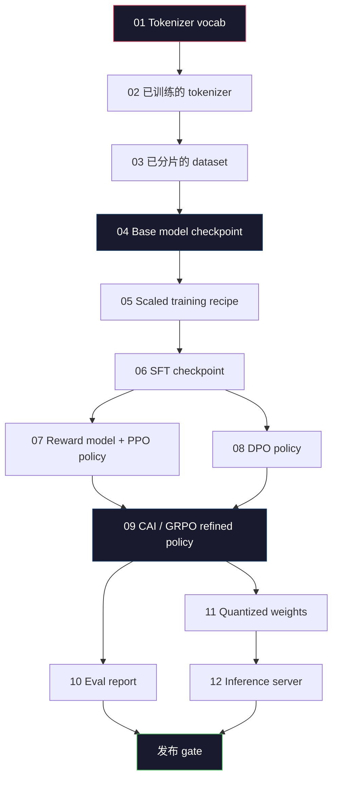
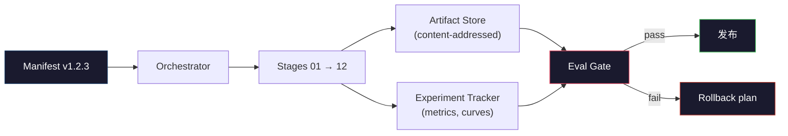

# Construire un pipeline complet de LLM

> Les leçons 01 à 12 contiennent tous les éléments de la même pipeline. La première partie consiste à transformer ces étapes en un script script de travail de bout en bout:tokenize,pre-train,scale,SFT,align,évaluer,quantifier,servir. Vous ne serez pas entraîné sur un ordinateur portable à un modèle 70B. Vous sortirez de la couche d'orchestration,manifest,port et un plan de retour, c'est-à-dire l'équipe frontalière de 2026 utilisera ce qui peut être publié.

**Type:** Build
**Languages:** Python (stdlib)
**Prerequisites:** All Phase 10 lessons 01-12
**Time:** ~120 minutes

## Objectif de l'apprentissage
- Pour les autres, il est nécessaire de mettre en place des systèmes de gestion de données et de gestion de données.
- définir les contrats d'artisanat entre les différentes étapes: chaque étape consomme quoi, produit quoi, ainsi que la phase suivante comment vérifier l'entrée
- construire un orchestrateur, pour suivre les expériences pour les objets  effectuer le hachage, et sur la base des seuils d'évaluation décider si le gate est adopté
- Design rollback plan: quels objets recharger coût faible, quels coût élevé, ainsi qu'un point de contrôle détérioré

##  problématique
Le système de calcul de la valeur de l'information est un système de calcul de la valeur de l'information. Le système de calcul de la valeur de l'information est un système de calcul de la valeur de l'information.

La course de formation frontalière n'est pas un ordinateur portable. Llama 3 405B a pris environ 30 millions d'heures H100, a duré environ 54 天. DeepSeek-V3 a utilisé environ 2,8 millions d'heures H800.

C'est la pierre angulaire. Vous ne serez pas en train de faire le tour du pipeline. Vous écrirez le coordonnateur de chaque étape, décrirez le manifeste de cette opération, déciderez de publier le vérificateur de la porte, et vous permettrez à un tiers de réutiliser votre travail à partir d'un seul document.

Ce modèle de 100M à 1T paramètres sont inchangés. Les quatre mêmes composants - manifesteur, orchestrateur, porte égale, magasin d'artifacts - sont déjà en mesure de fonctionner Llama 3, peuvent également fonctionner votre GPT résiduel. La différence réside dans la taille numérique de chaque étape de configuration, plutôt que dans la forme du pipeline.

## 概念
### Les douze étapes

Chaque épisode de la phase 10 est un épisode.



Les modifications apportées au processus de mise en œuvre de la mise en œuvre de la mise en œuvre de la mise en œuvre de la mise en œuvre de la mise en œuvre de la mise en œuvre de la mise en œuvre de la mise en œuvre de la mise en œuvre de la mise en œuvre de la mise en œuvre de la mise en œuvre de la mise en œuvre de la mise en œuvre de la mise en œuvre de la mise en œuvre de la mise en œuvre de la mise en œuvre de la mise en œuvre de la mise en œuvre de la mise en œuvre de la mise en œuvre de la mise en œuvre de la mise en œuvre de la mise en œuvre de la mise en œuvre de la mise en œuvre de la mise en œuvre de la mise en œuvre de la mise en œuvre de la mise en œuvre de la mise en œuvre de la mise en œuvre de la mise en œuvre de la mise en œuvre de la mise en œuvre de la mise en œuvre de la mise en œuvre de la mise en œuvre de la mise en œuvre de la mise en œuvre de la mise en œuvre de la mise en œuvre de la mise en œuvre de la mise en œuvre de la mise en œuvre de la mise en œuvre de la mise en œuvre de la mise en œuvre de la mise en œuvre de la mise en œuvre de la mise en œuvre de la mise en œuvre de la mise en œuvre de la mise en œuvre de la mise en œuvre de la mise en œuvre de la mise en œuvre de la mise en œuvre de la mise en œuvre de la mise en œuvre de mise en œuvre de la mise en œuvre de la mise en œuvre de la mise en œuvre de la mise en œuvre de la mise en œuvre de la mise en œuvre de la mise en œuvre de mise en œuvre de la mise en œuvre de la mise en œuvre de mise en mise en mise en mise en mise en mise en mise en mise en mise en mise en mise en mise en mise en mise en mise en mise en mise en mise en mise en mise en mise en mise en mise en mise en mise en mise en mise en mise en mise en mise en mise en mise en mise en mise en mise en mise en mise en mise en mise en mise en mise en mise en mise en mise en mise en mise en mise en mise en mise en mise en mise en mise en mise en mise en mise en mise en mise en mise en mise en mise en mise en mise en mise en mise en mise en mise en mise en mise en mise en mise en

### Le manifeste

Le manifeste est un seul document, il doit être complet pour une description d'une seule opération suffisamment complète pour être reproduite. Tout contenu qui se produit dans la pipeline ne doit pas dépendre de l'état extérieur du manifeste.

```
pipeline_version: 1.2.3
seed: 42
git_commit: a1b2c3d4
stages:
  01_tokenizer:
    recipe: bpe_32k
    input_hash: sha256:...
    output_hash: sha256:...
    wall_clock_sec: 3600
    cost_usd: 12
```

阶段 N's output hash 阶段 N+1's input hash ︎. Si il y a un décalage, le pipeline s'arrête. ︎ C'est la façon dont vous découvrez la corruption des données dès que possible. ︎ C'est aussi la façon dont les amis de l'équipe sur différents continents vérifient si leur répétition a produit le même artefact que vous.

En pratique, le groupe utilise un petit schéma YAML, avec un vérificateur manifeste, pour effectuer une différence avec la dernière opération réussie.

### Tapeur d'objets

Chaque étape est une sortie d'un artefact typé. Ce n'est pas une boucle de catalogue, mais un type de nom de schéma connu.

| Stage | Artifact Type | Key Fields |
|-------|--------------|-----------|
| 01-02 | Tokenizer | vocab.json, merges.txt, config.json, hash |
| 03 | Dataset | shards[], row count, token count, dedup stats |
| 04-05 | Checkpoint | weights.safetensors, config.json, optimizer state, step count |
| 06 | SFT Model | checkpoint + SFT recipe + data mix |
| 07 | Reward Model | RM checkpoint + preference data hash |
| 08-09 | Policy | checkpoint + reference hash + beta + KL budget consumed |
| 10 | Eval Report | benchmark scores + regression diffs + eval data hash |
| 11 | Quantized Model | quantized weights + calibration data + accuracy delta vs FP16 |
| 12 | Server Spec | endpoint + model hash + config + observability hooks |

Typage 能防止最常见的失败模式:把阶段 08 的输出当成阶段 06 的输入,通过SFT 路径发布一个DPO 训练过的模型――Typed artefacts和 typed stage signatures 会让这些错误变成编译时失败,而不是第五天才发现的失败――

### La porte d'Eval

发布不是培训完成──发布是培训完成和评估门通过──门 在运行开始前就定义好──

```
gates:
  mmlu:      >= baseline + 0.5   # 无 regression
  humaneval: >= baseline + 1.0
  truthfulqa: >= baseline         # 无下降
  safety_refusal_rate: <= 0.05
  kl_from_reference: <= 25.0
  cost_total_usd: <= 50000
```

Chaque porte est un seuil numérique. Il n'y a pas de porte qui semble être bonne. Il n'y a pas de signature de type. Si toutes les portes passent, l'artisanat sera marqué comme expéditable. Si une porte échoue, cette opération sera retenue.

两个门 能抓住大多数灾难──*Régression* gate(新模型在核心基准上必须至少和之前一样好) 能抓住培训 bugs──*KL budget* gate(aligned policy 偏离参考程度不能超过X) 能抓住alignment 过度加工──每个生产管道都同时拥有这两者──

### L'orchestre

Ceci est un petit code, lire le manifeste, les étapes de dépêche, suivre les objets et toute violation de contrat, et c'est arrêter. Ceci n'est pas Airflow.

Les responsabilités de l'orchestre sont très rares:

1. De l'expression 解析 DAG。
2. Pour chaque étape, le contrôle pré-expérience de sortie est de savoir si le hash est correctement existant (si il existe, il est passé).
3. 运行该阶段, capture stdout/stderr, mesure du mur de l'horloge 和 coût
4. 根据下游阶段预期的输入哈希 验证输出哈希──
5. 失败时, write in conténté précisément le manifeste partiel de la phase de défaillance,并以非零状态退出──

C'est environ 200 pages Python. Ça ressemble à ce que j'ai lu dans cette classe.`code/main.py`文件──底层真实管道 会使用 `torchrun`Ou `ray`Dans les groupes, il exécute chaque étape, mais l'orchestre se déplace en un seul appareil.

### Tracking expérimental et stockage d'objets

Deux systèmes externes sont en train de se développer.

**Experiment tracker (wandb, neptune, mlflow).**按阶段记录损失曲线、eval metrics、system telemetry──当你三周后需要比较运行 A 和运行 B 时,tracker就是你查看的地方──团队几乎总是使用主机追踪器──自写会浪费本应用于训练时间──

**Artifact store (S3, R2, GCS).**Utilisé pour les points de contrôle, les ensembles de données, les jetons, les rapports évalus de stockage d'objets immuables.`latest.pt`Ce nom de fichier est pied-arme;`ckpt-7b-step-20000-sha256:abc123.safetensors`C'est un contrat.

Orchestrator 会同时写入二者──Tracker 面向看图片 的人──Artifact store 面向需要查找输入的下一个阶段──

### Coût

La course frontalière est liée à un numéro de dollar.

**Pre-run estimate.**De l'exemple  calculé les FLOP attendus  pré-entraînement: 6 x paramètres x jetons)  heures de GPU attendues  FLOP / débit / utilisation maximal), ainsi que le taux de location 计算  prix en dollars

**In-run tracking.**阶段的墙钟和成本会记录到表――每阶段之后,都会检查剩余预算――如果某阶段超支,下一阶段的门将使用新的剩余预算――进行评估――你不会等到VC打电话才发现钱已经用完了――

Llama 3  rapport du coût est $61M。DeepSeek-V3 报告 main pre-training run 为 $5.6M. Ce ratio provient principalement de l'efficacité matérielle et d'un mélange d'experts - mais le coût spécifique est donc visible, car les deux équipes suivent les étapes, et non seulement la durée de la course.

### La reproductibilité par rapport au déterminisme

Deuxièmement, différent. *Reproduitable* signifie le même manifeste, le même code, la même infrastructure, produira un point de contrôle dans les métriques en aval de la valeur supérieure.

La formation moderne de LLM est reproduisable, mais pas déterministe. La formation distribuée de la réduction de l'ordre, du non-déterminisme du noyau GPU, ainsi que le rondeur de précision mixte, produisent ensemble des opérations entre des floats de 1e à 5 dimensions différentes.



### Plan de retour

Avant de commencer à fonctionner, écrivez ce qui se passe à chaque étape de l'échec.

- **重新运行成本低**(heures):tokenizer、eval、quantification、serveur d'inferences。
- **中等成本**(jours):SFT、DPO、CAI。 conserver le modèle de base;
- **成本高**(semnies et plusieurs millions de dollars): pré-entraînement. Le plan de relance n'est pas de re-courir.

Parce que les dépendances de scène sont typées et hachées, l'orchestre peut automatiquement calculer le décalage: faire défaut de phase et tous ses descendants 失效.

### Récipes de production observées en 2026

La plupart des équipes frontalières ont reçu le même squelette.

- Tokenizer:128k BPE avec byte fallback── basé sur la taille de la tranche multilingue de l'équilibre
- Pré-entraînement: 10-20T tokens, principalement par le code web 加加合成 组成──Muon 或 AdamW optimisateur──FSDP2 或 DeepSpeed ZeRO-3──Gradient checkpointing──BF16 poids,FP32 maître──
- SFT:500k-2M paires d'instructions, mixte humaine et synthétique,并严格对 eval set做 dedup──
- L'alignement: DPO ou CAI + GRPO  seulement dans le signal de préférence pour le DPO pour la mesure de la quantité de temps utilisée RLHF 
- Eval: MMLU-Pro、MATH、HumanEval+、GPQA、SWE-Bench Verifié、LiveBench, plus un ensemble privé tenu public 永远看不到的
- Quantification:service utilisation GPTQ ou AWQ de 4 bits; précision des détachements  évaluations de sécurité importantes utilisation de 8 bits。
- Servir: vLLM、TensorRT-LLM 或 en interne──partie continue──Décodage spéculatif──KV évacuation cache──

Le nombre change tous les six mois.


```figure
beam-search
```

## - Je le construis.
Le code de chaque étape est un contrôleur d'orchestration et de manifeste, et non pas 12 scripts de formation.

完整实现见 `code/main.py`❖ Une partie clé:

- `Manifest`Les données de la classe: version du pipeline, semence, commande, étapes, portes.
- `Stage`classe de données:nom,type,entrée,hashes,sortie,hashes,horloge murale,coût
- `Orchestrator.run()`: résoudre les étapes de dépêche, les hashes de test, le manifeste de mise à jour.
- `EvalGate.check()`: Read取 thresholds、与最新évaluation rapport比较、回归通过/失败──
- `ArtifactStore`(en mémoire): selon le hash put/get,模拟 S3。
- `CostTracker`Le coût de l'exploitation est de plus de 0,5% par étape et de plus de 0,5% par période.

`main.py`Le pipeline central va fonctionner en 12 étapes de placeholder, générer un manifeste, et présenter une porte d'évaluation ratée, pour montrer la façon dont il a été exécuté.

## Utilisez-le
Le flux de travail canonique a trois commandes:

```
python code/main.py plan    # 验证 manifest，计算 cost estimate，打印 DAG
python code/main.py run     # 执行 stages，写入 manifest.out.yaml
python code/main.py gate    # 读取 manifest.out.yaml，应用 eval gates，ship-or-hold
```

Chaque fois que tu fais le travail`plan`◊ La plupart des bugs de pipeline 会在计划时间 出现 -- 缺失门门, hashes stables、预算过剩──运行`plan`Il est gratuit.`run`C'est très cher. On peut en tirer de l'argent.

`gate`De la production ou de la production`SHIP`- Je suis là .`HOLD: <reason>`❖ La course a été menée non pas pour échouer; c'est un point de décision ❖••••••••••••••••••••••••••••••••••••••••••••••••••••••••••••••••••••••••••••••••••••••••••••••••••••••••••••••••••••••••••••••••••••••••••••••••••••••••••••••••••••••••••••••••••••••••••••••••••••••••••••••••••••••••••••••••••••••••••••••••••••••••••••••••••••••••••••••••••••••••••••••••••••••••••••••••••••••••••••••••••••••••••••••••••••••••••••••••••••••••••••••••••••••••••••••••••••••••••••••••••••••••••••••••••••••••••••••••••••••••••••••••••••••••••••••••••••••••••••••••••••••

## Je le livre.
本课会产出 `outputs/skill-llm-pipeline-reviewer.md` Donner un manifeste de pipeline proposé  lui donner, il examinera tous les contrats: tapage de phase  chaîne de hachage  portes  plan de retour  estimation des coûts  Pour l'absence de passerelle d'évaluation  budget KL sans frontières, ou la mise en œuvre de données d'évaluation et de formation mixtes, il refusera d'approuver le manifeste 

## 练习
1. 扩展管弦乐器,让它支持阶段 07 和 08 的并行执行──使用 stdlib `concurrent.futures`Le module confirme le manifeste final enregistre les sorties de deux étapes et le hash d'entrée de la phase 09 est la combinaison déterministe des deux.

2. 添加一个污染检查门──给定 eval dataset hash 和 training dataset shards,计算重叠(exact match string 或 13-gram match)──如果重叠 超过0.1%,gate 失败──进入一个被污染的训练集,并确认门将举行 这次运行──

3. À partir de premiers principes  réaliser un estimateur de coûts  Pour la phase 04  pré-entraînement), les FLOP    évalueront 6 x params x tokens, supposer H100  BF16  989 TFLOPs, MFU  utilisation des FLOP de modèle)  40%, prix 2,50 $/GPU-heure  rapport un estimation du modèle 7B de la formation  avec public Llama 2 

4. 构建部分滚倒――模拟阶段 09(CAI) fail, puis en conservant 01-08 caché dans le cas de la réécration 阶段 09 à 12──Orchestrator 应通过哈希检查 检查缓存文物并跳过它们──测量与完整重新运行相比省的墙-钟──

5. 添加可观性──发发发 OpenTelemetry spans, attributs comprenant les paramètres, les jetons vus、perte 和 cost──将 spans 管道传到本地收藏器──重点不是仪表板;重点是每个阶段的健康 都能通过单个追踪ID 追踪──

## 关键术语
| Term | What people say | What it actually means |
|------|----------------|----------------------|
| Manifest | “recipe file” | 描述 pipeline version、seed、per-stage config 和 gate thresholds 的 YAML 或 JSON，足以 replay 一次 run |
| Content-addressed | “按 hash 而不是 name” | Artifacts 按其内容的 SHA-256 存储，因此你永远不会把 version A 和 version B 混淆 |
| Eval gate | “发布标准” | Benchmark metrics 和 safety scores 上的 numeric thresholds，必须通过后 artifact 才会被标记为 shippable |
| KL budget | “alignment drifted 有多远” | 对 alignment stages 上累计 KL(policy || reference) 的 cap，并作为 gate 强制执行 |
| MFU | “你用了多少 GPU” | Model FLOPs Utilization，即 achieved FLOPs 除以 theoretical peak。70B scale 典型值为 40%，7B 为 55% |
| Rollback plan | “出问题时我们做什么” | 每个阶段失败时预先写好的 actions：re-run、fall back、使用修订后的 inputs retrain |
| Orchestrator | “conductor” | 读取 manifest、dispatch stages、验证 hashes，并在任何 contract violation 时停止的 process |
| Artifact store | “用于 weights 的 versioned S3” | Immutable content-addressed object store，是 checkpoints、datasets、eval reports 的 single source of truth |
| Reproducible | “Replay 时 metrics 相同” | Bit-level weights 不同但 downstream metrics 等价，这是 distributed LLM training 的现实目标 |
| Cost gate | “不能超过 X” | Pre-run cost estimate 加 in-run tracker；如果 estimate 超过 budget，pipeline 会拒绝启动 |

## 延伸阅读
- [Dubey et al., 2024 -- "The Llama 3 Herd of Models"](https://arxiv.org/abs/2407.21783)- la définition de la ligne de gaz à frontière, la plus détaillée, couvrant les données, la formation, l'alignement, l'évalua­tion
- [DeepSeek-AI, 2024 -- "DeepSeek-V3 Technical Report"](https://arxiv.org/abs/2412.19437)-- pour un pipeline prioritaire de l'efficacité, le coût est d'environ 1/10 de la formation de la classe Llama 3
- [Kaplan et al., 2020 -- "Scaling Laws for Neural Language Models"](https://arxiv.org/abs/2001.08361)-- la relation d'échelle initiale entre calcul et paramètres de données
- [Hoffmann et al., 2022 -- "Training Compute-Optimal Large Language Models (Chinchilla)"](https://arxiv.org/abs/2203.15556)-- à la modification de Kaplan, la réécriture des budgets modernes de données
- [PyTorch FSDP2 documentation](https://pytorch.org/docs/stable/fsdp.html)-- dans PyTorch 2.4+ 中替代 FSDP1 de formation distribuée primitive
- [Weights & Biases LLM Reports](https://wandb.ai/site/llms)-- L'expérience de suivi de la gestion de la gestion de la gestion de données est en cours de réalisation.
