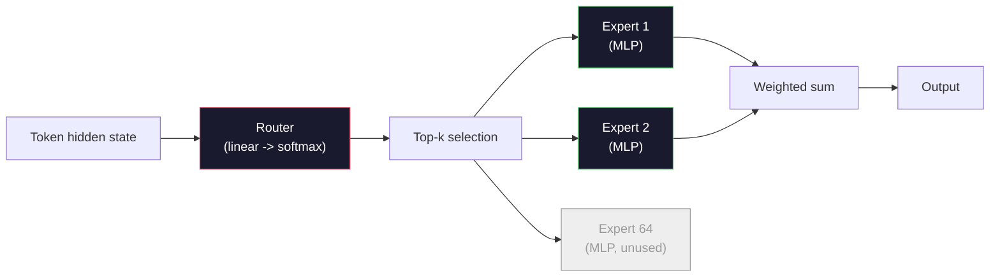

# Modèles ouverts: 架构讲解

> Vous êtes en train de construire un modèle ouvert de GPT-2 Small──2026 ans de l'avant-garde  belongs à la même famille, il y a seulement cinq et six changements spécifiques──utiliser RMSNorm 取代 LayerNorm──utiliser SwiGLU 取代 GELU──utiliser RoPE 取代学会的位置──utiliser GQA或 MLA 取代完整的MHA──utiliser à grande échelle Mix-of-Experts──vous avez déjà maîtrisé les mathématiques qui couvrent 95% de ces modèles──本会并排阅读 Llama 3、DeepSeek-V3、Mixtral、Qwen 和 Gemma,并指出每一个架构发生分歧的确切位置──

**Type:** Learn
**Languages:** Python (stdlib)
**Prerequisites:** Phase 10, Lessons 04, 05, 12 (Pre-training, Scaling, Inference)
**Time:** ~45 minutes

## Objectif de l'apprentissage
- 阅读 Llama 3、Mistral、Mixtral、Gemma 2、Qwen 2.5 和 DeepSeek-V3 的 config.json,并解释每一个字段
- Pour chaque modèle par rapport au GPT-2, les modifications spécifiques apportées à l'architecture sont considérées comme des raisons de la première nature.
- basé uniquement sur la configuration  calculer le modèle ouvert arbitrary  KV cache
- En définissant la latence, la mémoire et la capacité, choisissez un modèle ouvert adapté à l'objectif de déploiement

##  problématique
Dans la 4e classe, vous avez écrit 350 numpy, obtenu un modèle en forme de GPT-2 La Llama 3 405B a un rapport technique de 200 pages. Votre intuition pourrait penser qu'ils sont des espèces différentes. En fait, ce n'est pas la même chose. Ces 200 pages décrivent le même objet, il y a seulement cinq ou six modifications explicites, en plus de nombreuses détails concernant l'évolutivité de l'échelle.

Pour chaque modèle ouvert familial, nous allons précisément le classer par rapport au GPT-2 改了什么,为什么改了,代价是什么. Après avoir terminé, vous pouvez lire une nouvelle carte modèle et la traduire en tête.

Le résultat réel est que lorsque Meta lance Llama 5, ou DeepSeek lance V4, vous n'avez pas besoin de nouveaux modèles de pensée. Vous allez consulter le config, voir quelles sont les différentes formes de connaissance qui ont été modifiées, puis savoir ce que l'impact est.

## 概念
### Le noyau invariable

Tous les modèles ouverts autorégressifs sont partagés:

- Les symboles de l'emballage de matrice ((vocab_size x hidden_dim) ").
- N 个 décodage blocs de la compostage:norme, auto-attention, résiduel, norme, MLP, résiduel
- La tête linéaire de la taille du vocab est généralement liée par poids aux emblèmes.
- Masque de causalité, perte de l'entropie croisée suivante.

C'est la forme. Le reste est le tour.

### Les six boutons qui fonctionnent vraiment

Dans tous les modèles ouverts de la première ligne de 2024-2026, six modèles de conception sont également répertoriés:

1. **Normalization.**LayerNorm -> RMSNorm。
2. **Positional encoding.**J'ai appris à être absolue.
3. **Activation.**GELU -> SwiGLU(or GEGLU)
4. **Attention head sharing.**MHA -> GQA -> MQA -> MLA。
5. **Dense vs sparse MLP.**Dens -> Mixte d'experts
6. **Pre-norm placement.**保持 Pre-norme──Post-norme 已消失──

Toutes les autres choses (l'échéancier du taux d'apprentissage, le mix de données, la taille du lot, la longueur du contexte) appartiennent à la configuration de formation, et non à la structure.

### Nœud 1: RMSNorm

LayerNorm va réduire la valeur moyenne, en déduisant le std, en réduisant le déplacement et en réduisant le placement.

```
RMSNorm(x) = x / sqrt(mean(x^2) + eps) * gamma
```

没有均值消除──没有偏见──每个代币少一次 matmul──Zhang and Sennrich (2019) 认为它在机器翻译上可以匹配LayerNorm,同时快 10%──所有现代开放模型都使用它──

代价:没有──收益:小幅吞吐量 提升,代码更简单──

### Nœud 2: RoPE

Les emboîtrements de position apprises dans le GPT-2 sont un 1024 槽位的查找表.

En 2021, chaque vecteur Q et K se déplace en fonction de la dimension de la position. Il n'y a donc pas de fonction de détermination de la position, donc il n'y a pas besoin d'apprendre, ni de consommer tout.

```
q_rotated = rotate(q, angle(pos))
k_rotated = rotate(k, angle(pos))
score = q_rotated . k_rotated
```

Chaque Llama, Mistral, Quwen, DeepSeek et Gemma utilise RoPE.

### Nœud 3: SwiGLU

Le MLP du GPT-2 est`x -> gelu(xW1 + b1) -> (...)W2 + b2`──SwiGLU(Shazeer 2020) avec activation de produit fermé:

```
SwiGLU(x) = (xW1) * sigmoid(xW1) * xV
```

两个并行投影, et non un, est effectué par l'activation Swish. 实证上, it in per parameter perplexity 上更强。 Llama 2 l'a adopté, puis tout le monde a suivi.`ff_dim = 4 * hidden`,SwiGLU Utilisation `ff_dim = (2/3) * 4 * hidden = 8/3 * hidden`Il y a une autre.

### Nœud 4: Partage de la tête d'attention

GPT-2 使用 **Multi-Head Attention (MHA)**Chaque tête a sa propre projection Q, K, V.

**Multi-Query Attention (MQA, Shazeer 2019)**Dans tous les cas, la mise en cache KV est réduite en fonction du nombre de têtes, sur le modèle typique, c'est une baisse de 12x à 32x.

**Grouped-Query Attention (GQA, Ainslie et al. 2023)**C'est le moyen de l'élaboration: G 组 Q heads 共享一个 K 和一个 V。Llama 3 8B 使用 GQA, comprenant 32 个 Q heads 和 8 个 KV heads(G=8), donc相比较完整MHA,KV cache 缩小4x。

**Multi-Head Latent Attention (MLA, DeepSeek 2024)**Pour réduire la capacité de K et V à la latence de faible rang de partage, il est nécessaire de re-presser la tête 投影回去── il réduit encore la cache KV, tout en conservant la capacité d'expression de chaque tête──DeepSeek-V2 和 V3 dépend de la performance de long-context ⋅

| Scheme | KV Heads | KV Cache | Accuracy |
|--------|----------|----------|----------|
| MHA    | num_heads | full | 最好 |
| GQA    | num_groups (G < num_heads) | num_heads / G 缩减 | 接近 MHA |
| MQA    | 1 | num_heads 缩减 | 小幅损失 |
| MLA    | latent, per-head decompression | 小于 MQA | 接近 MHA |

Pour tout modèle de plus de 13B, GQA ou MLA sont en fait indispensables.

### Nœud 5: mélange d'experts

Le MLP dense sera utilisé pour chaque token  activer tous les paramètres。 MoE MLP dans chaque bloc a des experts K 个, ainsi qu'un routeur, il choisit des experts top-k pour chaque token  (généralement top-2)。 Seulement les poids de ces experts seront utilisés pour ce token  exécuter le passage à l'avant。

```
router_logits = xW_r
indices, weights = top_k(router_logits, k=2)
output = sum_i weights[i] * expert[indices[i]](x)
```

L'attraction est: vous pouvez avoir 64 个个个个个个个个个个个个个个个个个个个个个个个个个个个个个个个个个个个个个个个个个个个个个个个个个个个个个个个个个个个个个个个个个个个个个个个个个个个个个个个个个个个个个个个个个个个个个个个个个个个个个个个个个个个个个个个个个个个个个个个个个个个个个个个个个个个个个个个个个个个个个个个个个个个个个个个个个个个个个个个个个个个个个个个个个个个个个个个个个个个个个个个个个个个个个个个个个个个个个个个个个个个个个个个个个个个个个个个个个个个个个个个个个个个个个个个个个个个个个个个个个个个个个个个个个个个个个个个个个个个个个个个个个个个个个个个个个个个个个个个个个个个个个个个个个个个个个个个个个个个个个个个个个个个个个个个个个个个个个个个个个个个个个个个个个个个个个个个个个个个个个个个个个个个个个个个个个个个个个个个个个个个个个个个个个个个个个个个个个个个个个个个个个个个个个个个个个个个个个个个个个个个个个个个个个个个个个个个个个个个个个个个个个个个个个个个个个个个个个个个个个个个个个个个个个个个个个个个个个个个个个个个个个个个个个个个个个个个个个个个个个个个个个个个个个个个个个个个个个个



优点: le même calcul 更多参数 更多强容量──缺点:expert memory 仍然必须放在某处(((((((((((((((((((((((((((((((((((((((((((((((((((((((((((((((((((((((((((((((((((((((((((((((((((((((((((((((((((((((((((((((((((((((((((((((((((((((((((((((((((((((((((((((((((((((((((((((((((((((((((((((((((((((((((((((((((((((((((((((((((((((((((((((((((((((((((((((((((((((((((((((((((((((((((((((((((((((((((((((((((((((((((((((((((((((((((((((((((((((((((((((((((((((((((((((((((((((((((((((((((((((((((((((((((((((((((((((((((((((((((((((((((((((((((((((((((((((((((((((((

### Nœud 6: Reste pré-normaire

Depuis GPT-2, chaque modèle ouvert l'a mis dans chaque sous-couche * avant*♦ Avant-norme en formation à niveau profond est plus facile♦ sans litige♦

### Différence modèle par modèle

Le tableau ci-dessous met en évidence tout le contenu.

| Model | Year | Total Params | Active Params | Norm | Activation | Position | Attention | MoE | Context |
|-------|------|-------------|---------------|------|-----------|----------|-----------|-----|---------|
| GPT-2 Small | 2019 | 124M | 124M | LayerNorm | GELU | Learned | MHA (12 heads) | no | 1k |
| Llama 3 8B | 2024 | 8B | 8B | RMSNorm | SwiGLU | RoPE | GQA (32/8) | no | 128k |
| Llama 3 70B | 2024 | 70B | 70B | RMSNorm | SwiGLU | RoPE | GQA (64/8) | no | 128k |
| Llama 3 405B | 2024 | 405B | 405B | RMSNorm | SwiGLU | RoPE | GQA (128/16) | no | 128k |
| Mistral 7B | 2023 | 7.2B | 7.2B | RMSNorm | SwiGLU | RoPE | GQA | no | 32k |
| Mixtral 8x7B | 2023 | 47B | 13B | RMSNorm | SwiGLU | RoPE | GQA | yes (8 experts, top-2) | 32k |
| Gemma 2 9B | 2024 | 9B | 9B | RMSNorm (pre+post) | GeGLU | RoPE + sliding | GQA | no | 8k |
| Qwen 2.5 72B | 2024 | 72B | 72B | RMSNorm | SwiGLU | RoPE (YaRN) | GQA (64/8) | no | 128k |
| DeepSeek V2 236B | 2024 | 236B | 21B | RMSNorm | SwiGLU | RoPE | MLA | yes (160 experts, top-6) | 128k |
| DeepSeek V3 | 2024 | 671B | 37B | RMSNorm | SwiGLU | RoPE | MLA | yes (256 experts, top-8) | 128k |

扫描这些列──RMSNorm est courant──SwiGLU ou son GeGLU 近亲是通用──RoPE est courant──7B以上 GQA est courant, sauf si MLA 替代──MoE est le différentiel du modèle du haut-mètre──

### Je lis une config.json

Llama 3 8B configuration:

```
{
  "hidden_size": 4096,
  "intermediate_size": 14336,
  "num_hidden_layers": 32,
  "num_attention_heads": 32,
  "num_key_value_heads": 8,
  "max_position_embeddings": 131072,
  "rope_theta": 500000.0,
  "rms_norm_eps": 1e-5,
  "vocab_size": 128256
}
```

Chaque épisode est à la hauteur de ce que vous avez accompli.

- `hidden_size`: dimension d'intégration
- `intermediate_size`: MLP taille cachée(3,5x cachée -- SwiGLU 数学)
- `num_hidden_layers`: profondeur de pile
- `num_attention_heads`: Q têtes
- `num_key_value_heads`: Chefs de véhicule électrique
- `max_position_embeddings`: longueur du contexte de formation
- `rope_theta`: fréquence de base de la RoPE。Meta la transférera de l'échelle 10k à 500k par défaut, pour l'extrapolation dans un contexte long。
- `rms_norm_eps`: stabilité numérique,
- `vocab_size`: des jetons

 Avec ces éléments, vous pouvez calculer la totalité de paramètres  KV cache et la mémoire d'activation de la valeur maximale `code/main.py`Il y a une autre.

### Budget de mémoire d'activation

Après avoir dépassé plusieurs milliards de paramètres, les activations seront gérées par la mémoire de formation.

```
activation_mem ~ batch_size * seq_len * hidden_size * num_layers * bytes_per_element
```

Pour les Llama 3 8B, dans le lot 1 、seq 8192、BF16、32 couches、escrits 4096 时: seulement des activations 就大约需要8 GB(使用检查点),不使用则约40 GB──这就是闪光注意和环注重点原因:它们重写注意计算,让激活能够放下──

### Budget de KV Cache

 Pour le contexte max:

```
kv_cache = 2 * num_layers * num_kv_heads * head_dim * max_seq_len * bytes_per_element
```

Llama 3 8B dans le contexte 128k ≈ BF16 ≈ tête_dim = cachée / num_heads = 128 时:
`2 * 32 * 8 * 128 * 131072 * 2 = 17.2 GB`Chaque séquence.

Les poids 8B dans le BF16 sont de 16 Go. Le seul cache KV de 128K de séquence est plus grand que les poids.

### Quand chaque modèle gagne

- **单张 80GB GPU，无 MoE**Llama 3 8B、Mistral 7B、Gemma 2 9B。 facile à servir, outillage 广泛。
- **单节点（8x80GB），大 capacity**Llama 3 70B、Qwen 2,5 72B― la plus haute capacité d'ouverture dense―
- **最大的 open capability，可接受 MoE 复杂度**: Profonde recherche V3、Mixtral 8x22B― pour chaque FLOP actif
- **Long-context 需求**Llama 3 (à travers l'échelle RoPE) atteint 128k)
- **Low-latency serving**:Gemma 2 9B(fenêtre coulissante 降低 calcul à long contexte)


```figure
rmsnorm-vs-layernorm
```

## - Je le construis.
Le code de cette classe est un calculateur. Donné à configurer.json, il imprime selon le paramètre de la composition divisée en paramètres, le contexte maximal, le cache KV, le ratio MLP SwiGLU, ainsi qu'un court jugement sur l'architecture.

```python
config = {
    "hidden_size": 4096, "intermediate_size": 14336,
    "num_hidden_layers": 32, "num_attention_heads": 32,
    "num_key_value_heads": 8, "vocab_size": 128256,
    "max_position_embeddings": 131072,
}
```

脚本会逐字段遍历架构,计算嵌入、attention(带 GQA reduction)、MLP(带 SwiGLU expansion)、layernorms 和 head 的参数量──然后它会根据给定的语境长度计算 KV cache,并打印总结──

实现见 `code/main.py`Il y a une autre.

## Utilisez-le
运行计算器, using script bound Llama 3 8B、Mistral 7B、Mixtral 8x7B 和 DeepSeek V3 configurations。 comparer les paramètres décomposés。 note Le nombre total de modèles MoE est très densé, mais le nombre de paramètres actifs est plus petit。 note Le cache KV de DeepSeek V3 虽然总参数更多,但小于 Llama 3 405B 的 KV cache −这是 MLA 的效果──

Ensuite, insérez votre configuration de modèle local, lisez le résumé, et décidez si elle convient à votre GPU.

## Je le livre.
本课会生成 `outputs/skill-open-model-picker.md` déterminer un objectif de déploiement (type GPU, VRAM, longueur de contexte, budget de latence) et une image de tâche (chat, code, raisonnement, long-context), elle proposera un modèle ouvert, un schéma de quantification dans la classe 11, ainsi qu'une pile d'inférence dans la classe 12, et il est évident qu'elle explique les six arguments liés à la structure de rotation.

## 练习
1. De HuggingFace 阅读 Qwen 2.5 72B configuration。 de la valeur de la valeur de la valeur de la valeur de la valeur de la valeur de la valeur de la valeur de la valeur de la valeur de la valeur de la valeur de la valeur de la valeur de la valeur de la valeur de la valeur de la valeur de la valeur de la valeur de la valeur de la valeur de la valeur de la valeur de la valeur de la valeur de la valeur de la valeur de la valeur de la valeur de la valeur de la valeur de la valeur de la valeur de la valeur de la valeur de la valeur de la valeur de la valeur de la valeur de la valeur de la valeur de la valeur de la valeur de la valeur de la valeur de la valeur de la valeur de la valeur de la valeur de la valeur de la valeur de la valeur de la valeur de la valeur de la valeur de la valeur de la valeur de la valeur de la valeur de la valeur de la valeur de la valeur de la valeur de la valeur de la valeur de la valeur de la valeur de la valeur de la valeur de la valeur de la valeur de la valeur de la valeur de la valeur de la valeur de la valeur de la valeur de la valeur de la valeur de la valeur de la valeur de la valeur de la valeur de la valeur de la valeur de la valeur de la valeur de la valeur de la valeur de la valeur de la valeur de la valeur de la valeur de la valeur de la valeur de la valeur de la valeur de la valeur de la valeur de la valeur de la valeur de la valeur de la valeur de la valeur de la valeur de la valeur de la valeur de la valeur de la valeur de la valeur de la valeur de la valeur de la valeur de la valeur de la valeur de la valeur de la valeur de la valeur de la valeur de la valeur de la valeur de la valeur de la valeur de la valeur de la valeur de la valeur de la valeur de la valeur de la valeur de la valeur de la valeur de la valeur de la valeur de la valeur de la valeur de la valeur de la valeur de la valeur de la valeur de la valeur de la valeur de la valeur de la valeur de la valeur de la valeur de la valeur de la valeur de la valeur de la valeur de la valeur de la valeur de la valeur de la valeur de la valeur de la valeur de la valeur de la valeur de la valeur de la valeur de la valeur de la valeur de la valeur de la valeur de la

2. DeepSeek V3 utilise 256 experts, et utilise le top-8 routing, et le ratio des experts activés et des experts totaux, et compare avec le top-2 des 8 de Mixtral 8x7B, de 25% à moins de 3% pour la capacité de chaque FLOP.

3. 計算 Llama 3 405B dans un contexte de 128k 下使用 FP8 和 BF16 时的 KV cache──FP8 est la moitié de la valeur numérique de BF16──在单个8xH100节点上(每张 80GB = 总计 640GB,减重内存),你能服务多少的平行序列?

4. Gemma 2 交替使用全注意 和滑走窗-注意层──当一半层 使用 4096-token滑走窗而不是 full context 时,写出 KV cache 的数学公式──在 8k total context 下能节省多少内存?

5. Trouver un modèle ouvert à court terme à l'avant-garde publié après la fin de la rédaction de ce cours. Identifier lequel de ces six cycles a été choisi, ainsi que s'il a introduit le septième cycle. Le cours apparaît à l'instant où la nouvelle structure est publiée. L'objectif est de renouveler votre tableau sous la prémisse de ne pas reconstruire le modèle mental.

## 关键术语
| Term | What people say | What it actually means |
|------|----------------|----------------------|
| RMSNorm | “没有均值的 LayerNorm” | 只按 root mean square 进行 normalize，并使用 learned scale -- 更便宜且可与 LayerNorm 相比 |
| RoPE | “Rotary positions” | 将每个 Q 和 K Vector 按 2D pairs 旋转，角度取决于 position -- 结合 scaling 技巧可外推到训练长度之外 |
| SwiGLU | “新的 MLP activation” | 带 Swish 的 gated linear unit：`(xW1) * sigmoid(xW1) * xV` -- 是每个 2024+ open model 的标准配置 |
| GQA | “中间路线 attention” | Grouped-Query Attention：G 组 Q heads 共享一个 K 和一个 V head -- 在避免 MQA accuracy 损失的同时缩小 KV cache |
| MLA | “DeepSeek 的 attention” | Multi-Head Latent Attention：将 K/V 压缩到共享 low-rank latent，再按 head 解压 -- 大模型中最小的 KV cache |
| MoE | “Sparse experts” | Mixture of Experts：每个 block 有 N 个 MLPs，router 为每个 Token 选择 top-k -- 巨大的 total params，较小的 active params |
| Top-k routing | “每个 Token 选择 k 个 experts” | Router 为每个 expert 计算分数，并激活最高的 k 个 -- 典型 k 从 2（Mixtral）到 8（DeepSeek） |
| YaRN | “拉伸 RoPE” | Yet another RoPE extension -- 通过插值 rotary angles，在 inference 时将 context 从 8k 扩展到 128k+ |
| Sliding-window attention | “不要 attend to everything” | 每个 Token 只 attend 到最近 W 个 Tokens -- 将 attention cost 限制为每 Token O(W)，用于 Gemma 2 和早期 Mistral |
| Active params | “每个 Token 实际运行的部分” | 对于 MoE models，指每个 Token 会经历 forward pass 的参数量（远小于 total params）-- 决定 per-token FLOPs |

## 延伸阅读
- [Dubey et al., 2024 -- "The Llama 3 Herd of Models"](https://arxiv.org/abs/2407.21783)-- denses Llama 3 familial structure et formation référence
- [DeepSeek-AI, 2024 -- "DeepSeek-V3 Technical Report"](https://arxiv.org/abs/2412.19437)-- MLA plus équilibrage de charge sans perte auxiliaire plus 671B MoE
- [Jiang et al., 2024 -- "Mixtral of Experts"](https://arxiv.org/abs/2401.04088)-- 经典 MoE modèle ouvert 论文
- [Su et al., 2021 -- "RoFormer: Enhanced Transformer with Rotary Position Embedding"](https://arxiv.org/abs/2104.09864)- RoPE 论文
- [Shazeer, 2020 -- "GLU Variants Improve Transformer"](https://arxiv.org/abs/2002.05202)-- SwiGLU、GeGLU 及相关方法
- [Ainslie et al., 2023 -- "GQA: Training Generalized Multi-Query Transformer Models"](https://arxiv.org/abs/2305.13245)-- GQA 论文
- [Gemma 2 Team, 2024 -- "Gemma 2: Improving Open Language Models at a Practical Size"](https://arxiv.org/abs/2408.00118)-- hybride de l'attention pleine+slip, pré+post-norme
- [Qwen Team, 2024 -- "Qwen 2.5 Technical Report"](https://arxiv.org/abs/2412.15115)-- Extension de contexte de la RNY et recettes de formation à long terme
