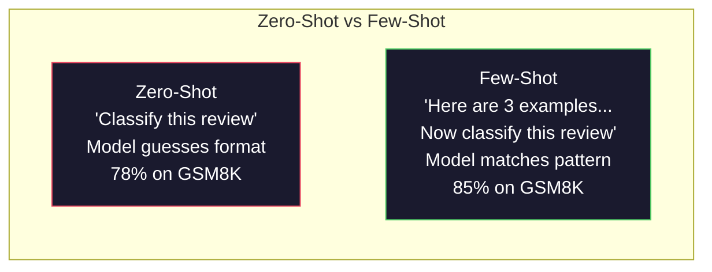
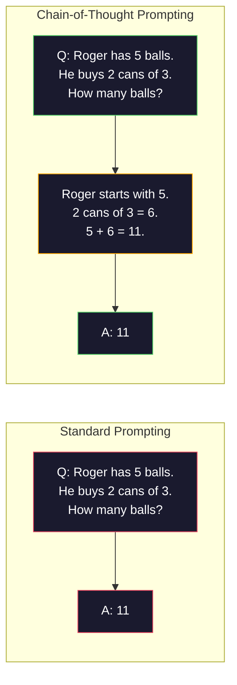
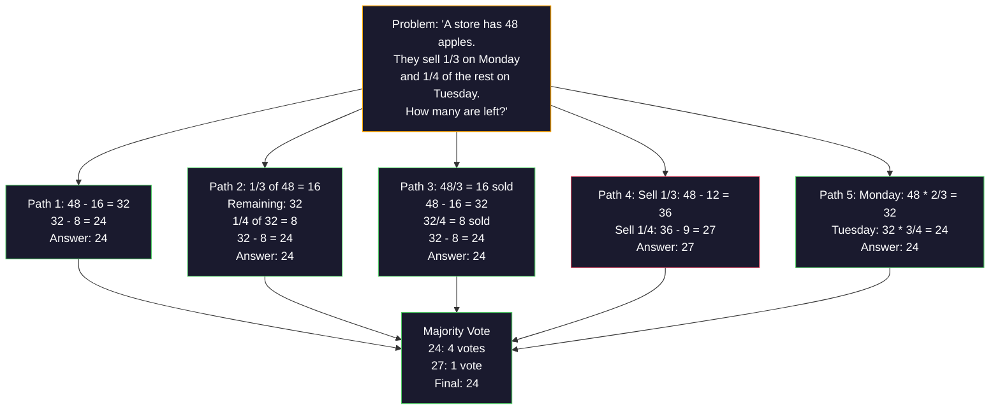
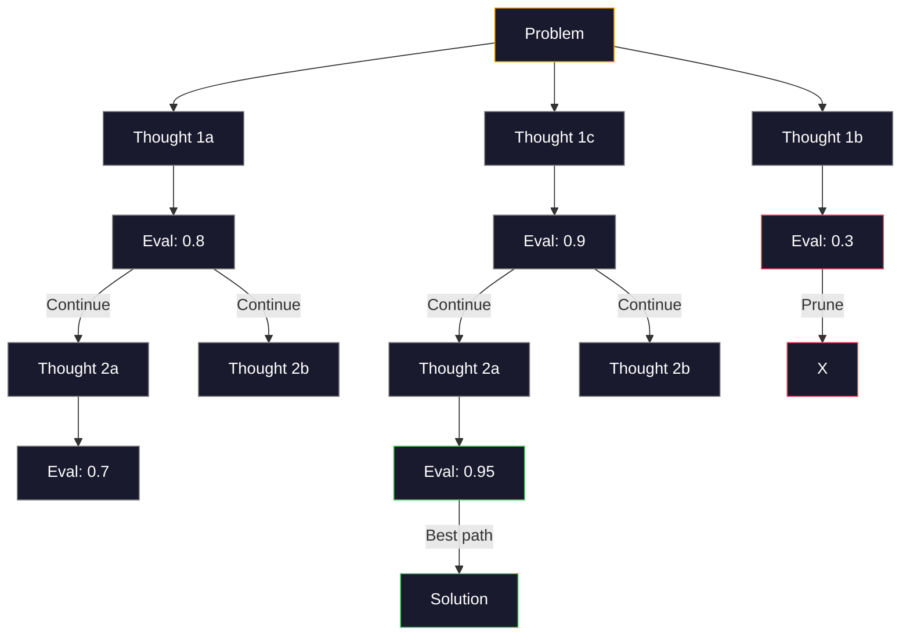

# Quelques coups, une chaîne de pensée, un arbre de pensée.

>  Dites au modèle ce qu'il faut faire  Montrez-lui comment penser  est l'ingénierie  Le même modèle  la même tâche  la même quantité de données, la différence de 78% à 91%  le taux d'exactitude, n'est pas un meilleur modèle, mais une meilleure stratégie de raisonnement

**类型：**Construction
**语言：**Python
**先修要求：**Leçon 11.01 (ingénierie rapide)
**时间：**Il est 45 minutes.

## Objectif de l'apprentissage

-                                                                                                                                                                                                                                                               
- application de la chaîne de pensée (CoT)  recommandation, amélioration des questions d'application mathématique etc.
- Construire un arbre de pensée rapide, explorer plusieurs articles de recommandations et choisir le meilleur chemin
- Dans le cadre de la référence standard, la mesure des céréales zéro-shot, des céréales peu-shot et des CTO a permis d'améliorer le taux de précision

##  problématique

Vous construisez une application de conseil en mathématiques. Votre prompt écrit: Résolvez ce problème de mot. Dans le GSM8K, ce petit standard mathématique, GPT-5 a 94% de temps pour répondre à la question.

On pense pas à pas le taux de précision saute à 91%──en ajoutant quelques exemples avec une solution complète, on peut atteindre 95%──en même modèle──en même température──en même API, la seule différence est que tu as donné le modèle-réseau-papier──

Ceci n'est pas un hack. C'est le travail de la théorie. L'homme ne va pas tout de suite essayer de résoudre le problème de plusieurs étapes. Le transformateur ne va pas non plus. Lorsque vous obligez le modèle à générer des jetons intermédiaires, ces jetons deviendront le suivant.

Mais penser étape par étape  juste le début, pas le bout. Si vous adoptez cinq articles de méthode de débat, puis vous faites la majorité des votes, comment ? si vous faites explorer un arbre de possibilités, évaluer et couper les branches ?

## 核心概念

### Zero-Shot vs Few-Shot: exemple de l'ordre de réussite

La mise en scène de zéro tir ne donne qu'une seule tâche au modèle, à part cela, rien ne donne.

Wei et al. (2022) ont mesuré ce point dans 8 critères de référence. Pour les tâches simples comme les émotions, les tâches zéro-shot et les tâches peu-shot, la différence de performance est de 2% en moyenne. Pour les tâches complexes comme les calculs à plusieurs étapes et les méthodes de calcul, les tâches peu-shot peuvent augmenter le taux de précision de 10 à 25%.

直觉是: exemple est une instruction post-compression. Avec sa description du format de sortie, non comme une démonstration directe. Avec son interprétation du processus de déduction, non comme une démonstration directe.



**few-shot 适合的场景：**Les termes spécifiques dans le domaine des tâches sensibles au format, des catégories, des extractions structurées, ainsi que les tâches qui nécessitent un modèle adapté à un modèle spécifique.

**zero-shot 适合的场景：** simple factual questions  exemples de tâches créatives limitant la créativité, ainsi que de trouver de bons exemples de tâches plus difficiles que de rédiger de bonnes instructions

### Pour le cas échéant, la réponse est:

Il n'y a pas de différence entre les exemples de sélection et de saisie de buts, les exemples de sélection et de saisie de buts sont similaires, et les résultats sont comparables à ceux de sélection aléatoire de 5 à 15% (Liu et coll., 2022):

1. **语义相似性**:选择 Embedding 空间中最接近输入的示例
2. **标签多样性**: exemple pour couvrir toutes les catégories de sorties
3. **难度匹配**: niveau de complexité du problème de l'objectif de correspondance

Pour la plupart des tâches, le nombre d'exemples optimal est de 3-5 ⋅ moins de 3 ⋅ temps, le modèle n'a pas assez de signal de tirage de mode ⋅ plus de 5 ⋅ temps, les bénéfices diminuent, et les pertes de fenêtre de contexte Token ⋅ pour plusieurs étiquettes ⋅ catégories, chaque étiquette utilise un exemple ⋅

### Chaîne de pensée: donner un modèle

La chaîne de pensée (CoT) a été proposée par Google Brain's Wei et al. (2022) ⋅ idée très simple: ne demandez pas seulement le modèle à la réponse, mais demandez-lui d'exprimer les étapes proposées.



Du point de vue du mécanisme, pourquoi est-ce efficace?Transformer chaque jeton produit deviendra le suivant de la jeton. Sans CoT, le modèle doit compresser toutes les hypothèses dans un état caché d'un passage vers l'avant. Avec CoT, le modèle va transformer le calcul intermédiaire en jeton.

**GSM8K benchmark（小学数学，8.5K 道题）：**

| Model | Zero-Shot | Zero-Shot CoT | Few-Shot CoT |
|-------|-----------|---------------|--------------|
| GPT-4o | 78% | 91% | 95% |
| GPT-5 | 94% | 97% | 98% |
| o4-mini (reasoning) | 97% | — | — |
| Claude Opus 4.7 | 93% | 97% | 98% |
| Gemini 3 Pro | 92% | 96% | 98% |
| Llama 4 70B | 80% | 89% | 94% |
| DeepSeek-V3.1 | 89% | 94% | 96% |

**关于 reasoning models 的说明。**Les modèles de la série O (o3、o4-mini) et de DeepSeek-R1 seront en avant-première dans la chaîne de pensée de fonctionnement interne.

La TCC a deux formes:

**Zero-shot CoT**Dans un article de référence, le rapport de Kojima et coll. (2022) montre que cette phrase peut améliorer le taux de précision des tâches de calcul.

**Few-shot CoT**Il est plus efficace que le CoT à tir zéro, car le modèle peut voir le format de calcul exact que vous attendez.

**CoT 会伤害表现的场景**: simple facts de souvenir(Quelle est la capitale de la France?) 、单步分类、速度比准确率更重要任务──CoT Chaque requête augmentera de 50 à 200 个推理 Token的开销── Pour les tâches à haute débit, c'est un gaspillage de coûts──

### Autosatisfaction: plusieurs fois, une fois voté

Wang et coll. (2023)  proposent une auto-consistance. Le concept central est que les voies de la LC peuvent contenir des erreurs de raisonnement.



Dans l'expérience originale PaLM 540B, l'auto-cohérence augmentera le taux de précision GSM8K de 56,5% à 74,4% de N=40 ⋅ temps. Dans le GPT-5, il augmentera très peu, 97% à 98%), car le taux de précision de base est proche de 和.

权衡是:N 个样本意味着N 倍 API 成本和延迟――在实践中,N=5 能获得大部分收益――N=3 est la valeur minimale du vote significatif――对大多数任务来说,N > 10 收益递减――

### Arbre de pensée:分支式探索

Yao et coll. (2023)  proposent Tree-of-Thought (ToT) ⋅CoT  Along a lineary suggesting pathway forward, while ToT 会 explore multiple branches, and continue to evaluate which branches have the most prospects―



Il y a trois composantes:

1. **Thought generation**: générer plusieurs candidats
2. **State evaluation**Pour chaque candidat, il est possible d'utiliser le LLM  lui-même comme évaluateur)
3. **Search algorithm**Par le biais de BFS ou DFS, il y a des branches différentes.

Dans le jeu de 24 tâches, l'utilisation de GPT-4 est de 7,3% et l'utilisation de CoT est de 4,0% et l'utilisation de CoT est en fait nocive, car le espace de recherche est large.

Pour chaque élément de l'arbre, il faut une fois de la MLL pour la modifier. Pour chaque élément de l'arbre, il faut 39 fois de la modifier.

### Réaction: Pensée + action

Yao et al. (2022) vont échanger les méthodes de recherche et de recherche entre les méthodes de recherche et de recherche.

```mermaid
graph LR
    Q["Question:\nWhat is the\npopulation of the\ncountry where\nthe Eiffel Tower\nis located?"]
    T1["Thought: I need to\nfind which country\nhas the Eiffel Tower"]
    A1["Action: search\n'Eiffel Tower location'"]
    O1["Observation:\nParis, France"]
    T2["Thought: Now I need\nFrance's population"]
    A2["Action: search\n'France population 2024'"]
    O2["Observation:\n68.4 million"]
    T3["Thought: I have\nthe answer"]
    F["Answer:\n68.4 million"]

    Q --> T1 --> A1 --> O1 --> T2 --> A2 --> O2 --> T3 --> F

    style Q fill:#1a1a2e,stroke:#ffa500,color:#fff
    style T1 fill:#1a1a2e,stroke:#51cf66,color:#fff
    style A1 fill:#1a1a2e,stroke:#e94560,color:#fff
    style O1 fill:#1a1a2e,stroke:#808080,color:#fff
    style T2 fill:#1a1a2e,stroke:#51cf66,color:#fff
    style A2 fill:#1a1a2e,stroke:#e94560,color:#fff
    style O2 fill:#1a1a2e,stroke:#808080,color:#fff
    style T3 fill:#1a1a2e,stroke:#51cf66,color:#fff
    style F fill:#1a1a2e,stroke:#51cf66,color:#fff
```



ReAct est supérieur à la pure CoT dans des tâches de type connaissance intensive, car elle peut faire des raisonnements résolus dans des données réelles. Sur HotpotQA, l'utilisation de ReAct de GPT-4 atteint un taux de correspondance exact de 35,1%, tandis que la seule CoT est de 29,4%.

ReAct est la base des agents modernes de l'IA. Chaque cadre d'agent (la LongChain, l'AutoGen) met en œuvre un certain cycle de pensée-action-observation.

### Promenade structurée:Tags XML, Délimiteurs, Titres

随着提示变复杂,结构能防止模型混不同部分──三种方法:

**XML tags**(Le plus adapté à Claude, partout et partout):
```
<context>
You are reviewing a pull request.
The codebase uses TypeScript and React.
</context>

<task>
Review the following diff for bugs, security issues, and style violations.
</task>

<diff>
{diff_content}
</diff>

<output_format>
List each issue with: file, line, severity (critical/warning/info), description.
</output_format>
```

**Markdown headers**(Page d'accueil):
```
## Role
Senior security engineer at a fintech company.

## Task
Analyze this API endpoint for vulnerabilities.

## Input
{api_code}

## Rules
- Focus on OWASP Top 10
- Rate each finding: critical, high, medium, low
- Include remediation steps
```

**Delimiters**(L'idée est simple mais valable):
```
---INPUT---
{user_text}
---END INPUT---

---INSTRUCTIONS---
Summarize the above in 3 bullet points.
---END INSTRUCTIONS---
```

### Chaîne rapide:顺序分解

Certaines tâches sont trop complexes pour une seule requête.


La chaîne est simple. Il y a trois raisons:

1. **每一步更简单**Modèle: gérer une tâche concentrée, plutôt que de tout prendre en compte simultanément
2. **中间输出可检查**Vous pouvez vérifier et corriger entre étapes
3. **不同步骤可以使用不同模型**Avec un modèle bon marché, avec un modèle cher, avec des modèles coûteux.

###  Performance par rapport à

| Technique | Best For | GSM8K Accuracy (GPT-5) | API Calls | Token Overhead | Complexity |
|-----------|----------|------------------------|-----------|----------------|------------|
| Zero-Shot | 简单任务 | 94% | 1 | 无 | 极低 |
| Few-Shot | 格式匹配 | 96% | 1 | 200-500 tokens | 低 |
| Zero-Shot CoT | 快速推理提升 | 97% | 1 | 50-200 tokens | 极低 |
| Few-Shot CoT | 最高单次调用准确率 | 98% | 1 | 300-600 tokens | 低 |
| Self-Consistency (N=5) | 高风险推理 | 98.5% | 5 | 5x token cost | 中 |
| Reasoning model (o4-mini) | CoT 的直接替代 | 97% | 1 | hidden (2-10x internal) | 极低 |
| Tree-of-Thought | 搜索/规划问题 | N/A (74% on Game of 24) | 10-40+ | 10-40x token cost | 高 |
| ReAct | 基于知识的推理 | N/A (35.1% on HotpotQA) | 3-10+ | 可变 | 高 |
| Prompt Chaining | 复杂多步骤任务 | 96% (pipeline) | 2-5 | 2-5x token cost | 中 |

La technologie de production dépend de trois facteurs: le taux de précision requis, le budget retardé et la tolérance des coûts.


```figure
few-shot-curve
```

## - Je le construis.

Nous allons construire un problème mathématique, mettre quelques coups de poids, chaîne de pensée, propositions et votes d'auto-consistance, mettre en place un pipeline, puis pour les problèmes, rejoindre l'arbre de pensée.

                                                                                                                                                                                                                                                                                                                                                                                                                                                                                                                             `code/advanced_prompting.py`Le centre est le centre.

### 步骤 1: Exemple de quelques coups de feu

Première partie: gérer quelques exemples, et choisir les exemples les plus pertinents.

```python
GSM8K_EXAMPLES = [
    {
        "question": "Janet's ducks lay 16 eggs per day. She eats three for breakfast every morning and bakes muffins for her friends every day with four. She sells every egg at the farmers' market for $2. How much does she make every day at the farmers' market?",
        "reasoning": "Janet's ducks lay 16 eggs per day. She eats 3 and bakes 4, using 3 + 4 = 7 eggs. So she has 16 - 7 = 9 eggs left. She sells each for $2, so she makes 9 * 2 = $18 per day.",
        "answer": "18"
    },
    ...
]
```

Chaque exemple contient trois parties: problème, chaîne de recommandations et réponse finale.

### 步骤 2: Créateur de l'instruction de la chaîne de pensée

Le constructeur de prompt va mettre en place un message système, avec quelques exemples de chaînes de recommandation, ainsi que des problèmes objectifs.

```python
def build_cot_prompt(question, examples, num_examples=3):
    system = (
        "You are a math problem solver. "
        "For each problem, show your step-by-step reasoning, "
        "then give the final numerical answer on the last line "
        "in the format: 'The answer is [number]'."
    )

    example_text = ""
    for ex in examples[:num_examples]:
        example_text += f"Q: {ex['question']}\n"
        example_text += f"A: {ex['reasoning']} The answer is {ex['answer']}.\n\n"

    user = f"{example_text}Q: {question}\nA:"
    return system, user
```

La réponse est [numéro])至关重要──没有它,自连性就无法跨样本抽取并比较答案──

### 步骤 3: Voting d'autosuffisance

采样 N 条推理路径,并取多数答案──

```python
def self_consistency_solve(question, examples, client, model, n_samples=5):
    system, user = build_cot_prompt(question, examples)

    answers = []
    reasonings = []
    for _ in range(n_samples):
        response = client.chat.completions.create(
            model=model,
            messages=[
                {"role": "system", "content": system},
                {"role": "user", "content": user}
            ],
            temperature=0.7
        )
        text = response.choices[0].message.content
        reasonings.append(text)
        answer = extract_answer(text)
        if answer is not None:
            answers.append(answer)

    vote_counts = Counter(answers)
    best_answer = vote_counts.most_common(1)[0][0] if vote_counts else None
    confidence = vote_counts[best_answer] / len(answers) if best_answer else 0

    return best_answer, confidence, reasonings, vote_counts
```

La température 0,7 est importante. À la température 0,0, tous les échantillons N sont identiques, ce qui perd de leur sens.

### 步骤 4: Solveur de pensée

Pour ce qui est des problèmes de défaillance de la réflexion, il faut explorer plusieurs méthodes et évaluer les perspectives les plus prometteuses.

```python
def tree_of_thought_solve(question, client, model, breadth=3, depth=3):
    thoughts = generate_initial_thoughts(question, client, model, breadth)
    scored = [(t, evaluate_thought(t, question, client, model)) for t in thoughts]
    scored.sort(key=lambda x: x[1], reverse=True)

    for current_depth in range(1, depth):
        next_thoughts = []
        for thought, score in scored[:2]:
            extensions = extend_thought(thought, question, client, model, breadth)
            for ext in extensions:
                ext_score = evaluate_thought(ext, question, client, model)
                next_thoughts.append((ext, ext_score))
        scored = sorted(next_thoughts, key=lambda x: x[1], reverse=True)

    best_thought = scored[0][0] if scored else ""
    return extract_answer(best_thought), best_thought
```

评估器本身也是一次LLM 调用──你问模型: Sur une échelle de 0,0 à 1,0, à quel point cette voie de raisonnement est prometteuse pour résoudre le problème?

### 步骤 5: L'ensemble du pipeline

Le projet de loi de l'Union européenne sur les droits de l'homme est en cours de mise en œuvre.

```python
def solve_with_escalation(question, examples, client, model):
    system, user = build_cot_prompt(question, examples)
    single_response = call_llm(client, model, system, user, temperature=0.0)
    single_answer = extract_answer(single_response)

    sc_answer, confidence, _, _ = self_consistency_solve(
        question, examples, client, model, n_samples=5
    )

    if confidence >= 0.8:
        return sc_answer, "self_consistency", confidence

    tot_answer, _ = tree_of_thought_solve(question, client, model)
    return tot_answer, "tree_of_thought", None
```

升级逻辑:先尝试便宜方案(单次 CoT) ・・・ Si la confiance en soi est inférieure à 0,8  5 样本中少于 4 一致), alors la mise à niveau est jusqu'à TOT──这样能平衡成本和准确率大多数问题便宜地解决,难题获得更多计算──

## Utilisez-le

### Avec LangChain

LangChain pour les modèles rapides et le partage de sortie  fournir un support intégré, pouvoir simplifier quelques coups et modèles de CoT:

```python
from langchain_core.prompts import FewShotPromptTemplate, PromptTemplate
from langchain_openai import ChatOpenAI

example_prompt = PromptTemplate(
    input_variables=["question", "reasoning", "answer"],
    template="Q: {question}\nA: {reasoning} The answer is {answer}."
)

few_shot_prompt = FewShotPromptTemplate(
    examples=examples,
    example_prompt=example_prompt,
    suffix="Q: {input}\nA: Let's think step by step.",
    input_variables=["input"]
)

llm = ChatOpenAI(model="gpt-4o", temperature=0.7)
chain = few_shot_prompt | llm
result = chain.invoke({"input": "If a train travels 120 km in 2 hours..."})
```

LangChain est également utilisé pour la sélection de la similitude de langage.`ExampleSelector`classes:

```python
from langchain_core.example_selectors import SemanticSimilarityExampleSelector
from langchain_openai import OpenAIEmbeddings

selector = SemanticSimilarityExampleSelector.from_examples(
    examples,
    OpenAIEmbeddings(),
    k=3
)
```

### Avec DSPy

DSPy va demander des stratégies 视为可优化模块──你无需手写CoT提示,而是定义一个签名,然后让DSPy 优化提示:

```python
import dspy

dspy.configure(lm=dspy.LM("openai/gpt-4o", temperature=0.7))

class MathSolver(dspy.Module):
    def __init__(self):
        self.solve = dspy.ChainOfThought("question -> answer")

    def forward(self, question):
        return self.solve(question=question)

solver = MathSolver()
result = solver(question="Janet's ducks lay 16 eggs per day...")
```

Le DSPy `ChainOfThought`Il y aura une autre piste.`dspy.majority`réaliser l'autodiscipline:

```python
result = dspy.majority(
    [solver(question=q) for _ in range(5)],
    field="answer"
)
```

### Pour les autres, il est possible de détecter les données de la société.

| Feature | From-Scratch (this lesson) | LangChain | DSPy |
|---------|--------------------------|-----------|------|
| 对 prompt format 的控制 | 完全控制 | 基于 template | 自动 |
| Self-consistency | 手动投票 | 手动 | 内置（`dspy.majority`） |
| Example selection | 自定义逻辑 | `ExampleSelector` | `dspy.BootstrapFewShot` |
| Tree-of-Thought | 自定义 tree search | Community chains | 未内置 |
| Prompt optimization | 手动迭代 | 手动 | 自动编译 |
| 最适合 | 学习、自定义 pipelines | 标准 workflows | 研究、优化 |

## Je le livre.

Le cours a été créé avec deux objets.

**1. Reasoning Chain Prompt**(le secteur de l'énergie)`outputs/prompt-reasoning-chain.md`): un modèle de prompt prêt à la production, utilisé pour une co-consistance de quelques coups de CoT.

**2. CoT Pattern Selection Skill**(le secteur de l'énergie)`outputs/skill-cot-patterns.md`): un cadre de décision, utilisé en fonction du type de tâche, des exigences de précision et des coûts liés à la sélection de la technique de recommandation appropriée.

## 练习

1. **衡量差距**: Prenez 10 voies GSM8K 题──分别使用零射、少射、零射 CoT 和少射 CoT 解每一题──记录每种方法的准确率──哪种技术带来最大提升在您的模型上?

2. **示例选择实验**Pour les mêmes 10 questions, comparer le choix des exemples avec le choix des exemples similaires à ceux des exemples.

3. **Self-consistency 成本曲线**: dans 20 voies GSM8K 题上使用N=1、3、5、7、10 运行自一致性──绘制准确率 vs 成本(总代币)── Pour votre modèle, où est le bouton de la courbe?

4. **构建 ReAct loop**: avec un outil de calcul  élargir le pipeline── lorsque le modèle génère des expressions mathématiques, en utilisant Python `eval()`(en sandbox) l'exécuter, et faire le résultat à l'envers.

5. **ToT 用于创意任务**:将 Tree-of-Thought solver 改造用于创意写作任务:Écrire une histoire de 6 mots qui est à la fois drôle et triste. Utiliser LLM 作为评估器──分支式探索是否比单弹一代产生更好的创意输出?

## 关键术语

| Term | 人们通常说 | 实际含义 |
|------|----------------|----------------------|
| Few-shot prompting | “给它一些示例” | 在 prompt 中包含 input-output demonstrations，用于锚定模型的输出格式和行为 |
| Chain-of-Thought | “让它一步步思考” | 引出中间推理 Token，在生成最终答案前延长模型的有效计算 |
| Self-Consistency | “多运行几次” | 在 temperature > 0 下采样 N 条多样推理路径，并通过多数投票选择最常见的最终答案 |
| Tree-of-Thought | “让它探索选项” | 对推理分支进行结构化搜索，每个部分解法都会被评估，只有有前景的路径会被扩展 |
| ReAct | “思考 + 工具使用” | 在 Thought-Action-Observation loop 中交织推理轨迹与外部动作（搜索、计算、API calls） |
| Prompt chaining | “拆成步骤” | 将复杂任务分解为顺序 prompts，每一步输出都会馈入下一步输入 |
| Zero-shot CoT | “只加上 ‘think step by step’” | 不提供任何示例，只在 prompt 后追加推理触发短语，依赖模型的潜在推理能力 |

## 延伸阅读

- [Chain-of-Thought Prompting Elicits Reasoning in Large Language Models](https://arxiv.org/abs/2201.11903)-- Wei et al. 2022── Google Brain's original CoT thesis──read第 2-3 节了解核心结果──
- [Self-Consistency Improves Chain of Thought Reasoning in Language Models](https://arxiv.org/abs/2203.11171)-- Wang et coll. 2023― thèse de l'auto-consistance―表 1
- [Tree of Thoughts: Deliberate Problem Solving with Large Language Models](https://arxiv.org/abs/2305.10601)-- Yao et al. 2023──ToT 论文──第 4 节的24 jeu 结果是亮点──
- [ReAct: Synergizing Reasoning and Acting in Language Models](https://arxiv.org/abs/2210.03629)-- Yao et al. 2022―Base des agents de l'IA moderne―第 3 节 expliqué la boucle de pensée-action-observation―
- [Large Language Models are Zero-Shot Reasoners](https://arxiv.org/abs/2205.11916)-- Kojima et coll. 2022―Voici un article qui a obtenu des résultats aussi simples que prévu.
- [DSPy: Compiling Declarative Language Model Calls into Self-Improving Pipelines](https://arxiv.org/abs/2310.03714)-- Khattab et coll. 2023── va provoquer 视为编译问题── si vous pensez à surpasser la main-d'œuvre de l'ingénierie rapide, il vaut la peine de lire──
- [OpenAI — Reasoning models guide](https://platform.openai.com/docs/guides/reasoning)-- 关于何时链-of-thought 会从快速级技巧 变成内部 根据Token 计价的 理性模式的供应商指导
- [Lightman et al., "Let's Verify Step by Step" (2023)](https://arxiv.org/abs/2305.20050)-- modèles de récompense des processus (PRM), utilisés pour chaque étape de la chaîne; c'est plus que les récompenses uniquement par rapport aux résultats.
- [Snell et al., "Scaling LLM Test-Time Compute Optimally" (2024)](https://arxiv.org/abs/2408.03314)-- pour le co-t 长度、自一致性样本和 MCTS; lorsque le taux de précision est plus important que le retard, réfléchissez étape par étape 
