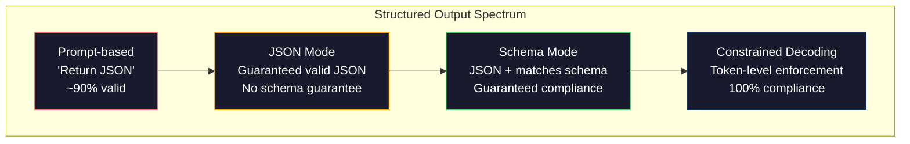
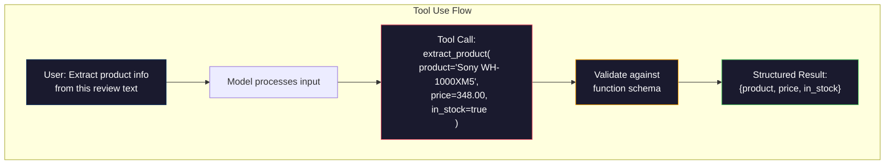

# 结构化输出:JSON、Schema Validation、Décodage restreint

> Votre LLM  retour est un string ⋅ votre application nécessite JSON ⋅ cette chute a entraîné l'effondrement du système de production, plus que tout modèle imaginaire ⋅ la production structurée est un pont entre le langage naturel et les données de typographie ⋅ faire face, votre LLM sera une API fiable ⋅ faire erreur, vous êtes le matin 3 点还在使用regex 解析自由文本 ⋅

**类型：**Construire
**语言：**Python
**先修要求：**Phase 10, leçons 01-05 (LLM à partir de zéro)
**时间：**À environ 90 minutes.
**相关内容：**La phase 5 · 20 (Outputs structurés et décoding restreint) couvre le décodeur 层面的理论(FSM/CFG logit processors、Outlines、XGrammar)。本课聚焦生产环境中的SDK 接口(OpenAI `response_format`、Utilisation d'outils anthropiques 、Instructeur)  Si vous voulez comprendre ce qui se passe sous API , veuillez d'abord lire la phase 5 · 20。

## Objectif de l'apprentissage

- Utilisation d'OpenAI et d'API anthropographique 参数 réaliser des sorties en mode JSON et restreintes de schéma
- Construire une couche de validation Pydantic, pour refuser de format erroné de sorties LLM, et passer par erreur contre
-  Expliquer le décoding restreint  comment générer à la fois JSON valide et pas besoin de traitement ultérieur à la couche de jetons
- design stable of extraction prompt, sera un texte non structuré transféré de manière fiable en structure de données de type

##  problématique

Vous demandez à la LLM: de ce passage du texte extraire le nom du produit, le prix et l'état d'inventaire.

```
The product is the Sony WH-1000XM5 headphones, which cost $348.00 and are currently in stock.
```

C'est une réponse parfaitement correcte. Pour votre application, elle n'est pas utilisée.`{"product": "Sony WH-1000XM5", "price": 348.00, "in_stock": true}`◊ vous avez besoin d'un objet JSON avec une clé spécifique ◊ un type spécifique et un ensemble de valeurs spécifiques ◊ vous n'avez pas besoin d'une phrase ◊

朴素解法:在快速里加上JSON中回答. Ceci est valable dans 90% des cas. Dans 10% des cas, le modèle met JSON 包在标记码围中,或者加上类似

Ceci n'est pas un problème d'ingénierie rapide. Ceci est un problème de décoding. Le modèle génère des jetons de gauche à droite. À chaque position, il choisit le plus possible de la prochaine jeton parmi le vocabulaire de plus de 100.000 options.`{"price":`, 下一个 Token 必须是数字、引号(pour une chaîne)`null`- Je suis là.`true`- Je suis là.`false`Ou négatif. Tout autre contenu générera des JSON inefficaces. Sans restriction, le modèle peut choisir un mot anglais qui semble parfaitement raisonnable, mais en grammaire, il s'agit d'une erreur catastrophique.

## 概念

###  Structured output

Le contrôle structuré des sorties a quatre niveaux, chacun étant plus fiable que le premier.



**基于 Prompt**(Répond en JSON): aucun code obligatoire. Le modèle est généralement respecté, mais il arrive que ce ne soit pas.

**JSON mode**:API garantie de sortie est valide JSON。OpenAI `response_format: { type: "json_object" }`Il est possible de mettre en place ce modèle. La sortie peut être sans erreur de résolution. Mais il ne correspond pas nécessairement à votre schéma d'attente.

**Schema mode**L'API reçoit un schéma JSON, et garantit sa mise en œuvre.`response_format: { type: "json_schema", json_schema: {...} }`(c' est aussi possible)`tool_choice="required"`)、Utilisation des outils anthropiques 配合 `input_schema`, ainsi que les Gémeaux `response_schema`+ `response_mime_type: "application/json"`◊输遇包含你指定的精确键,类型和约束──

**Constrained decoding**Si le schéma demande un nombre, et le modèle sort une lettre, la probabilité de ce jeton sera définie comme zéro. Le modèle ne peut générer que des jetons à sortie effective. C'est le mode de sortie structuré d'OpenAI ainsi que les lignes directrices et autres mécanismes mis en œuvre au niveau inférieur.

### Schéma JSON:契约语言

JSON Schema est une méthode utilisée pour dire au modèle (ou à la validation) que la sortie doit avoir une forme. Tous les principaux systèmes structurés de sortie l'utilisent.

```json
{
  "type": "object",
  "properties": {
    "product": { "type": "string" },
    "price": { "type": "number", "minimum": 0 },
    "in_stock": { "type": "boolean" },
    "categories": {
      "type": "array",
      "items": { "type": "string" }
    }
  },
  "required": ["product", "price", "in_stock"]
}
```

Cette schéma indique: le sort doit être un objet, contenant une chaîne type `product`、numéro non négatif type `price`、boolean 类型 `in_stock`, ainsi qu' une chaîne de choix numéro `categories`Toutes les sorties qui ne correspondent pas seront rejetées.

Les schémas peuvent traiter les difficultés: les objets emplacés ̇ contiennent des éléments de classement ̇ enums ̇ vont string 约束 to specific取 value) ̇ correspondance de motifs ̇ sur les chaînes ̇ utiliser regex), ainsi que les combinateurs ̇ utilisés pour la production de plusieurs modes ̇ de tout ̇ de tout ̇ de tout) ̇

### Pydantic 模式

Dans Python, vous ne pouvez pas écrire JSON Schema. Vous définissez un modèle Pydantic, il vous génère un schéma.

```python
from pydantic import BaseModel

class Product(BaseModel):
    product: str
    price: float
    in_stock: bool
    categories: list[str] = []
```

Ceci générera le même schéma JSON que ci-dessus. La bibliothèque d'instructeur (ou SDK d'OpenAI) peut accepter directement les modèles Pydantic:

### Appel à fonction / utilisation d' outils

C'est une autre interface du même problème. Vous ne faites pas de modèle directement générer JSON, mais définissez avec des outils de classement des paramètres.



Lorsque le modèle doit choisir quelle fonction utiliser, et non seulement le remplissage des paramètres, l'outil est plus approprié. Si vous avez 10 types de schémas de tirage, le modèle doit être basé sur une sorte de saisie, l'outil sera utilisé en même temps pour vous donner une sélection de schéma et une sortie structurée.

### 常见失败模式

Même avec l'application du schéma, les sorties structurées peuvent encore échouer de manière subtile.

**幻觉值**Le modèle est généré en 348 $.`{"price": 299.99}` Validation du schéma 捕捉不到这一点 类型正确,但值错误──

**Enum 混淆**Tu as été un peu déprimé.`["in_stock", "out_of_stock", "preorder"]` Modèle de production`"available"`语义正确, mais pas permis dans le collection.

**嵌套 object 深度**Les schèmes de fondations de fondations de fondations de fondations de fondations de fondations de fondations de fondations de fondations de fondations de fondations de fondations de fondations de fondations de fondations de fondations de fondations de fondations de fondations de fondations de fondations de fondations de fondations de fondations de fondations de fondations de fondations de fondations de fondations de fondations de fondations de fondations de fondations de fondations de fondations de fondations de fondations de fondations de fondations de fondations de fondations de fondations de fondations de fondations de fondations de fondations de fondations de fondations de fondations de fondations de fondations de fondations de fondations de fondations de fondations de fondations de fondations de fondations de fondations de fondations de fondations de fondations de fondations de fondations de fondations de fondations de fondations de fondations de fondations de fondations de fondations de fondations de fondations de fondations de fondations de fondations de fondations de fondations de fondations de fondations de fondations de fondations de fondations de fondations de fondations de fondations de fondations de fondations de fondations de fondations de fondations de fondations de fondations de fondations de fondations de fondations de fondations de fondations de fondations de fondations de fondations de fondations de fondations de fondations de fondations de fondations de fondations de fondations de fondations de fondations de fondations de fondations de fondations de fondations de fondations de fondations de fondations de fondations de fondations de fondations de fondations de fondations de fondations de fondations de fondations de fondations de fondations de fondations de fondations de fondations de fondations de fondations de fondations de fondations de fondations de fondations de fondations de fondations de fondations de fondations de fondations de fondations de fondations de fondations de fondations de fondations de fondations de fondations de fondations de fondations de fondations de fondations de fondations.

**Array 长度**Modèle: Modèle peut générer trop ou trop peu d'éléments dans l'arrayage.`minItems`et `maxItems`Mais tous les fournisseurs ne les mettent pas en œuvre à des niveaux de décoding.

**可选字段省略**Les modèles ignoreront les techniques à choisir, mais les segments importants de votre exemple d'utilisation au sens du terme. Même si les données sont parfois manquantes, vous devez les mettre en place dans le schéma pour la production explicite de modèles obligatoires.`null`Il y a une autre.


```figure
mx-schema-funnel
```

## - Je le construis.

### 步骤 1: Validateur de schéma JSON

De la conception de un validateur, utilisé pour vérifier si l'objet Python est compatible avec le schéma JSON.

```python
import json

def validate_schema(data, schema):
    errors = []
    _validate(data, schema, "", errors)
    return errors

def _validate(data, schema, path, errors):
    schema_type = schema.get("type")

    if schema_type == "object":
        if not isinstance(data, dict):
            errors.append(f"{path}: expected object, got {type(data).__name__}")
            return
        for key in schema.get("required", []):
            if key not in data:
                errors.append(f"{path}.{key}: required field missing")
        properties = schema.get("properties", {})
        for key, value in data.items():
            if key in properties:
                _validate(value, properties[key], f"{path}.{key}", errors)

    elif schema_type == "array":
        if not isinstance(data, list):
            errors.append(f"{path}: expected array, got {type(data).__name__}")
            return
        min_items = schema.get("minItems", 0)
        max_items = schema.get("maxItems", float("inf"))
        if len(data) < min_items:
            errors.append(f"{path}: array has {len(data)} items, minimum is {min_items}")
        if len(data) > max_items:
            errors.append(f"{path}: array has {len(data)} items, maximum is {max_items}")
        items_schema = schema.get("items", {})
        for i, item in enumerate(data):
            _validate(item, items_schema, f"{path}[{i}]", errors)

    elif schema_type == "string":
        if not isinstance(data, str):
            errors.append(f"{path}: expected string, got {type(data).__name__}")
            return
        enum_values = schema.get("enum")
        if enum_values and data not in enum_values:
            errors.append(f"{path}: '{data}' not in allowed values {enum_values}")

    elif schema_type == "number":
        if not isinstance(data, (int, float)):
            errors.append(f"{path}: expected number, got {type(data).__name__}")
            return
        minimum = schema.get("minimum")
        maximum = schema.get("maximum")
        if minimum is not None and data < minimum:
            errors.append(f"{path}: {data} is less than minimum {minimum}")
        if maximum is not None and data > maximum:
            errors.append(f"{path}: {data} is greater than maximum {maximum}")

    elif schema_type == "boolean":
        if not isinstance(data, bool):
            errors.append(f"{path}: expected boolean, got {type(data).__name__}")

    elif schema_type == "integer":
        if not isinstance(data, int) or isinstance(data, bool):
            errors.append(f"{path}: expected integer, got {type(data).__name__}")
```

### 步骤 2:Pydantic 风格 Modèle à schéma

构建一个最小的类到方案转换器──定义一个Python类,并自动生成它的JSON Schema──

```python
class SchemaField:
    def __init__(self, field_type, required=True, default=None, enum=None, minimum=None, maximum=None):
        self.field_type = field_type
        self.required = required
        self.default = default
        self.enum = enum
        self.minimum = minimum
        self.maximum = maximum

def python_type_to_schema(field):
    type_map = {
        str: "string",
        int: "integer",
        float: "number",
        bool: "boolean",
    }

    schema = {}

    if field.field_type in type_map:
        schema["type"] = type_map[field.field_type]
    elif field.field_type == list:
        schema["type"] = "array"
        schema["items"] = {"type": "string"}
    elif isinstance(field.field_type, dict):
        schema = field.field_type

    if field.enum:
        schema["enum"] = field.enum
    if field.minimum is not None:
        schema["minimum"] = field.minimum
    if field.maximum is not None:
        schema["maximum"] = field.maximum

    return schema

def model_to_schema(name, fields):
    properties = {}
    required = []

    for field_name, field in fields.items():
        properties[field_name] = python_type_to_schema(field)
        if field.required:
            required.append(field_name)

    return {
        "type": "object",
        "properties": properties,
        "required": required,
    }
```

### 步骤 3: Filtre de jetons restreints

模拟限制解码──给定一个部分 JSON string 和一个 schema,判断当前位点哪些 Token 类别是有效的──

```python
def next_valid_tokens(partial_json, schema):
    stripped = partial_json.strip()

    if not stripped:
        return ["{"]

    try:
        json.loads(stripped)
        return ["<EOS>"]
    except json.JSONDecodeError:
        pass

    last_char = stripped[-1] if stripped else ""

    if last_char == "{":
        return ['"', "}"]
    elif last_char == '"':
        if stripped.endswith('":'):
            return ['"', "0-9", "true", "false", "null", "[", "{"]
        return ["a-z", '"']
    elif last_char == ":":
        return [" ", '"', "0-9", "true", "false", "null", "[", "{"]
    elif last_char == ",":
        return [" ", '"', "{", "["]
    elif last_char in "0123456789":
        return ["0-9", ".", ",", "}", "]"]
    elif last_char == "}":
        return [",", "}", "]", "<EOS>"]
    elif last_char == "]":
        return [",", "}", "<EOS>"]
    elif last_char == "[":
        return ['"', "0-9", "true", "false", "null", "{", "[", "]"]
    else:
        return ["any"]

def demonstrate_constrained_decoding():
    partial_states = [
        '',
        '{',
        '{"product"',
        '{"product":',
        '{"product": "Sony"',
        '{"product": "Sony",',
        '{"product": "Sony", "price":',
        '{"product": "Sony", "price": 348',
        '{"product": "Sony", "price": 348}',
    ]

    print(f"{'Partial JSON':<45} {'Valid Next Tokens'}")
    print("-" * 80)
    for state in partial_states:
        valid = next_valid_tokens(state, {})
        display = state if state else "(empty)"
        print(f"{display:<45} {valid}")
```

### 步骤 4: Tirer le pipeline

Pour le résultat, il est nécessaire de définir le schéma, de créer un résultat structuré, de tester le résultat, de traiter le résultat.

```python
def simulate_llm_extraction(text, schema, attempt=0):
    if "headphones" in text.lower() or "sony" in text.lower():
        if attempt == 0:
            return '{"product": "Sony WH-1000XM5", "price": 348.00, "in_stock": true, "categories": ["audio", "headphones"]}'
        return '{"product": "Sony WH-1000XM5", "price": 348.00, "in_stock": true}'

    if "laptop" in text.lower():
        return '{"product": "MacBook Pro 16", "price": 2499.00, "in_stock": false, "categories": ["computers"]}'

    return '{"product": "Unknown", "price": 0, "in_stock": false}'

def extract_with_retry(text, schema, max_retries=3):
    for attempt in range(max_retries):
        raw = simulate_llm_extraction(text, schema, attempt)

        try:
            data = json.loads(raw)
        except json.JSONDecodeError as e:
            print(f"  Attempt {attempt + 1}: JSON parse error -- {e}")
            continue

        errors = validate_schema(data, schema)
        if not errors:
            return data

        print(f"  Attempt {attempt + 1}: Schema validation errors -- {errors}")

    return None

product_schema = {
    "type": "object",
    "properties": {
        "product": {"type": "string"},
        "price": {"type": "number", "minimum": 0},
        "in_stock": {"type": "boolean"},
        "categories": {"type": "array", "items": {"type": "string"}},
    },
    "required": ["product", "price", "in_stock"],
}
```

### 步骤 5:运行完整管道

```python
def run_demo():
    print("=" * 60)
    print("  Structured Output Pipeline Demo")
    print("=" * 60)

    print("\n--- Schema Definition ---")
    product_fields = {
        "product": SchemaField(str),
        "price": SchemaField(float, minimum=0),
        "in_stock": SchemaField(bool),
        "categories": SchemaField(list, required=False),
    }
    generated_schema = model_to_schema("Product", product_fields)
    print(json.dumps(generated_schema, indent=2))

    print("\n--- Schema Validation ---")
    test_cases = [
        ({"product": "Test", "price": 10.0, "in_stock": True}, "Valid object"),
        ({"product": "Test", "price": -5.0, "in_stock": True}, "Negative price"),
        ({"product": "Test", "in_stock": True}, "Missing price"),
        ({"product": "Test", "price": "ten", "in_stock": True}, "String as price"),
        ("not an object", "String instead of object"),
    ]

    for data, label in test_cases:
        errors = validate_schema(data, product_schema)
        status = "PASS" if not errors else f"FAIL: {errors}"
        print(f"  {label}: {status}")

    print("\n--- Constrained Decoding Simulation ---")
    demonstrate_constrained_decoding()

    print("\n--- Extraction Pipeline ---")
    texts = [
        "The Sony WH-1000XM5 headphones are priced at $348 and currently available.",
        "The new MacBook Pro 16-inch laptop costs $2499 but is sold out.",
        "This is a random sentence with no product info.",
    ]

    for text in texts:
        print(f"\n  Input: {text[:60]}...")
        result = extract_with_retry(text, product_schema)
        if result:
            print(f"  Output: {json.dumps(result)}")
        else:
            print(f"  Output: FAILED after retries")
```

## Utilisez-le

### Outputs structurés d'OpenAI

```python
# from openai import OpenAI
# from pydantic import BaseModel
#
# client = OpenAI()
#
# class Product(BaseModel):
#     product: str
#     price: float
#     in_stock: bool
#
# response = client.beta.chat.completions.parse(
#     model="gpt-5-mini",
#     messages=[
#         {"role": "system", "content": "Extract product information."},
#         {"role": "user", "content": "Sony WH-1000XM5, $348, in stock"},
#     ],
#     response_format=Product,
# )
#
# product = response.choices[0].message.parsed
# print(product.product, product.price, product.in_stock)
```

Le mode de sortie structurée d'OpenAI est utilisé à l'intérieur en utilisant le décoding restreint. Chaque jeton généré par le modèle est garanti pour être conforme à la sortie du schéma pydantique.

### Utilisation d'outils anthropologiques

```python
# import anthropic
#
# client = anthropic.Anthropic()
#
# response = client.messages.create(
#     model="claude-opus-4-7",
#     max_tokens=1024,
#     tools=[{
#         "name": "extract_product",
#         "description": "Extract product information from text",
#         "input_schema": {
#             "type": "object",
#             "properties": {
#                 "product": {"type": "string"},
#                 "price": {"type": "number"},
#                 "in_stock": {"type": "boolean"},
#             },
#             "required": ["product", "price", "in_stock"],
#         },
#     }],
#     messages=[{"role": "user", "content": "Extract: Sony WH-1000XM5, $348, in stock"}],
# )
```

Antropic 通过工具使用 实现结构化输出――模型会发出一个工具调用,其中包含匹配 input_schema的结构化参数――结果相同,API surface 不同――

### Bibliothèque des instructeurs

```python
# pip install instructor
# import instructor
# from openai import OpenAI
# from pydantic import BaseModel
#
# client = instructor.from_openai(OpenAI())
#
# class Product(BaseModel):
#     product: str
#     price: float
#     in_stock: bool
#
# product = client.chat.completions.create(
#     model="gpt-5-mini",
#     response_model=Product,
#     messages=[{"role": "user", "content": "Sony WH-1000XM5, $348, in stock"}],
# )
```

Instructeur  emballer tout client LLM,并加入带验证的自动复试――如果第一次尝试验证 失败, il considère l'erreur comme un contexte 发送给模型,并要求模型修复输出―― ceci s'applique à tout fournisseur, pas seulement à OpenAI――

## Je le livre.

本课会产出 `outputs/prompt-structured-extractor.md` Un modèle de prompt réutilisable, utilisé selon la définition du schéma pour extraire des données structurées de tout texte.

Il va se produire .`outputs/skill-structured-outputs.md` Un cadre de décision, utilisé selon vos exigences de fiabilité et de schéma  complexité de choix de la bonne stratégie structurée de sortie 

## 练习

1. 扩展 schéma validateur,使其支持 `oneOf`(les données doivent correspondre correctement à l'une des plusieurs schèmes) .`Product`Objet, peut aussi être de forme différente.`Service`objet

2. Construire un outil de différence de schéma, pour comparer deux schèmes,并识别破解变化(supprimer les champs requis、modifier les types) avec les changements non-breaking((nouveau augmentation des champs facultatifs、livrer les contraintes) 

3. 实现 un simulateur de décoding restreint plus réel── donner un schéma JSON et un vocabulaire contenant 100 Tokens (lettres, chiffres, ponctuation, mots-clés), étape par étape, génération, en chaque position, éviter les Tokens non valides── mesurer la proportion de Token en vigueur dans chaque étape du vocabulaire.

4. Construire une suite d'évaluation de tirage. 创建50条产品描述,并手工标注 JSON输出. 运行您的提取管道.

5. Pour votre pipeline d'extraction 添加信心分──对每抽取字段,估计模型的信任度(基于Token probabilities,或通过运行3次抽取并测量一致性)──将低置信度字段标记给人工审核──

## 关键术语

| Term | 人们通常怎么说 | 它实际意味着什么 |
|------|----------------|----------------------|
| JSON mode | “返回 JSON” | 一个 API flag，保证输出在语法上是有效 JSON，但不强制任何特定 schema |
| Structured output | “类型化 JSON” | 匹配特定 JSON Schema 的输出，具有正确的 key、type 和 constraint |
| Constrained decoding | “引导式生成” | 在每个 Token 位置屏蔽会产生无效输出的 Tokens——保证 100% schema compliance |
| JSON Schema | “一个 JSON template” | 用于描述 JSON 数据结构、type 和 constraint 的声明式语言（被 OpenAPI、JSON Forms 等使用） |
| Pydantic | “Python dataclasses+” | Python library，用于定义带有 type validation 的 data models，FastAPI 和 Instructor 使用它生成 JSON Schemas |
| Function calling | “Tool use” | LLM 输出结构化 function invocation（name + typed arguments），而不是 free text——OpenAI 和 Anthropic 都支持 |
| Instructor | “面向 LLMs 的 Pydantic” | Python library，用于包装 LLM clients 以返回经过验证的 Pydantic instances，并在 validation failure 时自动 retry |
| Token masking | “过滤 vocabulary” | 在 generation 期间将特定 Token probabilities 设为零，使模型无法生成它们 |
| Schema compliance | “匹配形状” | 输出包含每个 required field、正确 types、约束范围内的 values，并且没有额外的不允许字段 |
| Retry loop | “不断重试直到成功” | 将 validation errors 发回给模型，并要求它修复输出——Instructor 会自动执行这一点，最多重试到可配置上限 |

## 延伸阅读

- [OpenAI Structured Outputs Guide](https://platform.openai.com/docs/guides/structured-outputs)OpenAI API 中 Basé sur le schéma JSON de décoding restreint 官方文档
- [Willard & Louf, 2023——“Efficient Guided Generation for Large Language Models”](https://arxiv.org/abs/2307.09702)Des lignes directrices 论文, description de la façon de mettre en œuvre des schémas JSON 编译为有限状态机器以实现 Token 级约束
- [Instructor documentation](https://python.useinstructor.com/) utiliser Pydantic validation 和 retries de l'obtention de la MLL  obtenir structurée
- [Anthropic Tool Use Guide](https://docs.anthropic.com/en/docs/tool-use)Claude  comment utiliser l'outil 和 JSON Schema input_schema  réaliser une sortie structurée
- [JSON Schema specification](https://json-schema.org/) tous les principaux produits structurés 系统使用的方案语言 完整规范
- [Outlines library](https://github.com/outlines-dev/outlines) utiliser regex 和编译为有限状态机的JSON Schema 进行开源限制生成
- [Dong et al., “XGrammar: Flexible and Efficient Structured Generation Engine for Large Language Models” (MLSys 2025)](https://arxiv.org/abs/2411.15100) Le moteur de grammaire le plus avancé de l'époque; compilation automatique de poussée vers le bas, peut éviter les jetons à une vitesse d'environ 100 ns / jeton.
- [Beurer-Kellner et al., “Prompting Is Programming: A Query Language for Large Language Models” (LMQL)](https://arxiv.org/abs/2212.06094)LMQL 论文, sera limité décoding 表述为带有类型和值限制的查询语言──
- [Microsoft Guidance (framework docs)](https://github.com/guidance-ai/guidance) génération limitée basée sur des modèles; Outlines 和 XGrammar's provider-agnostique 补充──
