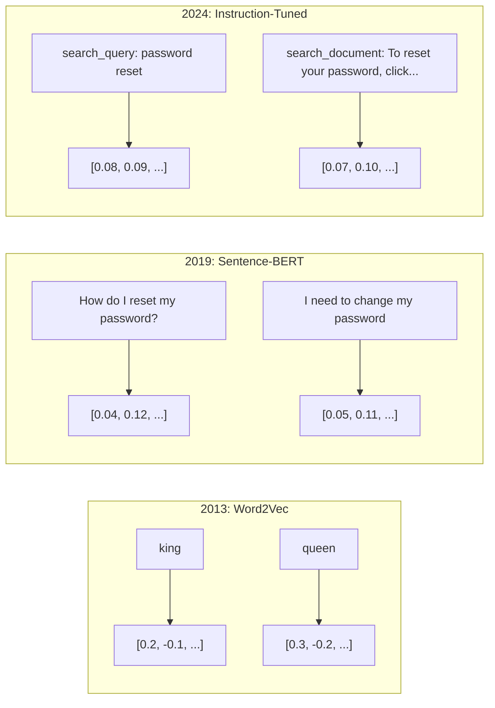
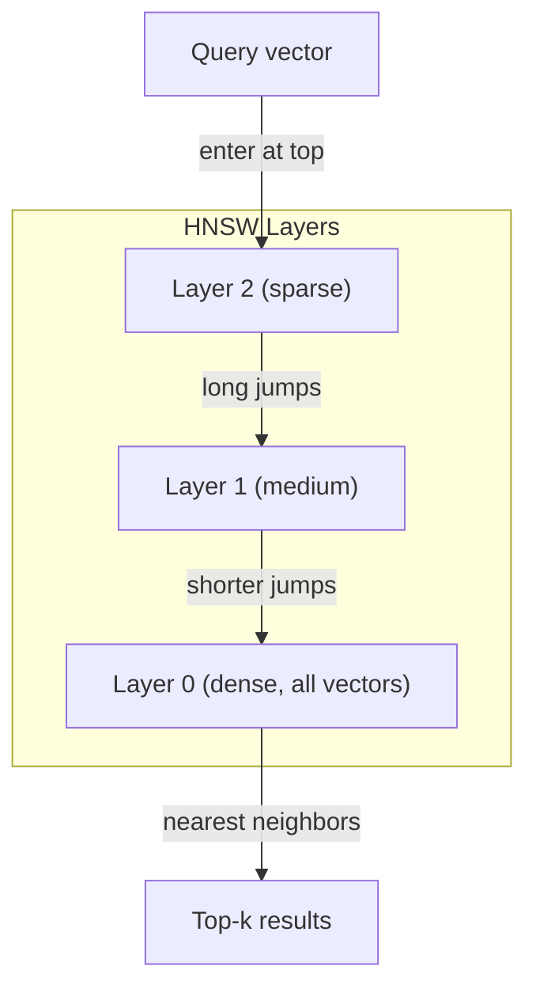

# Embeddings avec Vecteur

> Le texte est dispersé. La mathématique est continue. Chaque fois que vous demandez un LLM, vous êtes en train de rechercher des mots clés qui sont similaires à des documents, qui ont une signification comparable ou qui dépassent les mots clés, et vous êtes en train de relier ces deux mondes à un pont. Ce pont est un emblème. Si vous ne comprenez pas les emblèmes, vous ne comprenez pas l'IA moderne.

**Type:** Build
**Languages:** Python
**Prerequisites:** Phase 11, Lesson 01 (Prompt Engineering)
**Time:** ~75 minutes
**Related:**Phase 5 · 22 (Depth Dive Embedding Models) 涵盖密集对稀少对多向量、Matryoshka 截断,以及按轴选择模型──本课聚焦生产管eline(vector DBs、HNSW、相似度数学)──在选择模型之前,请先阅读Phase 5 · 22──

## Objectif de l'apprentissage
- Utiliser les fournisseurs d'API et les modèles open source
-  expliquer pourquoi les emblèmes 能解决 keyword search 无法处理的词汇不匹配问题
- Construire un index de recherche sémantique, en fonction du sens plutôt que de la correspondance de mots clés pour rechercher le document
- Utiliser des benchmarks de récupération(precision@k、recall) évaluer l'intégration 质量,并为您的任务选择合适的嵌入模型

##  problématique
Vous avez 10 000 张支持工单──一位客户写道:我的支付没有通过. 你需要找到相似的历史工单──关键词搜索会找到包含 支付 和 没有通过 的工单──它会漏掉 交易失败, 收费被拒绝, 和 结账错误. 这些工单用完全不同的词描述完全相同的问题──

C'est le problème du déséquilibre vocabulaire. Les langues humaines ont de nombreuses façons d'exprimer la même chose.

Vous avez besoin d'un texte pour dire que la similitude est déterminée par le sens, et non par le texte. Vous avez besoin d'une méthode pour faire passer mon paiement à un endroit proche de la place.

C'est une forme d'intégration.

## 概念
### Qu'est- ce qu'une implantation?

L'embedding est un vecteur dense composé de floc de points, utilisé pour indiquer le sens du texte.

Le chat s'est assis sur le tapis.`[0.023, -0.041, 0.087, ..., 0.012]`Les choses sont différentes selon le modèle, une liste contient 768 à 3072 chiffres. Ces chiffres sont codés pour le sens. Vous ne les vérifierez pas directement. Vous les comparerez.

### La percée de Word2Vec

En 2013, Thomas Mikolov de Google et ses collègues ont publié Word2Vec──核心洞见是: entraîner un réseau neural, selon un mot voisin, hidden layer power on will become meaningful Vector expression──

著名结果:

```
king - man + woman = queen
```

Pour les embrasements de mots  effectuer l'arithmétique vectorielle peut capturer la signification de la relation  homme à  femme, approximativement égal à la direction de  roi à  reine

Word2Vec est composé de 300 vecteurs. Chaque mot, quel que soit le contexte, n'a qu'un seul vecteur.

### De la parole à la phrase

Les emplacements de mots indiquent des jetons singuliers. Le système de production doit effectuer des emplacements de chaque phrase.

**Averaging**:取句中所有词向量的平均值──成本低、有损,但对短文文出奇地还不错──它完全丢失词序序狗咬人 和 人咬狗 会得到相同的嵌入──

**CLS token**:transformer models(BERT, 2018)输出一个特殊的 [CLS] token embedding,表示整个输入──比平均更好,但[CLS] token is for next-sentence prediction 训练的,不是为相似度训练的──

**Contrastive learning**Le modèle de formation apparente,把相似配对拉近,把不相似配对推远──Sentence-BERT(Reimers & Gurevych, 2019) a utilisé cette méthode, et est devenu la base des modèles modernes d'embedding──给定  Comment réinitialiser mon mot de passe? 和  J'ai besoin de changer mon mot de passe, 模型会学习到它们应该拥有几乎相同的矢量──

**Instruction-tuned embeddings**: le dernier moyen. E5 et GTE 等模型接受任务前(search_query:、 search_document:), dites au modèle de générer quel type d'embedding.



### Modèles modernes d'intégration

Le marché a reçu quelques options de production (en fonction des scores MTEB du début de l'année 2026, MTEB v2):

| Model | Provider | Dimensions | MTEB | Context | Cost / 1M tokens |
|-------|----------|-----------|------|---------|------------------|
| Gemini Embedding 2 | Google | 3072 (Matryoshka) | 67.7 (retrieval) | 8192 | $0.15 |
| embed-v4 | Cohere | 1024 (Matryoshka) | 65.2 | 128K | $0.12 |
| voyage-4 | Voyage AI | 1024/2048 (Matryoshka) | 66.8 | 32K | $0.12 |
| text-embedding-3-large | OpenAI | 3072 (Matryoshka) | 64.6 | 8192 | $0.13 |
| text-embedding-3-small | OpenAI | 1536 (Matryoshka) | 62.3 | 8192 | $0.02 |
| BGE-M3 | BAAI | 1024 (dense+sparse+ColBERT) | 63.0 multilingual | 8192 | Open-weight |
| Qwen3-Embedding | Alibaba | 4096 (Matryoshka) | 66.9 | 32K | Open-weight |
| Nomic-embed-v2 | Nomic | 768 (Matryoshka) | 63.1 | 8192 | Open-weight |

MTEB(Massive Text Embedding Benchmark) v2  couvre plus de 100 个任务, y compris la récupération, la classification, le regroupement, la réévaluation et la résumé。分数越高越好。 jusqu'en 2026, les modèles à poids ouvert(Qwen3-Embedding、BGE-M3) dans la majorité des dimensions déjà égal ou dépassant les modèles de gestion de la source fermée。 Gemini Embedding 2 领先纯采集;Voyage/Cohere dans un domaine spécifique(finance、قانون、code) 领先──投入使用前,始终要在您的查询上做一个基准──

### Mesures de similitude

À propos de deux vecteurs de mise en place, il existe trois façons de les mesurer:

**Cosine similarity**: deux vecteurs 间角的余弦值──范围从 -1(相反) 到 1(方向相同)──忽略大小如果一个10 词句和一个500 词文档指向相同方向,它们可以得到1.0──这是90%的默认选择──

```
cosine_sim(a, b) = dot(a, b) / (||a|| * ||b||)
```

**Dot product**: deux vecteurs ont été intégrés en un seul ensemble. Quand les vecteurs ont été intégrés en un seul ensemble, ils sont assimilés au cosine et ainsi les emplacements de l'OpenAI sont intégrés en un seul ensemble.

```
dot(a, b) = sum(a_i * b_i)
```

**Euclidean (L2) distance**: Le vecteur  espace est une distance de ligne directe 越小 = 越相似 ⋅ ⋅ ⋅ ⋅ ⋅ ⋅ ⋅ ⋅ ⋅ ⋅ ⋅ ⋅ ⋅ ⋅ ⋅ ⋅ ⋅ ⋅ ⋅ ⋅ ⋅ ⋅ ⋅ ⋅ ⋅ ⋅ ⋅ ⋅ ⋅ ⋅ ⋅ ⋅ ⋅ ⋅ ⋅ ⋅ ⋅ ⋅ ⋅ ⋅ ⋅ ⋅ ⋅ ⋅ ⋅ ⋅ ⋅ ⋅ ⋅ ⋅ ⋅ ⋅ ⋅ ⋅ ⋅ ⋅ ⋅ ⋅ ⋅ ⋅ ⋅ ⋅ ⋅ ⋅ ⋅ ⋅ ⋅ ⋅ ⋅ ⋅ ⋅ ⋅ ⋅ ⋅ ⋅ ⋅ ⋅ ⋅ ⋅ ⋅ ⋅ ⋅ ⋅ ⋅ ⋅ ⋅ ⋅ ⋅ ⋅ ⋅ ⋅ ⋅ ⋅ ⋅ ⋅ ⋅ ⋅ ⋅ ⋅ ⋅ ⋅ ⋅ ⋅ ⋅ ⋅ ⋅ ⋅ ⋅ ⋅ ⋅ ⋅ ⋅ ⋅ ⋅ ⋅ ⋅ ⋅ ⋅ ⋅ ⋅ ⋅ ⋅ ⋅ ⋅ ⋅ ⋅ ⋅ ⋅ ⋅ ⋅ ⋅ ⋅ ⋅ ⋅ ⋅ ⋅ ⋅                                                                                                                                                                                                                       

```
L2(a, b) = sqrt(sum((a_i - b_i)^2))
```

何時使用哪一种:

| Metric | Use when | Avoid when |
|--------|----------|------------|
| Cosine similarity | 比较长度不同的文本；大多数 retrieval 任务 | 大小携带信息 |
| Dot product | Embeddings 已经归一化；需要最高速度 | Vectors 大小不同 |
| Euclidean distance | Clustering；空间 nearest-neighbor 问题 | 比较长度差异巨大的文档 |

### Les bases de données vectorielles et HNSW

La recherche de similitude violente comparera les requêtes à chaque vecteur stocké par rapport à chaque autre vecteur.

Les bases de données vectorielles utilisent l'algorithme Approximate Nearest Neighbor (ANN) pour résoudre ce problème.

1.  Construire un graphe vectoriel à plusieurs niveaux
2. Le haut de la couche est rare de créer une longue distance de connexion entre les groupes à distance
3. La base est dense et établit des liens de petite taille entre les vecteurs voisins.
4. La recherche commence par le haut, le cœur descend et s'étend progressivement.
5. 以 O(log n) 时间 retourner à près similaires résultats top-k, plutôt que O(n)

HNSW utilise un très petit taux de précision de perte (généralement 95-99% de rappel) pour obtenir une augmentation de grande vitesse.



Produits:

| Database | Type | Best for | Max scale |
|----------|------|----------|-----------|
| Pinecone | Managed SaaS | 零运维生产环境 | Billions |
| Weaviate | Open source | 自托管、hybrid search | 100M+ |
| Qdrant | Open source | 高性能、过滤 | 100M+ |
| ChromaDB | Embedded | 原型开发、本地开发 | 1M |
| pgvector | Postgres extension | 已经使用 Postgres | 10M |
| FAISS | Library | 进程内、研究 | 1B+ |

### Des stratégies de déchiquetage

文档太长,不能作为单个矢量 进行嵌入──一个50页 PDF 覆盖几十个主题它的嵌入会变成所有内容的平均值,结果不像任何具体内容──你要把文档切成块,并对每块做嵌入──

**Fixed-size chunking**: Chaque N 个 Tokens 切分一次,并带 M-token overlap──简单且可预测──当文档没有清晰结构时效果很好──一个512-token piece 带50-token overlap:chunk 1 是 tokens 0-511,chunk 2 是 tokens 462-973──

**Sentence-based chunking**: dans la phrase limite de séparation, la phrase se compose jusqu'à atteindre la limite de jeton. Chaque pièce est au moins une phrase complète.

**Recursive chunking**Si c'est encore trop grand, réessayez les limites du paragraphe, puis les limites de la phrase, enfin les limites des caractères.`RecursiveCharacterTextSplitter`, pour les corps de format mixte, très bon effet.

**Semantic chunking**Pour chaque phrase, faire de l'embedding, puis de l'embedding, mais peut produire les morceaux les plus connectés.

| Strategy | Complexity | Quality | Best for |
|----------|-----------|---------|----------|
| Fixed-size | Low | Decent | 非结构化文本、logs |
| Sentence-based | Low | Good | 文章、emails |
| Recursive | Medium | Good | Markdown、HTML、mixed docs |
| Semantic | High | Best | 对 retrieval 质量要求关键的场景 |

La plupart des systèmes de zones de douceur: 256-512 pièces de jetons, avec 50 jetons se chevauchant.

### Comparativement aux bi-encoders et aux cross-encoders

Bi-encoder 会独立对查询 和文档做嵌入,然后比较向量――速度快你只需要对查询做一次嵌入,然后与预先计算好的文档嵌入比较――这是检索使用的方法――

Le cross-encoder utilisera la requête et un document comme un seul input et sortira un score de pertinence.

Le mode de production est: bi-encodeur 检查 top-100 candidats, cross-encodeur va le réafficher au top-10― c'est le pipeline de récupération-et-renquête―


Modèles de référencement:Cohere Rerank 3.5(per 1000 fois de consultation $2)、BGE-renanker-v2(免费,open source)、Jina Reranker v2(免费,open source)。

### Les embellissements de matrioshka

Les embellissements traditionnels sont entiers ou entiers. Un vecteur de 1536 dimensions utilise 1536 flottes.

Le modèle est entraîné à capturer les informations les plus importantes, comme un jeu de cartes de 1536d.

OpenAI's text-embedding-3-small 和 text-embedding-3-large 通过`dimensions`参数支持 Matryoshka 截断── request 256 维而不是 1536 维, stockage réduit de 6 fois, sur les benchmarks MTEB, le taux de précision est d'environ 3 à 5%[3].

### Quantification binaire

Un emplacement de 1536 dimensions et un stockage de float32 nécessite 6 144 caractères.

Quantification binaire Placez chaque flot 转成单个位:正值变成1,负值变成0── stockage de 6,144 字节降至192 字节减少32 倍──相似度使用 Hamming distance(统计不同位数)计算, CPU peut utiliser单条指令完成──

Le taux d'exactitude de la récupération de données a un impact d'environ 5-10%[6]. Le modèle courant est: d'abord, utilisez la quantification binaire pour effectuer une première recherche sur plusieurs millions de vecteurs, puis utilisez des vecteurs de précision complète pour le top-1000 重新打分── pour obtenir un taux de précision de 95%+ avec moins de 32 fois de mémoire.


```figure
cosine-similarity
```

## - Je le construis.
Nous avons commencé à construire un moteur de recherche sémantique. Nous n'utilisons pas de base de données vectorielles. Nous n'utilisons pas d'API intégrée à l'extérieur. Nous utilisons seulement Python et numpy pour faire des calculs mathématiques.

### 步骤 1: Chunking du texte

```python
def chunk_text(text, chunk_size=200, overlap=50):
    words = text.split()
    chunks = []
    start = 0
    while start < len(words):
        end = start + chunk_size
        chunk = " ".join(words[start:end])
        chunks.append(chunk)
        start += chunk_size - overlap
    return chunks


def chunk_by_sentences(text, max_chunk_tokens=200):
    sentences = text.replace("\n", " ").split(".")
    sentences = [s.strip() + "." for s in sentences if s.strip()]
    chunks = []
    current_chunk = []
    current_length = 0
    for sentence in sentences:
        sentence_length = len(sentence.split())
        if current_length + sentence_length > max_chunk_tokens and current_chunk:
            chunks.append(" ".join(current_chunk))
            current_chunk = []
            current_length = 0
        current_chunk.append(sentence)
        current_length += sentence_length
    if current_chunk:
        chunks.append(" ".join(current_chunk))
    return chunks
```

### 步骤 2: Construire des emblèmes à partir de zéro

Nous utilisons la normalisation TF-IDF et L2 pour réaliser une simple intégration dense. Ce n'est pas une intégration neurale, mais elle suit le même protocole:

```python
import math
import numpy as np
from collections import Counter

class SimpleEmbedder:
    def __init__(self):
        self.vocab = []
        self.idf = []
        self.word_to_idx = {}

    def fit(self, documents):
        vocab_set = set()
        for doc in documents:
            vocab_set.update(doc.lower().split())
        self.vocab = sorted(vocab_set)
        self.word_to_idx = {w: i for i, w in enumerate(self.vocab)}
        n = len(documents)
        self.idf = np.zeros(len(self.vocab))
        for i, word in enumerate(self.vocab):
            doc_count = sum(1 for doc in documents if word in doc.lower().split())
            self.idf[i] = math.log((n + 1) / (doc_count + 1)) + 1

    def embed(self, text):
        words = text.lower().split()
        count = Counter(words)
        total = len(words) if words else 1
        vec = np.zeros(len(self.vocab))
        for word, freq in count.items():
            if word in self.word_to_idx:
                tf = freq / total
                vec[self.word_to_idx[word]] = tf * self.idf[self.word_to_idx[word]]
        norm = np.linalg.norm(vec)
        if norm > 0:
            vec = vec / norm
        return vec
```

### 步骤 3: Fonctions de similitude

```python
def cosine_similarity(a, b):
    dot = np.dot(a, b)
    norm_a = np.linalg.norm(a)
    norm_b = np.linalg.norm(b)
    if norm_a == 0 or norm_b == 0:
        return 0.0
    return float(dot / (norm_a * norm_b))


def dot_product(a, b):
    return float(np.dot(a, b))


def euclidean_distance(a, b):
    return float(np.linalg.norm(a - b))
```

### 步骤 4: Index vectoriel avec recherche brute-force

```python
class VectorIndex:
    def __init__(self):
        self.vectors = []
        self.texts = []
        self.metadata = []

    def add(self, vector, text, meta=None):
        self.vectors.append(vector)
        self.texts.append(text)
        self.metadata.append(meta or {})

    def search(self, query_vector, top_k=5, metric="cosine"):
        scores = []
        for i, vec in enumerate(self.vectors):
            if metric == "cosine":
                score = cosine_similarity(query_vector, vec)
            elif metric == "dot":
                score = dot_product(query_vector, vec)
            elif metric == "euclidean":
                score = -euclidean_distance(query_vector, vec)
            else:
                raise ValueError(f"Unknown metric: {metric}")
            scores.append((i, score))
        scores.sort(key=lambda x: x[1], reverse=True)
        results = []
        for idx, score in scores[:top_k]:
            results.append({
                "text": self.texts[idx],
                "score": score,
                "metadata": self.metadata[idx],
                "index": idx
            })
        return results

    def size(self):
        return len(self.vectors)
```

### 步骤 5: Le moteur de recherche sémantique

```python
class SemanticSearchEngine:
    def __init__(self, chunk_size=200, overlap=50):
        self.embedder = SimpleEmbedder()
        self.index = VectorIndex()
        self.chunk_size = chunk_size
        self.overlap = overlap

    def index_documents(self, documents, source_names=None):
        all_chunks = []
        all_sources = []
        for i, doc in enumerate(documents):
            chunks = chunk_text(doc, self.chunk_size, self.overlap)
            all_chunks.extend(chunks)
            name = source_names[i] if source_names else f"doc_{i}"
            all_sources.extend([name] * len(chunks))
        self.embedder.fit(all_chunks)
        for chunk, source in zip(all_chunks, all_sources):
            vec = self.embedder.embed(chunk)
            self.index.add(vec, chunk, {"source": source})
        return len(all_chunks)

    def search(self, query, top_k=5, metric="cosine"):
        query_vec = self.embedder.embed(query)
        return self.index.search(query_vec, top_k, metric)

    def search_with_scores(self, query, top_k=5):
        results = self.search(query, top_k)
        return [
            {
                "text": r["text"][:200],
                "source": r["metadata"].get("source", "unknown"),
                "score": round(r["score"], 4)
            }
            for r in results
        ]
```

### 步骤 6: Comparer les mesures de similitude

```python
def compare_metrics(engine, query, top_k=3):
    results = {}
    for metric in ["cosine", "dot", "euclidean"]:
        hits = engine.search(query, top_k=top_k, metric=metric)
        results[metric] = [
            {"score": round(h["score"], 4), "preview": h["text"][:80]}
            for h in hits
        ]
    return results
```

## Utilisez-le
Utilisation de la production intégrant API 时, la structure reste cohérente.

```python
from openai import OpenAI

client = OpenAI()

def openai_embed(texts, model="text-embedding-3-small", dimensions=None):
    kwargs = {"model": model, "input": texts}
    if dimensions:
        kwargs["dimensions"] = dimensions
    response = client.embeddings.create(**kwargs)
    return [item.embedding for item in response.data]
```

Utilisez OpenAI de Matryoshka 截断同一个模型,更少维度,更低存储:

```python
full = openai_embed(["semantic search query"], dimensions=1536)
compact = openai_embed(["semantic search query"], dimensions=256)
```

256-d Vector utilisation de stockage réduit de 6 fois pour 1000 millions de documents, c'est 10 Go contre 61 Go.

Utilisation de la cohésion  effectuer un réaffectation:

```python
import cohere

co = cohere.ClientV2()

results = co.rerank(
    model="rerank-v3.5",
    query="What is the refund policy?",
    documents=["Full refund within 30 days...", "No refunds after 90 days..."],
    top_n=3
)
```

Utilisation de l'intégration locale, non dépendant de l'API:

```python
from sentence_transformers import SentenceTransformer

model = SentenceTransformer("BAAI/bge-small-en-v1.5")
embeddings = model.encode(["semantic search query", "another document"])
```

Nous avons construit une classe VectorIndex qui peut être associée à ces logiciels.

## Je le livre.
Le programme de formation
- `outputs/prompt-embedding-advisor.md` Un exemple utilisé pour choisir des modèles et des stratégies
- `outputs/skill-embedding-patterns.md` un professeur agents  comment utiliser efficacement les compétences de l'embedding dans la production

## 练习
1. **Metric comparison**: utiliser la similitude cosine, produit de points et distance euclidienne, pour les documents d'échantillon 运行相同的 5 个查询――记录每种方法的前3结果――quelles sont les questions sur ces mesures ne sont pas concordantes? Pourquoi?

2. **Chunk size experiment**Utilisez les tailles de pièces de 50、100、200 和 500 mots pour l'indexation des documents échantillonnés. Pour chaque configuration, effectuez 5 requêtes, et enregistrer le score de similitude de premier plan.

3. **Matryoshka simulation**Il est possible de simuler le comportement de Matryoshka en l'absence de techniques de formation réelles.

4. **Binary quantization**: prendre les emblèmes du moteur de recherche, les convertir en binaires, et réaliser la recherche à distance de Hamming.

5. **Sentence-based chunking**: usage `chunk_by_sentences`替换固定-size chunking──运行相同查询并比较检索分──尊重句子边界是否改善结果?

## 关键术语
| Term | What people say | What it actually means |
|------|----------------|----------------------|
| Embedding | “文本到数字” | 一种 dense Vector，其中几何接近性编码语义相似性 |
| Word2Vec | “最早的经典 Embedding” | 2013 年通过预测上下文词学习 word vectors 的模型；证明 Vector arithmetic 可以编码含义 |
| Cosine similarity | “两个 Vectors 有多相似” | Vectors 夹角的余弦值；1 = 方向相同，0 = 正交，-1 = 相反 |
| HNSW | “快速 Vector search” | Hierarchical Navigable Small World graph——一种多层结构，可实现 O(log n) 的 approximate nearest neighbor search |
| Bi-encoder | “分开 Embedding，快速比较” | 将 query 和 document 独立编码为 Vectors；支持预计算和快速 retrieval |
| Cross-encoder | “慢但准确的 reranker” | 让 query-document pair 联合通过完整模型处理；准确率更高，但无法预计算 |
| Matryoshka embeddings | “可截断的 Vectors” | 经过训练的 Embeddings，使前 N 个维度捕捉最重要的信息，从而支持可变大小存储 |
| Binary quantization | “1-bit embeddings” | 将 float vectors 转换为 binary（仅保留 sign bit），通过 Hamming distance search 实现 32 倍存储减少 |
| Chunking | “为 Embedding 拆分文档” | 将文档拆成 256-512 token 片段，使每个片段都可以独立 Embedding 和检索 |
| Vector database | “Embeddings 的搜索引擎” | 为存储 Vectors 并在规模化场景下执行 approximate nearest neighbor search 而优化的数据存储 |
| Contrastive learning | “通过比较训练” | 一种训练方法，把相似配对的 Embeddings 拉近，把不相似配对的 Embeddings 推远 |
| MTEB | “Embedding benchmark” | Massive Text Embedding Benchmark——覆盖 8 类任务的 56 个数据集；用于比较 Embedding models 的标准 |

## 延伸阅读
- Mikolov et coll., "Evaluation efficace des représentations de mots dans l'espace vectoriel" (2013) Word2Vec 论文, via roi-reine 类比开启了 Embedding 革命
- Reimers & Gurevych, "Sentence-BERT: Embeddings de phrases à l'aide de réseaux BERT siames" (2019)  comment entraîner à utiliser les bi-encoders de similitude de niveau de phrase, Modèles modernes d'embedding
- Kusupati et coll., "Matryoshka Representation Learning" (2022) 可变维度 Embeddings 背后的技术,OpenAI en text-embedding-3 l'a adopté
- Malkov et Yashunin, " Efficace et robuste approximation du voisin le plus proche en utilisant des graphiques hiérarchiques naviguables de petit monde " (2018) HNSW 论文,多数生产 Vector search 背后的算法
- Guide d'intégration d'OpenAI (platform.openai.com/docs/guides/embeddings) text-embedding-3 modèles 实用参考, incluant Matryoshka 维度缩减
- Tableau de référence MTEB (huggingface.co/spaces/mteb/leaderboard) 实时基准, utilisé pour comparer tous les modèles d'intégration dans différentes tâches et langues
- [Muennighoff et al., "MTEB: Massive Text Embedding Benchmark" (EACL 2023)](https://arxiv.org/abs/2210.07316) définir 8 类任务(classification, clustering, paire classification, ré-rangement, récupération, STS, résumé, extraction de texte) de référence,leaderboard 会报告这些类别;
- [Sentence Transformers documentation](https://www.sbert.net/)bi-encodeur vs cross-encodeur pooling strategies, ainsi que le pouvoir de réaliser le pipeline RAG ingest-split-embedded-store
