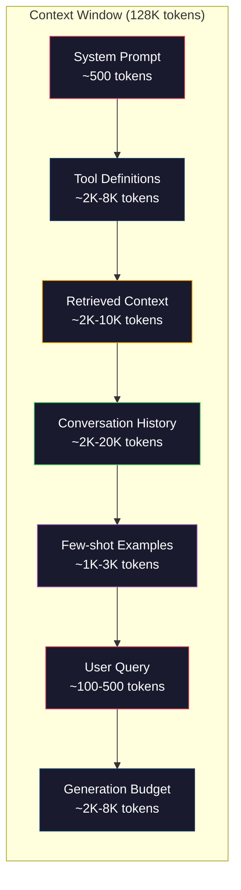
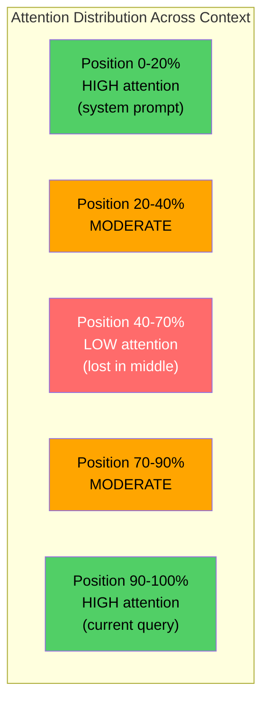
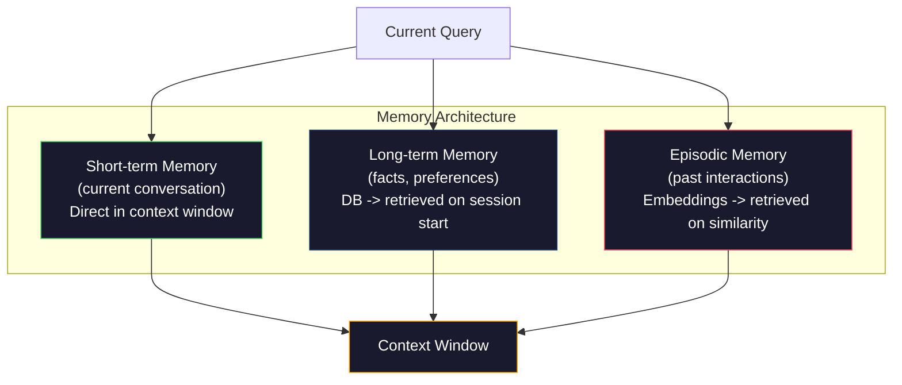

# Ingénierie de contexte: fenêtre, budget, mémoire et récupération

> L'ingénierie rapide est un sous-ensemble. L'ingénierie contextuelle est un ensemble de données. Le contexte est un élément de la fenêtre du modèle. Le contexte est un élément de la fenêtre du modèle.

**类型：**Construire
**语言：**Python
**前置要求：**La phase 10 (LLM à partir de zéro)
**时间：**À environ 90 minutes.
**相关：**Phase 11 · 15(Cachage rapide)  Layout convivial au cache est un projet de génie contextuel.

## Objectif de l'apprentissage

- 计算所有 context window 组件的 Token 预算(système prompt、outils、historique、documents récupérés、génération de la salle d'attente)
- 实现 context window 管理策略:截断、摘要, ainsi que la fenêtre coulissante de l'historique de la conversation
- Pour la priorité de la classification et de l'organisation des composants contextuels, la concentration maximale du modèle sur les informations les plus pertinentes
- Construire un assembleur de contexte, selon la requête  type et disponible fenêtre espace

##  problématique

Claude Opus 4.7 a 200K Token  Window(beta en moyenne pour 1M) ――GPT-5 a 400K。Gemini 3 Pro a 2M。Llama 4  C'est une énorme quantité de 10M。 Ces chiffres semblent très grands jusqu'à ce que vous les remplissez réellement。

Le code est un assistant de codage. Il est un serveur de codage. Il est un serveur de codage. Il est un serveur de codage.

Mais l'attention ne suit pas la longueur du contexte 线性扩展── posséder un modèle de contexte de jetons 128K doit payer une seconde attention 成本(n^2), bien que la plupart des modèles de production utilisent des variables attention 变体)── encore plus important, la récupération 准确率会下降──Needle dans un test Haystack montre que le modèle est difficile à trouver en long contexte 信息中间.

 Leçons pratiques sont: 200K Token sont disponibles et ne signifie pas utiliser 200K Token dès le début.

Chaque jeton que vous mettez dans la fenêtre, vous en sortirez un autre qui pourrait contenir des informations plus pertinentes. Chaque définition d'outil non liée à chaque conversation passée, chaque passage ne répondant pas à la question, rendra le modèle un peu moins performant sur la tâche.

## 概念

### Ventile de contexte est rare

Mettez la fenêtre contextuelle dans la RAM plutôt que dans le disque.



Chaque composé est en train de se battre pour l'espace. Ajouter plus de définitions d'outils signifie que l'histoire de la conversation est en train de changer. Ajouter plus de contexte récupéré signifie que quelques exemples de tir changent d'espace.

### Perdu au milieu

C'est l'expérience la plus importante de l'ingénierie contextuelle. Le modèle se concentre mieux sur le contexte, les informations de début et de fin.

Liu et coll. ont procédé à des tests systémiques à ce sujet. Ils ont placé un document pertinent dans une position différente entre 20 documents non pertinents, et ont mesuré le taux de précision de la réponse.

Cela affectera directement la conception de l'ingénierie:

- Mettre les informations les plus importantes en avant
- Mettre la requête actuelle et le contexte le plus pertinent  mettre la dernière(biographie récente
- Rendre le contexte intermédiaire comme la région de la plus faible priorité
- Si vous devez mettre l'information au milieu, vous devez la mettre au bout du compte.



### Context 组件

**System prompt**Il est mis en avant et reste inchangé pendant plusieurs rounds. Le code de clause est un système prompt comprenant les définitions d'outils et les instructions de comportement, utilisant environ 6000 jetons.

**Tool definitions**: chaque outil augmentera 50-200 Tokens (nom, description, schéma de paramètres) ⋅ 50 ⋅ outils ⋅ chaque 150 Tokens, avant toute conversation ⋅ se produire ⋅ 7500 Tokens ⋅ Sélection d'outils dynamiques, c'est-à-dire seulement contenant des outils liés à la requête actuelle ⋅ peuvent être réduits de 60-80% ⋅

**Retrieved context**: provenant de la base de données vectorielle de documents, résultats de recherche, contenu de fichiers, Retrieval 质量 directement déterminant la réponse, la qualité, 糟糕的 Retrieval 比没有 Retrieval 更差,因为它会用噪声填满窗口,并主动误导模型,

**Conversation history**: chaque message précédent de l'utilisateur et la réponse de l'assistant. Il va avec la durée de la conversation.

**Few-shot examples**Les instructions de plusieurs milliers de jetons peuvent augmenter la qualité de sortie. Mais elles occupent de l'espace.

**Generation budget**Pour répondre à la question, le modèle n'a pas de place pour répondre à la question.

### Context Compression 策略

**History summarization**Il est possible de remplacer le Z par 10 rounds de dialogue de 2000 Tokens, en utilisant la résumé de la conversation.

**Relevance filtering**Selon la requête actuelle  donne à chaque document récupéré 打分,并丢弃低于值的文档── Si vous avez récupéré 十个块, mais seulement 3 相关,就丢弃另一个7个──3个高度相关的块 胜过10个平的块──

**Tool pruning**:分类用户的查询意图,只包含与该意图相关的工具──代码问题不需要日历工具──排期问题不需要文件系统工具──这可以把工具定义从8,000 Token 降至1,000──

**Recursive summarization**Pour un long document, un résumé de chaque section, un résumé de chaque section, un résumé de chaque section, une résumé de chaque section, une résumé de chaque section, une résumé de 50 pages, une résumé de 500 tokens, en même temps, se transforme en un résumé de 500 tokens.

### Systèmes de mémoire

Ingénierie du contexte 跨越三个时间尺度──

**Short-term memory**Le contenu de la conversation est en cours de développement.

**Long-term memory**Le projet utilise PostgreSQL.  存储在数据库中, et puis est récupéré lors du début de la session。Claude Code Placez-le dans CLAUDE.md 文件中。ChatGPT Placez-le dans la fonctionnalité mémoire 中。

**Episodic memory**:可能相关的特定过去交互── Mardi dernier, nous avons débogagé un problème similaire dans le module auth. 作为 Embeddings 存储,并当前对话匹配某个过去节 时检索──



### Assemblage de contexte dynamique

关键洞察: différentes requêtes 需要不同的背景──静态系统提示 + 静态工具 + 静态历史 很浪费──最好的系统会为每个查询 动态组装背景──

1. 分类 intention de requête
2. 选择相关工具(pas tous les outils)
3. Récupération  Related documents(non fixe collection)
4. 包含相关历史转( pas toute l'histoire)
5. 添加与任务类型 匹配的几次例
6. 按重要性排序所有内容:关键的放最前,重要的放最后,可选的放中

C'est exactement la différence entre une application d'IA et une application d'IA exceptionnelle. Le modèle est le même.


```figure
lost-in-the-middle
```

## - Je le construis.

### 步骤 1: Le compteur de touches

Vous ne pouvez pas faire de budget pour des choses incommensurables. Construire un simple compteur de jetons.

```python
import json
import numpy as np
from collections import OrderedDict

def count_tokens(text):
    if not text:
        return 0
    return int(len(text.split()) * 1.3)

def count_tokens_json(obj):
    return count_tokens(json.dumps(obj))
```

### 步骤 2:Contextuel Gestionnaire budgétaire

核心抽象──预算管理员 会跟踪每个组件使用多少代币,并强制执行限制──

```python
class ContextBudget:
    def __init__(self, max_tokens=128000, generation_reserve=4000):
        self.max_tokens = max_tokens
        self.generation_reserve = generation_reserve
        self.available = max_tokens - generation_reserve
        self.allocations = OrderedDict()

    def allocate(self, component, content, max_tokens=None):
        tokens = count_tokens(content)
        if max_tokens and tokens > max_tokens:
            words = content.split()
            target_words = int(max_tokens / 1.3)
            content = " ".join(words[:target_words])
            tokens = count_tokens(content)

        used = sum(self.allocations.values())
        if used + tokens > self.available:
            allowed = self.available - used
            if allowed <= 0:
                return None, 0
            words = content.split()
            target_words = int(allowed / 1.3)
            content = " ".join(words[:target_words])
            tokens = count_tokens(content)

        self.allocations[component] = tokens
        return content, tokens

    def remaining(self):
        used = sum(self.allocations.values())
        return self.available - used

    def utilization(self):
        used = sum(self.allocations.values())
        return used / self.max_tokens

    def report(self):
        total_used = sum(self.allocations.values())
        lines = []
        lines.append(f"Context Budget Report ({self.max_tokens:,} token window)")
        lines.append("-" * 50)
        for component, tokens in self.allocations.items():
            pct = tokens / self.max_tokens * 100
            bar = "#" * int(pct / 2)
            lines.append(f"  {component:<25} {tokens:>6} tokens ({pct:>5.1f}%) {bar}")
        lines.append("-" * 50)
        lines.append(f"  {'Used':<25} {total_used:>6} tokens ({total_used/self.max_tokens*100:.1f}%)")
        lines.append(f"  {'Generation reserve':<25} {self.generation_reserve:>6} tokens")
        lines.append(f"  {'Remaining':<25} {self.remaining():>6} tokens")
        return "\n".join(lines)
```

### 步骤 3: Réorganisation du système de gestion des pertes

实现重排策略: les éléments les plus importants  être placés avant et après, les plus non importants être placés au milieu.

```python
def reorder_lost_in_middle(items, scores):
    paired = sorted(zip(scores, items), reverse=True)
    sorted_items = [item for _, item in paired]

    if len(sorted_items) <= 2:
        return sorted_items

    first_half = sorted_items[::2]
    second_half = sorted_items[1::2]
    second_half.reverse()

    return first_half + second_half

def score_relevance(query, documents):
    query_words = set(query.lower().split())
    scores = []
    for doc in documents:
        doc_words = set(doc.lower().split())
        if not query_words:
            scores.append(0.0)
            continue
        overlap = len(query_words & doc_words) / len(query_words)
        scores.append(round(overlap, 3))
    return scores
```

### 步骤 4: Compresseur d'historique de la conversation

总结旧的对话转转,以回收 Token 预算。

```python
class ConversationManager:
    def __init__(self, max_history_tokens=5000):
        self.turns = []
        self.summaries = []
        self.max_history_tokens = max_history_tokens

    def add_turn(self, role, content):
        self.turns.append({"role": role, "content": content})
        self._compress_if_needed()

    def _compress_if_needed(self):
        total = sum(count_tokens(t["content"]) for t in self.turns)
        if total <= self.max_history_tokens:
            return

        while total > self.max_history_tokens and len(self.turns) > 4:
            old_turns = self.turns[:2]
            summary = self._summarize_turns(old_turns)
            self.summaries.append(summary)
            self.turns = self.turns[2:]
            total = sum(count_tokens(t["content"]) for t in self.turns)

    def _summarize_turns(self, turns):
        parts = []
        for t in turns:
            content = t["content"]
            if len(content) > 100:
                content = content[:100] + "..."
            parts.append(f"{t['role']}: {content}")
        return "Previous: " + " | ".join(parts)

    def get_context(self):
        parts = []
        if self.summaries:
            parts.append("[Conversation Summary]")
            for s in self.summaries:
                parts.append(s)
        parts.append("[Recent Conversation]")
        for t in self.turns:
            parts.append(f"{t['role']}: {t['content']}")
        return "\n".join(parts)

    def token_count(self):
        return count_tokens(self.get_context())
```

### 步骤 5: Sélecteur d'outils dynamiques

Il ne contient que des outils liés à la requête actuelle.

```python
TOOL_REGISTRY = {
    "read_file": {
        "description": "Read contents of a file",
        "tokens": 120,
        "categories": ["code", "files"],
    },
    "write_file": {
        "description": "Write content to a file",
        "tokens": 150,
        "categories": ["code", "files"],
    },
    "search_code": {
        "description": "Search for patterns in codebase",
        "tokens": 130,
        "categories": ["code"],
    },
    "run_command": {
        "description": "Execute a shell command",
        "tokens": 140,
        "categories": ["code", "system"],
    },
    "create_calendar_event": {
        "description": "Create a new calendar event",
        "tokens": 180,
        "categories": ["calendar"],
    },
    "list_emails": {
        "description": "List recent emails",
        "tokens": 160,
        "categories": ["email"],
    },
    "send_email": {
        "description": "Send an email message",
        "tokens": 200,
        "categories": ["email"],
    },
    "web_search": {
        "description": "Search the web for information",
        "tokens": 140,
        "categories": ["research"],
    },
    "query_database": {
        "description": "Run a SQL query on the database",
        "tokens": 170,
        "categories": ["code", "data"],
    },
    "generate_chart": {
        "description": "Generate a chart from data",
        "tokens": 190,
        "categories": ["data", "visualization"],
    },
}

def classify_intent(query):
    query_lower = query.lower()

    intent_keywords = {
        "code": ["code", "function", "bug", "error", "file", "implement", "refactor", "debug", "test"],
        "calendar": ["meeting", "schedule", "calendar", "appointment", "event"],
        "email": ["email", "mail", "send", "inbox", "message"],
        "research": ["search", "find", "what is", "how does", "explain", "look up"],
        "data": ["data", "query", "database", "chart", "graph", "analytics", "sql"],
    }

    scores = {}
    for intent, keywords in intent_keywords.items():
        score = sum(1 for kw in keywords if kw in query_lower)
        if score > 0:
            scores[intent] = score

    if not scores:
        return ["code"]

    max_score = max(scores.values())
    return [intent for intent, score in scores.items() if score >= max_score * 0.5]

def select_tools(query, token_budget=2000):
    intents = classify_intent(query)
    relevant = {}
    total_tokens = 0

    for name, tool in TOOL_REGISTRY.items():
        if any(cat in intents for cat in tool["categories"]):
            if total_tokens + tool["tokens"] <= token_budget:
                relevant[name] = tool
                total_tokens += tool["tokens"]

    return relevant, total_tokens
```

### 步骤 6: L'ensemble du pipeline de l'assemblage de contexte

Donner une requête, le meilleur contexte possible.

```python
class ContextEngine:
    def __init__(self, max_tokens=128000, generation_reserve=4000):
        self.budget = ContextBudget(max_tokens, generation_reserve)
        self.conversation = ConversationManager(max_history_tokens=5000)
        self.system_prompt = (
            "You are a helpful AI assistant. You have access to tools for "
            "code editing, file management, web search, and data analysis. "
            "Use the appropriate tools for each task. Be concise and accurate."
        )
        self.knowledge_base = [
            "Python 3.12 introduced type parameter syntax for generic classes using bracket notation.",
            "The project uses PostgreSQL 16 with pgvector for embedding storage.",
            "Authentication is handled by Supabase Auth with JWT tokens.",
            "The frontend is built with Next.js 15 using the App Router.",
            "API rate limits are set to 100 requests per minute per user.",
            "The deployment pipeline uses GitHub Actions with Docker multi-stage builds.",
            "Test coverage must be above 80% for all new modules.",
            "The codebase follows the repository pattern for data access.",
        ]

    def assemble(self, query):
        self.budget = ContextBudget(self.budget.max_tokens, self.budget.generation_reserve)

        system_content, _ = self.budget.allocate("system_prompt", self.system_prompt, max_tokens=1000)

        tools, tool_tokens = select_tools(query, token_budget=2000)
        tool_text = json.dumps(list(tools.keys()))
        tool_content, _ = self.budget.allocate("tools", tool_text, max_tokens=2000)

        relevance = score_relevance(query, self.knowledge_base)
        threshold = 0.1
        relevant_docs = [
            doc for doc, score in zip(self.knowledge_base, relevance)
            if score >= threshold
        ]

        if relevant_docs:
            doc_scores = [s for s in relevance if s >= threshold]
            reordered = reorder_lost_in_middle(relevant_docs, doc_scores)
            doc_text = "\n".join(reordered)
            doc_content, _ = self.budget.allocate("retrieved_context", doc_text, max_tokens=3000)

        history_text = self.conversation.get_context()
        if history_text.strip():
            history_content, _ = self.budget.allocate("conversation_history", history_text, max_tokens=5000)

        query_content, _ = self.budget.allocate("user_query", query, max_tokens=500)

        return self.budget

    def chat(self, query):
        self.conversation.add_turn("user", query)
        budget = self.assemble(query)
        response = f"[Response to: {query[:50]}...]"
        self.conversation.add_turn("assistant", response)
        return budget


def run_demo():
    print("=" * 60)
    print("  Context Engineering Pipeline Demo")
    print("=" * 60)

    engine = ContextEngine(max_tokens=128000, generation_reserve=4000)

    print("\n--- Query 1: Code task ---")
    budget = engine.chat("Fix the bug in the authentication module where JWT tokens expire too early")
    print(budget.report())

    print("\n--- Query 2: Research task ---")
    budget = engine.chat("What is the best approach for implementing vector search in PostgreSQL?")
    print(budget.report())

    print("\n--- Query 3: After conversation history builds up ---")
    for i in range(8):
        engine.conversation.add_turn("user", f"Follow-up question number {i+1} about the implementation details of the system")
        engine.conversation.add_turn("assistant", f"Here is the response to follow-up {i+1} with technical details about the architecture")

    budget = engine.chat("Now implement the changes we discussed")
    print(budget.report())

    print("\n--- Tool Selection Examples ---")
    test_queries = [
        "Fix the bug in auth.py",
        "Schedule a meeting with the team for Tuesday",
        "Show me the database query performance stats",
        "Search for best practices on error handling",
    ]

    for q in test_queries:
        tools, tokens = select_tools(q)
        intents = classify_intent(q)
        print(f"\n  Query: {q}")
        print(f"  Intents: {intents}")
        print(f"  Tools: {list(tools.keys())} ({tokens} tokens)")

    print("\n--- Lost-in-the-Middle Reordering ---")
    docs = ["Doc A (most relevant)", "Doc B (somewhat relevant)", "Doc C (least relevant)",
            "Doc D (relevant)", "Doc E (moderately relevant)"]
    scores = [0.95, 0.60, 0.20, 0.80, 0.50]
    reordered = reorder_lost_in_middle(docs, scores)
    print(f"  Original order: {docs}")
    print(f"  Scores:         {scores}")
    print(f"  Reordered:      {reordered}")
    print(f"  (Most relevant at start and end, least relevant in middle)")
```

## Utilisez-le

### Le contexte de Claude Code

Claude Code utilise des méthodes de gestion de contexte. Le système demande à l'aide de règles de comportement et de définitions d'outils. Lorsque vous ouvrez un fichier, le contenu du fichier est utilisé comme contexte.

关键工程决策是:Claude Code ne va pas mettre votre base de code entière dans le contexte.

### Chargement dynamique du contexte du curseur

Le curseur mettra votre base de code entière en indexation pour les emplacements. Lorsque vous saisissez une requête, elle utilisera Vector similarity Retrieval.

模式就是这样:embed everything,按需检索,只包含重要内容──

### La mémoire ChatGPT

ChatGPT va conserver les préférences et les faits de l'utilisateur pour la mémoire à long terme. À chaque conversation commencée, les souvenirs pertinents seront récupérés et inclus dans le prompt du système. L'utilisateur préfère Python.

### RAG  en tant qu'ingénierie contextuelle

RAG est un génie contextuel formalisé. Il ne s'agit pas de mettre les connaissances dans le modèle, le poids de formation ou le contexte statique, mais de les insérer dans la fenêtre contextuelle du temps de requête.

## Je le livre.

本课会产出 `outputs/prompt-context-optimizer.md`, c'est une mise à jour réutilisable, pour l'assemblage de contexte d'audit 策略并推优化──把你的系统提示、工具数、平均历史长度 和检索策略 输入给它,它会识别代币 浪费并提出改进建议──

Il va se produire .`outputs/skill-context-engineering.md`, c'est un cadre de décision, utilisé en fonction du type de tâche, de la taille de la fenêtre de contexte et du budget de latence, pour concevoir des pipelines d'assemblage de contexte.

## 练习

1. 给 ContextBudget class 添加一个token waste detector──它应标记使用超过30% 预算组件,并针对每个组件类型建议具体压缩策略(概括历史、剪辑工具、重新排名文件) ──

2. Pour le contexte récupéré  réaliser la déduplication sémantique。 Si la similitude des deux documents récupérés dépasse 80% ((en fonction de la superposition des mots ou de la similitude cosine de ses emplacements), conservez seulement le nombre de points supérieur à celui-ci。 mesurez-le.

3. 构建一个语境重播工具──给定对话转录,通过 ContextEngine 重放,并可视化预算配置 如何逐轮变化──绘制每个组件随时间变化的Token usage──识别语境──开始被压缩的那一轮──

4. 实现 un sélecteur d'outils basé sur la priorité. Ne pas utiliser les deux éléments incluant/exclusion, mais pour chaque outil, partager son score de pertinence pour la requête actuelle.

5.  Construire un compresseur de contexte multi-stratégie  réaliser trois stratégies de compression  truncation  résumé  extraction de phrases clés) et de les comparer à 20 个文档集合  mesurer le ratio de compression et le poids entre la rétention d'informations  la version comprimée contient-elle encore la réponse à la requête ?

## 关键术语

| Term | 人们通常怎么说 | 它实际意味着什么 |
|------|----------------|----------------------|
| Context window | “模型能读多少内容” | 模型在单次 forward pass 中处理的最大 Token 数（input + output）——GPT-5 为 400K，Claude Opus 4.7 为 200K（1M beta），Gemini 3 Pro 为 2M |
| Context engineering | “高级 prompt engineering” | 决定什么进入 context window、按什么顺序、以什么优先级进入的学科——涵盖 Retrieval、compression、tool selection 和 memory management |
| Lost-in-the-middle | “模型会忘记中间的东西” | 经验发现：LLMs 更关注 context 的开头和结尾，放在中间的信息会出现 10-20% 的准确率下降 |
| Token budget | “你还剩多少 Token” | 对 context window 容量在各组件之间的显式分配（system prompt、tools、history、retrieval、generation），并带有按组件设置的限制 |
| Dynamic context | “临时加载东西” | 根据 intent classification、relevant tool selection 和 retrieval results，为每个 query 以不同方式组装 context window |
| History summarization | “压缩对话” | 用简洁摘要替换逐字记录的旧 conversation turns，在保留关键信息的同时降低 Token 成本 |
| Tool pruning | “只包含相关 tools” | 分类 query intent，并只包含匹配的 tool definitions，将 tool Token 成本降低 60-80% |
| Long-term memory | “跨 sessions 记住内容” | 存储在数据库中并在 session start 时 retrieved 的事实和偏好——CLAUDE.md、ChatGPT Memory 及类似系统 |
| Episodic memory | “记住特定过去事件” | 作为 Embeddings 存储的过去交互，并在当前 query 与过去 conversation 相似时 retrieved |
| Generation budget | “给答案留空间” | 为模型输出预留的 Token——如果 context 完全填满窗口，模型就没有空间响应 |

## 延伸阅读

- [Liu et al., 2023 -- "Lost in the Middle: How Language Models Use Long Contexts"](https://arxiv.org/abs/2307.03172)  Sur la position dépendante de l'attention étude de l'autorité, montrant que le modèle est difficile à traiter dans un contexte long
- [Anthropic's Contextual Retrieval blog post](https://www.anthropic.com/news/contextual-retrieval) Antropic  Comment gérer la récupération de pièces conscientes du contexte, l'échec de la récupération  Réduire 49%
- [Simon Willison's "Context Engineering"](https://simonwillison.net/2025/Jun/27/context-engineering/)                                                                                                                                                                                                                                                              
- [LangChain documentation on RAG](https://python.langchain.com/docs/tutorials/rag/) mettre en œuvre le RAG en tant que modèle d'ingénierie contextuelle
- [Greg Kamradt's Needle in a Haystack test](https://github.com/gkamradt/LLMTest_NeedleInAHaystack)  Révéler tous les défaillances de récupération dépendantes de la position dans les modèles principaux
- [Pope et al., "Efficiently Scaling Transformer Inference" (2022)](https://arxiv.org/abs/2211.05102) Pourquoi la longueur de contexte 会驱动内存和延迟, ainsi que le cache KV、MQA、GQA 如何改变预算计算──
- [Agrawal et al., "SARATHI: Efficient LLM Inference by Piggybacking Decodes with Chunked Prefills" (2023)](https://arxiv.org/abs/2308.16369) Deux étapes de l'inférence, rendant les demandes de réponse de TTFT 上昂贵、 在 TPOT 上便宜; c'est un compromis de contexte 背后的事实依据.
- [Ainslie et al., "GQA: Training Generalized Multi-Query Transformer Models from Multi-Head Checkpoints" (EMNLP 2023)](https://arxiv.org/abs/2305.13245) groupe-queries attention 论文, dans le cas de la qualité non perdue, va décoder de production entre la mémoire KV réduire 8×。
