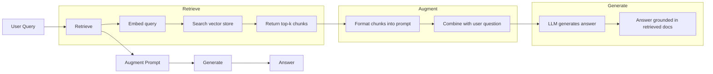
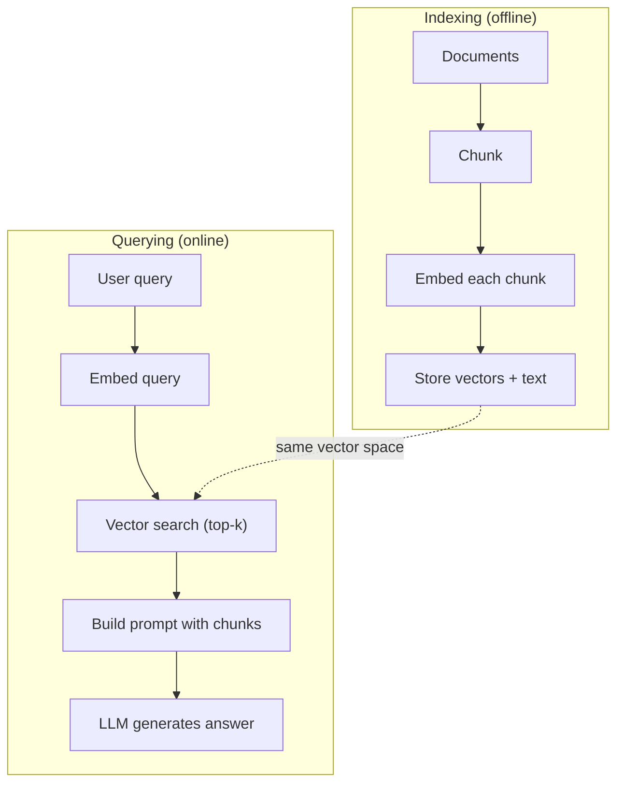

# RAG (Génération augmentée par récupération)

> Votre LLM connaît tout avant la fin de sa formation. Il ne connaît pas les documents de votre entreprise, votre bibliothèque de code, ni les enregistrements de la semaine dernière.

**Type:** Build
**Languages:** Python
**Prerequisites:** Phase 10 (LLMs from Scratch), Phase 11 Lessons 01-05
**Time:** ~90 minutes
**Related:**Phase 5 · 23 (Strategie de déchiquetage pour RAG) 讲解六种 chunking 算法以及各自适用场景──Phase 5 · 22 (Embedding Models Deep Dive) 讲解如何选择嵌入器──Phase 11 · 07 (Advanced RAG) 讲解混合搜索、重排和查询转变──

## Objectif de l'apprentissage
- Construire un pipeline RAG complet: chargement de documents, déchiquetage, intégration, stockage vectoriel, récupération et génération
- Utilisation de base de données vectorielles (ChromaDB、FAISS ou Pinecone)并配合合适的索引, réalisation de la recherche sémantique
- explication de pourquoi dans l'application basée sur le savoir RAG est meilleur que l'ajustement fin (cost, freshness, attributibilité)
- Utilisation de mesures de récupération de données (precision, rappel) et de génération (fidélité, pertinence) pour évaluer la qualité des RAG

##  problématique
Vous avez créé un chatbot pour l'entreprise. Les clients se demandent: quelle est la politique de remboursement des programmes d'entreprise ? LLM a donné une réponse générale sur la politique de remboursement SaaS typique. La politique réelle est inscrite dans un wiki interne de 200 pages, qui prévoit que les clients d'entreprise ont 60 fenêtres et peuvent rembourser en proportion. LLM n'a jamais vu ce document. Il est impossible de savoir ce qui n'est pas apparu dans la formation.

Le réglage de la mise à jour est une solution. Prenez ce Master, utilisez votre dossier interne pour le former, puis déployez un modèle mis à jour. C'est possible, mais avec de sérieux problèmes.

RAG est une autre solution. Gardez le modèle inchangé. Lorsque le problème survient, recherchez des passages pertinents dans votre magasin de documents, les collez à l'instant de la première page du problème, faites en sorte que le modèle soit basé sur ces passages en tant que contexte pour répondre.

## 概念
### Le modèle RAG

L'ensemble du modèle peut être généralement défini en quatre étapes:



Query -> Retrieve -> Augment prompt -> Generate。 chaque système RAG 系统都遵循这个模式。 Production class RAG 系统之间的差异体现在每一步的细节中:如何分块、如何嵌入、如何搜索,以及如何构建提示──

### Pourquoi le RAG est meilleur que le réglage

| Concern | Fine-tuning | RAG |
|---------|------------|-----|
| 成本 | 每次 training run 需要 $1,000-$100,000+ | 每次 query 约 $0.01-$0.10（embedding + LLM） |
| 新鲜度 | 重新训练前一直过时 | 通过重新 indexing docs，可在几分钟内更新 |
| 可审计性 | 无法追踪 answer 到 source | 可以展示准确检索到的 passages |
| Hallucination | 仍然会自由 hallucinate | 基于检索到的 documents |
| 数据隐私 | training data 被烘焙进 weights | documents 留在你的 vector store 中 |

Le réglage fin 会永久改变模型的重量──RAG 会临时改变模型的背景── Pour la plupart des applications, le contexte temporaire 只是你想要──

Le seul cas où l'on peut réussir à se régler correctement est que vous avez besoin d'un modèle qui adopte un certain style, un certain langage ou un modèle de raisonnement, mais cela ne peut pas être réalisé simplement en vous incitant à le faire.

### Intégrer des modèles

Modèle d'intégration 会把文本转换成密集向量──相似文本会在这个高维空间产生彼此接近的向量── Comment réinitialiser mon mot de passe? 和  J'ai besoin de changer mon mot de passe  尽管共享的词很少,却会产生几乎相同的向量── Le chat assis sur le tapis 则会产生非常不同的向量──

常见嵌入型号(2026 阵容  完整分析见Phase 5 · 22):

| Model | Dimensions | Provider | Notes |
|-------|-----------|----------|-------|
| text-embedding-3-small | 1536 (Matryoshka) | OpenAI | 适合大多数用例的最佳性价比 |
| text-embedding-3-large | 3072 (Matryoshka) | OpenAI | 更高准确率，可截断到 256/512/1024 |
| Gemini Embedding 2 | 3072 (Matryoshka) | Google | 顶级 MTEB retrieval；8K context |
| voyage-4 | 1024/2048 (Matryoshka) | Voyage AI | 领域变体（code、finance、law） |
| Cohere embed-v4 | 1024 (Matryoshka) | Cohere | 强 multilingual，128K context |
| BGE-M3 | 1024 (dense + sparse + ColBERT) | BAAI (open-weight) | 一个模型提供三种视图 |
| Qwen3-Embedding | 4096 (Matryoshka) | Alibaba (open-weight) | 顶级 open-weight retrieval score |
| all-MiniLM-L6-v2 | 384 | Open-weight (Sentence Transformers) | prototyping baseline |

Dans cette classe, nous utiliserons TF-IDF pour construire notre propre intégration simple. Non pas parce que TF-IDF est un schéma utilisé par le système de production, mais parce qu'il rend le concept concret: texte d'entrée, vecteur de sortie, texte similaire produire vecteurs similaires.

### Similation vectorielle

 à deux vecteurs, comment mesurer la similitude ?

**Cosine similarity**: deux vecteurs 之间角的余弦值──范围从 -1(相反) 到 1(完全相同)──忽略大小,只关注方向──这是RAG的默认选择──

```
cosine_sim(a, b) = dot(a, b) / (||a|| * ||b||)
```

**Dot product**: Produit intérieur original. Vecteurs plus grands Obtiendront un nombre plus élevé.

```
dot(a, b) = sum(a_i * b_i)
```

**L2 (Euclidean) distance**: espace vectoriel en milieu de la distance directe.

```
L2(a, b) = sqrt(sum((a_i - b_i)^2))
```

La similitude cosytique est un standard de sélection. Elle est largement reconnue et peut être utilisée pour traiter des documents de différentes longitudes.

### Des stratégies de déchiquetage

Les documents sont trop longs, ne peuvent pas être intégrés en tant que vecteurs individuels. Un PDF de 50 pages peut produire une mauvaise intégration, car il contient plusieurs dizaines de sujets.

**Fixed-size chunking**: Chaque N 个代币 拆分一次──简单且可预测── un morceau de 512 tokens 配合50 tokens overlap, signifie que le morceau 1 est des tokens 0-511, le morceau 2 est des tokens 462-973, en ce genre de suggestions──overlap 确保你不会在不走运的边界处切断句子──

**Semantic chunking**: dans la nature, les parties sont divisées, les sections sont classées, les titres sont classés, chaque section est constituée d'un ensemble de mots et de mots.

**Recursive chunking**Si une section est encore trop grande, on la décompose en fonction des limites du paragraphe. Si un paragraphe est encore trop grand, on la décompose en fonction des limites de la phrase.

La taille de la pièce est plus importante que ce que les gens imaginent:

- 太小(64-128 jetons): chaque pièce 缺乏 contexte──Il a augmenté de 15% au dernier trimestre Si vous ne savez pas it指什么,就没有意义──
- 太大(2048+ tokens): chaque pièce couvre plusieurs sujets, rar释相关性── lorsque vous recherchez des données de revenus, vous obtenez une pièce de 10% 关于收入、90% 关于人数──
- 理想范围(256-512 tokens):context 足够自包含,同时足够聚焦以保持相关性──

La plupart des systèmes RAG de production utilisent 256 à 512 pièces de jetons, et 50 jetons se chevauchent.

### Base de données vectorielles

Une fois que vous avez des emblèmes, vous aurez besoin d'un endroit pour les stocker et les rechercher.

| Database | Type | Best for |
|----------|------|----------|
| FAISS | Library (in-process) | Prototyping，中小型 datasets |
| Chroma | Lightweight DB | 本地开发，小型部署 |
| Pinecone | Managed service | 无需运维负担的生产环境 |
| Weaviate | Open source DB | 自托管生产环境 |
| pgvector | Postgres extension | 已经在使用 Postgres |
| Qdrant | Open source DB | 高性能自托管 |

Dans cette classe, nous allons construire un simple magasin de vecteurs en mémoire. Il met les vecteurs dans la liste des existants, et effectue une recherche de similitude cosine à force brute. Cela équivaut à utiliser FAISS d'un indice plat. Il peut être étendu à environ 100 000 vecteurs avant de changer lentement.

### Le pipeline complet



L'indexation est une phase de traitement de plusieurs millions de documents en quelques heures. La requête doit être traitée en une seconde.

### Numéros réels

La plupart des systèmes RAG de production utilisent ces paramètres:

- **k = 5 to 10**: pour chaque requête 检索的块 数量
- **Chunk size = 256 to 512 tokens**,并配 50 jetons se chevauchent
- **Context budget**: chaque requête Utilisez des contenus récupérés de 2500 à 5000 jetons
- **Total prompt**: environ 8 000 à 16 000 jetons(interrogatoire système + fragments récupérés + historique de conversation + requête utilisateur)
- **Embedding dimension**:84-3072, dépend du modèle
- **Indexing throughput**: utiliser des intégrations API 时每秒 100-1,000 documents
- **Query latency**Résultats de la recherche:


```figure
rag-chunking
```

## - Je le construis.
### 步骤 1: Chunking du document

```python
def chunk_text(text, chunk_size=200, overlap=50):
    words = text.split()
    chunks = []
    start = 0
    while start < len(words):
        end = start + chunk_size
        chunk = " ".join(words[start:end])
        chunks.append(chunk)
        start += chunk_size - overlap
    return chunks
```

### 步骤 2: Embedding du TF-IDF

Nous avons construit une fonction d'embedding simple. TF-IDF (Term Frequency-Inverse Document Frequency) n'est pas une embedding neurale, mais elle peut capter l'importance du mot de manière à convertir le texte en vecteurs.

```python
import math
from collections import Counter

def build_vocabulary(documents):
    vocab = set()
    for doc in documents:
        vocab.update(doc.lower().split())
    return sorted(vocab)

def compute_tf(text, vocab):
    words = text.lower().split()
    count = Counter(words)
    total = len(words)
    return [count.get(word, 0) / total for word in vocab]

def compute_idf(documents, vocab):
    n = len(documents)
    idf = []
    for word in vocab:
        doc_count = sum(1 for doc in documents if word in doc.lower().split())
        idf.append(math.log((n + 1) / (doc_count + 1)) + 1)
    return idf

def tfidf_embed(text, vocab, idf):
    tf = compute_tf(text, vocab)
    return [t * i for t, i in zip(tf, idf)]
```

### 步骤 3: Recherche de similitude cosine

```python
def cosine_similarity(a, b):
    dot = sum(x * y for x, y in zip(a, b))
    norm_a = math.sqrt(sum(x * x for x in a))
    norm_b = math.sqrt(sum(x * x for x in b))
    if norm_a == 0 or norm_b == 0:
        return 0.0
    return dot / (norm_a * norm_b)

def search(query_embedding, stored_embeddings, top_k=5):
    scores = []
    for i, emb in enumerate(stored_embeddings):
        sim = cosine_similarity(query_embedding, emb)
        scores.append((i, sim))
    scores.sort(key=lambda x: x[1], reverse=True)
    return scores[:top_k]
```

### 步骤 4: Construction rapide

C'est là que se produisent les augmentations dans le RAG. Prenez les morceaux de la requête, les formatiez en un prompt, puis demandez une réponse à la demande de LLM en fonction d'un contexte donné.

```python
def build_rag_prompt(query, retrieved_chunks):
    context = "\n\n---\n\n".join(
        f"[Source {i+1}]\n{chunk}"
        for i, chunk in enumerate(retrieved_chunks)
    )
    return f"""Answer the question based ONLY on the following context.
If the context doesn't contain enough information, say "I don't have enough information to answer that."

Context:
{context}

Question: {query}

Answer:"""
```

### 步骤 5: Le pipeline RAG complet

```python
class RAGPipeline:
    def __init__(self):
        self.chunks = []
        self.embeddings = []
        self.vocab = []
        self.idf = []

    def index(self, documents):
        all_chunks = []
        for doc in documents:
            all_chunks.extend(chunk_text(doc))
        self.chunks = all_chunks
        self.vocab = build_vocabulary(all_chunks)
        self.idf = compute_idf(all_chunks, self.vocab)
        self.embeddings = [
            tfidf_embed(chunk, self.vocab, self.idf)
            for chunk in all_chunks
        ]

    def query(self, question, top_k=5):
        query_emb = tfidf_embed(question, self.vocab, self.idf)
        results = search(query_emb, self.embeddings, top_k)
        retrieved = [(self.chunks[i], score) for i, score in results]
        prompt = build_rag_prompt(
            question, [chunk for chunk, _ in retrieved]
        )
        return prompt, retrieved
```

### 步骤 6: génération (simulé)

Dans le cadre de la production, nous utilisons ici l'API LLM.

```python
def simple_generate(prompt, retrieved_chunks):
    query_words = set(prompt.lower().split("question:")[-1].split())
    best_sentence = ""
    best_score = 0
    for chunk in retrieved_chunks:
        for sentence in chunk.split("."):
            sentence = sentence.strip()
            if not sentence:
                continue
            words = set(sentence.lower().split())
            overlap = len(query_words & words)
            if overlap > best_score:
                best_score = overlap
                best_sentence = sentence
    return best_sentence if best_sentence else "I don't have enough information."
```

## Utilisez-le
Utilisation de modèle d'intégration réelle et LLM, codes presque inchangés:

```python
from openai import OpenAI

client = OpenAI()

def embed(text):
    response = client.embeddings.create(
        model="text-embedding-3-small",
        input=text
    )
    return response.data[0].embedding

def generate(prompt):
    response = client.chat.completions.create(
        model="gpt-4o-mini",
        messages=[{"role": "user", "content": prompt}],
        temperature=0
    )
    return response.choices[0].message.content
```

Ou utiliser Anthropic:

```python
import anthropic

client = anthropic.Anthropic()

def generate(prompt):
    response = client.messages.create(
        model="claude-sonnet-4-20250514",
        max_tokens=1024,
        messages=[{"role": "user", "content": prompt}]
    )
    return response.content[0].text
```

Le pipeline est le même. La fonction de mise en place est la même. La fonction de génération est la même.

 Pour le stockage vectoriel à grande échelle, utiliser une base de données vectorielle adaptée  remplacer la recherche brute-force:

```python
import chromadb

client = chromadb.Client()
collection = client.create_collection("my_docs")

collection.add(
    documents=chunks,
    ids=[f"chunk_{i}" for i in range(len(chunks))]
)

results = collection.query(
    query_texts=["What is the refund policy?"],
    n_results=5
)
```

Chroma 会在内部处理嵌入式 (默认使用全-MiniLM-L6-v2),并把向量 存储在本地数据库中──同样模式,不同的管道实现──

## Je le livre.
Le cours est ouvert à:
- `outputs/prompt-rag-architect.md` Un prompt utilisé pour la conception d'exemples spécifiques RAG 系统
- `outputs/skill-rag-pipeline.md` Un agent de formation  Comment construire et modifier les pipelines RAG

## 练习
1. Utilisation simple de sacs de mots  méthode de remplacement des emblèmes TF-IDF 二值:词存在则为 1,不存在则为 0) ⋅ dans les documents d'échantillon ⋅ 上比较检索质量──TF-IDF 应表现更好,因为它会给罕见词更高权重──

2. 试验不同分量: dans le même ensemble de documents 上尝试 50、100、200 和 500 words── pour chaque taille, effectuer les mêmes 5 requêtes,并统计有多少能在前3中返回相关分量──找到检索质量 达到峰值的甜点──

3. Pour chaque pièce 添加元数据 (en anglais: "source document name"",chunk position")  Modifier le modèle de demande afin d'inclure l'attribution de source, faire en sorte que le LLM cite ses sources.

4. 实现 une simple évaluation: donner 10 paires de questions-réponses, faire chaque question 通过RAG pipeline,并衡量检索到的块中有多少比例含答──这是在k的检索回忆.

5. 构建对话意识RAG pipeline:维护最近3轮交易所的历史,并将其与检索的块 一起包含在快速中──使用后续问题测试,例如在询问价格 后再问    关于企业?──

## 关键术语
| Term | What people say | What it actually means |
|------|----------------|----------------------|
| RAG | “能阅读你文档的 AI” | 检索相关 documents，把它们粘贴到 prompt 中，并生成一个基于这些 documents 的 answer |
| Embedding | “把文本转换成数字” | 文本的 dense vector representation，其中相似含义会产生相似 vectors |
| Vector database | “面向 AI 的搜索引擎” | 为存储 vectors 并按 similarity 找到 nearest neighbors 而优化的数据存储 |
| Chunking | “把 docs 拆成片段” | 将 documents 拆成更小的 segments（通常 256-512 tokens），以便每个 segment 可以独立 embed 和 retrieve |
| Cosine similarity | “两个 vectors 有多相似” | 两个 vectors 之间夹角的余弦值；1 = 方向相同，0 = 正交，-1 = 相反 |
| Top-k retrieval | “取 k 个最佳匹配” | 从 vector store 中返回与 query 最相似的 k 个 chunks |
| Context window | “LLM 能看到多少文本” | LLM 在单次请求中可以处理的最大 tokens 数；retrieved chunks 必须放入这个范围内 |
| Augmented generation | “使用给定 context 回答” | 使用检索到的 documents 作为 context 来生成响应，而不是仅依赖训练得到的知识 |
| TF-IDF | “词语重要性评分” | Term Frequency 乘以 Inverse Document Frequency；根据词语在 corpus 中的区分度为其加权 |
| Indexing | “为搜索准备 docs” | 离线执行 chunking、embedding 和 storing documents 的过程，使它们能在 query time 被搜索 |

## 延伸阅读
- Lewis et coll., Retrieval-Augmented Generation for Knowledge-Intensive NLP Tasks (2020)  Facebook AI Research 提出的原始 RAG 论文,形式化了回收-then-gener 模式
- Documents de RAG de l'anthropic (docs.anthropic.com)                                                                                                                                                                                                                                                    
- Le centre d'apprentissage Pinecone, Qu'est-ce que le RAG?   Using clear可视化解释 RAG pipeline,并包含生产环境考量
- Sentence-BERT: Reimers & Gurevych (2019)  tous les modèles d'intégration MiniLM 背后的论文,展示如何为语义相似性 训练双码器
- [Karpukhin et al., “Dense Passage Retrieval for Open-Domain Question Answering” (EMNLP 2020)](https://arxiv.org/abs/2004.04906) DPR 论文, prouvant la récupération de bi-encodeurs dense dans le domaine ouvert QA 上优于 BM25,并建立了现代RAG Retrievers'模式──
- [LlamaIndex High-Level Concepts](https://docs.llamaindex.ai/en/stable/getting_started/concepts.html) Construire des pipelines RAG 时需要了解的主要概念:chargés de données, partageurs de nœuds, indices, récupérateurs, synthétiseurs de réponse,
- [LangChain RAG tutorial](https://python.langchain.com/docs/tutorials/rag/) 另一种风格的管弦乐器;以链运行品 视角理解同一个检索然后生成模式──
