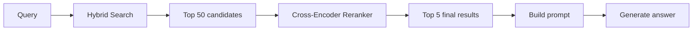
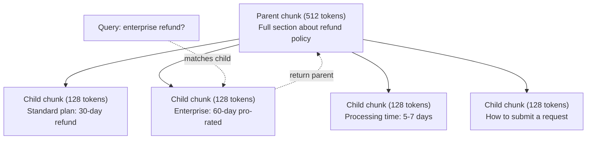
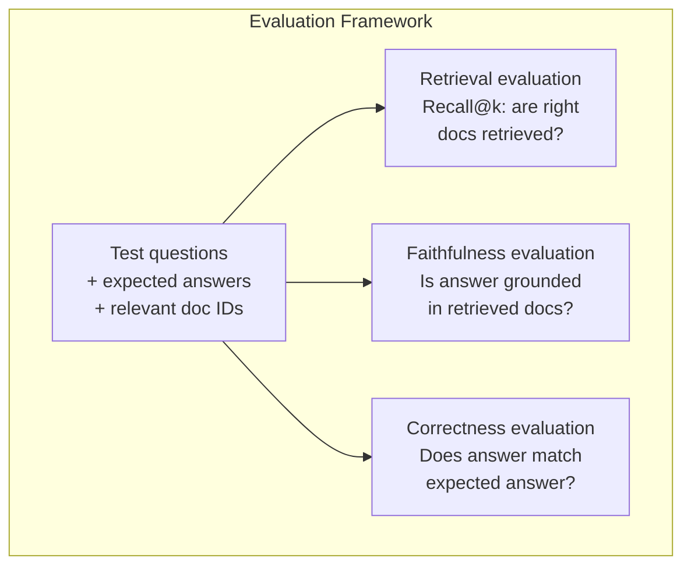

# RAG avancée ((Chunking、Renanking、Hybrid Search)

> Le RAG de base est le plus similaire à la partie top-k. Ceci est valable pour un simple problème. Mais face au raisonnement multi-hop, la requête est inefficace.

**类型：**Construction
**语言：**Python
**前置要求：**Phase 11, leçon 06 (RAG)
**时间：**- 90 minutes
**相关：**La phase 5 · 23 (Strategie de déchiquetage pour RAG) couvre les six types d'algorithmes de déchiquetage: récursif, sémantique, phrase, document parent, déchiquetage tardif, récupération contextuelle, et contient des critères de référence vectara/anthropique.

## Objectif de l'apprentissage

- 实现能够保留文档结构和上下文的先进分断策略 语义,回应, parent-enfant)
-  Construire un pipeline de recherche hybride, combiner le BM25 avec la recherche vectorielle sémantique et le réencodeur croisé 结合起来
- 应用 query transformation 技术(HyDE、multi-query、step-back), amélioration de la façon de voir ou de comprendre les problèmes
- 诊断并修复常见 RAG 失败:检索到错误块、答案不在背景 中、多跳推理 崩

##  problématique

Vous avez construit un pipeline RAG de base dans la leçon 06 . Il répond directement à des questions dans un petit corpus .

**模糊 query**:"Quel était le chiffre d'affaires au dernier trimestre?" Recherche sémantique  Returns sur la stratégie de revenus  projections de revenus, ainsi que le CFO sur la croissance des revenus                                                                                                                                                                                                                                      $47.2M in Q3 2025"，但使用的是 "earnings" 而不是 "revenue"。Embedding model 认为 "revenue strategy" 比 "Q3 earnings were $47,2M" plus près de la requête.

**Multi-hop question**:"Quelle équipe a eu la plus grande amélioration de la satisfaction client score?"

**大规模 corpus 问题**Vous avez deux millions de pièces. La réponse exacte est dans la pièce #1,847,293. Votre recherche de 5 premiers résultats a été tirée de la pièce #14; #89,201; #1,200,000; #44 et #901,333 . Elles se rapprochent dans l'espace de l'embedding, mais ne contiennent pas de réponse.

La raison de base de RAG  défaillance est la similitude vectorielle ≠ association ⋅ un morceau peut être en termes de signification similaire à la requête, mais pour répondre au problème n'a pas aidé ⋅ un RAG avancé utilise quatre techniques pour résoudre ce problème: recherche hybride ⋅ ajouter le parallèle de mots clés ⋅ réaffichage ⋅ plus en détail à un candidat 打分 ⋅ transformation de requête ⋅ dans la recherche ⋅ modification de requête ⋅ ainsi que de meilleur chunking ⋅ pour correspondre à la recherche de graisse ⋅

## 核心概念

### Recherche hybride: sémantique + mot clé

Recherche sémantique(Semblance vectorielle)擅长理解含义──"Comment annuler mon abonnement?" 即使与"Étapes pour mettre fin à votre plan" 没有共享单词,也能匹配──但它会漏掉精确匹配──"Code d'erreur E-4021"可能不能匹配包含"E-4021"的部分,因为嵌入式模型可能把它当作噪声──

La recherche de mots clés (BM25) est bien contre-indiquée. Elle est très bien conçue.

La recherche hybride va fonctionner simultanément, puis les résultats seront combinés.

**BM25**(Best Matching 25) est un algorithme de recherche de mots clés standard. Depuis les années 1990, il est toujours au cœur du moteur de recherche.

```
BM25(q, d) = sum over terms t in q:
    IDF(t) * (tf(t,d) * (k1 + 1)) / (tf(t,d) + k1 * (1 - b + b * |d| / avgdl))
```

Parmi eux, tf(t,d) est le terme t dans le document d) est la fréquence du terme d), IDF(t) est la fréquence du document inverse, le temps de l'exécution est la longueur du document, avgdl est la longueur moyenne du document, k1  contrôle le terme saturation de la fréquence(默认 1.2), b 控制 normalization de la longueur(默认 0.75)。

Comme on dit généralement: lorsque le document contient des termes de requête (en particulier des termes rares), le BM25 donne des résultats plus élevés, mais les résultats de la répétion diminuent.

### Fusion de rang réciproque (RRF)

Vous avez deux listes classées: une provenant de la recherche vectorielle, une provenant de BM25... Comment les assembler?

```
RRF_score(d) = sum over rankings R:
    1 / (k + rank_R(d))
```

Parmi eux, k est un nombre constant (habituellement 60), utilisé pour empêcher les résultats de classement de prendre trop d'avantage.

Une recherche vectorielle en classe 1 ≠ BM25 en classe 5 ≠ BM25 en classe 5 ≠ BM25 en classe 1 ≠ BM25 ≠ BM25 ≠ BM25 ≠ BM25 ≠ BM25 ≠ BM25 ≠ BM25 ≠ BM25 ≠ BM25 ≠ BM25 ≠ BM25 ≠ BM25 ≠ BM25 ≠ BM25 ≠ BM25 ≠ BM25 ≠ BM25 ≠ BM25 ≠ BM25 ≠ BM25 ≠ BM25 ≠ BM25 ≠ BM25 ≠ BM25 ≠ BM25 ≠ BM25 ≠ BM25 ≠ BM25 ≠ BM25 ≠ BM25 ≠ BM25 ≠ BM25 ≠ BM25 ≠ BM25 ≠ BM25 ≠ BM25 ≠ BM25 ≠ BM25 ≠ BM25 ≠ BM25 ≠ BM25 ≠ BM25 ≠ BM25 ≠ BM25 ≠ BM25 ≠ BM25 ≠ BM25 ≠ BM25 ≠ BM25 ≠ BM25 ≠ BM25 ≠ BM25 ≠ BM25 ≠ BM25 ≠ BM25 ≠ BM25 ≠ BM25 ≠ BM25 ≠ BM25 ≠ BM25 ≠ BM25 ≠ BM25 ≠ BM25 ≠ BM25 ≠ BM25 ≠ BM25 ≠ BM25 ≠ BM25 ≠ BM25 ≠ BM25 ≠ BM25 ≠ BM25 ≠ BM25 ≠ BM25 ≠ BM25 ≠ BM25                                                                                                                                                                                

Une recherche vectorielle en classe 3 , une recherche BM25 en classe 2 , un score de 1 / 60 + 3) + 1/(60 + 2) = 0,0159 + 0,0161 = 0,0320

RRF se comporte naturellement avec ces deux types de signaux. Un des deux classements les plus élevés obtient le meilleur score. Un des deux classements obtient le premier rang dans un certain classement, mais un des deux classements les plus défavorisés obtient un score moyen.

### Rencontre

Retrieval (en anglais seulement) rapide, mais pas assez précis. Il utilise un bi-encodeur: query 和 chaque document pour effectuer l'embedding, puis comparer.

Rencontre utilisant un encodeur croisé: requête et document candidat 会一起输入模型,模型输出相关性分数――模型能同时看到两段文本,因此可以捕捉它们之间的细粒度交互――Cross-encoder 能理解"Quels étaient les bénéfices du 3e trimestre?"

Le poids est: le cross-encoder est plus lent que le bi-encoder, 100 à 1000 fois plus lent, car il nécessite un traitement combiné de la paire requête-document.



常见 renquête du modèle(2026 阵容):
- Rencontre cohérente 3.5:API gérée,多语言,在混合 corpus 上 rappel gain le meilleur
- Rencontre de voyage-2.5:API gérée, latence dans les projets de gestion,
- Jina-Reranker-v2 Multilingue:ouvert, support 100+ 语言
- bge-renanker-v2-m3: poids ouvert, ligne de base forte
- - le codeur croisé/ms-marco-MiniLM-L-6-v2: poids ouvert, disponible sur le processeur, adapté au prototypage
- ColBERTv2 / Jina-ColBERT-v2: ré-ranger multi-vectoriel à interaction tardive, dans le temps de la révision sont des jetons O() et non des O(docs)

### Transformation de requête

Il y a des problèmes qui ne sont pas de récupération, mais de la recherche en elle-même. "Qu'est-ce que c'était que le changement de politique ?" est une mauvaise recherche.

**Query rewriting**:把用户查询 改写成更好的搜索查询――LLM Vous pouvez le faire:

```
User: "What was that thing about the new policy change?"
Rewritten: "Recent policy changes and updates"
```

**HyDE（Hypothetical Document Embeddings）**Il ne s'agit pas de rechercher, mais de trouver une réponse hypothétique, de la faire intégrer, puis de rechercher des documents réels similaires.

```
Query: "What is the refund policy for enterprise?"
Hypothetical answer: "Enterprise customers are eligible for a full refund
within 60 days of purchase. Refunds are pro-rated based on the remaining
subscription period and processed within 5-7 business days."
```

Pour une réponse hypothétique faire Embedding, et rechercher avec elle similaire de vrais documents.

HyDE 会在检索前增加一次LLM调调――这将增加500-2000ms latency――当原始查询检索质量较差时,这是值得的――

### Les parents et les enfants se déchirent

標準 chunking 迫使你做取舍: petite pièce utilisé pour la récupération précise, grande pièce utilisée pour fournir suffisamment de contexte。 parent-enfant chunking 消除了这个取舍──

索引小块(128 tokens) Pour récupération. Lorsque vous le retenez jusqu'à la petite partie, retirez la partie principale de la partie principale.



La requête "Remboursement d'entreprise?" 会精确匹配儿童部分 C2──但提示 收到的是完整的父母部分 P,其中包含关于处理时间和提交流程的周边背景──

### Filtrage des métadonnées

Dans le cadre de la recherche vectorielle, vous pouvez utiliser les métadonnées de votre corps: date, source, catégorie, auteur, langage.

"Qu'est-ce qui a changé dans la politique de sécurité le mois dernier?"  devrait seulement rechercher la dernière 30 天、security category 中的文档──en l'absence de filtrage des métadonnées, vous rechercherez l'ensemble du corpus, et vous pourrez peut-être rechercher un document de sécurité il y a 2 ans, simplement parce qu'il est en termes similaires──

Production RAG 系统会将元数据与每个块一个起存储:source document、创建日、类别、作者、版本。Vector database 支持在相似性搜索前按元数据 进行预过, ce qui est essentiel pour la performance à grande échelle。

### Évaluation

Vous avez construit un système RAG. Comment savoir si il est efficace ?

**Retrieval relevance（Recall@k）**Pour un groupe de questions de test avec des documents connexes connus, quelle est la proportion de documents connexes dans le top-k ?

**Faithfulness**Si la partie du retrait est écrite comme "fenêtre de remboursement de 60 jours", alors que le modèle répond "fenêtre de remboursement de 90 jours", c'est que la fidélité 失败── le modèle est encore hallucinant dans le contexte exact.

**Answer correctness**: est-ce que la réponse générée correspond à la réponse attendue ? c'est un indicateur de bout en bout.

Une simple fidélité 检查:取生成答案中的每个索赔,并验证它是否(实质上) apparaît dans le morceau récupéré.




```figure
agentic-rag-loop
```

## Construction

### 步骤 1:BM25  réalisation

```python
import math
from collections import Counter

class BM25:
    def __init__(self, k1=1.2, b=0.75):
        self.k1 = k1
        self.b = b
        self.docs = []
        self.doc_lengths = []
        self.avg_dl = 0
        self.doc_freqs = {}
        self.n_docs = 0

    def index(self, documents):
        self.docs = documents
        self.n_docs = len(documents)
        self.doc_lengths = []
        self.doc_freqs = {}

        for doc in documents:
            words = doc.lower().split()
            self.doc_lengths.append(len(words))
            unique_words = set(words)
            for word in unique_words:
                self.doc_freqs[word] = self.doc_freqs.get(word, 0) + 1

        self.avg_dl = sum(self.doc_lengths) / self.n_docs if self.n_docs else 1

    def score(self, query, doc_idx):
        query_words = query.lower().split()
        doc_words = self.docs[doc_idx].lower().split()
        doc_len = self.doc_lengths[doc_idx]
        word_counts = Counter(doc_words)
        score = 0.0

        for term in query_words:
            if term not in word_counts:
                continue
            tf = word_counts[term]
            df = self.doc_freqs.get(term, 0)
            idf = math.log((self.n_docs - df + 0.5) / (df + 0.5) + 1)
            numerator = tf * (self.k1 + 1)
            denominator = tf + self.k1 * (1 - self.b + self.b * doc_len / self.avg_dl)
            score += idf * numerator / denominator

        return score

    def search(self, query, top_k=10):
        scores = [(i, self.score(query, i)) for i in range(self.n_docs)]
        scores.sort(key=lambda x: x[1], reverse=True)
        return scores[:top_k]
```

### 步骤 2: fusion de rang réciproque

```python
def reciprocal_rank_fusion(ranked_lists, k=60):
    scores = {}
    for ranked_list in ranked_lists:
        for rank, (doc_id, _) in enumerate(ranked_list):
            if doc_id not in scores:
                scores[doc_id] = 0.0
            scores[doc_id] += 1.0 / (k + rank + 1)
    fused = sorted(scores.items(), key=lambda x: x[1], reverse=True)
    return fused
```

### 步骤 3: Pipeline de recherche hybride

```python
def hybrid_search(query, chunks, vector_embeddings, vocab, idf, bm25_index, top_k=5, fusion_k=60):
    query_emb = tfidf_embed(query, vocab, idf)
    vector_results = search(query_emb, vector_embeddings, top_k=top_k * 3)
    bm25_results = bm25_index.search(query, top_k=top_k * 3)
    fused = reciprocal_rank_fusion([vector_results, bm25_results], k=fusion_k)
    return fused[:top_k]
```

### 步骤 4: simple ré-ranger

Dans la production, vous utiliserez un modèle cross-encoder. Ici, nous construisons un réranqueur, en utilisant la superposition des mots, l'importance des termes et la correspondance des phrases.

```python
def rerank(query, candidates, chunks):
    query_words = set(query.lower().split())
    stop_words = {"the", "a", "an", "is", "are", "was", "were", "what", "how",
                  "why", "when", "where", "do", "does", "for", "of", "in", "to",
                  "and", "or", "on", "at", "by", "it", "its", "this", "that",
                  "with", "from", "be", "has", "have", "had", "not", "but"}
    query_terms = query_words - stop_words

    scored = []
    for doc_id, initial_score in candidates:
        chunk = chunks[doc_id].lower()
        chunk_words = set(chunk.split())

        term_overlap = len(query_terms & chunk_words)

        query_bigrams = set()
        q_list = [w for w in query.lower().split() if w not in stop_words]
        for i in range(len(q_list) - 1):
            query_bigrams.add(q_list[i] + " " + q_list[i + 1])
        bigram_matches = sum(1 for bg in query_bigrams if bg in chunk)

        position_boost = 0
        for term in query_terms:
            pos = chunk.find(term)
            if pos != -1 and pos < len(chunk) // 3:
                position_boost += 0.5

        rerank_score = (
            term_overlap * 1.0
            + bigram_matches * 2.0
            + position_boost
            + initial_score * 5.0
        )
        scored.append((doc_id, rerank_score))

    scored.sort(key=lambda x: x[1], reverse=True)
    return scored
```

### 步骤 5:HyDE(Inpégés hypothétiques du document)

```python
def hyde_generate_hypothesis(query):
    templates = {
        "what": "The answer to '{query}' is as follows: Based on our documentation, {topic} involves specific policies and procedures that define how the process works.",
        "how": "To address '{query}': The process involves several steps. First, you need to initiate the request. Then, the system processes it according to the defined rules.",
        "default": "Regarding '{query}': Our records indicate specific details and policies related to this topic that provide a comprehensive answer."
    }
    query_lower = query.lower()
    if query_lower.startswith("what"):
        template = templates["what"]
    elif query_lower.startswith("how"):
        template = templates["how"]
    else:
        template = templates["default"]

    topic_words = [w for w in query.lower().split()
                   if w not in {"what", "is", "the", "how", "do", "does", "a", "an",
                                "for", "of", "to", "in", "on", "at", "by", "and", "or"}]
    topic = " ".join(topic_words) if topic_words else "this topic"

    return template.format(query=query, topic=topic)


def hyde_search(query, chunks, vector_embeddings, vocab, idf, top_k=5):
    hypothesis = hyde_generate_hypothesis(query)
    hypothesis_emb = tfidf_embed(hypothesis, vocab, idf)
    results = search(hypothesis_emb, vector_embeddings, top_k)
    return results, hypothesis
```

### 步骤 6: Parent-Child Chunking

```python
def create_parent_child_chunks(text, parent_size=200, child_size=50):
    words = text.split()
    parents = []
    children = []
    child_to_parent = {}

    parent_idx = 0
    start = 0
    while start < len(words):
        parent_end = min(start + parent_size, len(words))
        parent_text = " ".join(words[start:parent_end])
        parents.append(parent_text)

        child_start = start
        while child_start < parent_end:
            child_end = min(child_start + child_size, parent_end)
            child_text = " ".join(words[child_start:child_end])
            child_idx = len(children)
            children.append(child_text)
            child_to_parent[child_idx] = parent_idx
            child_start += child_size

        parent_idx += 1
        start += parent_size

    return parents, children, child_to_parent
```

### 步骤 7: Évaluation de la fidélité

```python
def evaluate_faithfulness(answer, retrieved_chunks):
    answer_sentences = [s.strip() for s in answer.split(".") if len(s.strip()) > 10]
    if not answer_sentences:
        return 1.0, []

    grounded = 0
    ungrounded = []
    context = " ".join(retrieved_chunks).lower()

    for sentence in answer_sentences:
        words = set(sentence.lower().split())
        stop_words = {"the", "a", "an", "is", "are", "was", "were", "and", "or",
                      "to", "of", "in", "for", "on", "at", "by", "it", "this", "that"}
        content_words = words - stop_words
        if not content_words:
            grounded += 1
            continue

        matched = sum(1 for w in content_words if w in context)
        ratio = matched / len(content_words) if content_words else 0

        if ratio >= 0.5:
            grounded += 1
        else:
            ungrounded.append(sentence)

    score = grounded / len(answer_sentences) if answer_sentences else 1.0
    return score, ungrounded


def evaluate_retrieval_recall(queries_with_relevant, retrieval_fn, k=5):
    total_recall = 0.0
    results = []

    for query, relevant_indices in queries_with_relevant:
        retrieved = retrieval_fn(query, k)
        retrieved_indices = set(idx for idx, _ in retrieved)
        relevant_set = set(relevant_indices)
        hits = len(retrieved_indices & relevant_set)
        recall = hits / len(relevant_set) if relevant_set else 1.0
        total_recall += recall
        results.append({
            "query": query,
            "recall": recall,
            "hits": hits,
            "total_relevant": len(relevant_set)
        })

    avg_recall = total_recall / len(queries_with_relevant) if queries_with_relevant else 0
    return avg_recall, results
```

## Utilisation

Utiliser un véritable cross-encoder pour effectuer un ré-rangement:

```python
from sentence_transformers import CrossEncoder

reranker = CrossEncoder("cross-encoder/ms-marco-MiniLM-L-6-v2")

def rerank_with_cross_encoder(query, candidates, chunks, top_k=5):
    pairs = [(query, chunks[doc_id]) for doc_id, _ in candidates]
    scores = reranker.predict(pairs)
    scored = list(zip([doc_id for doc_id, _ in candidates], scores))
    scored.sort(key=lambda x: x[1], reverse=True)
    return scored[:top_k]
```

Utilisez le ré-ranger géré par Cohere:

```python
import cohere

co = cohere.Client()

def rerank_with_cohere(query, candidates, chunks, top_k=5):
    docs = [chunks[doc_id] for doc_id, _ in candidates]
    response = co.rerank(
        model="rerank-english-v3.0",
        query=query,
        documents=docs,
        top_n=top_k
    )
    return [(candidates[r.index][0], r.relevance_score) for r in response.results]
```

Utilisation de la licence de droit en ligne 实现 HyDE:

```python
import anthropic

client = anthropic.Anthropic()

def hyde_with_llm(query):
    response = client.messages.create(
        model="claude-sonnet-4-20250514",
        max_tokens=256,
        messages=[{
            "role": "user",
            "content": f"Write a short paragraph that would be a good answer to this question. Do not say you don't know. Just write what the answer would look like.\n\nQuestion: {query}"
        }]
    )
    return response.content[0].text
```

Utilisation de la recherche hybride de production:

```python
import weaviate

client = weaviate.connect_to_local()

collection = client.collections.get("Documents")
response = collection.query.hybrid(
    query="enterprise refund policy",
    alpha=0.5,
    limit=10
)
```

alpha 参数控制平衡:0.0 = 纯关键词(BM25),1.0 = 纯向量,0.5 = 等权重── la plupart des systèmes de production utilisent alpha entre 0,3 à 0,7 ──

## 交付

Le cours est ouvert à:
- `outputs/prompt-advanced-rag-debugger.md`-- pour le diagnostic et la réparation des problèmes de qualité RAG
- `outputs/skill-advanced-rag.md`-- pour construire des compétences RAG de qualité de production avec recherche hybride et réévaluation

## 练习

1. Dans le document d'échantillon, comparez BM25、Véctor search 和 hybrid search。 Pour chacune des 5 requêtes de test, enregistrer quelles méthodes sont utilisées pour retourner la partie la plus pertinente。La recherche hybride doit gagner au moins 3 ∼ sur 5 ∼

2. 实现 metadata filter──为每个文件 添加一个"category" 字段(security、billing、api、product)──在运行矢量搜索 前,只过出相关类别的部分──用"Quel chiffrement est utilisé?" 测试,并验证它只搜索安全类别的部分──

3. Utilisation de la fonction simple générateur de leçon 06 en utilisant la fonction simple générateur de leçon de leçon 06 en utilisant le système HyDE.

4. Dans le document d'échantillon, la stratégie de décomposition parent-enfant est mise en œuvre. Utilisez le décomposition enfant_size=30 et parent_size=100. Utilisez le décomposition enfant  recherche, mais rapidement retournez le décomposition parent.

5. 创建评估数据集:10 个问题,带已知答案分别测量 (a) 仅 Vector search,(b) 仅 BM25,(c) 仅 BM25,(d) 混合搜索,(d) 混合+重排的 Recall@3、Recall@5 和 Recall@10──绘制结果,并识别重排 最有帮助的位置──

## 关键术语

| Term | 人们通常怎么说 | 实际含义 |
|------|----------------|----------------------|
| BM25 | "Keyword search" | 一种概率排序算法，根据 term frequency、inverse document frequency 和 document length normalization 给文档打分 |
| Hybrid search | "Best of both worlds" | 并行运行 semantic（Vector）search 和 keyword（BM25）search，然后用 rank fusion 合并结果 |
| Reciprocal Rank Fusion | "Merge ranked lists" | 对每个文档在所有列表中的 1/(k + rank) 求和，从而组合多个 ranked list |
| Reranking | "Second pass scoring" | 使用成本更高的 cross-encoder model，对 initial retrieval 得到的 candidate set 重新打分 |
| Cross-encoder | "Joint query-document model" | 将 query 和 document 作为单个输入并生成相关性分数的模型；比 bi-encoder 更准确，但对 full corpus search 来说太慢 |
| Bi-encoder | "Independent embedding model" | 独立对 query 和 document 做 Embedding 的模型；由于 Embedding 可预计算，因此速度快，但不如 cross-encoder 准确 |
| HyDE | "Search with a fake answer" | 为 query 生成 hypothetical answer，对其做 Embedding，并搜索与它相似的真实文档 |
| Parent-child chunking | "Small search, big context" | 为精确 retrieval 索引小 chunk，但返回更大的 parent chunk 以提供足够 context |
| Metadata filtering | "Narrow before searching" | 在运行 Vector search 前，根据属性（date、source、category）过滤文档以缩小搜索空间 |
| Faithfulness | "Did it stay grounded" | 生成答案是否由 retrieved document 支持，而不是来自模型训练数据的 hallucination |

## 延伸阅读

- Robertson & Zaragoza, "Le cadre de la pertinence probabiliste: BM25 et au-delà" (2009) -- BM25's authority reference, expliquer la formule derrière la base de probabilité
- Cormack et coll., " La fusion de rang réciproque surpasse les méthodes d'apprentissage du condorcet et du rang individuel " (2009) -- RRF 原始论文,展示它优于更复杂的融合方法
- Gao et coll., "Récupération précise de la densité de tir zéro sans étiquettes de pertinence" (2022) -- HyDE 论文, prouvant un document hypothétique Embedding peut améliorer la récupération sans aucune formation
- Nogueira & Cho, "Passage Re-ranking with BERT" (2019) -- 展示在 BM25 之上 effectuer un ré-ranking croisé de codeur 能显著提升检索质
- [Khattab et al., "DSPy: Compiling Declarative Language Model Calls into Self-Improving Pipelines" (2023)](https://arxiv.org/abs/2310.03714)-- va la construction rapide et la sélection de poids 视为检索管道 上的优化问题; lire cet article pour comprendre "programme LLM", plutôt que "prompt LLM".
- [Edge et al., "From Local to Global: A Graph RAG Approach to Query-Focused Summarization" (Microsoft Research 2024)](https://arxiv.org/abs/2404.16130)-- GraphRAG 论文: extraction de relations entre entités + détection de la communauté de Leiden, pour une résumé axée sur la requête; ainsi que la récupération globale par rapport à la récupération locale.
- [Asai et al., "Self-RAG: Learning to Retrieve, Generate, and Critique through Self-Reflection" (ICLR 2024)](https://arxiv.org/abs/2310.11511)-- 带 reflection tokens 的自评估 RAG;静态 récupérer- puis générer 后后的代理前沿──
- [LangChain Query Construction blog](https://blog.langchain.dev/query-construction/)-- 如何将自然语言查询 转换为结构数据库查询(Text-to-SQL、Cypher), en tant qu'étape de pré-récupération。
