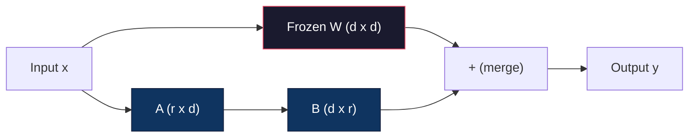
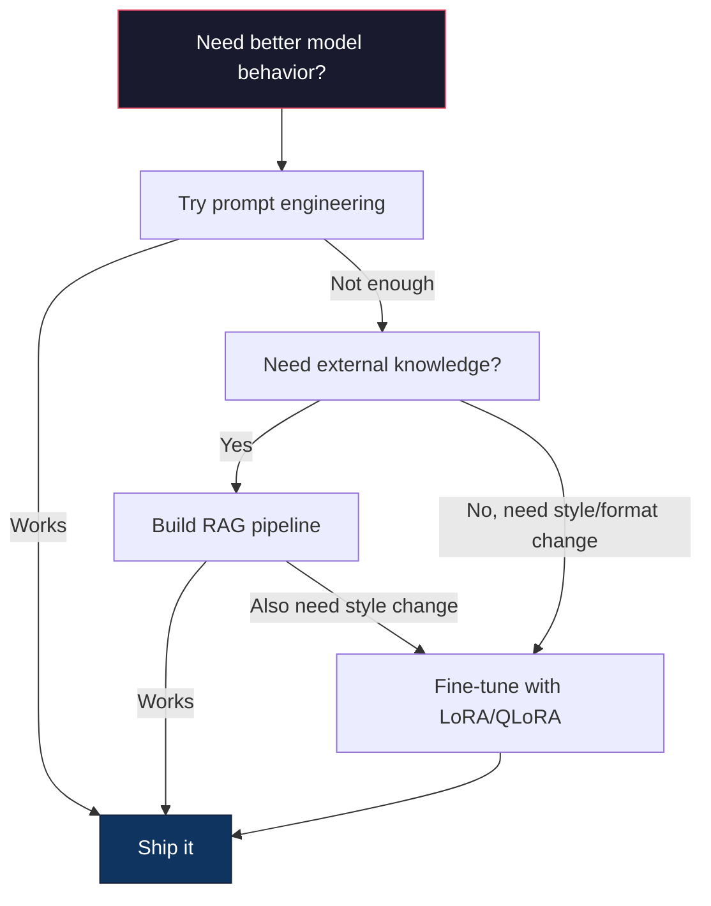

# Utiliser LoRA et QLoRA  effectuer une mise à jour fine

> Pour un modèle 7B faire une mise à jour complète  nécessite 56 Go de VRAM── vous n'avez pas autant── la plupart des entreprises ne possèdent pas non plus── LoRA                                                                                                                                                                                                                                                                                                                                                                                                                                                                                   

**Type:** Build
**Languages:** Python
**Prerequisites:** Phase 10, Lesson 06 (Instruction Tuning / SFT)
**Time:** ~75 minutes
**Related:**La phase 10 de la phase 10 de la phase de démarrage de la phase de démarrage de la phase de démarrage de la phase de démarrage de la phase de démarrage de la phase de démarrage de la phase de démarrage de la phase de démarrage de la phase de démarrage de la phase de démarrage de la phase de démarrage de la phase de démarrage de la phase de démarrage de la phase de démarrage de la phase de démarrage de la phase de démarrage de la phase de démarrage de la phase de démarrage de la phase de démarrage de la phase de démarrage de la phase de démarrage de la phase de démarrage de la phase de démarrage de la phase de démarrage de démarrage de la phase de démarrage de démarrage de la phase de démarrage de démarrage de la phase de démarrage de démarrage de la phase de démarrage de démarrage de la phase de démarrage de démarrage de démarrage de la phase de démarrage de démarrage de démarrage de la phase de démarrage de démarrage de démarrage de la phase de démarrage de démarrage de démarrage de la phase de démarrage de démarrage de démarrage de démarrage de la phase de démarrage de démarrage de démarrage de la phase de démarrage de démarrage de démarrage de démarrage de la phase de démarrage de démarrage de démarrage de démarrage de la phase de démarrage de démarrage de démarrage de démarrage de la phase de démarrage de démarrage de démarrage de démarrage de la phase de démarrage de démarrage de démarrage de démarrage de la phase de démarrage de démarrage de démarrage de la phase de démarrage de démarrage de démarrage de démarrage de la phase de démarrage de démarrage de démarrage de démarrage de la phase de démarrage de la phase de démarrage de démarrage de démarrage de démarrage de la phase de démarrage de démarrage de démarrage de la phase de

## Objectif de l'apprentissage
- 通过将低排适配矩阵(A 和 B) Inject dans les couches d'attention du modèle prétrainé pour réaliser LoRA
- 計算 LoRA 相比全细调的参数节省:rank r、d_model 维度时, entraînement est de 2*r*d 个参数, plutôt que d^2
- Utilisez QLoRA(4 bits de base quantifiée + adaptateurs LoRA) fine-tune un modèle, en faisant adaptation à la mémoire GPU de niveau
- Pour déployer, comparer les adaptateurs avec les adaptateurs sans

##  problématique
Vous avez un modèle de base. Vous voulez que cela utilise le langage de votre entreprise pour répondre aux demandes de soutien des clients.

Dans le fp16, chaque paramètre représente 2 octets. Pendant l'entraînement, vous avez besoin de gradients (16 Go) ‒ les états d'optimisation d'Adam ‒ momentum + variance ‒ 32 Go) ‒ ainsi que des activations ‒.

A100 80 Go 勉强能装下──两张 A100 Dans les fournisseurs de cloud 上每小时花费 $3-4。用 50,000 个样本训练 3 个 epochs 需要 6-10 小时。每次实验就是 $Pour régler les hyperparametres, on a fait 10 expériences, on a déjà dépensé 400 $ avant de déployer quoi que ce soit.

Si vous le développez à Llama 3 70B, le chiffre deviendra dérisoire.

Il y a aussi un problème plus profond. Le réglage complet du modèle sera modifié. Chaque poids du modèle sera modifié. Si vous réglez les données de support client, vous risquez de compromettre la capacité générale du modèle.

Vous avez besoin d'une méthode: entraîner moins de paramètres, utiliser moins de mémoire et ne pas détruire le modèle  déjà connues.

## 概念
### L'adaptation à un niveau inférieur

Edward Hu et ses collègues de Microsoft ont publié en juin 2021 LoRA。 un article intitulé Insight is:fine-tuning period weight updates with low internal rank。you don't need to update a 4096x4096 weight matrix.

Un niveau de calcul est le niveau de calcul.

```
y = Wx
```

Parmi eux, W est une matrice d_out x d_in. Pour une projection d'attention de 4096x4096, c'est 16,777,216 个参数.

LoRA 结 W,并添加一个低排分解:

```
y = Wx + BAx
```

Parmi eux, B est (d_out x r), A est (r x d_in)。rangement r 远小于 d -- habituellement 8、16 ou 32。

Pour la couche 4096x4096 supérieure de r = 16:
- Parmi les éléments de base:
- Le nombre de points de vente est de 4096 x 16) + (16 x 4096) = 65 536 + 65 536 = 131 072
- réduction du pourcentage: 131,072 / 16,777,216 = 0,78%

Vous avez obtenu des résultats de formation de 0,78%, mais de 95 à 100%.



Un usage随机 Gaussian 初始化──B 初始化为零── ce qui signifie contribution LoRA de zéro - modèle de comportement initial commencer à s'entraîner, puis progressivement apprendre à s'adapter──

### Le facteur d'échelle: Alpha

LoRA introduit un facteur d'échelle alpha, pour contrôler la mise à jour des niveaux de production:

```
y = Wx + (alpha / r) * BAx
```

Lorsque alpha = r 时, l'échelle est 1x。当 alpha = 2r(常见默认值)

实践建议:
- alpha = 2 * rang est habituel
- alpha = rang  fournir 1x d'échelle, conservé mais stable
- L'alpha plus élevé signifie que chaque étape plus de mises à jour, peut accélérer les recettes, peut également entraîner une instabilité

### Où appliquer le LoRA

Un transformateur a de nombreuses couches linéaires. Vous n'avez pas besoin de donner toutes les couches.

| Target Layers | Trainable Params (7B) | Quality |
|--------------|----------------------|---------|
| q_proj only | 4.7M | 好 |
| q_proj + v_proj | 9.4M | 更好 |
| q_proj + k_proj + v_proj + o_proj | 18.9M | 对 attention 最好 |
| All linear (attention + MLP) | 37.7M | 边际收益，参数量 2x |

La plupart des tâches sont sucrées: q_proj + v_proj。 Ceci se produit en se concentrant sur la requête et les projections de valeur, elles contrôlent le modèle 关注什么以及提取什么信息── ajouter des couches de MLP pour la génération de codes et autres tâches complexes est utile, mais permet de doubler le nombre de participants, et les bénéfices pour les tâches simples sont réduits──

### Sélection de rang

Rangour de l'adaptation  contrôle

| Rank | Trainable Params (per layer) | Best For |
|------|---------------------------|----------|
| 4 | 32,768 | 简单 classification、sentiment |
| 8 | 65,536 | 单领域 Q&A、summarization |
| 16 | 131,072 | 多领域任务、instruction following |
| 32 | 262,144 | 复杂 reasoning、代码生成 |
| 64 | 524,288 | 大多数任务收益递减 |
| 128 | 1,048,576 | 很少值得使用 |

Hu et al. ont montré que, pour les tâches simples, r=4  déjà capable de capturer la plupart des adaptations ⋅r=8 和 r=16                                                                                                                                                                                                                                                                                                                                                                                                                                                                                       

### QLoRA: Quantification à 4 bits + LoRA

Tim Dettmers et ses collègues de l'Université de Washington ont publié QLoRA en mai 2023[6].

Cela va changer la mémoire.

| Method | Weight Memory (7B) | Training Memory (7B) | GPU Required |
|--------|-------------------|---------------------|-------------|
| Full fine-tune (fp16) | 14GB | ~56GB | 1x A100 80GB |
| LoRA (fp16 base) | 14GB | ~18GB | 1x A100 40GB |
| QLoRA (4-bit base) | 3.5GB | ~6GB | 1x RTX 3090 24GB |

QLoRA a trois contributions techniques:

**NF4 (Normal Float 4-bit)**Un nouveau type de données est conçu pour les poids de réseaux neuronaux. Les poids de réseaux neuronaux sont très conformes à la distribution normale.

**Double quantization**Pour le modèle 7B, cette augmentation de 0,4 Go sera réalisée à deux reprises. La quantification quantifiera ces constantes jusqu'à fp8, réduira les charges générales à 0,1 Go.

**Paged optimizers**Pendant la formation, l'optimisateur de longue séquence états ((Adam's momentum 和 variance) peut dépasser la mémoire GPU。 Optimisateurs de page utilisant la mémoire unifiée NVIDIA, en utilisant la mémoire GPU 耗尽时自动把优化器状态 page到CPU RAM,并在需要时页回来──这能避免OOM crashes,代价是一些吞吐量──

### La question de la qualité

減参数或量化基会损害质量吗?多篇论文的结果:

| Method | MMLU (5-shot) | MT-Bench | HumanEval |
|--------|--------------|----------|-----------|
| Full fine-tune (Llama 2 7B) | 48.3 | 6.72 | 14.6 |
| LoRA r=16 | 47.9 | 6.68 | 14.0 |
| QLoRA r=16 (NF4) | 47.5 | 6.61 | 13.4 |
| QLoRA r=64 (NF4) | 48.1 | 6.70 | 14.2 |

Le LORA en r=16 ⋅ est en majorité comparable à la réglage complet, mais il utilise moins de 90% de mémoire.

### Coûts réels

Dans 50 000 个样本, sur la mise à jour de la Llama 3 8B(3 époques):

| Method | GPU | Time | Cost |
|--------|-----|------|------|
| Full fine-tune | 2x A100 80GB | 8 hours | ~$32 |
| LoRA r=16 | 1x A100 40GB | 4 hours | ~$8 |
| QLoRA r=16 | 1x RTX 4090 24GB | 6 hours | ~$5 |
| QLoRA r=16 (Unsloth) | 1x RTX 4090 24GB | 2.5 hours | ~$2 |
| QLoRA r=16 | 1x T4 16GB | 12 hours | ~$4 |

C'est pourquoi le réglage de la communauté à poids ouvert a commencé en 2023, et c'est aussi pourquoi chaque cadre de formation suivant fournira de manière implicite QLoRA en 2026.

### La pile PEFT 2026

| Framework | What it is | Pick when |
|-----------|-----------|-----------|
| **Hugging Face PEFT** | 规范的 LoRA/QLoRA/DoRA/IA3 library | 你想要原始控制权，并且 training loop 已经基于 `transformers.Trainer` |
| **TRL** | HF 的 reinforcement-from-feedback trainers（SFT, DPO, GRPO, PPO, ORPO） | 你在 SFT 后需要 DPO/GRPO；构建在 PEFT 之上 |
| **Unsloth** | forward/backward pass 的 Triton-kernel 重写 | 你想要 2-5x 加速 + 一半 VRAM 且无 accuracy loss；Llama/Mistral/Qwen 系列 |
| **Axolotl** | PEFT + TRL + DeepSpeed + Unsloth 之上的 YAML-config wrapper | 你想要可复现、版本控制的 training runs |
| **LLaMA-Factory** | PEFT + TRL 之上的 GUI/CLI/API | 你想要 zero-code fine-tuning；支持 100+ model families |
| **torchtune** | Native PyTorch recipes，无 `transformers` 依赖 | 你想要最少依赖，且组织已经标准化使用 PyTorch |

经验法则:研究用途或一次性实验 → PEFT──可重复的生产管 line── activation de l'axolotl du noyau d'Unsloth──一次性原型── LLaMA-Factory──

### Les adaptateurs de fusion

Après l'entraînement, vous avez deux choses: un modèle de base et un petit adaptateur LoRA (généralement 10 à 100 Mo)

1. **保持分离**: Charger un modèle de base, en lui charger un adaptateur.

2. **永久合并**: calcul W' = W + (alpha/r) * BA,并把结果保存为一个新的完整模型──merged model与原始模型大小相同──没有推断过head──没有适配器 需要管理──

Si vous déployez un modèle spécial, alors vous pouvez utiliser un modèle spécial.

Utilisation de la fusion de plusieurs adaptateurs:

- **TIES-Merging**(Yadav et coll. 2023): taille taille 参数, résoudre les conflits de signes, puis合并── réduire les adaptateurs 之间的干扰──
- **DARE**(Yu et coll. 2023): en fusionant les paramètres de l'adaptateur, il est redéfinit et réduit à la partie restante.
- **Task arithmetic**: directement augmenter et réduire les poids de l'adaptateur.

### Quand ne pas régler

Le réglage est le troisième choix, pas le premier.

**第一：prompt engineering。**写一个更好的系统提示――加入几个镜头例子――使用链条思想――这没有成本,只需几分钟――如果提示已经能达到80%,你可能不需要细调――

**第二：RAG。**Si le modèle a besoin de connaître vos données spécifiques, les documents, la base de connaissances, le catalogue des produits, la récupération en fait plus facile, plus facile à maintenir.

**第三：fine-tuning。**Lorsque vous avez besoin de modèle  adopter un style spécifique format ou motif de raisonnement, et de la mise en œuvre  incapable de réaliser  utiliser ⋅ lorsque vous avez besoin de cohérence de sortie structurée ⋅ lorsque vous avez besoin de mettre un modèle plus grand distiller à un modèle plus petit ⋅ lorsque la latence ⋅ est importante, et vous assurez pas de quelques coups de mise en œuvre ⋅ apporté des jetons supplémentaires ⋅ lorsque




```figure
lora-params
```

## - Je le construis.
Nous utilisons PyTorch pur de zéro pour réaliser LoRA. Pas de bibliothèque. Pas de magie. Vous construirez la couche LoRA, vous l'injecterez dans un modèle, vous l'entraînerez, vous la peserez.

### 步骤 1: La couche de la LoRA

```python
import torch
import torch.nn as nn
import math

class LoRALayer(nn.Module):
    def __init__(self, in_features, out_features, rank=8, alpha=16):
        super().__init__()
        self.rank = rank
        self.alpha = alpha
        self.scaling = alpha / rank

        self.A = nn.Parameter(torch.randn(in_features, rank) * (1 / math.sqrt(rank)))
        self.B = nn.Parameter(torch.zeros(rank, out_features))

    def forward(self, x):
        return (x @ self.A @ self.B) * self.scaling
```

Un usage diminué après un début de valeur de valeur de la valeur de la valeur de la valeur de la valeur de la valeur de la valeur de la valeur de la valeur de la valeur de la valeur de la valeur de la valeur de la valeur de la valeur de la valeur de la valeur de la valeur de la valeur de la valeur de la valeur de la valeur de la valeur de la valeur de la valeur de la valeur de la valeur de la valeur de la valeur de la valeur de la valeur de la valeur de la valeur de la valeur de la valeur de la valeur de la valeur de la valeur de la valeur de la valeur de la valeur de la valeur de la valeur de la valeur de la valeur de la valeur de la valeur de la valeur de la valeur de la valeur de la valeur de la valeur de la valeur de la valeur de la valeur de la valeur de la valeur de la valeur de la valeur de la valeur de la valeur de la valeur de la valeur de la valeur de la valeur de la valeur de la valeur de la valeur de la valeur de la valeur de la valeur de la valeur de la valeur de la valeur de la valeur de la valeur de la valeur de la valeur de la valeur de la valeur de la valeur de la valeur de la valeur de la valeur de la valeur de la valeur de la valeur de la valeur de la valeur de la valeur de la valeur de la valeur de la valeur de la valeur de la valeur de la valeur de la valeur de la valeur de la valeur de la valeur de la valeur de la valeur de la valeur de la valeur de la valeur de la valeur de la valeur de la valeur de la valeur de la valeur de la valeur de la valeur de la valeur de la valeur de la valeur de la valeur de la valeur de la valeur de la valeur de la valeur de la valeur de la valeur de la valeur de la valeur de la valeur de la valeur de la valeur de la valeur de la valeur de la valeur de la valeur de la valeur de la valeur de la valeur de la valeur de la valeur de la valeur de la valeur de la valeur de la valeur de la valeur de la valeur de la valeur de la valeur de la valeur de la valeur de la valeur de la valeur de la valeur de la valeur de la valeur de la valeur de la valeur de la valeur de la valeur de la valeur de la valeur de la valeur de la valeur de la valeur de la valeur de la valeur de la valeur de la valeur de la valeur de la valeur de la valeur de

### 步骤 2: couche linéaire enveloppée en LoRA

```python
class LinearWithLoRA(nn.Module):
    def __init__(self, linear, rank=8, alpha=16):
        super().__init__()
        self.linear = linear
        self.lora = LoRALayer(
            linear.in_features, linear.out_features, rank, alpha
        )

        for param in self.linear.parameters():
            param.requires_grad = False

    def forward(self, x):
        return self.linear(x) + self.lora(x)
```

La couche linéaire initiale est mise en place.

### 步骤 3: Injecter du LoRA dans un modèle

```python
def inject_lora(model, target_modules, rank=8, alpha=16):
    for param in model.parameters():
        param.requires_grad = False

    lora_layers = {}
    for name, module in model.named_modules():
        if isinstance(module, nn.Linear):
            if any(t in name for t in target_modules):
                parent_name = ".".join(name.split(".")[:-1])
                child_name = name.split(".")[-1]
                parent = dict(model.named_modules())[parent_name]
                lora_linear = LinearWithLoRA(module, rank, alpha)
                setattr(parent, child_name, lora_linear)
                lora_layers[name] = lora_linear
    return lora_layers
```

首先,结模型中每个参数──然后穿越模型树,找到与你的目标名匹配的线性层,并使用LoRA-wrapped 版本替换它们──LoRA A和B matrices sont les seules paramètres entraînables dans l'ensemble du modèle──

### 步骤 4: Compte des paramètres

```python
def count_parameters(model):
    total = sum(p.numel() for p in model.parameters())
    trainable = sum(p.numel() for p in model.parameters() if p.requires_grad)
    frozen = total - trainable
    return {
        "total": total,
        "trainable": trainable,
        "frozen": frozen,
        "trainable_pct": 100 * trainable / total if total > 0 else 0
    }
```

### 步骤 5: Rejoindre les poids

```python
def merge_lora_weights(model):
    for name, module in model.named_modules():
        if isinstance(module, LinearWithLoRA):
            with torch.no_grad():
                merged = (
                    module.lora.A @ module.lora.B
                ) * module.lora.scaling
                module.linear.weight.data += merged.T
            parent_name = ".".join(name.split(".")[:-1])
            child_name = name.split(".")[-1]
            if parent_name:
                parent = dict(model.named_modules())[parent_name]
            else:
                parent = model
            setattr(parent, child_name, module.linear)
```

合并后,LoRA couches 消失──model 与原始模型 大小相同,adaptation 被进重量──没有推断过费──

### 步骤 6: Simulation de la quantification de QLoRA

```python
def quantize_to_nf4(tensor, block_size=64):
    blocks = tensor.reshape(-1, block_size)
    scales = blocks.abs().max(dim=1, keepdim=True).values / 7.0
    scales = torch.clamp(scales, min=1e-8)
    quantized = torch.round(blocks / scales).clamp(-8, 7).to(torch.int8)
    return quantized, scales

def dequantize_from_nf4(quantized, scales, original_shape):
    dequantized = quantized.float() * scales
    return dequantized.reshape(original_shape)
```

Ceci en utilisant des poids 映射到每64 元素块 内的16 离散级别 来模拟4位量化──生产级 QLoRA 采用位数字节库 在 GPU 上实现真正的NF4──

### 步骤 7: cycle d'entraînement

```python
def train_lora(model, data, epochs=5, lr=1e-3, batch_size=4):
    optimizer = torch.optim.AdamW(
        [p for p in model.parameters() if p.requires_grad], lr=lr
    )
    criterion = nn.MSELoss()

    losses = []
    for epoch in range(epochs):
        epoch_loss = 0.0
        n_batches = 0
        indices = torch.randperm(len(data["inputs"]))

        for i in range(0, len(indices), batch_size):
            batch_idx = indices[i:i + batch_size]
            x = data["inputs"][batch_idx]
            y = data["targets"][batch_idx]

            output = model(x)
            loss = criterion(output, y)

            optimizer.zero_grad()
            loss.backward()
            optimizer.step()

            epoch_loss += loss.item()
            n_batches += 1

        avg_loss = epoch_loss / n_batches
        losses.append(avg_loss)

    return losses
```

### 步骤 8: Démo complète

```python
def demo():
    torch.manual_seed(42)
    d_model = 256
    n_classes = 10

    model = nn.Sequential(
        nn.Linear(d_model, 512),
        nn.ReLU(),
        nn.Linear(512, 512),
        nn.ReLU(),
        nn.Linear(512, n_classes),
    )

    n_samples = 500
    x = torch.randn(n_samples, d_model)
    y = torch.randint(0, n_classes, (n_samples,))
    y_onehot = torch.zeros(n_samples, n_classes).scatter_(1, y.unsqueeze(1), 1.0)

    data = {"inputs": x, "targets": y_onehot}

    params_before = count_parameters(model)

    lora_layers = inject_lora(
        model, target_modules=["0", "2"], rank=8, alpha=16
    )

    params_after = count_parameters(model)

    losses = train_lora(model, data, epochs=20, lr=1e-3)

    merge_lora_weights(model)
    params_merged = count_parameters(model)

    return {
        "params_before": params_before,
        "params_after": params_after,
        "params_merged": params_merged,
        "losses": losses,
    }
```

Cette démo  Créer un petit modèle, insérer LoRA dans deux couches, l'entraîner,并把重量 合并回去──paramètres calculés de la formation complète 降低到 LoRA training 期间约1% entraîné, puis dans la combinaison revenir à l'architecture originale──

## Utilisez-le
Dans le mode Face embrasée, pour le modèle réel, utilisez LoRA approximativement 20 行:

```python
from transformers import AutoModelForCausalLM, AutoTokenizer
from peft import LoraConfig, get_peft_model, TaskType

model = AutoModelForCausalLM.from_pretrained("meta-llama/Llama-3.1-8B")
tokenizer = AutoTokenizer.from_pretrained("meta-llama/Llama-3.1-8B")

lora_config = LoraConfig(
    task_type=TaskType.CAUSAL_LM,
    r=16,
    lora_alpha=32,
    lora_dropout=0.05,
    target_modules=["q_proj", "v_proj"],
)

model = get_peft_model(model, lora_config)
model.print_trainable_parameters()
```

 Pour QLoRA, ajouter la quantification des bits et des bytes:

```python
from transformers import BitsAndBytesConfig

bnb_config = BitsAndBytesConfig(
    load_in_4bit=True,
    bnb_4bit_quant_type="nf4",
    bnb_4bit_compute_dtype=torch.bfloat16,
    bnb_4bit_use_double_quant=True,
)

model = AutoModelForCausalLM.from_pretrained(
    "meta-llama/Llama-3.1-8B",
    quantization_config=bnb_config,
    device_map="auto",
)

model = get_peft_model(model, lora_config)
```

On peut donc utiliser les mêmes modèles de base, les mêmes modèles de formation, les mêmes modèles de base, les mêmes modèles de formation, les mêmes modèles de base, les mêmes modèles de formation, les mêmes modèles de base, les mêmes modèles de formation, les mêmes modèles de formation, les mêmes modèles de formation, les mêmes modèles de formation, les mêmes modèles de formation, les mêmes modèles de base, les mêmes modèles de formation, les mêmes modèles de formation, les mêmes modèles de formation, les mêmes modèles de formation, les mêmes modèles de formation, les mêmes modèles de base, les mêmes modèles de formation, les mêmes modèles de formation, les mêmes modèles de formation, les mêmes modèles de formation, les mêmes modèles de formation, les mêmes modèles de formation, les mêmes modèles de formation, les mêmes modèles de formation, les mêmes modèles de formation, les mêmes modèles de formation, les mêmes modèles de formation, les mêmes modèles de formation, les mêmes modèles de formation, les mêmes modèles de formation, peuvent être intégrés à 6 Go.

Utilisation de l'entraîneur de visage en étreinte

```python
from transformers import TrainingArguments, Trainer
from datasets import load_dataset

dataset = load_dataset("tatsu-lab/alpaca", split="train[:5000]")

training_args = TrainingArguments(
    output_dir="./lora-llama",
    num_train_epochs=3,
    per_device_train_batch_size=4,
    gradient_accumulation_steps=4,
    learning_rate=2e-4,
    fp16=True,
    logging_steps=10,
    save_strategy="epoch",
    optim="paged_adamw_8bit",
)

trainer = Trainer(
    model=model,
    args=training_args,
    train_dataset=dataset,
)

trainer.train()

model.save_pretrained("./lora-adapter")
```

保存的适配器是10-100MB──base model 保持不变──你可以在 Hugging Face Hub上分享适配器,而无需重新分发完整模型──

## Je le livre.
Le programme de formation
- `outputs/prompt-lora-advisor.md`- Un prompt, pour vous aider à déterminer la position de l'objectif et les hyperparametres
- `outputs/skill-fine-tuning-guide.md`-- une compétence, apprendre aux agents à juger quand et comment affiner l'arbre de décision

## 练习
1. **Rank ablation study。**Utilise les rangs 2、4、8、16、32 和 64 运行 demo。 dessiner la perte finale par rapport au rang。 trouver le point de réduction des bénéfices, c'est-à-dire que le rang 翻倍不再让损失 减半的位置。 Pour les caractéristiques 256 dimensions  上的简单分类任务, this should be located r=8-16 附近。

2. **Target module comparison。**Modifier l'injection_lora, en la rendant différente de la couche cible "0""", seulement la couche cible "2""", seulement la couche cible "4" et de toutes les trois couches.

3. **Quantization error analysis。**获取训练模型 在 quantize_to_nf4 / dequantize_from_nf4 前后的权重矩阵――计算平均平方错误、最大绝对错误,以及原始与重重重之间的相关性──尝试 block_size 取值 32、64、128 和 256──

4. **Multi-adapter serving。**Dans les différents ensembles de données (même indices contre indices imparts) entraînez deux adaptateurs LoRA, préservez deux adaptateurs, chargez un seul modèle de base, puis changez les adaptateurs, et vérifiez qu'ils produisent des résultats différents à la même entrée.

5. **Merge vs. unmerged inference。**Comparer les mêmes 100 entrées du modèle LoRA en fusion_lora_weights. Les résultats précédents sont les mêmes.

## 关键术语
| Term | What people say | What it actually means |
|------|----------------|----------------------|
| LoRA | "Efficient fine-tuning" | Low-Rank Adaptation：冻结 base weights，训练两个小 matrices A 和 B，其乘积近似完整 weight update |
| QLoRA | "Fine-tune on a laptop" | Quantized LoRA：以 4-bit NF4 加载 base model，在其上用 fp16 训练 LoRA adapters，从而让 7B fine-tuning 能在 6GB VRAM 中完成 |
| Rank (r) | "How much the model can learn" | A 和 B matrices 的内部维度；控制表达能力与参数量之间的权衡 |
| Alpha | "LoRA learning rate" | 应用于 LoRA output 的 scaling factor；alpha/r 会缩放 adaptation 对 final output 的贡献 |
| NF4 | "4-bit quantization" | Normal Float 4：一种 4-bit data type，其 quantization levels 位于 normal distribution quantiles 上，对 Neural Network weights 最优 |
| Adapter | "The small trained part" | 作为单独文件保存的 LoRA A 和 B matrices（10-100MB），可以加载到 base model 的任意副本之上 |
| Target modules | "Which layers to LoRA" | 注入 LoRA adapters 的特定 linear layers（q_proj、v_proj 等） |
| Merging | "Bake it in" | 计算 W + (alpha/r) * BA 并替换原始 weight，从而消除 inference 时的 adapter overhead |
| Paged optimizers | "Don't OOM during training" | 当 GPU memory 耗尽时，将 optimizer states（Adam momentum、variance）offload 到 CPU |
| Catastrophic forgetting | "Fine-tuning broke everything else" | 更新所有 weights 导致 model 丢失先前学到的能力 |

## 延伸阅读
- Hu et coll., "LoRA: Adaptation à basse fréquence des grands modèles linguistiques" (2021) -- 介绍低秩分解方法的原始论文,在 GPT-3 175B 上测试,rank 低至 4
- Dettmers et coll., "QLoRA: Finetuning efficace des modèles de langage quantifié" (2023) --  introduire NF4、 double quantification 和 optimisateurs page, faire un seul张 48GB GPU 上 fine-tune 65B 成为可能
- Documentation de la bibliothèque PEFT (huggingface.co/docs/peft) -- La bibliothèque standard de la façon dont les faces sont accouchées
- Yadav et coll., "TIES-Merging: résoudre les interférences lors de la fusion des modèles" (2023) -- 在不降低质量情况下组合多个LoRA适配器的技术
- [Rafailov et al., "Direct Preference Optimization: Your Language Model is Secretly a Reward Model" (NeurIPS 2023)](https://arxiv.org/abs/2305.18290)- DPO 推导;SFT 后的偏好调整阶段,无需奖励模式──
- [TRL documentation](https://huggingface.co/docs/trl/)- Je suis là .`SFTTrainer`- Je suis là.`DPOTrainer`- Je suis là.`KTOTrainer`Et avec PEFT/bitsandbytes/Unsloth 集成面的官方参考──
- [Unsloth documentation](https://docs.unsloth.ai/)-- les noyaux fusionnés, la capacité de réglage de la mémoire est réduite de moitié; TRL, couche de performance de la base.
- [Axolotl documentation](https://axolotl-ai-cloud.github.io/axolotl/)- L'entraîneur multi-GPU SFT/DPO/QLoRA configuré par YAML;
