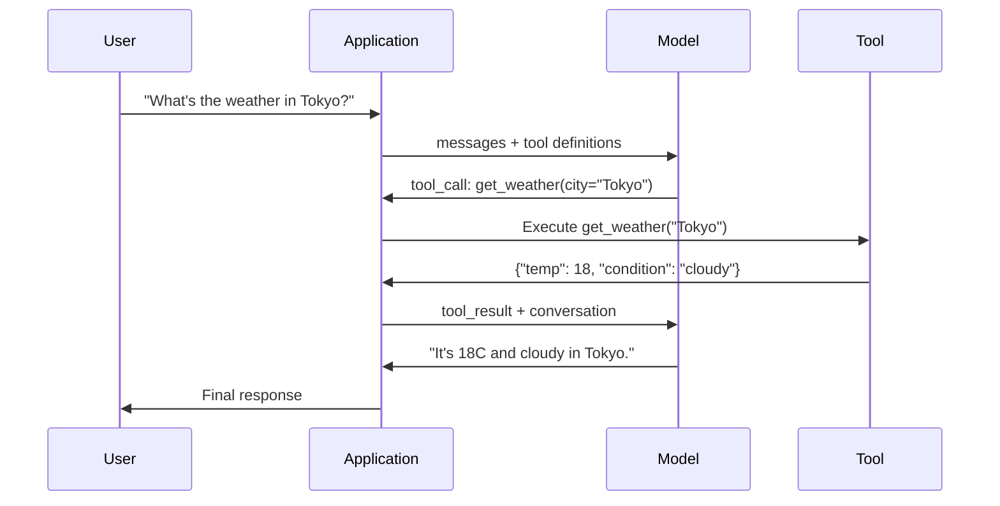

# Appel de fonction et utilisation de l'outil

> Les LLM ne peuvent rien faire en eux-mêmes. Ils génèrent du texte. C'est tout leur pouvoir. Ils ne peuvent pas consulter le temps, consulter la base de données, envoyer des courriels, utiliser des codes ou lire des documents. Chaque agent d'IA que vous avez vu est en fait un LLM.

**Type:** Build
**Languages:** Python
**Prerequisites:** Phase 11 Lesson 03 (Structured Outputs)
**Time:** ~75 minutes
**Related:**Phase 11 · 14 (Model Context Protocol)  Lorsque un outil 需要跨主共享时,应从在线函数调用 升级为MCP服务器──本课覆盖在线场景;MCP 覆盖协议 场景──

## Objectif de l'apprentissage
- 实现 une fonction appelant boucle: définir des schémas d'outils 解析模型的 tool-call JSON 、 exécuter des fonctions,并返回结果
- Design avec des descriptions claires et des schémas d'outils de paramètres typés, afin que le modèle puisse être utilisé de manière fiable
- Construire une boucle d'agent multi-tours, en connectant plusieurs fois les appels de fonction pour répondre à des requêtes complexes
- 处理 function calling 边界 situation:appels parallèles à l'outil, propagation d'erreurs, ainsi que prévention des boucles d'outil illimitées

##  problématique
Vous avez construit un chatbot. Question de l'utilisateur: Quel est le temps à Tokyo en ce moment ?

模型回答:Je n'ai pas accès à des données météorologiques en temps réel, mais en fonction de la saison, Tokyo est probablement autour de 15 degrés Celsius...

C'est une hallucination de l'extérieur de la robe. Le modèle ne sait pas la météo. Il ne saura jamais. La météo change à chaque heure.

Une partie de la défaillance est: un protocole structuré, permettez au modèle de dire que j'ai besoin de ces arguments pour modifier l'API météo, et que votre code l'exécute, et que le résultat soit à nouveau rendu possible.

Voilà le mode d'appel de fonction. Modèle sort structurée JSON, décrivant quels arguments utiliser.

Les LLM sont des livres.

## 概念
### La fonction qui appelle la boucle

Chaque fois que l'outil est utilisé, les interactions suivent le même cycle de 5 étapes.



Étape 1: l'utilisateur envoie un message. Étape 2: le modèle reçoit un message et définit l'outil. Étape 3: le modèle ne retourne pas directement au texte, mais sort un appel à l'outil, qui contient le nom de la fonction et les arguments de l'objet JSON structuré. Étape 4: Votre code exécute la fonction et capture le résultat.

Le modèle ne fait rien. Il décide seulement de ce qu'il utilise, ainsi que de ses arguments.

### Définitions d'outils: Contrat de schéma JSON

Chaque outil est défini par un schéma JSON, il indique au modèle ce que cette fonction fait, recevoir quels arguments, ainsi que ces arguments doivent être de quel type.

```json
{
  "type": "function",
  "function": {
    "name": "get_weather",
    "description": "Get current weather for a city. Returns temperature in Celsius and conditions.",
    "parameters": {
      "type": "object",
      "properties": {
        "city": {
          "type": "string",
          "description": "City name, e.g. 'Tokyo' or 'San Francisco'"
        },
        "units": {
          "type": "string",
          "enum": ["celsius", "fahrenheit"],
          "description": "Temperature units"
        }
      },
      "required": ["city"]
    }
  }
}
```

`description`Les champs 至关重要──模型会读取它们,以决定何时以及如何使用工具──如get weather这样含糊的描述,比Get current weather for a city. Returne la température en Celsius et les conditions.产生更差的工具选择──描述是用于工具选择的提示──

### Comparaison des fournisseurs

Chaque fournisseur principal prend en charge les appels de fonctionnalités, mais la surface de l'API a des différences.

| Provider | API Parameter | Tool Call Format | Parallel Calls | Forced Calling |
|----------|--------------|-----------------|---------------|----------------|
| OpenAI (GPT-5, o4) | `tools` | `tool_calls[].function` | Yes (multiple per turn) | `tool_choice="required"` |
| Anthropic (Claude 4.6/4.7) | `tools` | `content[].type="tool_use"` | Yes (multiple blocks) | `tool_choice={"type":"any"}` |
| Google (Gemini 3) | `function_declarations` | `functionCall` | Yes | `function_calling_config` |
| Open-weight (Llama 4, Qwen3, DeepSeek-V3) | Native `tools` on Llama 4; Hermes or ChatML on others | Mixed | Model-dependent | Prompt-based or `tool_choice` if supported |

En 2026, trois fournisseurs fermés ont reçu presque le même format basé sur le schéma JSON.`tools`Le format Hermes est le plus courant de la forme de la mise en forme de la mise en forme de la partie de troisième partie. Pour les hôtes à travers le monde, les outils de partage sont prioritaires en utilisant MCP (Phase 11 · 14), plutôt que l'appel à la fonction en ligne, car le serveur est le même pour tous les hôtes.

### Choix d'outil: automatique, nécessaire, spécifique

Vous pouvez contrôler le modèle de l'utilisation des outils.

**Auto**(默认):模型自行决定是调用工具 还是直接答案── 2+2?会直接答── 天气是什么?会调用工具──

**Required**Le modèle doit au moins utiliser un outil. Lorsque vous savez que l'utilisateur a besoin d'un outil, utilisez-le. Cela peut empêcher le modèle de demander des données réelles et de deviner directement.

**Specific function**: modèle de force pour une fonction spécifique.`tool_choice={"type":"function", "function": {"name": "get_weather"}}`L'outil de sécurité météo sera utilisé, quelle que soit la requête.

### Appel parallèle

GPT-4o 和 Claude peuvent être utilisés à tour de rôle dans plusieurs fonctions.

```json
[
  {"name": "get_weather", "arguments": {"city": "Tokyo"}},
  {"name": "get_weather", "arguments": {"city": "New York"}}
]
```

Vous pouvez utiliser le code pour exécuter deux de ces deux processus, puis retourner les deux résultats, puis le modèle compose une réponse commune. Cela réduit les allers-retours de 2 à 1 fois.

### Résultats structurés par rapport aux appels à fonction

Leçon 03 couvre les sorties structurées.

**Structured outputs**Le modèle de production est le produit final.`{name, price, in_stock}`Il y a une autre.

**Function calling**: modèle déclarations d'exécution d'une action.`get_weather(city="Tokyo")`, le modèle est de demander une action, plutôt que de générer une réponse finale.

Lorsque vous avez besoin d'extraction de données, utilisez des sorties structurées. Lorsque vous avez besoin de modèles et de systèmes externes.

### Sécurité: règles inconciliables

L'appel à la fonction est la capacité la plus dangereuse de LLM. Si votre ensemble d'outils contient des requêtes de base de données, le modèle construira des requêtes.

**Rule 1: Never pass model-generated SQL directly to a database.**模型可能且确实会生成 DROP TABLE、UNION injections, ou retourner à chaque ligne de requêtes──始终参数化──始终验证──始终使用操作允许列──

**Rule 2: Allowlist functions.**模型 can only调用 your explicitly defined functions── ne jamais construire un outil de fonctionnalité générale  selon le nom  exécuter toute fonction── si vous avez 50 fonctions internes, ne dévoilez que 5  dont l'utilisateur a besoin──

**Rule 3: Validate arguments.**模型可能传入一个城市名字:`"; DROP TABLE users; --"` Exécuter avant de devoir vérifier chaque argument en fonction des types, des niveaux et des formats prévus.

**Rule 4: Sanitize tool results.**Si l'outil retourne des données sensibles, le modèle mettra les résultats de l'outil dans sa réponse.

**Rule 5: Rate limit tool calls.**处于循环中的模型可能调调用工具 数百次――设置一个最大值(每次对话 10-20次电话是合理的)――打断无限循环──

### Traitement des erreurs

Les outils seront défaits. Les API seront superposés. Les bases de données seront défaites. Les fichiers n'existeront pas.

Retourner les erreurs  comme résultats d'outil structurel  au lieu de rejeter les exceptions:

```json
{
  "error": true,
  "message": "City 'Toky' not found. Did you mean 'Tokyo'?",
  "code": "CITY_NOT_FOUND"
}
```

模型读取这个结果,调整论点,并重试――Models 很擅长从结构化错误信息中自我纠正――它们不擅长从空反应或泛泛的有什么错误中恢复――

### MCP: modèle de protocole de contexte

MCP est un standard ouvert d'interopérabilité des outils en face de l'Anthropic. Il ne permet pas à chaque application de définir ses propres outils, mais fournit un protocole universel: outils fournis par les serveurs MCP, et par les clients MCP (comme Claude Code, Cursor ou votre application)

Un serveur MCP peut être exposé à n'importe quel client à la fois. Outils: Définir une fois, utiliser une autre fois.

MCP est une fonction appelant, comme HTTP est une réseau. Il standardise la couche de transport, rendant les outils portables.


```figure
mx-tool-call-loop
```

## - Je le construis.
### 步骤 1: Définir le répertoire des outils

Construire un registre, utilisé pour les définitions d'outils de stockage  et leurs implémentations。 chaque outil a une définition de schéma JSON 模型看的内容) et une fonction Python 你的代码执行的内容)。

```python
import json
import math
import time
import hashlib


TOOL_REGISTRY = {}


def register_tool(name, description, parameters, function):
    TOOL_REGISTRY[name] = {
        "definition": {
            "type": "function",
            "function": {
                "name": name,
                "description": description,
                "parameters": parameters,
            },
        },
        "function": function,
    }
```

### 步骤 2: mettre en œuvre 5 outils

Construire une calculatrice, une recherche météo, un simulateur de recherche Web, un lecteur de fichiers et un code runner.

```python
def calculator(expression, precision=2):
    allowed = set("0123456789+-*/.() ")
    if not all(c in allowed for c in expression):
        return {"error": True, "message": f"Invalid characters in expression: {expression}"}
    try:
        result = eval(expression, {"__builtins__": {}}, {"math": math})
        return {"result": round(float(result), precision), "expression": expression}
    except Exception as e:
        return {"error": True, "message": str(e)}


WEATHER_DB = {
    "tokyo": {"temp_c": 18, "condition": "cloudy", "humidity": 72, "wind_kph": 14},
    "new york": {"temp_c": 22, "condition": "sunny", "humidity": 45, "wind_kph": 8},
    "london": {"temp_c": 12, "condition": "rainy", "humidity": 88, "wind_kph": 22},
    "san francisco": {"temp_c": 16, "condition": "foggy", "humidity": 80, "wind_kph": 18},
    "sydney": {"temp_c": 25, "condition": "sunny", "humidity": 55, "wind_kph": 10},
}


def get_weather(city, units="celsius"):
    key = city.lower().strip()
    if key not in WEATHER_DB:
        suggestions = [c for c in WEATHER_DB if c.startswith(key[:3])]
        return {
            "error": True,
            "message": f"City '{city}' not found.",
            "suggestions": suggestions,
            "code": "CITY_NOT_FOUND",
        }
    data = WEATHER_DB[key].copy()
    if units == "fahrenheit":
        data["temp_f"] = round(data["temp_c"] * 9 / 5 + 32, 1)
        del data["temp_c"]
    data["city"] = city
    return data


SEARCH_DB = {
    "python function calling": [
        {"title": "OpenAI Function Calling Guide", "url": "https://platform.openai.com/docs/guides/function-calling", "snippet": "Learn how to connect LLMs to external tools."},
        {"title": "Anthropic Tool Use", "url": "https://docs.anthropic.com/en/docs/tool-use", "snippet": "Claude can interact with external tools and APIs."},
    ],
    "MCP protocol": [
        {"title": "Model Context Protocol", "url": "https://modelcontextprotocol.io", "snippet": "An open standard for connecting AI models to data sources."},
    ],
    "weather API": [
        {"title": "OpenWeatherMap API", "url": "https://openweathermap.org/api", "snippet": "Free weather API with current, forecast, and historical data."},
    ],
}


def web_search(query, max_results=3):
    key = query.lower().strip()
    for db_key, results in SEARCH_DB.items():
        if db_key in key or key in db_key:
            return {"query": query, "results": results[:max_results], "total": len(results)}
    return {"query": query, "results": [], "total": 0}


FILE_SYSTEM = {
    "data/config.json": '{"model": "gpt-4o", "temperature": 0.7, "max_tokens": 4096}',
    "data/users.csv": "name,email,role\nAlice,alice@example.com,admin\nBob,bob@example.com,user",
    "README.md": "# My Project\nA tool-use agent built from scratch.",
}


def read_file(path):
    if ".." in path or path.startswith("/"):
        return {"error": True, "message": "Path traversal not allowed.", "code": "FORBIDDEN"}
    if path not in FILE_SYSTEM:
        available = list(FILE_SYSTEM.keys())
        return {"error": True, "message": f"File '{path}' not found.", "available_files": available, "code": "NOT_FOUND"}
    content = FILE_SYSTEM[path]
    return {"path": path, "content": content, "size_bytes": len(content), "lines": content.count("\n") + 1}


def run_code(code, language="python"):
    if language != "python":
        return {"error": True, "message": f"Language '{language}' not supported. Only 'python' is available."}
    forbidden = ["import os", "import sys", "import subprocess", "exec(", "eval(", "__import__", "open("]
    for pattern in forbidden:
        if pattern in code:
            return {"error": True, "message": f"Forbidden operation: {pattern}", "code": "SECURITY_VIOLATION"}
    try:
        local_vars = {}
        exec(code, {"__builtins__": {"print": print, "range": range, "len": len, "str": str, "int": int, "float": float, "list": list, "dict": dict, "sum": sum, "min": min, "max": max, "abs": abs, "round": round, "sorted": sorted, "enumerate": enumerate, "zip": zip, "map": map, "filter": filter, "math": math}}, local_vars)
        result = local_vars.get("result", None)
        return {"success": True, "result": result, "variables": {k: str(v) for k, v in local_vars.items() if not k.startswith("_")}}
    except Exception as e:
        return {"error": True, "message": f"{type(e).__name__}: {e}"}
```

### 步骤 3: Regrouper tous les outils

```python
def register_all_tools():
    register_tool(
        "calculator", "Evaluate a mathematical expression. Supports +, -, *, /, parentheses, and decimals. Returns the numeric result.",
        {"type": "object", "properties": {"expression": {"type": "string", "description": "Math expression, e.g. '(10 + 5) * 3'"}, "precision": {"type": "integer", "description": "Decimal places in result", "default": 2}}, "required": ["expression"]},
        calculator,
    )
    register_tool(
        "get_weather", "Get current weather for a city. Returns temperature, condition, humidity, and wind speed.",
        {"type": "object", "properties": {"city": {"type": "string", "description": "City name, e.g. 'Tokyo' or 'San Francisco'"}, "units": {"type": "string", "enum": ["celsius", "fahrenheit"], "description": "Temperature units, defaults to celsius"}}, "required": ["city"]},
        get_weather,
    )
    register_tool(
        "web_search", "Search the web for information. Returns a list of results with title, URL, and snippet.",
        {"type": "object", "properties": {"query": {"type": "string", "description": "Search query"}, "max_results": {"type": "integer", "description": "Maximum results to return", "default": 3}}, "required": ["query"]},
        web_search,
    )
    register_tool(
        "read_file", "Read the contents of a file. Returns the file content, size, and line count.",
        {"type": "object", "properties": {"path": {"type": "string", "description": "Relative file path, e.g. 'data/config.json'"}}, "required": ["path"]},
        read_file,
    )
    register_tool(
        "run_code", "Execute Python code in a sandboxed environment. Set a 'result' variable to return output.",
        {"type": "object", "properties": {"code": {"type": "string", "description": "Python code to execute"}, "language": {"type": "string", "enum": ["python"], "description": "Programming language"}}, "required": ["code"]},
        run_code,
    )
```

### 步骤 4: Construire la fonction appelant boucle

C'est le moteur central. Il décide quel outil utiliser, quel outil exécuter, et il en résulte.

```python
def simulate_model_decision(user_message, tools, conversation_history):
    msg = user_message.lower()

    if any(word in msg for word in ["weather", "temperature", "forecast"]):
        cities = []
        for city in WEATHER_DB:
            if city in msg:
                cities.append(city)
        if not cities:
            for word in msg.split():
                if word.capitalize() in [c.title() for c in WEATHER_DB]:
                    cities.append(word)
        if not cities:
            cities = ["tokyo"]
        calls = []
        for city in cities:
            calls.append({"name": "get_weather", "arguments": {"city": city.title()}})
        return calls

    if any(word in msg for word in ["calculate", "compute", "math", "what is", "how much"]):
        for token in msg.split():
            if any(c in token for c in "+-*/"):
                return [{"name": "calculator", "arguments": {"expression": token}}]
        if "+" in msg or "-" in msg or "*" in msg or "/" in msg:
            expr = "".join(c for c in msg if c in "0123456789+-*/.() ")
            if expr.strip():
                return [{"name": "calculator", "arguments": {"expression": expr.strip()}}]
        return [{"name": "calculator", "arguments": {"expression": "0"}}]

    if any(word in msg for word in ["search", "find", "look up", "google"]):
        query = msg.replace("search for", "").replace("look up", "").replace("find", "").strip()
        return [{"name": "web_search", "arguments": {"query": query}}]

    if any(word in msg for word in ["read", "file", "open", "cat", "show"]):
        for path in FILE_SYSTEM:
            if path.split("/")[-1].split(".")[0] in msg:
                return [{"name": "read_file", "arguments": {"path": path}}]
        return [{"name": "read_file", "arguments": {"path": "README.md"}}]

    if any(word in msg for word in ["run", "execute", "code", "python"]):
        return [{"name": "run_code", "arguments": {"code": "result = 'Hello from the sandbox!'", "language": "python"}}]

    return []


def execute_tool_call(tool_call):
    name = tool_call["name"]
    args = tool_call["arguments"]

    if name not in TOOL_REGISTRY:
        return {"error": True, "message": f"Unknown tool: {name}", "code": "UNKNOWN_TOOL"}

    tool = TOOL_REGISTRY[name]
    func = tool["function"]
    start = time.time()

    try:
        result = func(**args)
    except TypeError as e:
        result = {"error": True, "message": f"Invalid arguments: {e}"}

    elapsed_ms = round((time.time() - start) * 1000, 2)
    return {"tool": name, "result": result, "execution_time_ms": elapsed_ms}


def run_function_calling_loop(user_message, max_iterations=5):
    conversation = [{"role": "user", "content": user_message}]
    tool_definitions = [t["definition"] for t in TOOL_REGISTRY.values()]
    all_tool_results = []

    for iteration in range(max_iterations):
        tool_calls = simulate_model_decision(user_message, tool_definitions, conversation)

        if not tool_calls:
            break

        results = []
        for call in tool_calls:
            result = execute_tool_call(call)
            results.append(result)

        conversation.append({"role": "assistant", "content": None, "tool_calls": tool_calls})

        for result in results:
            conversation.append({"role": "tool", "content": json.dumps(result["result"]), "tool_name": result["tool"]})

        all_tool_results.extend(results)
        break

    return {"conversation": conversation, "tool_results": all_tool_results, "iterations": iteration + 1 if tool_calls else 0}
```

### 步骤 5: Validation de l'argument

Construire un validateur, en fonction du schéma JSON  Vérifiez les arguments d'appel de l'outil.

```python
def validate_tool_arguments(tool_name, arguments):
    if tool_name not in TOOL_REGISTRY:
        return [f"Unknown tool: {tool_name}"]

    schema = TOOL_REGISTRY[tool_name]["definition"]["function"]["parameters"]
    errors = []

    if not isinstance(arguments, dict):
        return [f"Arguments must be an object, got {type(arguments).__name__}"]

    for required_field in schema.get("required", []):
        if required_field not in arguments:
            errors.append(f"Missing required argument: {required_field}")

    properties = schema.get("properties", {})
    for arg_name, arg_value in arguments.items():
        if arg_name not in properties:
            errors.append(f"Unknown argument: {arg_name}")
            continue

        prop_schema = properties[arg_name]
        expected_type = prop_schema.get("type")

        type_checks = {"string": str, "integer": int, "number": (int, float), "boolean": bool, "array": list, "object": dict}
        if expected_type in type_checks:
            if not isinstance(arg_value, type_checks[expected_type]):
                errors.append(f"Argument '{arg_name}': expected {expected_type}, got {type(arg_value).__name__}")

        if "enum" in prop_schema and arg_value not in prop_schema["enum"]:
            errors.append(f"Argument '{arg_name}': '{arg_value}' not in {prop_schema['enum']}")

    return errors
```

### 步骤 6: Exécuter la démo

```python
def run_demo():
    register_all_tools()

    print("=" * 60)
    print("  Function Calling & Tool Use Demo")
    print("=" * 60)

    print("\n--- Registered Tools ---")
    for name, tool in TOOL_REGISTRY.items():
        desc = tool["definition"]["function"]["description"][:60]
        params = list(tool["definition"]["function"]["parameters"].get("properties", {}).keys())
        print(f"  {name}: {desc}...")
        print(f"    params: {params}")

    print(f"\n--- Argument Validation ---")
    validation_tests = [
        ("get_weather", {"city": "Tokyo"}, "Valid call"),
        ("get_weather", {}, "Missing required arg"),
        ("get_weather", {"city": "Tokyo", "units": "kelvin"}, "Invalid enum value"),
        ("calculator", {"expression": 123}, "Wrong type (int for string)"),
        ("unknown_tool", {"x": 1}, "Unknown tool"),
    ]
    for tool_name, args, label in validation_tests:
        errors = validate_tool_arguments(tool_name, args)
        status = "VALID" if not errors else f"ERRORS: {errors}"
        print(f"  {label}: {status}")

    print(f"\n--- Tool Execution ---")
    direct_tests = [
        {"name": "calculator", "arguments": {"expression": "(10 + 5) * 3 / 2"}},
        {"name": "get_weather", "arguments": {"city": "Tokyo"}},
        {"name": "get_weather", "arguments": {"city": "Mars"}},
        {"name": "web_search", "arguments": {"query": "python function calling"}},
        {"name": "read_file", "arguments": {"path": "data/config.json"}},
        {"name": "read_file", "arguments": {"path": "../etc/passwd"}},
        {"name": "run_code", "arguments": {"code": "result = sum(range(1, 101))"}},
        {"name": "run_code", "arguments": {"code": "import os; os.system('rm -rf /')"}},
    ]
    for call in direct_tests:
        result = execute_tool_call(call)
        print(f"\n  {call['name']}({json.dumps(call['arguments'])})")
        print(f"    -> {json.dumps(result['result'], indent=None)[:100]}")
        print(f"    time: {result['execution_time_ms']}ms")

    print(f"\n--- Full Function Calling Loop ---")
    test_queries = [
        "What's the weather in Tokyo?",
        "Calculate (100 + 250) * 0.15",
        "Search for MCP protocol",
        "Read the config file",
        "Run some Python code",
        "Tell me a joke",
    ]
    for query in test_queries:
        print(f"\n  User: {query}")
        result = run_function_calling_loop(query)
        if result["tool_results"]:
            for tr in result["tool_results"]:
                print(f"    Tool: {tr['tool']} ({tr['execution_time_ms']}ms)")
                print(f"    Result: {json.dumps(tr['result'], indent=None)[:90]}")
        else:
            print(f"    [No tool called -- direct response]")
        print(f"    Iterations: {result['iterations']}")

    print(f"\n--- Parallel Tool Calls ---")
    multi_city_query = "What's the weather in tokyo and london?"
    print(f"  User: {multi_city_query}")
    result = run_function_calling_loop(multi_city_query)
    print(f"  Tool calls made: {len(result['tool_results'])}")
    for tr in result["tool_results"]:
        city = tr["result"].get("city", "unknown")
        temp = tr["result"].get("temp_c", "N/A")
        print(f"    {city}: {temp}C, {tr['result'].get('condition', 'N/A')}")

    print(f"\n--- Security Checks ---")
    security_tests = [
        ("read_file", {"path": "../../etc/passwd"}),
        ("run_code", {"code": "import subprocess; subprocess.run(['ls'])"}),
        ("calculator", {"expression": "__import__('os').system('ls')"}),
    ]
    for tool_name, args in security_tests:
        result = execute_tool_call({"name": tool_name, "arguments": args})
        blocked = result["result"].get("error", False)
        print(f"  {tool_name}({list(args.values())[0][:40]}): {'BLOCKED' if blocked else 'ALLOWED'}")
```

## Utilisez-le
### Appel à la fonction OpenAI

```python
# from openai import OpenAI
#
# client = OpenAI()
#
# tools = [{
#     "type": "function",
#     "function": {
#         "name": "get_weather",
#         "description": "Get current weather for a city",
#         "parameters": {
#             "type": "object",
#             "properties": {
#                 "city": {"type": "string"},
#                 "units": {"type": "string", "enum": ["celsius", "fahrenheit"]}
#             },
#             "required": ["city"]
#         }
#     }
# }]
#
# response = client.chat.completions.create(
#     model="gpt-4o",
#     messages=[{"role": "user", "content": "Weather in Tokyo?"}],
#     tools=tools,
#     tool_choice="auto",
# )
#
# tool_call = response.choices[0].message.tool_calls[0]
# args = json.loads(tool_call.function.arguments)
# result = get_weather(**args)
#
# final = client.chat.completions.create(
#     model="gpt-4o",
#     messages=[
#         {"role": "user", "content": "Weather in Tokyo?"},
#         response.choices[0].message,
#         {"role": "tool", "tool_call_id": tool_call.id, "content": json.dumps(result)},
#     ],
# )
# print(final.choices[0].message.content)
```

OpenAI va effectuer des appels à l' outil  retourner pour `response.choices[0].message.tool_calls`Chaque appel a un seul.`id`, vous devez le contenir lors de la réponse. Le modèle utilisant cette ID correspondra aux résultats des appels.

### Utilisation d'outils anthropologiques

```python
# import anthropic
#
# client = anthropic.Anthropic()
#
# response = client.messages.create(
#     model="claude-sonnet-4-20250514",
#     max_tokens=1024,
#     tools=[{
#         "name": "get_weather",
#         "description": "Get current weather for a city",
#         "input_schema": {
#             "type": "object",
#             "properties": {
#                 "city": {"type": "string"},
#                 "units": {"type": "string", "enum": ["celsius", "fahrenheit"]}
#             },
#             "required": ["city"]
#         }
#     }],
#     messages=[{"role": "user", "content": "Weather in Tokyo?"}],
# )
#
# tool_block = next(b for b in response.content if b.type == "tool_use")
# result = get_weather(**tool_block.input)
#
# final = client.messages.create(
#     model="claude-sonnet-4-20250514",
#     max_tokens=1024,
#     tools=[...],
#     messages=[
#         {"role": "user", "content": "Weather in Tokyo?"},
#         {"role": "assistant", "content": response.content},
#         {"role": "user", "content": [{"type": "tool_result", "tool_use_id": tool_block.id, "content": json.dumps(result)}]},
#     ],
# )
```

L' outil Anthropic va appeler à retour pour être accompagné`type: "tool_use"`Les blocs de contenu de l'outil résultat  placés `type: "tool_result"`Les utilisateurs ont été invités à participer à la conférence de presse de la région de la France.`input_schema`définir les paramètres de l'outil, alors que OpenAI `parameters`Il y a une autre.

### Intégration des PCM

```python
# MCP servers expose tools over a standardized protocol.
# Any MCP-compatible client can discover and call these tools.
#
# Example: connecting to a Postgres MCP server
#
# from mcp import ClientSession, StdioServerParameters
# from mcp.client.stdio import stdio_client
#
# server_params = StdioServerParameters(
#     command="npx",
#     args=["-y", "@modelcontextprotocol/server-postgres", "postgresql://localhost/mydb"],
# )
#
# async with stdio_client(server_params) as (read, write):
#     async with ClientSession(read, write) as session:
#         await session.initialize()
#         tools = await session.list_tools()
#         result = await session.call_tool("query", {"sql": "SELECT count(*) FROM users"})
```

MCP va mettre en œuvre des outils et consommer des outils 解──Postgres serveur 了解 SQL──GitHub serveur 了解 API──你的代理 只是发现并调用工具,它不需要每一个集成──编写供应商特定代码──

## Je le livre.
本课会产出 `outputs/prompt-tool-designer.md`, c'est un modèle de prompt réutilisable pour la conception de définitions d'outils. Donnez-lui une description de ce que vous voulez faire avec cet outil. Il générera une définition complète de JSON Schema, y compris des descriptions, des types et des contraintes.

Il va se produire .`outputs/skill-function-calling-patterns.md`, c'est un cadre de décision utilisé dans la production pour réaliser des appels à fonction, couvrant la conception d'outils, la gestion des erreurs, la sécurité et les modèles spécifiques au fournisseur.

## 练习
1. **Add a 6th tool: database query.**实现 un outil SQL simulé, utiliser une table en mémoire。 cet outil 接收 table name 和 filter conditions(不是 raw SQL)。验证 table name 位于 allowlist,并且过器操作员 仅限于 `=`- Je suis là.`>`- Je suis là.`<`- Je suis là.`>=`- Je suis là.`<=`△ seront correspondues des lignes 作为 JSON 返回──

2. **Implement retry with error feedback.**Lorsque l'outil appelle 失败时(exemple: ville non trouvée), puis le message d'erreur 回 modèle de décision fonction,并让它修改参数──记录每次电话 需要多少次重复尝试──为每次工具电话 设置最多3次重复尝试──

3. **Build a multi-step agent.**某些 queries 需要串联工具调用:Lisez le fichier de configuration et dites-moi quel modèle est configuré, puis recherchez le prix de ce modèle sur le Web. 实现一个循环,持续运行直到模型决定不再需要工具,并把累积结果传进每个决策步──限制为10次回复,以防止无限循环──

4. **Measure tool selection accuracy.** Créer 30 requêtes de test avec des noms d'outils attendus ⋅ dans toutes les 30 requêtes ⋅ 上运行你的决策功能,并衡量它选择正确工具的比例──识别哪些问题最容易导致工具之间的混──

5. **Implement tool call caching.**Si le même outil est utilisé dans les mêmes arguments en 60 secondes, il renvoie le résultat caché, plutôt que de le réécrire.`(tool_name, frozenset(args.items()))`Pour le dictionnaire de clé, mesure contenant 20 requêtes.

## 关键术语
| Term | What people say | What it actually means |
|------|----------------|----------------------|
| Function calling | “Tool use” | 模型输出结构化 JSON，描述要用特定 arguments 调用的 function，由你的代码执行，而不是模型执行 |
| Tool definition | “Function schema” | 一个 JSON Schema object，描述 tool 的 name、purpose、parameters 和 types，模型读取它来决定何时以及如何使用该 tool |
| Tool choice | “Calling mode” | 控制模型必须调用 tool（required）、可以调用 tool（auto），还是必须调用特定 tool（named） |
| Parallel calling | “Multi-tool” | 模型在单个 turn 中输出多个 tool calls，从而减少 round trips，GPT-4o 和 Claude 都支持这一点 |
| Tool result | “Function output” | 执行 tool 后得到的 return value，作为 message 发回模型，使它能在 response 中使用真实数据 |
| Argument validation | “Input checking” | 在执行 tool 前，验证模型生成的 arguments 是否匹配预期 types、ranges 和 constraints |
| MCP | “Tool protocol” | Model Context Protocol，即 Anthropic 的 open standard，用于通过 servers 暴露 tools，让任何兼容 client 都能发现并调用 |
| Agent loop | “ReAct loop” | model-decides-tool、code-executes-tool、result-feeds-back 的迭代循环，直到模型拥有足够信息作出回答 |
| Tool poisoning | “Prompt injection via tools” | 一种攻击，其中 tool results 包含会操纵模型行为的 instructions，因此要 sanitize 所有 tool outputs |
| Rate limiting | “Call budget” | 设置每个 conversation 中 tool calls 的最大数量，以防止 infinite loops 和失控的 API costs |

## 延伸阅读
- [OpenAI Function Calling Guide](https://platform.openai.com/docs/guides/function-calling) Utilisation de GPT-4o  autorité d'utilisation des outils, y compris les appels parallèles, les appels forcés et les arguments structurés
- [Anthropic Tool Use Guide](https://docs.anthropic.com/en/docs/tool-use) L'utilisation des outils de Claude 实现, y compris les réponses input_schema、multi-outil et la configuration de choix d'outils
- [Model Context Protocol Specification](https://modelcontextprotocol.io) 跨 AI applications 的工具互操作性 开放标准, contenant une architecture serveur/client
- [Schick et al., 2023 — “Toolformer: Language Models Can Teach Themselves to Use Tools”](https://arxiv.org/abs/2302.04761)  Rapport de base sur la formation des LLM décider quand et comment utiliser des outils externes
- [Patil et al., 2023 — “Gorilla: Large Language Model Connected with Massive APIs”](https://arxiv.org/abs/2305.15334)                                                                                                                                                                                                                                                                                                                                                                                                                                                                                                                            
- [Berkeley Function Calling Leaderboard](https://gorilla.cs.berkeley.edu/leaderboard.html) 实时基准, par rapport à la précision de l'appel de fonction GPT-4o、Claude、Gemini et des modèles ouverts
- [Yao et al., “ReAct: Synergizing Reasoning and Acting in Language Models” (ICLR 2023)](https://arxiv.org/abs/2210.03629) Boucle de pensée-action-observation, c'est chaque appel d'outil boucle d'agent de niveau extérieur;
- [Anthropic — Building effective agents (Dec 2024)](https://www.anthropic.com/research/building-effective-agents)                                                                                                                                                                                                                                                              
