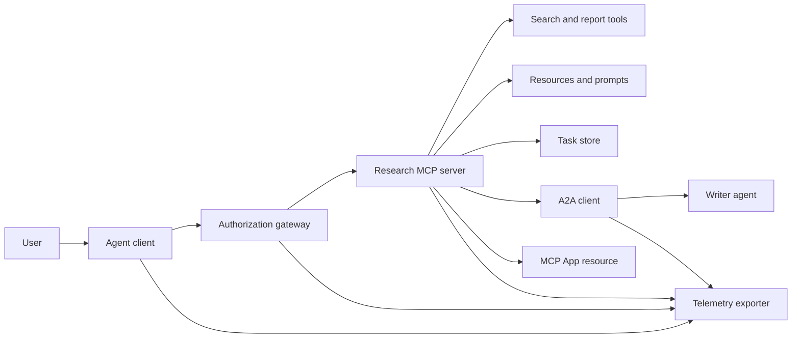
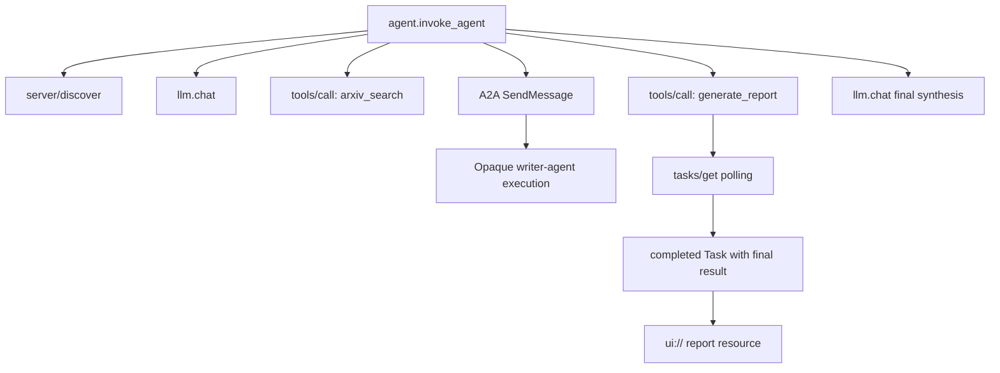
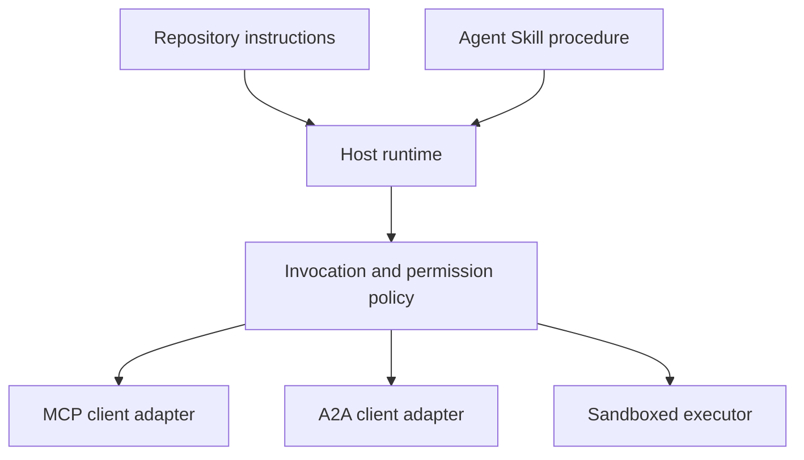

# 综合实战项目: sans état outils écosystèmes

> Le système d'agent de production est un ensemble de simples ensembles de limites claires, mais non propres.

**Type:** Build
**Languages:** Python (stdlib, in-process simulation)
**Prerequisites:** Phase 13 · 01 through 22, using MCP revision `2026-07-28`
**Time:** ~120 minutes

## Objectif de l'apprentissage

- Les résultats de la mise en œuvre des outils, des tâches, des résultats, des ressources, des stratégies et des stratégies de suivi distribuées ont été mis en place pour créer un seul réseau de données.
- Dans chaque demande de MCP, la version strictement portée du protocole, l'identité et les capacités du client, complètement désavoué la dépendance à la transmission de la conversation.
- En cours de rédaction, le service de rédaction a été mis en œuvre et a été mis en œuvre.
- 清晰区分符合协议形态的本地模拟 (simulation en forme de protocole) avec le véritable MCP、A2A、OAuth 及 OpenTelemetry 生产实现──
- Mettre en place chaque limite abstraite de l'imagerie jusqu'à ce que les composants physiques qui doivent être remplacés soient en production.
- 确保 `AGENTS.md`、Agent Skill、运行时适配器、工具 及安全策略 respectives et respectives, en respectant les devoirs de la structure correcte―
- Il est clair que les affirmations techniques peuvent être directement produites sur place, et qu'elles doivent être fondées sur des tests intégrés réels.

##  problématique

construire un système de recherche et de production de rapports: demande d'utilisateur de recherche sur l'agent  protocole de communication 论文.

Cette phrase semble simple, mais elle cache plusieurs accords indépendants:

- 面向模型的工具方案 声明;
- 无状态请求信封与服务发现契约;
-  针对主体(attrice) 、范围和工具 身份的网关决策;
- 长周期任务操作契约;
- 跨 agent 委托协作协议(A2A);
- Le réseau de communication entre le hôte et l'application de l'application de l'APM;
- 链路追踪的上下文传播与导出;
- Capacité à utiliser

`code/main.py`Utiliser purement Python  fonction et livre rend les limites ci-dessus clairement visibles. Il ne démarre pas le réseau de surveillance, ne fait pas de requêtes arXiv, ne réalise pas de réelle OAuth, ne fait pas de la téléphonie A2A, ne fait pas de la MCP App, ne fait pas de la téléphonie MCP, ne fait pas de la téléphonie MCP.

## 概念

### 目标架构



Cette structure est une composante conceptuelle du modèle de protocole standard ouvert, et n'est pas une réalisation interne privée de tout produit exclusif.

### 目标 Répartition des chaînes de suivi



Dans la vraie production, chaque réseau saute dans le monde entier doit être correctement diffusé.

### Présentation de l'accord

Utilisation des méthodes définies par la dernière norme actuelle, ne peut pas être utilisée dans les mémoires de l'ancien projet:

| 边界 | 当前标准交互表面 | 本实战项目的本地模拟实现 |
|---|---|---|
| MCP 服务发现 | 强制性的 `server/discover` | 返回版本、capabilities 和服务器身份的直接函数 |
| MCP 请求上下文 | 每个 `params._meta` 均携带版本、capabilities 及客户端信息 | 传递给每次模拟调用的全新请求元数据 |
| MCP 工具调用 | `tools/call` | Python 本地函数直接分发 |
| MCP 任务轮询 | `io.modelcontextprotocol/tasks` 扩展与 `tasks/get` | 先返回处理中的任务句柄，后返回内联最终结果的完成任务 |
| A2A 跨代理委托 | gRPC 和 JSON-RPC 中为 `SendMessage`；HTTP+JSON 中为 `POST /message:send` | 无远程调用与人为延迟的单层嵌套 Span |
| MCP App 调用宿主工具 | `app.callServerTool({ name, arguments })` | 无实时通信桥梁的纯 HTML 字符串 |
| OAuth 鉴权 | 授权服务器、受保护资源元数据、Audience 与 Scope 校验 | 静态 Token 字典查找与 Scope 集合判断 |
| OpenTelemetry | SDK、传播器（Propagator）、导出器（Exporter）及收集器（Collector） | 纯内存 Span 字典数组 |

Le protocole est simplement une expression de la plus haute échelle. Les tests de production doivent couvrir la séquestration, la séquestration et la défaillance du réseau réel.

### 无状态 MCP 重构集成边界

`2026-07-28`修订版本 Le déménagement total de la session de l'accord et `initialize`- Je suis là .`notifications/initialized`La main de l'homme est en train de se défaire.`Mcp-Session-Id`Tout le monde est là.`params._meta`中携带如下命名空间字段:

```json
{
  "io.modelcontextprotocol/protocolVersion": "2026-07-28",
  "io.modelcontextprotocol/clientCapabilities": {
    "extensions": {
      "io.modelcontextprotocol/tasks": {}
    }
  },
  "io.modelcontextprotocol/clientInfo": {
    "name": "capstone-client",
    "version": "1.0.0"
  }
}
```

服务端 doit être réalisé `server/discover`◊ habituelles résultats usage `resultType: "complete"`; retour à la tâche `resultType: "task"` Tous les résultats devraient être `_meta.io.modelcontextprotocol/serverInfo`Le serveur indique sa propre identité.

Tasques 扩展包含 `tasks/get`- Je suis là.`tasks/update`et `tasks/cancel`◊ Outil 首次调用可以回归 `resultType: "task"`; et les enquêtes ultérieures `tasks/get`Je suis revenu.`resultType: "complete"`, et terminée `Task`Les résultats de l'enquête ont été publiés dans le cadre de la première phase de la recherche.`tasks/result`Avec `tasks/list`已已完全移除.  Le client doit être en mesure de recevoir la même requête de la tâche.`io.modelcontextprotocol/tasks`扩展; si elle n'est pas déclarée, le service端 sera retourné `-32021`Il a été tué.`requiredCapabilities`Il a été précisé que la disparité de l'expansion des projets était

### Sécurité (en anglais seulement)

L'environnement de la production doit être protégé par:

-  autorisation d'autorisation de l'utilisation forcée du type de clientèle qui a besoin de protection avec PKCE;
- Pour émettre des jetons d'accès  forced implement resources (ressources) avec le public (audience) lié;
- 网关 basé sur des compétences et des compétences de travail;
- 访问上游 API's key credentials strictement interdit d'être exposé dans le modèle visible dans le texte ci-dessus;
- 严格锁定并审查 tool 描述元数据清单(Manifest);
-  mise en œuvre complète de la règle du double concernant les données sensibles et les effets extérieurs importants;
- Dans une boîte d'exécution isolée, la limitation du système de fichiers, des processus, du réseau, des diplômes et de la consommation de ressources doit être limitée par le ministère des compétences extérieures.

Ce cours n'a que pour objet de mettre en œuvre des codes de référence statiques Token、Scope 校验以及 description hash, visant à clarifier les stratégies de démarrage, ne peuvent pas remplacer la sécurité de production 

### Les compétences sont des règles d'exploitation, et non des réseaux de transmission.

Agent Skill est utilisé pour dire comment faire avancer le flux de travail de recherche en cours de fonctionnement, quels outils correspondent à l'expectation, quels certificats d'audit du processus sont conservés et quand une tâche est terminée. Mais il ne peut pas créer un serveur MCP, établir un protocole A2A, créer un champ d'application ou créer une boîte de code.



Lorsque le programme d'exploitation nécessite de citer des documents de ressources de support, il doit être distribué sous forme complète de l'étiquette de compétences. Les éléments de documents individuels livrés au début de la classe appartiennent à la présentation du programme et ne peuvent être utilisés comme preuve de l'appui de l'hôte au programme général.

###  cours Produits de données sont des adaptateurs locaux

Les répertoires et les installateurs du cours peuvent être identifiés comme:`skill-*.md`Le résolveur ne peut lire que les noms de clés de premier niveau, mais il appartient à un projet spécifique de ce stockage, et non à un ensemble de compétences d'agent.

```yaml
---
name: ecosystem-blueprint
description: Produce a full Phase 13 ecosystem architecture for a product need.
version: "1.0.0"
phase: "13"
lesson: "23"
tags: [mcp, capstone, ecosystem, architecture, a2a, otel]
---
```

`name`Avec `description`Il est possible de transférer des normes de base.`version`- Je suis là.`phase`- Je suis là.`lesson`et `tags`Il est orienté vers le programme de formation pour l'expansion des programmes.`tags`写为单行内联数组, afin `--tag capstone`Il est parfait.

标准的可移植目录  compétences peuvent être utilisées`metadata`字典存放自定义扩展数据──但在本仓库单文件中,如果将`version`Ou `tags`嵌套缩进写入 `metadata`内部,极简解析器会直接忽略, entraînant la non-extraction de la version numérotée et le marquage de la défaillance.

### Comparison entre la simulation locale et l'environnement de production réel

| 架构分层 | `code/main.py` 实现 | 生产落地替换方案 | 必须出示的验收证据 |
|---|---|---|---|
| 服务发现 | `server_discover()` 加静态 `TOOLS` | `server/discover` 配合带缓存的 `tools/list` | 报文轨迹、确定性排序与 Schema 校验 |
| 身份认证 | 基于 Token 的内存字典 | 独立的 OAuth 授权服务器与资源服务器验证 | 签发者、受众、Scope、过期与故障降级测试 |
| 授权鉴权 | Scope 集合成员判定 | 绑定主体、tool、目标和租户的网关策略 | 允许与拒绝分支的完整审计日志用例 |
| 论文检索 | 静态论文测试夹具（Fixtures） | 真实检索 API 或专门的 MCP Server | 数据溯源、排序打分与网络异常测试 |
| 异步任务 | 本地句柄加立即 `tasks/get` | 持久化 `io.modelcontextprotocol/tasks` 存储，实现 get/update/cancel 与 TTL | 状态迁移、用户输入、取消及宕机恢复测试 |
| 跨 Agent 委托 | 本地 Sleep 加嵌套 Span | 真实的 A2A 客户端与远程 Agent Card | 契约校验、超时重试与不透明执行测试 |
| 前端交互 App | HTML 字符串与 URI 协议头 | MCP Apps 资源与官方 `App` 通信桥梁 | CSP 安全策略、权限受控、tool 调用与浏览器渲染测试 |
| 链路遥测 | 内存 Python 字典列表 | 完整的 OTel SDK 与远程导出器（Exporter） | 收集端接收凭证与父子 Span 关联断言 |
| 执行沙箱 | 无 | 宿主强制隔离的安全沙箱执行器 | 沙箱逃逸、出站网络、敏感凭证与资源上限测试 |

Le rapport est constitué de la ligne de bord claire de l'interaction.

### Phase 13

| 课次区间 | 核心贡献与架构职责 |
|---|---|
| 01-05 | Tool 接口标准、模型调用、Schema 设计、结构化输出及确定性校验 |
| 06-14 | 无状态 MCP 请求信封、服务发现、底层传输、资源、Prompt、扩展及 Apps |
| 15-18 | 防投毒安全防线、OAuth 鉴权、网关路由、Registry 准入及生产部署落地 |
| 19 | A2A 协议：跨代理的消息传递与异步任务协作 |
| 20 | 基于 OpenTelemetry 的 GenAI 分布式链路追踪设计 |
| 21 | 面向大模型供应商的智能路由与降级分流层 |
| 22 | 可移植 Agent Skill 契约规范与运行时安全边界 |

```figure
t3-capstone-chain
```

## 动手构建

运行进程内综合实战模拟脚本:

```bash
cd phases/13-tools-and-protocols/23-capstone-tool-ecosystem
python3 code/main.py
```

重点审查 Les six principales caractéristiques:

1. `server/discover`J' ai fait une déclaration.`2026-07-28`协议版本 ainsi que les tâches 扩展能力──
2. Alice a pu lire et générer le rapport, tandis que Bob a été fermement rejeté.
3. Toutes les spans locales sous la même organisation de l'exécution suivent un seul identifiant Trace, et enregistrent exactement l'identifiant Spans de classe paternelle.
4.  rapports de production d'opérations d'abord retourner à la tâche `tasks/get`                                                                                                                                                                                                                                                                                                                                                                                                                                                                                                                             `ui://`资源引用。
5. L'agent de rédaction chargé de maintenir son exécution dans la boîte noire est transparent, l'éditeur ne fait que enregistrer les frontières extérieures.
6. 控制台输出没有冒充发生了真实网络请求、OAuth 换标、遥测收集器网络导出、浏览器染或沙箱隔离──

Le guichet est continuellement exécuté deux fois, séparément générant deux lignes de suivi de racines indépendantes.

## Utilisez-le

按部就班将模拟层替换为生产级真实组件:

1. Il va`server_discover()`和静态 tool 列表替换为标准 的 `server/discover`Avec `tools/list`网络请求──在每个请求中完整携带协议版本、客户端身份和能力──
2. Le code de démarrage est remplacé par le code de démarrage de démarrage de démarrage de démarrage de démarrage de démarrage de démarrage de démarrage de démarrage de démarrage de démarrage de démarrage de démarrage de démarrage de démarrage de démarrage de démarrage de démarrage de démarrage de démarrage de démarrage de démarrage de démarrage de démarrage de démarrage de démarrage de démarrage de démarrage de démarrage de démarrage de démarrage de démarrage de démarrage de démarrage de démarrage de démarrage de démarrage de démarrage de démarrage de démarrage de démarrage de démarrage de démarrage de démarrage de démarrage de démarrage de démarrage de démarrage de démarrage de démarrage de démarrage de démarrage de démarrage de démarrage de démarrage de démarrage de démarrage de démarrage de démarrage de démarrage de démarrage de démarrage de démarrage de démarrage de démarrage de démarrage de démarrage de démarrage de démarrage de démarrage de démarrage de démarrage.
3. - Je suis en train de vous parler .`io.modelcontextprotocol/tasks`扩展,测试 `tasks/get`- Je suis là.`tasks/update`- Je suis là.`tasks/cancel`、超时时间、TTL 清理及进程重启恢复──坚决不增加已废弃的`tasks/result`Ou `tasks/list`Il y a une autre.
4. Le code de rédaction sera remplacé par un code capable de résoudre en mode dynamique la carte d'agent et de transmettre des messages à l'A2A 客户端.
5. Utilisation officielle SDK 开发前端交互 App, par le biais `app.callServerTool`规范发起反向工具调用──
6. L'équipe de recherche de l'équipe de recherche de recherche de recherche de recherche de recherche de recherche de recherche de recherche de recherche de recherche de recherche de recherche de recherche de recherche de recherche de recherche de recherche de recherche de recherche de recherche de recherche de recherche de recherche de recherche de recherche de recherche de recherche de recherche de recherche de recherche de recherche de recherche de recherche de recherche de recherche de recherche de recherche de recherche de recherche de recherche de recherche de recherche de recherche de recherche de recherche de recherche de recherche de recherche de recherche de recherche de recherche de recherche de recherche de recherche de recherche de recherche de recherche de recherche de recherche de recherche de recherche de recherche de recherche de recherche de recherche de recherche de recherche de recherche de recherche de recherche de recherche de recherche de recherche de recherche de recherche de recherche de recherche de recherche de recherche de recherche de recherche de recherche de recherche de recherche de recherche de recherche de recherche de recherche de recherche de recherche de recherche de recherche de recherche de recherche de recherche de recherche de recherche de recherche de recherche de recherche de recherche de recherche de recherche de recherche de recherche de recherche de recherche de recherche de recherche de recherche de recherche de recherche de recherche de recherche de recherche de recherche de recherche de recherche de recherche de recherche de recherche de recherche de recherche de recherche de recherche de recherche de recherche de recherche de recherche de recherche de recherche de recherche de recherche de recherche de recherche de recherche de recherche de recherche de recherche de recherche de recherche de recherche de recherche de recherche de recherche de recherche de recherche de recherche de recherche de recherche de recherche de recherche de recherche de recherche de recherche de recherche de recherche de recherche de recherche de recherche de recherche de recherche de recherche de recherche de recherche de recherche de recherche de recherche de recherche de recherche de recherche de recherche de recherche de recherche de recherche de recherche de recherche de recherche de recherche de recherche de recherche de recherche de recherche de recherche de recherche de recherche de recherche de recherche de recherche de recherche de recherche de recherche de recherche de recherche de recherche de recherche de recherche de recherche de recherche de recherche de recherche de recherche de recherche de recherche de recherche de recherche de recherche de recherche de recherche de recherche de recherche de recherche de recherche de recherche de recherche de recherche de recherche de recherche de recherche de recherche de recherche de recherche de recherche de recherche de recherche de recherche de recherche de recherche de recherche de recherche de recherche de recherche de recherche de recherche de recherche de recherche de recherche de recherche de recherche de recherche de référencée sur le développement de recherche de recherche de recherche de référentielle
7. Tous les outils de mise en œuvre et de mise en œuvre du scénario seront intégrés au Règlement de la section 26 du Code de sécurité des boîtes de sable.
8. Le programme d'exploitation est intégré dans le catalogue standard des compétences et est publié en cours à l'issue de la 27e classe.

Chaque couche de remplacement doit être rédigée pour un test d'intégration à travers les frontières physiques réelles.

## Je le livre.

本课交付 `outputs/skill-ecosystem-blueprint.md`Il s'agit d'un plan d'architecture de document unique, qui exige une exposition complète dans une page de longueur du type de composant de base, de la sécurité, de la commande en tant qu'intermédiaire, de la mesure de distance, de la mise en œuvre de l'emballage et des risques les plus graves.

Comme il s'agit d'un seul schéma de document, il est donc impossible de transporter des références, des scripts, des actifs ou des exemples d'évaluation.

## 课后深练习

1. 运行  référencement`code/main.py`◊ 仔细别控制台输出中已在本地验证的事实,与在生产中仍需出示真实集成测试证的断言──
2. Dans l'imprimante, ajouter une deuxième position postérieure, définir deux outils du même nom 发生命名冲突时的解决规则──`tools/list`Il est très important de le faire.
3. Remplacer le code de l'agent de rédaction en véritable serveur de test A2A.
4. Pour le développement de l'état de mission, le processus de redémarrage de la couche de stockage durable prouve que le client peut passer.`tasks/get`恢复执行、遵守 `pollIntervalMs`轮询间隔, et ne dépend pas `tasks/result`Le produit final de la tâche accomplie est directement lu.
5. Construire une application MCP très simple, en configurant des stratégies de CSP et de contrôle des droits explicites dans un environnement de navigateur réel.`app.callServerTool`La connectivité.
6. L'exemple de la collecte de données est le cas de la collecte de données de l'expérience de la réception de données, de la trace d'identification, de la continuité, de la répartition de la relation avec les erreurs de marque.
7. Rédaction de la norme pour la R&D de la R&D de l'ensemble de la S.A.`AGENTS.md`Il est également possible de décrire en détail pourquoi ces deux documents explicatifs ne disposent pas de droits d'utilisation directe de l'outil.

## 关键术语

| 术语 | 通俗说法 | 精确工程含义 |
|---|---|---|
| 实战项目（Capstone） | "把所有东西串起来" | 分阶段构建的集成系统，其本地模拟与真实线上边界保持绝对清晰 |
| 协议形态模拟（Protocol-shaped simulation） | "差不多就是个 MCP" | 在本地构建的与协议数据结构高度相似的代码，但未实现底层的网络传输契约 |
| Tasks 扩展 | "长耗时 tool 调用" | 可选的 `io.modelcontextprotocol/tasks` 扩展规范，定义了持久化标识、轮询、客户端补全、最终结果与取消机制 |
| 不透明边界（Opacity boundary） | "丢给另一个 agent 处理" | 调用方仅能看到公开声明的接口与交付成果，无法窥探其内部思维链与私有状态 |
| 运行时适配器（Runtime adapter） | "接入 Skill 的胶水代码" | 宿主层负责将通用可移植的操作规程映射到服务发现、交互调用、工具权限、安全策略及上下文管理的代码 |
| 集成证据（Integration evidence） | "测试跑通了" | 完整的报文日志、交付产物或接收端实测数据，确凿证明系统跨越了真实的物理边界 |

## 延伸阅读

- [MCP 2026-07-28 核心规范](https://modelcontextprotocol.io/specification/2026-07-28)- une connaissance approfondie des demandes de services de découverte, des outils de référencement, des droits de reconnaissance et des normes de transmission de niveau inférieur,
- [MCP 2026-07-28 关键变更日志](https://modelcontextprotocol.io/specification/2026-07-28/changelog)- comprendre les détails de l'évolution du processus de déménagement, de la demande à la demande, du RTR, de l'expansion officielle et de l'abandon des caractéristiques.
- [MCP Tasks 扩展规范草案](https://tasks.extensions.modelcontextprotocol.io/specification/draft/tasks)- Apprendre à apprendre`tasks/get`- Je suis là.`tasks/update`- Je suis là.`tasks/cancel`及 le mécanisme de transformation complet du résultat du résultat final de la tâche.
- [MCP Apps 官方 SDK](https://github.com/modelcontextprotocol/ext-apps/blob/main/docs/overview.md)- Je sais .`App`类及 `app.callServerTool`Le premier est un épisode.
- [A2A 跨代理协议最新规范](https://a2a-protocol.org/latest/)- Comprendre les cartes d'agent, les messages, les tâches, les tâches et les normes de compétence liées au transfert de données.
- [OpenTelemetry GenAI 语义约定](https://opentelemetry.io/docs/specs/semconv/gen-ai/)-                                                                                                                                                                                                                                                                                                                                                                                                                                                                                                                             
- [Agent Skills 规范官方文档](https://agentskills.io/specification)- la maîtrise des dispositions du projet de guerre en cours et des structures structurelles qui dépendent de la couche de dépôt.
