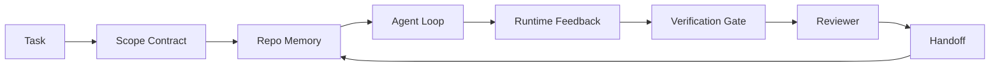

# L'agent de l'ingénierie de la banque de travail: pourquoi le modèle de capacité forte échouera toujours ?

>  un modèle de capacité forte n'est pas suffisant.  un agent fiable  un bureau de travail: instructions, état, champ de travail, feedback, vérification, révision et remise en main  enlevez ces éléments, même si le modèle frontalier ne convient pas à la publication 

**Type:** Learn + Build
**Languages:** Python (stdlib)
**Prerequisites:** Phase 14 · 01 (Agent Loop), Phase 14 · 26 (Failure Modes)
**Time:** ~45 minutes

## Objectif de l'apprentissage
- 区分模型能力与执行可靠性:
- Pour décider si l'agent peut ou non livrer sept surfaces de bureau.
- Dans une petite répartition, les tâches sont plus rapides que les tâches de bureau.
- produire un rapport de défaillance  rapport, qui traitera chaque surface de défaillance  sur les symptômes qu'elle provoque 

##  problématique
Vous avez mis un modèle frontalier  mettre dans un référentiel réel, laissez-le ajouter des certificats d'entrée ⋅ il ouvre quatre fichiers, écrive un code qui semble raisonnable, déclare le succès, puis arrête ⋅ vous avez exécuté un test ⋅ deux ont échoué ⋅ le troisième fichier modifié est totalement sans rapport avec l'authentification ⋅ il n'y a aucun agent de documentation ⋅ supposer quoi ⋅ avoir essayé le premier quoi, ou encore quoi faire ⋅

Le modèle n'est pas incompréhensible Python. Il ne comprend pas ce travail. Il ne sait pas ce qu'il faut faire. Il ne sait pas comment il faut le faire.

Ceci n'est pas un bug de modèle. C'est un bug de bureau. La surface de l'agent environnant manque de partie nécessaire, il est impossible de transformer une génération unique en un travail d'ingénierie fiable et réparateur.

## 概念
Le tableau de travail est le cadre de travail du modèle chargé pendant la tâche.

| Surface | 它承载什么 | 缺失时的失败 |
|---------|------------|--------------|
| Instructions | 启动规则、禁止动作、完成定义 | Agent 猜测交付意味着什么 |
| State | 当前任务、已触碰文件、blockers、下一步动作 | 每个 session 都从零开始 |
| Scope | 允许文件、禁止文件、验收标准 | 修改泄漏到无关代码 |
| Feedback | 捕获进 loop 的真实命令输出 | Agent 在 400 上宣布成功 |
| Verification | Tests、lint、smoke run、scope check | “看起来不错”进入 main |
| Review | 由不同角色执行的第二遍检查 | Builder 批改自己的作业 |
| Handoff | 改了什么、为什么改、还剩什么 | 下一个 session 重新发现一切 |

Vous pouvez remplacer le modèle et conserver ces surfaces. Vous ne pouvez pas remplacer les surfaces et conserver leur fiabilité.



Cette boucle est fermée dans un fichier d'état, et non dans l'historique du chat.

### Tableau de travail et ingénierie rapide

Rapidité  dire au modèle ce que vous voulez  bureau de travail  dire au modèle comment transformer  session 地完成工作── la plupart des agents 失败故事, en fait 披着 prompt-engineering 外衣的工作桌 失败──

### Tableau de travail par rapport au cadre

Le cadre  fournir une durée de fonctionnement  LongGraph、AutoGen、Agents SDK)  Workbench  donner à un agent dans cette durée de fonctionnement  fournir un lieu de travail                                                                                                                                                                                                                                        

### Il est né des primitifs, et non des taxonomies des fournisseurs.

Il y a maintenant beaucoup d'articles sur l'ingénierie de harness . Pour le harness, ils contiennent des limites . Leur champ d'application ne correspond pas. Nous n'avons pas besoin de choisir une station.

Précipiter un agent, cette étiquette. Une fois un agent est à la course, c'est à travers le temps, le processus et la machine. Pour le rendre fiable, vous avez besoin de tout système de production.

| Primitive | 它是什么 | 它为 agent 承载什么 |
|-----------|----------|---------------------|
| Function | 类型化 handler。尽可能保持纯。拥有自己的 inputs 和 outputs。 | 一次 tool call、一次 rule check、一个 verification step、一次模型调用 |
| Worker | 拥有一个或多个 functions 和 lifecycle 的长生命周期进程 | builder、reviewer、verifier、一个 MCP server |
| Trigger | 调用 function 的事件源 | Agent loop tick、HTTP request、queue message、cron、file change、hook |
| Runtime | 决定什么在哪里运行、使用什么 timeouts 和 resources 的边界 | Claude Code 的 process、LangGraph 的 runtime、一个 worker container |
| HTTP / RPC | caller 与 worker 之间的网络线缆 | Tool-call protocol、MCP request、model API |
| Queue | trigger 与 worker 之间的持久 buffer；back-pressure、retry、idempotency | task board、feedback log、review inbox |
| Session persistence | 在 crashes、restarts、model swaps 后仍保留的 state | `agent_state.json`、checkpoints、KV stores、repo 本身 |
| Authorization policy | 谁能以什么 scope 调用什么 function | allowed/forbidden files、approval boundaries、MCP capability lists |

Maintenant, on a mis sept surfaces de bureau qui sont à l'intérieur de ces primitifs.

- **Instructions** politique + métadonnées de fonctionnement。Règles sont vérificationsfunctions)―router`AGENTS.md`) est lié à la politique de démarrage en temps de fonctionnement.
- **State** Persistance de session──temps de fonctionnement ‧étape par étape ‧étape ‧étape ‧étape ‧étape ‧étape ‧étape ‧étape ‧étape ‧étape ‧étape ‧étape ‧étape ‧étape ‧étape ‧étape ‧étape ‧étape ‧étape ‧étape ‧étape ‧étape ‧étape ‧étape ‧étape ‧étape ‧étape ‧étape ‧étape ‧étape ‧étape ‧étape ‧étape ‧étape ‧étape ‧étape ‧étape ‧étape étape 
- **Scope** Politique d'autorisation de chaque mission  globes autorisés/interdits  ACL  besoin d'approbations  réseau d'autorisation 
- **Feedback** 写入 queue 写入 queue 写入 queue 写入 queue 写入 queue 写入 queue 写入 queue 写入 queue 写入 queue 写入 queue 写入 queue 写入 queue 写入 queue 写入 queue 写入 queue 写入 queue 写入 queue 写入 queue 写入 queue 写入 queue 写入 queue 写入 queue 写入 queue 写入 queue 写入 queue 写入 queue 写入 queu 写入 写入 写入 写入 写入 写入 写入 写入 写入 写入 写入 写入 写入 写入 写入 写入 写入 写入 写入 写入 写入 写入 写入 写入 写入 写入 写入 写入 写入 写入 写入 写入 写入 写入 写入 写入 写入 写入 写入 写入 写入 写入 写入 写入 写入 写入 写入 写入 写入 写入 写 写入 写入 写入 写入 写 写 写 写 写 写 写 写 写 写 写 写 写 写 写 写 写 写 写 写 写 写 写 写 写 写 写 写 写 写 写 写 写 写 写 写 写 写 写 写 写 写 写 写 写 写 写 写 写 写 写 写 写 写 写 写 写 写 写 写 写 写 写 写 写 写  写 写 写                 写            写                               写      写
- **Verification** Une fonction― à l'entrée 确定性― 由任务闭 触发―失败时关闭―
- **Review** Un travailleur indépendant, autorisé à lire uniquement les objets de construction, autorisé à écrire uniquement les rapports d'examen.
- **Handoff** Début de la session de fin de déclenchement  émis par le record de durée 

Le cycle d'agent 本身就是一个工人,它消费事件 (en anglais seulement), il utilise des fonctions (en anglais seulement), il émet des commentaires (en anglais seulement), il émet des déclencheurs (en anglais seulement).

### 流行模式,转换为 primitifs

Chaque modèle de harnais courant peut être attribué à environ huit primitives.

| Vendor or community pattern | 它实际是什么 |
|------------------------------|--------------|
| Ralph Loop（Claude Code、Codex、agentic_harness book）— 当 agent 试图过早停止时，把原始意图重新注入一个新的 context window | 一个将 task 以干净 context 重新入队的 trigger；session persistence 负责把目标向前传递 |
| Plan / Execute / Verify (PEV) | 三个 workers，每个角色一个，通过 state 和 phases 之间的 queue 通信 |
| Harness-compute separation（OpenAI Agents SDK，April 2026）— 将 control plane 与 execution plane 分开 | 对 control-plane / data-plane 的重新表述。比 agent 标签早几十年就存在 |
| Open Agent Passport（OAP，March 2026）— 在执行前根据声明式 policy 签名并审计每次 tool call | 由 pre-action worker 强制执行的 authorization policy，并带有 signed audit queue |
| Guides and Sensors（Birgitta Böckeler / Thoughtworks）— feedforward rules + feedback observability | Authorization policy + verification functions + observability traces |
| Progressive compaction, 5-stage（Claude Code reverse engineering，April 2026） | 一个 state-management worker，像 cron 一样在 session persistence 上运行，使其保持在 budget 内 |
| Hooks / middleware（LangChain、Claude Code）— 拦截 model 和 tool calls | 包裹 runtime invocation path 的 triggers + functions |
| Skills as Markdown with progressive disclosure（Anthropic、Flue） | 一个 function registry，其中 function metadata 会 just-in-time 加载到 context 中 |
| Sandbox agents（Codex、Sandcastle、Vercel Sandbox） | compute plane：具备隔离 filesystem、network 和 lifecycle 的 runtime |
| MCP servers | 通过稳定 RPC 暴露 functions 的 workers，capability lists 作为 authorization |

Chaque élément de la liste est un agent 社区 qui arrive à un prémitif de noms déjà existant dans les systèmes distribués, puis lui donne un nouveau nom.

### Les reçus  en fait expliquer ce que

Le principe de l'exploitation du modèle est maintenant en vigueur. Il est intéressant de le comprendre, car il s'agit aussi d'un argument contre le fait que les modèles plus intelligents sont les seuls à avoir une bonne foi.

- Terminal Bench 2.0  Avec un modèle, seulement utiliser le changement de laissez un agent de codage de 30 outdoor élever à la 5ème nom
- Vercel   a supprimé 80% de ses outils; taux de réussite de 80%                                                                                                                                                                                                                                                                                                                                                                                                                                                                                                        
- Harvey  agents juridiques  seulement grâce à l'optimisation de la manipulation 就让精度 翻倍以上(MongoDB) 
- 88% des projets d'agents d'IA d'entreprise n'ont pas pu entrer en production.
- Une étude de référence de 2025 sur trois cadres open source populaires a rapporté environ 50% de la réalisation des tâches; long-context WebAgent dans des conditions long-contextes, de 40 à 50%  chute à 10% ci-dessous, principalement en raison de boucles infinies et de perte d'objectifs(En début de l'année 2026, les écrits sont largement discutés)

Le point n'est pas de l'harness 永远胜出── le modèle absorbera avec le temps les astuces de l'harness── le point est aujourd'hui, de faire le travail autour du modèle, et non à l'intérieur du modèle; de faire le travail de ces primitifs, c'est exactement ce dont chaque système de production a toujours besoin──

### Les écrivains de vendeurs

C'est une partie de ça que tu n'as pas besoin de client.

- LangChain's *Anatomy of an Agent Harness* énumère dix composants  prompts, outils, crochets, boîtes à sable, orchestration, mémoire, compétences, sous-boîtes, ainsi qu'une boucle de temps de course stupide── elle ne présente pas de files d'attente nommées ‒ en tant qu'unité de déploiement de travailleurs ‒ sémantique de déclenchement ‒ en tant que persistance de session de point de concentration indépendant, ou politique d'autorisation── elle considère le harness comme un objet que vous configurez, et non un système que vous déployez──
- Addy Osmani a proposé l' ingénierie de l' harnais des agents`Agent = Model + Harness`Le cadre et le motif de la ciseau, mais sans plus de précision, explique ce qu'est le harnais.
- L'annonce de la séparation de l'harness-compute du KSD en avril 2026 est la première confirmation de l'avion de contrôle / data-plane séparé de la pièce de fournisseur.
- Le harnais sera utilisé pour le contrôle de l'objet de configure (Jaymin West's *Agentic Engineering*, chapitre 6), dont la phrase la plus puissante est que le harnais est la principale limite de sécurité dans un système d'agence.
- Les liens de Hacker News ont été rédigés en avril 2026 et sont publiés en avril 2026 dans le même format que le même article.

Vous n'avez pas besoin de vous opposer à un seul de ces articles, vous pouvez également voir des lacunes. Ils sont en train d'écrire une description de l'UX d'un système déjà existant.`AGENTS.md`色也修不好缺失的队伍──

Ainsi, lorsque vous entendez dans d'autres endroits parler de l'ingénierie de l'harmonisation, traduisez-la en primitives. Les instructions et les règles sont la politique et les fonctions. L'échafaudage est le temps d'exécution. Les gardiens sont l'autorisation + la vérification. Les crochets sont les déclencheurs. La mémoire est la persistance de la session.


```figure
wb-seven-surfaces
```

## - Je le construis.
`code/main.py`Une première fois, c'est seulement un prompt, une seconde, c'est un lien entre sept surfaces.

Retour à la tâche 刻意设计得很小: donner à un seul fichier un gestionnaire de style FastAPI 添加输入验证,并写一个通过测试──

Je vais le faire.

```
python3 code/main.py
```

输出: deux fois de fonctionnement journaux côte à côte, un résumé de la mise en route rapide `failure_modes.json`, ainsi que le verdict de la course au bureau de travail.

L'agent est un petit bâton basé sur des règles; le focus est sur les surfaces, et non sur le modèle. Dans le reste de cette mini-track, vous allez reconstruire chaque surface en un artefact réel.

## Utilisez-le
Il existe déjà en réalité des surfaces de bureau, même si personne ne les appelle ainsi:

- **Claude Code, Codex, Cursor.** `AGENTS.md`et `CLAUDE.md`Les commandes de démarrage sont la portée. Les crochets sont la vérification.
- **LangGraph, OpenAI Agents SDK.**Les points de contrôle et les magasins de séances sont la surface de l'État.
- **真实 repo 上的 CI。**Tests、lint 和 type-check est la vérification。 le modèle PR est la remise。 les codeurs sont la révision。

L'ingénierie de workbench est une règle: rendre ces surfaces 显式化、可复用化, plutôt que de laisser chaque équipe les retrouver par elle-même.

## Je le livre.
`outputs/skill-workbench-audit.md`C'est une compétence portable, pour vérifier les sept surfaces de bureau existantes de repo, et rapporter les défauts, les pièces en possession, les pièces en santé.

## 练习
1. Choisissez un agent que vous avez déjà utilisé. Répondre à sept surfaces.
2. 扩展 `main.py`Laissez-le exécuter immédiatement et générez une fausse déclaration de succès.
3. Pour votre propre produit, ajoutez la 8ème surface. Expliquez pourquoi elle ne peut pas être classée dans l'une des 7 existantes.
4. Avec un autre agent de stub, il va halluciner.
5. La phase 14 · 26 est une phase de réapparition de modes de défaillance dans cinq secteurs de l'industrie.

## 关键术语
| Term | What people say | What it actually means |
|------|----------------|------------------------|
| Workbench | “那套 setup” | 围绕模型设计的 engineered surfaces，使工作可靠 |
| Surface | “一个 doc” 或 “一个 script” | agent 每一轮读取或写入的命名、machine-readable input |
| System of record | “那些 notes” | chat history 消失后 agent 视为 truth 的文件 |
| Definition of done | “Acceptance” | 一个客观、file-backed 的 checklist，agent 无法伪造 |
| Workbench audit | “Repo readiness check” | 在工作开始前遍历七个 surfaces，标记缺失部分 |

## 延伸阅读
Pour décider si un concept doit être adopté, il faut d'abord le traduire en fonctionnalités primitives, ouvriers, déclencheurs, temps de fonctionnement, HTTP/RPC, file d'attente, persistance, politique.

Les cadres du fournisseur:

- [Addy Osmani, Agent Harness Engineering](https://addyosmani.com/blog/agent-harness-engineering/) `Agent = Model + Harness`Et le modèle de la rachetée; la partie de l'infrastructure est plus faible
- [LangChain, The Anatomy of an Agent Harness](https://blog.langchain.com/the-anatomy-of-an-agent-harness/) 十一个组件: commandes, outils, crochets, orchestration, boîtes à sable, mémoire, compétences, sous-systèmes, temps de fonctionnement,
- [OpenAI, Harness engineering: leveraging Codex in an agent-first world](https://openai.com/index/harness-engineering/) Le Codex 团队 sur son temps de fonctionnement  Surfaces environnantes
- [OpenAI, Unrolling the Codex agent loop](https://openai.com/index/unrolling-the-codex-agent-loop/) 将 agent loop 归约为函数调用 上一个 `while`
- [Anthropic, Effective harnesses for long-running agents](https://www.anthropic.com/engineering/effective-harnesses-for-long-running-agents)Surfaces à long horizon dans un temps de fonctionnement spécifique
- [Anthropic, Harness design for long-running application development](https://www.anthropic.com/engineering/harness-design-long-running-apps) 应用型设计笔记
- [LangChain Deep Agents harness capabilities](https://docs.langchain.com/oss/python/deepagents/harness) Surface de configuration de l'heure d'exécution

Il y a des détails disponibles pour les praticiens:

- [Martin Fowler / Birgitta Böckeler, Harness engineering for coding agent users](https://martinfowler.com/articles/harness-engineering.html) guides  feedforward) + capteurs  feedback);
- [HumanLayer, Skill Issue: Harness Engineering for Coding Agents](https://www.humanlayer.dev/blog/skill-issue-harness-engineering-for-coding-agents)   c'est pas un problème de modèle, mais de configuration  问题
- [MongoDB, The Agent Harness: Why the LLM Is the Smallest Part of Your Agent System](https://www.mongodb.com/company/blog/technical/agent-harness-why-llm-is-smallest-part-of-your-agent-system) 证据:Vercel 80% à 100%,Harvey 2x précision,Terminal Bench Top 30 à Top 5
- [Augment Code, Harness Engineering for AI Coding Agents](https://www.augmentcode.com/guides/harness-engineering-ai-coding-agents) La première traversée de la contrainte
- [Sequoia podcast, Harrison Chase on Context Engineering Long-Horizon Agents](https://sequoiacap.com/podcast/context-engineering-our-way-to-long-horizon-agents-langchains-harrison-chase/) préoccupations liées au temps de fonctionnement 高于 préoccupations liées au modèle

书籍、论文 et les mises en œuvre de référence:

- [Jaymin West, Agentic Engineering — Chapter 6: Harnesses](https://www.jayminwest.com/agentic-engineering-book/6-harnesses) traitement de longueur de livre, va utiliser 视为 primaire limite de sécurité
- [preprints.org, Harness Engineering for Language Agents (March 2026)](https://www.preprints.org/manuscript/202603.1756) Le qualifier de contrôle / agence / runtime
- [walkinglabs/awesome-harness-engineering](https://github.com/walkinglabs/awesome-harness-engineering)  Liste de lecture organisée de l'évaluation, de l'observabilité, de l'orchestration
- [ai-boost/awesome-harness-engineering](https://github.com/ai-boost/awesome-harness-engineering)  Une autre liste de compilation  outils, évalus, mémoire, PCM, autorisations)
- [andrewgarst/agentic_harness](https://github.com/andrewgarst/agentic_harness) mise en œuvre de référence prête à la production, avec mémoire et suite d'évaluation backed by Redis
- [HKUDS/OpenHarness](https://github.com/HKUDS/OpenHarness) Le harnais d'agent ouvert de l'agent personnel

Il est intéressant de lire ses différences et non son consensus dans les Hacker News 讨论:

- [HN: Effective harnesses for long-running agents](https://news.ycombinator.com/item?id=46081704)
- [HN: Improving 15 LLMs at Coding in One Afternoon. Only the Harness Changed](https://news.ycombinator.com/item?id=46988596)
- [HN: The agent harness belongs outside the sandbox](https://news.ycombinator.com/item?id=47990675) 主张将授权 作为独立平面

Les références croisées dans ce programme:

- Phase 14 · 23  OpenTelemetry Conventions de génie: littérature des capteurs
- Phase 14 · 26  七个表面 设计来吸收的故障模式目录
- Phase 14 · 27  位于 la politique d'autorisation primitive 上的 prompt injection défenses
- Phase 14 · 29  Temps de production de la file d'attente, événement, chron:
