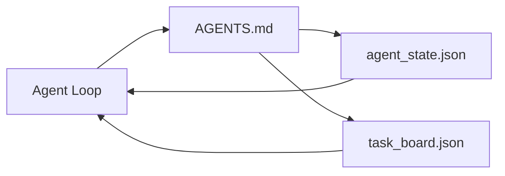

# Le plus petit agent de bureau

> Le plus petit tableau de travail disponible  n'a que trois fichiers: un routeur d'instructions racine  un fichier d'état, ainsi qu'un tableau de tâches  Tout le reste est superposé dessus.

**Type:** Build
**Languages:** Python (stdlib)
**Prerequisites:** Phase 14 · 31（为什么强大的模型仍然失败）
**Time:** ~45 分钟

## Objectif de l'apprentissage
- 定义构成最小可行工作台 的三个文件──
- Expliquez pourquoi un simple routeur racine gagne un simple long.`AGENTS.md`Il y a une autre.
- Construire un agent chaque tour peut lire et écrire à la fin du fichier d'état.
- Construire un tableau de tâches 工作的不依赖聊天史、也能支多会议──

##  problématique
La plupart des équipes passeraient à écrire un 3000 ligne.`AGENTS.md`Pour construire un banc de travail, on pense que c'est fini. Le modèle le charge, il ignore les parties insurmontables, puis reste sur la même surface que celui qui a toujours échoué.

Vous avez besoin de quelque chose de contraire. Un petit dossier de racine, juste en relation, pour le mettre en route vers un dossier plus profond.

Chaque document a une responsabilité. Chaque document est assez lisible pour être développé en un véritable système.

## 概念


### Agents.md est un routeur, pas manuel.

C' est bon .`AGENTS.md`Il est très court.

- Le dossier de l'État
- Le conseil d'administration
- Les règles de plus en plus profondes`docs/agent-rules.md`Je suis là.
- Commande de vérification (How do you know it can work)

Le contenu de plus long est mis dans des documents plus profonds, seulement en temps de besoin chargé.

### agent_state.json est un système de dossiers

État 携带: active task id、被触及文件、已做假设、blocker, ainsi que la prochaine action──Agent 每一轮都会读取它──下一个会议 读取它,而不是重放聊天──

L'État existe dans les fichiers, car l'historique du chat est indépendant. Les sessions se terminent. Les conversations seront coupées.

### task_board.json est en file d'attente

Tableau de tâches  Portez chaque tâche, état pour `todo | in_progress | done | blocked`◊ Quand l'état est en l'air, c'est la queue de l'agent qui prend des missions; quand vous vous demandez si l'agent est en train de marcher sur la bonne voie, c'est aussi la queue que vous prenez.

Le conseil d'administration a une tâche, un but, un propriétaire.`builder`- Je suis là.`reviewer`Ou `human`Il y a aussi des problèmes de planification et non de conseil.

### Les trois documents sont bas, pas au-dessus.

Les cours suivants ajouteront des contrats de portée, des coureurs de retour, des portes de vérification, des listes de contrôle des réviseurs et des paquets de remise en main.


```figure
wb-three-files
```

## - Je le construis.
`code/main.py`会把最小工作桌 写入一个空 repo,并演示单轮代理转,它会:

1. 读取 `agent_state.json`Il y a une autre.
2. Si l'état est vide, on commence à partir.`task_board.json`Je vais faire une tâche.
3. Dans le cadre de la procédure, il y a un seul dossier.
4. 写回更新后的状态──

Je vais le faire.

```
python3 code/main.py
```

脚本会在自身旁边创建 `workdir/`, placez ces trois documents, lancez une ronde, puis imprimez une différence.

## Utilisez-le
Dans les produits de production, trois documents similaires apparaissent sous différents noms:

- **Claude Code:**- Je veux le faire .`AGENTS.md`Ou `CLAUDE.md`作为路由器,用 `.claude/state.json`Les magasins sont en état, avec des crochets, comme une planche.
- **Codex / Cursor:**Règles de l'espace de travail 作为路由器,session mémoire 作为状态,chat sidebar 中的排列任务 作为板──
- **Custom Python agent:**C'est ce que tu viens de écrire.

Le nom va changer.

## Mode de production dans le réel

Quand trois types de modèles sont superposés au plus petit tableau de travail, il peut être testé par de vrais monorepos.

**带 nearest-wins precedence 的嵌套 `AGENTS.md`。**OpenAI a publié 88 articles dans son référentiel principal .`AGENTS.md`文件, chaque sous-composant un··Codex、Cursor、Claude Code 和 Copilot  都会从当前工作文件一路向 repo root 遍历,并连接沿途找到的每一个 `AGENTS.md`◊ sous-répertoire 文件扩展 fichier racine──Codex 添加了 `AGENTS.override.md`, pour remplacer et non pour étendre; le mécanisme de surride est spécifique au codex, faire un outil croisé 工作时应避免使用──Augment Code`AGENTS.md`文件带来的质量提升, équivalent à la mise à niveau de Haiku à Opus; les fichiers les plus défectueux permettront de produire des fichiers plus défectueux que ceux qui ne sont pas complètement disponibles.

**即使看起来像 coverage，也要拒绝的 anti-patterns。**相互冲突的指示 会把代理从互动模式 降至贪模式(ICLR 2026 AMBIG-SWE:48.8% → 28% résolution rate);应给优先事项 编号,而不是把它们平铺堆叠――不可验证的风格规则(遵循Google Python Style Guide) Si il n'y a pas de commande d'application,就会让代理自行想象合规;每条风格规则都应配上精确的 lint command;;以风格开头而不是以命令开头,会埋没验证路径;命令在前风格,在后风格在后面──为人类而不是代理写内容浪费语境预算;简洁会是一种特征──

**Cross-tool symlinks。**Un seul fichier racine  accompagner des liens symboliques`ln -s AGENTS.md CLAUDE.md`- Je suis là.`ln -s AGENTS.md .github/copilot-instructions.md`- Je suis là.`ln -s AGENTS.md .cursorrules`), permettront à chaque agent de codage d'utiliser la même source de vérité.`nx ai-setup`Je vais basé sur une seule configuration, en effectuant automatiquement cette tâche entre Claude Code, Cursor, Copilot, Gémeaux, Codex et OpenCode.

## Je le livre.
`outputs/skill-minimal-workbench.md`Pour chaque nouveau référencement, une table de travail de trois documents est créée.`AGENTS.md`Un routeur contient des clés correctes.`agent_state.json`, ainsi qu' un décalage initiale de l' utilisation actuelle .`task_board.json`Il y a une autre.

## 练习
1. Je vous en donne .`agent_state.json`- Je suis là.`last_run`Si le dossier est supérieur à 24 heures, sauf confirmation de l'opérateur, le refus de la mise en service.
2. Donnez-lui une carte de tâches`priority`champ,并修改拉拉,使其总是选择优先级最高的 `todo`Il y a une autre.
3. Il va`task_board.json`迁移到 JSON Lines, faire chaque tâche 占一行,并让差异在版本控制中保持清晰──
4. 编写一个 `lint_workbench.py`- Je suis là .`AGENTS.md`80  行, ou citées 文件时失败不存在
5. Jugez lequel de ces trois documents perd le plus de mal.

## 关键术语
| Term | What people say | What it actually means |
|------|----------------|------------------------|
| Router | `AGENTS.md` | 指向更深层 docs 和 files 的简短 root file |
| State file | "The notes" | 记录 agent 所在位置的 machine-readable 记录，每一轮都会写入 |
| Task board | "The backlog" | 带有 status、owner、acceptance 的工作 JSON queue |
| System of record | "Source of truth" | 当 chat 消失时，workbench 视为权威的文件 |

## 延伸阅读
- [agents.md — the open spec](https://agents.md/) 被 Cursor、Codex、Claude Code、Copilot、Gemini、OpenCode  Adoption
- [Augment Code, A good AGENTS.md is a model upgrade. A bad one is worse than no docs at all](https://www.augmentcode.com/blog/how-to-write-good-agents-dot-md-files) 测得的质量提升
- [Blake Crosley, AGENTS.md Patterns: What Actually Changes Agent Behavior](https://blakecrosley.com/blog/agents-md-patterns)Ce qui est effectivement valable, ce qui est inefficace
- [Datadog Frontend, Steering AI Agents in Monorepos with AGENTS.md](https://dev.to/datadog-frontend-dev/steering-ai-agents-in-monorepos-with-agentsmd-13g0) pratique de la prééminence niché
- [Nx Blog, Teach Your AI Agent How to Work in a Monorepo](https://nx.dev/blog/nx-ai-agent-skills) 跨六种工具的单源生成
- [The Prompt Shelf, AGENTS.md Best Practices: Structure, Scope, and Real Examples](https://thepromptshelf.dev/blog/agents-md-best-practices/)Réglage des sections de l'examen
- [Anthropic, Claude Code subagents and session store](https://docs.anthropic.com/en/docs/agents-and-tools/claude-code/sub-agents)
- Phase 14 · 31  Le mode d'échec minimum de l'absorption
- Phase 14 · 34  本课预览 du schéma d'état durable
