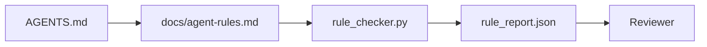

# Ordre d'agent en tant que liaison exécutable

> L'ordre écrit avec des essais est un souhait. L'ordre écrit avec des essais est un test.

**类型：**Construction
**语言：**Python (stdlib)
**前置要求：**Phase 14 · 32 (Pôle de travail minimum)
**时间：**Une cinquantaine de minutes.

## Objectif de l'apprentissage

- Les instructions de route et les règles d'exploitation seront séparées.
- Les règles de démarrage, l'interdiction de l'exploitation, la définition, l'incertitude et le traitement des limites d'approbation sont exprimées en tant que restrictions de contrôle des machines.
- 实现 un contrôleur de règles, utiliser le groupe de règles pour effectuer des évaluations d'une opération.
- 让规则集便于变化, afin que l'évaluation puisse voir ce qui a changé.

##  problématique

typique `AGENTS.md`Il a dit à l'agent qu'il devait faire preuve de prudence et de plein contrôle, ainsi qu'à l'incertitude quant à la question. Trois jours plus tard, l'agent a livré un changement sans examen, a écrit un dossier interdit, et n'a jamais posé de questions, car il ne savait pas où se trouvait la frontière.

Quand les instructions sont opérationnelles, elles sont très fortes; quand les instructions sont simplement visuelles, elles sont très faibles.

## 概念

Les règles doivent être mises en place.`docs/agent-rules.md`Le centre, éloigné de la courte histoire des routes de la vie.



### 覆盖大多数规则的五个类别

| 类别 | 规则回答的问题 | 示例 |
|----------|---------------------------|---------|
| Startup | 工作开始前必须满足什么？ | “state file exists and is fresh” |
| Forbidden | 什么事情绝对不能发生？ | “do not edit `scripts/release.sh`” |
| Definition of done | 什么能证明任务已完成？ | “pytest exits 0 and acceptance line passes” |
| Uncertainty | Agent 不确定时该做什么？ | “open a question note instead of guessing” |
| Approval | 什么需要人工审批？ | “any new dependency, any prod write” |

Il est impossible de classer l'une de ces cinq catégories de règles, généralement il faut les diviser en deux règles.

### La règle est lisible

Chaque règle a une flèche, une catégorie, une description, et une`check`字段,指向 `rule_checker.py`Une fonction intermédiaire: Ajouter des règles signifie ajouter des contrôles; les contrôles augmentent avec le travail.

### Les règles sont différentes

規則在一个Markdown文件中, chaque article de la règle occupe un titre. 改名在不同中可见. 新规则放在其类别的顶部. 过时规则应删除,而不是注释掉,因为工作台才是真相来源,不是团队上个季度感受如何的聊天记录.

### 规则与框架 garde-corps

Les règles de mise en œuvre de la loi sont les règles de mise en œuvre de la loi et les règles de mise en œuvre sont les règles de mise en œuvre de la loi.

### Révélation progressive: 図書, et non 百科全书

`AGENTS.md`Il y a peu d'incidents où un article ne sera pas supprimé. Un an plus tard, ce document peut avoir deux mille lignes; l'agent qui a fini de lire la première émission ne peut exécuter qu'une petite partie de ce budget.

Le mode de réparation n'est pas d'écrire un fichier plus court, mais d'écrire un fichier de couche séparée. Le routeur de base doit être petit jusqu'à chaque session, il peut lire et ne conserver que des pointers.

```text
AGENTS.md                  # router，少于 50 行：这个 repo 是什么、去哪里看、5 条硬规则
docs/
  agent-rules.md           # 完整规则集（本课）
  architecture.md          # 任务触及 module boundaries 时加载
  testing.md               # 任务编写或运行 tests 时加载
  deploy.md                # 只在 release 工作中加载，并受 approval rule 保护
feature_list.json          # backlog（Phase 14 · 36）
```

| Tier | 存放位置 | 读取时机 | 大小预算 |
|------|----------|----------|----------|
| Router | `AGENTS.md` | 每个 session，始终读取 | 少于约 50 行 |
| Rules | `docs/agent-rules.md` | 每个 session 启动时 | 每个 category 一屏 |
| Topic docs | `docs/<topic>.md` | 只有任务触及该主题时 | 需要多深就多深 |

Deux tests peuvent faire en sorte que le niveau de fidélité soit maintenu. Le premier est le test d'accessibilité: l'agent doit pouvoir sortir du routeur, le plus souvent deux sauts pour arriver à n'importe quelle règle, donc le routeur doit suivre le chemin de chaque document lié au sujet, plutôt que de le décrire en prose. Le second est le test de fraîcheur: le routeur est assez court, le réviseur va le lire à nouveau dans chaque rapport, c'est la seule façon de le prévenir.


```figure
wb-rule-checkoff
```

## - Je le construis.

`code/main.py`提供:

- `agent-rules.md`Parser,将规则加载到数据类 中──
- `rule_checker.py`风格的检查函数, pour chaque `check`- Je suis un homme.
- Un agent démo s'est lancé, il a violé deux règles, et une fois, il a pu capturer ces infractions.

Je vais le faire.

```
python3 code/main.py
```

输出:解析后的规则集、运行追踪、每条规则的通过/失败,以及保存在脚本旁边的 `rule_report.json`Il y a une autre.

## Mode de production

Il existe trois modèles qui distinguent un ensemble de règles qui peut durer un trimestre d'une semaine d'une semaine de récession.

**编写时标注严重性。**Chaque règle est en vigueur.`severity`- Le numéro de la liste:`block`- Je suis là.`warn`Ou `info` Les inspecteurs se réunissent pour le rendre compte de la situation.`block`La plupart des équipes précoces évalueront la gravité, puis l'affaibliront sous la pression de la date de fin; lors de la rédaction, le marquage obligera l'équipe à prévenir la préparation.`block`规则的过失 签入 `overrides.jsonl`Le journal de vérification

**规则过期作为强制机制。**Chaque règle est en vigueur.`expires_at`Le jour où un article n'a pas été rédigé, pendant 60 jours, sans aucune infraction, le contrôleur émet un avertissement; la prochaine période d'évaluation indique les raisons de sa rétention ou de sa diminution.`info`Les données de la production d'IA Code Review de Cloudflare (en anglais seulement) montrent que les règles du mécanisme de repo sont maintenues dans chaque repo à 30 articles, et que les règles du mécanisme de repo ne sont pas atteintes de 80 ans.

**Markdown 作为 source，JSON 作为 cache。** `agent-rules.md`est l'auteur du document;`agent-rules.lock.json`Il est utilisé pour la mise en cache de l'application JSON.`package.json`- Je suis là .`package-lock.json`et `Cargo.toml`- Je suis là .`Cargo.lock`C'est comme ça.

## Utilisez-le

Dans la production:

- Claude Code、Code、Cursor  session  lecture des règles, et refuser d'opérer  citation                                                                                                                                                                                                                                                                                                                                                                                                                                                                                                    
- Les barreaux SDK d'OpenAI Agents seront enregistrés pour les barreaux d'entrée et de sortie.
- LangGraph interrompt le nœud qui est en cours d'exécution  infraction aux règles 触发──interrompre le manipulateur 读取规则, interroge l'homme, puis récupère──

Ce code peut être porté entre les trois, car il est simplement un marquage avec un nom de fonction.

## Je le livre.

`outputs/skill-rule-set-builder.md`Le propriétaire du projet de réunion, classera les instructions de partage existantes en cinq catégories, et publiera une version avec`agent-rules.md`Une boîte à inspecteurs.

## 练习

1. Si votre produit a vraiment besoin d'une sixième catégorie, ajoutez-le. Expliquez pourquoi il ne peut pas être classé dans l'une de ces cinq catégories.
2. 扩展检查器, faire les règles peuvent porter gravité`block`- Je suis là.`warn`- Je suis là.`info`), et de faire rapport sur la gravité de la concentration.
3. Si les règles de sévérité de blocage de l'agent sont défavorables, alors la construction est défaillante.
4. Pour chaque règle ajouter un passage à expiration.
5. Trouver une vraie`AGENTS.md`Il a réécrit le texte en cinq catégories de règles.

## 关键术语

| 术语 | 人们的说法 | 它实际意味着什么 |
|------|----------------|------------------------|
| Operational rule | “一条真正的指令” | 工作台可在运行时检查的规则 |
| Aspirational rule | “谨慎一点” | 没有检查的规则；要么删除，要么升级 |
| Definition of done | “Acceptance” | 证明任务已完成的客观、基于文件的证据 |
| Block severity | “硬规则” | 违规会中止运行；没有 operator 不能静默处理 |
| Rule expiry | “过时规则清理” | 在 N 天内没有失败的规则可以考虑退役 |

## 延伸阅读

- [OpenAI Agents SDK guardrails](https://platform.openai.com/docs/guides/agents-sdk/guardrails)
- [LangGraph interrupts](https://langchain-ai.github.io/langgraph/how-tos/human_in_the_loop/breakpoints/)
- [Anthropic, Building Effective Agents](https://www.anthropic.com/research/building-effective-agents)
- [Rick Hightower, Agent RuleZ: A Deterministic Policy Engine](https://medium.com/@richardhightower/agent-rulez-a-deterministic-policy-engine-for-ai-coding-agents-9489e0561edf) Bloc/avertissement/info 严重性
- [Cloudflare, Orchestrating AI Code Review at Scale](https://blog.cloudflare.com/ai-code-review/) 131k fois examen 运行,规则组合经验
- [microservices.io, GenAI development platform — part 1: guardrails](https://microservices.io/post/architecture/2026/03/09/genai-development-platform-part-1-development-guardrails.html) 规则 规则 规则 规则 规则 规则 规则 规则 规则 规则 规则 规则 规则 规则 规则 规则 规则 规则 规则 规则 规则 规则 规则 规则 规则 规则 规则 规则 规则 规则 规则 规则 规则 规则 规则 规则 规则 规则 规则 规则 规则 规则 规则 规则 规则 规则 规则 规则 规则 规则 规则 规则 规则 规则 规则 规则 规则 规则 规则 规则 规则 规则 规则 规则 规则 规则 规则 规则 规则 规则 规则 规则 规则 规则 规则 规则 规则 规则 规则 规则 规则 规则 规则 规则 规则 规则 规则 规则 规则 规则 规则 规则 规则 规则 规则 规则 规则 规则 规则 规则 规则 规则 规则 规则 规则 规则 规则 规则 规
- [Type-Checked Compliance: Deterministic Guardrails (arXiv 2604.01483)](https://arxiv.org/pdf/2604.01483) Lean 4  作为规则-as-check 的上限
- [logi-cmd/agent-guardrails](https://github.com/logi-cmd/agent-guardrails) fusion-gate 实现: scope、mutation testing、violation budgets
- Phase 14 · 32  Le règlement collecte de l'accès de la banque de travail minimale
- Phase 14 · 38  Porte de vérification du rapport de règlements de consommation
- Phase 14 · 39  Agents réviseurs de l'évaluation des règles conformes à la norme
