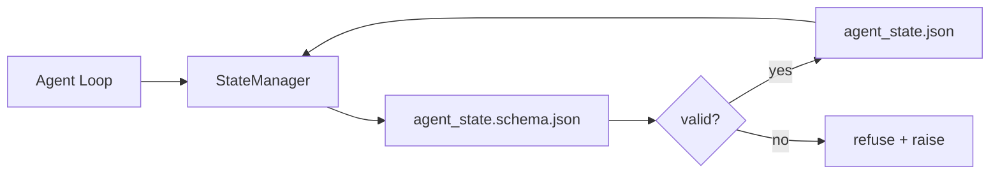

# Répondeur et état durable

> L'historique du chat est facile à perdre. Le référencement est durable.

**Type:** Build
**Languages:** Python (stdlib + `jsonschema` optional)
**Prerequisites:** Phase 14 · 32 (Minimal Workbench)
**Time:** ~60 minutes

## Objectif de l'apprentissage
- 定义什么属于 repo memory,什么属于聊天历史──
- Pour`agent_state.json`et `task_board.json`编写 JSON Schemas。
- Construire un gestionnaire d'État, utilisé pour la chargement, l'authentification, les changements et la perpétuation de l'état atomique.
- Utilisez le schéma de travail de travail de travail de travail de travail de travail de travail de travail de travail de travail de travail de travail de travail de travail de travail de travail de travail de travail de travail de travail de travail de travail de travail de travail de travail de travail de travail de travail de travail de travail de travail de travail de travail de travail de travail de travail de travail de travail de travail de travail de travail de travail de travail de travail de travail de travail de travail de travail de travail de travail de travail de travail de travail de travail de travail de travail de travail de travail de travail de travail de travail de travail de travail de travail de travail de travail de travail de travail de travail de travail de travail de travail de travail de travail de travail de travail de travail de travail de travail de travail de travail de travail de travail de travail de travail de travail de travail de travail de travail de travail de travail de travail de travail de travail de travail de travail de travail de travail de travail de travail de travail de travail de travail de travail de travail de travail de travail de travail de travail de travail de travail de travail de travail de travail de travail de travail de travail de travail de travail de travail de travail de travail de travail de travail de travail de travail de travail de travail de travail de travail de travail de travail de travail de travail de travail de travail de travail de travail de travail de travail de travail de travail de travail de travail de travail de travail de travail de travail de travail de travail de travail de travail de travail de travail de travail de travail de travail de travail de travail de travail de travail de travail de travail de travail de travail de travail de travail de travail de travail de travail de travail de travail de travail de travail de travail de travail de travail de travail de travail de travail de travail de travail de travail de travail de travail de travail de travail de travail de travail de travail de travail de travail de travail de travail de travail de travail de travail de travail de travail de travail de travail de travail de travail de travail de travail de travail de travail de travail de travail de travail de travail de travail de travail de travail de travail de travail de travail de travail de travail de travail de travail de travail de travail de travail de travail de travail de travail de travail de travail de travail de travail de travail de travail de travail de travail de travail de travail de travail de travail de travail de travail de travail de travail de travail de travail de travail de travail de travail de travail de travail de travail de

##  problématique
L'agent a terminé une session. Il a terminé une session. Il a ouvert une session. Il a posé des questions. Il a commencé une session.

Le mode de révision de la table de travail est la mémoire de repo: state existence de repo dans le JSON 文件里, selon le schéma 写入,以原子方式持久化,并且在代码审查中对对差友好──Chat 是临时;repo 是记录系统──

## 概念


### Qu'est-ce qui appartient à la mémoire repo ?

| 属于 | 不属于 |
|---------|-----------------|
| Active task id | 原始 chat transcripts |
| 本 session 触碰过的文件 | Token-level reasoning traces |
| agent 做出的假设 | "The user seemed frustrated" |
| 未解决的 blockers | Sampled completions |
| 下一步 action | Vendor-specific model ids |

Le critère de jugement est de durabilité: trois mois plus tard, lorsque le CI reprend son fonctionnement, cela est-il également utile ?

### État du premier schéma

Le schéma JSON est un accord. Sans lui, chaque agent émet un nouveau passage, chaque critique apprend un nouveau format, chaque script CI doit faire un cas particulier à la version précédente.

Schéma 覆盖:

- Les clés sont nécessaires.
- 允许的 `status`Les valeurs
- 禁止的值(exemple des matrices `null`)。
- Réservations de modèle`T-\d{3,}`)。
- Utilisé dans le champ de version de migrations.

### Atomic écrit

L'état 写入需要能承受部分失败:写入tempfile,fsync, puis renommé 覆盖目标──l'état du fichier est la source de vérité; écrire jusqu'à la moitié du fichier de l'état 比没有文件更糟──

### Migrations

Quand le schéma change, dans le schéma bump 旁边交付一个迁移脚本──状态文件 带有 带有 `schema_version`champ;le gestionnaire refusera de charger la version du fichier qui ne peut pas être déplacé.


```figure
wb-state-persist
```

## - Je le construis.
`code/main.py`实现:

- `agent_state.schema.json`et `task_board.schema.json`Il y a une autre.
- Un seul validateur de stdlib est utilisé.
- Avec un nom et un tempérament atomiques`StateManager.load`- Je suis là.`StateManager.update`- Je suis là.`StateManager.commit`Il y a une autre.
- Une démo: "changement d'état"", persévérance"", reloading, et démonstration de retour en arrière"".

Je vais le faire.

```
python3 code/main.py
```

Le script 会写入 `workdir/agent_state.json`et `workdir/task_board.json`, à travers deux tours 变更它们, et à chaque étape imprimer l'état de l'expérience.

## Mode de production dans le réel

Les quatre modes peuvent transformer le minimum de ce cours en un monorepo multi-agent acceptable.

**Atomic temp-and-rename 不是可选项。**Un rapport de bug du projet Hive de mars 2026 a clairement enregistré ce mode d'échec:`state.json`- Je suis là.`write_text()`写入,并且例外 被捕后静默忽略──部分写入让会议 在没有信号的情况下基于损坏状态 恢复──修复永远是:在与目标相似的目录中使用`tempfile.mkstemp`, écrit dans,`fsync`- Je suis désolé .`os.replace`(sur POSIX et Windows, ils sont tous renommés à l'atome)`atomic_write`C'est ce qu'on fait.

**每个非幂等 tool call 都要有 idempotency keys。**Si l'agent utilise l'outil  后、checkpoint 结果之前崩, le processus de récupération va réessayer cet appel à l'outil ∼对读安全;对电子邮件、DB inserts、file uploads 危险──模式是:在执行前将每个工具的电话ID 记录到`pending_calls.jsonl` Réessayer à vérifier cette ID; si elle existe, sauter sur la mise en cache et utiliser le résultat caché.

**将大型 artifacts 与 state 分离。**Ne pas mettre les CSV, les transcriptions ou les fichiers générés dans le stockage`agent_state.json` Le matériel est conservé pour un seul dossier, ou il est transmis à un autre objet, l'état est conservé uniquement par voie de contrôle.

**Event sourcing 用于 audit，snapshots 用于 resume。**Chaque mutation est ajoutée au journal des événements.`state.events.jsonl`); une prise de vue régulière de la situation`state.json`◊ Resume 读取 snapshot, puis reproduire snapshot timestamp 后的所有事件── This will consume more disk, but allows you per word replay agent decisions, this is about调试 long-horizon runs 至关重要──Postgres 内部用于WAL的也是一样的形状──

**Schema migrations，否则拒绝加载。** `schema_version`L'intégralité est un accord. Lorsque le gestionnaire charge une version inconnue du fichier, il refuse de lire.`tools/migrate_state.py`Dans chaque démarrage, il y a des opérations.

## Utilisez-le
Dans la production:

- **LangGraph checkpointers。**Le schéma de lecture est le schéma de l'état du point de contrôle, le défaut du point de lecture, le besoin de manuel.
- **Letta memory blocks。**Les blocs persistants des schémas structurés (Phase 14 · 08) ⋅ de même nature, le domaine d'action est celui des personnes à long terme ⋅
- **OpenAI Agents SDK session store。**Les dossiers de fond connexes, les plans-conscients.

## Je le livre.
`outputs/skill-state-schema.md`会生成一对项目特定JSON Schema(state + board) 、一个连接到原子写的Python `StateManager`, ainsi qu'un échafaudage de migration, assurez-vous que la prochaine éruption du schéma ne détruira pas le bureau.

## 练习
1. - Je suis là.`last_human_touch`Temps-marque. Rejeté toute édition humaine.
2. 扩展 validator 以支持 `oneOf`, une telle tâche peut être une tâche de construction, ou une tâche de révision, et les deux ont des champs requis différents.
3. 添加 `schema_version`champ,并编写从 v1到 v2 的迁移(将 `blockers`重命名为 `risks`)。
4. Va mettre en cache le stockage du fichier local  déplacé vers SQLite 保持`StateManager`L'API est en constante évolution.
5. Laissez deux agents écrire la course de 50 ms en même temps que d'écrire dans le même dossier.

## 关键术语
| Term | What people say | What it actually means |
|------|----------------|------------------------|
| Repo memory | "Notes file" | 按 schema 存储在 repo 的 tracked files 中的 state |
| Schema-first | "Validate inputs" | 先定义契约再写 writer，拒绝漂移 |
| Atomic write | "Just rename" | 写入 temp，fsync，rename，因此 partial failures 无法破坏 |
| Migration | "Schema bump" | 将 vN state 转换为 v(N+1) state 的 script |
| System of record | "Source of truth" | workbench 视为权威的 artifact |

## 延伸阅读
- [JSON Schema specification](https://json-schema.org/specification.html)
- [LangGraph checkpointers](https://langchain-ai.github.io/langgraph/concepts/persistence/)
- [Letta memory blocks](https://docs.letta.com/concepts/memory)
- [Fast.io, AI Agent State Checkpointing: A Practical Guide](https://fast.io/resources/ai-agent-state-checkpointing/) première mise en place de points de contrôle par schéma
- [Fast.io, AI Agent Workflow State Persistence: Best Practices 2026](https://fast.io/resources/ai-agent-workflow-state-persistence/) contrôle de la concurrence TTL  source d'événements
- [Hive Issue #6263 — non-atomic state.json writes silently ignored](https://github.com/aden-hive/hive/issues/6263) mode de défaillance du projet réel
- [eunomia, Checkpoint/Restore Systems: Evolution, Techniques, Applications](https://eunomia.dev/blog/2025/05/11/checkpointrestore-systems-evolution-techniques-and-applications-in-ai-agents/) D'OS 历史 应用于 agents de CR primitives
- [Indium, 7 State Persistence Strategies for Long-Running AI Agents in 2026](https://www.indium.tech/blog/7-state-persistence-strategies-ai-agents-2026/)
- [Microsoft Agent Framework, Compaction](https://learn.microsoft.com/en-us/agent-framework/agents/conversations/compaction) directeur du point de contrôle du fournisseur
- Phase 14 · 08  Blocs de mémoire et calcul du temps de sommeil
- Phase 14 · 32  本课为其方案化三档次最低
- Phase 14 · 40  De la même schéma 读取的转发包
