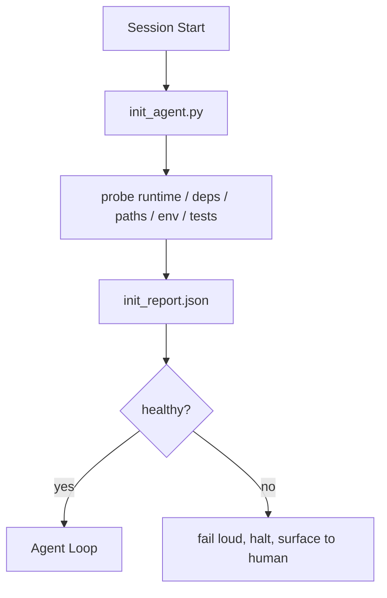

# Scénario d'initiation de l'agent

> Chaque session de démarrage à froid doit payer un prix. L'agent va lire le même document, réessayer le même processus de recherche, et retrouver le même chemin.

**Type:** Build
**Languages:** Python (stdlib)
**先修要求：**Phase 14 · 32 (tableau de travail minimum), phase 14 · 34 (mémoire de référencement)
**Time:** ~45 分钟

## Objectif de l'apprentissage
- L'agent de reconnaissance ne devrait pas répéter le travail à chaque séance.
- Construire un script init de détermination, pour rechercher le temps de fonctionnement, les dépendances et la santé de la repo.
- Résultat de la recherche, laisse l'agent la lire, plutôt que de la refaire.
- Lorsque la mise en place échoue, il faut résonner, rapidement échouer, et fournir une position unique de recherche.

##  problématique
打开一个会议──Agent 猜测 Python version──猜测测测试命令──为了找到入口点,列出 repo root 五次──尝试进口一个未安装的包──询问用户配置文件 在哪里──等到它真正开始编辑时,已经有十万代币花在本应由一个脚本完成的设置工作 上──

修复方式是使用一个初始化脚本: il fonctionne avant que l'agent fasse quoi que ce soit,并写入一个供代理 启动时读取的 `init_report.json`Il y a une autre.

## 概念


### init script 探查什么

| Probe | 为什么重要 |
|-------|------------|
| Runtime versions | 错误的 Python 或 Node version 意味着悄无声息的错误版本 bug |
| Dependency availability | 缺失的 package 如果到后面才发现，成本会是现在捕获它的十倍 |
| Test command | Agent 必须知道如何 verify；如果 command 缺失，workbench 就坏了 |
| Repo paths | Hard-coded paths 会漂移；一次性解析并固定下来 |
| Environment variables | 缺失 `OPENAI_API_KEY` 是一个 failure surface，而不是 runtime mystery |
| State + board freshness | 崩溃 session 留下的陈旧 state 是一个 footgun |
| Last-known-good commit | 作为 session 结束时 handoff diff 的锚点 |

### Rapidement, il a échoué, il s'est concentré sur un échec.

Le test échouer signifie arrêter et se présenter à l'homme. Ne dites pas Agent 会自己弄清楚──init's whole meaning is in workbench 损坏时拒绝启动.

### Idempotent

连续运行两次──第二次除刷新时间打印之外应该是没有开机――Idempotence 让你可以将脚本连接到CI、hooks或预任务slash命令──

### Règles init versus démarrage

Règles (Phase 14 · 33)  描述行动前必须满足什么──Init est d'établir ces règles 脚本可检查的脚本──没有 init 的 rules 变成要小心──没有规则 的 init 变成精致的失败──


```figure
wb-init-probes
```

## - Je le construis.
`code/main.py` réalisé `init_agent.py`- Le numéro de la liste:

- Il y a cinq sondes: version Python,`importlib.util.find_spec`列出的 dépendances 测试命令可解决性 要求环境 状态文件新鲜性──
- Chaque sonde revient .`(name, status, detail)`Il y a une autre.
- 脚本写入 contient l' ensemble complet de sondes `init_report.json`, et à toute sonde de gravité de bloc  failure 时以非零状态退出──

Je vais le faire.

```
python3 code/main.py
```

脚本会打印探测表,写入 `init_report.json`, sur le chemin heureux, de retour à zéro, ou de retour à zéro en cas de défaite et de liste de sondes ratées.

## Mode de production dans le réel

Trois modes peuvent distinguer un script init utile et un sens rituel.

**Last-known-good commit anchoring.**L' engagement actuel sera fusionné avec le succès précédent`LKG`Si le dossier est différent de son budget, il refuse de le démarrer et demande à l'homme de confirmer une nouvelle ligne de base. C'est la façon dont l'AI Code Review de Cloudflare utilise des agents de révision pour limiter son champ d'action. Chaque session de révision est déterminée à la même fin.

**Lock files with TTL.**Après avoir réussi la première enquête ,`prereqs.lock`◊后续运行会在 N 小时内信任该锁(默认 24h),并跳过昂贵的探测.

**No network, no LLM, no surprises in the hot path.**Les sondes init sont des plomberie de détermination. Il faut utiliser le LLM pour classer les défaillances ou visiter un service externe.

## Utilisez-le
Dans la production:

- **Claude Code hooks.** `pre-task`Hook a utilisé le script init, et a refusé de lancer l'agent lorsqu'il a échoué.
- **GitHub Actions.** `setup-agent`Le travail d'agent dépend de lui.
- **Docker entrypoint.**Container d'agent dans le temps d'exécution de l'agent exécutif 之前运行 init script;失败时呈现日志──

init script est portable, car il n'utilise aucun cadre spécifique.

## Je le livre.
`outputs/skill-init-script.md`Projet de réunion, travail de mise en place, sélectionnement, réalisation de projets spécifiques`init_agent.py`, ainsi qu' un flux de travail de l'informatique avant de le faire fonctionner à l'étape de l'agent.

## 练习
1. 添加一个探测器,用于不同 当前提交和最后知名好的提交; si les changements dépassent 50 文件,就拒绝启动──
2. Je vais mettre le script en ligne, je vais le mettre en ligne.`prereqs.lock`Le fichier, et verrouillé 超過七天時拒絕啟動──
3. - Je suis là.`--fix`Les dépôts de développement sont automatiquement installés, mais les dépôts de fonctionnement ne sont pas modifiés.
4. Pour ce compromis, les sondes sont transférées de fonctions de code dur à l'enregistrement YAML.
5. Pour chaque sonde, ajouter un budget de temps.

## 关键术语
| Term | 人们会怎么说 | 它实际意味着什么 |
|------|--------------|------------------|
| Probe | “一个 check” | 返回 `(name, status, detail)` 的确定性函数 |
| Init report | “Setup output” | 与 state 放在一起、写有 probe results 的 JSON |
| Idempotent | “可以安全重新运行” | 连续两次运行会生成除 timestamp 外完全相同的 reports |
| Fail loud | “不要吞掉” | 停止并呈现给 human；没有 silent fallback |
| Setup tax | “Bootstrap cost” | Agent 每个 session 为重新发现显而易见信息所花费的 Token |

## 延伸阅读
- [Anthropic, Effective harnesses for long-running agents](https://www.anthropic.com/engineering/effective-harnesses-for-long-running-agents)
- [GitHub Actions, composite actions for setup](https://docs.github.com/en/actions/sharing-automations/creating-actions/creating-a-composite-action)
- [microservices.io, GenAI 开发平台：guardrails](https://microservices.io/post/architecture/2026/03/09/genai-development-platform-part-1-development-guardrails.html) pré-engagement + CI 检查作为 init
- [Augment Code, How to Build Your AGENTS.md (2026)](https://www.augmentcode.com/guides/how-to-build-agents-md) attentes init
- [Codex Blog, Codex CLI Context Compaction](https://codex.danielvaughan.com/2026/03/31/codex-cli-context-compaction-architecture/) démarrage de la session comme initiateur conscient de la compactaison
- Phase 14 · 33  Cet épisode est un ensemble de règles de démarrage
- Phase 14 · 34  Le fichier d'état de la production
- Phase 14 · 38  init script  fournisseur de passerelle de vérification
- Phase 14 · 40  消费 init rapport de la dernière bonne répartition de la
