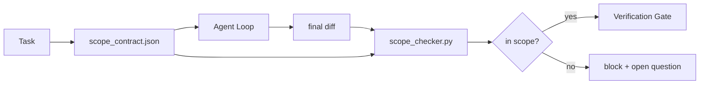

# Accord de portée et limites de tâches

> Le contrat de scope est un fichier par tâche, pour expliquer le travail à partir de où il commence, où il se termine, et une fois le processus de réintégration terminé.

**类型:**Construire
**语言:**Python (stdlib)
**先修:**Phase 14 · 32 (Pôle de travail minimal), phase 14 · 33 (Règles comme contraintes)
**时间:**- 50 minutes

## Objectif de l'apprentissage

-  Écrire un contrat de portée, faire en sorte que l'agent dans la tâche commence à lire, et faire vérifier dans la tâche fin de lire.
- déterminer les fichiers autorisés, les fichiers interdits, les critères d'acceptation, le plan de rétroaction et les limites d'approbation.
- ¢ réaliser un contrôle de portée, différencie par rapport à la violation du contrat ¢
- 让范围 creep可见、自动化且可审查──

##  problématique

L'agent 会 creep── mission est  réparer le bug de connexion──diff 触碰了登录路径、email helper、database driver、README 和 release script── chaque fois qu'il y a un toucher à l'époque, il y a une raison qui semble raisonnable──ensemble, ils sont devenus différents du contenu de l'examen précédent──

Le scope creep est le mode d'échec le plus manquant de surveillance de l'agent dans le travail, car l'agent va réellement raconter chaque étape. La méthode de réparation n'est pas plus stricte. La méthode de réparation consiste à mettre un contrat sur le disque, à indiquer ce qui a été promis, et à vérifier les résultats par rapport à l'engagement.

## 概念



### Le contrat de portée comprend

| Field | Purpose |
|-------|---------|
| `task_id` | 链接到 board 上的 task |
| `goal` | reviewer 可以验证的一句话 |
| `allowed_files` | agent 可以写入的 globs |
| `forbidden_files` | agent 即使意外也不得触碰的 globs |
| `acceptance_criteria` | 证明完成的 test commands 或 assertion lines |
| `rollback_plan` | 如果需要 halt，operator 可以执行的一段说明 |
| `approvals_required` | scope 外需要明确 human sign-off 的 actions |

Il n' y a pas de`forbidden_files`Le contrat est incomplet.

### Utilisez des globes, plutôt que des chemins bruts

Réel référencement, référencement, référencement, référencement, référencement, référencement, référencement, référencement, référencement, référencement, référencement, référencement, référencement, référencement, référencement, référencement, référencement, référencement, référencement, référencement, référencement, référencement, référencement, référencement, référencement, référencement, référencement, référencement, référencement, référencement, référencement, référencement, référencement, référencement, référencement, référencement, référencement, référencement, référencement, référencement, référencement, référencement, référencement, référencement, référencement, référencement, référencement, référencement, référencement, référencement, référencement, référencement, référencement, référencement, référencement, référencement, référencement, référencement, référencement, référencement, référencement, référencement, référencement, référencement, référencement, référencement, référencement, référencement, référencement, référencement, référencement, référencement, référencement, référencement, référencement, référencement, référencement, référencement, référencement, référencement, référencement, référencement, référencement, référencement, référencement, référencement, référencement, référencement, référencement, référencement, référencement, référencement, référencement, référencement, référencement, référencement, référencement, et référencement, référencement, référencement, et référencement, ré`app/**/*.py`- Je suis là .`tests/test_signup*.py`), une telle session 间发生 时不会让合同 失效──

### Le retour en arrière est une partie de la portée .

列出如何滚回会迫使合同作者 思考可能出什么问题──不能滚回的合同是不应批准的合同──

### Vérifiez la portée de la différence

L'agent 写出 diff― 查cker 读取 diff― 允许球、禁止球,以及任何已运行接受命令的列表──每一个违法行为都是一个带标签的发现,验证网关可以拒绝它──

### Scope of the two kinds height: liste des caractéristiques et contrat de tâches

Le contrat de scope est lié à une tâche. Il ne se limite pas à l'ensemble du projet. L'agent peut être parfaitement laissé dans le contrat, mais la prochaine fois décider du projet nécessite également la page de paramètres, le mode sombre, ainsi que le routeur.

Deuxième hauteur nécessite son propre primitif: une session`feature_list.json`◊ c'est le dossier du projet.`status`Pour`todo`La fonctionnalité, le faire.`id`写入活 scope contract,并被禁止在同一会议中启动第二个功能. 一次只做一个功能.  不再是提示里代理可以绕过过去的一句话,而一个写在磁盘上的值,也是门可以执行的检查.

```json
{
  "project": "knowledge-base",
  "active": "import-pdf",
  "features": [
    { "id": "import-pdf", "status": "in_progress", "goal": "import a PDF into the library", "done_when": "pytest tests/test_import.py && a sample PDF appears in the library view" },
    { "id": "full-text-search", "status": "todo", "goal": "search document text and rank hits", "done_when": "query returns ranked results with snippets" },
    { "id": "cite-answers", "status": "todo", "goal": "answers carry source citations", "done_when": "every answer renders at least one clickable citation" }
  ]
}
```

| Field | Purpose |
|-------|---------|
| `active` | 当前 session 唯一允许触及的 feature；为空时表示选择一个并设置它 |
| `features[].id` | scope contract 的 `task_id` 指向的稳定 slug |
| `features[].status` | `todo`、`in_progress`、`done`、`blocked`；同一时间最多一个 `in_progress` |
| `features[].goal` | reviewer 能验证的一句话 |
| `features[].done_when` | 将 `in_progress` 翻转为 `done` 的 acceptance line |

两条规则让这个名单成为承重结构,而不是装饰.`at most one in_progress`Cette invariante 本身就是启动检查(Phase 14 · 33): si la liste 里出现两个, session 会拒绝启动,直到人类 解决。第二, la liste de fonctionnalités est un fichier, pas un message de chat, car le chat va se rassembler dans le contexte, alors que le fichier va se transférer entre les sessions、 entre les agents 持久存在──handoff(Phase 14 · 40) va terminer l'état de fonctionnalité 写回`done`Alors la prochaine session est ouverte et on voit le tableau de bord plutôt que le reste.

Contract avec liste                                                                                                                                                                                                                                                                                                                                                                                                                                                                                                                          `allowed_files`Il faut que la fonction active soit dans la portée de ce qu'elle touche, pas plus loin.


```figure
wb-scope-bounce
```

## - Je le construis.

`code/main.py`实现:

- `scope_contract.json`Schéma JSON Schema 的子集,multipliés)
- Un parseur différent, sera touché fichiers  Liste et exécuter des commandes  Liste transformer pour `RunSummary`Il y a une autre.
- Une .`scope_check`, selon le contrat  retour `(violations, in_scope, off_scope)`Il y a une autre.
- Deux démos: l'un pour garder le champ, l'autre pour faire creep.

运行:

```
python3 code/main.py
```

输出: contrat 两个运行 每个运行的判决,以及保存的`scope_report.json`Il y a une autre.

## Des modèles de production

Un praticien de la régularisation des opérations de réparation des données (exemple: un agent de réparation des données) a déclaré que, dans le cas d'un agent de réparation, le taux de rat-trou dans les trois semaines passerait de 52% à 21%.

**Violation budgets，而不是 binary failures。** `agent-guardrails`(Claude Code、Cursor、Windsurf、Codex 经由MCP使用的OSS merge gate) pour chaque tâche 提供 `violationBudget`Les informations sur les projets de développement et les projets de développement sont publiées dans le cadre de la communication de la Commission sur les projets de développement et les projets de développement.`violationSeverity: "error" | "warning"`Le budget décide si la porte sera adoptée ou si son équipe sera détestée.

**按 path family 做 severity asymmetry。**Pour le`docs/**`Les écrits hors de portée sont généralement `warn`; pour `scripts/**`- Je suis là.`migrations/**`- Je suis là.`config/prod/**`总是                       `block`Cette asymétrie doit être présente dans le contrat et non dans le temps de fonctionnement, car elle est spécifique au projet et chaque tâche change.

**Time 和 network budgets 与 file budgets 并列。** `time_budget_minutes`champ de l'horloge murale; temps de fonctionnement en cas de refus de continuer à le surpasser.`network_egress`Les données de l'application sont également disponibles dans les domaines de la programmation, de la programmation et de la gestion des données.

**Multi-contract merge semantics（least privilege）。**Lorsque deux contrats de portée sont également utilisés, par exemple un contrat à l'échelle du projet, un contrat spécifique à la tâche, les règles de fusion sont:**intersect** `allowed_files`(deux contrats doivent permettre cette voie),**union** `forbidden_files`(tout ce qui peut être interdit),`time_budget_minutes`取最严格值 (min),`approvals_required`Je suis en train de vous dire:`network_egress`Dans le milieu,`None`Indiquer que la loi n'est pas appliquée,`[]`Pour nier tout,`[...]`Indiquer la liste des autorisations; fusion 时,`None`让位于另一边,两个列表取交集,拒绝一切 保持否认一切──把这一点写入合同方案,这样合并就是机械且可审查的──

## Utilisez-le

Modèles de production:

- **Claude Code slash commands.** `/scope`commandement 写入合同,并将其固定为会议背景──Subagents 在行动前读取合同──
- **GitHub PRs.**Le contrat sera effectué en tant que fichier JSON 推送到PR body 中, ou en tant qu'artefact enregistré―CI 会针对 merge diff 运行 scope checker―
- **LangGraph interrupts.**La violation de la portée de l'accord est-elle une violation de la portée de l'accord ou un agent a-t-il besoin de renoncer ?

contrat avec tâche 流转──当任务 关闭时,合同 会归档到 `outputs/scope/closed/`Il y a une autre.

## Je le livre.

`outputs/skill-scope-contract.md`Une description de tâche, un contrat de portée, ainsi qu'un contrôleur de fonctionnement de chaque agent dans le CI.

## 练习

1. - Je suis là.`network_egress`champ,列出允许的外部主机──拒绝触碰其他主机的运行──
2.  Extension vérificateur, la faire pour `docs/**`- Je suis un peu déçu.`scripts/**`硬失败―― expliquer la raison de cette asymétrie―
3. Utiliser la règle statique définie`goal`champ 推导 `allowed_files`- Le premier cas de bord.
4. 添加 `time_budget_minutes`Il a fait une démarche de plus en plus difficile.
5. Pour le même diff 运行两个合同──当两者都适用时,正确的合并语义是什么?

## 关键术语

| Term | What people say | What it actually means |
|------|----------------|------------------------|
| Scope contract | “任务 brief” | per-task JSON，列出 allowed/forbidden files、acceptance、rollback |
| Scope creep | “它还 touched 了...” | 同一 task 中发生了 contract 外的文件变更 |
| Rollback plan | “我们可以 revert” | 用于 halt 的一段 operator runbook |
| Approval boundary | “需要 sign-off” | contract 中列出的、需要明确 human approval 的 action |
| Diff check | “Path audit” | 将 touched files 与 contract globs 比较 |

## 延伸阅读

- [LangGraph human-in-the-loop 中断](https://langchain-ai.github.io/langgraph/concepts/human_in_the_loop/)
- [OpenAI Agents SDK tool approval policies](https://platform.openai.com/docs/guides/agents-sdk)
- [logi-cmd/agent-guardrails — merge gates 与 scope validation](https://github.com/logi-cmd/agent-guardrails) les budgets de violation, niveaux de gravité
- [Dev|Journal, Preventing AI Agent Configuration Drift with Agent Contract Testing](https://earezki.com/ai-news/2026-05-05-i-built-a-tiny-ci-tool-to-keep-ai-agent-configs-from-drifting-in-my-repo/) 无 deps externes `--strict`mode
- [Agentic Coding Is Not a Trap (production logs)](https://dev.to/jtorchia/agentic-coding-is-not-a-trap-i-answered-the-viral-hn-post-with-my-own-production-logs-33d9) Résultats de la vérification des spécifications: 52% → 21%
- [OpenCode permission globs](https://opencode.ai/docs/agents/) 细粒度 pour chaque autorisation
- [Knostic, AI Coding Agent Security: Threat Models and Protection Strategies](https://www.knostic.ai/blog/ai-coding-agent-security)  comme le plus petit privilège
- [Augment Code, AI Spec Template](https://www.augmentcode.com/guides/ai-spec-template) Système de frontières de trois niveaux (ne jamais)
- Phase 14 · 27  Avec des verrous de portée 配套的快速注射防御
- Phase 14 · 33  Ce contrat  pour chaque tâche  ensemble de règles spécialisées
- Phase 14 · 38  vérificateur 汇报进入的验证门
