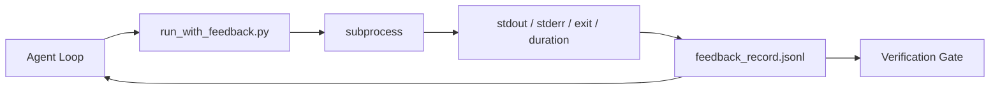

# Les boucles de rétroaction en temps d'exécution

> Il est possible de deviner le fonctionnaire qui effectue les commande en fonction de la situation, mais il est possible de deviner le fonctionnaire qui effectue les commande en fonction de la situation.

**Type:** Build
**Languages:** Python (stdlib)
**先修要求：**Phase 14 · 32 (tableau de travail minimum), phase 14 · 35 (scripte initiale)
**Time:** ~50 minutes

## Objectif de l'apprentissage
- 区分 runtime feedback et télémétrie d'observabilité
- Construire un coureur de rétroaction, l'utiliser pour emballer des commandes de shell et conserver des enregistrements structurés.
- Pour une certaine façon de couper les grandes sorties, laissez le cycle se maintenir dans le budget des jetons.
- Lorsque le retour de commentaire est manquant, refusez de poursuivre le cycle.

##  problématique
L'agent dit qu'il est en train de faire des tests. Toutes les tests ont été passés. La réalité est qu'aucun test n'a été fait. L'agent a imaginé une sortie, ou il a exécuté une commande, mais n'a jamais lu le résultat.

Le coureur de rétroaction va éliminer cette lacune. Chaque commande passe par le coureur.

## 概念


### enregistrement de rétroaction

| Field | 为什么重要 |
|-------|----------------|
| `command` | 精确 argv，避免 shell expansion 意外 |
| `stdout_tail` | 最后 N 行，确定性截断 |
| `stderr_tail` | 最后 N 行，与 stdout 分开 |
| `exit_code` | 明确无歧义的成功信号 |
| `duration_ms` | 暴露缓慢探测和失控进程 |
| `started_at` | 用于 replay 的 timestamp |
| `agent_note` | Agent 写下的一行预期说明 |

### La tranchée est déterminante.

50 MB de logs détruira le cycle. Le coureur conservera la tête et la queue,并加入 `...truncated N lines...`marqueur; c'est une certitude, donc la même sortie de données génère la même enregistrement.

### Réponse par rapport à la télémétrie

Télémetry (Phase 14 · 23, OTel GenAI conventions) est utilisé par les opérateurs humains 跨时间审查 runs。Feedback est utilisé pour la prochaine série de la prochaine série。 Ils partagent certains champs, mais se trouvent dans différents fichiers, la rétention est également différente。

### Pas de retour d' avis , refus de faire avancer .

Si le coureur a fait une erreur avant de sortir, le dossier contiendra`exit_code: null`et `error: <reason>`◊ L'agent boucle  doit être rejeté `null`La sortie affirme le succès. Pas de sortie.


```figure
wb-feedback-loop
```

## - Je le construis.
`code/main.py`实现:

- `run_with_feedback(command, agent_note)`: emballage `subprocess.run`, capture de la détente/découpage/de sortie/d'une durée, détermination de la déconnexion,并追加到 `feedback_record.jsonl`Il y a une autre.
- Un petit chargement, qui va faire passer JSONL à la liste Python.
- Une démo, trois commandes, succès, échec, lenteur, et imprimer le dernier enregistrement de chaque commande.

运行:

```
python3 code/main.py
```

输出: 三条 enregistrements de rétroaction 会追加到 `feedback_record.jsonl`,并 inline 打印每条的最后一条──跨多次重复运行尾这个文件, vous pouvez voir comment le cycle s'accumule──

## Modèles de production en vraie production

Il y a trois types de motifs qui peuvent rendre le coureur plus fort que possible.

**写入时 redaction，而不是读取时 redaction。**Tout contact avec les autres ou les enregistrements de stdout sont susceptibles de divulguer des secrets.`^Bearer `- Je suis là.`password=`- Je suis là.`api[_-]?key=`- Je suis là.`AKIA[0-9A-Z]{16}`Je suis désolé.`xox[baprs]-`(Slack) │ │ │ │ │ │ │ │ │ │ │ │ │ │ │ │ │ │ │ │ │ │ │ │ │ │ │ │ │ │ │ │ │ │ │ │ │ │ │ │ │ │ │ │ │ │ │ │ │ │ │ │ │ │ │ │ │ │ │ │ │ │ │ │ │ │ │ │ │ │ │ │ │ │ │ │ │ │ │ │ │ │ │ │ │ │ │ │ │ │ │ │ │ │ │ │ │ │ │ │ │ │ │ │ │ │ │ │ │ │ │ │ │ │ │ │ │ │ │ │ │ │ │ │ │ │ │ │ │ │ │ │ │ │ │ │ │ │ │ │ │ │ │ │ │ │ │ │ │ │ │ │ │ │ │ │ │ │                      

**Rotation policy，而不是单个文件。**Il va`feedback_record.jsonl`limit pour chaque fichier 1 MB; débit de temps de rotation à `.1`- Je suis là.`.2`, abandonné`.5`◦ La boucle d'agent ne reçoit que les fichiers actuels, donc le coût de fonctionnement existe un certain nombre de fichiers.

**用于 retry chains 的 parent-command id。**Chaque enregistrement est écrit .`command_id`- Retour à la maison`parent_command_id`Les tests de vérification et de vérification sont effectués en fonction de la chaîne de suivi.

## Utilisez-le
Modèles de production:

- **Claude Code Bash tool。**Cet outil a déjà capturé le stdout, le stderr, l'exit et la durée.
- **LangGraph nodes。**Pour que le nœud de coquille soit emballé dans le coureur, laissez enregistrer l'état de l'état du graphique.
- **CI logs。**Remplissez le JSONL dans votre magasin d'artefacts CI; les critiques peuvent reproduire n'importe quelle commande, sans avoir à redémarrer la session.

Le coureur est un petit emballage; il peut survivre à chaque migration de cadre, car il maîtrise la forme du record.

## Je le livre.
`outputs/skill-feedback-runner.md`  会生成 un projet spécifique `run_with_feedback.py`, contient un budget de troncage correct, connecté à l'écrivain JSONL de la table de travail, ainsi qu'à l'agent de chaque tour de lecture charger

## 练习
1. Pour chaque enregistrement 添加 `cwd`champ, de sorte que la même commande de différents répertoires peut être distinguée.
2. - Je suis là.`redaction`- l'étape, le détachement`^Bearer `Ou `password=`Le record de l'appareil est fixé.
3.                                                                                                                                                                                                                                                                                                                                                                                                                                                                                                                              `.1`- Je suis là.`.2`文件,将 `feedback_record.jsonl`总大小限制为 1 MB──为转换政策 辩护──
4. 添加 `parent_command_id`, laissez-les essayer à nouveau chaînes voir: quelle commande  génère la prochaine commande 消费的输入──
5. Pour le projet, il est nécessaire de mettre en place un système de gestion de la gestion des ressources humaines.

## 关键术语
| Term | 人们常说 | 实际含义 |
|------|----------------|------------------------|
| Feedback record | “Run log” | 包含 command、output、exit、duration 的结构化 JSONL entry |
| Tail truncation | “Trim the log” | 确定性 head+tail 捕获，让 records 适配 token budget |
| Refuse-on-null | “Block on missing data” | 当 `exit_code` 为 null 时，loop 不得推进 |
| Agent note | “Expectation tag” | Agent 在读取结果前写下的一行预测 |
| Telemetry split | “Two log files” | Feedback 用于下一轮，telemetry 用于 operator |

## 延伸阅读
- [OpenTelemetry GenAI semantic conventions](https://opentelemetry.io/docs/specs/semconv/gen-ai/)
- [Anthropic, Effective harnesses for long-running agents](https://www.anthropic.com/engineering/effective-harnesses-for-long-running-agents)
- [Guardrails AI x MLflow — deterministic safety, PII, quality validators](https://guardrailsai.com/blog/guardrails-mlflow) utiliser les modèles de rédaction  comme tests de régression
- [Aport.io, Best AI Agent Guardrails 2026: Pre-Action Authorization Compared](https://aport.io/blog/best-ai-agent-guardrails-2026-pre-action-authorization-compared/) outil 前/后捕获
- [Andrii Furmanets, 2026 年的 AI Agents：面向 Tools、Memory、Evals、Guardrails 的实用架构](https://andriifurmanets.com/blogs/ai-agents-2026-practical-architecture-tools-memory-evals-guardrails) Interface visuelle
- Phase 14 · 23  Conventions OTel GenAI sur la télémétrie
- Phase 14 · 24  Plateformes d'observabilité des agents ((Langfuse, Phoenix, Opik)
- Phase 14 · 33                                                                                                                                                                                                                                                                                                                                                                                                                                                                                                                         
- Phase 14 · 38  读取 JSONL de la passerelle de vérification
