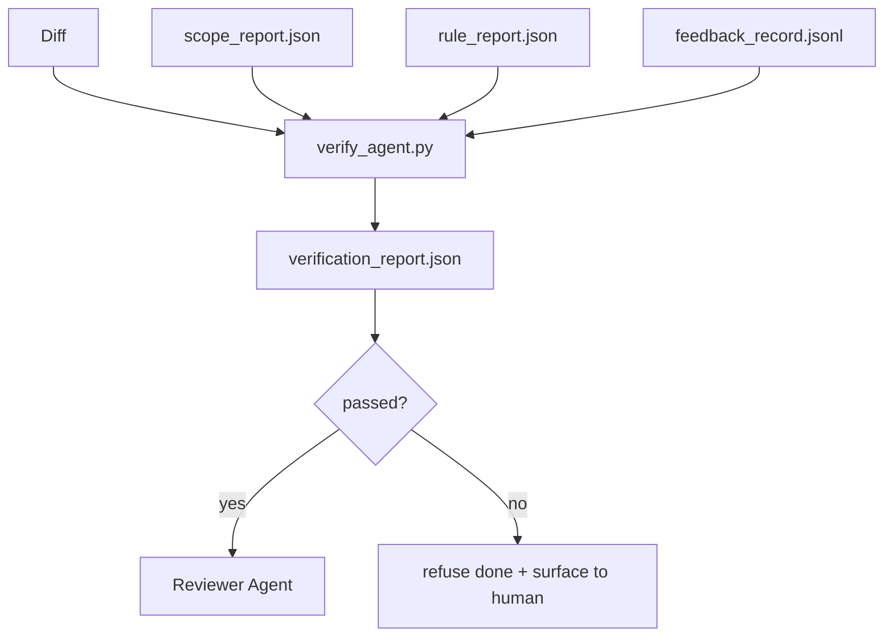

# Ports de vérification

> L'agent ne peut pas mettre son propre travail à jour pour terminer. La porte de vérification Lire le champ de contrat, le journal de rétroaction, le rapport de règles et la différence, et répondre à une question: cette tâche a-t-elle vraiment été terminée?

**Type:** Build
**Languages:** Python (stdlib)
**Prerequisites:** Phase 14 · 33 (Rules), Phase 14 · 36 (Scope), Phase 14 · 37 (Feedback)
**Time:** ~55 分钟

## Objectif de l'apprentissage
- La passerelle de vérification définit comme une fonction de détermination des objets de la table de travail.
- Il y aura un rapport de règles, un rapport de portée, des dossiers de commentaires et des différences.
- 输出评审员代理 和 CI 都能读取的 `verification_report.json`Il y a une autre.
- En cas d'échec de sérieux de blocage, il est possible de refuser de poursuivre la tâche.

##  problématique
Les agents 太容易宣称成功──三种失败形态最常见:

- Le modèle a compris sa différence, puis il a compris que c'était vrai.
- 测试通过了──说得很自信──但没有测试实际运行的记录──
-  satisfaire l'acceptation  les critères d'acceptation sont expliqués assez facilement, jusqu'à ce que tout ce qui est accompli soit accompli

Le système de contrôle de la version est un système de contrôle de la version.

## 概念


### porte 检查什么

| Check | Source artifact | Severity |
|-------|-----------------|----------|
| 所有 acceptance commands 都已运行 | `feedback_record.jsonl` | block |
| 所有 acceptance commands 都以零退出码结束 | `feedback_record.jsonl` | block |
| Scope check 没有 forbidden writes | `scope_report.json` | block |
| Scope check 没有 off-scope writes | `scope_report.json` | block or warn |
| 所有 block-severity rules 都通过 | `rule_report.json` | block |
| feedback 中没有 `null` exit codes | `feedback_record.jsonl` | block |
| Touched files 匹配 `scope.allowed_files` | both | warn |

`warn`trouver un veredicte 添注释;`block`trouver un moyen de vous arrêter`passed: true`Il y a une autre.

### 确定性, et non la probabilité

Pour le même ensemble d'artéfacts, chaque fois, il faut produire le même verdict.

### Un rapport, un chemin.

Chaque tâche est terminée, la porte de la ville en sort une.`verification_report.json`, écrire`outputs/verification/<task_id>.json`✿CI 消费同一路──使用不同路的多个门 会分叉真理源──

### négation

Les résultats de la gravité des blocs ne peuvent être supprimés par un agent. Ils ne peuvent être supprimés que par un humain et doivent être enregistrés.`override_reason`et `overridden_by`L'identifiant de l'utilisateur.


```figure
wb-gate-sequence
```

## - Je le construis.
`code/main.py`实现:

- Chaque chargement d'artisanat, tout en local, fait que le cours se comporte.
- Une .`verify(task_id, artifacts) -> VerdictReport`fonction pure.
- Une imprimante, affichant les résultats de chaque vérification et le succès final.
- Trois scénarios de tâches de démo: passe propre, scope creep, absence d'acceptation

Je vais le faire.

```
python3 code/main.py
```

输出: trois rapports de verdict, chacun enregistré jusqu'au script à côté.

## Mode de production dans le réel

Quatre modèles vont passer de l'autre poste à l'autre.

**Defense-in-depth，而不是 single gate。**Le jeu de jeu de 2026 de 3 mois de micro-services.io note 明确: le jeu de jeu de pré-engagement est inévitable, car il ne dépend pas de l'agent suivant les instructions.

**通过确定性 check 做 defense，model-judge 只处理细微差别。**Les codes de sortie de la série de tests de l'unité, de la vérification du schéma, des codes de sortie) répondent à la question du code si elle a résolu le problème.

**签名 override log，而不是 Slack threads。**Chaque fois que la ville est surchargée`outputs/verification/overrides.jsonl`Le code de recherche, la raison, la signature de l'utilisateur, le commande actuel du Tête de la main.

**将 coverage floor 作为一等 check。** `coverage_report.json`Il y en a un qui entre .`coverage_floor`(par défaut 80%) vérifier. Si la couverture des tests est inférieure au plancher, ou si le plancher de la fusion est inférieur à 1 point de pourcentage, la porte échouera.

**`--strict` mode 会将 warns 提升为 blocks。**pour les branches de libération  les relations publiques de blocage des navires ou le tri après incident,`--strict`Il faut que chaque avertissement soit un échec. Ce drapeau est un choix de branche.

## Utilisez-le
Modèles de production:

- **CI step。** `verify_agent`Les travaux de l'agent sont terminés.`passed: true`La protection de la fusion sera refusée.
- **Pre-handoff hook。**Le temps d'exécution de l'agent dans la production de la livraison de documents
- **Manual triage。**Lorsque l'agent affirme avoir réussi et que l'homme doute, les opérateurs vont lire le rapport.

La porte est le flux de la table de travail.

## Je le livre.
`outputs/skill-verification-gate.md`Pour ce qui est de la sévérité des blocs, quelles écritures hors de portée sont tolérées, surpassent le journal d'audit  comment le stocker.

## 练习
1. - Je suis là.`coverage_floor`vérifier: le commandement de test doit générer un rapport de couverture, et atteindre au moins 80%.
2. 支持 `--strict`mode, sera chaque `warn`提升为 `block` enregistrer le mode strict 适合作为默认值的场景──
3. 让 gate en plus de JSON 另外还生成Markdown summary──论证 论证 哪些领域应属于总结──
4. - Je suis là.`time_since_last_human_touch`Vérifiez: poussée de la touche humaine                                                                                                                                                                                                                                                                                                                                                                                                                                                                                                                  
5. Dans votre produit, le vrai agent diffère de la porte de fonctionnement.

## 关键术语
| Term | What people say | What it actually means |
|------|----------------|------------------------|
| Verification gate | “阻止事情的 check” | 作用于 workbench artifacts 的确定性函数，生成 pass/fail verdict |
| Block severity | “Hard fail” | 会阻止 `passed: true` 并要求签名 override 的 finding |
| Override log | “我们为什么放行它” | 带有 reason 和 user id 的签名条目，由 review 审计 |
| Acceptance command | “证明” | 一个 shell command，其零退出码就是 `done` 的含义 |
| One report path | “Source of truth” | `outputs/verification/<task_id>.json`，由 CI 和 humans 共同消费 |

## 延伸阅读
- [Anthropic, Harness design for long-running application development](https://www.anthropic.com/engineering/harness-design-long-running-apps)
- [OpenAI Agents SDK guardrails](https://platform.openai.com/docs/guides/agents-sdk/guardrails)
- [microservices.io, GenAI dev platform: guardrails](https://microservices.io/post/architecture/2026/03/09/genai-development-platform-part-1-development-guardrails.html) Défense en profondeur entre les engagements préalables et les CI
- [ICMD, The 2026 Playbook for Agentic AI Ops](https://icmd.app/article/the-2026-playbook-for-agentic-ai-ops-guardrails-costs-and-reliability-at-scale-1776661990431) porte d'approbation 阶梯(projet → approbation → voiture en dessous des seuils)
- [Type-Checked Compliance: Deterministic Guardrails (arXiv 2604.01483)](https://arxiv.org/pdf/2604.01483) Lean 4 作为确定性盖टिंग 的上界
- [logi-cmd/agent-guardrails — merge gate 规范](https://github.com/logi-cmd/agent-guardrails) portée + portes de test de mutation
- [Guardrails AI x MLflow](https://guardrailsai.com/blog/guardrails-mlflow) validateurs déterministes  作为 CI 评分器
- [Akira, Real-Time Guardrails for Agentic Systems](https://www.akira.ai/blog/real-time-guardrails-agentic-systems) outil 调用前/后的 portes
- Phase 14 · 27  Défense rapide injection (partie de la porte)
- Phase 14 · 36  Le contrat de portée de l'application
- Phase 14 · 37  Le score de la porte de l'enquête
- Phase 14 · 39  passer la porte à l' agent de l' examinateur
