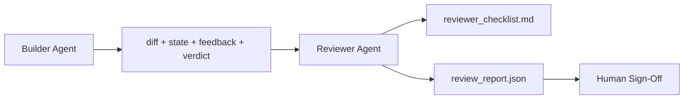

# Agent réviseur: Général Constructeur et Marqueur séparés

> L'agent de rédaction de code ne peut pas le donner. Le réviseur est un deuxième cycle, il utilise différents systèmes de prompt, des objectifs différents, et tout le contenu produit par le constructeur est uniquement accessible à la lecture.

**Type:** Build
**Languages:** Python (stdlib)
**Prerequisites:** Phase 14 · 38 (Verification Gate)
**Time:** ~55 分钟

## Objectif de l'apprentissage
- Expliquer pourquoi un agent ne peut pas examiner son travail de manière fiable.
- 构建一个评论员代理 循环,它消费建筑师文物,并输出结构化评论报告──
- 编写一个评论员条目, selon des critères spécifiques, et non par sentiment.
- Allez voir le réviseur, entrez dans la table de travail, faites un examen artificiel, démarrez un processus de révision.

##  problématique
Vous faites que l'agent répare un bug. Il a édité quatre fichiers, a effectué un test, a effectué un rapport.`passed: true`Deux jours plus tard, tu as découvert que cette réparation résolvait l'autre moitié du bug, et non la moitié correcte.

L'acceptation est nécessaire, mais insuffisante. L'examen du réviseur demande l'acceptation: est-ce que cela a résolu correctement le problème? a-t-il étendu son champ sans explication? a-t-il enregistré les hypothèses qui devraient être contestées? a-t-il permis au bureau de travail de se tenir à la prochaine session dans un état acceptable ?

## 概念


### Rubrique de réviseur

5 dimensions, chaque dimension est évaluée de 0 à 2

| Dimension | Question |
|-----------|----------|
| Problem fit | 这个变更是否解决了任务所陈述的问题，而不是相近的问题？ |
| Scope discipline | 编辑是否限制在 contract 内，或者 contract 的扩展是否是有意为之？ |
| Assumptions | 所有隐藏 assumptions 是否都写在了某个可 review 的地方？ |
| Verification quality | acceptance command 是否真的证明了目标，还是只证明了一个更弱的版本？ |
| Handoff readiness | 下一个 session 是否能从当前状态干净地接手？ |

总分 10 分──低于 7 分是软失败;低于 5 分是硬失败──

### Le critique est un rôle indépendant, pas un modèle indépendant.

Vous pouvez utiliser le même modèle que le constructeur 运行评审器──关键约束是角色分离: différents systèmes de prompt、 différents inputs、对 diff 没有写权──姿态变化就是信号变化──

### réviseur 不能编辑 diff

le réviseur 读取 diff、state、feedback、verdict──它写了一份报告──它不补贴 diff──如果报告说修复这个,下一轮建设者转去做修复;reviewer 回到 review──混合角色会破坏这个段间隔──

### Rubrique de l'examen et porte de vérification par rapport

(Phase 14 · 38) Vérifiez la détermination des faits: acceptation de la mise en œuvre ou non, la régularité de la mise en œuvre ou non, la validité de la procédure ou non, la validité de la procédure ou non, la validité de la procédure ou non, la validité de la procédure ou non, la validité de la procédure ou non, la validité de la procédure ou non, la validité de la procédure ou non, la validité de la procédure ou non, la validité de la procédure ou non, la validité de la procédure ou non, la validité de la procédure ou non, la validité de la procédure ou non, la validité de la procédure ou non, la validité de la procédure ou non, la validité de la procédure ou non, la validité de la procédure ou non, la validité de la procédure ou non, la validité de la procédure ou non, la validité de la procédure ou non, la validité de la procédure ou non, la validité de la procédure ou non, la validité de la procédure ou non, la validité de la procédure ou non, la validité de la procédure est nécessaire.


```figure
wb-builder-marker
```

## - Je le construis.
`code/main.py`实现:

- Une .`ReviewerInputs`Les données classées sont utilisées pour l'analyse des objets.
- Un scorer de rubrique, chaque dimension une fonction. Chaque fonction est déterminante et pour le cours utilise un stub-grade.
- Une .`review_report.json`L'écrivain, contient 5 points, et le verdict.`pass`- Je suis là.`soft_fail`- Je suis là.`hard_fail`)。
- Deux cas de démonstration: un changement de qualité, ainsi qu'un changement de qualité, de qualité et de qualité.

运行:

```
python3 code/main.py
```

输出: Deux rapports d'examen 写入磁盘, et dans la console afficher un un échantillon de la taille.

## Mode de production dans le réel

证据如下:Cloudflare a été lancé en avril 2026 en un système d'examen de code AI, en 30 jours à travers 5 169 reposs ∼48,095 demandes de fusion 运行了 131,246 reviews。review 完成时间中位数为 3 分 39 秒──7 spécialistes ⋅reviewers ⋅security、 performance、code quality、docs、release management、compliance、engineering Codex) ont été lancés par le coordinateur de révision 下并行运行, par le coordinateur de modèle 去重结果 并判断严重度──顶级 ⋅restreet coordinator; spécialistes ⋅运行在更便宜的层上.

Quatre modèles permettent de faire des opérations à grande échelle.

**Specialist pool, not one big reviewer.**Pour les reposs en solo, un revueur de 5 dimensions de rubriques 足足足── une fois que la base de code a des surfaces de sécurité critiques, de performance critique et de docs, on se décompose en des instants plus petits spécialistes──coordinateur faire de la charge; spécialistes de ne pas fonctionner complètement de rubrique──modèle-niveau séparation et aussi naturellement formation: spécialistes peu coûteux, coordonateur coûteux──

**Bias mitigation as design requirement, not optimization.**Les juges de la LLM seront confrontés à quatre types de préjugés stables: les juges seront confrontés à une même catégorie de préjugés, les juges seront confrontés à une même catégorie de préjugés, les juges seront confrontés à une même catégorie de préjugés.

**Calibration set, not vibes.** préparer une collection de 10 à 20 tâches historiques ▌et des jugements corrects connus ▌pour chaque modification rapide ▌pour chaque examen effectué ▌si la cohérence avec les antécédents historiques est inférieure à 80%, les rubriques ▌pour chaque examen publié ▌ont besoin d'une modification ▌; chaque équipe finira par redécouvrir ce point; il est préférable de commencer par le faire ▌

**Hybrid norm with the gate.**La procédure de vérification est la suivante: la procédure de vérification est effectuée par le réviseur.

## Utilisez-le
Modèles de production:

- **Claude Code subagents.**Le commentaire de la revue est publié en PR avec des scores de rubrique.
- **OpenAI Agents SDK handoffs.**Le constructeur, lorsqu'il accomplit sa tâche, la remet au réviseur.
- **Two-model pairing.**Le constructeur 运行在更快、更便宜的模型 上──Reviewer 运行在更强的模型 上, utiliser le contexte de la situation, se concentrer sur le jugement──

Le réviseur est quand les humains ne peuvent pas réaliser personnellement chaque examen, le bureau de travail est le deuxième à sortir.

## Je le livre.
`outputs/skill-reviewer-agent.md`生成一个项目专用评论员条目、一个接入建设器文物的评论员代理 stub, ainsi que l'intégration avec la passerelle de vérification, faire une révision artificielle du rapport écrit 开始, plutôt que du site vide 开始──

## 练习
1. Ajouter la sixième dimension liée à votre domaine de produit. Expliquez pourquoi il n'a pas été absorbé par les cinq dimensions existantes.
2. Avec deux types de systèmes différents de commentaires, le réviseur de l'exploitation peut-il produire un rapport humain?
3. Pour chaque dimension ajoutée`confidence`Dans le cas de la confiance minimale de 0,6%, il a refusé de publier un rapport.
4. Construire un ensemble d'étalonnage: 10 个带有已知正确判决的历史任务闭合――对它们运行审查员――它在哪里与历史记录不一致?
5. 添加一个请求更多证据 供应:reviewer peut在评分前要求建设者运行某特定测试――合适的后退是什么,才能避免循环?

## 关键术语
| Term | What people say | What it actually means |
|------|----------------|------------------------|
| Reviewer rubric | “Checklist” | 五维 0-2 评分，每个维度都有一个书面问题 |
| Soft fail | “Needs revisions” | 总分低于 7；builder 获得需要处理的 findings |
| Hard fail | “Reject” | 总分低于 5，或任一维度为 0；暂停并呈现给 human |
| Role separation | “Different prompt” | 同一个 model 可以承担两个角色；关键约束是 inputs 和 posture |
| Confidence floor | “Don't ship low-signal reports” | 当 rubric 不确定时，拒绝输出 verdict |

## 延伸阅读
- [OpenAI Agents SDK handoffs](https://platform.openai.com/docs/guides/agents-sdk/handoffs)
- [Anthropic Claude Code subagents](https://docs.anthropic.com/en/docs/agents-and-tools/claude-code/sub-agents)
- [Cloudflare, Orchestrating AI Code Review at Scale](https://blog.cloudflare.com/ai-code-review/) 7 个 spécialiste + coordinateur 架构,30 天 131k 次 runs
- [Agent-as-a-Judge: Evaluating Agents with Agents (OpenReview / ICLR)](https://openreview.net/forum?id=DeVm3YUnpj) Indice de référence DevAI,366 exigences de solution hiérarchique
- [Adnan Masood, Rubric-Based Evaluations and LLM-as-a-Judge: Methodologies, Biases, Empirical Validation](https://medium.com/@adnanmasood/rubric-based-evals-llm-as-a-judge-methodologies-and-empirical-validation-in-domain-context-71936b989e80) 4 types de préjugés et de méthodes de réparation
- [MLflow, LLM-as-a-Judge Evaluation](https://mlflow.org/llm-as-a-judge) Utilisation des outils de production du constructeur/évaluateur séparé
- [LangChain, How to Calibrate LLM-as-a-Judge with Human Corrections](https://www.langchain.com/articles/llm-as-a-judge) flux de travail de calibration
- [Evidently AI, LLM-as-a-judge: a complete guide](https://www.evidentlyai.com/llm-guide/llm-as-a-judge)
- [Arize, LLM as a Judge — Primer and Pre-Built Evaluators](https://arize.com/llm-as-a-judge/)
- Phase 14 · 05  Autorefinition et CRITICité (baseline d'auto-révision à l'agent unique)
- Phase 14 · 30  Développement d'un agent Eval-driven (générateur de réglage de calibration)
- Phase 14 · 38  réviseur 读取的验证门
- Phase 14 · 40  Rapport de l'examinateur 输入的交付包
