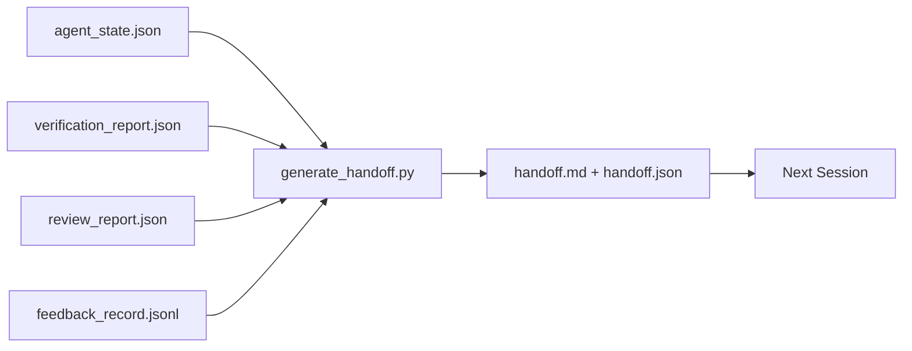

# Transmission en plusieurs sessions

> La session doit se terminer. Le travail n'est pas encore terminé. Le paquet de remise est un artefact, il a transformé l'agent en une session.

**类型:**Construire
**语言:**Python (stdlib)
**先修:**Phase 14 · 34 (mémoire de rapport), phase 14 · 38 (vérification), phase 14 · 39 (réviseur)
**时间:**- 50 minutes

## Objectif de l'apprentissage

- Identifier chaque paquet de remise de fonds dont vous avez besoin
- Des objets de bureau sont fabriqués à la main, et non à la main.
- Les données de commentaires sont à la hauteur des besoins de chaque personne.
- 让下一个会议的第一动作具有确定性──

##  problématique

La première session est terminée. L'agent dit: " Très bien, nous avons fait des progrès. " La prochaine session est ouverte. La prochaine session est ouverte. La première session est terminée.

糟糕的交付成本, va être payé en permanence dans chaque session du cycle de vie de la tâche.

## 概念



### Chaque remise porte sept phrases

| Field | 它回答的问题 |
|-------|---------------------|
| `summary` | 一段话说明完成了什么 |
| `changed_files` | 一眼看清 diff |
| `commands_run` | 实际执行过什么 |
| `failed_attempts` | 尝试过什么，以及为什么没有成功 |
| `open_risks` | 下个 session 可能踩到什么坑，附 severity |
| `next_action` | 下个 session 采取的第一个具体步骤 |
| `verdict_pointer` | 指向 verification + review reports 的路径 |

`next_action`字段是承重字段── 一包含所有内容但缺少 `next_action`Le rapport de situation est le rapport de situation, et non le rapport de situation.

### La remise est générative, pas écrite.

Handwriting handoff,就是在困难日子里会被跳过的 handoff── Générateur 读取工作桌文物并输出包──Trouble de l'agent est de faire en sorte que le travail de bureau soit dans un état général, plutôt que de rédiger un résumé personnel──

### 两种形式: lisible par l'homme et lisible par la machine

`handoff.md`Pour les humains.`handoff.json`供下一个代理 加载── elles proviennent du même groupe d'objets de source── si elles apparaissent, elles sont séparées en JSON 为准──

### Résumé du journal 裁剪

- Je suis en train de le faire .`feedback_record.jsonl`Il y a peut-être des centaines de journaux. Il suffit de porter la dernière K, ainsi que les journaux de chaque sortie.

### 留下干净 état

Les tests de dépistage de la situation sont les mêmes. Si la prochaine session est ouverte à la même heure, l'agent oublie le fichier temporaire de la branche de dépistage, ainsi que les tests qui ne sont pas encore en cours, alors il est parfait.`handoff.md`Il n'y a pas de valeur. Le prochain agent va passer 10 minutes à nettoyer ce qu'il a laissé derrière lui au lieu de continuer à construire.

Ainsi, la séance ne se termine pas par la fonctionnalité 能跑通, mais par le bureau 处于发电机 可以总结, 下一个会议 可以信任的状态时结束.

| Check | Clean means | Dirty blocks because |
|-------|-------------|----------------------|
| Working tree | 每个变更都已 commit，或明确 stash 并附带说明 | 半截 diff 会被下一个 agent 看成有意图的工作 |
| Temp artifacts | 没有 `*.tmp`、scratch dirs、debug prints 或留下的注释块 | 游离文件会污染 diff 和下一个 agent 的 mental model |
| Tests | 绿色，或红色但在 `open_risks` 中命名了失败 | 沉默的红色 test 是下一个 session 会踩进去的陷阱 |
| Feature board | `feature_list.json` status 反映真实状态（Phase 14 · 36） | 过期 board 会把下一个 session 派去做已经完成的工作 |
| Branch | 位于预期 branch，没有 detached HEAD，没有 orphan branches | 错误 branch 会让下一个 session 的第一个 commit 落到错误位置 |

L' élimination de la pollution`clean_state.json`, parmi lesquelles se trouvent des problèmes de blocage;空列表是手机发电机 写包 前要断言的前置条件──建立在脏树上的手机 不是手机,而是转发混乱──两个 artefacts 成对出现:


```figure
wb-handoff-packet
```

## - Je le construis.

`code/main.py`实现:

- Un chargeur, un état, un jugement, une révision et une rétroaction`WorkbenchSnapshot`Il y a une autre.
- Une .`generate_handoff(snapshot) -> (markdown, payload)`函数。
- Un filtre, sélectionnez les dernières entrées de commentaires K 条, ainsi que toutes les sorties non zéro.
- Une démo, écrit à côté du scénario.`handoff.md`et `handoff.json`Il y a une autre.

Je vais le faire.

```
python3 code/main.py
```

输出: corps de remise imprimé, ainsi que les deux documents sur le disque.

## Mode de production réelle

Le codex CLI、Claude Code 和 OpenCode proposent différents programmes de compactage; le paquet de remise structurée se trouve sur le même modèle.

**Compaction 策略各不相同；packet schema 不变。**Le codex CLI POST /v1/responses/compact est une bulle AES opaque du côté du serveur(OpenAI modèles 的快速路径);fallback est un résumé de l'offre, en tant que`_summary`Le code claude dans le contexte atteint 95% 时运行五阶段 progressive compaction。OpenCode utilisation basée sur le timestamp de message caché plus sur le résumé de LLM de 5 titres。三种不同机制,同一个需求:把压缩后保留下来的内容序列化成可移植文物──包就是这个文物──

**Fresh-session handoff 不是 compaction。**Compression 延长一会;handoff 干净地关闭一会,并启动下一个── Hermes Issue #20372 的框架(2026 年 4 月) 是对的: Lorsque la compression en place 开始降低质量时,Agent 应写一条紧缩的交付,结束会议,并恢复在新环境中──paket 让这种转换变得便宜──错误做法是直压到质量崩;修复方式是为早期的干净的交付 预留预算──

**每个 branch 和 topic 只保留一个 active handoff。**La coordination multi-agents est plus due à des offres obsolètes, que à de mauvais modèles.`branch`- Je suis là.`last_known_good_commit`, ainsi que `active | superseded | archived`之一的 `status`Les remises en main seront archivées; seulement actives de celui qui a conduit à la prochaine session.

**在 50-75% context 之前收尾，不要等到撞墙。**Le rapport indique que la session se termine à 50 à 75% du budget du contexte, et non à 95%, l'effet est optimal.

## Utilisez-le

Mode de production:

- **Session-end hook。**Le générateur de l'appareil est en cours de fonctionnement.`outputs/handoff/<session_id>/`Il y a une autre.
- **PR template。**Le générateur de marque peut également être utilisé comme organisme de relations publiques.
- **Cross-agent handoff。**Avec un produit construire, avec un autre continuer, avec un autre continuer, avec un autre continuer.

Les coûts de production sont bas, et les coûts de production sont bas.

##  La publier

`outputs/skill-handoff-generator.md`J'ai créé un générateur de chemins d'artefact adapté au projet, un générateur de son crochet de fin de session, ainsi qu'un agent suivant.`handoff.json`Le schéma

## 练习

1. - Je suis là.`assumptions_to_validate`字段, exposé constructeur enregistré, mais le critique 评分 没有超过1 de chaque hypothèse.
2. Pour les courses défaillantes 和 les courses passantes Utilisation différentes méthodes de coupe résumé des commentaires.
3. 加入一个 问题的人文列表――一个问题进入包,而不是进入聊天消息 的值是什么?
4. 让发电机 具有无效力:运行两次会产生相同的包――要成立,需要什么内容保持稳定?
5. 添加一个 下一个会预备条例  section,精确列出 下一个会 在行动前必须加载的文物──

## 关键术语

| Term | 人们常说 | 实际含义 |
|------|----------------|------------------------|
| Handoff packet | “Session summary” | 携带七个字段的生成 artifact，同时包含 markdown 和 JSON |
| Next action | “首先做什么” | 启动下一个 session 的一个具体步骤 |
| Feedback trim | “Log summary” | 最后 K 条 records 加上每个非零 exit |
| Status report | “我们做了什么” | 缺少 `next_action` 的文档；有用，但不是 handoff |
| Verdict pointer | “Receipt” | 指向 verification + review reports 的路径，用于 traceability |

## 延伸阅读

- [Anthropic，面向 long-running agents 的有效 harnesses](https://www.anthropic.com/engineering/effective-harnesses-for-long-running-agents)
- [OpenAI Agents SDK handoffs](https://platform.openai.com/docs/guides/agents-sdk/handoffs)
- [Codex Blog，Codex CLI Context Compaction：架构、配置、管理长会话](https://codex.danielvaughan.com/2026/03/31/codex-cli-context-compaction-architecture/) POST /v1/ réponses/compact 和 local fallback
- [Justin3go，Shedding Heavy Memories：Context Compaction in Codex, Claude Code, OpenCode](https://justin3go.com/en/posts/2026/04/09-context-compaction-in-codex-claude-code-and-opencode) Compression de trois fournisseurs par rapport à
- [JD Hodges，Claude Handoff Prompt：如何跨 Sessions 保持 Context (2026)](https://www.jdhodges.com/blog/ai-session-handoffs-keep-context-across-conversations/) CLAUDE.md + HANDOVER.md,50 à 75% du budget de contexte
- [Mervin Praison，Managing Handoffs in Multi-Agent Coding Sessions：Fresh Context Without Losing Continuity](https://mer.vin/2026/04/managing-handoffs-in-multi-agent-coding-sessions-fresh-context-without-losing-continuity/) systèmes distribués 视角
- [Hermes Issue #20372 — compression 变得有风险时自动 fresh-session handoff](https://github.com/NousResearch/hermes-agent/issues/20372)
- [Hermes Issue #499 — Context Compaction Quality Overhaul](https://github.com/NousResearch/hermes-agent/issues/499) Les instructions du Codex CLI 中面向交付
- [Microsoft Agent Framework，Compaction](https://learn.microsoft.com/en-us/agent-framework/agents/conversations/compaction)
- [OpenCode，Context Management and Compaction](https://deepwiki.com/sst/opencode/2.4-context-management-and-compaction)
- [LangChain，Context Engineering for Agents](https://www.langchain.com/blog/context-engineering-for-agents)
- Phase 14 · 34  générateur 读取的状态文件
- Phase 14 · 38  paquets
- Phase 14 · 39  打包进包包进 de rapport de l'examinateur
